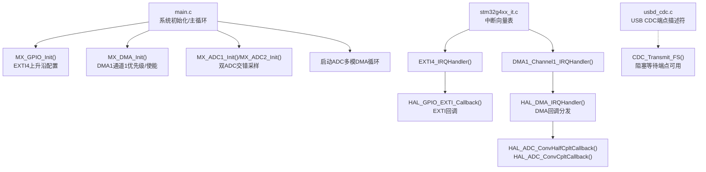
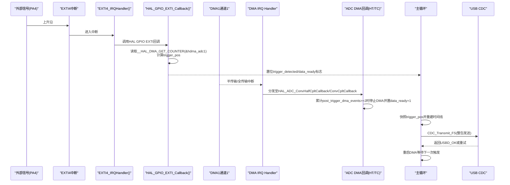
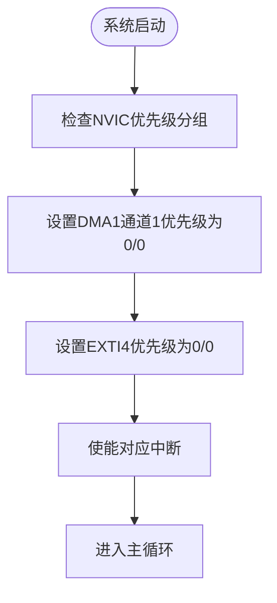
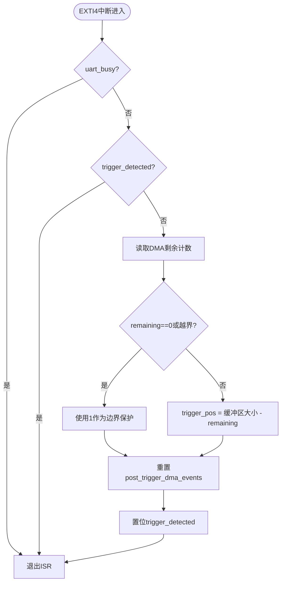
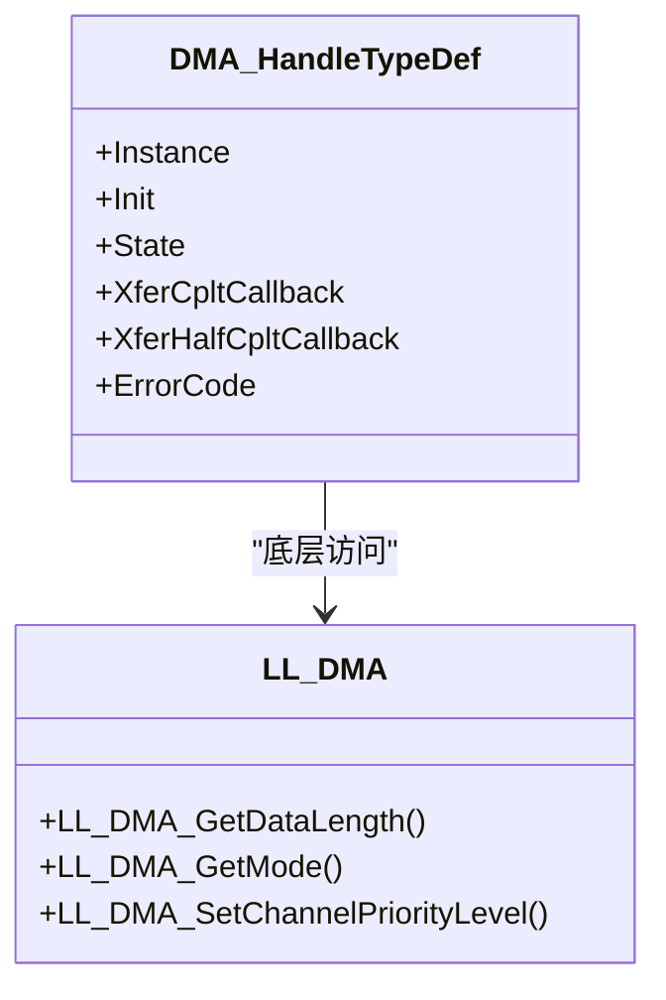
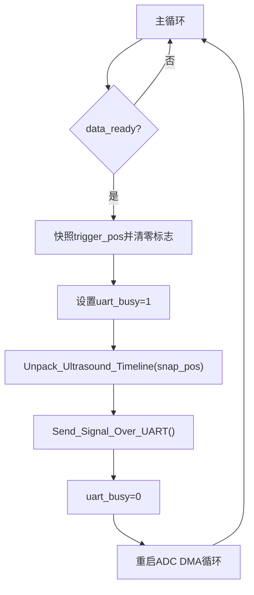
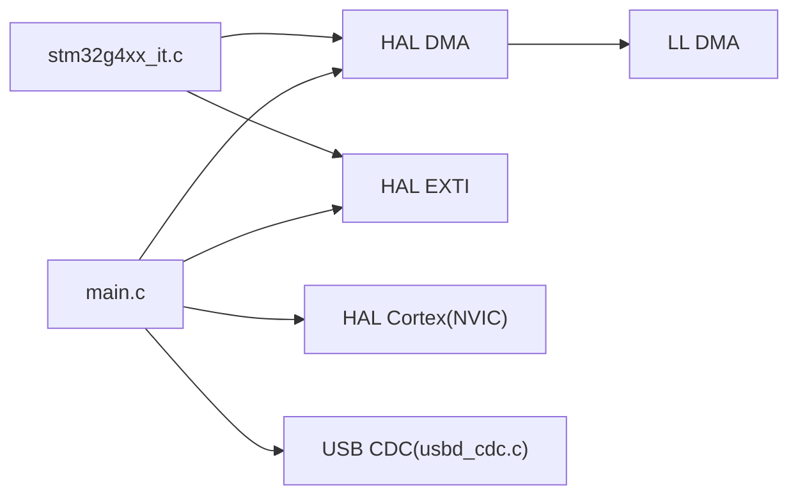

# 实时性保证措施

<cite>
**本文引用的文件**   
- [Core/Src/main.c](file://Core/Src/main.c)
- [Core/Inc/main.h](file://Core/Inc/main.h)
- [Core/Src/stm32g4xx_it.c](file://Core/Src/stm32g4xx_it.c)
- [Core/Inc/stm32g4xx_it.h](file://Core/Inc/stm32g4xx_it.h)
- [Drivers/STM32G4xx_HAL_Driver/Inc/stm32g4xx_hal_dma.h](file://Drivers/STM32G4xx_HAL_Driver/Inc/stm32g4xx_hal_dma.h)
- [Drivers/STM32G4xx_HAL_Driver/Src/stm32g4xx_hal_dma.c](file://Drivers/STM32G4xx_HAL_Driver/Src/stm32g4xx_hal_dma.c)
- [Drivers/STM32G4xx_HAL_Driver/Inc/stm32g4xx_ll_dma.h](file://Drivers/STM32G4xx_HAL_Driver/Inc/stm32g4xx_ll_dma.h)
- [Drivers/STM32G4xx_HAL_Driver/Inc/stm32g4xx_hal_exti.h](file://Drivers/STM32G4xx_HAL_Driver/Inc/stm32g4xx_hal_exti.h)
- [Drivers/STM32G4xx_HAL_Driver/Inc/stm32g4xx_hal_cortex.h](file://Drivers/STM32G4xx_HAL_Driver/Inc/stm32g4xx_hal_cortex.h)
- [Drivers/STM32G4xx_HAL_Driver/Src/stm32g4xx_hal_cortex.c](file://Drivers/STM32G4xx_HAL_Driver/Src/stm32g4xx_hal_cortex.c)
- [Core/Src/system_stm32g4xx.c](file://Core/Src/system_stm32g4xx.c)
- [Middlewares/ST/STM32_USB_Device_Library/Class/CDC/Src/usbd_cdc.c](file://Middlewares/ST/STM32_USB_Device_Library/Class/CDC/Src/usbd_cdc.c)
</cite>

## 目录
1. [引言](#引言)
2. [项目结构](#项目结构)
3. [核心组件](#核心组件)
4. [架构总览](#架构总览)
5. [详细组件分析](#详细组件分析)
6. [依赖关系分析](#依赖关系分析)
7. [性能考量](#性能考量)
8. [故障排查指南](#故障排查指南)
9. [结论](#结论)
10. [附录](#附录)

## 引言
本技术指南围绕该STM32G4项目的“实时性保证措施”展开，聚焦以下目标：
- 中断优先级管理与嵌套策略（NVIC配置）
- EXTI外部中断的亚微秒级触发检测机制
- DMA循环模式与半传输/全传输中断的时序处理
- 主循环状态机与事件驱动调度优化
- 临界区保护与原子操作（trigger_pos快照机制）
- 实时性关键指标与WCET分析方法
- 实时性测试方法与性能验证工具使用建议

## 项目结构
本项目基于STM32CubeMX生成，采用分层组织：
- Core层：应用入口、外设初始化、中断服务程序
- Drivers层：HAL/LL库接口与实现
- Middlewares层：USB CDC设备栈
- CMSIS层：Cortex-M内核抽象与NVIC/SysTick等基础能力

图表来源
- [Core/Src/main.c:243-255](file://Core/Src/main.c#L243-L255)
- [Core/Src/main.c:469-481](file://Core/Src/main.c#L469-L481)
- [Core/Src/main.c:488-520](file://Core/Src/main.c#L488-L520)
- [Core/Src/stm32g4xx_it.c:205-228](file://Core/Src/stm32g4xx_it.c#L205-L228)
- [Middlewares/ST/STM32_USB_Device_Library/Class/CDC/Src/usbd_cdc.c:218-254](file://Middlewares/ST/STM32_USB_Device_Library/Class/CDC/Src/usbd_cdc.c#L218-L254)

章节来源
- [Core/Src/main.c:219-290](file://Core/Src/main.c#L219-L290)
- [Core/Src/stm32g4xx_it.c:205-228](file://Core/Src/stm32g4xx_it.c#L205-L228)
- [Middlewares/ST/STM32_USB_Device_Library/Class/CDC/Src/usbd_cdc.c:218-254](file://Middlewares/ST/STM32_USB_Device_Library/Class/CDC/Src/usbd_cdc.c#L218-L254)

## 核心组件
- 触发检测与时间戳捕获：通过EXTI4上升沿中断在ISR中读取DMA剩余计数，计算环形缓冲写入位置作为触发时刻的时间戳。
- DMA循环采集：ADC1/ADC2双通道交错采样，数据经DMA以循环模式写入环形缓冲；半传输/全传输中断用于判定采集完成窗口。
- 主循环事件处理：检测到data_ready后，对trigger_pos进行快照并重建线性时间线，随后通过USB CDC批量发送。
- 中断优先级：EXTI4与DMA1通道1均设置为最高软件优先级，确保触发与数据传输路径的低延迟。

章节来源
- [Core/Src/main.c:91-113](file://Core/Src/main.c#L91-L113)
- [Core/Src/main.c:119-149](file://Core/Src/main.c#L119-L149)
- [Core/Src/main.c:156-171](file://Core/Src/main.c#L156-L171)
- [Core/Src/main.c:264-289](file://Core/Src/main.c#L264-L289)
- [Core/Src/main.c:469-481](file://Core/Src/main.c#L469-L481)
- [Core/Src/main.c:505-506](file://Core/Src/main.c#L505-L506)

## 架构总览
下图展示了从硬件触发到数据处理与输出的完整实时链路，以及关键中断与回调的交互。

图表来源
- [Core/Src/main.c:91-113](file://Core/Src/main.c#L91-L113)
- [Core/Src/main.c:119-149](file://Core/Src/main.c#L119-L149)
- [Core/Src/main.c:264-289](file://Core/Src/main.c#L264-L289)
- [Core/Src/stm32g4xx_it.c:205-228](file://Core/Src/stm32g4xx_it.c#L205-L228)
- [Middlewares/ST/STM32_USB_Device_Library/Class/CDC/Src/usbd_cdc.c:218-254](file://Middlewares/ST/STM32_USB_Device_Library/Class/CDC/Src/usbd_cdc.c#L218-L254)

## 详细组件分析

### 中断优先级管理系统（NVIC配置与嵌套策略）
- 优先级设置
  - DMA1通道1与EXTI4均被设置为最高软件优先级（抢占优先级0，子优先级0），确保触发与DMA路径具备最短响应时间。
  - 相关API位于HAL Cortex模块，内部通过NVIC_SetPriority编码优先级值并写入寄存器。
- 优先级分组
  - HAL提供优先级分组宏（如NVIC_PRIORITYGROUP_0~4），当前代码未显式调用分组设置，默认继承系统复位后的分组。若需调整抢占/子优先位数，应在系统初始化阶段调用相应函数。
- 嵌套策略
  - 由于EXTI4与DMA1均为最高优先级，二者可相互嵌套；但为避免长耗时操作，ISR仅做最小工作（读NDTR、写volatile标志）。
  - 主循环负责重排数据与USB发送，避免在ISR中进行复杂逻辑。

图表来源
- [Core/Src/main.c:469-481](file://Core/Src/main.c#L469-L481)
- [Core/Src/main.c:505-506](file://Core/Src/main.c#L505-L506)
- [Drivers/STM32G4xx_HAL_Driver/Inc/stm32g4xx_hal_cortex.h:87-102](file://Drivers/STM32G4xx_HAL_Driver/Inc/stm32g4xx_hal_cortex.h#L87-L102)
- [Drivers/STM32G4xx_HAL_Driver/Src/stm32g4xx_hal_cortex.c:185-196](file://Drivers/STM32G4xx_HAL_Driver/Src/stm32g4xx_hal_cortex.c#L185-L196)

章节来源
- [Core/Src/main.c:469-481](file://Core/Src/main.c#L469-L481)
- [Core/Src/main.c:505-506](file://Core/Src/main.c#L505-L506)
- [Drivers/STM32G4xx_HAL_Driver/Inc/stm32g4xx_hal_cortex.h:87-102](file://Drivers/STM32G4xx_HAL_Driver/Inc/stm32g4xx_hal_cortex.h#L87-L102)
- [Drivers/STM32G4xx_HAL_Driver/Src/stm32g4xx_hal_cortex.c:185-196](file://Drivers/STM32G4xx_HAL_Driver/Src/stm32g4xx_hal_cortex.c#L185-L196)

### 触发检测系统的实时性保证（EXTI外部中断）
- 触发引脚与模式
  - PA4配置为上升沿中断，EXTI4中断使能，回调函数在ISR上下文中执行。
- 亚微秒级响应机制
  - 在回调中直接读取DMA剩余计数（__HAL_DMA_GET_COUNTER），结合环形缓冲区大小计算触发时刻对应的写入索引（trigger_pos），并在极短时间内置位标志，避免任何阻塞操作。
- 防抖与重入保护
  - 通过uart_busy屏蔽UART期间的触发，防止回显干扰；通过trigger_detected防止重复触发。

图表来源
- [Core/Src/main.c:91-113](file://Core/Src/main.c#L91-L113)
- [Core/Src/main.c:488-520](file://Core/Src/main.c#L488-L520)

章节来源
- [Core/Src/main.c:91-113](file://Core/Src/main.c#L91-L113)
- [Core/Src/main.c:488-520](file://Core/Src/main.c#L488-L520)
- [Drivers/STM32G4xx_HAL_Driver/Inc/stm32g4xx_hal_exti.h:135-154](file://Drivers/STM32G4xx_HAL_Driver/Inc/stm32g4xx_hal_exti.h#L135-L154)

### DMA传输的实时性特性（循环模式与时序）
- 循环模式与半/全传输中断
  - ADC1配置为连续转换+DMA请求，DMA1通道1以循环模式将ADC1/ADC2交错数据写入环形缓冲。
  - 半传输与全传输回调分别由HAL分发至用户回调，用于累计post_trigger_dma_events，达到阈值后停止DMA并置data_ready。
- 剩余计数与触发定位
  - 在EXTI回调中读取DMA剩余计数，结合缓冲区大小计算触发时刻的写入位置，从而精确定位时间轴。
- 错误与超时处理
  - HAL DMA提供轮询与错误码，但在本应用中主要依赖中断回调与主循环协调。

图表来源
- [Drivers/STM32G4xx_HAL_Driver/Inc/stm32g4xx_hal_dma.h:113-151](file://Drivers/STM32G4xx_HAL_Driver/Inc/stm32g4xx_hal_dma.h#L113-L151)
- [Drivers/STM32G4xx_HAL_Driver/Inc/stm32g4xx_ll_dma.h:1004-1027](file://Drivers/STM32G4xx_HAL_Driver/Inc/stm32g4xx_ll_dma.h#L1004-L1027)
- [Drivers/STM32G4xx_HAL_Driver/Inc/stm32g4xx_ll_dma.h:690-713](file://Drivers/STM32G4xx_HAL_Driver/Inc/stm32g4xx_ll_dma.h#L690-L713)
- [Drivers/STM32G4xx_HAL_Driver/Inc/stm32g4xx_ll_dma.h:923-949](file://Drivers/STM32G4xx_HAL_Driver/Inc/stm32g4xx_ll_dma.h#L923-L949)

章节来源
- [Core/Src/main.c:119-149](file://Core/Src/main.c#L119-L149)
- [Core/Src/main.c:469-481](file://Core/Src/main.c#L469-L481)
- [Drivers/STM32G4xx_HAL_Driver/Src/stm32g4xx_hal_dma.c:618-653](file://Drivers/STM32G4xx_HAL_Driver/Src/stm32g4xx_hal_dma.c#L618-L653)

### 任务调度优化策略（主循环状态机与事件驱动）
- 事件驱动模型
  - 主循环不忙等，仅检查data_ready标志；一旦置位，立即进入处理流程。
- 状态机要点
  - 快照trigger_pos后立即清零相关标志，关闭临界区（通过uart_busy屏蔽EXTI），重建时间线，发送数据，解锁并重启DMA。
- 非阻塞发送
  - USB CDC发送采用整包构建后一次性发送，若端点不可用则短暂延时重试，避免长时间占用CPU。

图表来源
- [Core/Src/main.c:264-289](file://Core/Src/main.c#L264-L289)
- [Core/Src/main.c:156-171](file://Core/Src/main.c#L156-L171)
- [Core/Src/main.c:178-212](file://Core/Src/main.c#L178-L212)

章节来源
- [Core/Src/main.c:264-289](file://Core/Src/main.c#L264-L289)
- [Core/Src/main.c:156-171](file://Core/Src/main.c#L156-L171)
- [Core/Src/main.c:178-212](file://Core/Src/main.c#L178-L212)

### 临界区保护与原子操作（trigger_pos快照机制）
- volatile与临界区
  - trigger_pos、trigger_detected、data_ready、post_trigger_dma_events、uart_busy均声明为volatile，确保跨ISR与主循环可见性。
  - 主循环在读取trigger_pos后立即清零相关标志并设置uart_busy，形成临界区，防止EXTI回调在重建期间修改trigger_pos。
- 原子性保障
  - 对于单字读写（uint16_t/uint8_t），ARM Cortex-M4通常具备原子访问能力；若需更强语义，可使用CMSIS提供的Load-Acquire/Store-Release或独占访问指令。

章节来源
- [Core/Src/main.c:65-70](file://Core/Src/main.c#L65-L70)
- [Core/Src/main.c:264-289](file://Core/Src/main.c#L264-L289)
- [Drivers/CMSIS/Include/cmsis_gcc.h:1453-1593](file://Drivers/CMSIS/Include/cmsis_gcc.h#L1453-L1593)

### 实时性能的关键指标与WCET分析
- 最大中断延迟
  - 定义：从硬件中断发生到ISR第一条指令执行的时钟周期数。受NVIC优先级分组、中断嵌套、总线仲裁影响。
  - 估算方法：统计最坏情况下（多个高优先级中断同时挂起）的上下文保存开销与分支跳转开销。
- 最坏情况执行时间（WCET）
  - 针对关键路径（EXTI回调、DMA回调、主循环重建与发送）逐段分析每条基本块的执行次数上限与分支条件，累加得到WCET。
  - 注意缓存与流水线效应：若启用I-Cache/D-Cache，需考虑命中/缺失的最坏情况。
- 抖动与确定性
  - 通过固定优先级与最小化ISR工作量，降低抖动；在主循环中避免阻塞型IO，必要时使用非阻塞队列。

[本节为通用指导，不直接分析具体文件]

### 实时性测试方法与性能验证工具
- 硬件探针法
  - 在EXTI回调入口与出口翻转GPIO，使用示波器测量从触发边沿到回调结束的时间，评估中断延迟与ISR执行时间。
- 定时器基准法
  - 使用SysTick或高精度定时器在关键路径前后打点，统计平均与最坏执行时间。
- 仿真与静态分析
  - 使用调试器断点与Trace功能（如CoreSight Trace）记录中断时序；结合编译器静态分析工具评估分支复杂度与潜在瓶颈。
- USB CDC吞吐测试
  - 通过上位机接收整包数据，统计端到端延迟与丢包率，验证主循环与USB栈的实时性表现。

[本节为通用指导，不直接分析具体文件]

## 依赖关系分析
- 模块耦合
  - main.c依赖HAL DMA/EXTI/GPIO与USB CDC；stm32g4xx_it.c作为中断路由，转发至HAL回调。
- 外部依赖
  - HAL Cortex提供NVIC优先级设置；LL DMA提供底层寄存器访问；USB CDC提供端点描述符与传输接口。
- 潜在环路
  - 无直接循环依赖；中断回调与主循环通过volatile标志通信，保持松耦合。

图表来源
- [Core/Src/main.c:243-255](file://Core/Src/main.c#L243-L255)
- [Core/Src/stm32g4xx_it.c:205-228](file://Core/Src/stm32g4xx_it.c#L205-L228)
- [Drivers/STM32G4xx_HAL_Driver/Inc/stm32g4xx_ll_dma.h:1004-1027](file://Drivers/STM32G4xx_HAL_Driver/Inc/stm32g4xx_ll_dma.h#L1004-L1027)
- [Middlewares/ST/STM32_USB_Device_Library/Class/CDC/Src/usbd_cdc.c:218-254](file://Middlewares/ST/STM32_USB_Device_Library/Class/CDC/Src/usbd_cdc.c#L218-L254)

章节来源
- [Core/Src/main.c:243-255](file://Core/Src/main.c#L243-L255)
- [Core/Src/stm32g4xx_it.c:205-228](file://Core/Src/stm32g4xx_it.c#L205-L228)
- [Drivers/STM32G4xx_HAL_Driver/Inc/stm32g4xx_ll_dma.h:1004-1027](file://Drivers/STM32G4xx_HAL_Driver/Inc/stm32g4xx_ll_dma.h#L1004-L1027)
- [Middlewares/ST/STM32_USB_Device_Library/Class/CDC/Src/usbd_cdc.c:218-254](file://Middlewares/ST/STM32_USB_Device_Library/Class/CDC/Src/usbd_cdc.c#L218-L254)

## 性能考量
- 中断路径最小化
  - EXTI回调仅做必要计算（读NDTR、写标志），避免任何阻塞或浮点运算。
- DMA循环与批处理
  - 使用循环模式减少中断频率；主循环整包发送降低USB栈调用次数。
- 时钟与功耗
  - 系统时钟配置合理，确保ADC与DMA满足采样率要求；必要时可降低外设时钟以降低抖动。
- 内存布局与缓存
  - 将热点数据置于SRAM，避免Flash访问带来的不确定性；若启用Cache，需关注一致性策略。

[本节为通用指导，不直接分析具体文件]

## 故障排查指南
- 常见问题
  - 触发丢失：检查EXTI引脚配置与去抖电路；确认uart_busy未误屏蔽。
  - 数据错位：核对trigger_pos快照时机与重建算法；验证DMA循环起始地址与缓冲区对齐。
  - USB发送卡顿：检查CDC端点是否可用；适当增加重试间隔或改用异步队列。
- 诊断手段
  - 使用LED或GPIO翻转标记关键路径；配合示波器观察时序。
  - 打印关键变量（trigger_pos、post_trigger_dma_events）辅助定位。

章节来源
- [Core/Src/main.c:91-113](file://Core/Src/main.c#L91-L113)
- [Core/Src/main.c:119-149](file://Core/Src/main.c#L119-L149)
- [Core/Src/main.c:178-212](file://Core/Src/main.c#L178-L212)

## 结论
本项目通过高优先级中断、DMA循环采集与事件驱动主循环，构建了低延迟、确定性的数据采集与输出链路。EXTI回调中的trigger_pos快照机制有效隔离了ISR与主循环的数据竞争，保证了时间轴的准确性。为进一步优化，可在系统初始化阶段明确NVIC优先级分组，引入更严格的原子操作语义，并结合硬件探针与静态分析进行WCET评估与抖动控制。

[本节为总结，不直接分析具体文件]

## 附录
- 系统时钟与FPU
  - system_stm32g4xx.c在SystemInit中开启FPU访问，并提供SystemCoreClock更新机制，便于后续定时与延时配置。
- USB CDC端点描述符
  - usbd_cdc.c定义了命令与数据端点的属性与包大小，影响传输延迟与吞吐。

章节来源
- [Core/Src/system_stm32g4xx.c:181-192](file://Core/Src/system_stm32g4xx.c#L181-L192)
- [Middlewares/ST/STM32_USB_Device_Library/Class/CDC/Src/usbd_cdc.c:218-254](file://Middlewares/ST/STM32_USB_Device_Library/Class/CDC/Src/usbd_cdc.c#L218-L254)