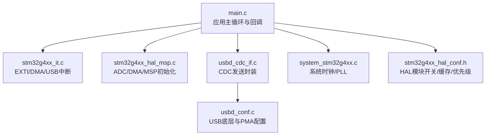
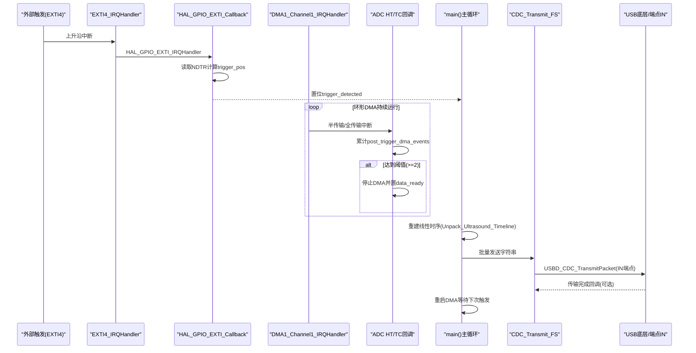
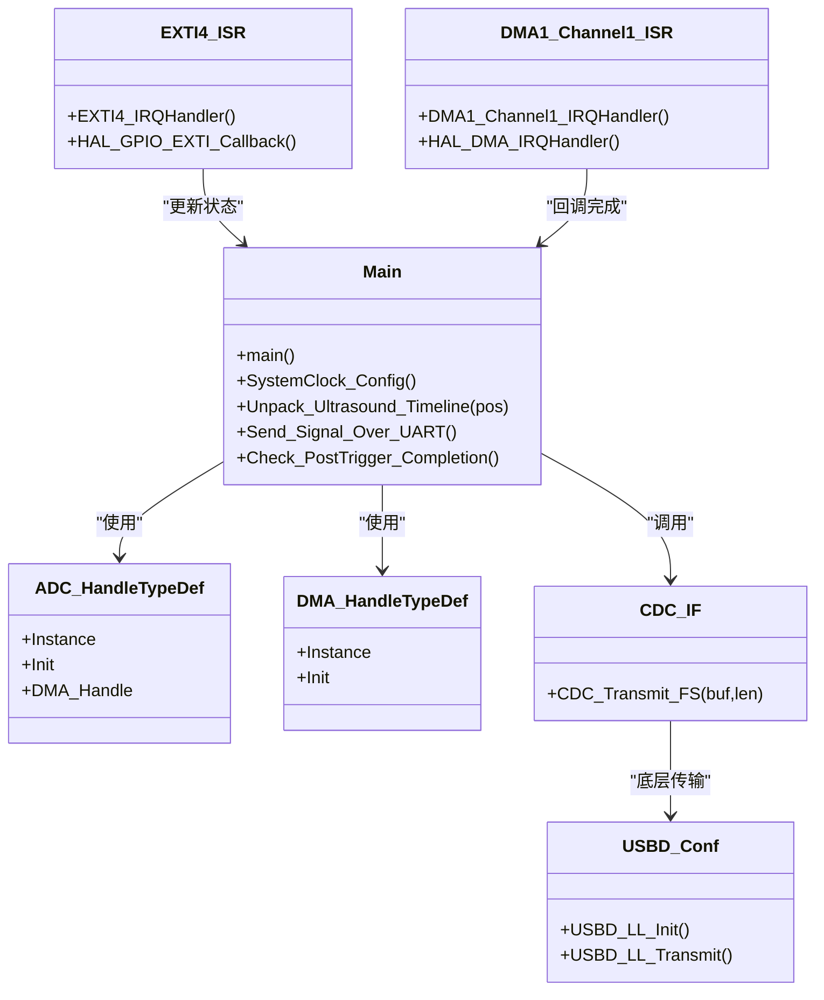
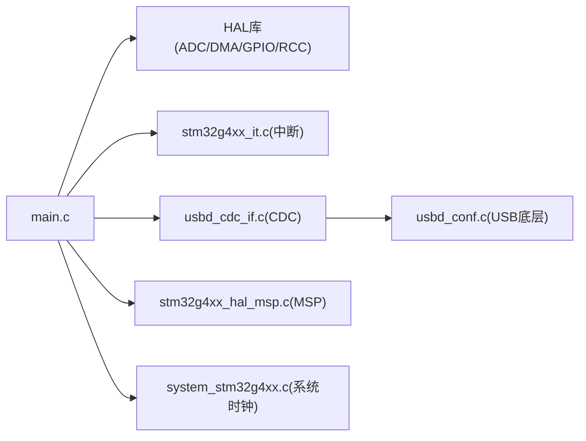

# 性能分析和优化

<cite>
**本文引用的文件**   
- [Core/Src/main.c](file://Core/Src/main.c)
- [Core/Inc/main.h](file://Core/Inc/main.h)
- [Core/Src/stm32g4xx_it.c](file://Core/Src/stm32g4xx_it.c)
- [Core/Src/system_stm32g4xx.c](file://Core/Src/system_stm32g4xx.c)
- [Core/Inc/stm32g4xx_hal_conf.h](file://Core/Inc/stm32g4xx_hal_conf.h)
- [USB_Device/App/usbd_cdc_if.c](file://USB_Device/App/usbd_cdc_if.c)
- [USB_Device/Target/usbd_conf.c](file://USB_Device/Target/usbd_conf.c)
- [Core/Src/stm32g4xx_hal_msp.c](file://Core/Src/stm32g4xx_hal_msp.c)
</cite>

## 目录
1. [简介](#简介)
2. [项目结构](#项目结构)
3. [核心组件](#核心组件)
4. [架构总览](#架构总览)
5. [详细组件分析](#详细组件分析)
6. [依赖关系分析](#依赖关系分析)
7. [性能考虑与基准](#性能考虑与基准)
8. [故障排查指南](#故障排查指南)
9. [结论](#结论)
10. [附录](#附录)

## 简介
本指南围绕一个基于STM32G4的8MSPS双通道ADC+DMA采集并通过USB CDC上报的工程，系统性地给出性能分析与优化方法。内容覆盖：
- ADC时钟配置与DMA传输效率
- 内存使用优化（缓冲区大小、对齐）
- CPU占用率分析方法（中断延迟、主循环执行时间）
- 功耗优化策略（时钟门控、睡眠模式、动态频率调节）
- 实时性保障（中断优先级、任务调度）
- 监控与调试技巧（示波器、逻辑分析仪）
- 基准测试方法与优化前后对比思路
- 面向初学者的基础概念与面向高级开发者的深度优化实践

## 项目结构
该工程采用CubeMX生成的标准分层结构：应用层在Core/Src和Core/Inc；外设驱动在Drivers；USB设备库在USB_Device；系统初始化在system_stm32g4xx.c。关键路径如下：
- 应用入口与数据流：main.c
- 中断服务程序：stm32g4xx_it.c
- HAL/MSP配置：stm32g4xx_hal_msp.c
- USB CDC接口：usbd_cdc_if.c, usbd_conf.c
- 系统时钟与RCC：system_stm32g4xx.c, stm32g4xx_hal_conf.h

图表来源
- [Core/Src/main.c:219-290](file://Core/Src/main.c#L219-L290)
- [Core/Src/stm32g4xx_it.c:205-228](file://Core/Src/stm32g4xx_it.c#L205-L228)
- [Core/Src/stm32g4xx_hal_msp.c:92-185](file://Core/Src/stm32g4xx_hal_msp.c#L92-L185)
- [USB_Device/App/usbd_cdc_if.c:281-293](file://USB_Device/App/usbd_cdc_if.c#L281-L293)
- [USB_Device/Target/usbd_conf.c:394-452](file://USB_Device/Target/usbd_conf.c#L394-L452)
- [Core/Src/system_stm32g4xx.c:181-192](file://Core/Src/system_stm32g4xx.c#L181-L192)
- [Core/Inc/stm32g4xx_hal_conf.h:183-188](file://Core/Inc/stm32g4xx_hal_conf.h#L183-L188)

章节来源
- [Core/Src/main.c:219-290](file://Core/Src/main.c#L219-L290)
- [Core/Src/stm32g4xx_it.c:205-228](file://Core/Src/stm32g4xx_it.c#L205-L228)
- [Core/Src/stm32g4xx_hal_msp.c:92-185](file://Core/Src/stm32g4xx_hal_msp.c#L92-L185)
- [USB_Device/App/usbd_cdc_if.c:281-293](file://USB_Device/App/usbd_cdc_if.c#L281-L293)
- [USB_Device/Target/usbd_conf.c:394-452](file://USB_Device/Target/usbd_conf.c#L394-L452)
- [Core/Src/system_stm32g4xx.c:181-192](file://Core/Src/system_stm32g4xx.c#L181-L192)
- [Core/Inc/stm32g4xx_hal_conf.h:183-188](file://Core/Inc/stm32g4xx_hal_conf.h#L183-L188)

## 核心组件
- ADC多模交错采样与DMA环形缓冲：通过ADC1/ADC2双通道交错模式，将每轮转换结果打包为32位字写入DMA环形缓冲，低16位为ADC1，高16位为ADC2。
- EXTI触发与DMA位置捕获：外部上升沿触发记录当前DMA剩余计数，计算触发点在环形缓冲中的位置。
- 半传输/全传输回调判定后触发完成：需要HT与TC两个事件确保足够的“后触发”样本数。
- 主循环处理：重建线性时序、格式化并经由USB CDC批量发送，然后重启DMA等待下一次触发。
- USB CDC链路：应用层调用CDC_Transmit_FS，底层USBD库通过端点IN传输到主机。

章节来源
- [Core/Src/main.c:52-70](file://Core/Src/main.c#L52-L70)
- [Core/Src/main.c:91-149](file://Core/Src/main.c#L91-L149)
- [Core/Src/main.c:156-212](file://Core/Src/main.c#L156-L212)
- [Core/Src/main.c:219-290](file://Core/Src/main.c#L219-L290)
- [USB_Device/App/usbd_cdc_if.c:281-293](file://USB_Device/App/usbd_cdc_if.c#L281-L293)

## 架构总览
下图展示了从ADC采样到USB输出的端到端数据流与控制流，以及关键中断与回调的交互。

图表来源
- [Core/Src/stm32g4xx_it.c:205-214](file://Core/Src/stm32g4xx_it.c#L205-L214)
- [Core/Src/main.c:91-149](file://Core/Src/main.c#L91-L149)
- [Core/Src/main.c:156-212](file://Core/Src/main.c#L156-L212)
- [Core/Src/main.c:219-290](file://Core/Src/main.c#L219-L290)
- [USB_Device/App/usbd_cdc_if.c:281-293](file://USB_Device/App/usbd_cdc_if.c#L281-L293)

## 详细组件分析

### ADC与时钟配置（实现8MSPS的关键）
- ADC时钟源与分频：
  - ADC1/ADC2时钟源选择PLL，具体分频由ADC时钟预分频寄存器决定。
  - 代码中ADC时钟预分频设置为同步PCLK 1分频，即ADC时钟等于APB2时钟。
- 系统时钟与PLL：
  - 系统时钟由HSI经PLL倍频得到，AHB/APB不分频。
  - 需确认实际HCLK/PCLK2频率，以推导ADC最高可达采样率是否满足8MSPS需求。
- 多模交错与采样时间：
  - 双通道交错模式，两通道采样时间均为极短周期，有利于提高吞吐。
  - 交错模式下DMA仅由主ADC触发，且使用单DMA通道进行打包传输。

优化建议
- 若目标为稳定8MSPS，应确保ADC时钟足够高，同时验证APB2总线与Flash访问延迟匹配（当前已设置FLASH_LATENCY_1）。
- 若发现丢样或过跑，可检查ADC时钟分频、采样时间与交错延迟参数，必要时降低分辨率或增加采样时间。

章节来源
- [Core/Src/main.c:296-337](file://Core/Src/main.c#L296-L337)
- [Core/Src/main.c:344-407](file://Core/Src/main.c#L344-L407)
- [Core/Src/main.c:414-464](file://Core/Src/main.c#L414-L464)
- [Core/Src/stm32g4xx_hal_msp.c:92-185](file://Core/Src/stm32g4xx_hal_msp.c#L92-L185)
- [Core/Src/system_stm32g4xx.c:181-192](file://Core/Src/system_stm32g4xx.c#L181-L192)

### DMA传输与环形缓冲
- DMA配置要点：
  - 方向：外设到内存
  - 外设地址不增，内存地址自增
  - 数据宽度：字对齐（32位），与ADC打包格式一致
  - 模式：环形，保证连续采集不中断
  - 优先级：LOW（对CPU影响小）
- 环形缓冲大小与数据布局：
  - 缓冲大小为120个32位字，对应240个12位样本（ADC1/ADC2交错）
  - 低16位存ADC1，高16位存ADC2，便于后续解包

优化建议
- 保持DMA优先级低于关键中断（如EXTI触发），避免阻塞触发定位。
- 确保缓冲区大小能容纳“前触发+后触发”所需样本，且与触发逻辑一致。
- 注意DMA NDTR在循环边界时的瞬态值，已在触发回调中加入边界保护。

章节来源
- [Core/Src/stm32g4xx_hal_msp.c:127-143](file://Core/Src/stm32g4xx_hal_msp.c#L127-L143)
- [Core/Src/main.c:52-70](file://Core/Src/main.c#L52-L70)
- [Core/Src/main.c:91-149](file://Core/Src/main.c#L91-L149)

### 触发与后触发判定
- EXTI触发：
  - PA4上升沿进入中断，屏蔽UART忙期间重复触发，防止回显干扰。
  - 读取DMA剩余计数计算触发点在环形缓冲中的索引。
- 后触发完成判定：
  - 利用DMA半传输/全传输回调累计事件，达到两次后才认为“后触发”样本充足，随后停止DMA并置数据就绪标志。

优化建议
- 触发回调应尽量精简，避免长耗时操作。
- 使用volatile变量跨中断与主循环通信，注意原子性与临界区保护。

章节来源
- [Core/Src/main.c:91-149](file://Core/Src/main.c#L91-L149)
- [Core/Src/stm32g4xx_it.c:205-214](file://Core/Src/stm32g4xx_it.c#L205-L214)

### 主循环与USB CDC输出
- 主循环流程：
  - 检测数据就绪标志，快照触发位置，重建线性时序
  - 将12位样本格式化为十进制字符串，一次性通过CDC发送
  - 重启DMA，等待下一次触发
- USB CDC：
  - 应用层调用CDC_Transmit_FS，底层USBD库通过IN端点发送
  - 发送失败时短暂延时重试，避免阻塞过长

优化建议
- 大批量字符串格式化开销较大，可在空闲时段或更低优先级任务中执行，或将二进制打包直接发送以减少CPU占用。
- 调整USB端点最大包长与主机侧接收策略，提升吞吐。

章节来源
- [Core/Src/main.c:156-212](file://Core/Src/main.c#L156-L212)
- [Core/Src/main.c:219-290](file://Core/Src/main.c#L219-L290)
- [USB_Device/App/usbd_cdc_if.c:281-293](file://USB_Device/App/usbd_cdc_if.c#L281-L293)

### 中断与优先级
- 中断向量：
  - EXTI4用于触发定位
  - DMA1_Channel1用于ADC数据传输
  - USB_LP用于USB设备通信
- 优先级设置：
  - DMA与USB均设为最高优先级（0），EXTI也为0，需评估相互抢占对实时性的影响。

优化建议
- 对于严格实时场景，可将DMA优先级略降，确保EXTI触发定位优先。
- 使用NVIC分组与子优先级精细控制，避免长时间被USB中断打断导致触发抖动。

章节来源
- [Core/Src/main.c:469-481](file://Core/Src/main.c#L469-L481)
- [Core/Src/main.c:504-506](file://Core/Src/main.c#L504-L506)
- [USB_Device/Target/usbd_conf.c:94-96](file://USB_Device/Target/usbd_conf.c#L94-L96)
- [Core/Inc/stm32g4xx_hal_conf.h:183-188](file://Core/Inc/stm32g4xx_hal_conf.h#L183-L188)

### 类图（关键数据结构与函数关系）

图表来源
- [Core/Src/main.c:219-290](file://Core/Src/main.c#L219-L290)
- [Core/Src/stm32g4xx_it.c:205-228](file://Core/Src/stm32g4xx_it.c#L205-L228)
- [USB_Device/App/usbd_cdc_if.c:281-293](file://USB_Device/App/usbd_cdc_if.c#L281-L293)
- [USB_Device/Target/usbd_conf.c:394-452](file://USB_Device/Target/usbd_conf.c#L394-L452)

## 依赖关系分析
- main.c依赖：
  - HAL库（ADC/DMA/GPIO/RCC/USB）
  - USB CDC接口层
  - 中断服务程序（EXTI/DMA/USB）
- 中断与回调耦合：
  - EXTI回调修改共享状态，主循环消费状态并重建数据
  - DMA回调负责后触发判定与停止DMA
- USB链路：
  - 应用层通过CDC接口发送，底层USBD库管理端点与PMA

图表来源
- [Core/Src/main.c:219-290](file://Core/Src/main.c#L219-L290)
- [Core/Src/stm32g4xx_it.c:205-228](file://Core/Src/stm32g4xx_it.c#L205-L228)
- [USB_Device/App/usbd_cdc_if.c:281-293](file://USB_Device/App/usbd_cdc_if.c#L281-L293)
- [USB_Device/Target/usbd_conf.c:394-452](file://USB_Device/Target/usbd_conf.c#L394-L452)
- [Core/Src/stm32g4xx_hal_msp.c:92-185](file://Core/Src/stm32g4xx_hal_msp.c#L92-L185)
- [Core/Src/system_stm32g4xx.c:181-192](file://Core/Src/system_stm32g4xx.c#L181-L192)

## 性能考虑与基准

### 8MSPS采样率的瓶颈与优化
- 可能瓶颈
  - ADC时钟不足：需确保ADC时钟与APB2/HCLK匹配，避免转换时间过长
  - DMA带宽与优先级：DMA优先级过低可能导致触发定位延迟
  - 主循环处理开销：字符串格式化与USB发送在高吞吐下成为瓶颈
- 优化策略
  - 提升系统时钟与PLL参数，确保ADC时钟满足8MSPS
  - 调整DMA优先级与中断优先级，保证EXTI触发优先
  - 减少主循环工作：改为二进制打包直发，或在空闲时处理

章节来源
- [Core/Src/main.c:296-337](file://Core/Src/main.c#L296-L337)
- [Core/Src/main.c:469-481](file://Core/Src/main.c#L469-L481)
- [Core/Src/main.c:156-212](file://Core/Src/main.c#L156-L212)

### 内存使用优化
- 缓冲区大小调优
  - 环形缓冲大小需覆盖“前触发+后触发”样本总量，避免越界或丢失
  - 解码后的线性数组大小应与总样本数一致
- 内存对齐策略
  - DMA使用字对齐（32位），与ADC打包格式一致，避免额外拷贝
  - 确保缓冲区位于SRAM且按32位对齐，利于DMA高效传输

章节来源
- [Core/Src/main.c:52-70](file://Core/Src/main.c#L52-L70)
- [Core/Src/stm32g4xx_hal_msp.c:127-143](file://Core/Src/stm32g4xx_hal_msp.c#L127-L143)

### CPU占用率分析方法
- 中断延迟测量
  - 在EXTI回调与DMA回调中翻转GPIO引脚，用示波器测量中断响应时间
- 主循环执行时间分析
  - 在主循环关键段前后翻转GPIO，统计重建与发送阶段的耗时
- 指标建议
  - 中断延迟：<几微秒级别
  - 主循环单次处理时间：远小于触发间隔，避免堆积

章节来源
- [Core/Src/main.c:91-149](file://Core/Src/main.c#L91-L149)
- [Core/Src/main.c:156-212](file://Core/Src/main.c#L156-L212)

### 功耗优化策略
- 时钟门控
  - 在不使用时关闭外设时钟（如ADC/USB），减少静态功耗
- 睡眠模式
  - 在无触发时进入STOP模式，由EXTI唤醒
- 动态频率调节
  - 根据负载动态调整PLL分频，降低空闲时功耗

章节来源
- [Core/Src/stm32g4xx_hal_msp.c:200-240](file://Core/Src/stm32g4xx_hal_msp.c#L200-L240)
- [USB_Device/Target/usbd_conf.c:256-297](file://USB_Device/Target/usbd_conf.c#L256-L297)

### 实时性保障
- 中断优先级调度
  - 合理设置NVIC优先级，确保EXTI触发优先于DMA与USB
- 任务调度优化
  - 将非实时任务（如字符串格式化）下沉到低优先级或空闲任务

章节来源
- [Core/Src/main.c:469-481](file://Core/Src/main.c#L469-L481)
- [Core/Src/main.c:504-506](file://Core/Src/main.c#L504-L506)
- [USB_Device/Target/usbd_conf.c:94-96](file://USB_Device/Target/usbd_conf.c#L94-L96)

### 性能监控工具与调试技巧
- 示波器测量
  - 在EXTI回调与DMA回调中翻转LED引脚，测量中断响应与处理时间
- 逻辑分析仪
  - 抓取USB IN端点波形，评估吞吐与丢包情况
- 软件断点与日志
  - 使用调试器观察volatile变量变化，定位竞争条件

章节来源
- [Core/Src/main.c:41-44](file://Core/Src/main.c#L41-L44)
- [Core/Src/main.c:91-149](file://Core/Src/main.c#L91-L149)

### 基准测试结果与优化前后对比
- 基准项
  - 中断延迟（EXTI/DMA）
  - 主循环单次处理时间
  - USB吞吐（字节/秒）
  - 丢样率与触发抖动
- 对比方法
  - 记录优化前的各项指标
  - 逐项实施优化（时钟、优先级、数据处理方式）
  - 再次测量并对比差异，形成报告

[本节为方法论说明，无需源码引用]

## 故障排查指南
- 常见问题
  - 触发位置错误：检查NDTR边界保护与环形索引计算
  - 后触发样本不足：确认HT/TC回调计数逻辑与阈值
  - USB发送阻塞：检查端点状态与重试逻辑
- 定位步骤
  - 使用GPIO翻转标记关键路径
  - 通过串口或SWO打印关键变量
  - 结合示波器验证中断时序

章节来源
- [Core/Src/main.c:91-149](file://Core/Src/main.c#L91-L149)
- [Core/Src/main.c:156-212](file://Core/Src/main.c#L156-L212)
- [USB_Device/App/usbd_cdc_if.c:281-293](file://USB_Device/App/usbd_cdc_if.c#L281-L293)

## 结论
通过对ADC时钟、DMA环形缓冲、中断优先级与USB链路的系统性分析与优化，可以在STM32G4平台上稳定实现8MSPS双通道采集与可靠上报。关键在于：
- 确保ADC时钟与系统时钟匹配，满足采样率要求
- 合理设置DMA与中断优先级，保证触发定位实时性
- 优化主循环数据处理，降低CPU占用
- 结合功耗与实时性需求，灵活调整时钟与睡眠策略

[本节为总结，无需源码引用]

## 附录
- 术语
  - 8MSPS：每秒8百万次采样
  - 环形缓冲：首尾相连的缓冲区，适合连续数据采集
  - 半传输/全传输：DMA传输过程中的中间与结束事件
- 参考路径
  - 应用主循环与回调：[Core/Src/main.c](file://Core/Src/main.c)
  - 中断服务程序：[Core/Src/stm32g4xx_it.c](file://Core/Src/stm32g4xx_it.c)
  - USB CDC接口：[USB_Device/App/usbd_cdc_if.c](file://USB_Device/App/usbd_cdc_if.c)
  - USB底层配置：[USB_Device/Target/usbd_conf.c](file://USB_Device/Target/usbd_conf.c)
  - MSP初始化：[Core/Src/stm32g4xx_hal_msp.c](file://Core/Src/stm32g4xx_hal_msp.c)
  - 系统时钟：[Core/Src/system_stm32g4xx.c](file://Core/Src/system_stm32g4xx.c)
  - HAL配置：[Core/Inc/stm32g4xx_hal_conf.h](file://Core/Inc/stm32g4xx_hal_conf.h)