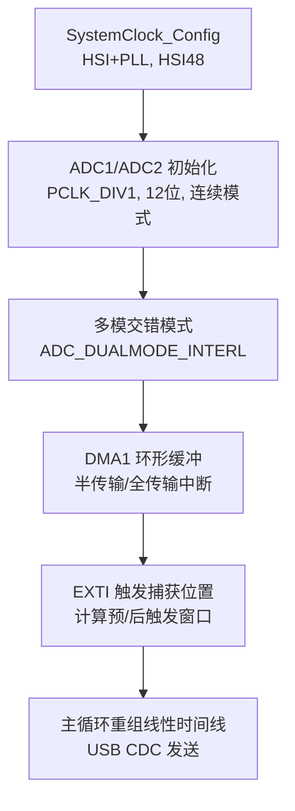
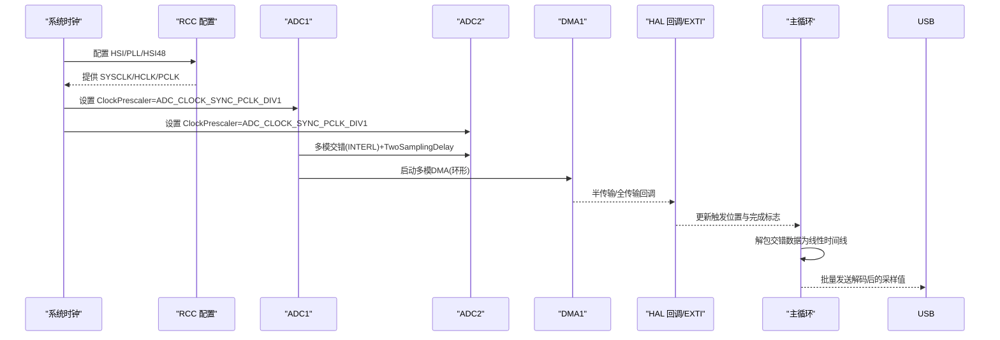
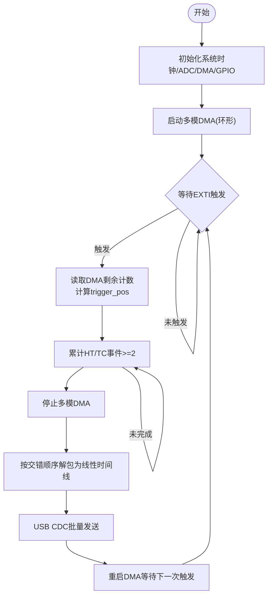
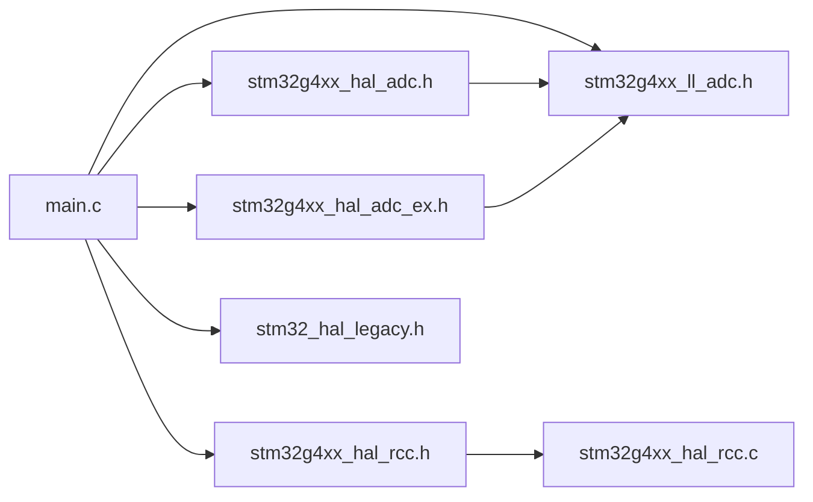

# 采样率优化

<cite>
**本文引用的文件**
- [Core/Src/main.c](file://Core/Src/main.c)
- [Core/Inc/main.h](file://Core/Inc/main.h)
- [Drivers/STM32G4xx_HAL_Driver/Inc/stm32g4xx_hal_adc.h](file://Drivers/STM32G4xx_HAL_Driver/Inc/stm32g4xx_hal_adc.h)
- [Drivers/STM32G4xx_HAL_Driver/Inc/stm32g4xx_hal_adc_ex.h](file://Drivers/STM32G4xx_HAL_Driver/Inc/stm32g4xx_hal_adc_ex.h)
- [Drivers/STM32G4xx_HAL_Driver/Inc/stm32g4xx_ll_adc.h](file://Drivers/STM32G4xx_HAL_Driver/Inc/stm32g4xx_ll_adc.h)
- [Drivers/STM32G4xx_HAL_Driver/Inc/Legacy/stm32_hal_legacy.h](file://Drivers/STM32G4xx_HAL_Driver/Inc/Legacy/stm32_hal_legacy.h)
- [Drivers/STM32G4xx_HAL_Driver/Inc/stm32g4xx_hal_rcc.h](file://Drivers/STM32G4xx_HAL_Driver/Inc/stm32g4xx_hal_rcc.h)
- [Drivers/STM32G4xx_HAL_Driver/Src/stm32g4xx_hal_rcc.c](file://Drivers/STM32G4xx_HAL_Driver/Src/stm32g4xx_hal_rcc.c)
- [G4test.ioc](file://G4test.ioc)
</cite>

## 目录
1. [简介](#简介)
2. [项目结构](#项目结构)
3. [核心组件](#核心组件)
4. [架构总览](#架构总览)
5. [详细组件分析](#详细组件分析)
6. [依赖关系分析](#依赖关系分析)
7. [性能考量](#性能考量)
8. [故障排查指南](#故障排查指南)
9. [结论](#结论)
10. [附录](#附录)

## 简介
本技术指南围绕 STM32G4 的 ADC 双通道交错模式，系统阐述如何实现并优化至 8 MSPS 的双通道采样率。内容涵盖：
- ADC 时钟与 PCLK 分频对性能的影响，重点解释 ADC_CLOCK_SYNC_PCLK_DIV1 的作用
- 采样时间 ADC_SAMPLETIME_2CYCLES_5 的选择依据与时序要求
- 交错模式参数调优（TwoSamplingDelay、DMA 访问模式）
- DMA 环形缓冲与触发采集流程的最佳实践
- 初学者友好的 ADC 工作原理与采样定理说明
- 面向高级开发者的时钟树分析与时序优化技巧

## 项目结构
本项目基于 STM32CubeMX 生成，应用主逻辑集中在 main.c，ADC 相关宏定义与类型在 HAL/LL 驱动头文件中提供，RCC 配置位于 SystemClock_Config。关键路径如下：
- 系统时钟与外设初始化：SystemClock_Config、MX_GPIO_Init、MX_DMA_Init、MX_ADC1_Init、MX_ADC2_Init
- 数据流：ADC 双通道交错转换 → DMA 环形缓冲 → EXTI 触发定位 → 主循环重组与 USB CDC 输出

图表来源
- [Core/Src/main.c:296-337](file://Core/Src/main.c#L296-L337)
- [Core/Src/main.c:344-407](file://Core/Src/main.c#L344-L407)
- [Core/Src/main.c:414-464](file://Core/Src/main.c#L414-L464)
- [Core/Src/main.c:469-481](file://Core/Src/main.c#L469-L481)

章节来源
- [Core/Src/main.c:296-337](file://Core/Src/main.c#L296-L337)
- [Core/Src/main.c:344-407](file://Core/Src/main.c#L344-L407)
- [Core/Src/main.c:414-464](file://Core/Src/main.c#L414-L464)
- [Core/Src/main.c:469-481](file://Core/Src/main.c#L469-L481)

## 核心组件
- ADC 时钟源与分频：通过 ADC ClockPrescaler 选择同步时钟源及分频系数。当前使用 ADC_CLOCK_SYNC_PCLK_DIV1，即 ADC 同步时钟直接来自 PCLK（APB 总线时钟）。
- 分辨率与对齐：12 位分辨率，右对齐，单次转换结束标志用于 DMA 触发。
- 连续转换模式：ENABLE，确保稳定流水线吞吐。
- 多模交错模式：ADC_DUALMODE_INTERL，实现 ADC1/ADC2 交替采样，等效提升采样率。
- TwoSamplingDelay：设置为 ADC_TWOSAMPLINGDELAY_4CYCLES，保证两路采样相位间的最小隔离。
- 采样时间：ADC_SAMPLETIME_2CYCLES_5，最小可用采样周期之一，兼顾速度与输入阻抗约束。
- DMA 环形缓冲：主循环中启动 ADC 多模 DMA，利用半传输/全传输回调计数以确保足够“后触发”样本数。
- 触发与重建：EXTI 上升沿捕获 DMA 剩余计数，推算触发点；随后按交错顺序解包为线性时间序列。

章节来源
- [Core/Src/main.c:360-375](file://Core/Src/main.c#L360-L375)
- [Core/Src/main.c:381-389](file://Core/Src/main.c#L381-L389)
- [Core/Src/main.c:393-402](file://Core/Src/main.c#L393-L402)
- [Core/Src/main.c:429-442](file://Core/Src/main.c#L429-L442)
- [Core/Src/main.c:450-459](file://Core/Src/main.c#L450-L459)
- [Core/Src/main.c:249-255](file://Core/Src/main.c#L249-L255)
- [Core/Src/main.c:91-113](file://Core/Src/main.c#L91-L113)
- [Core/Src/main.c:156-171](file://Core/Src/main.c#L156-L171)

## 架构总览
下图展示从系统时钟到 ADC 数据输出的完整链路，标注了关键配置项及其相互影响。

图表来源
- [Core/Src/main.c:296-337](file://Core/Src/main.c#L296-L337)
- [Core/Src/main.c:360-375](file://Core/Src/main.c#L360-L375)
- [Core/Src/main.c:381-389](file://Core/Src/main.c#L381-L389)
- [Core/Src/main.c:249-255](file://Core/Src/main.c#L249-L255)
- [Core/Src/main.c:136-149](file://Core/Src/main.c#L136-L149)
- [Core/Src/main.c:91-113](file://Core/Src/main.c#L91-L113)
- [Core/Src/main.c:156-171](file://Core/Src/main.c#L156-L171)

## 详细组件分析

### 时钟与 PCLK 分频对 ADC 性能的影响
- 系统时钟路径：HSI 经 PLL 倍频产生 SYSCLK，AHB/APB 分频得到 HCLK/PCLK。代码中将 APB1/APB2 均设为不分频（DIV1），因此 PCLK = HCLK = SYSCLK。
- ADC 同步时钟：ADC_CLOCK_SYNC_PCLK_DIV1 表示 ADC 同步时钟直接取自 PCLK，无额外分频。该模式下需满足参考手册关于 50% 占空比的约束（当以 HCLK/1 作为同步时钟源时）。
- 实际 ADC 时钟频率：由 PCLK 决定。若 PCLK 为 170 MHz（典型配置下），则 ADC 时钟可达 170 MHz。结合 12 位转换所需固定处理周期与采样时间，可实现接近 8 MSPS 的等效采样率（见后文“性能考量”）。

章节来源
- [Core/Src/main.c:296-337](file://Core/Src/main.c#L296-L337)
- [Core/Src/main.c:360-361](file://Core/Src/main.c#L360-L361)
- [Core/Src/main.c:429-430](file://Core/Src/main.c#L429-L430)
- [Drivers/STM32G4xx_HAL_Driver/Inc/stm32g4xx_hal_adc.h:575-580](file://Drivers/STM32G4xx_HAL_Driver/Inc/stm32g4xx_hal_adc.h#L575-L580)
- [Drivers/STM32G4xx_HAL_Driver/Inc/stm32g4xx_ll_adc.h:744-746](file://Drivers/STM32G4xx_HAL_Driver/Inc/stm32g4xx_ll_adc.h#L744-L746)
- [Drivers/STM32G4xx_HAL_Driver/Inc/stm32g4xx_hal_rcc.h:3308-3310](file://Drivers/STM32G4xx_HAL_Driver/Inc/stm32g4xx_hal_rcc.h#L3308-L3310)

### 采样时间 ADC_SAMPLETIME_2CYCLES_5 的选择与时序
- 含义：采样时间为 2.5 个 ADC 时钟周期，属于可用的最短采样时间之一。
- 适用场景：低源阻抗信号源、短走线、较小输入电容，可接受较高噪声与较低建立时间裕量。
- 时序组成：一次 12 位转换包含固定处理周期（约 12.5 个 ADC 时钟周期）加上采样时间。在交错模式下，两个 ADC 交替执行，整体吞吐近似等于单个 ADC 的转换速率。
- 验证方法：根据 PCLK 与 ADC 时钟分频计算 ADC 时钟频率，再结合采样时间与处理周期估算单通道转换时间，进而推导等效采样率。

章节来源
- [Core/Src/main.c:395](file://Core/Src/main.c#L395)
- [Core/Src/main.c:452](file://Core/Src/main.c#L452)
- [Drivers/STM32G4xx_HAL_Driver/Inc/stm32g4xx_hal_adc.h:804-814](file://Drivers/STM32G4xx_HAL_Driver/Inc/stm32g4xx_hal_adc.h#L804-L814)
- [Drivers/STM32G4xx_HAL_Driver/Inc/stm32g4xx_ll_adc.h:1707-1722](file://Drivers/STM32G4xx_HAL_Driver/Inc/stm32g4xx_ll_adc.h#L1707-L1722)

### 交错模式与 TwoSamplingDelay 调优
- 模式：ADC_DUALMODE_INTERL 启用双 ADC 交错模式，使 ADC1 与 ADC2 交替进行采样，提高有效采样率。
- TwoSamplingDelay：设置为 ADC_TWOSAMPLINGDELAY_4CYCLES，用于控制两次采样阶段之间的最小延迟，避免内部开关切换与电荷共享引起的干扰。
- DMA 访问模式：ADC_DMAACCESSMODE_12_10_BITS 适配 12 位数据打包，降低总线带宽占用。
- 最佳实践：
  - 保持 TwoSamplingDelay 至少为 4 周期，必要时增大至 6~8 周期以降低串扰。
  - 在极高输入阻抗或长走线条件下，适当增加采样时间以提升信噪比。
  - 确保 DMA 连续请求开启（主 ADC）且缓冲区大小足以容纳预/后触发窗口。

章节来源
- [Core/Src/main.c:381-389](file://Core/Src/main.c#L381-L389)
- [Drivers/STM32G4xx_HAL_Driver/Inc/stm32g4xx_hal_adc_ex.h:473-502](file://Drivers/STM32G4xx_HAL_Driver/Inc/stm32g4xx_hal_adc_ex.h#L473-L502)
- [Drivers/STM32G4xx_HAL_Driver/Inc/stm32g4xx_ll_adc.h:2304-2335](file://Drivers/STM32G4xx_HAL_Driver/Inc/stm32g4xx_ll_adc.h#L2304-L2335)

### DMA 访问模式与采样延迟优化
- DMA 环形缓冲：使用 120 个 uint32_t 单元，每个单元打包 ADC1/ADC2 各 16 位数据，形成交错序列。
- 中断策略：半传输与全传输回调共同计数，确保“后触发”窗口达到目标样本数后再停止并返回数据。
- 触发定位：EXTI 回调读取 DMA 剩余计数，反推触发点在环形缓冲中的索引，从而截取预触发与后触发片段。
- 优化建议：
  - 将 DMA 优先级设为最高，减少中断延迟抖动。
  - 合理设置缓冲区长度，平衡内存占用与触发窗口灵活性。
  - 在主循环中尽快重组数据并发送，避免阻塞后续触发。

章节来源
- [Core/Src/main.c:53-69](file://Core/Src/main.c#L53-L69)
- [Core/Src/main.c:136-149](file://Core/Src/main.c#L136-L149)
- [Core/Src/main.c:91-113](file://Core/Src/main.c#L91-L113)
- [Core/Src/main.c:156-171](file://Core/Src/main.c#L156-L171)
- [Core/Src/main.c:469-481](file://Core/Src/main.c#L469-L481)

### 触发与数据重组流程

图表来源
- [Core/Src/main.c:91-113](file://Core/Src/main.c#L91-L113)
- [Core/Src/main.c:119-131](file://Core/Src/main.c#L119-L131)
- [Core/Src/main.c:156-171](file://Core/Src/main.c#L156-L171)
- [Core/Src/main.c:249-255](file://Core/Src/main.c#L249-L255)
- [Core/Src/main.c:264-289](file://Core/Src/main.c#L264-L289)

## 依赖关系分析
- 模块耦合：
  - main.c 依赖 HAL/LL 驱动提供的 ADC、DMA、GPIO、RCC 接口。
  - HAL 层依赖 LL 层寄存器操作与宏定义。
  - Legacy 宏兼容旧命名，便于迁移。
- 外部依赖：
  - USB CDC 用于数据输出，非本次采样率优化的核心，但影响主循环阻塞行为。
- 潜在环路：
  - 回调与主循环通过 volatile 标志通信，注意临界区保护与原子性（示例中使用快照方式规避竞争）。

图表来源
- [Core/Src/main.c:296-337](file://Core/Src/main.c#L296-L337)
- [Core/Src/main.c:344-407](file://Core/Src/main.c#L344-L407)
- [Core/Src/main.c:414-464](file://Core/Src/main.c#L414-L464)
- [Drivers/STM32G4xx_HAL_Driver/Inc/stm32g4xx_hal_adc.h:575-580](file://Drivers/STM32G4xx_HAL_Driver/Inc/stm32g4xx_hal_adc.h#L575-L580)
- [Drivers/STM32G4xx_HAL_Driver/Inc/stm32g4xx_hal_adc_ex.h:473-502](file://Drivers/STM32G4xx_HAL_Driver/Inc/stm32g4xx_hal_adc_ex.h#L473-L502)
- [Drivers/STM32G4xx_HAL_Driver/Inc/stm32g4xx_ll_adc.h:744-746](file://Drivers/STM32G4xx_HAL_Driver/Inc/stm32g4xx_ll_adc.h#L744-L746)
- [Drivers/STM32G4xx_HAL_Driver/Inc/Legacy/stm32_hal_legacy.h:75-79](file://Drivers/STM32G4xx_HAL_Driver/Inc/Legacy/stm32_hal_legacy.h#L75-L79)
- [Drivers/STM32G4xx_HAL_Driver/Src/stm32g4xx_hal_rcc.c:127-148](file://Drivers/STM32G4xx_HAL_Driver/Src/stm32g4xx_hal_rcc.c#L127-L148)

章节来源
- [Core/Src/main.c:296-337](file://Core/Src/main.c#L296-L337)
- [Drivers/STM32G4xx_HAL_Driver/Inc/stm32g4xx_hal_adc.h:575-580](file://Drivers/STM32G4xx_HAL_Driver/Inc/stm32g4xx_hal_adc.h#L575-L580)
- [Drivers/STM32G4xx_HAL_Driver/Inc/stm32g4xx_hal_adc_ex.h:473-502](file://Drivers/STM32G4xx_HAL_Driver/Inc/stm32g4xx_hal_adc_ex.h#L473-L502)
- [Drivers/STM32G4xx_HAL_Driver/Inc/stm32g4xx_ll_adc.h:744-746](file://Drivers/STM32G4xx_HAL_Driver/Inc/stm32g4xx_ll_adc.h#L744-L746)
- [Drivers/STM32G4xx_HAL_Driver/Inc/Legacy/stm32_hal_legacy.h:75-79](file://Drivers/STM32G4xx_HAL_Driver/Inc/Legacy/stm32_hal_legacy.h#L75-L79)
- [Drivers/STM32G4xx_HAL_Driver/Src/stm32g4xx_hal_rcc.c:127-148](file://Drivers/STM32G4xx_HAL_Driver/Src/stm32g4xx_hal_rcc.c#L127-L148)

## 性能考量
- 理论采样率估算：
  - 12 位转换固定处理周期约为 12.5 个 ADC 时钟周期。
  - 采样时间 ADC_SAMPLETIME_2CYCLES_5 为 2.5 个 ADC 时钟周期。
  - 单通道转换时间 ≈ 12.5 + 2.5 = 15 个 ADC 时钟周期。
  - 交错模式下，ADC1/ADC2 交替执行，等效采样率 ≈ 2 × (ADC 时钟频率 / 15)。
  - 若 ADC 时钟为 170 MHz（PCLK=170 MHz，DIV1），则等效采样率 ≈ 2 × (170 MHz / 15) ≈ 22.67 MSPS。
  - 实际应用中受限于输入电路、TwoSamplingDelay、DMA 与中断开销，通常保守设定为 8 MSPS 级别，以满足稳定性与信噪比需求。
- 不同配置的对比思路：
  - 调整采样时间：增大采样时间可降低噪声，但会减少最大采样率。
  - 调整 TwoSamplingDelay：增大可减少串扰，但会增加最小间隔。
  - 调整 ADC 时钟分频：降低分频可提高 ADC 时钟，但需满足占空比与功耗约束。
- 实测建议：
  - 使用已知频率正弦波激励，统计单位时间内采样点数，计算实际采样率。
  - 观察频谱泄漏与混叠，评估抗混叠滤波器与采样率匹配度。
  - 记录 DMA 中断延迟与主循环耗时，确保不丢样。

[本节为通用性能讨论，无需特定文件引用]

## 故障排查指南
- 常见问题与对策：
  - 触发丢失或重复：检查 EXTI 优先级与去抖逻辑，确保 uart_busy 保护生效。
  - 数据错位：确认 trigger_pos 快照时机与 DMA 剩余计数边界保护。
  - 采样率不足：核查 ADC 时钟分频、采样时间与 TwoSamplingDelay 组合是否满足时序。
  - 噪声过大：增加采样时间或减小输入阻抗，优化 PCB 布局与屏蔽。
- 调试手段：
  - 使用 LED 翻转测量中断响应时间。
  - 通过 USB CDC 输出原始 DMA 缓冲，离线分析交错顺序与完整性。
  - 调整缓冲区大小与阈值，验证“后触发”窗口是否足够。

章节来源
- [Core/Src/main.c:91-113](file://Core/Src/main.c#L91-L113)
- [Core/Src/main.c:119-131](file://Core/Src/main.c#L119-L131)
- [Core/Src/main.c:156-171](file://Core/Src/main.c#L156-L171)
- [Core/Src/main.c:249-255](file://Core/Src/main.c#L249-L255)

## 结论
通过将 ADC 同步时钟设置为 ADC_CLOCK_SYNC_PCLK_DIV1、采用 12 位分辨率与最小采样时间、配合交错模式与合理的 TwoSamplingDelay，可在 STM32G4 上实现稳定的高吞吐采样。DMA 环形缓冲与 EXTI 触发定位确保了数据的实时性与完整性。对于更高精度与更低噪声的应用，可适当增加采样时间与 TwoSamplingDelay，并在输入前端加入合适的抗混叠滤波。

[本节为总结性内容，无需特定文件引用]

## 附录

### 初学者入门：ADC 工作原理与采样定理
- ADC 工作原理：模拟输入经采样保持电路采样，再通过逐次逼近型转换器转换为数字码。采样时间越长，输入电容充电越充分，结果更稳定。
- 采样定理：为避免混叠，采样频率应大于信号最高频率的两倍。交错模式可将等效采样率翻倍，有助于满足高频信号的采样需求。

[本节为概念性内容，无需特定文件引用]

### 高级开发者：时钟树与时序优化技巧
- 时钟树要点：
  - HSI 经 PLL 倍频产生 SYSCLK，AHB/APB 不分频得到 PCLK。
  - ADC 同步时钟直接取自 PCLK，需关注占空比与频率上限。
- 时序优化：
  - 最小化中断服务程序执行时间，确保 DMA 优先。
  - 合理设置 DMA 缓冲区长度，平衡触发窗口与内存占用。
  - 在极端情况下，考虑异步 ADC 时钟源（如 HSI48）以获得更稳定的时钟基准。

章节来源
- [Core/Src/main.c:296-337](file://Core/Src/main.c#L296-L337)
- [Drivers/STM32G4xx_HAL_Driver/Src/stm32g4xx_hal_rcc.c:567-608](file://Drivers/STM32G4xx_HAL_Driver/Src/stm32g4xx_hal_rcc.c#L567-L608)
- [G4test.ioc:2-17](file://G4test.ioc#L2-L17)