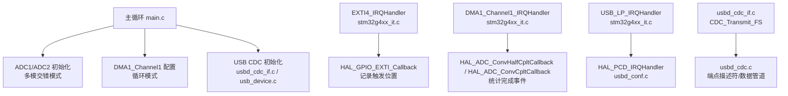
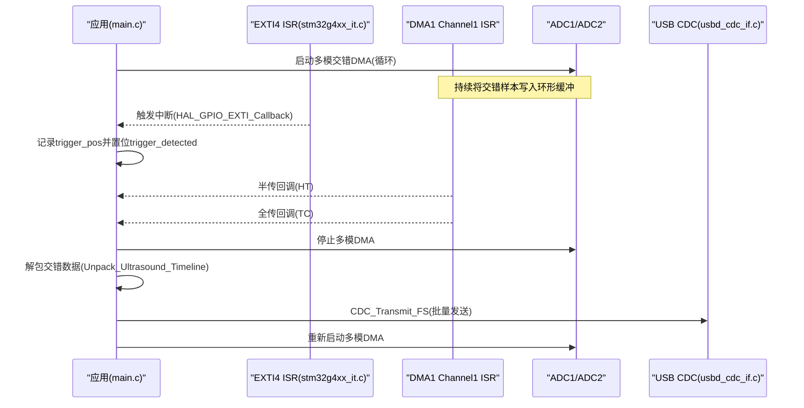
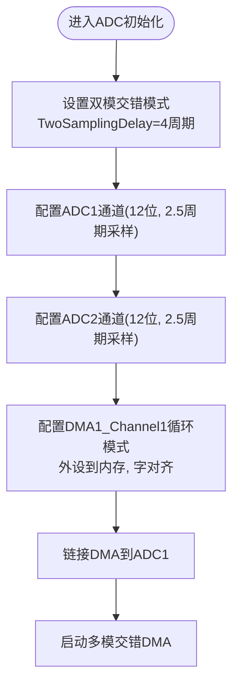
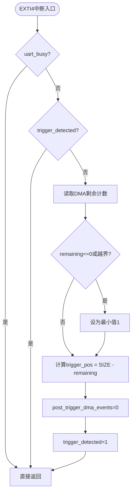
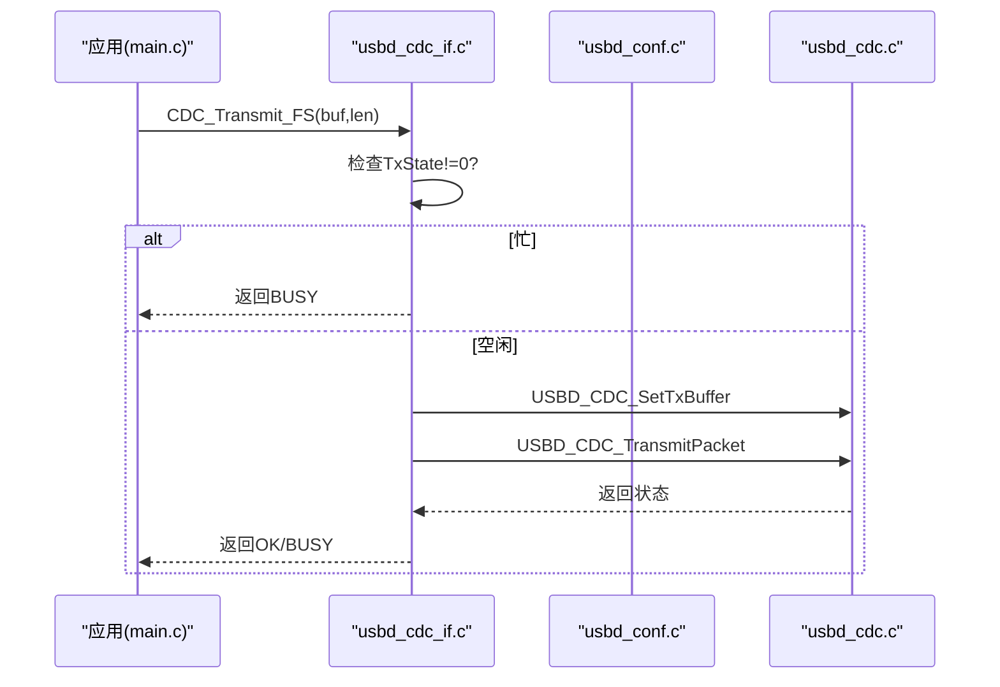
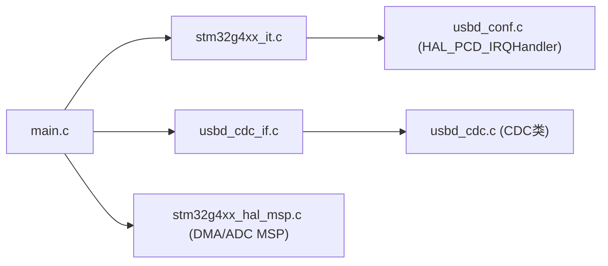

# 常见问题排查

<cite>
**本文引用的文件**   
- [Core/Src/main.c](file://Core/Src/main.c)
- [Core/Inc/main.h](file://Core/Inc/main.h)
- [Core/Src/stm32g4xx_it.c](file://Core/Src/stm32g4xx_it.c)
- [Core/Src/stm32g4xx_hal_msp.c](file://Core/Src/stm32g4xx_hal_msp.c)
- [USB_Device/App/usbd_cdc_if.c](file://USB_Device/App/usbd_cdc_if.c)
- [USB_Device/App/usb_device.c](file://USB_Device/App/usb_device.c)
- [USB_Device/App/usbd_desc.c](file://USB_Device/App/usbd_desc.c)
- [USB_Device/Target/usbd_conf.c](file://USB_Device/Target/usbd_conf.c)
- [Middlewares/ST/STM32_USB_Device_Library/Class/CDC/Src/usbd_cdc.c](file://Middlewares/ST/STM32_USB_Device_Library/Class/CDC/Src/usbd_cdc.c)
</cite>

## 目录
1. [简介](#简介)
2. [项目结构](#项目结构)
3. [核心组件](#核心组件)
4. [架构总览](#架构总览)
5. [详细组件分析](#详细组件分析)
6. [依赖关系分析](#依赖关系分析)
7. [性能与实时性考虑](#性能与实时性考虑)
8. [故障排查指南](#故障排查指南)
9. [结论](#结论)
10. [附录：硬件连接检查清单](#附录硬件连接检查清单)

## 简介
本指南面向使用 STM32G474 的超声波采集系统，聚焦以下高频问题：ADC双通道交错采样异常、DMA传输错误、USB CDC通信故障、触发检测（EXTI）问题以及硬件连接隐患。每个问题均提供症状描述、可能原因分析与逐步解决步骤，并附带与源码对应的定位路径，便于快速复现与修复。

## 项目结构
本项目基于CubeMX生成工程，包含应用层main循环、中断服务程序、HAL MSP初始化、USB设备栈与CDC类实现等关键模块。整体采用“ADC1/ADC2双通道交错+DMA循环缓冲+EXTI触发+USB CDC上报”的数据通路。

图表来源
- [Core/Src/main.c:219-290](file://Core/Src/main.c#L219-L290)
- [Core/Src/stm32g4xx_it.c:205-228](file://Core/Src/stm32g4xx_it.c#L205-L228)
- [USB_Device/App/usbd_cdc_if.c:281-293](file://USB_Device/App/usbd_cdc_if.c#L281-L293)
- [USB_Device/Target/usbd_conf.c:416-451](file://USB_Device/Target/usbd_conf.c#L416-L451)

章节来源
- [Core/Src/main.c:219-290](file://Core/Src/main.c#L219-L290)
- [Core/Src/stm32g4xx_it.c:205-228](file://Core/Src/stm32g4xx_it.c#L205-L228)
- [USB_Device/App/usbd_cdc_if.c:281-293](file://USB_Device/App/usbd_cdc_if.c#L281-L293)
- [USB_Device/Target/usbd_conf.c:416-451](file://USB_Device/Target/usbd_conf.c#L416-L451)

## 核心组件
- ADC双通道交错采样：ADC1为主，ADC2为从，启用双模交错模式，单通道12位分辨率，连续转换，DMA单次请求关闭（仅主ADC开启DMA）。
- DMA循环缓冲：DMA1_Channel1以循环模式将ADC1/ADC2交错结果写入uint32_t数组，低16位为ADC1，高16位为ADC2。
- EXTI触发：PA4上升沿触发，ISR中读取DMA剩余计数计算触发位置，标记触发标志并等待DMA半传/全传事件完成固定后采样窗口。
- USB CDC：通过USBD库注册CDC类，提供发送接口；应用侧将解码后的波形逐行文本打包并通过CDC_Transmit_FS发送。

章节来源
- [Core/Src/main.c:344-464](file://Core/Src/main.c#L344-L464)
- [Core/Src/stm32g4xx_hal_msp.c:127-148](file://Core/Src/stm32g4xx_hal_msp.c#L127-L148)
- [Core/Src/main.c:91-131](file://Core/Src/main.c#L91-L131)
- [USB_Device/App/usbd_cdc_if.c:281-293](file://USB_Device/App/usbd_cdc_if.c#L281-L293)

## 架构总览
下图展示一次完整采集到上传的流程：EXTI触发→记录触发位置→等待DMA两个事件（HT+TC）→停止DMA→解包交错数据→USB CDC发送→重启DMA。

图表来源
- [Core/Src/main.c:249-289](file://Core/Src/main.c#L249-L289)
- [Core/Src/main.c:91-131](file://Core/Src/main.c#L91-L131)
- [Core/Src/main.c:136-149](file://Core/Src/main.c#L136-L149)
- [USB_Device/App/usbd_cdc_if.c:281-293](file://USB_Device/App/usbd_cdc_if.c#L281-L293)

## 详细组件分析

### ADC与DMA子系统
- 多模模式：双通道交错（INTERL），两采样间隔配置为4周期，DMA访问模式为12/10位组合。
- 时钟与GPIO：ADC12由PLL驱动，PA2/PA3用于ADC1_IN3差分对，PA6/PA7用于ADC2_IN3差分对。
- DMA：DMA1_Channel1，外设到内存，内存自增，循环模式，优先级较低。

图表来源
- [Core/Src/main.c:381-402](file://Core/Src/main.c#L381-L402)
- [Core/Src/main.c:448-459](file://Core/Src/main.c#L448-L459)
- [Core/Src/stm32g4xx_hal_msp.c:127-148](file://Core/Src/stm32g4xx_hal_msp.c#L127-L148)

章节来源
- [Core/Src/main.c:344-464](file://Core/Src/main.c#L344-L464)
- [Core/Src/stm32g4xx_hal_msp.c:92-185](file://Core/Src/stm32g4xx_hal_msp.c#L92-L185)

### 触发检测（EXTI）
- PA4上升沿触发，NVIC优先级最高，屏蔽UART发送期间重复触发。
- ISR内读取DMA剩余计数，计算环形缓冲中的触发位置，置位触发标志并清零后续事件计数器。

图表来源
- [Core/Src/main.c:91-113](file://Core/Src/main.c#L91-L113)
- [Core/Src/stm32g4xx_it.c:205-214](file://Core/Src/stm32g4xx_it.c#L205-L214)

章节来源
- [Core/Src/main.c:91-113](file://Core/Src/main.c#L91-L113)
- [Core/Src/stm32g4xx_it.c:205-214](file://Core/Src/stm32g4xx_it.c#L205-L214)

### USB CDC通信
- 设备枚举：注册CDC类与接口，配置端点PMA缓冲区，支持FS速率。
- 数据传输：应用侧调用CDC_Transmit_FS，内部检查TxState避免并发，设置发送缓冲区并提交数据包。

图表来源
- [USB_Device/App/usbd_cdc_if.c:281-293](file://USB_Device/App/usbd_cdc_if.c#L281-L293)
- [USB_Device/Target/usbd_conf.c:416-451](file://USB_Device/Target/usbd_conf.c#L416-L451)
- [Middlewares/ST/STM32_USB_Device_Library/Class/CDC/Src/usbd_cdc.c:258-354](file://Middlewares/ST/STM32_USB_Device_Library/Class/CDC/Src/usbd_cdc.c#L258-L354)

章节来源
- [USB_Device/App/usbd_cdc_if.c:281-293](file://USB_Device/App/usbd_cdc_if.c#L281-L293)
- [USB_Device/Target/usbd_conf.c:416-451](file://USB_Device/Target/usbd_conf.c#L416-L451)
- [Middlewares/ST/STM32_USB_Device_Library/Class/CDC/Src/usbd_cdc.c:258-354](file://Middlewares/ST/STM32_USB_Device_Library/Class/CDC/Src/usbd_cdc.c#L258-L354)

## 依赖关系分析
- main.c依赖：HAL库、USB设备栈、CDC接口函数。
- stm32g4xx_it.c暴露外部变量：PCD_HandleTypeDef、DMA_HandleTypeDef，供中断转发至HAL。
- usbd_conf.c负责USB底层MSP与回调注册，usbd_cdc_if.c封装上层CDC收发API。

图表来源
- [Core/Src/main.c:219-290](file://Core/Src/main.c#L219-L290)
- [Core/Src/stm32g4xx_it.c:219-228](file://Core/Src/stm32g4xx_it.c#L219-L228)
- [USB_Device/Target/usbd_conf.c:416-451](file://USB_Device/Target/usbd_conf.c#L416-L451)
- [USB_Device/App/usbd_cdc_if.c:281-293](file://USB_Device/App/usbd_cdc_if.c#L281-L293)
- [Core/Src/stm32g4xx_hal_msp.c:127-148](file://Core/Src/stm32g4xx_hal_msp.c#L127-L148)

章节来源
- [Core/Src/main.c:219-290](file://Core/Src/main.c#L219-L290)
- [Core/Src/stm32g4xx_it.c:219-228](file://Core/Src/stm32g4xx_it.c#L219-L228)
- [USB_Device/Target/usbd_conf.c:416-451](file://USB_Device/Target/usbd_conf.c#L416-L451)
- [USB_Device/App/usbd_cdc_if.c:281-293](file://USB_Device/App/usbd_cdc_if.c#L281-L293)
- [Core/Src/stm32g4xx_hal_msp.c:127-148](file://Core/Src/stm32g4xx_hal_msp.c#L127-L148)

## 性能与实时性考虑
- ADC采样率估算：在交错模式下，每两次转换产生一个32位字，采样时间2.5周期+两采样延迟4周期，结合ADC时钟源与分频可估算实际采样率。若需更高吞吐，应评估ADC时钟与采样时间是否满足时序要求。
- DMA优先级：当前DMA优先级为LOW，在高负载USB传输时可能影响实时性，必要时提升DMA优先级。
- 文本格式化开销：每次发送前进行整型转字符串，CPU占用较高，建议改为二进制打包或预格式化缓冲以降低CPU压力。

[本节为通用指导，不直接分析具体文件]

## 故障排查指南

### 一、ADC采样异常
常见症状
- 双通道交错模式配置错误：数据错位、通道内容互换或出现无效数据。
- 采样率不达标：波形压缩或拉伸，时间轴不准确。
- 数据错位：触发前后样本顺序错乱。

可能原因
- 双模模式未正确设置为交错模式或两采样延迟不当。
- ADC时钟源/分频配置导致实际频率偏离预期。
- DMA地址对齐或数据类型不匹配（例如非字对齐）。
- 环形缓冲大小与实际期望窗口不一致。

诊断与修复步骤
1. 确认双模模式与延迟参数
   - 检查双模模式是否为交错模式，两采样延迟是否合理。
   - 参考路径：[Core/Src/main.c:381-389](file://Core/Src/main.c#L381-L389)
2. 验证ADC时钟与采样时间
   - 检查ADC12时钟选择与分频，确保达到目标采样率。
   - 参考路径：[Core/Src/stm32g4xx_hal_msp.c:104-115](file://Core/Src/stm32g4xx_hal_msp.c#L104-L115)
3. 核对DMA配置与对齐
   - 确认DMA方向、内存递增、外设/内存对齐均为字对齐，且模式为循环。
   - 参考路径：[Core/Src/stm32g4xx_hal_msp.c:127-148](file://Core/Src/stm32g4xx_hal_msp.c#L127-L148)
4. 校验环形缓冲与解包逻辑
   - 确认缓冲大小定义与解包起始索引计算一致，避免越界。
   - 参考路径：[Core/Src/main.c:53-62](file://Core/Src/main.c#L53-L62), [Core/Src/main.c:156-171](file://Core/Src/main.c#L156-L171)
5. 观察DMA剩余计数与触发位置
   - 在触发ISR中打印或断点查看remaining与trigger_pos，确保边界保护有效。
   - 参考路径：[Core/Src/main.c:100-112](file://Core/Src/main.c#L100-L112)

章节来源
- [Core/Src/main.c:381-389](file://Core/Src/main.c#L381-L389)
- [Core/Src/stm32g4xx_hal_msp.c:104-115](file://Core/Src/stm32g4xx_hal_msp.c#L104-L115)
- [Core/Src/stm32g4xx_hal_msp.c:127-148](file://Core/Src/stm32g4xx_hal_msp.c#L127-L148)
- [Core/Src/main.c:53-62](file://Core/Src/main.c#L53-L62)
- [Core/Src/main.c:156-171](file://Core/Src/main.c#L156-L171)
- [Core/Src/main.c:100-112](file://Core/Src/main.c#L100-L112)

### 二、DMA传输错误
常见症状
- 缓冲区溢出：数据覆盖或丢失。
- 循环模式失效：DMA只运行一次后停止。
- 中断丢失：半传/全传回调未触发或重复触发。

可能原因
- DMA优先级过低，被其他高优先级任务抢占。
- 循环模式未正确配置或外设请求未使能。
- 回调处理耗时过长，导致事件堆积或丢失。
- 多核/中断嵌套导致共享变量竞争。

诊断与修复步骤
1. 检查DMA模式与优先级
   - 确认DMA模式为循环，优先级适当提高。
   - 参考路径：[Core/Src/stm32g4xx_hal_msp.c:127-148](file://Core/Src/stm32g4xx_hal_msp.c#L127-L148)
2. 验证中断向量与回调链
   - 确认DMA1_Channel1中断已启用，回调转发至HAL。
   - 参考路径：[Core/Src/stm32g4xx_it.c:219-228](file://Core/Src/stm32g4xx_it.c#L219-L228)
3. 简化回调逻辑
   - 仅在回调中置位标志或计数，避免复杂操作。
   - 参考路径：[Core/Src/main.c:136-149](file://Core/Src/main.c#L136-L149)
4. 监控NDTR与事件计数
   - 在触发后统计HT/TC事件次数，确保达到阈值再停止DMA。
   - 参考路径：[Core/Src/main.c:119-131](file://Core/Src/main.c#L119-L131)

章节来源
- [Core/Src/stm32g4xx_hal_msp.c:127-148](file://Core/Src/stm32g4xx_hal_msp.c#L127-L148)
- [Core/Src/stm32g4xx_it.c:219-228](file://Core/Src/stm32g4xx_it.c#L219-L228)
- [Core/Src/main.c:136-149](file://Core/Src/main.c#L136-L149)
- [Core/Src/main.c:119-131](file://Core/Src/main.c#L119-L131)

### 三、USB CDC通信故障
常见症状
- 设备枚举失败：电脑无法识别虚拟串口。
- 数据传输中断：发送阻塞或频繁返回BUSY。
- 波特率不匹配：上位机显示乱码（注意：CDC为Bulk传输，无传统波特率概念）。

可能原因
- USB时钟源未正确配置或未启用。
- 端点PMA缓冲区未配置或冲突。
- 应用侧发送缓冲区过大或频繁调用导致TX忙。
- 上位机软件未正确打开端口或协议不匹配。

诊断与修复步骤
1. 检查USB时钟与中断
   - 确认HSI48作为USB时钟源，USB中断已启用。
   - 参考路径：[USB_Device/Target/usbd_conf.c:84-96](file://USB_Device/Target/usbd_conf.c#L84-L96)
2. 验证端点与PMA配置
   - 检查IN/OUT端点地址与PMA分配是否正确。
   - 参考路径：[USB_Device/Target/usbd_conf.c:443-450](file://USB_Device/Target/usbd_conf.c#L443-L450)
3. 控制发送流程
   - 在应用侧避免同时多次发送，检查返回值并退避重试。
   - 参考路径：[USB_Device/App/usbd_cdc_if.c:281-293](file://USB_Device/App/usbd_cdc_if.c#L281-L293)
4. 确认描述符与类注册
   - 检查设备描述符、CDC类与接口注册是否成功。
   - 参考路径：[USB_Device/App/usb_device.c:73-84](file://USB_Device/App/usb_device.c#L73-L84), [USB_Device/App/usbd_desc.c:132-141](file://USB_Device/App/usbd_desc.c#L132-L141)

章节来源
- [USB_Device/Target/usbd_conf.c:84-96](file://USB_Device/Target/usbd_conf.c#L84-L96)
- [USB_Device/Target/usbd_conf.c:443-450](file://USB_Device/Target/usbd_conf.c#L443-L450)
- [USB_Device/App/usbd_cdc_if.c:281-293](file://USB_Device/App/usbd_cdc_if.c#L281-L293)
- [USB_Device/App/usb_device.c:73-84](file://USB_Device/App/usb_device.c#L73-L84)
- [USB_Device/App/usbd_desc.c:132-141](file://USB_Device/App/usbd_desc.c#L132-L141)

### 四、触发检测问题
常见症状
- EXTI中断不响应：触发后无任何动作。
- 触发位置计算错误：波形偏移或截断。
- 信号干扰：误触发或漏触发。

可能原因
- GPIO未配置为EXTI输入或中断屏蔽。
- NVIC未启用对应中断或优先级过低。
- ISR中未清理挂起位或存在重入保护导致忽略。
- 外部噪声导致抖动。

诊断与修复步骤
1. 检查GPIO与EXTI配置
   - 确认PA4配置为上升沿中断，SYSCFG映射正确。
   - 参考路径：[Core/Src/main.c:498-506](file://Core/Src/main.c#L498-L506)
2. 验证中断向量与回调
   - 确认EXTI4_IRQHandler调用HAL处理函数。
   - 参考路径：[Core/Src/stm32g4xx_it.c:205-214](file://Core/Src/stm32g4xx_it.c#L205-L214)
3. 检查ISR逻辑与重入保护
   - 确认uart_busy与trigger_detected保护逻辑不会误屏蔽正常触发。
   - 参考路径：[Core/Src/main.c:91-113](file://Core/Src/main.c#L91-L113)
4. 增加去抖与滤波
   - 硬件端加RC滤波或软件延时去抖，减少误触发。

章节来源
- [Core/Src/main.c:498-506](file://Core/Src/main.c#L498-L506)
- [Core/Src/stm32g4xx_it.c:205-214](file://Core/Src/stm32g4xx_it.c#L205-L214)
- [Core/Src/main.c:91-113](file://Core/Src/main.c#L91-L113)

### 五、综合流程问题
常见症状
- 数据就绪但无法发送：USB忙或端点未就绪。
- 波形不完整：触发窗口不足或DMA提前停止。

可能原因
- 应用侧未正确处理data_ready标志。
- 停止DMA与重启DMA时机不当。
- 解包起始索引计算错误。

诊断与修复步骤
1. 检查主循环标志处理
   - 确认data_ready快照与重置顺序正确。
   - 参考路径：[Core/Src/main.c:264-289](file://Core/Src/main.c#L264-L289)
2. 验证停止与重启DMA
   - 确保在两个DMA事件完成后停止，并在发送结束后重启。
   - 参考路径：[Core/Src/main.c:119-131](file://Core/Src/main.c#L119-L131), [Core/Src/main.c:282-286](file://Core/Src/main.c#L282-L286)
3. 核对解包起始索引
   - 根据trigger_pos与预触发数量计算start_idx，避免越界。
   - 参考路径：[Core/Src/main.c:156-171](file://Core/Src/main.c#L156-L171)

章节来源
- [Core/Src/main.c:264-289](file://Core/Src/main.c#L264-L289)
- [Core/Src/main.c:119-131](file://Core/Src/main.c#L119-L131)
- [Core/Src/main.c:156-171](file://Core/Src/main.c#L156-L171)

## 结论
通过对ADC双通道交错、DMA循环缓冲、EXTI触发与USB CDC链路的关键点进行逐项排查，大多数采集与通信问题均可快速定位与修复。建议在调试阶段加入最小化日志与断点，优先验证时钟、中断与DMA配置，再逐步完善数据处理与传输流程。

[本节为总结性内容，不直接分析具体文件]

## 附录：硬件连接检查清单
- 电源稳定性
  - 检查VDD/VSS与模拟地AGND分离与单点接地。
  - 测量LDO输出纹波，确保不超过器件规格。
- 信号完整性
  - 传感器输出阻抗与ADC输入匹配，必要时加缓冲器。
  - 差分走线等长、短路径、远离数字噪声源。
- 接地与屏蔽
  - 外壳与大地良好连接，降低共模干扰。
  - 使用屏蔽线缆并单端接地。
- 触发信号
  - 上升沿清晰、幅度足够，必要时施密特整形。
  - 添加RC滤波抑制抖动。
- USB链路
  - 使用质量良好的USB线缆，避免长距离无源延长。
  - 主机端驱动与终端软件版本兼容。

[本节为通用指导，不直接分析具体文件]