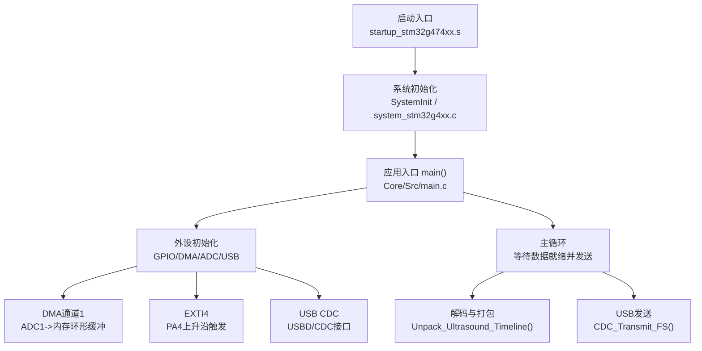
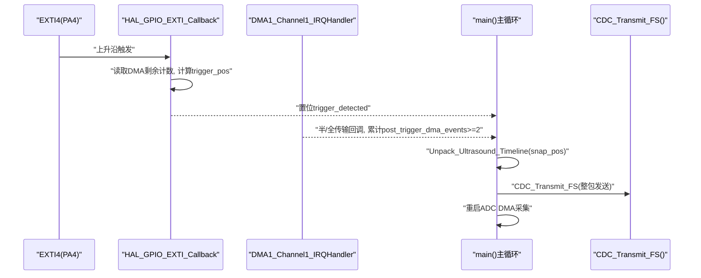
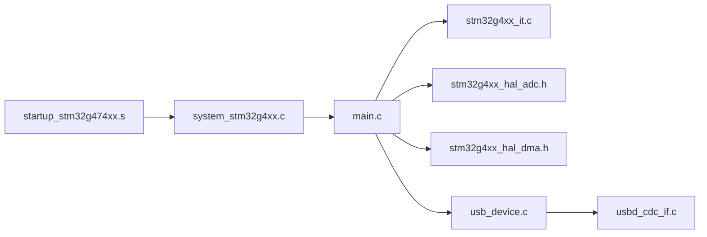
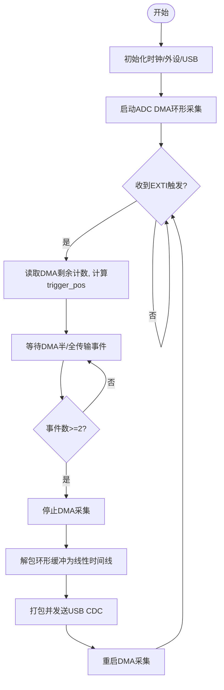

# 性能监控和分析

<cite>
**本文引用的文件**   
- [main.c](file://Core/Src/main.c)
- [stm32g4xx_it.c](file://Core/Src/stm32g4xx_it.c)
- [system_stm32g4xx.c](file://Core/Src/system_stm32g4xx.c)
- [startup_stm32g474xx.s](file://startup_stm32g474xx.s)
- [usbd_cdc_if.c](file://USB_Device/App/usbd_cdc_if.c)
- [usb_device.c](file://USB_Device/App/usb_device.c)
- [stm32g4xx_hal_adc.h](file://Drivers/STM32G4xx_HAL_Driver/Inc/stm32g4xx_hal_adc.h)
- [stm32g4xx_hal_dma.h](file://Drivers/STM32G4xx_HAL_Driver/Inc/stm32g4xx_hal_dma.h)
</cite>

## 目录
1. [引言](#引言)
2. [项目结构](#项目结构)
3. [核心组件](#核心组件)
4. [架构总览](#架构总览)
5. [详细组件分析](#详细组件分析)
6. [依赖关系分析](#依赖关系分析)
7. [性能考虑](#性能考虑)
8. [故障排查指南](#故障排查指南)
9. [结论](#结论)
10. [附录](#附录)

## 引言
本指南面向高性能数据采集系统（基于STM32G4，双ADC交错采样、DMA环形缓冲、EXTI触发与USB CDC输出）的性能监控与分析。内容覆盖：
- 采样率性能验证：实际采样频率测量、时序精度分析、抖动测试
- 内存使用监控：堆栈使用情况、缓冲区利用率、内存泄漏检测
- CPU负载分析：中断处理时间、主循环执行时间、功耗优化策略
- 实时性保证：中断延迟分析、任务调度优化、优先级配置
- 瓶颈识别：热点函数分析、总线占用率监控、外设性能评估
- 基准测试方法与优化效果评估标准

## 项目结构
本项目采用分层组织：应用层（main.c）、中断服务程序（stm32g4xx_it.c）、系统初始化（system_stm32g4xx.c + startup_stm32g474xx.s）、USB设备与CDC接口（usb_device.c、usbd_cdc_if.c），以及HAL驱动头文件（ADC/DMA）。

图表来源
- [startup_stm32g474xx.s:58-102](file://startup_stm32g474xx.s#L58-L102)
- [system_stm32g4xx.c:181-192](file://Core/Src/system_stm32g4xx.c#L181-L192)
- [main.c:219-290](file://Core/Src/main.c#L219-L290)
- [main.c:469-520](file://Core/Src/main.c#L469-L520)
- [usb_device.c:66-88](file://USB_Device/App/usb_device.c#L66-L88)
- [usbd_cdc_if.c:281-293](file://USB_Device/App/usbd_cdc_if.c#L281-L293)

章节来源
- [startup_stm32g474xx.s:58-102](file://startup_stm32g474xx.s#L58-L102)
- [system_stm32g4xx.c:181-192](file://Core/Src/system_stm32g4xx.c#L181-L192)
- [main.c:219-290](file://Core/Src/main.c#L219-L290)
- [usb_device.c:66-88](file://USB_Device/App/usb_device.c#L66-L88)
- [usbd_cdc_if.c:281-293](file://USB_Device/App/usbd_cdc_if.c#L281-L293)

## 核心组件
- ADC双通道交错采集：ADC1为主，ADC2为从，DMA1将交错结果写入环形缓冲；采样分辨率12位，连续转换模式，DMA持续请求。
- DMA环形缓冲：半传输/全传输回调用于判定“后触发”数据是否足够，从而停止采集并置数据就绪标志。
- EXTI触发：外部引脚PA4上升沿捕获触发时刻，读取DMA剩余计数以定位环形缓冲中的触发位置。
- USB CDC输出：将解码后的线性时间线序列化为十进制字符串并通过USB批量发送。
- 时钟与系统：HSI+PLL提供系统时钟，RCC配置AHB/APB分频，Flash等待状态适配。

章节来源
- [main.c:344-464](file://Core/Src/main.c#L344-L464)
- [main.c:469-481](file://Core/Src/main.c#L469-L481)
- [main.c:488-520](file://Core/Src/main.c#L488-L520)
- [main.c:296-337](file://Core/Src/main.c#L296-L337)
- [stm32g4xx_hal_adc.h:90-200](file://Drivers/STM32G4xx_HAL_Driver/Inc/stm32g4xx_hal_adc.h#L90-L200)
- [stm32g4xx_hal_dma.h:113-151](file://Drivers/STM32G4xx_HAL_Driver/Inc/stm32g4xx_hal_dma.h#L113-L151)

## 架构总览
下图展示关键运行时交互：EXTI触发→记录触发位置→DMA回调判定完成→主循环解码→USB发送→重启采集。

图表来源
- [main.c:91-131](file://Core/Src/main.c#L91-L131)
- [main.c:156-171](file://Core/Src/main.c#L156-L171)
- [main.c:178-212](file://Core/Src/main.c#L178-L212)
- [main.c:259-290](file://Core/Src/main.c#L259-L290)
- [stm32g4xx_it.c:205-228](file://Core/Src/stm32g4xx_it.c#L205-L228)
- [usbd_cdc_if.c:281-293](file://USB_Device/App/usbd_cdc_if.c#L281-L293)

## 详细组件分析

### 采样率与定时链路
- 时钟源与分频：系统通过HSI经PLL产生SYSCLK，AHB/APB分频为1，Flash等待状态按配置设置。该配置影响ADC时钟上限与时序预算。
- ADC配置要点：
  - 分辨率12位，右对齐，连续转换，EOC单转换选择，DMA连续请求使能。
  - 双模交错模式（Interleaved），两通道采样时间极短，有利于达到高吞吐。
- DMA配置：
  - 通道1映射ADC1请求，NVIC优先级设为最高，确保及时搬运数据。
  - 环形缓冲大小固定，半/全传输事件用于控制采集窗口。

章节来源
- [main.c:296-337](file://Core/Src/main.c#L296-L337)
- [main.c:344-406](file://Core/Src/main.c#L344-L406)
- [main.c:414-464](file://Core/Src/main.c#L414-L464)
- [main.c:469-481](file://Core/Src/main.c#L469-L481)
- [stm32g4xx_hal_adc.h:90-200](file://Drivers/STM32G4xx_HAL_Driver/Inc/stm32g4xx_hal_adc.h#L90-L200)
- [stm32g4xx_hal_dma.h:113-151](file://Drivers/STM32G4xx_HAL_Driver/Inc/stm32g4xx_hal_dma.h#L113-L151)

#### 采样率性能验证方法
- 实际采样频率测量
  - 在EXTI触发前后翻转GPIO，用示波器测量周期，结合已知的环形缓冲长度与DMA事件数估算有效采样间隔。
  - 利用SysTick或定时器比较寄存器在关键路径打点，统计两次DMA半/全传输的时间差，换算为平均采样间隔。
- 时序精度分析
  - 在EXTI回调中读取DMA剩余计数，多次采集同一稳定信号，统计trigger_pos的分布方差，评估触发定位抖动。
  - 对解码后的线性序列做自相关或过零检测，估计采样间隔一致性。
- 抖动测试
  - 使用高精度外部参考时钟驱动被测信号，对比理论采样相位与实际采样相位偏差，绘制直方图与P-P抖动。

章节来源
- [main.c:91-131](file://Core/Src/main.c#L91-L131)
- [main.c:156-171](file://Core/Src/main.c#L156-L171)
- [stm32g4xx_it.c:205-228](file://Core/Src/stm32g4xx_it.c#L205-L228)

### 内存使用监控
- 堆栈使用情况
  - 在启动文件中设置初始SP，可在调试器中观察各异常/中断的栈帧深度；建议在关键ISR与主循环入口添加栈水位探测（如写特定魔数到栈顶附近并在空闲时扫描）。
- 缓冲区利用率监控
  - 环形缓冲大小为固定值，可通过统计DMA NDTR变化范围与触发位置分布，评估缓冲溢出风险与利用率。
- 内存泄漏检测
  - 本项目未使用动态分配，但仍建议定期校验全局缓冲边界访问与索引越界，避免隐式破坏相邻变量。

章节来源
- [startup_stm32g474xx.s:58-102](file://startup_stm32g474xx.s#L58-L102)
- [main.c:53-70](file://Core/Src/main.c#L53-L70)
- [main.c:156-171](file://Core/Src/main.c#L156-L171)

### CPU负载分析
- 中断处理时间测量
  - 在EXTI与DMA中断入口/出口翻转GPIO，用示波器测量中断响应与处理时长，确保满足最坏情况预算。
- 主循环执行时间分析
  - 在主循环关键段前后打点，统计解码与USB发送耗时占比，避免阻塞导致错过下一次触发窗口。
- 功耗优化策略
  - 合理配置电压调节等级与Flash等待状态；在空闲阶段进入低功耗模式（需确保唤醒路径与中断优先级满足实时性）。

章节来源
- [main.c:259-290](file://Core/Src/main.c#L259-L290)
- [main.c:296-337](file://Core/Src/main.c#L296-L337)
- [stm32g4xx_it.c:205-228](file://Core/Src/stm32g4xx_it.c#L205-L228)

### 实时性保证措施
- 中断延迟分析
  - 使用逻辑分析仪在EXTI引脚与对应GPIO之间建立时间戳，统计从边沿到回调执行的延迟分布。
- 任务调度优化
  - 将EXTI与DMA中断优先级设为最高，减少被其他中断抢占的概率；主循环仅做快照与发送，避免长耗时操作。
- 优先级配置
  - NVIC中EXTI4与DMA1_Channel1均设置为最高优先级，确保触发与数据搬运优先于USB等低优先级任务。

章节来源
- [main.c:469-481](file://Core/Src/main.c#L469-L481)
- [main.c:488-520](file://Core/Src/main.c#L488-L520)
- [stm32g4xx_it.c:205-228](file://Core/Src/stm32g4xx_it.c#L205-L228)

### 性能瓶颈识别方法
- 热点函数分析
  - 对Unpack_Ultrasound_Timeline与Send_Signal_Over_UART进行打点，统计其执行时间与调用频次，识别CPU热点。
- 总线占用率监控
  - 通过RCC获取当前时钟频率，结合DMA与USB传输量估算总线带宽占用；必要时降低USB端点速率或分批发送。
- 外设性能评估
  - 评估ADC采样时间、双模交错延迟、DMA搬运开销与USB端点吞吐，综合判断系统瓶颈所在模块。

章节来源
- [main.c:156-171](file://Core/Src/main.c#L156-L171)
- [main.c:178-212](file://Core/Src/main.c#L178-L212)
- [main.c:296-337](file://Core/Src/main.c#L296-L337)

### 基准测试方法与优化效果评估标准
- 基准指标
  - 采样率误差：实测间隔与目标间隔相对误差≤±X%
  - 触发抖动：trigger_pos标准差≤Y个样本
  - 中断延迟：P99延迟≤Z微秒
  - 主循环最大耗时：解码+发送≤W微秒
  - 内存峰值：环形缓冲利用率≥A%，无溢出告警
- 评估流程
  - 搭建稳定信号源与高精度计时工具，运行N次采集，统计上述指标的均值与尾部分布；对比优化前后差异，确认改进有效性。

[本节为通用方法论，不直接分析具体文件]

## 依赖关系分析
- 启动与系统
  - 启动汇编负责复位、向量表、调用SystemInit与main。
  - SystemInit/FPU与向量表重定位由CMSIS系统文件管理。
- 应用与外设
  - main.c依赖HAL库初始化ADC/DMA/USB，注册回调，管理环形缓冲与解码。
  - stm32g4xx_it.c实现EXTI与DMA中断分发至HAL回调。
- USB协议栈
  - usb_device.c初始化USBD并注册CDC类；usbd_cdc_if.c提供CDC收发接口。

图表来源
- [startup_stm32g474xx.s:58-102](file://startup_stm32g474xx.s#L58-L102)
- [system_stm32g4xx.c:181-192](file://Core/Src/system_stm32g4xx.c#L181-L192)
- [main.c:219-290](file://Core/Src/main.c#L219-L290)
- [stm32g4xx_it.c:205-228](file://Core/Src/stm32g4xx_it.c#L205-L228)
- [usb_device.c:66-88](file://USB_Device/App/usb_device.c#L66-L88)
- [usbd_cdc_if.c:281-293](file://USB_Device/App/usbd_cdc_if.c#L281-L293)

章节来源
- [startup_stm32g474xx.s:58-102](file://startup_stm32g474xx.s#L58-L102)
- [system_stm32g4xx.c:181-192](file://Core/Src/system_stm32g4xx.c#L181-L192)
- [main.c:219-290](file://Core/Src/main.c#L219-L290)
- [stm32g4xx_it.c:205-228](file://Core/Src/stm32g4xx_it.c#L205-L228)
- [usb_device.c:66-88](file://USB_Device/App/usb_device.c#L66-L88)
- [usbd_cdc_if.c:281-293](file://USB_Device/App/usbd_cdc_if.c#L281-L293)

## 性能考虑
- 中断路径最小化：EXTI回调仅记录触发位置与重置计数器，避免复杂运算。
- DMA优先：DMA搬运与回调优先级高于USB，确保数据不丢失。
- 主循环非阻塞：仅在数据就绪时执行解码与发送，其余时间可进入低功耗。
- 时钟与等待状态：根据系统频率调整Flash等待状态，避免总线冲突导致的额外延迟。
- 输出批量化：将多行样本合并为一次USB发送，减少协议开销。

[本节为通用指导，不直接分析具体文件]

## 故障排查指南
- 常见问题
  - 触发重复：检查uart_busy与trigger_detected互斥逻辑，避免在发送期间误触。
  - 数据不完整：确认DMA半/全传输回调计数条件，确保至少两个事件才停止采集。
  - USB发送阻塞：当端点缓冲区满时会返回忙，需轮询重试或降低发送频率。
- 诊断手段
  - 使用GPIO打点与逻辑分析仪观测EXTI、DMA、USB关键路径时序。
  - 在错误处理入口记录系统状态，便于复现问题。

章节来源
- [main.c:91-131](file://Core/Src/main.c#L91-L131)
- [main.c:119-131](file://Core/Src/main.c#L119-L131)
- [main.c:178-212](file://Core/Src/main.c#L178-L212)
- [main.c:530-539](file://Core/Src/main.c#L530-L539)

## 结论
通过对EXTI触发、DMA环形缓冲、双ADC交错采样与USB CDC输出的协同设计，系统在高采样率下具备良好实时性与稳定性。配合本文提供的采样率验证、内存与CPU负载分析方法、实时性保障与瓶颈识别策略，可有效支撑性能调优与问题定位。

[本节为总结，不直接分析具体文件]

## 附录

### 关键流程图（算法视角）

图表来源
- [main.c:219-290](file://Core/Src/main.c#L219-L290)
- [main.c:91-131](file://Core/Src/main.c#L91-L131)
- [main.c:156-171](file://Core/Src/main.c#L156-L171)
- [main.c:178-212](file://Core/Src/main.c#L178-L212)