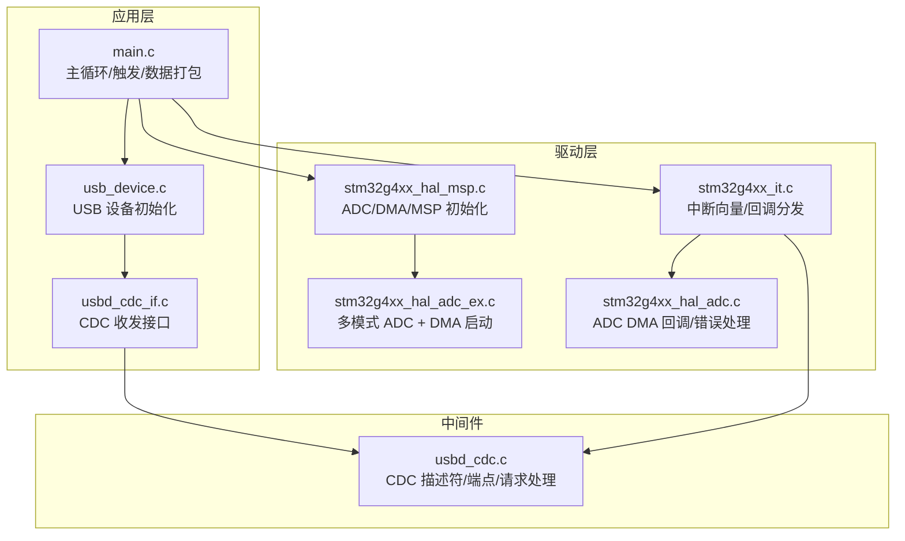
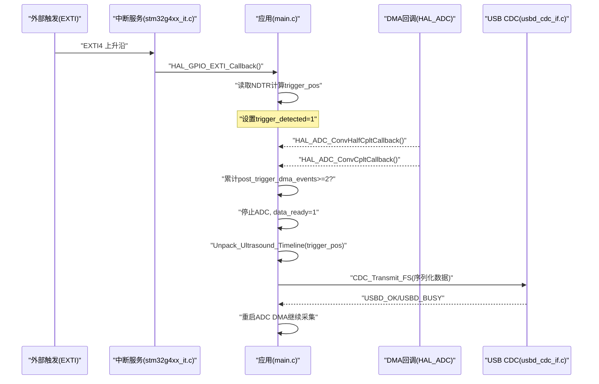
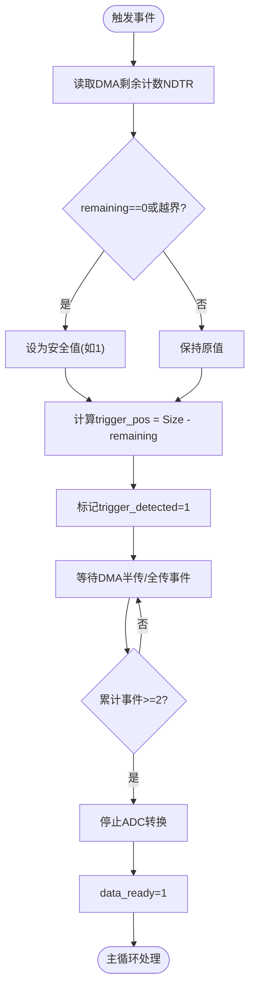
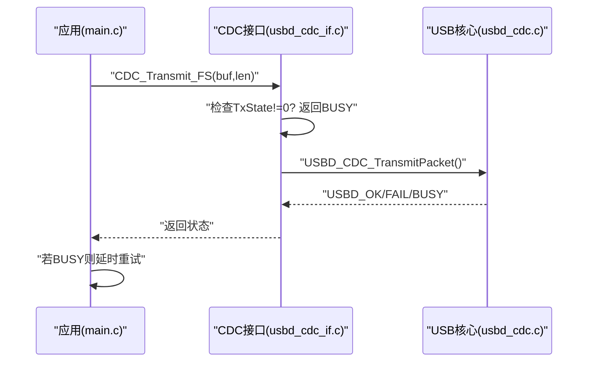
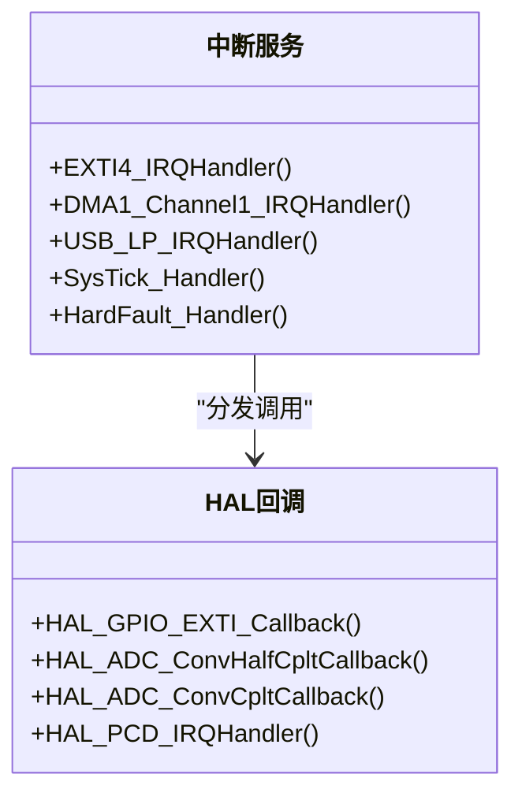
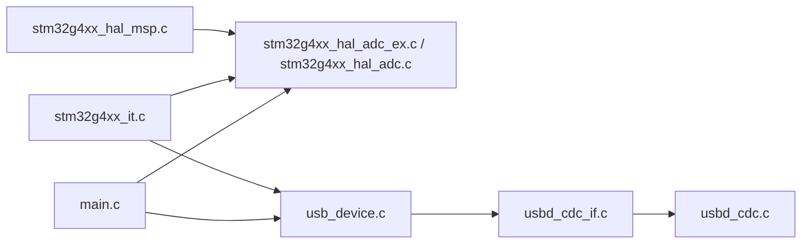
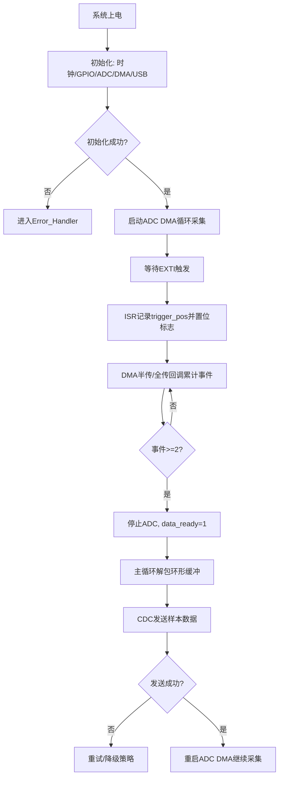

# 故障诊断和调试

<cite>
**本文引用的文件**   
- [main.c](file://Core/Src/main.c)
- [main.h](file://Core/Inc/main.h)
- [stm32g4xx_it.c](file://Core/Src/stm32g4xx_it.c)
- [stm32g4xx_hal_msp.c](file://Core/Src/stm32g4xx_hal_msp.c)
- [usb_device.c](file://USB_Device/App/usb_device.c)
- [usbd_cdc_if.c](file://USB_Device/App/usbd_cdc_if.c)
- [usbd_cdc.c](file://Middlewares/ST/STM32_USB_Device_Library/Class/CDC/Src/usbd_cdc.c)
- [stm32g4xx_hal_adc_ex.c](file://Drivers/STM32G4xx_HAL_Driver/Src/stm32g4xx_hal_adc_ex.c)
- [stm32g4xx_hal_adc.c](file://Drivers/STM32G4xx_HAL_Driver/Src/stm32g4xx_hal_adc.c)
</cite>

## 目录
1. [简介](#简介)
2. [项目结构](#项目结构)
3. [核心组件](#核心组件)
4. [架构总览](#架构总览)
5. [详细组件分析](#详细组件分析)
6. [依赖关系分析](#依赖关系分析)
7. [性能考虑](#性能考虑)
8. [故障排查指南](#故障排查指南)
9. [结论](#结论)
10. [附录](#附录)

## 简介
本指南面向使用 STM32G4 的嵌入式系统，聚焦于 ADC 采样、DMA 传输与 USB CDC 通信的故障诊断与调试。文档提供常见问题定位方法、调试工具与技巧（LED 状态指示、串口日志输出、断点调试）、性能监控方法（采样率验证、内存使用、CPU 负载）、错误恢复机制（异常处理、看门狗配置、重启策略），以及硬件调试技巧（示波器波形、逻辑分析仪、信号完整性）。同时给出流程图与清单，帮助快速定位问题。

## 项目结构
本项目基于 STM32CubeMX 生成，包含应用层、HAL 驱动、USB 设备库等模块：
- Core: 主程序入口、中断服务、MSP 初始化
- Drivers: HAL 驱动与 CMSIS 内核接口
- Middlewares: USB 设备库（CDC 类）
- USB_Device: USB 设备应用层（描述符、接口回调）

图表来源
- [main.c:219-290](file://Core/Src/main.c#L219-L290)
- [usb_device.c:66-88](file://USB_Device/App/usb_device.c#L66-L88)
- [usbd_cdc_if.c:138-145](file://USB_Device/App/usbd_cdc_if.c#L138-L145)
- [stm32g4xx_it.c:205-228](file://Core/Src/stm32g4xx_it.c#L205-L228)
- [stm32g4xx_hal_msp.c:92-185](file://Core/Src/stm32g4xx_hal_msp.c#L92-L185)
- [stm32g4xx_hal_adc_ex.c:909-942](file://Drivers/STM32G4xx_HAL_Driver/Src/stm32g4xx_hal_adc_ex.c#L909-L942)
- [stm32g4xx_hal_adc.c:3633-3700](file://Drivers/STM32G4xx_HAL_Driver/Src/stm32g4xx_hal_adc.c#L3633-L3700)
- [usbd_cdc.c:258-354](file://Middlewares/ST/STM32_USB_Device_Library/Class/CDC/Src/usbd_cdc.c#L258-L354)

章节来源
- [main.c:219-290](file://Core/Src/main.c#L219-L290)
- [usb_device.c:66-88](file://USB_Device/App/usb_device.c#L66-L88)
- [usbd_cdc_if.c:138-145](file://USB_Device/App/usbd_cdc_if.c#L138-L145)
- [stm32g4xx_it.c:205-228](file://Core/Src/stm32g4xx_it.c#L205-L228)
- [stm32g4xx_hal_msp.c:92-185](file://Core/Src/stm32g4xx_hal_msp.c#L92-L185)
- [stm32g4xx_hal_adc_ex.c:909-942](file://Drivers/STM32G4xx_HAL_Driver/Src/stm32g4xx_hal_adc_ex.c#L909-L942)
- [stm32g4xx_hal_adc.c:3633-3700](file://Drivers/STM32G4xx_HAL_Driver/Src/stm32g4xx_hal_adc.c#L3633-L3700)
- [usbd_cdc.c:258-354](file://Middlewares/ST/STM32_USB_Device_Library/Class/CDC/Src/usbd_cdc.c#L258-L354)

## 核心组件
- 主循环与触发采集
  - 通过 EXTI 上升沿捕获触发时刻，记录 DMA 剩余计数以计算环形缓冲写入位置；在 DMA 半传/全传回调中累计事件，达到阈值后停止 ADC 并置位数据就绪标志，主循环解包环形缓冲并通过 USB CDC 发送。
- ADC 双通道交错采样
  - 使用 ADC1/ADC2 双模交错模式，DMA 以循环方式将两通道结果打包为 32 位字（低 16 位 ADC1，高 16 位 ADC2）。
- DMA 传输
  - DMA1 Channel1 循环搬运 ADC 数据到内存，启用半传/全传中断，用于触发完成判定与后续处理。
- USB CDC 通信
  - 初始化 USB 设备并注册 CDC 类，应用层调用 CDC_Transmit_FS 将样本序列化为十进制字符串逐行发送。

章节来源
- [main.c:86-213](file://Core/Src/main.c#L86-L213)
- [main.c:344-464](file://Core/Src/main.c#L344-L464)
- [stm32g4xx_hal_msp.c:127-148](file://Core/Src/stm32g4xx_hal_msp.c#L127-L148)
- [stm32g4xx_it.c:219-228](file://Core/Src/stm32g4xx_it.c#L219-L228)
- [usb_device.c:66-88](file://USB_Device/App/usb_device.c#L66-L88)
- [usbd_cdc_if.c:281-293](file://USB_Device/App/usbd_cdc_if.c#L281-L293)

## 架构总览
下图展示从触发到数据输出的关键流程，包括中断、回调与主循环协作。

图表来源
- [stm32g4xx_it.c:205-214](file://Core/Src/stm32g4xx_it.c#L205-L214)
- [main.c:91-131](file://Core/Src/main.c#L91-L131)
- [main.c:156-213](file://Core/Src/main.c#L156-L213)
- [stm32g4xx_hal_adc.c:3633-3675](file://Drivers/STM32G4xx_HAL_Driver/Src/stm32g4xx_hal_adc.c#L3633-L3675)
- [usbd_cdc_if.c:281-293](file://USB_Device/App/usbd_cdc_if.c#L281-L293)

## 详细组件分析

### 组件A：ADC+DMA 采集与触发控制
- 设计要点
  - 环形缓冲大小与预触发/后触发样本数定义，确保触发前后数据完整。
  - 触发检测在 ISR 中仅做最小工作：读取 DMA 剩余计数、边界保护、置位标志。
  - 半传/全传回调累计事件，保证至少两个事件后才认为采集完成，避免误判。
  - 主循环快照 trigger_pos 后立即清零标志，防止 ISR 竞争导致的数据错乱。
- 数据结构与复杂度
  - adc_raw_buffer[CIRCULAR_BUFFER_SIZE]：循环存储交错样本，O(1) 写入。
  - decoded_signal[TOTAL_SAMPLES]：线性时间线重建，O(N) 解包。
- 依赖链
  - main.c 中的回调函数由 HAL_ADC 内部通过 DMA 回调转发。
  - DMA 中断由 stm32g4xx_it.c 分发至 HAL_DMA_IRQHandler，再进入 ADC 回调。
- 优化机会
  - 可在 CDC 发送前进行批量格式化以减少多次调用开销。
  - 可引入双缓冲或原子操作进一步降低主循环与 ISR 竞争窗口。
- 错误处理
  - 若 HAL 返回错误，统一进入 Error_Handler 停机等。

图表来源
- [main.c:91-131](file://Core/Src/main.c#L91-L131)
- [stm32g4xx_it.c:219-228](file://Core/Src/stm32g4xx_it.c#L219-L228)
- [stm32g4xx_hal_adc.c:3633-3675](file://Drivers/STM32G4xx_HAL_Driver/Src/stm32g4xx_hal_adc.c#L3633-L3675)

章节来源
- [main.c:53-82](file://Core/Src/main.c#L53-L82)
- [main.c:91-131](file://Core/Src/main.c#L91-L131)
- [main.c:156-213](file://Core/Src/main.c#L156-L213)
- [stm32g4xx_it.c:219-228](file://Core/Src/stm32g4xx_it.c#L219-L228)
- [stm32g4xx_hal_adc.c:3633-3675](file://Drivers/STM32G4xx_HAL_Driver/Src/stm32g4xx_hal_adc.c#L3633-L3675)

### 组件B：USB CDC 通信与日志输出
- 设计要点
  - 应用层将样本序列化为十进制字符串，每行一个数值，便于上位机解析。
  - CDC_Transmit_FS 非阻塞，若返回 BUSY 则重试。
  - USB 设备初始化失败时进入错误处理。
- 集成点
  - usb_device.c 负责 USBD_Init、注册 CDC 类与接口、启动设备。
  - usbd_cdc_if.c 暴露 CDC_Transmit_FS 供上层调用。
  - usbd_cdc.c 提供 CDC 描述符与端点配置。
- 错误处理
  - 初始化阶段任何一步失败均调用 Error_Handler。
  - 发送阶段根据返回值判断是否重试。

图表来源
- [usb_device.c:66-88](file://USB_Device/App/usb_device.c#L66-L88)
- [usbd_cdc_if.c:281-293](file://USB_Device/App/usbd_cdc_if.c#L281-L293)
- [usbd_cdc.c:258-354](file://Middlewares/ST/STM32_USB_Device_Library/Class/CDC/Src/usbd_cdc.c#L258-L354)

章节来源
- [main.c:178-213](file://Core/Src/main.c#L178-L213)
- [usb_device.c:66-88](file://USB_Device/App/usb_device.c#L66-L88)
- [usbd_cdc_if.c:281-293](file://USB_Device/App/usbd_cdc_if.c#L281-L293)
- [usbd_cdc.c:258-354](file://Middlewares/ST/STM32_USB_Device_Library/Class/CDC/Src/usbd_cdc.c#L258-L354)

### 组件C：GPIO 与 LED 状态指示
- 设计要点
  - PC13 作为开漏输出，低电平点亮 LED，用于指示运行状态或错误。
  - 初始化时关闭 LED，避免上电误亮。
- 调试用途
  - 在关键路径（如触发、发送完成、错误）切换 LED 状态，辅助快速定位。

章节来源
- [main.c:41-45](file://Core/Src/main.c#L41-L45)
- [main.c:509-519](file://Core/Src/main.c#L509-L519)

### 组件D：中断与异常处理
- 设计要点
  - EXTI4 中断回调封装在 HAL 中，应用层实现最小化逻辑。
  - DMA1_Channel1 中断分发到 HAL_DMA_IRQHandler，进而触发 ADC 回调。
  - USB_LP 中断分发到 HAL_PCD_IRQHandler，处理 USB 事务。
  - 系统异常（HardFault 等）默认进入死循环，便于调试器观察现场。
- 错误恢复
  - 当前未启用看门狗，Error_Handler 禁用全局中断并停机。

图表来源
- [stm32g4xx_it.c:205-228](file://Core/Src/stm32g4xx_it.c#L205-L228)
- [stm32g4xx_it.c:233-242](file://Core/Src/stm32g4xx_it.c#L233-L242)
- [stm32g4xx_it.c:184-193](file://Core/Src/stm32g4xx_it.c#L184-L193)
- [stm32g4xx_it.c:85-95](file://Core/Src/stm32g4xx_it.c#L85-L95)

章节来源
- [stm32g4xx_it.c:205-228](file://Core/Src/stm32g4xx_it.c#L205-L228)
- [stm32g4xx_it.c:233-242](file://Core/Src/stm32g4xx_it.c#L233-L242)
- [stm32g4xx_it.c:85-95](file://Core/Src/stm32g4xx_it.c#L85-L95)

## 依赖关系分析
- 模块耦合
  - main.c 依赖 HAL 驱动与 USB 设备库；中断服务文件负责外设中断分发。
  - MSP 文件集中配置 ADC/DMA 时钟与 GPIO，避免分散初始化。
- 外部依赖
  - HAL ADC 多模式启动与回调位于 stm32g4xx_hal_adc_ex.c 与 stm32g4xx_hal_adc.c。
  - USB CDC 描述符与端点配置位于 usbd_cdc.c。
- 潜在环路与风险
  - 主循环与 ISR 共享 volatile 标志，需保证原子性（已采用快照策略）。
  - USB 发送阻塞重试可能影响实时性，应评估超时与降级策略。

图表来源
- [main.c:219-290](file://Core/Src/main.c#L219-L290)
- [stm32g4xx_it.c:205-228](file://Core/Src/stm32g4xx_it.c#L205-L228)
- [usb_device.c:66-88](file://USB_Device/App/usb_device.c#L66-L88)
- [usbd_cdc_if.c:138-145](file://USB_Device/App/usbd_cdc_if.c#L138-L145)
- [usbd_cdc.c:258-354](file://Middlewares/ST/STM32_USB_Device_Library/Class/CDC/Src/usbd_cdc.c#L258-L354)
- [stm32g4xx_hal_msp.c:92-185](file://Core/Src/stm32g4xx_hal_msp.c#L92-L185)

章节来源
- [main.c:219-290](file://Core/Src/main.c#L219-L290)
- [stm32g4xx_it.c:205-228](file://Core/Src/stm32g4xx_it.c#L205-L228)
- [usb_device.c:66-88](file://USB_Device/App/usb_device.c#L66-L88)
- [usbd_cdc_if.c:138-145](file://USB_Device/App/usbd_cdc_if.c#L138-L145)
- [usbd_cdc.c:258-354](file://Middlewares/ST/STM32_USB_Device_Library/Class/CDC/Src/usbd_cdc.c#L258-L354)
- [stm32g4xx_hal_msp.c:92-185](file://Core/Src/stm32g4xx_hal_msp.c#L92-L185)

## 性能考虑
- 采样率验证
  - 依据 ADC 时钟分频与采样周期估算实际采样率；可通过统计单位时间内样本数量或使用定时器测量触发间隔来验证。
- 内存使用监控
  - 关注环形缓冲与解码缓冲区大小，避免栈溢出；必要时将大缓冲区移至全局或静态区。
- CPU 负载分析
  - 使用 SysTick 中断频率与任务耗时估算占用率；在关键路径插入 LED 翻转并用示波器测量占空比。
- USB 吞吐
  - 批量发送可减少协议开销；注意端点最大包长与主机侧接收速率匹配。

[本节为通用指导，不直接分析具体文件]

## 故障排查指南

### 常见问题与解决方案
- ADC 采样异常
  - 现象：数据全零、跳变异常、采样率不符。
  - 排查：
    - 确认 ADC 时钟源与分频配置正确（MSP 中 ADC12 时钟选择）。
    - 检查通道配置与采样时间是否满足信号带宽需求。
    - 校验 DMA 循环模式与数据对齐是否与 ADC 输出一致。
    - 使用 LED 在触发与回调处翻转，验证中断链路。
  - 参考实现位置
    - [stm32g4xx_hal_msp.c:92-185](file://Core/Src/stm32g4xx_hal_msp.c#L92-L185)
    - [main.c:344-464](file://Core/Src/main.c#L344-L464)
- DMA 传输错误
  - 现象：数据错位、丢失、回调未触发。
  - 排查：
    - 检查 DMA 优先级与中断优先级，避免被更高优先级抢占。
    - 确认 DMA 起始地址与长度与 ADC 多模式打包格式匹配。
    - 查看 HAL 错误回调是否被调用，定位 DMA 错误码。
  - 参考实现位置
    - [stm32g4xx_it.c:219-228](file://Core/Src/stm32g4xx_it.c#L219-L228)
    - [stm32g4xx_hal_adc.c:3682-3700](file://Drivers/STM32G4xx_HAL_Driver/Src/stm32g4xx_hal_adc.c#L3682-L3700)
- USB 连接问题
  - 现象：设备无法枚举、端口不可用、发送卡住。
  - 排查：
    - 检查 USB 设备初始化各步骤返回值，失败即进入错误处理。
    - 确认 CDC 描述符与端点配置正确（FS 模式下包长 64 字节）。
    - 在上位机侧查看 COM 端口状态与波特率无关（CDC 无传统波特率）。
  - 参考实现位置
    - [usb_device.c:66-88](file://USB_Device/App/usb_device.c#L66-L88)
    - [usbd_cdc.c:258-354](file://Middlewares/ST/STM32_USB_Device_Library/Class/CDC/Src/usbd_cdc.c#L258-L354)
- 触发抖动与误触发
  - 现象：频繁触发、重复采集。
  - 排查：
    - 在 EXTI 回调中加入去抖逻辑（软件延时或硬件滤波）。
    - 使用 uart_busy 标志屏蔽发送期间的干扰边沿。
  - 参考实现位置
    - [main.c:91-113](file://Core/Src/main.c#L91-L113)

章节来源
- [stm32g4xx_hal_msp.c:92-185](file://Core/Src/stm32g4xx_hal_msp.c#L92-L185)
- [main.c:344-464](file://Core/Src/main.c#L344-L464)
- [stm32g4xx_it.c:219-228](file://Core/Src/stm32g4xx_it.c#L219-L228)
- [stm32g4xx_hal_adc.c:3682-3700](file://Drivers/STM32G4xx_HAL_Driver/Src/stm32g4xx_hal_adc.c#L3682-L3700)
- [usb_device.c:66-88](file://USB_Device/App/usb_device.c#L66-L88)
- [usbd_cdc.c:258-354](file://Middlewares/ST/STM32_USB_Device_Library/Class/CDC/Src/usbd_cdc.c#L258-L354)
- [main.c:91-113](file://Core/Src/main.c#L91-L113)

### 调试工具与技巧
- LED 状态指示
  - 在触发、数据就绪、发送完成、错误路径切换 LED，便于肉眼观测时序。
  - 参考位置
    - [main.c:41-45](file://Core/Src/main.c#L41-L45)
    - [main.c:509-519](file://Core/Src/main.c#L509-L519)
- 串口日志输出
  - 通过 USB CDC 发送文本信息，建议批量格式化减少调用次数。
  - 参考位置
    - [main.c:178-213](file://Core/Src/main.c#L178-L213)
    - [usbd_cdc_if.c:281-293](file://USB_Device/App/usbd_cdc_if.c#L281-L293)
- 断点调试
  - 在 EXTI 回调、DMA 回调、CDC 发送关键点设置断点，观察变量与寄存器状态。
  - 参考位置
    - [stm32g4xx_it.c:205-228](file://Core/Src/stm32g4xx_it.c#L205-L228)
    - [main.c:91-131](file://Core/Src/main.c#L91-L131)

章节来源
- [main.c:41-45](file://Core/Src/main.c#L41-L45)
- [main.c:509-519](file://Core/Src/main.c#L509-L519)
- [main.c:178-213](file://Core/Src/main.c#L178-L213)
- [usbd_cdc_if.c:281-293](file://USB_Device/App/usbd_cdc_if.c#L281-L293)
- [stm32g4xx_it.c:205-228](file://Core/Src/stm32g4xx_it.c#L205-L228)
- [main.c:91-131](file://Core/Src/main.c#L91-L131)

### 性能监控方法
- 采样率验证
  - 使用定时器测量两次触发间隔，结合样本数量计算有效采样率。
- 内存使用监控
  - 检查堆栈使用量与全局缓冲区大小，避免溢出。
- CPU 负载分析
  - 在关键路径翻转 LED，用示波器测量占空比估算 CPU 占用。

[本节为通用指导，不直接分析具体文件]

### 错误恢复机制
- 异常处理
  - HardFault 等系统异常默认进入死循环，便于调试器抓取上下文。
  - Error_Handler 禁用全局中断并停机，适合开发期快速定位。
- 看门狗配置
  - 当前未启用 IWDG/LWDG，建议在稳定版本中启用独立看门狗，并在主循环喂狗。
- 系统重启策略
  - 可在检测到不可恢复错误时执行软复位（NVIC_SystemReset），并记录错误码以便上位机分析。

章节来源
- [stm32g4xx_it.c:85-95](file://Core/Src/stm32g4xx_it.c#L85-L95)
- [main.c:529-539](file://Core/Src/main.c#L529-L539)

### 硬件调试技巧
- 示波器波形分析
  - 在 PA2/PA3（ADC1_IN3/IN4）与 PA6/PA7（ADC2_IN3/IN4）引脚测量模拟输入，确认信号幅度与时序。
  - 在 PC13 引脚观测 LED 翻转，验证触发与回调时序。
- 逻辑分析仪使用
  - 捕获 EXTI4 与 DMA 中断信号，分析中断延迟与抖动。
- 信号完整性检查
  - 检查 PCB 走线与接地，避免串扰与反射；必要时增加 RC 滤波。

[本节为通用指导，不直接分析具体文件]

### 故障排查流程图

[此图为概念流程，不映射具体源码文件]

### 调试清单
- 初始化阶段
  - 检查时钟配置、ADC 时钟源、DMA 优先级与中断优先级。
  - 确认 USB 设备初始化各步骤返回值。
- 采集阶段
  - 验证 EXTI 触发与 DMA 回调是否到达。
  - 检查 trigger_pos 计算与环形缓冲索引是否正确。
- 传输阶段
  - 确认 CDC_Transmit_FS 返回值与重试逻辑。
  - 上位机侧确认端口可用与数据解析正常。
- 稳定性测试
  - 长时间运行观察是否有数据丢失或卡顿。
  - 加入 LED 与日志输出，定位偶发问题。

[本节为通用指导，不直接分析具体文件]

## 结论
本指南围绕 ADC+DMA 采集与 USB CDC 通信的关键路径，提供了从初始化到数据采集、传输与错误处理的系统化调试方法。通过 LED 指示、串口日志与断点调试，结合硬件工具（示波器、逻辑分析仪），可有效定位常见故障。建议在稳定版本中引入看门狗与更完善的错误恢复策略，以提升系统鲁棒性。

[本节为总结，不直接分析具体文件]

## 附录
- 相关实现位置速查
  - 主循环与触发：[main.c:219-290](file://Core/Src/main.c#L219-L290)
  - ADC 初始化与多模式：[main.c:344-464](file://Core/Src/main.c#L344-L464)
  - DMA 与中断分发：[stm32g4xx_it.c:205-228](file://Core/Src/stm32g4xx_it.c#L205-L228)
  - USB 设备初始化：[usb_device.c:66-88](file://USB_Device/App/usb_device.c#L66-L88)
  - CDC 接口与发送：[usbd_cdc_if.c:281-293](file://USB_Device/App/usbd_cdc_if.c#L281-L293)
  - CDC 描述符与端点：[usbd_cdc.c:258-354](file://Middlewares/ST/STM32_USB_Device_Library/Class/CDC/Src/usbd_cdc.c#L258-L354)
  - ADC HAL 回调与错误：[stm32g4xx_hal_adc.c:3633-3700](file://Drivers/STM32G4xx_HAL_Driver/Src/stm32g4xx_hal_adc.c#L3633-L3700)