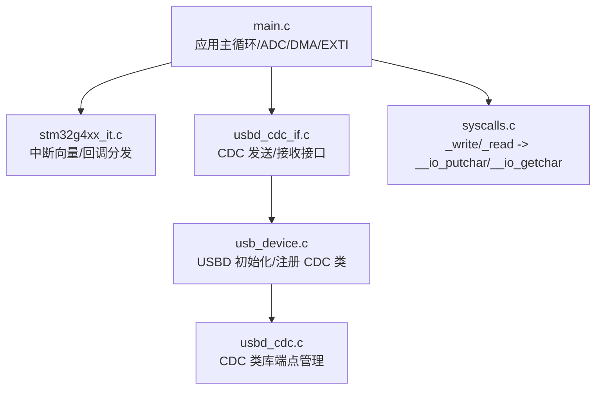
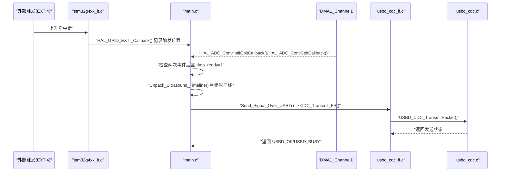
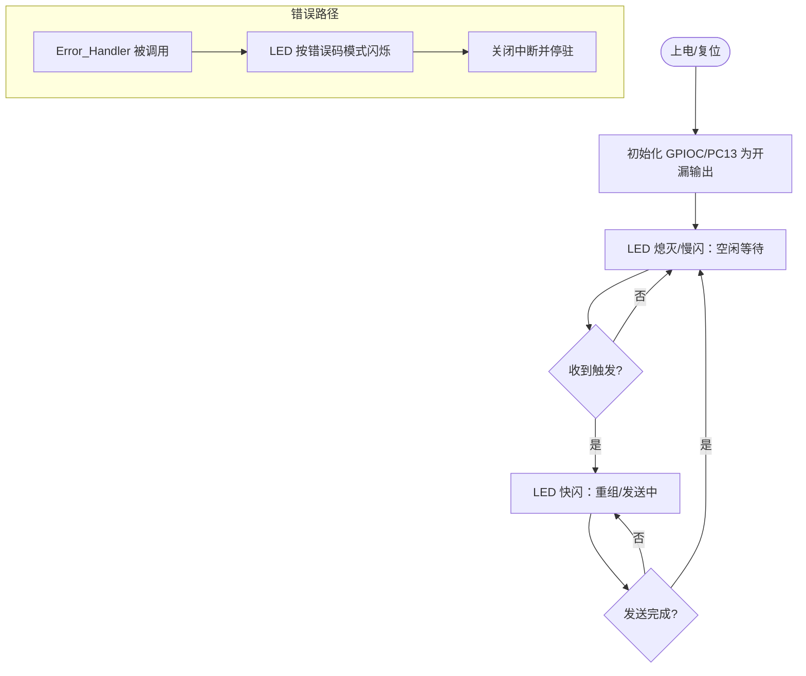
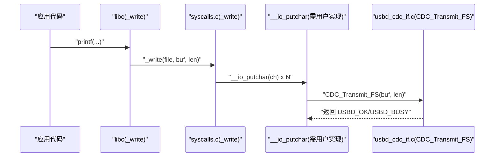
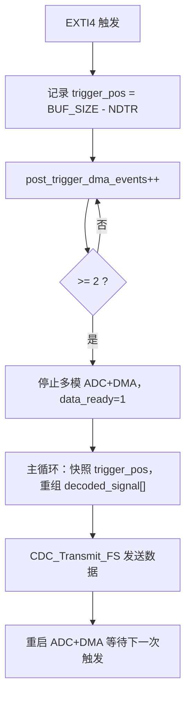
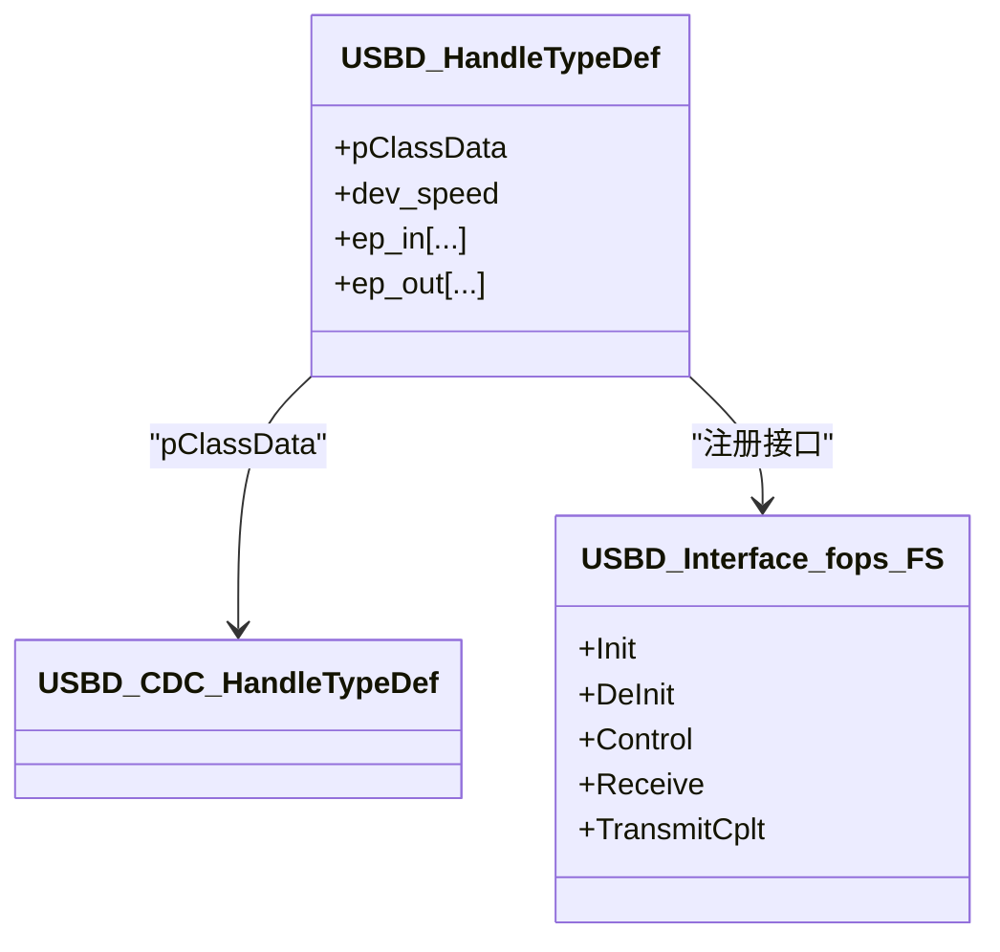
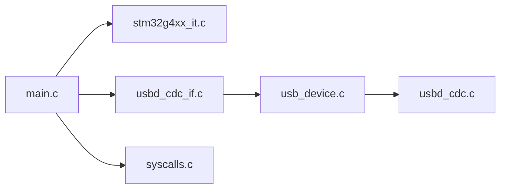

# 调试工具和技巧

<cite>
**本文引用的文件**   
- [Core/Src/main.c](file://Core/Src/main.c)
- [Core/Inc/main.h](file://Core/Inc/main.h)
- [Core/Src/stm32g4xx_it.c](file://Core/Src/stm32g4xx_it.c)
- [Core/Src/syscalls.c](file://Core/Src/syscalls.c)
- [USB_Device/App/usbd_cdc_if.c](file://USB_Device/App/usbd_cdc_if.c)
- [USB_Device/App/usbd_cdc_if.h](file://USB_Device/App/usbd_cdc_if.h)
- [USB_Device/App/usb_device.c](file://USB_Device/App/usb_device.c)
- [Middlewares/ST/STM32_USB_Device_Library/Class/CDC/Src/usbd_cdc.c](file://Middlewares/ST/STM32_USB_Device_Library/Class/CDC/Src/usbd_cdc.c)
</cite>

## 目录
1. [简介](#简介)
2. [项目结构](#项目结构)
3. [核心组件](#核心组件)
4. [架构总览](#架构总览)
5. [详细组件分析](#详细组件分析)
6. [依赖关系分析](#依赖关系分析)
7. [性能与实时性考虑](#性能与实时性考虑)
8. [故障排查指南](#故障排查指南)
9. [结论](#结论)
10. [附录：调试环境与常用命令参考](#附录调试环境与常用命令参考)

## 简介
本指南面向嵌入式开发，围绕该 STM32G4 工程提供一套系统化的调试方法与技巧。重点覆盖：
- LED 状态指示（PC13）的含义、闪烁模式编码与故障指示策略
- 串口日志输出技术：将 printf 重定向到 USB CDC、格式化输出与性能统计打印
- 断点调试技巧：IDE 调试器使用、变量监视、内存查看、调用栈分析
- 硬件调试工具：示波器波形分析、逻辑分析仪设置与时序测量
- 实时调试技术：单步执行、条件断点、性能分析器
- 调试环境搭建与常用命令参考

## 项目结构
本项目基于 STM32CubeMX 生成，包含应用层、HAL 驱动、USB CDC 设备类库以及系统初始化等关键模块。与调试密切相关的代码主要分布在以下位置：
- 应用主循环与外设初始化：Core/Src/main.c
- 中断服务程序：Core/Src/stm32g4xx_it.c
- C 标准 I/O 重定向入口：Core/Src/syscalls.c
- USB CDC 接口实现：USB_Device/App/usbd_cdc_if.c 与 usb_device.c
- USB CDC 类库底层：Middlewares/.../usbd_cdc.c

图表来源
- [Core/Src/main.c:219-290](file://Core/Src/main.c#L219-L290)
- [Core/Src/stm32g4xx_it.c:205-228](file://Core/Src/stm32g4xx_it.c#L205-L228)
- [USB_Device/App/usbd_cdc_if.c:281-293](file://USB_Device/App/usbd_cdc_if.c#L281-L293)
- [USB_Device/App/usb_device.c:66-88](file://USB_Device/App/usb_device.c#L66-L88)
- [Middlewares/ST/STM32_USB_Device_Library/Class/CDC/Src/usbd_cdc.c:467-512](file://Middlewares/ST/STM32_USB_Device_Library/Class/CDC/Src/usbd_cdc.c#L467-L512)

章节来源
- [Core/Src/main.c:219-290](file://Core/Src/main.c#L219-L290)
- [USB_Device/App/usb_device.c:66-88](file://USB_Device/App/usb_device.c#L66-L88)

## 核心组件
- LED 状态指示（PC13）
  - 端口配置为开漏输出，低电平点亮；提供开关与翻转的内联函数，便于在错误处理或运行态快速反馈。
- USB CDC 虚拟串口
  - 通过 USBD_CDC_TransmitPacket 进行非阻塞发送；上层可封装成类似 printf 的日志通道。
- 中断与 DMA
  - EXTI4 作为触发源，DMA1 Channel1 完成 ADC 数据搬运；主循环在 data_ready 标志置位后重组并发送数据。
- C 标准 I/O 重定向
  - syscalls.c 暴露 _write/_read，结合 __io_putchar/__io_getchar 钩子，可将 printf 输出导向 USB CDC。

章节来源
- [Core/Src/main.c:41-45](file://Core/Src/main.c#L41-L45)
- [Core/Src/main.c:488-520](file://Core/Src/main.c#L488-L520)
- [USB_Device/App/usbd_cdc_if.c:281-293](file://USB_Device/App/usbd_cdc_if.c#L281-L293)
- [Core/Src/syscalls.c:80-90](file://Core/Src/syscalls.c#L80-L90)

## 架构总览
下图展示了从“触发采集”到“USB CDC 上报”的完整流程，以及与 LED 和中断的关系。

图表来源
- [Core/Src/stm32g4xx_it.c:205-214](file://Core/Src/stm32g4xx_it.c#L205-L214)
- [Core/Src/main.c:91-131](file://Core/Src/main.c#L91-L131)
- [Core/Src/main.c:156-171](file://Core/Src/main.c#L156-L171)
- [Core/Src/main.c:178-212](file://Core/Src/main.c#L178-L212)
- [USB_Device/App/usbd_cdc_if.c:281-293](file://USB_Device/App/usbd_cdc_if.c#L281-L293)
- [Middlewares/ST/STM32_USB_Device_Library/Class/CDC/Src/usbd_cdc.c:467-512](file://Middlewares/ST/STM32_USB_Device_Library/Class/CDC/Src/usbd_cdc.c#L467-L512)

## 详细组件分析

### LED 状态指示系统（PC13）
- 硬件特性
  - PC13 配置为开漏输出，低电平点亮。工程中提供了三个内联操作：点亮、熄灭、翻转。
- 建议的状态含义与闪烁模式编码
  - 常亮：系统正常运行
  - 慢闪（例如 1Hz）：空闲等待触发
  - 快闪（例如 4Hz）：正在传输数据
  - 双短闪间隔长：检测到触发但尚未完成重组
  - 持续闪烁异常码：不同频率/占空比表示不同错误类型（如 USB 未就绪、DMA 溢出、ADC 配置失败等）
- 故障指示代码设计要点
  - 使用 volatile 全局计数或状态机，避免在中断中直接做复杂逻辑
  - 在主循环中统一刷新 LED，确保时序稳定
  - 错误路径进入 Error_Handler 前，可通过 LED 固定模式提示错误类型

图表来源
- [Core/Src/main.c:488-520](file://Core/Src/main.c#L488-L520)
- [Core/Src/main.c:530-539](file://Core/Src/main.c#L530-L539)

章节来源
- [Core/Src/main.c:41-45](file://Core/Src/main.c#L41-L45)
- [Core/Src/main.c:488-520](file://Core/Src/main.c#L488-L520)
- [Core/Src/main.c:530-539](file://Core/Src/main.c#L530-L539)

### 串口日志输出技术（printf 重定向到 USB CDC）
- 重定向链路
  - 应用层调用 printf -> libc _write -> syscalls.c 中的 _write -> __io_putchar
  - 需要在某处实现 __io_putchar，将其写入 USB CDC 发送缓冲区（例如调用 CDC_Transmit_FS）
- 格式化输出
  - 可使用 %d/%u/%x/%s 等格式符；注意在资源受限环境下控制输出量
- 性能统计信息打印
  - 建议在空闲时或任务边界打印，避免阻塞关键路径
  - 可周期性累计指标（如 DMA 次数、触发次数、发送字节数），以固定频率输出

图表来源
- [Core/Src/syscalls.c:80-90](file://Core/Src/syscalls.c#L80-L90)
- [USB_Device/App/usbd_cdc_if.c:281-293](file://USB_Device/App/usbd_cdc_if.c#L281-L293)

章节来源
- [Core/Src/syscalls.c:80-90](file://Core/Src/syscalls.c#L80-L90)
- [USB_Device/App/usbd_cdc_if.c:281-293](file://USB_Device/App/usbd_cdc_if.c#L281-L293)

### 中断与 DMA 协作（触发采集与重组）
- 触发捕获
  - EXTI4 上升沿进入 HAL_GPIO_EXTI_Callback，读取 DMA 剩余计数以确定环形缓冲写入位置
- 后置触发采样保证
  - 通过半传输与全传输回调计数，确保至少两个事件后才认为采集完成
- 数据重组与发送
  - 主循环在 data_ready 置位后，快照触发位置，重组线性时间线并通过 USB CDC 发送

图表来源
- [Core/Src/main.c:91-131](file://Core/Src/main.c#L91-L131)
- [Core/Src/main.c:156-171](file://Core/Src/main.c#L156-L171)
- [Core/Src/main.c:178-212](file://Core/Src/main.c#L178-L212)
- [Core/Src/main.c:264-289](file://Core/Src/main.c#L264-L289)

章节来源
- [Core/Src/main.c:91-131](file://Core/Src/main.c#L91-L131)
- [Core/Src/main.c:156-171](file://Core/Src/main.c#L156-L171)
- [Core/Src/main.c:178-212](file://Core/Src/main.c#L178-L212)
- [Core/Src/main.c:264-289](file://Core/Src/main.c#L264-L289)

### USB CDC 设备类与端点管理
- 初始化流程
  - MX_USB_Device_Init 注册 CDC 类与接口，启动 USBD
- 发送接口
  - CDC_Transmit_FS 设置发送缓冲区并调用 USBD_CDC_TransmitPacket，返回发送状态
- 类库端点管理
  - usbd_cdc.c 根据设备速度打开 IN/OUT 端点并配置包大小

图表来源
- [USB_Device/App/usb_device.c:66-88](file://USB_Device/App/usb_device.c#L66-L88)
- [USB_Device/App/usbd_cdc_if.c:138-145](file://USB_Device/App/usbd_cdc_if.c#L138-L145)
- [Middlewares/ST/STM32_USB_Device_Library/Class/CDC/Src/usbd_cdc.c:467-512](file://Middlewares/ST/STM32_USB_Device_Library/Class/CDC/Src/usbd_cdc.c#L467-L512)

章节来源
- [USB_Device/App/usb_device.c:66-88](file://USB_Device/App/usb_device.c#L66-L88)
- [USB_Device/App/usbd_cdc_if.c:138-145](file://USB_Device/App/usbd_cdc_if.c#L138-L145)
- [Middlewares/ST/STM32_USB_Device_Library/Class/CDC/Src/usbd_cdc.c:467-512](file://Middlewares/ST/STM32_USB_Device_Library/Class/CDC/Src/usbd_cdc.c#L467-L512)

## 依赖关系分析
- main.c 依赖 HAL、USB 设备库与 CDC 接口
- stm32g4xx_it.c 负责中断分发，调用 HAL 回调
- syscalls.c 提供 _write/_read 钩子，连接 libc 与底层 __io_putchar/__io_getchar
- usbd_cdc_if.c 暴露 CDC_Transmit_FS 供应用层调用
- usb_device.c 完成 USBD 初始化与 CDC 类注册
- usbd_cdc.c 管理端点与数据包收发

图表来源
- [Core/Src/main.c:219-290](file://Core/Src/main.c#L219-L290)
- [Core/Src/stm32g4xx_it.c:205-228](file://Core/Src/stm32g4xx_it.c#L205-L228)
- [Core/Src/syscalls.c:80-90](file://Core/Src/syscalls.c#L80-L90)
- [USB_Device/App/usbd_cdc_if.c:281-293](file://USB_Device/App/usbd_cdc_if.c#L281-L293)
- [USB_Device/App/usb_device.c:66-88](file://USB_Device/App/usb_device.c#L66-L88)
- [Middlewares/ST/STM32_USB_Device_Library/Class/CDC/Src/usbd_cdc.c:467-512](file://Middlewares/ST/STM32_USB_Device_Library/Class/CDC/Src/usbd_cdc.c#L467-L512)

章节来源
- [Core/Src/main.c:219-290](file://Core/Src/main.c#L219-L290)
- [USB_Device/App/usb_device.c:66-88](file://USB_Device/App/usb_device.c#L66-L88)

## 性能与实时性考虑
- 中断上下文最小化
  - EXTI 回调仅记录触发位置与事件计数，避免耗时操作
- DMA 环形缓冲与重组
  - 主循环快照触发位置，避免 ISR 竞争导致的数据错乱
- USB CDC 发送
  - 批量组装数据后一次性发送，减少多次小包带来的开销
- 时钟与定时器
  - 利用 SysTick 与 HAL_IncTick 提供的时基，实现稳定的 LED 闪烁与周期统计

章节来源
- [Core/Src/main.c:91-131](file://Core/Src/main.c#L91-L131)
- [Core/Src/main.c:156-171](file://Core/Src/main.c#L156-L171)
- [Core/Src/main.c:178-212](file://Core/Src/main.c#L178-L212)
- [Core/Src/stm32g4xx_it.c:184-193](file://Core/Src/stm32g4xx_it.c#L184-L193)

## 故障排查指南
- 常见问题定位
  - USB 无法枚举：检查 MX_USB_Device_Init 是否成功，确认 CDC 类与接口已注册
  - 发送阻塞：CDC_Transmit_FS 返回 USBD_BUSY 时需重试或退避
  - 触发丢失：确认 EXTI4 优先级与去抖逻辑，避免 UART 期间误触发
  - 数据错位：检查 trigger_pos 快照与重组起始索引计算
- 错误处理
  - Error_Handler 中可加入 LED 错误码闪烁，辅助快速定位
- 日志与断点
  - 在关键路径插入日志输出（经 USB CDC），配合 IDE 断点观察变量变化

章节来源
- [USB_Device/App/usb_device.c:66-88](file://USB_Device/App/usb_device.c#L66-L88)
- [USB_Device/App/usbd_cdc_if.c:281-293](file://USB_Device/App/usbd_cdc_if.c#L281-L293)
- [Core/Src/main.c:530-539](file://Core/Src/main.c#L530-L539)

## 结论
通过 LED 状态指示、USB CDC 日志输出、中断与 DMA 协作机制，以及合理的错误处理与性能优化，可在该 STM32G4 平台上构建高效可靠的调试体系。结合 IDE 调试器与硬件测试仪器，可进一步缩短问题定位时间，提升开发效率。

## 附录：调试环境与常用命令参考
- 环境搭建
  - 使用支持 SWD 的调试器（如 ST-Link）连接目标板
  - 在 IDE 中启用 SWD 调试，下载固件后进入调试模式
- 常用调试功能
  - 断点：在关键函数入口/出口设置断点，观察参数与返回值
  - 变量监视：添加全局变量（如 data_ready、trigger_pos、post_trigger_dma_events）到监视窗口
  - 内存查看：查看 adc_raw_buffer 与 decoded_signal 内容，验证重组结果
  - 调用栈：在断点处查看 Call Stack，定位最近一次调用链
- 实时调试技巧
  - 单步执行：Step Over/Into 逐步跟踪重组与发送逻辑
  - 条件断点：仅在 data_ready==1 时暂停，减少干扰
  - 性能分析：在发送前后打点，统计耗时；或在空闲时输出统计信息
- 硬件调试工具
  - 示波器：测量 PC13 引脚波形，验证 LED 闪烁模式与触发边沿
  - 逻辑分析仪：抓取 PA4（EXTI4）与 PC13 信号，分析时序关系
  - 信号时序测量：对比触发时刻与 DMA 回调到达时间，评估延迟

[本节为通用指导，不直接分析具体源码文件]