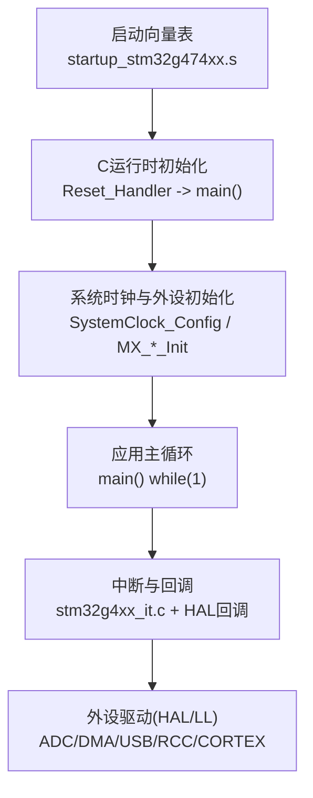
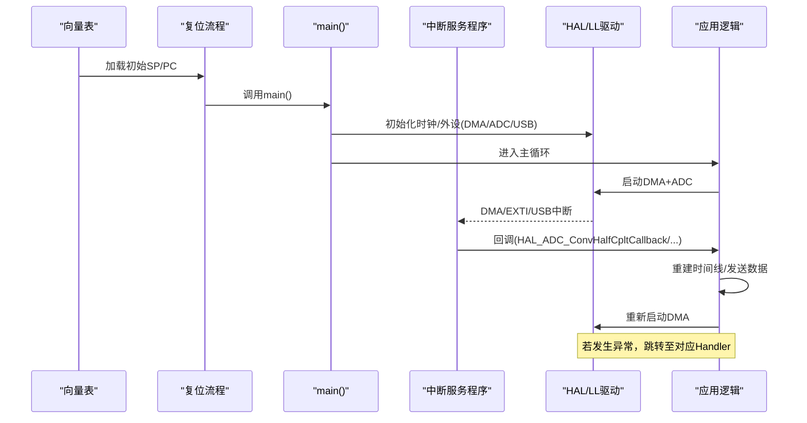
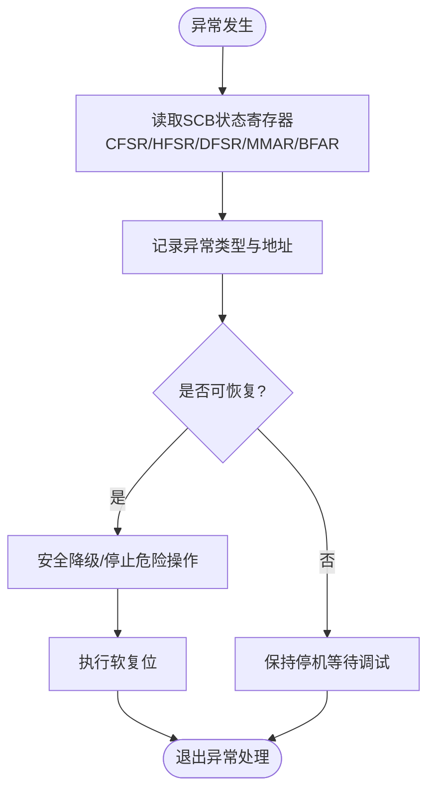
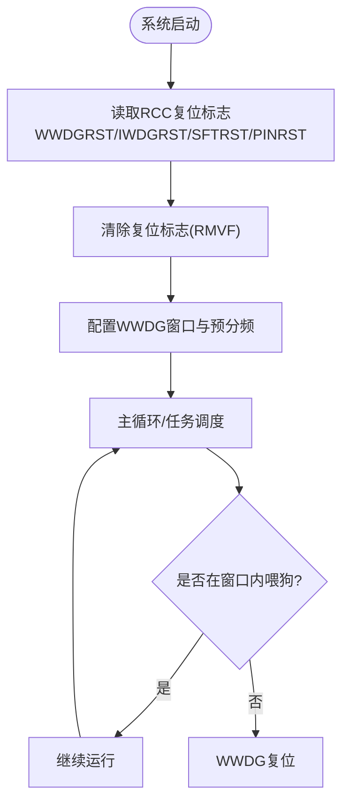
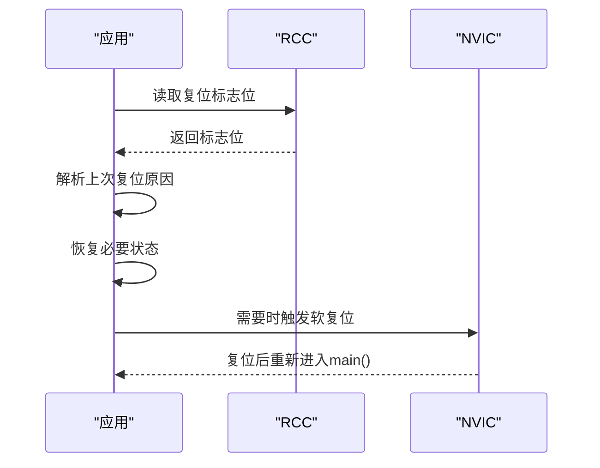
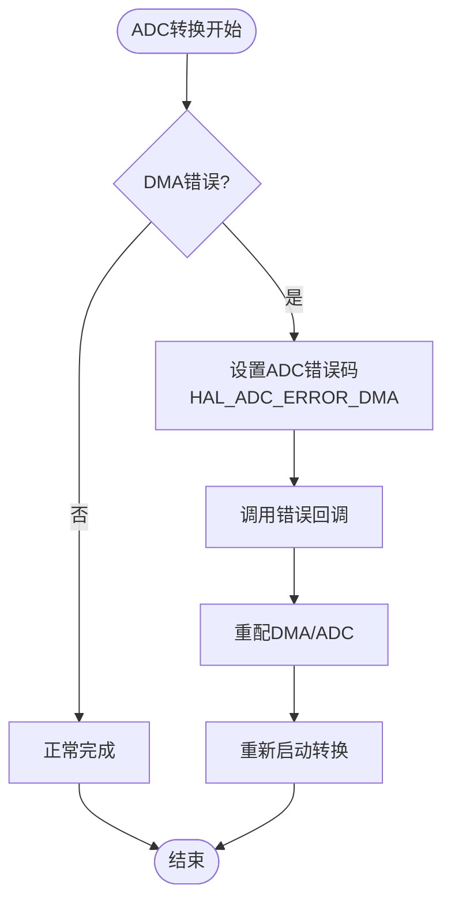
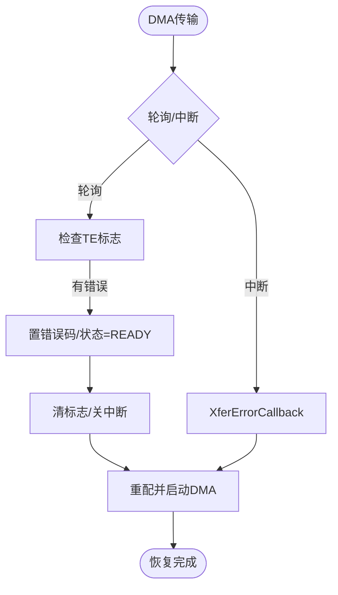
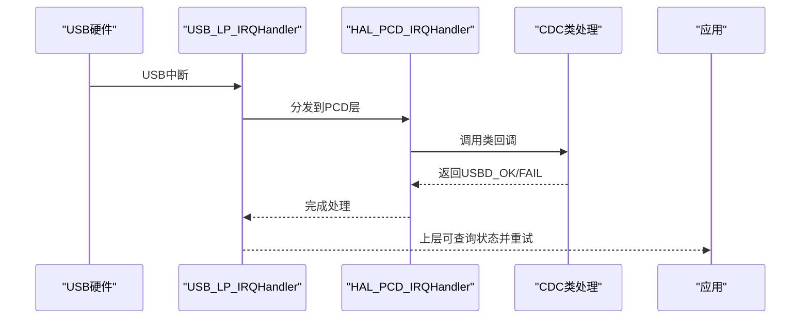
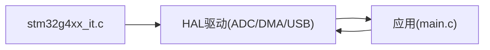

# 错误恢复机制

<cite>
**本文引用的文件**   
- [main.c](file://Core/Src/main.c)
- [stm32g4xx_it.h](file://Core/Inc/stm32g4xx_it.h)
- [stm32g4xx_it.c](file://Core/Src/stm32g4xx_it.c)
- [startup_stm32g474xx.s](file://startup_stm32g474xx.s)
- [stm32g4xx_hal_cortex.h](file://Drivers/STM32G4xx_HAL_Driver/Inc/stm32g4xx_hal_cortex.h)
- [stm32g4xx_ll_rcc.h](file://Drivers/STM32G4xx_HAL_Driver/Inc/stm32g4xx_ll_rcc.h)
- [stm32g4xx_hal_rcc.h](file://Drivers/STM32G4xx_HAL_Driver/Inc/stm32g4xx_hal_rcc.h)
- [stm32g4xx_ll_cortex.h](file://Drivers/STM32G4xx_HAL_Driver/Inc/stm32g4xx_ll_cortex.h)
- [stm32g4xx_hal_dma.h](file://Drivers/STM32G4xx_HAL_Driver/Inc/stm32g4xx_hal_dma.h)
- [stm32g4xx_hal_dma.c](file://Drivers/STM32G4xx_HAL_Driver/Src/stm32g4xx_hal_dma.c)
- [stm32g4xx_hal_adc.c](file://Drivers/STM32G4xx_HAL_Driver/Src/stm32g4xx_hal_adc.c)
- [usbd_cdc_if.c](file://USB_Device/App/usbd_cdc_if.c)
</cite>

## 目录
1. [引言](#引言)
2. [项目结构](#项目结构)
3. [核心组件](#核心组件)
4. [架构总览](#架构总览)
5. [详细组件分析](#详细组件分析)
6. [依赖关系分析](#依赖关系分析)
7. [性能考虑](#性能考虑)
8. [故障排查指南](#故障排查指南)
9. [结论](#结论)
10. [附录](#附录)

## 引言
本指南面向基于 STM32G4 的嵌入式系统，提供一套完善的错误恢复机制设计与实现建议。内容覆盖：
- 异常处理：HardFault、MemManage、BusFault、UsageFault 等捕获与诊断
- 看门狗定时器：独立看门狗(IWDG)与窗口看门狗(WWDG)的配置、超时与喂狗策略
- 系统重启策略：软复位、启动原因判断、状态保存与恢复
- 错误检测与恢复：ADC 错误检测、DMA 传输错误恢复、USB 通信错误处理
- 容错编程：输入验证、边界检查、资源清理
- 错误日志与诊断信息收集

## 项目结构
本项目采用 CubeMX 生成的标准工程结构，关键目录与职责如下：
- Core/Src 与 Core/Inc：应用主循环、中断服务程序、外设初始化入口
- Drivers/STM32G4xx_HAL_Driver：HAL/LL 驱动库，包含 ADC/DMA/RCC/CORTEX 等接口
- USB_Device/App：USB CDC 类应用层（虚拟串口）
- startup_stm32g474xx.s：向量表与复位流程

**图示来源** 
- [startup_stm32g474xx.s:58-106](file://startup_stm32g474xx.s#L58-L106)
- [main.c:219-290](file://Core/Src/main.c#L219-L290)
- [stm32g4xx_it.c:205-242](file://Core/Src/stm32g4xx_it.c#L205-L242)

**章节来源**
- [startup_stm32g474xx.s:58-106](file://startup_stm32g474xx.s#L58-L106)
- [main.c:219-290](file://Core/Src/main.c#L219-L290)

## 核心组件
- 异常与中断框架
  - 向量表定义与默认处理器入口
  - Cortex-M4 异常处理函数占位（NMI/HardFault/MemManage/BusFault/UsageFault 等）
- 外设与数据通路
  - ADC1/ADC2 双通道交错采样，DMA 环形缓冲
  - EXTI 触发采集，USB CDC 输出结果
- 系统控制
  - RCC 复位标志读取与清除
  - CORTEX 异常屏蔽与调试寄存器访问

**章节来源**
- [stm32g4xx_it.h:49-60](file://Core/Inc/stm32g4xx_it.h#L49-L60)
- [stm32g4xx_it.c:85-140](file://Core/Src/stm32g4xx_it.c#L85-L140)
- [main.c:48-82](file://Core/Src/main.c#L48-L82)
- [stm32g4xx_ll_rcc.h:2688-2731](file://Drivers/STM32G4xx_HAL_Driver/Inc/stm32g4xx_ll_rcc.h#L2688-L2731)

## 架构总览
下图展示从复位到异常处理的整体路径，以及外设错误如何上报至应用层进行恢复。

**图示来源** 
- [startup_stm32g474xx.s:133-149](file://startup_stm32g474xx.s#L133-L149)
- [stm32g4xx_it.c:205-242](file://Core/Src/stm32g4xx_it.c#L205-L242)
- [main.c:249-287](file://Core/Src/main.c#L249-L287)

## 详细组件分析

### 异常处理机制（HardFault/MemManage/BusFault/UsageFault）
- 现状
  - 向量表中已为 HardFault/MemManage/BusFault/UsageFault 预留入口
  - 当前实现为空循环，便于调试时挂起现场
- 增强建议
  - 在异常入口中读取并记录 SCB 相关寄存器（如 CFSR/HFSR/DFSR/MMAR/BFAR），通过 USB CDC 或持久化存储输出
  - 使用 LL 接口关闭特定可配置故障以定位问题源，再逐步启用
  - 在异常后尝试安全降级或软复位，避免死锁

**图示来源** 
- [stm32g4xx_it.c:85-140](file://Core/Src/stm32g4xx_it.c#L85-L140)
- [stm32g4xx_ll_cortex.h:397-410](file://Drivers/STM32G4xx_HAL_Driver/Inc/stm32g4xx_ll_cortex.h#L397-L410)
- [stm32g4xx_hal_cortex.h:114-124](file://Drivers/STM32G4xx_HAL_Driver/Inc/stm32g4xx_hal_cortex.h#L114-L124)

**章节来源**
- [stm32g4xx_it.h:49-60](file://Core/Inc/stm32g4xx_it.h#L49-L60)
- [stm32g4xx_it.c:85-140](file://Core/Src/stm32g4xx_it.c#L85-L140)
- [stm32g4xx_ll_cortex.h:397-410](file://Drivers/STM32G4xx_HAL_Driver/Inc/stm32g4xx_ll_cortex.h#L397-L410)
- [stm32g4xx_hal_cortex.h:114-124](file://Drivers/STM32G4xx_HAL_Driver/Inc/stm32g4xx_hal_cortex.h#L114-L124)

### 看门狗定时器（IWDG/WWDG）
- 复位原因判断
  - 使用 RCC CSR 标志位识别 IWDGRST/WWDGRST 等复位来源，并在启动时读取与清除
- WWDG 要点
  - 需在窗口范围内“喂狗”，否则触发复位
  - 可通过 DBGMCU 控制调试时是否冻结计数器
- IWDG 要点
  - 独立于内核，适合监控主循环卡死
  - 喂狗需按顺序解锁并写入密钥

**图示来源** 
- [stm32g4xx_ll_rcc.h:2688-2731](file://Drivers/STM32G4xx_HAL_Driver/Inc/stm32g4xx_ll_rcc.h#L2688-L2731)
- [stm32g4xx_hal_rcc.h:471-480](file://Drivers/STM32G4xx_HAL_Driver/Inc/stm32g4xx_hal_rcc.h#L471-L480)
- [stm32g4xx_ll_system.h:260-261](file://Drivers/STM32G4xx_HAL_Driver/Inc/stm32g4xx_ll_system.h#L260-L261)

**章节来源**
- [stm32g4xx_ll_rcc.h:2688-2731](file://Drivers/STM32G4xx_HAL_Driver/Inc/stm32g4xx_ll_rcc.h#L2688-L2731)
- [stm32g4xx_hal_rcc.h:471-480](file://Drivers/STM32G4xx_HAL_Driver/Inc/stm32g4xx_hal_rcc.h#L471-L480)
- [stm32g4xx_ll_system.h:260-261](file://Drivers/STM32G4xx_HAL_Driver/Inc/stm32g4xx_ll_system.h#L260-L261)

### 系统重启策略（软复位、启动原因、状态保存与恢复）
- 软复位
  - 通过 NVIC 触发系统复位，或在异常处理中调用复位 API
- 启动原因判断
  - 启动初期读取 RCC 复位标志位，区分软件复位、看门狗复位、引脚复位等
- 状态保存与恢复
  - 在异常或即将复位前，将关键上下文（指针、计数、错误码）写入备份区或保留 SRAM
  - 重启后根据标志位决定恢复策略（重试、降级、告警）

**图示来源** 
- [stm32g4xx_ll_rcc.h:2688-2731](file://Drivers/STM32G4xx_HAL_Driver/Inc/stm32g4xx_ll_rcc.h#L2688-L2731)
- [stm32g4xx_hal_rcc.h:3192-3197](file://Drivers/STM32G4xx_HAL_Driver/Inc/stm32g4xx_hal_rcc.h#L3192-3197)

**章节来源**
- [stm32g4xx_ll_rcc.h:2688-2731](file://Drivers/STM32G4xx_HAL_Driver/Inc/stm32g4xx_ll_rcc.h#L2688-L2731)
- [stm32g4xx_hal_rcc.h:3192-3197](file://Drivers/STM32G4xx_HAL_Driver/Inc/stm32g4xx_hal_rcc.h#L3192-3197)

### 错误检测与恢复流程

#### ADC 错误检测
- 关键点
  - 配置 Overrun 行为（保留/丢弃）以避免数据丢失
  - 监听 DMA 错误回调，设置 ADC 错误码并调用错误回调
- 恢复策略
  - 重置 DMA 与 ADC，必要时切换备用通道或降低采样率

**图示来源** 
- [stm32g4xx_hal_adc.c:3687-3699](file://Drivers/STM32G4xx_HAL_Driver/Src/stm32g4xx_hal_adc.c#L3687-L3699)
- [main.c:374-376](file://Core/Src/main.c#L374-L376)

**章节来源**
- [stm32g4xx_hal_adc.c:3687-3699](file://Drivers/STM32G4xx_HAL_Driver/Src/stm32g4xx_hal_adc.c#L3687-L3699)
- [main.c:374-376](file://Core/Src/main.c#L374-L376)

#### DMA 传输错误恢复
- 关键点
  - 轮询模式会检测 TE 标志并返回错误；中断模式下通过回调通知
  - 错误发生后清除标志、更新状态与错误码
- 恢复策略
  - 禁用相关中断，清空标志，重新配置并启动 DMA

**图示来源** 
- [stm32g4xx_hal_dma.c:657-690](file://Drivers/STM32G4xx_HAL_Driver/Src/stm32g4xx_hal_dma.c#L657-L690)
- [stm32g4xx_hal_dma.c:753-790](file://Drivers/STM32G4xx_HAL_Driver/Src/stm32g4xx_hal_dma.c#L753-L790)
- [stm32g4xx_hal_dma.h:100-108](file://Drivers/STM32G4xx_HAL_Driver/Inc/stm32g4xx_hal_dma.h#L100-L108)

**章节来源**
- [stm32g4xx_hal_dma.c:657-690](file://Drivers/STM32G4xx_HAL_Driver/Src/stm32g4xx_hal_dma.c#L657-L690)
- [stm32g4xx_hal_dma.c:753-790](file://Drivers/STM32G4xx_HAL_Driver/Src/stm32g4xx_hal_dma.c#L753-L790)
- [stm32g4xx_hal_dma.h:100-108](file://Drivers/STM32G4xx_HAL_Driver/Inc/stm32g4xx_hal_dma.h#L100-L108)

#### USB 通信错误处理
- 关键点
  - USB_LP_IRQHandler 转发至 PCD 层处理
  - CDC 类在控制请求和数据收发路径上返回 USBD_FAIL 表示失败
- 恢复策略
  - 上层检测到失败后进行重试、重置端点或提示用户重插设备

**图示来源** 
- [stm32g4xx_it.c:233-242](file://Core/Src/stm32g4xx_it.c#L233-L242)
- [usbd_cdc_if.c:180-200](file://USB_Device/App/usbd_cdc_if.c#L180-L200)

**章节来源**
- [stm32g4xx_it.c:233-242](file://Core/Src/stm32g4xx_it.c#L233-L242)
- [usbd_cdc_if.c:180-200](file://USB_Device/App/usbd_cdc_if.c#L180-L200)

### 容错编程实践
- 输入验证与边界检查
  - 对外部输入（长度、索引、枚举值）进行范围校验
  - 对数组访问增加越界保护
- 资源清理
  - 在错误分支确保释放锁、关闭外设、清中断标志
- 原子性与临界区
  - 共享变量使用 volatile，必要时用临界区保护
  - 示例：在主循环中快照触发位置，避免 ISR 竞争

**章节来源**
- [main.c:91-113](file://Core/Src/main.c#L91-L113)
- [main.c:264-287](file://Core/Src/main.c#L264-L287)

## 依赖关系分析
- 中断与驱动耦合
  - stm32g4xx_it.c 作为统一入口，转发到 HAL 层回调
  - HAL 层负责外设状态机与错误码管理
- 应用与驱动解耦
  - 应用仅依赖 HAL 回调与状态标志，便于替换底层实现

**图示来源** 
- [stm32g4xx_it.c:205-242](file://Core/Src/stm32g4xx_it.c#L205-L242)
- [main.c:249-287](file://Core/Src/main.c#L249-L287)

**章节来源**
- [stm32g4xx_it.c:205-242](file://Core/Src/stm32g4xx_it.c#L205-L242)
- [main.c:249-287](file://Core/Src/main.c#L249-L287)

## 性能考虑
- 中断上下文尽量短小，避免阻塞操作
- DMA 环形缓冲减少 CPU 参与，提高吞吐
- 错误处理路径最小化，优先保证系统稳定

## 故障排查指南
- 快速定位
  - 在异常入口记录 CFSR/HFSR/DFSR/MMAR/BFAR 等寄存器值
  - 通过 USB CDC 输出关键状态与最近一次成功操作
- 常见症状
  - HardFault：非法地址访问、栈溢出、未对齐访问
  - BusFault：总线配置错误或外设未使能
  - MemManage：MPU 权限违规
  - UsageFault：未定义指令或状态
- 恢复步骤
  - 读取复位标志位，确认是否为看门狗或软件复位
  - 检查 DMA/ADC 错误码，必要时重配并重启
  - 若 USB 失败，检查端点状态与描述符配置

**章节来源**
- [stm32g4xx_it.c:85-140](file://Core/Src/stm32g4xx_it.c#L85-L140)
- [stm32g4xx_ll_rcc.h:2688-2731](file://Drivers/STM32G4xx_HAL_Driver/Inc/stm32g4xx_ll_rcc.h#L2688-L2731)
- [stm32g4xx_hal_adc.c:3687-3699](file://Drivers/STM32G4xx_HAL_Driver/Src/stm32g4xx_hal_adc.c#L3687-L3699)
- [stm32g4xx_hal_dma.c:657-690](file://Drivers/STM32G4xx_HAL_Driver/Src/stm32g4xx_hal_dma.c#L657-L690)

## 结论
通过在异常入口完善诊断、引入看门狗与复位原因判断、建立 DMA/ADC/USB 的错误恢复闭环，并结合容错编程实践，可显著提升系统的鲁棒性与可维护性。建议在量产前加入自动化回归测试，覆盖典型错误注入场景。

## 附录
- 建议的异常处理清单
  - 记录寄存器与堆栈指针
  - 输出最近事件序列与错误码
  - 尝试安全降级与软复位
- 建议的喂狗策略
  - 在任务调度器中周期性喂狗
  - 在长耗时操作前后分别喂狗，确保窗口内动作