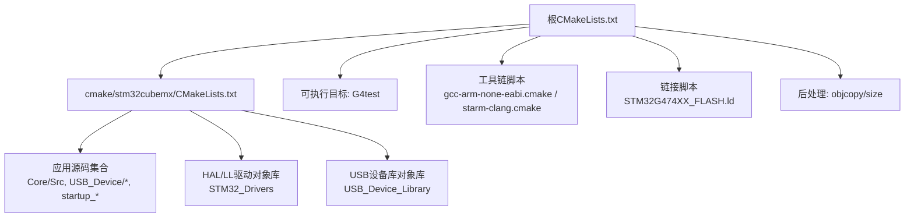
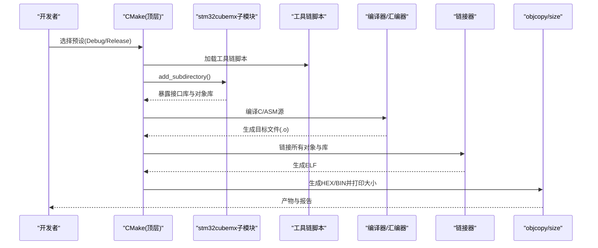
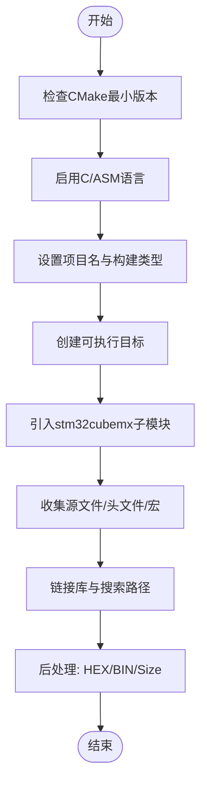
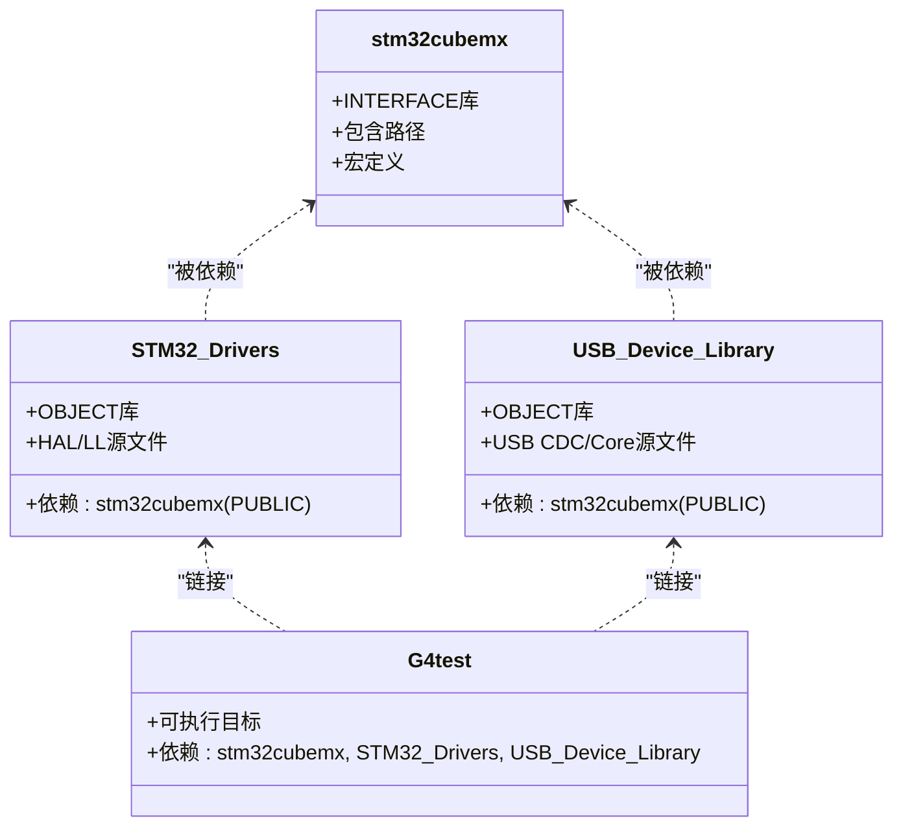
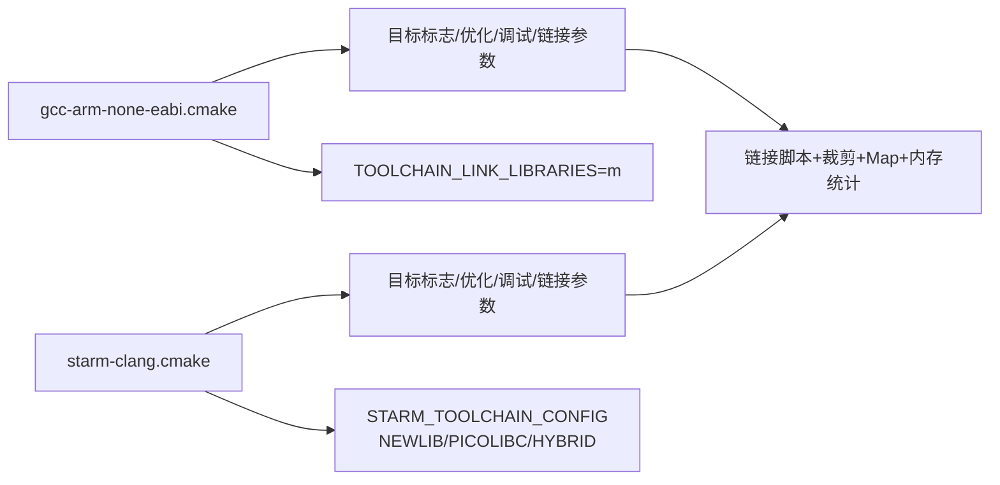
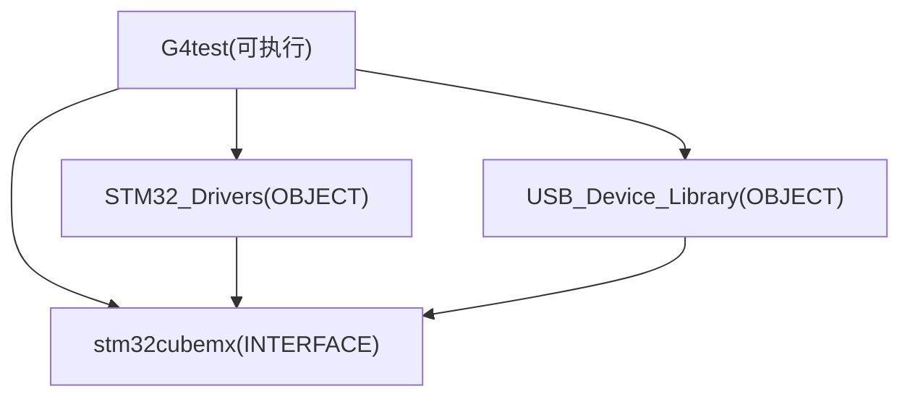

# CMake构建配置

<cite>
**本文引用的文件列表**
- [CMakeLists.txt](file://CMakeLists.txt)
- [cmake/stm32cubemx/CMakeLists.txt](file://cmake/stm32cubemx/CMakeLists.txt)
- [cmake/gcc-arm-none-eabi.cmake](file://cmake/gcc-arm-none-eabi.cmake)
- [cmake/starm-clang.cmake](file://cmake/starm-clang.cmake)
- [CMakePresets.json](file://CMakePresets.json)
- [STM32G474XX_FLASH.ld](file://STM32G474XX_FLASH.ld)
- [startup_stm32g474xx.s](file://startup_stm32g474xx.s)
- [Core/Src/main.c](file://Core/Src/main.c)
</cite>

## 目录
1. [简介](#简介)
2. [项目结构](#项目结构)
3. [核心组件](#核心组件)
4. [架构总览](#架构总览)
5. [详细组件分析](#详细组件分析)
6. [依赖关系分析](#依赖关系分析)
7. [性能与优化](#性能与优化)
8. [故障排查指南](#故障排查指南)
9. [结论](#结论)
10. [附录：CMake基础与进阶](#附录cmake基础与进阶)

## 简介
本文件面向使用CMake构建STM32嵌入式项目的开发者，围绕根级CMakeLists.txt、工具链脚本、STM32CubeMX子模块集成、编译/链接选项以及完整构建流程进行系统化说明。文档既适合初学者快速上手，也为高级用户提供定制与扩展的参考路径。

## 项目结构
本项目采用“顶层工程 + 子模块”的组织方式：
- 顶层CMakeLists.txt定义项目、语言、可执行目标及后处理命令（生成hex/bin）。
- cmake/stm32cubemx/CMakeLists.txt集中管理由STM32CubeMX生成的源文件、包含路径、宏定义，并创建中间库目标以组织HAL/LL驱动与USB设备库。
- cmake/gcc-arm-none-eabi.cmake与cmake/starm-clang.cmake为交叉编译工具链脚本，分别对应GNU ARM GCC与STARM Clang两种工具链。
- CMakePresets.json提供默认构建预设，简化配置与构建过程。
- STM32G474XX_FLASH.ld为链接脚本，定义内存布局与段映射。
- startup_stm32g474xx.s为启动文件，完成复位向量表、堆栈初始化与调用main入口。

图表来源
- [CMakeLists.txt:1-77](file://CMakeLists.txt#L1-L77)
- [cmake/stm32cubemx/CMakeLists.txt:1-114](file://cmake/stm32cubemx/CMakeLists.txt#L1-L114)
- [cmake/gcc-arm-none-eabi.cmake:1-48](file://cmake/gcc-arm-none-eabi.cmake#L1-L48)
- [cmake/starm-clang.cmake:1-66](file://cmake/starm-clang.cmake#L1-L66)
- [STM32G474XX_FLASH.ld:52-200](file://STM32G474XX_FLASH.ld#L52-L200)

章节来源
- [CMakeLists.txt:1-77](file://CMakeLists.txt#L1-L77)
- [cmake/stm32cubemx/CMakeLists.txt:1-114](file://cmake/stm32cubemx/CMakeLists.txt#L1-L114)
- [CMakePresets.json:1-38](file://CMakePresets.json#L1-L38)

## 核心组件
- 顶层工程与可执行目标
  - 设置C标准、启用C/ASM语言、创建可执行目标、添加子模块、链接库、后处理命令等。
- STM32CubeMX子模块
  - 集中声明宏定义、包含路径、应用源码、HAL/LL驱动与USB库，并以对象库形式聚合，最终链接到顶层可执行目标。
- 工具链脚本
  - 定义交叉编译器、汇编器、链接器、objcopy/size工具，设置MCU目标标志、优化等级、调试符号、链接参数（含链接脚本与裁剪策略）。
- 构建预设
  - 通过CMakePresets.json统一指定生成器、二进制目录、工具链文件与构建类型。

章节来源
- [CMakeLists.txt:10-77](file://CMakeLists.txt#L10-L77)
- [cmake/stm32cubemx/CMakeLists.txt:5-114](file://cmake/stm32cubemx/CMakeLists.txt#L5-L114)
- [cmake/gcc-arm-none-eabi.cmake:1-48](file://cmake/gcc-arm-none-eabi.cmake#L1-L48)
- [cmake/starm-clang.cmake:1-66](file://cmake/starm-clang.cmake#L1-L66)
- [CMakePresets.json:1-38](file://CMakePresets.json#L1-L38)

## 架构总览
下图展示从配置到构建再到链接的关键阶段与组件交互。

图表来源
- [CMakeLists.txt:31-77](file://CMakeLists.txt#L31-L77)
- [cmake/stm32cubemx/CMakeLists.txt:83-105](file://cmake/stm32cubemx/CMakeLists.txt#L83-L105)
- [cmake/gcc-arm-none-eabi.cmake:42-47](file://cmake/gcc-arm-none-eabi.cmake#L42-L47)
- [cmake/starm-clang.cmake:50-66](file://cmake/starm-clang.cmake#L50-L66)

## 详细组件分析

### 顶层CMakeLists.txt解析
- 版本与语言支持
  - 要求CMake最低版本，设置C标准为C11并开启扩展，启用C与ASM语言。
- 构建类型与项目名
  - 未显式指定时默认为Debug；设置项目名称并输出当前构建类型。
- 可执行目标与子模块
  - 创建可执行目标，引入cmake/stm32cubemx子模块。
- 源文件、包含路径与宏定义
  - 预留用户自定义位置，实际源码由子模块注入。
- 链接库与清理
  - 移除不需要的隐式库项，链接stm32cubemx及其依赖。
- 后处理命令
  - 在构建完成后使用objcopy生成hex与bin，并使用size输出占用信息。

图表来源
- [CMakeLists.txt:1-77](file://CMakeLists.txt#L1-L77)

章节来源
- [CMakeLists.txt:1-77](file://CMakeLists.txt#L1-L77)

### STM32CubeMX子模块详解
- 宏定义与包含路径
  - 集中定义USE_HAL_DRIVER、芯片型号等宏，并汇总应用层、HAL/LL、CMSIS与USB库的包含路径。
- 源码分组
  - 将应用源码、HAL/LL驱动源码、USB设备库源码分别归集为变量，便于维护与复用。
- 接口库与对象库
  - 创建接口库stm32cubemx用于传播包含路径与宏；创建对象库STM32_Drivers与USB_Device_Library聚合各自源文件，并通过PUBLIC属性向下游传递依赖。
- 链接与清理
  - 将对象库链接至顶层可执行目标，并将map文件加入clean清理范围。
- C标准校验
  - 若C标准为90或99则报错，强制要求C11及以上。

图表来源
- [cmake/stm32cubemx/CMakeLists.txt:5-114](file://cmake/stm32cubemx/CMakeLists.txt#L5-L114)

章节来源
- [cmake/stm32cubemx/CMakeLists.txt:1-114](file://cmake/stm32cubemx/CMakeLists.txt#L1-L114)

### 工具链脚本对比：GCC vs STARM Clang
- 共同点
  - 均设置系统名称与处理器架构，定义编译器/汇编器/链接器/objcopy/size前缀，设置可执行后缀为.elf，配置MCU目标标志（Cortex-M4、FPU、浮点ABI），设置优化与调试开关，链接脚本路径，启用gc-sections与Map输出，打印内存使用情况。
- 差异点
  - GCC工具链使用nano.specs，链接数学库m；Clang工具链根据STARM_TOOLCHAIN_CONFIG选择不同C运行时（NEWLIB/PICOLIBC/HYBRID），并相应调整链接参数。
  - ASM依赖项与依赖库略有不同（例如MMD/MP依赖项）。

图表来源
- [cmake/gcc-arm-none-eabi.cmake:24-47](file://cmake/gcc-arm-none-eabi.cmake#L24-L47)
- [cmake/starm-clang.cmake:23-66](file://cmake/starm-clang.cmake#L23-L66)

章节来源
- [cmake/gcc-arm-none-eabi.cmake:1-48](file://cmake/gcc-arm-none-eabi.cmake#L1-L48)
- [cmake/starm-clang.cmake:1-66](file://cmake/starm-clang.cmake#L1-L66)

### 构建预设与常用命令
- 预设内容
  - 默认预设使用Ninja生成器，指定二进制目录与工具链文件；Debug/Release预设继承默认预设并设置CMAKE_BUILD_TYPE。
- 常用命令示例
  - 配置：cmake --preset Debug
  - 构建：cmake --build --preset Debug
  - 清理：cmake --build --preset Debug --target clean

章节来源
- [CMakePresets.json:1-38](file://CMakePresets.json#L1-L38)

### 链接脚本与启动文件要点
- 链接脚本
  - 定义RAM与FLASH起始地址与长度，设置堆栈大小，划分.isr_vector、.text、.rodata、.data、.bss等段，导出必要全局符号供启动代码使用。
- 启动文件
  - 设置初始SP、调用SystemInit、拷贝.data、清零.bss、调用静态构造函数、跳转至main。

章节来源
- [STM32G474XX_FLASH.ld:52-200](file://STM32G474XX_FLASH.ld#L52-L200)
- [startup_stm32g474xx.s:58-106](file://startup_stm32g474xx.s#L58-L106)

## 依赖关系分析
- 目标依赖图
  - 顶层可执行目标依赖接口库stm32cubemx与两个对象库STM32_Drivers、USB_Device_Library。
  - 对象库通过PUBLIC依赖向上游传播包含路径与宏定义。
- 外部依赖
  - 工具链工具（gcc/clang、objcopy、size）需在PATH中可用。
  - 链接脚本位于工程根目录，需确保路径正确。

图表来源
- [cmake/stm32cubemx/CMakeLists.txt:83-105](file://cmake/stm32cubemx/CMakeLists.txt#L83-L105)
- [CMakeLists.txt:64-68](file://CMakeLists.txt#L64-L68)

章节来源
- [cmake/stm32cubemx/CMakeLists.txt:83-105](file://cmake/stm32cubemx/CMakeLists.txt#L83-L105)
- [CMakeLists.txt:64-68](file://CMakeLists.txt#L64-L68)

## 性能与优化
- 编译期优化
  - 使用-fdata-sections与-ffunction-sections配合链接期--gc-sections，有效减少体积。
  - Release模式使用-Os/-Oz，Debug模式使用-O0/-Og以便调试。
- 链接期优化
  - 启用--gc-sections与--print-memory-usage，结合Map文件定位冗余代码与数据。
- 增量构建
  - 使用Ninja生成器以获得更快的增量构建体验。
- 并行编译
  - 使用-j参数提升多核CPU下的编译速度。
- 避免不必要的依赖
  - 仅链接必要的库，减少间接依赖带来的体积与时间开销。

[本节为通用建议，无需特定文件引用]

## 故障排查指南
- 找不到交叉编译器
  - 现象：配置或构建时报找不到arm-none-eabi-gcc或starm-clang。
  - 排查：确认工具链已安装且其bin目录在PATH中；检查工具链脚本中的前缀是否正确。
- 链接错误：无法找到-mcpu/-mfpu等标志
  - 现象：链接器不支持某些目标标志。
  - 排查：确认工具链版本与MCU匹配；必要时调整工具链脚本中的TARGET_FLAGS。
- 链接脚本路径错误
  - 现象：链接阶段报找不到STM32G474XX_FLASH.ld。
  - 排查：检查工具链脚本中链接脚本路径是否指向工程根目录。
- 缺少.map文件或清理失败
  - 现象：clean后仍残留.map文件。
  - 排查：确认已在目标属性中添加ADDITIONAL_CLEAN_FILES。
- C标准不兼容
  - 现象：报错提示需要C11或更高。
  - 排查：确保CMAKE_C_STANDARD设置为11或以上。

章节来源
- [cmake/gcc-arm-none-eabi.cmake:1-48](file://cmake/gcc-arm-none-eabi.cmake#L1-L48)
- [cmake/starm-clang.cmake:1-66](file://cmake/starm-clang.cmake#L1-L66)
- [cmake/stm32cubemx/CMakeLists.txt:110-114](file://cmake/stm32cubemx/CMakeLists.txt#L110-L114)
- [CMakeLists.txt:70-76](file://CMakeLists.txt#L70-L76)

## 结论
该CMake构建系统通过顶层工程与子模块清晰分离了用户代码与STM32CubeMX生成代码，借助工具链脚本实现跨平台交叉编译，并通过对象库与接口库的组合提升了可维护性与可扩展性。遵循本文档的配置与优化建议，可在保证功能正确性的同时获得良好的构建效率与产物质量。

[本节为总结性内容，无需特定文件引用]

## 附录：CMake基础与进阶

### 初学者入门
- 关键概念
  - 项目(project)、目标(target)、源文件(sources)、包含路径(include directories)、宏定义(compile definitions)、库(libraries)。
- 常用命令
  - add_executable：创建可执行目标。
  - target_sources：为目标添加源文件。
  - target_include_directories：为目标添加包含路径。
  - target_link_libraries：为目标链接库。
  - add_custom_command：添加构建后处理命令（如生成hex/bin）。
- 构建流程概览
  - 配置阶段：解析CMakeLists与工具链，生成构建系统。
  - 编译阶段：按依赖顺序编译源文件为目标文件。
  - 链接阶段：将所有目标与库链接为可执行文件。
  - 后处理阶段：生成hex/bin并输出尺寸信息。

章节来源
- [CMakeLists.txt:31-77](file://CMakeLists.txt#L31-L77)
- [cmake/stm32cubemx/CMakeLists.txt:83-105](file://cmake/stm32cubemx/CMakeLists.txt#L83-L105)

### 高级定制指南
- 新增第三方库
  - 在顶层CMakeLists.txt中使用target_link_libraries链接新库；如需传播包含路径与宏，建议使用INTERFACE库封装。
- 条件编译与特性开关
  - 使用target_compile_definitions为目标添加宏，或通过CMake缓存变量控制分支逻辑。
- 多工具链切换
  - 通过CMakePresets.json切换不同工具链脚本，或在命令行传入-DCMAKE_TOOLCHAIN_FILE=...。
- 自定义后处理
  - 使用add_custom_command(TARGET ... POST_BUILD)添加更多产物转换或分析步骤。
- 调试与诊断
  - 使用CMAKE_EXPORT_COMPILE_COMMANDS生成compile_commands.json，配合clangd等IDE增强体验。
  - 利用Map文件与--print-memory-usage分析内存占用。

章节来源
- [CMakeLists.txt:24-26](file://CMakeLists.txt#L24-L26)
- [CMakeLists.txt:70-76](file://CMakeLists.txt#L70-L76)
- [CMakePresets.json:1-38](file://CMakePresets.json#L1-L38)