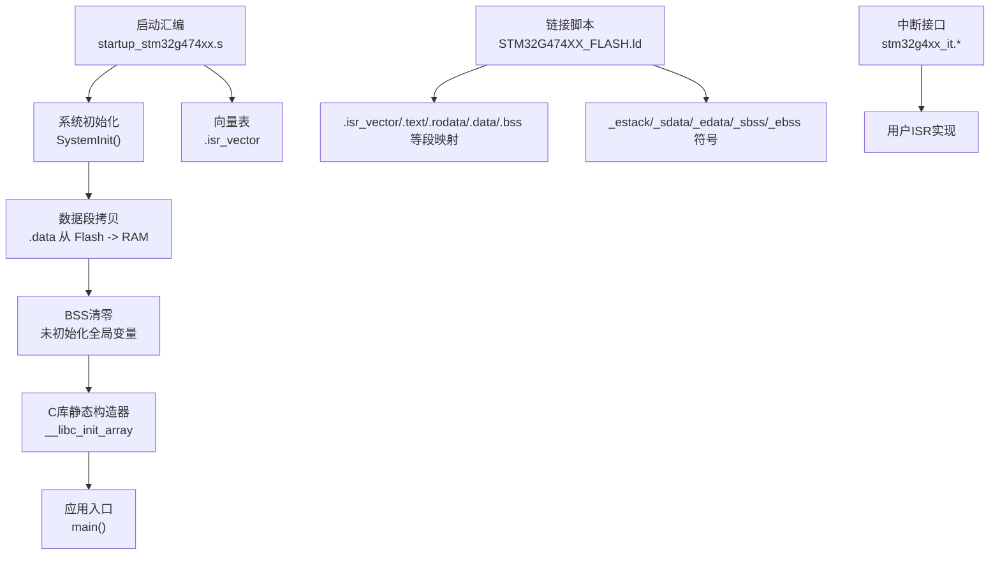
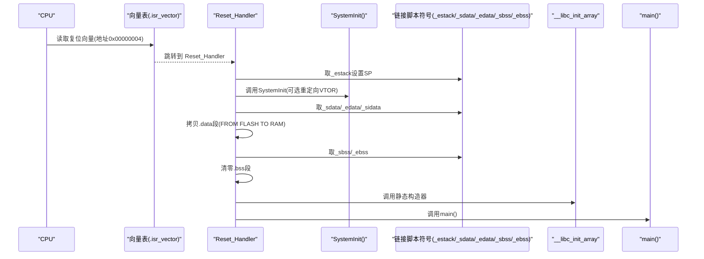
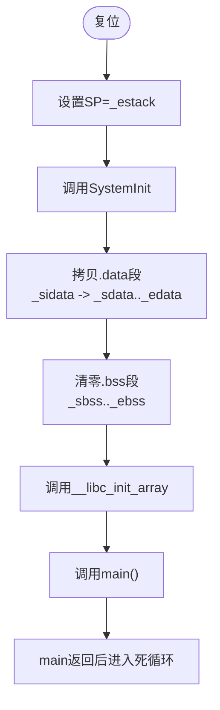
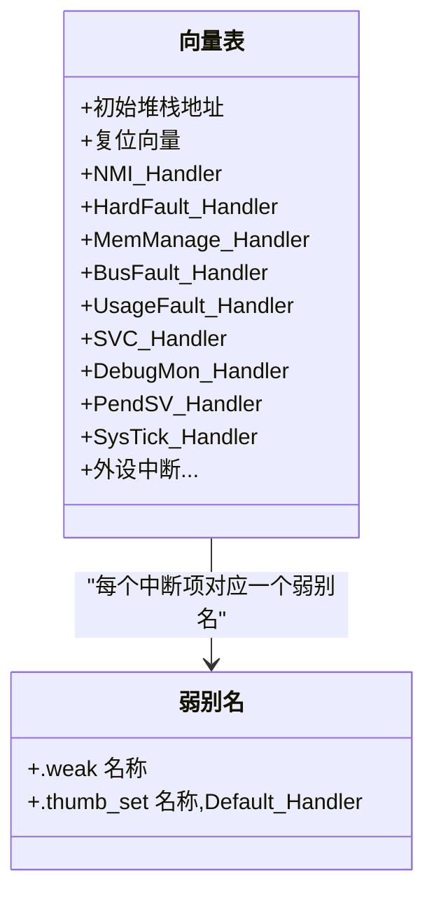
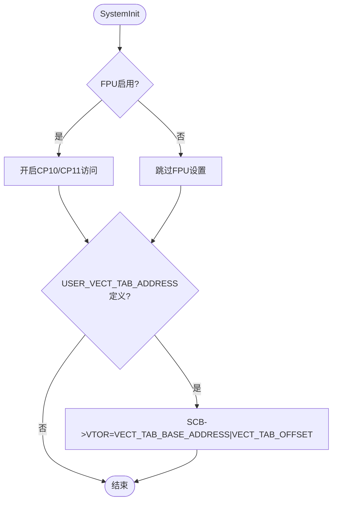
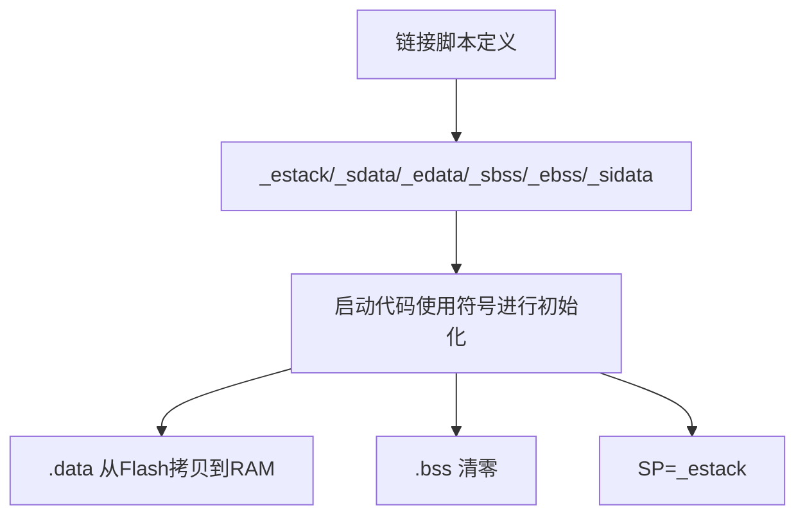
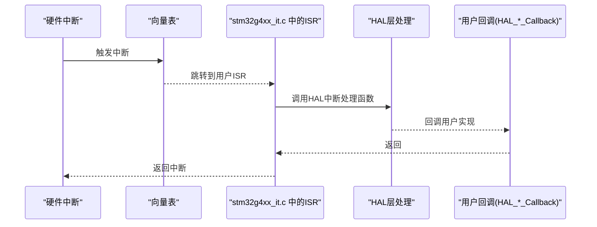
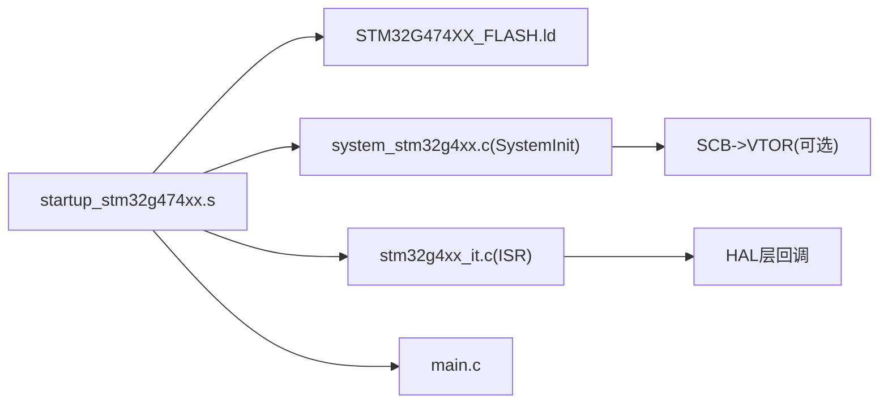

# 启动文件配置

<cite>
**本文引用的文件**   
- [startup_stm32g474xx.s](file://startup_stm32g474xx.s)
- [STM32G474XX_FLASH.ld](file://STM32G474XX_FLASH.ld)
- [system_stm32g4xx.c](file://Core\Src\system_stm32g4xx.c)
- [stm32g4xx_it.h](file://Core\Inc\stm32g4xx_it.h)
- [stm32g4xx_it.c](file://Core\Src\stm32g4xx_it.c)
- [main.c](file://Core\Src\main.c)
</cite>

## 目录
1. [简介](#简介)
2. [项目结构](#项目结构)
3. [核心组件](#核心组件)
4. [架构总览](#架构总览)
5. [详细组件分析](#详细组件分析)
6. [依赖关系分析](#依赖关系分析)
7. [性能与内存布局考量](#性能与内存布局考量)
8. [故障排查指南](#故障排查指南)
9. [结论](#结论)
10. [附录：中断服务程序添加与修改指南](#附录中断服务程序添加与修改指南)

## 简介
本文件面向使用 STM32G474xx 的开发者，系统化解析启动流程与启动文件配置。重点覆盖以下方面：
- 启动汇编文件 startup_stm32g474xx.s 的结构与执行流程（复位处理、向量表定义、初始堆栈设置）
- 中断向量表的组织顺序（复位、NMI、硬故障、外设中断等）
- 系统初始化过程（时钟、内存段初始化、C运行时环境、main 调用）
- 堆栈指针初始化与内存段的加载过程
- 启动时序图与关键步骤说明
- 自定义中断服务程序的添加与修改方法
- 启动文件与链接脚本的协作关系
- 为初学者提供嵌入式启动基本概念，为高级开发者提供定制与调试技巧

## 项目结构
本项目采用典型的 CubeMX/GCC 工程结构，启动相关的关键文件位于根目录与 Core 子目录中：
- 启动汇编文件：startup_stm32g474xx.s
- 链接脚本：STM32G474XX_FLASH.ld
- 系统初始化：Core/Src/system_stm32g4xx.c
- 中断入口与用户实现：Core/Inc/stm32g4xx_it.h 与 Core/Src/stm32g4xx_it.c
- 应用入口：Core/Src/main.c

图表来源
- [startup_stm32g474xx.s:58-106](file://startup_stm32g474xx.s#L58-L106)
- [startup_stm32g474xx.s:129-253](file://startup_stm32g474xx.s#L129-L253)
- [STM32G474XX_FLASH.ld:56-78](file://STM32G474XX_FLASH.ld#L56-L78)
- [STM32G474XX_FLASH.ld:151-166](file://STM32G474XX_FLASH.ld#L151-L166)
- [STM32G474XX_FLASH.ld:213-223](file://STM32G474XX_FLASH.ld#L213-L223)
- [system_stm32g4xx.c:181-192](file://Core\Src\system_stm32g4xx.c#L181-L192)
- [stm32g4xx_it.c:64-193](file://Core\Src\stm32g4xx_it.c#L64-L193)

章节来源
- [startup_stm32g474xx.s:1-106](file://startup_stm32g474xx.s#L1-L106)
- [STM32G474XX_FLASH.ld:52-78](file://STM32G474XX_FLASH.ld#L52-L78)
- [system_stm32g4xx.c:181-192](file://Core\Src\system_stm32g4xx.c#L181-L192)

## 核心组件
- 启动汇编与向量表：负责设置初始堆栈、跳转至 SystemInit、拷贝 .data、清零 .bss、调用 __libc_init_array 并进入 main；同时定义 g_pfnVectors 向量表及所有弱别名 ISR。
- 链接脚本：定义 FLASH/RAM 起始地址与长度，分配各段到相应区域，导出 _estack、_sdata、_edata、_sbss、_ebss 等符号供启动代码使用。
- 系统初始化：SystemInit 开启 FPU（若启用）、可选重定向向量表基址 VTOR。
- 中断接口：stm32g4xx_it.* 提供默认空实现或 HAL 回调封装，用户在此扩展具体逻辑。
- 应用入口：main 中调用 HAL_Init、SystemClock_Config 以及外设初始化，随后进入主循环。

章节来源
- [startup_stm32g474xx.s:58-106](file://startup_stm32g474xx.s#L58-L106)
- [startup_stm32g474xx.s:129-253](file://startup_stm32g474xx.s#L129-L253)
- [STM32G474XX_FLASH.ld:56-78](file://STM32G474XX_FLASH.ld#L56-L78)
- [STM32G474XX_FLASH.ld:151-166](file://STM32G474XX_FLASH.ld#L151-L166)
- [STM32G474XX_FLASH.ld:213-223](file://STM32G474XX_FLASH.ld#L213-L223)
- [system_stm32g4xx.c:181-192](file://Core\Src\system_stm32g4xx.c#L181-L192)
- [stm32g4xx_it.c:64-193](file://Core\Src\stm32g4xx_it.c#L64-L193)
- [main.c:219-290](file://Core\Src\main.c#L219-L290)

## 架构总览
下图展示从复位到 main 的完整启动路径，以及链接脚本对内存段与符号的影响。

图表来源
- [startup_stm32g474xx.s:58-106](file://startup_stm32g474xx.s#L58-L106)
- [startup_stm32g474xx.s:129-135](file://startup_stm32g474xx.s#L129-L135)
- [STM32G474XX_FLASH.ld:56-78](file://STM32G474XX_FLASH.ld#L56-L78)
- [STM32G474XX_FLASH.ld:151-166](file://STM32G474XX_FLASH.ld#L151-L166)
- [STM32G474XX_FLASH.ld:213-223](file://STM32G474XX_FLASH.ld#L213-L223)
- [system_stm32g4xx.c:181-192](file://Core\Src\system_stm32g4xx.c#L181-L192)

## 详细组件分析

### 启动汇编与复位流程
- 目标架构与指令集：声明 Cortex-M4、软浮点、Thumb 模式。
- 向量表与弱别名：定义 g_pfnVectors 向量表，并为每个异常/中断提供 .weak 别名指向 Default_Handler，便于用户覆盖。
- 复位入口 Reset_Handler：
  - 设置主堆栈指针 SP = _estack
  - 调用 SystemInit
  - 拷贝 .data 段（从 Flash 中的 _sidata 到 RAM 中的 _sdata，直到 _edata）
  - 清零 .bss 段（从 _sbss 到 _ebss）
  - 调用 __libc_init_array 执行静态构造器
  - 调用 main
  - 若 main 返回则进入死循环
- 默认处理器异常处理 Default_Handler：无限循环，便于调试定位。

图表来源
- [startup_stm32g474xx.s:58-106](file://startup_stm32g474xx.s#L58-L106)
- [startup_stm32g474xx.s:117-121](file://startup_stm32g474xx.s#L117-L121)

章节来源
- [startup_stm32g474xx.s:28-31](file://startup_stm32g474xx.s#L28-L31)
- [startup_stm32g474xx.s:58-106](file://startup_stm32g474xx.s#L58-L106)
- [startup_stm32g474xx.s:117-121](file://startup_stm32g474xx.s#L117-L121)

### 中断向量表组织
- 位置：.isr_vector 段，由链接脚本放置于 FLASH 起始处。
- 首项为初始堆栈顶地址，第二项为复位向量 Reset_Handler。
- 后续依次为 NMI、HardFault、MemManage、BusFault、UsageFault、保留位、SVC、DebugMon、PendSV、SysTick。
- 再后为外设中断（WWDG、PVD_PVM、RTC、FLASH、RCC、EXTI0~4、DMA1通道1~7、ADC1_2、USB_HP/LP、FDCAN1_IT0/IT1、EXTI9_5、TIM1系列、TIM2~4、I2C1_EV/ER、I2C2_EV/ER、SPI1/2、USART1~3、EXTI15_10、RTC_Alarm、USBWakeUp、TIM8系列、ADC3、FMC、LPTIM1、TIM5、SPI3、UART4/5、TIM6_DAC/TIM7_DAC、DMA2通道1~5、ADC4/5、UCPD1、COMP1_2_3、COMP4_5_6、COMP7、HRTIM1系列、CRS、SAI1、TIM20系列、FPU、I2C4_EV/ER、SPI4、保留、FDCAN2/3 IT0/IT1、RNG、LPUART1、I2C3_EV/ER、DMAMUX_OVR、QUADSPI、DMA1_Channel8、DMA2_Channel6~8、CORDIC、FMAC）。
- 每个向量项均为 .word 占位符，实际函数名通过弱别名机制在编译期绑定到用户实现或 Default_Handler。

图表来源
- [startup_stm32g474xx.s:129-253](file://startup_stm32g474xx.s#L129-L253)
- [startup_stm32g474xx.s:263-591](file://startup_stm32g474xx.s#L263-L591)

章节来源
- [startup_stm32g474xx.s:129-253](file://startup_stm32g474xx.s#L129-L253)
- [startup_stm32g474xx.s:263-591](file://startup_stm32g474xx.s#L263-L591)

### 系统初始化与向量表重定位
- SystemInit 主要工作：
  - 若启用 FPU，则开启 CP10/CP11 全访问权限
  - 若定义了 USER_VECT_TAB_ADDRESS，则根据 VECT_TAB_BASE_ADDRESS 与 VECT_TAB_OFFSET 设置 SCB->VTOR 以重定向向量表
- 向量表重定位条件宏：
  - USER_VECT_TAB_ADDRESS：是否启用重定位
  - VECT_TAB_SRAM：选择 SRAM 还是 FLASH 作为基址
  - VECT_TAB_OFFSET：偏移量（需按 0x200 对齐）

图表来源
- [system_stm32g4xx.c:181-192](file://Core\Src\system_stm32g4xx.c#L181-L192)
- [system_stm32g4xx.c:112-129](file://Core\Src\system_stm32g4xx.c#L112-L129)

章节来源
- [system_stm32g4xx.c:181-192](file://Core\Src\system_stm32g4xx.c#L181-L192)
- [system_stm32g4xx.c:112-129](file://Core\Src\system_stm32g4xx.c#L112-L129)

### 内存段初始化与堆栈设置
- 链接脚本定义：
  - MEMORY：FLASH 起始 0x8000000，长度 512K；RAM 起始 0x20000000，长度 128K
  - _estack = ORIGIN(RAM) + LENGTH(RAM)，即 RAM 顶端
  - _Min_Heap_Size 与 _Min_Stack_Size 用于检查堆栈空间是否足够
- 段映射：
  - .isr_vector、.text、.rodata、.ARM.extab、.ARM.exidx、.preinit_array、.init_array、.fini_array 放入 FLASH
  - .data 放入 RAM，但加载地址在 FLASH（AT> FLASH），启动时由启动代码拷贝
  - .bss 放入 RAM（NOLOAD），启动时清零
- 启动代码使用符号：
  - _sidata：.data 在 FLASH 中的起始地址
  - _sdata/_edata：.data 在 RAM 中的起止地址
  - _sbss/_ebss：.bss 在 RAM 中的起止地址

图表来源
- [STM32G474XX_FLASH.ld:56-78](file://STM32G474XX_FLASH.ld#L56-L78)
- [STM32G474XX_FLASH.ld:151-166](file://STM32G474XX_FLASH.ld#L151-L166)
- [STM32G474XX_FLASH.ld:213-223](file://STM32G474XX_FLASH.ld#L213-L223)
- [startup_stm32g474xx.s:36-46](file://startup_stm32g474xx.s#L36-L46)
- [startup_stm32g474xx.s:68-97](file://startup_stm32g474xx.s#L68-L97)

章节来源
- [STM32G474XX_FLASH.ld:56-78](file://STM32G474XX_FLASH.ld#L56-L78)
- [STM32G474XX_FLASH.ld:151-166](file://STM32G474XX_FLASH.ld#L151-L166)
- [STM32G474XX_FLASH.ld:213-223](file://STM32G474XX_FLASH.ld#L213-L223)
- [startup_stm32g474xx.s:36-46](file://startup_stm32g474xx.s#L36-L46)
- [startup_stm32g474xx.s:68-97](file://startup_stm32g474xx.s#L68-L97)

### 中断服务程序（ISR）的组织与用户扩展
- 启动文件中为每个中断提供弱别名，默认指向 Default_Handler。
- 用户可在 stm32g4xx_it.c 中实现同名函数覆盖默认行为。
- 常见做法：在 ISR 中调用 HAL 层的中断处理函数（如 HAL_GPIO_EXTI_IRQHandler、HAL_DMA_IRQHandler、HAL_PCD_IRQHandler），再由 HAL 回调到用户回调（如 HAL_GPIO_EXTI_Callback）。

图表来源
- [startup_stm32g474xx.s:263-591](file://startup_stm32g474xx.s#L263-L591)
- [stm32g4xx_it.c:205-242](file://Core\Src\stm32g4xx_it.c#L205-L242)

章节来源
- [startup_stm32g474xx.s:263-591](file://startup_stm32g474xx.s#L263-L591)
- [stm32g4xx_it.c:64-193](file://Core\Src\stm32g4xx_it.c#L64-L193)
- [stm32g4xx_it.c:205-242](file://Core\Src\stm32g4xx_it.c#L205-L242)

### 应用入口与系统时钟
- main 入口：
  - 调用 HAL_Init 初始化 HAL 与 SysTick
  - 调用 SystemClock_Config 配置系统时钟（HSI+PLL，最终 SYSCLK/HCLK/PCLK 分频）
  - 初始化 GPIO、DMA、ADC、USB 等设备
  - 进入主循环，处理业务逻辑
- 注意：SystemInit 已在启动阶段被调用，用于基础系统设置（如 FPU、可选 VTOR 重定位）。

章节来源
- [main.c:219-290](file://Core\Src\main.c#L219-L290)
- [main.c:296-337](file://Core\Src\main.c#L296-L337)
- [system_stm32g4xx.c:181-192](file://Core\Src\system_stm32g4xx.c#L181-L192)

## 依赖关系分析
- 启动汇编依赖链接脚本导出的符号（_estack、_sdata、_edata、_sbss、_ebss、_sidata）。
- 启动汇编调用 SystemInit（来自 system_stm32g4xx.c），后者可能设置 VTOR。
- 中断向量表项与 stm32g4xx_it.c 中的同名函数通过弱别名机制关联。
- main 依赖 HAL 与外设驱动，完成系统与应用初始化。

图表来源
- [startup_stm32g474xx.s:58-106](file://startup_stm32g474xx.s#L58-L106)
- [startup_stm32g474xx.s:129-253](file://startup_stm32g474xx.s#L129-L253)
- [STM32G474XX_FLASH.ld:56-78](file://STM32G474XX_FLASH.ld#L56-L78)
- [system_stm32g4xx.c:181-192](file://Core\Src\system_stm32g4xx.c#L181-L192)
- [stm32g4xx_it.c:205-242](file://Core\Src\stm32g4xx_it.c#L205-L242)
- [main.c:219-290](file://Core\Src\main.c#L219-L290)

章节来源
- [startup_stm32g474xx.s:58-106](file://startup_stm32g474xx.s#L58-L106)
- [startup_stm32g474xx.s:129-253](file://startup_stm32g474xx.s#L129-L253)
- [STM32G474XX_FLASH.ld:56-78](file://STM32G474XX_FLASH.ld#L56-L78)
- [system_stm32g4xx.c:181-192](file://Core\Src\system_stm32g4xx.c#L181-L192)
- [stm32g4xx_it.c:205-242](file://Core\Src\stm32g4xx_it.c#L205-L242)
- [main.c:219-290](file://Core\Src\main.c#L219-L290)

## 性能与内存布局考量
- 向量表大小与对齐：向量表必须按 4 字节对齐，且整体地址需满足 0x200 对齐要求（当重定位到 SRAM 时尤为关键）。
- .data 段拷贝开销：较大 .data 会增加启动时间，可考虑将常量放入 .rodata 以减少拷贝。
- .bss 清零开销：大量未初始化全局变量会延长启动时间，建议按需分配。
- 堆栈与堆大小：确保 _Min_Stack_Size 与 _Min_Heap_Size 合理，避免运行期溢出。
- 中断优先级与嵌套：合理设置 NVIC 优先级，避免长时间阻塞高优先级中断。
- 时钟配置：SystemClock_Config 中 PLL 参数影响功耗与性能，需结合外设需求权衡。

[本节为通用指导，不直接分析具体文件]

## 故障排查指南
- 无法进入 main：
  - 检查 _estack 是否正确（链接脚本中 RAM 长度与起始地址）
  - 确认 .data 与 .bss 符号范围正确
  - 查看 HardFault_Handler 是否进入（可能是非法地址访问或堆栈溢出）
- 中断未触发或未进入用户实现：
  - 确认向量表中对应项已绑定到用户 ISR（弱别名覆盖）
  - 检查 NVIC 使能与优先级配置
  - 确认 HAL 层回调是否注册
- 向量表重定位失败：
  - 确认 USER_VECT_TAB_ADDRESS 宏定义
  - 校验 VECT_TAB_BASE_ADDRESS 与 VECT_TAB_OFFSET 的对齐要求（0x200）
  - 验证 SCB->VTOR 写入成功

章节来源
- [startup_stm32g474xx.s:117-121](file://startup_stm32g474xx.s#L117-L121)
- [stm32g4xx_it.c:85-95](file://Core\Src\stm32g4xx_it.c#L85-L95)
- [system_stm32g4xx.c:181-192](file://Core\Src\system_stm32g4xx.c#L181-L192)
- [STM32G474XX_FLASH.ld:56-78](file://STM32G474XX_FLASH.ld#L56-L78)

## 结论
启动文件是嵌入式系统的“第一行代码”，其职责包括：
- 建立最小运行环境（堆栈、向量表、时钟、内存段）
- 衔接 C 运行时与用户应用（__libc_init_array、main）
- 为中断与异常提供统一入口与默认处理
通过理解启动汇编、链接脚本与系统初始化之间的协作关系，开发者可以安全地定制启动流程、优化启动时间与内存占用，并在出现异常时快速定位问题。

[本节为总结性内容，不直接分析具体文件]

## 附录：中断服务程序添加与修改指南
- 确定中断源与向量表项名称（参考 startup_stm32g474xx.s 中的外设中断项）
- 在 stm32g4xx_it.c 中添加同名函数实现，必要时调用 HAL 层处理函数
- 在 stm32g4xx_it.h 中声明该函数原型（CubeMX 通常自动生成）
- 在应用中启用对应中断（NVIC 使能、优先级设置）
- 如需重定向向量表，启用 USER_VECT_TAB_ADDRESS 并配置 VECT_TAB_BASE_ADDRESS 与 VECT_TAB_OFFSET

章节来源
- [startup_stm32g474xx.s:129-253](file://startup_stm32g474xx.s#L129-L253)
- [stm32g4xx_it.h:49-61](file://Core\Inc\stm32g4xx_it.h#L49-L61)
- [stm32g4xx_it.c:205-242](file://Core\Src\stm32g4xx_it.c#L205-L242)
- [system_stm32g4xx.c:112-129](file://Core\Src\system_stm32g4xx.c#L112-L129)