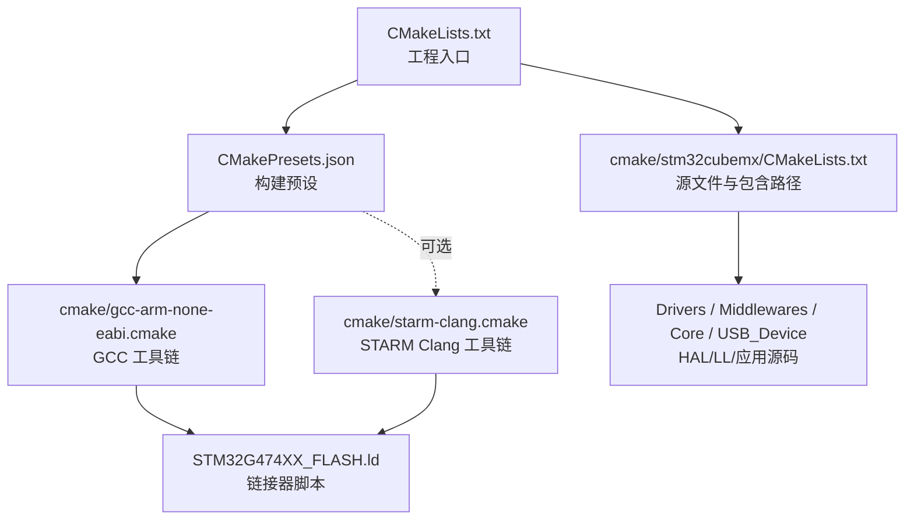
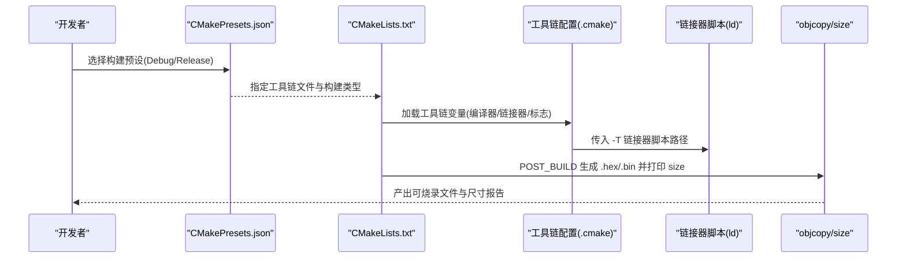
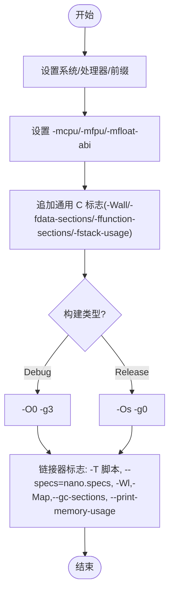
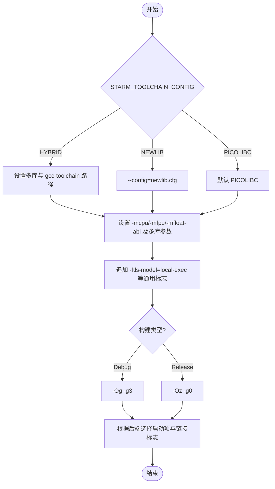
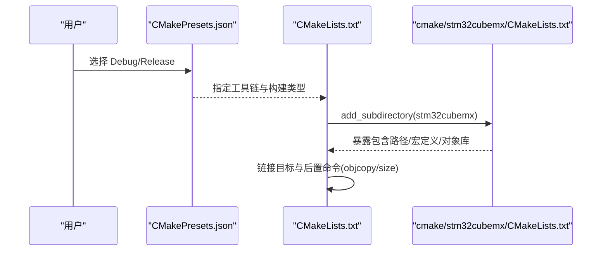
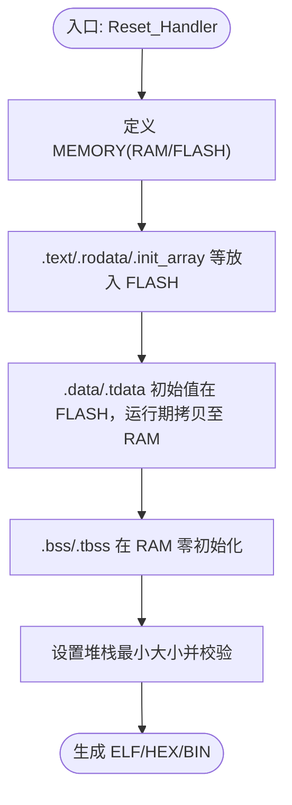
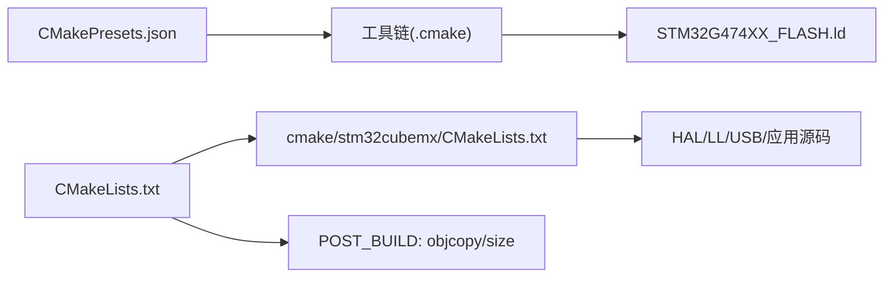

# 工具链配置

<cite>
**本文引用的文件**   
- [gcc-arm-none-eabi.cmake](file://cmake/gcc-arm-none-eabi.cmake)
- [starm-clang.cmake](file://cmake/starm-clang.cmake)
- [CMakeLists.txt](file://CMakeLists.txt)
- [CMakePresets.json](file://CMakePresets.json)
- [stm32cubemx/CMakeLists.txt](file://cmake/stm32cubemx/CMakeLists.txt)
- [STM32G474XX_FLASH.ld](file://STM32G474XX_FLASH.ld)
</cite>

## 目录
1. [简介](#简介)
2. [项目结构](#项目结构)
3. [核心组件](#核心组件)
4. [架构总览](#架构总览)
5. [详细组件分析](#详细组件分析)
6. [依赖关系分析](#依赖关系分析)
7. [性能与优化建议](#性能与优化建议)
8. [故障排查指南](#故障排查指南)
9. [结论](#结论)
10. [附录：平台安装与使用](#附录平台安装与使用)

## 简介
本文件面向使用 ARM GCC（arm-none-eabi-gcc）与 STARM Clang（starm-clang）进行 STM32G4xx 系列交叉编译的开发者，围绕 CMake 工具链配置文件展开，系统说明编译器路径、目标架构、交叉编译参数、优化与调试选项、链接器脚本集成以及不同构建变体的差异。文档同时提供多平台安装与配置指引、版本兼容性提示、常见问题诊断与解决方案，并兼顾初学者入门与高级用户定制优化的需求。

## 项目结构
本项目采用 CMake 组织构建流程，顶层 CMakeLists.txt 定义工程基本信息与生成规则；cmake/ 目录下包含两套工具链配置：
- gcc-arm-none-eabi.cmake：基于 GNU arm-none-eabi 工具链
- starm-clang.cmake：基于 ST 提供的 starm-clang 工具链（支持多种 C 库后端）

CMakePresets.json 定义了默认构建预设，指向 GCC 工具链，并提供 Debug/Release 两种构建类型。cmake/stm32cubemx/CMakeLists.txt 汇总了 HAL/LL、USB 中间件与应用源文件，并通过接口库将包含路径与宏定义暴露给主工程。链接器脚本 STM32G474XX_FLASH.ld 描述了 FLASH/RAM 布局、段分配与堆栈大小。

图示来源
- [CMakeLists.txt:1-77](file://CMakeLists.txt#L1-L77)
- [CMakePresets.json:1-38](file://CMakePresets.json#L1-L38)
- [gcc-arm-none-eabi.cmake:1-48](file://cmake/gcc-arm-none-eabi.cmake#L1-L48)
- [starm-clang.cmake:1-66](file://cmake/starm-clang.cmake#L1-L66)
- [stm32cubemx/CMakeLists.txt:1-114](file://cmake/stm32cubemx/CMakeLists.txt#L1-L114)
- [STM32G474XX_FLASH.ld:52-200](file://STM32G474XX_FLASH.ld#L52-L200)

章节来源
- [CMakeLists.txt:1-77](file://CMakeLists.txt#L1-L77)
- [CMakePresets.json:1-38](file://CMakePresets.json#L1-L38)
- [stm32cubemx/CMakeLists.txt:1-114](file://cmake/stm32cubemx/CMakeLists.txt#L1-L114)

## 核心组件
- 工具链配置（GCC）：设置系统名、处理器、编译器前缀、可执行后缀、目标 CPU/FPU/ABI、通用编译选项、调试/发布优化级别、C++ 禁用特性、链接器脚本与裁剪选项等。
- 工具链配置（STARM Clang）：在 GCC 基础上引入 STARM 工具链前缀、多库后端选择（NEWLIB/PICOLIBC/HYBRID）、TLS 模型、不同的优化策略（Og/Oz），以及针对各后端的链接器启动项与安全相关标志。
- 构建预设：通过 CMakePresets.json 指定 Ninja 生成器、二进制输出目录、工具链文件与构建类型。
- 链接器脚本：定义内存区域、段布局、堆栈大小与初始化数据拷贝逻辑。

章节来源
- [gcc-arm-none-eabi.cmake:1-48](file://cmake/gcc-arm-none-eabi.cmake#L1-L48)
- [starm-clang.cmake:1-66](file://cmake/starm-clang.cmake#L1-L66)
- [CMakePresets.json:1-38](file://CMakePresets.json#L1-L38)
- [STM32G474XX_FLASH.ld:52-200](file://STM32G474XX_FLASH.ld#L52-L200)

## 架构总览
下图展示了从 CMake 预设到具体工具链、再到链接器脚本与最终产物生成的整体流程。

图示来源
- [CMakePresets.json:1-38](file://CMakePresets.json#L1-L38)
- [CMakeLists.txt:70-77](file://CMakeLists.txt#L70-L77)
- [gcc-arm-none-eabi.cmake:42-47](file://cmake/gcc-arm-none-eabi.cmake#L42-L47)
- [starm-clang.cmake:50-66](file://cmake/starm-clang.cmake#L50-L66)
- [STM32G474XX_FLASH.ld:52-200](file://STM32G474XX_FLASH.ld#L52-L200)

## 详细组件分析

### GCC 工具链（arm-none-eabi）
- 系统与处理器
  - 系统名称设为 Generic，处理器为 arm，表明这是一个嵌入式交叉编译环境。
- 编译器与工具前缀
  - 以 arm-none-eabi- 为前缀，自动解析 gcc/g++/objcopy/size 等工具。
- 目标架构与硬件特性
  - 目标 CPU 为 cortex-m4，启用单精度浮点 fpv4-sp-d16，并使用硬浮点 ABI（hard）。
- 通用编译选项
  - 开启全面警告、按函数/数据分段、栈使用统计等，便于分析与裁剪。
- 调试与发布优化
  - Debug：关闭优化，保留完整调试信息，利于断点与变量查看。
  - Release：体积优先优化，关闭调试信息，适合量产固件。
- C++ 特性控制
  - 禁用 RTTI、异常与线程安全静态变量，减小代码体积与运行时开销。
- 链接器配置
  - 复用目标 CPU/FPU/ABI 标志，指定链接器脚本路径，启用 nano 规格、映射文件、死区裁剪与内存使用统计。
  - 链接数学库 m。

图示来源
- [gcc-arm-none-eabi.cmake:1-48](file://cmake/gcc-arm-none-eabi.cmake#L1-L48)

章节来源
- [gcc-arm-none-eabi.cmake:1-48](file://cmake/gcc-arm-none-eabi.cmake#L1-L48)

### STARM Clang 工具链（starm-clang）
- 系统与处理器
  - 同样设置为 Generic/arm，但编译器 ID 为 Clang。
- 编译器与工具前缀
  - 以 starm- 为前缀，解析 clang/clang++/objcopy/size。
- 多库后端与混合模式
  - 通过环境变量或缓存变量选择：
    - STARM_HYBRID：Clang 汇编/编译 + GNU 链接器，需额外指定 multilib 与 gcc-toolchain 路径。
    - STARM_NEWLIB：使用 NEWLIB C 库。
    - STARM_PICOLIBC：使用 PICOLIBC C 库（默认）。
- 目标架构与硬件特性
  - 与 GCC 一致：cortex-m4、fpv4-sp-d16、hard ABI，并在 HYBRID 模式下附加多库配置。
- 通用编译选项
  - 除通用标志外，增加 TLS 模型 local-exec，适配嵌入式场景。
- 调试与发布优化
  - Debug：-Og（优化且保持良好调试体验）。
  - Release：-Oz（极致体积优化）。
- C++ 特性控制
  - 与 GCC 相同，禁用 RTTI、异常与线程安全静态变量。
- 链接器配置
  - 根据后端选择不同启动项：
    - HYBRID：使用 --gcc-specs=nano.specs，并链接数学库 m。
    - NEWLIB：链接 crt0-nosys。
    - PICOLIBC：链接 crt0-hosted 并禁用 RELRO。
  - 统一启用映射文件、死区裁剪、禁止可执行栈、打印内存使用。

图示来源
- [starm-clang.cmake:1-66](file://cmake/starm-clang.cmake#L1-L66)

章节来源
- [starm-clang.cmake:1-66](file://cmake/starm-clang.cmake#L1-L66)

### 构建预设与工程入口
- CMakePresets.json
  - 默认预设使用 Ninja 生成器，二进制目录位于 build/default，工具链文件指向 GCC 工具链。
  - 提供 Debug/Release 预设，继承默认预设并设置 CMAKE_BUILD_TYPE。
- CMakeLists.txt
  - 设置 C11 标准、导出 compile_commands.json、创建可执行目标、添加 stm32cubemx 子目录。
  - 移除不必要的隐式库依赖，链接 stm32cubemx 与用户库。
  - 构建后命令：使用 objcopy 生成 hex/bin，使用 size 打印占用。

图示来源
- [CMakePresets.json:1-38](file://CMakePresets.json#L1-L38)
- [CMakeLists.txt:1-77](file://CMakeLists.txt#L1-L77)
- [stm32cubemx/CMakeLists.txt:1-114](file://cmake/stm32cubemx/CMakeLists.txt#L1-L114)

章节来源
- [CMakePresets.json:1-38](file://CMakePresets.json#L1-L38)
- [CMakeLists.txt:1-77](file://CMakeLists.txt#L1-L77)
- [stm32cubemx/CMakeLists.txt:1-114](file://cmake/stm32cubemx/CMakeLists.txt#L1-L114)

### 链接器脚本与内存布局
- 入口点与内存区域
  - 入口为 Reset_Handler，FLASH 起始地址与长度、RAM 起始地址与长度由脚本定义。
- 段布局
  - .isr_vector、.text、.rodata、.ARM.extab、.init_array 等置于 FLASH。
  - .data 与 .tdata 初始值存放于 FLASH，运行时复制到 RAM；.bss/.tbss 在 RAM 中零初始化。
- 堆栈与最小大小
  - 定义 _Min_Heap_Size 与 _Min_Stack_Size，确保链接期检查堆栈是否越界。

图示来源
- [STM32G474XX_FLASH.ld:52-200](file://STM32G474XX_FLASH.ld#L52-L200)

章节来源
- [STM32G474XX_FLASH.ld:52-200](file://STM32G474XX_FLASH.ld#L52-L200)

## 依赖关系分析
- 工具链与工程
  - CMakePresets.json 指定工具链文件，CMakeLists.txt 通过 add_subdirectory 引入 stm32cubemx 模块，后者汇总所有驱动、中间件与应用源，并将包含路径与宏定义以 INTERFACE 方式暴露。
- 链接阶段
  - 工具链配置将链接器脚本路径注入 CMAKE_EXE_LINKER_FLAGS，并启用裁剪与映射输出。
- 构建后处理
  - 顶层 CMakeLists.txt 在 POST_BUILD 调用 objcopy 与 size，生成 HEX/BIN 并打印占用。

图示来源
- [CMakePresets.json:1-38](file://CMakePresets.json#L1-L38)
- [CMakeLists.txt:1-77](file://CMakeLists.txt#L1-L77)
- [stm32cubemx/CMakeLists.txt:1-114](file://cmake/stm32cubemx/CMakeLists.txt#L1-L114)
- [STM32G474XX_FLASH.ld:52-200](file://STM32G474XX_FLASH.ld#L52-L200)

章节来源
- [CMakePresets.json:1-38](file://CMakePresets.json#L1-L38)
- [CMakeLists.txt:1-77](file://CMakeLists.txt#L1-L77)
- [stm32cubemx/CMakeLists.txt:1-114](file://cmake/stm32cubemx/CMakeLists.txt#L1-L114)

## 性能与优化建议
- 优化等级选择
  - GCC：Debug 使用 -O0，Release 使用 -Os（体积优先）。若对速度敏感，可在 Release 尝试 -O2，但需评估体积与稳定性。
  - STARM Clang：Debug 使用 -Og（平衡调试与优化），Release 使用 -Oz（极致体积）。
- 裁剪与内存
  - 启用 -fdata-sections -ffunction-sections 与链接器 --gc-sections，配合映射文件分析未使用符号，进一步减少体积。
- 浮点与 ABI
  - 当前配置启用 Cortex-M4 单精度 FPU 与 hard ABI，能显著提升浮点运算性能；若目标无 FPU 或需兼容软浮点库，需调整 -mfpu 与 -mfloat-abi。
- 调试体验
  - 使用 -g3 获取更丰富的调试信息；在 Clang 下 -Og 有助于在保持一定优化水平的同时改善调试体验。
- 链接器安全与行为
  - 禁用可执行栈（noexecstack）提升安全性；根据 C 库后端选择合适的启动项与 RELRO 策略。

[本节为通用指导，不直接分析具体文件]

## 故障排查指南
- 找不到编译器/工具
  - 现象：CMake 报错无法找到 arm-none-eabi-gcc 或 starm-clang。
  - 排查：确认工具链已安装且其 bin 目录加入 PATH；Windows 下注意路径分隔符与环境变量生效。
- 链接器脚本缺失或路径错误
  - 现象：链接阶段报找不到 STM32G474XX_FLASH.ld。
  - 排查：检查 CMAKE_SOURCE_DIR 是否正确，确保脚本位于工程根目录。
- 库文件缺失（如 math 库）
  - 现象：引用数学函数时报 undefined reference。
  - 排查：GCC 工具链需链接 m 库；STARM HYBRID 模式也需链接 m。
- 多库后端配置错误（STARM Clang）
  - 现象：HYBRID 模式报找不到 multilib 或 gcc-toolchain。
  - 排查：正确设置 CLANG_GCC_CMSIS_COMPILER 与 GCC_TOOLCHAIN_ROOT 环境变量，或修改 STARM_TOOLCHAIN_CONFIG 为 NEWLIB/PICOLIBC。
- 构建类型与优化不一致导致的行为差异
  - 现象：Release 下功能异常。
  - 排查：先以 Debug 复现问题，再逐步切换优化等级定位；必要时在 Release 临时降低优化等级验证。
- 堆栈/堆溢出
  - 现象：运行崩溃或 HardFault。
  - 排查：检查链接器脚本中的最小堆栈/堆大小，结合 map 文件与运行时栈指针分析。

章节来源
- [gcc-arm-none-eabi.cmake:42-47](file://cmake/gcc-arm-none-eabi.cmake#L42-L47)
- [starm-clang.cmake:30-66](file://cmake/starm-clang.cmake#L30-L66)
- [STM32G474XX_FLASH.ld:52-200](file://STM32G474XX_FLASH.ld#L52-L200)

## 结论
本项目通过两份工具链配置文件分别支持 ARM GCC 与 STARM Clang，覆盖从编译、链接到产物生成的完整流程。GCC 方案成熟稳定，适合大多数开发场景；STARM Clang 提供多后端选择与更强的体积优化能力，适合对固件大小有严格要求的场景。合理选择优化等级、启用裁剪与映射分析、并根据目标硬件特性配置 FPU/ABI，是获得高性能与高可靠性的关键。

[本节为总结性内容，不直接分析具体文件]

## 附录：平台安装与使用

- Windows
  - 安装 arm-none-eabi-gcc 或 starm-clang 工具链，将其 bin 目录添加到系统 PATH。
  - 使用 CMake 预设：cmake --preset Debug 或 cmake --preset Release。
  - 构建：cmake --build --preset Debug 或 Release。
- Linux
  - 通过包管理器或官方安装包安装工具链，确保命令行可直接调用 arm-none-eabi-gcc 或 starm-clang。
  - 使用相同的 CMake 预设与构建命令。
- macOS
  - 使用 Homebrew 或官方安装包安装工具链，确认 PATH 配置正确。
  - 使用相同的 CMake 预设与构建命令。

- 版本兼容性与升级注意事项
  - CMake 最低版本要求：3.22。请确保本地 CMake 版本满足要求。
  - GCC 与 Clang 版本差异可能导致某些选项行为变化（例如 -fcyclomatic-complexity 在某些工具链不支持），可按需注释或替换。
  - 升级工具链后，建议清理构建目录重新生成，避免旧缓存影响。

- 快速上手（初学者）
  - 安装工具链并配置 PATH。
  - 打开终端进入工程目录，执行：
    - cmake --preset Debug
    - cmake --build --preset Debug
  - 检查 build/default 下的 .elf/.hex/.bin 与 size 输出。
- 进阶定制（高级开发者）
  - 在工具链文件中按需调整优化等级、警告级别、裁剪与映射选项。
  - 针对特定模块添加编译定义或包含路径（参考 stm32cubemx/CMakeLists.txt 的组织方式）。
  - 使用 STARM Clang 的 PICOLIBC 或 NEWLIB 后端，权衡体积与标准库支持。

[本节为通用指导，不直接分析具体文件]