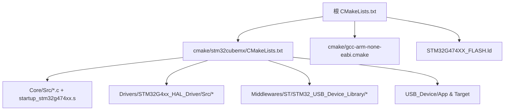
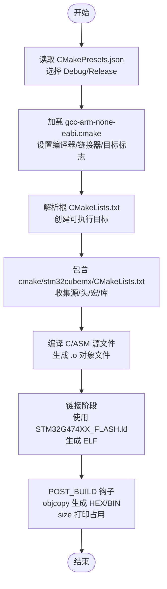
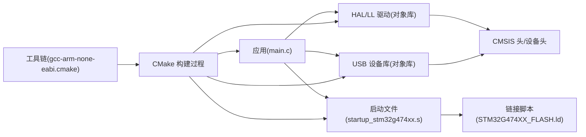
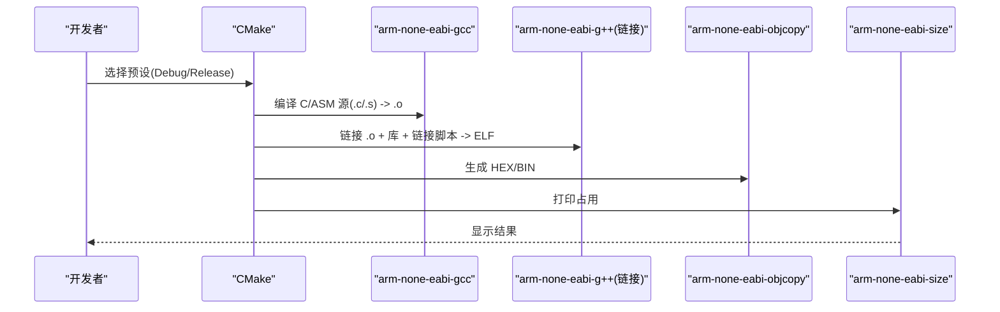
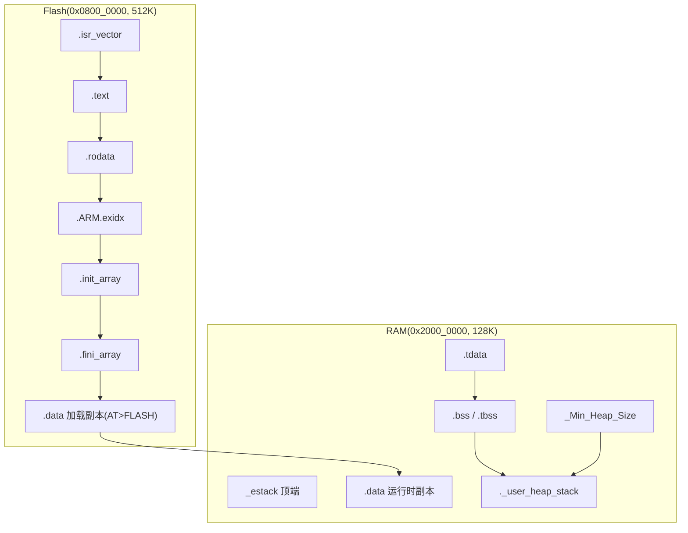
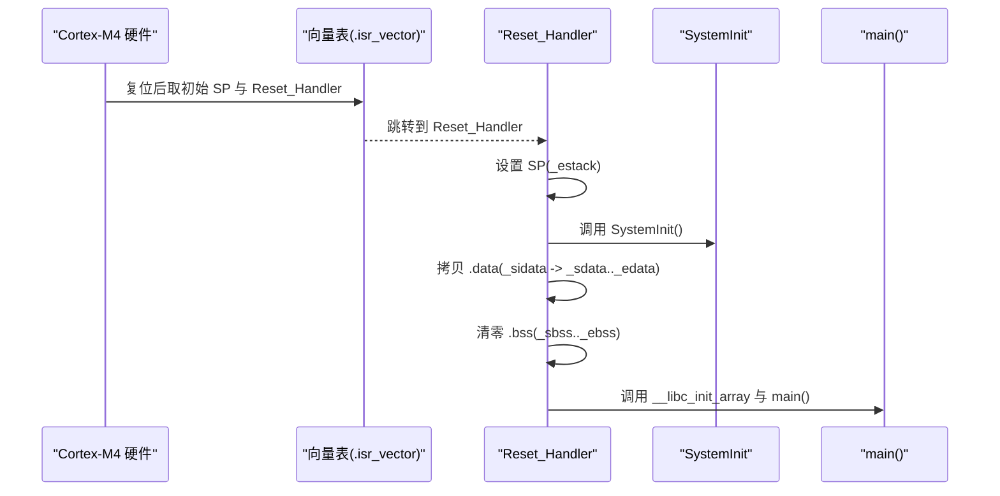

# 构建系统和工具链

<cite>
**本文引用的文件**   
- [CMakeLists.txt](file://CMakeLists.txt)
- [cmake/gcc-arm-none-eabi.cmake](file://cmake/gcc-arm-none-eabi.cmake)
- [cmake/stm32cubemx/CMakeLists.txt](file://cmake/stm32cubemx/CMakeLists.txt)
- [STM32G474XX_FLASH.ld](file://STM32G474XX_FLASH.ld)
- [startup_stm32g474xx.s](file://startup_stm32g474xx.s)
- [Core/Src/main.c](file://Core/Src/main.c)
- [Core/Inc/main.h](file://Core/Inc/main.h)
- [CMakePresets.json](file://CMakePresets.json)
</cite>

## 目录
1. [简介](#简介)
2. [项目结构](#项目结构)
3. [核心组件](#核心组件)
4. [架构总览](#架构总览)
5. [详细组件分析](#详细组件分析)
6. [依赖关系分析](#依赖关系分析)
7. [性能与优化](#性能与优化)
8. [故障排查指南](#故障排查指南)
9. [结论](#结论)
10. [附录](#附录)

## 简介
本文件面向使用 CMake 与 ARM GCC（arm-none-eabi）交叉工具链的 STM32G474 工程，系统化说明构建系统配置、工具链参数、链接脚本内存映射、启动流程与向量表，并提供环境搭建、常见问题解决、构建流程图与内存布局图。文档兼顾初学者入门与高级开发者定制优化的需求。

## 项目结构
该工程采用分层组织：顶层 CMakeLists.txt 定义项目与目标；cmake 子目录包含工具链与 CubeMX 生成代码的构建片段；Core 为用户应用与 HAL 初始化；Drivers 为 HAL/LL 驱动与 CMSIS；Middlewares 为 USB 设备库；USB_Device 为 CDC 应用层。

图表来源
- [CMakeLists.txt:1-77](file://CMakeLists.txt#L1-L77)
- [cmake/stm32cubemx/CMakeLists.txt:1-114](file://cmake/stm32cubemx/CMakeLists.txt#L1-L114)
- [cmake/gcc-arm-none-eabi.cmake:1-48](file://cmake/gcc-arm-none-eabi.cmake#L1-L48)
- [STM32G474XX_FLASH.ld:56-60](file://STM32G474XX_FLASH.ld#L56-L60)

章节来源
- [CMakeLists.txt:1-77](file://CMakeLists.txt#L1-L77)
- [cmake/stm32cubemx/CMakeLists.txt:1-114](file://cmake/stm32cubemx/CMakeLists.txt#L1-L114)

## 核心组件
- 顶层 CMake 配置：定义语言标准、构建类型、可执行目标、包含路径、编译宏、链接库与后处理命令（生成 HEX/BIN、打印大小）。
- 工具链配置：指定 arm-none-eabi 前缀、编译器/汇编器/链接器/objcopy/size 工具名，设置 MCU 目标标志、优化级别、调试符号、链接脚本与裁剪选项。
- CubeMX 子构建：集中管理头文件路径、宏定义、源文件集合，并创建对象库以复用包含与宏。
- 链接脚本：定义 Flash/RAM 起始地址与长度，划分 .isr_vector/.text/.rodata/.data/.bss 等段，提供堆栈最小尺寸与内存检查。
- 启动文件：设置初始 SP、调用 SystemInit、拷贝 .data、清零 .bss、调用静态构造与 main，并定义完整中断向量表与弱别名。

章节来源
- [CMakeLists.txt:10-77](file://CMakeLists.txt#L10-L77)
- [cmake/gcc-arm-none-eabi.cmake:1-48](file://cmake/gcc-arm-none-eabi.cmake#L1-L48)
- [cmake/stm32cubemx/CMakeLists.txt:1-114](file://cmake/stm32cubemx/CMakeLists.txt#L1-L114)
- [STM32G474XX_FLASH.ld:52-251](file://STM32G474XX_FLASH.ld#L52-L251)
- [startup_stm32g474xx.s:28-106](file://startup_stm32g474xx.s#L28-L106)

## 架构总览
下图展示从 CMake 配置到最终产物生成的端到端流程，包括工具链、源文件组织、链接脚本与输出产物。

图表来源
- [CMakePresets.json:1-38](file://CMakePresets.json#L1-L38)
- [cmake/gcc-arm-none-eabi.cmake:1-48](file://cmake/gcc-arm-none-eabi.cmake#L1-L48)
- [CMakeLists.txt:34-77](file://CMakeLists.txt#L34-L77)
- [cmake/stm32cubemx/CMakeLists.txt:83-105](file://cmake/stm32cubemx/CMakeLists.txt#L83-L105)
- [STM32G474XX_FLASH.ld:56-60](file://STM32G474XX_FLASH.ld#L56-L60)

## 详细组件分析

### 顶层 CMake 配置（CMakeLists.txt）
- 语言与标准：启用 C 与 ASM，要求 C11，允许扩展。
- 构建类型：默认 Debug，可通过预设覆盖。
- 目标：创建可执行目标，名称取自项目名。
- 子目录：引入 CubeMX 生成代码的构建片段。
- 包含路径/宏/链接库：预留用户扩展点，当前通过 stm32cubemx 接口库统一注入。
- 后处理：使用 objcopy 生成 HEX 与 BIN，并使用 size 打印占用。

章节来源
- [CMakeLists.txt:10-77](file://CMakeLists.txt#L10-L77)

### 工具链配置（gcc-arm-none-eabi.cmake）
- 系统与处理器：Generic/arm，编译器 ID 为 GNU。
- 工具前缀：arm-none-eabi-，自动绑定 gcc/g++/objcopy/size。
- 目标 CPU/FPU/ABI：Cortex-M4、单精度浮点、硬浮点 ABI。
- 通用编译选项：警告、分区段、栈使用统计、汇编带预处理与依赖生成。
- 构建类型优化：Debug 关闭优化并生成调试信息；Release 开启 -Os 并去除调试信息。
- C++ 支持：禁用 RTTI/异常/线程安全静态变量。
- 链接选项：传入 MCU 目标标志、链接脚本路径、nano 规格、Map 文件、死区裁剪、内存使用报告。

章节来源
- [cmake/gcc-arm-none-eabi.cmake:1-48](file://cmake/gcc-arm-none-eabi.cmake#L1-L48)

### CubeMX 子构建（cmake/stm32cubemx/CMakeLists.txt）
- 宏定义：USE_HAL_DRIVER、STM32G474xx、DEBUG（按构建类型）。
- 包含路径：应用层、HAL/LL、CMSIS、USB 中间件与 CDC 类。
- 源文件集合：应用入口、中断服务、MSP、系统初始化、启动文件、HAL/LL 驱动、USB 设备库。
- 对象库：将驱动与 USB 库分别打包为 OBJECT 库，便于增量构建与复用。
- 接口库：stm32cubemx 作为 INTERFACE 库，统一暴露包含与宏给所有目标。
- 链接：主目标链接 stm32cubemx、TOOLCHAIN_LINK_LIBRARIES（由工具链注入）、USB_Device_Library。

章节来源
- [cmake/stm32cubemx/CMakeLists.txt:1-114](file://cmake/stm32cubemx/CMakeLists.txt#L1-L114)

### 链接脚本（STM32G474XX_FLASH.ld）
- 入口点：Reset_Handler。
- 内存区域：
  - RAM：起始 0x2000_0000，长度 128K。
  - FLASH：起始 0x0800_0000，长度 512K。
- 堆栈：
  - _estack 指向 RAM 顶端。
  - _Min_Stack_Size 与 _Min_Heap_Size 定义最小堆栈/堆大小，用于链接期检查。
- 段分配：
  - .isr_vector：中断向量表位于 FLASH 起始。
  - .text/.rodata/.ARM.extab/.ARM.exidx/.init_array/.fini_array：程序与常量数据在 FLASH。
  - .data：已初始化数据在 RAM，加载副本在 FLASH（AT>FLASH），启动时由启动文件拷贝。
  - .tdata/.tbss：TLS 相关段，位于 RAM。
  - .bss：未初始化数据在 RAM，启动时清零。
  - ._user_heap_stack：NOLOAD，放置于 RAM 末端，用于堆栈边界检查。
- 导出符号：_sdata/_edata/_sidata、_sbss/_ebss、__data_start/__data_end 等供启动与运行时使用。

章节来源
- [STM32G474XX_FLASH.ld:52-251](file://STM32G474XX_FLASH.ld#L52-L251)

### 启动文件与向量表（startup_stm32g474xx.s）
- 运行模式：Thumb、Cortex-M4、软浮点（FPU 在链接脚本中启用硬件浮点，此处保持兼容）。
- 初始化流程：
  - 设置初始 SP（_estack）。
  - 调用 SystemInit 完成时钟与基础外设初始化。
  - 拷贝 .data 段（从 _sidata 到 _sdata，至 _edata）。
  - 清零 .bss 段（从 _sbss 到 _ebss）。
  - 调用 __libc_init_array 执行静态构造函数。
  - 跳转至 main。
- 向量表：
  - g_pfnVectors 位于 .isr_vector 段，首项为初始栈指针，第二项为 Reset_Handler，后续为各中断向量。
  - 所有中断处理函数均定义为弱别名，指向 Default_Handler（无限循环），用户可在应用中实现同名函数进行覆盖。

章节来源
- [startup_stm32g474xx.s:28-106](file://startup_stm32g474xx.s#L28-L106)
- [startup_stm32g474xx.s:129-253](file://startup_stm32g474xx.s#L129-L253)
- [startup_stm32g474xx.s:263-593](file://startup_stm32g474xx.s#L263-L593)

### 应用入口与关键逻辑（Core/Src/main.c）
- 初始化顺序：HAL_Init → SystemClock_Config → 外设初始化（GPIO/DMA/ADC/USB）→ 启动 ADC 多模 DMA 采集。
- 触发与采集：
  - EXTI 上升沿回调记录 DMA 剩余计数，计算触发位置。
  - DMA 半传输/全传输回调累计事件数，达到阈值后停止采集并置位数据就绪标志。
  - 主循环根据标志解包环形缓冲为线性时间线，并通过 USB CDC 发送。
- 错误处理：Error_Handler 进入死循环以便调试定位。

章节来源
- [Core/Src/main.c:219-290](file://Core/Src/main.c#L219-L290)
- [Core/Src/main.c:91-150](file://Core/Src/main.c#L91-L150)
- [Core/Src/main.c:156-212](file://Core/Src/main.c#L156-L212)
- [Core/Inc/main.h:53](file://Core/Inc/main.h#L53-L53)

## 依赖关系分析
- 顶层目标依赖 stm32cubemx 接口库，后者统一注入包含路径与宏。
- 驱动与 USB 库以 OBJECT 库形式参与链接，避免重复编译。
- 链接阶段由工具链注入的链接脚本与 nano 规格控制运行时库行为与裁剪。
- 启动文件与链接脚本通过符号约定紧密耦合（如 _sdata/_edata/_sidata、_sbss/_ebss）。

图表来源
- [cmake/stm32cubemx/CMakeLists.txt:83-105](file://cmake/stm32cubemx/CMakeLists.txt#L83-L105)
- [cmake/gcc-arm-none-eabi.cmake:42-47](file://cmake/gcc-arm-none-eabi.cmake#L42-L47)
- [STM32G474XX_FLASH.ld:56-60](file://STM32G474XX_FLASH.ld#L56-L60)
- [startup_stm32g474xx.s:129-253](file://startup_stm32g474xx.s#L129-L253)

## 性能与优化
- 优化级别：
  - Debug：-O0 -g3，便于断点与源码级调试。
  - Release：-Os，体积优先，适合资源受限场景。
- 裁剪与空间节省：
  - -fdata-sections -ffunction-sections 配合 --gc-sections 移除未用段。
  - --specs=nano.specs 使用 newlib-nano，减少运行时开销。
  - Map 文件与 --print-memory-usage 辅助评估占用。
- 浮点与 ABI：
  - 启用 Cortex-M4 单精度 FPU 与硬浮点 ABI，提升数学运算效率。
- 栈与堆：
  - 调整 _Min_Stack_Size 与 _Min_Heap_Size 以满足实际运行时需求，避免链接期溢出。

章节来源
- [cmake/gcc-arm-none-eabi.cmake:25-47](file://cmake/gcc-arm-none-eabi.cmake#L25-L47)
- [STM32G474XX_FLASH.ld:63-67](file://STM32G474XX_FLASH.ld#L63-L67)

## 故障排查指南
- 找不到 arm-none-eabi-gcc：
  - 确认工具链已安装且 arm-none-eabi- 前缀的命令在 PATH 中。
  - 若使用 IDE，确保工具链路径正确配置。
- 链接失败或找不到链接脚本：
  - 检查 CMAKE_EXE_LINKER_FLAGS 中的 -T 路径是否正确指向 STM32G474XX_FLASH.ld。
- 运行即 HardFault：
  - 核对向量表是否位于 0x0800_0000 起始处，确认 .isr_vector 段未被覆盖。
  - 检查初始 SP 是否指向 RAM 顶端（_estack）。
- 数据未初始化或 .bss 未清零：
  - 确认启动文件中 .data 拷贝与 .bss 清零逻辑存在且范围正确。
- 堆栈溢出：
  - 增大 _Min_Stack_Size，或使用 --print-stack-usage 与栈使用统计进行分析。
- USB CDC 无输出：
  - 确认 USB 初始化成功，CDC_Transmit_FS 返回值与重试逻辑正常。
  - 检查 PC 端串口终端波特率与流控设置。

章节来源
- [cmake/gcc-arm-none-eabi.cmake:42-47](file://cmake/gcc-arm-none-eabi.cmake#L42-L47)
- [startup_stm32g474xx.s:61-106](file://startup_stm32g474xx.s#L61-L106)
- [startup_stm32g474xx.s:129-150](file://startup_stm32g474xx.s#L129-L150)
- [Core/Src/main.c:219-290](file://Core/Src/main.c#L219-L290)

## 结论
本构建系统基于 CMake 与 ARM GCC 工具链，结合 CubeMX 生成代码与 STM32G474 链接脚本，形成清晰的分层与模块化结构。通过合理的优化与裁剪选项，可在保证可调试性的同时获得较小的二进制体积。理解启动流程、向量表与链接脚本的协作关系，是稳定部署与高效排错的关键。

## 附录

### 交叉编译环境搭建指南
- 安装 ARM GCC 工具链（arm-none-eabi-gcc、g++、objcopy、size 等），并确保命令行可直接调用。
- 安装 CMake（建议 3.22+）与 Ninja 生成器。
- 使用预设进行配置与构建：
  - 配置：cmake --preset=Debug 或 Release。
  - 构建：cmake --build --preset=Debug 或 Release。
- 产物位置：
  - ELF/HEX/BIN 位于构建目录（由 CMakePresets.json 的 binaryDir 决定）。
  - Map 文件与 size 输出在同一目录。

章节来源
- [CMakePresets.json:1-38](file://CMakePresets.json#L1-L38)
- [CMakeLists.txt:70-76](file://CMakeLists.txt#L70-L76)

### 构建流程图（代码级）

图表来源
- [CMakeLists.txt:70-76](file://CMakeLists.txt#L70-L76)
- [cmake/gcc-arm-none-eabi.cmake:11-16](file://cmake/gcc-arm-none-eabi.cmake#L11-L16)

### 内存布局图（代码级）

图表来源
- [STM32G474XX_FLASH.ld:56-60](file://STM32G474XX_FLASH.ld#L56-L60)
- [STM32G474XX_FLASH.ld:72-150](file://STM32G474XX_FLASH.ld#L72-L150)
- [STM32G474XX_FLASH.ld:155-238](file://STM32G474XX_FLASH.ld#L155-L238)

### 启动流程时序（代码级）

图表来源
- [startup_stm32g474xx.s:61-106](file://startup_stm32g474xx.s#L61-L106)
- [startup_stm32g474xx.s:129-150](file://startup_stm32g474xx.s#L129-L150)