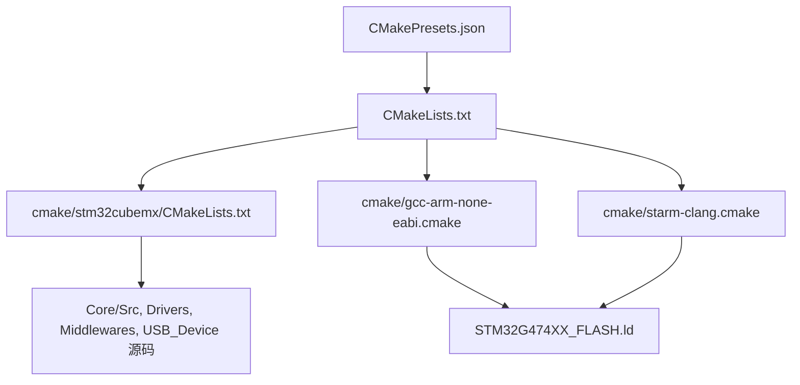
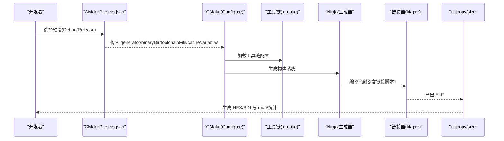
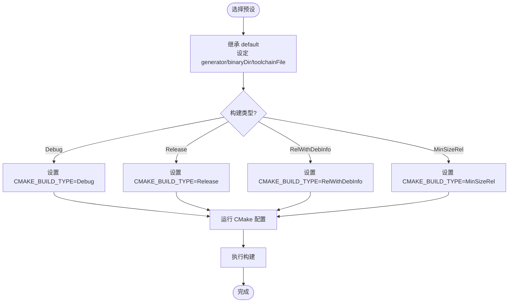
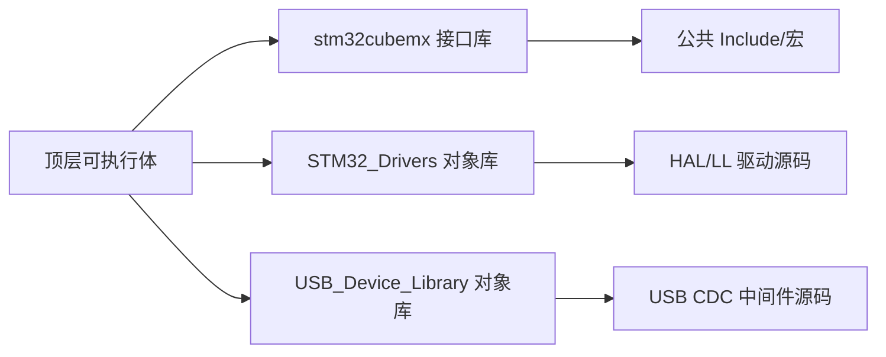
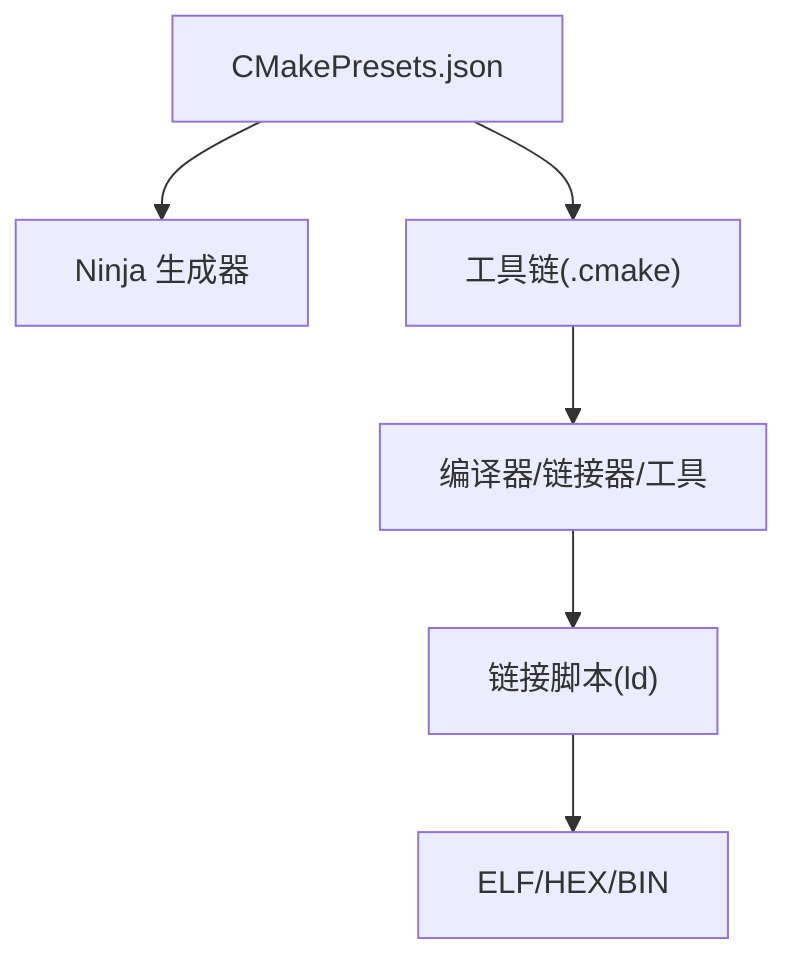

# 构建预设配置

<cite>
**本文引用的文件**
- [CMakePresets.json](file://CMakePresets.json)
- [CMakeLists.txt](file://CMakeLists.txt)
- [cmake/gcc-arm-none-eabi.cmake](file://cmake/gcc-arm-none-eabi.cmake)
- [cmake/starm-clang.cmake](file://cmake/starm-clang.cmake)
- [cmake/stm32cubemx/CMakeLists.txt](file://cmake/stm32cubemx/CMakeLists.txt)
- [STM32G474XX_FLASH.ld](file://STM32G474XX_FLASH.ld)
</cite>

## 目录
1. [简介](#简介)
2. [项目结构](#项目结构)
3. [核心组件](#核心组件)
4. [架构总览](#架构总览)
5. [详细组件分析](#详细组件分析)
6. [依赖关系分析](#依赖关系分析)
7. [性能与缓存优化](#性能与缓存优化)
8. [疑难排查指南](#疑难排查指南)
9. [结论](#结论)
10. [附录：IDE集成与多目标示例](#附录ide集成与多目标示例)

## 简介
本文件面向使用 CMake 的嵌入式（ARM Cortex-M）项目，围绕 CMakePresets.json 的结构与用法进行系统化说明。文档覆盖开发、发布、测试等预设定义；解释 Debug、Release、RelWithDebInfo、MinSizeRel 四类构建在编译器选项与链接参数上的差异；给出 VS Code、CLion、Visual Studio 的预设导入与使用方法；提供多目标（不同芯片/开发板）的配置策略；并包含环境变量与外部工具集成、构建缓存管理与增量编译优化、预设继承与覆盖机制等内容。读者可从“初学者入门”逐步深入到“复杂场景的高级策略”。

## 项目结构
本项目为 STM32CubeMX 生成的工程，采用 CMake 作为构建系统。根级关键文件包括：
- CMakePresets.json：集中管理 configure/build/test/package 等预设
- CMakeLists.txt：顶层构建脚本，启用语言、创建可执行体、引入子模块、生成 HEX/BIN 等
- cmake/*.cmake：交叉编译工具链配置（GCC ARM、STARM Clang）
- cmake/stm32cubemx/CMakeLists.txt：由 CubeMX 生成的源、头、库组织与链接
- STM32G474XX_FLASH.ld：链接脚本，定义内存布局与段映射

图示来源
- [CMakePresets.json:1-38](file://CMakePresets.json#L1-L38)
- [CMakeLists.txt:1-77](file://CMakeLists.txt#L1-L77)
- [cmake/stm32cubemx/CMakeLists.txt:1-114](file://cmake/stm32cubemx/CMakeLists.txt#L1-L114)
- [cmake/gcc-arm-none-eabi.cmake:1-48](file://cmake/gcc-arm-none-eabi.cmake#L1-L48)
- [cmake/starm-clang.cmake:1-66](file://cmake/starm-clang.cmake#L1-L66)
- [STM32G474XX_FLASH.ld:56-60](file://STM32G474XX_FLASH.ld#L56-L60)

章节来源
- [CMakePresets.json:1-38](file://CMakePresets.json#L1-L38)
- [CMakeLists.txt:1-77](file://CMakeLists.txt#L1-L77)

## 核心组件
- 预设入口与默认值
  - 版本与顶层结构：CMakePresets.json 声明了 version 以及 configurePresets/buildPresets 两个主要数组。
  - 默认预设 default：隐藏预设，指定 Ninja 生成器、二进制输出目录、工具链文件路径。
  - 构建类型预设 Debug/Release：通过 inherits 继承 default，并通过 cacheVariables 设置 CMAKE_BUILD_TYPE。
  - 构建预设 Debug/Release：分别绑定到同名 configurePreset。

- 工具链与编译器选项
  - GCC ARM 工具链：cmake/gcc-arm-none-eabi.cmake 定义了系统名、处理器、编译器前缀、各工具命令、MCU 目标标志、调试/发布优化等级、C++ 禁用特性、链接脚本与裁剪选项等。
  - STARM Clang 工具链：cmake/starm-clang.cmake 支持多种 C 库后端（NEWLIB/PICOLIBC/HYBRID），并提供对应链接参数与优化等级。

- 源码与库组织
  - cmake/stm32cubemx/CMakeLists.txt 汇总应用源码、HAL/LL 驱动、USB 中间件，创建对象库并链接至顶层可执行体，同时导出公共 include 与宏定义。

- 链接脚本
  - STM32G474XX_FLASH.ld 定义 FLASH/RAM 起始地址与长度、堆栈大小、段布局等，被工具链在链接阶段引用。

章节来源
- [CMakePresets.json:1-38](file://CMakePresets.json#L1-L38)
- [cmake/gcc-arm-none-eabi.cmake:1-48](file://cmake/gcc-arm-none-eabi.cmake#L1-L48)
- [cmake/starm-clang.cmake:1-66](file://cmake/starm-clang.cmake#L1-L66)
- [cmake/stm32cubemx/CMakeLists.txt:1-114](file://cmake/stm32cubemx/CMakeLists.txt#L1-L114)
- [STM32G474XX_FLASH.ld:56-60](file://STM32G474XX_FLASH.ld#L56-L60)

## 架构总览
下图展示了从预设到最终产物（ELF/HEX/BIN）的端到端流程，涵盖配置、编译、链接与后处理步骤。

图示来源
- [CMakePresets.json:1-38](file://CMakePresets.json#L1-L38)
- [CMakeLists.txt:70-77](file://CMakeLists.txt#L70-L77)
- [cmake/gcc-arm-none-eabi.cmake:40-48](file://cmake/gcc-arm-none-eabi.cmake#L40-L48)
- [cmake/starm-clang.cmake:50-66](file://cmake/starm-clang.cmake#L50-L66)

## 详细组件分析

### 预设结构与继承机制
- 版本与顶层字段
  - version：指定预设文件格式版本。
  - configurePresets：定义配置阶段的预设集合。
  - buildPresets：定义构建阶段的预设集合，通常绑定到某个 configurePreset。

- 默认预设 default
  - hidden：对 IDE 隐藏，避免误选。
  - generator：指定 Ninja 作为生成器。
  - binaryDir：将构建输出隔离到 ${sourceDir}/build/${presetName}，便于并行构建与清理。
  - toolchainFile：指向交叉工具链配置文件。
  - cacheVariables：可扩展用于注入全局变量（如 CMAKE_BUILD_TYPE）。

- 构建类型预设
  - Debug/Release：通过 inherits 继承 default，并在 cacheVariables 中设置 CMAKE_BUILD_TYPE。
  - 建议扩展 RelWithDebInfo 与 MinSizeRel 以覆盖完整构建类型矩阵。

- 构建预设
  - Debug/Release：仅绑定 configurePreset，复用其配置。

图示来源
- [CMakePresets.json:1-38](file://CMakePresets.json#L1-L38)

章节来源
- [CMakePresets.json:1-38](file://CMakePresets.json#L1-L38)

### 编译器与链接器选项差异（按构建类型）
- GCC ARM 工具链（cmake/gcc-arm-none-eabi.cmake）
  - 通用 MCU 目标标志：CPU/FPU/浮点 ABI 等。
  - 通用警告与分割：Wall、fdata-sections、ffunction-sections、fstack-usage。
  - 调试型（Debug）：-O0 -g3，便于断点与源码级调试。
  - 发布型（Release）：-Os -g0，体积优先且关闭调试信息。
  - C++ 特性：禁用 rtti/exceptions/threadsafe-statics。
  - 链接期：指定链接脚本、nano.specs、Map 输出、垃圾回收段、打印内存使用。

- STARM Clang 工具链（cmake/starm-clang.cmake）
  - 支持 NEWLIB/PICOLIBC/HYBRID 三种后端，影响链接参数与启动文件。
  - 调试型（Debug）：-Og -g3，兼顾调试体验与一定优化。
  - 发布型（Release）：-Oz -g0，极致体积优化。
  - 链接期：根据后端选择 crt0 变体、noexecstack、map 输出、gc-sections、打印内存使用。

- 构建类型对照要点
  - Debug：强调可调试性（高调试信息、无或低优化）。
  - Release：强调体积/速度（优化开启、关闭调试信息）。
  - RelWithDebInfo：建议在 GCC 下使用 -O2/-O3 + -g，Clang 下可用 -O2/-O3 + -g，以便定位问题同时保持较好性能。
  - MinSizeRel：强调最小体积，GCC 下常用 -Os，Clang 下可用 -Oz。

章节来源
- [cmake/gcc-arm-none-eabi.cmake:24-48](file://cmake/gcc-arm-none-eabi.cmake#L24-L48)
- [cmake/starm-clang.cmake:36-66](file://cmake/starm-clang.cmake#L36-L66)

### 源码组织与库依赖
- 顶层 CMakeLists.txt
  - 启用 C 与 ASM 语言。
  - 创建可执行目标，引入 stm32cubemx 子目录。
  - 链接 stm32cubemx 库。
  - 后处理：使用 objcopy 生成 HEX/BIN，并使用 size 输出占用统计。

- stm32cubemx/CMakeLists.txt
  - 汇总应用源码、HAL/LL 驱动、USB 中间件。
  - 创建对象库（OBJECT）并链接至顶层目标。
  - 导出公共 include 与宏定义（USE_HAL_DRIVER、STM32G474xx、DEBUG 条件宏）。

图示来源
- [CMakeLists.txt:31-77](file://CMakeLists.txt#L31-L77)
- [cmake/stm32cubemx/CMakeLists.txt:72-114](file://cmake/stm32cubemx/CMakeLists.txt#L72-L114)

章节来源
- [CMakeLists.txt:31-77](file://CMakeLists.txt#L31-L77)
- [cmake/stm32cubemx/CMakeLists.txt:1-114](file://cmake/stm32cubemx/CMakeLists.txt#L1-L114)

### 链接脚本与内存布局
- 链接脚本定义
  - 入口符号 Reset_Handler。
  - 内存区域：FLASH 起始与长度、RAM 起始与长度。
  - 堆栈大小、段布局（.text/.rodata/.data/.bss 等）。
  - TLS 相关段初始化。

- 工具链引用
  - 工具链文件中通过 -T 指定链接脚本路径，确保目标平台一致。

章节来源
- [STM32G474XX_FLASH.ld:52-60](file://STM32G474XX_FLASH.ld#L52-L60)
- [cmake/gcc-arm-none-eabi.cmake:42-48](file://cmake/gcc-arm-none-eabi.cmake#L42-L48)
- [cmake/starm-clang.cmake:62-66](file://cmake/starm-clang.cmake#L62-L66)

## 依赖关系分析
- 预设与生成器
  - CMakePresets.json 指定 Ninja 生成器，binaryDir 隔离构建输出，避免并行构建冲突。
- 工具链与编译器
  - 工具链 .cmake 文件决定编译器、汇编器、链接器、objcopy、size 等工具命令及默认标志。
- 源码与库
  - stm32cubemx/CMakeLists.txt 聚合所有第三方与应用源码，形成对象库供顶层链接。
- 链接脚本
  - 链接脚本与工具链共同决定最终二进制布局与运行时行为。

图示来源
- [CMakePresets.json:1-38](file://CMakePresets.json#L1-L38)
- [cmake/gcc-arm-none-eabi.cmake:1-48](file://cmake/gcc-arm-none-eabi.cmake#L1-L48)
- [cmake/starm-clang.cmake:1-66](file://cmake/starm-clang.cmake#L1-L66)
- [STM32G474XX_FLASH.ld:56-60](file://STM32G474XX_FLASH.ld#L56-L60)

章节来源
- [CMakePresets.json:1-38](file://CMakePresets.json#L1-L38)
- [cmake/gcc-arm-none-eabi.cmake:1-48](file://cmake/gcc-arm-none-eabi.cmake#L1-L48)
- [cmake/starm-clang.cmake:1-66](file://cmake/starm-clang.cmake#L1-L66)
- [STM32G474XX_FLASH.ld:56-60](file://STM32G474XX_FLASH.ld#L56-L60)

## 性能与缓存优化
- 构建缓存与并行
  - 使用 Ninja 生成器以获得更快的增量编译与并行构建。
  - 利用 binaryDir 将不同预设的输出隔离，避免缓存污染。
- 增量编译
  - 保持稳定的 include 路径与宏定义，减少不必要的重编译。
  - 合理拆分目标与库，使变更范围最小化。
- 优化等级选择
  - Debug：-O0/-Og + -g3，利于调试。
  - Release：-Os/-Oz，减小体积；必要时切换 -O2/-O3 提升性能。
  - RelWithDebInfo：-O2/-O3 + -g，平衡性能与调试。
  - MinSizeRel：-Os/-Oz，追求最小体积。
- 链接期裁剪
  - 启用 --gc-sections 移除未用段。
  - 使用 nano.specs（GCC）或对应后端启动文件（Clang）降低运行时开销。
  - 借助 Map 输出与 size 统计评估资源占用。

[本节为通用指导，不直接分析具体文件]

## 疑难排查指南
- 工具链不可用
  - 确认 arm-none-eabi-* 或 starm-* 工具在 PATH 中，且版本满足要求。
  - 检查工具链 .cmake 中的前缀与命令是否正确。
- 链接失败或内存溢出
  - 核对链接脚本的 FLASH/RAM 布局与堆栈大小是否匹配目标芯片。
  - 查看 Map 输出与 size 统计，定位占用较大的段。
- 构建类型不一致
  - 确认预设中 CMAKE_BUILD_TYPE 设置正确，避免混用不同构建类型的中间产物。
- 增量编译异常
  - 清理对应 binaryDir 下的旧缓存，重新配置。
  - 检查 include 路径与宏定义是否稳定。

章节来源
- [cmake/gcc-arm-none-eabi.cmake:1-48](file://cmake/gcc-arm-none-eabi.cmake#L1-L48)
- [cmake/starm-clang.cmake:1-66](file://cmake/starm-clang.cmake#L1-L66)
- [STM32G474XX_FLASH.ld:56-60](file://STM32G474XX_FLASH.ld#L56-L60)
- [CMakeLists.txt:70-77](file://CMakeLists.txt#L70-L77)

## 结论
通过 CMakePresets.json 统一管理构建配置，结合工具链 .cmake 与链接脚本，可实现跨工具链、多构建类型与多目标的标准化构建。配合 Ninja 与合理的优化/裁剪策略，可在保证可调试性的同时获得良好的性能与体积表现。对于复杂场景，建议采用“基础预设 + 环境/平台覆盖”的策略，实现高内聚、低耦合的构建体系。

[本节为总结，不直接分析具体文件]

## 附录：IDE集成与多目标示例

### IDE 集成方法
- VS Code
  - 安装 CMake Tools 扩展。
  - 在项目根目录打开，CMake Tools 会自动读取 CMakePresets.json。
  - 在状态栏选择预设（如 Debug/Release），点击“构建”即可。
- CLion
  - 打开项目后，在 CMake 配置中选择预设（Configure Presets）。
  - 在 Run/Debug Configurations 中关联对应的构建预设。
- Visual Studio
  - 使用 CMake 工作区模式打开项目。
  - 在“项目 > CMake 预设”中导入或选择预设，随后进行构建与调试。

[本节为概念性说明，不直接分析具体文件]

### 多目标构建示例（不同芯片/开发板）
- 思路
  - 在 CMakePresets.json 中新增针对不同芯片/开发板的 configurePreset，通过 toolchainFile 或 cacheVariables 切换工具链与目标标志。
  - 在工具链 .cmake 中抽象 CPU/FPU/ABI 等目标标志，通过变量控制。
  - 在顶层 CMakeLists.txt 中根据变量选择不同链接脚本或外设宏。
- 示例要点
  - 新增预设名称（如 board_xxx），inherits 自 default。
  - 通过 cacheVariables 设置 CMAKE_TOOLCHAIN_FILE 或自定义变量（如 TARGET_CHIP、TARGET_BOARD）。
  - 在工具链 .cmake 中使用 if/else 分支适配不同 MCU 系列。
  - 在 stm32cubemx/CMakeLists.txt 中根据变量增减源文件或宏定义。

[本节为概念性说明，不直接分析具体文件]

### 环境变量与外部工具集成
- 环境变量
  - 在工具链 .cmake 中可通过 $ENV{VAR} 读取环境变量，例如指定工具链根目录或 C 库配置。
  - 在预设中也可通过 cacheVariables 传递变量给 CMake。
- 外部工具
  - 使用 add_custom_command(TARGET ... POST_BUILD) 调用 objcopy/size 等外部工具生成 HEX/BIN 与统计信息。
  - 可将烧录/调试工具封装为自定义目标，便于一键流程。

章节来源
- [cmake/starm-clang.cmake:30-34](file://cmake/starm-clang.cmake#L30-L34)
- [CMakeLists.txt:70-77](file://CMakeLists.txt#L70-L77)

### 预设继承与覆盖最佳实践
- 基础预设
  - 将通用配置（generator、binaryDir、toolchainFile）放入隐藏的 default 预设。
- 构建类型预设
  - 针对每种构建类型创建独立预设，仅覆盖 CMAKE_BUILD_TYPE。
- 环境与平台预设
  - 为不同环境（Windows/Linux）、不同工具链（GCC/Clang）、不同目标（芯片/开发板）创建专用预设，继承 default 并覆盖必要变量。
- 组合策略
  - 使用“基础 + 环境 + 平台 + 类型”的组合方式，最大化复用与最小化重复。

[本节为概念性说明，不直接分析具体文件]