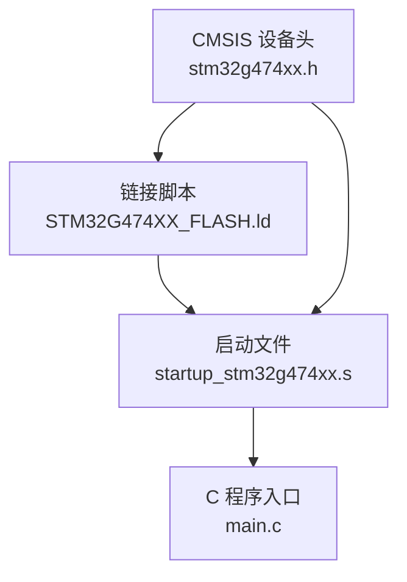
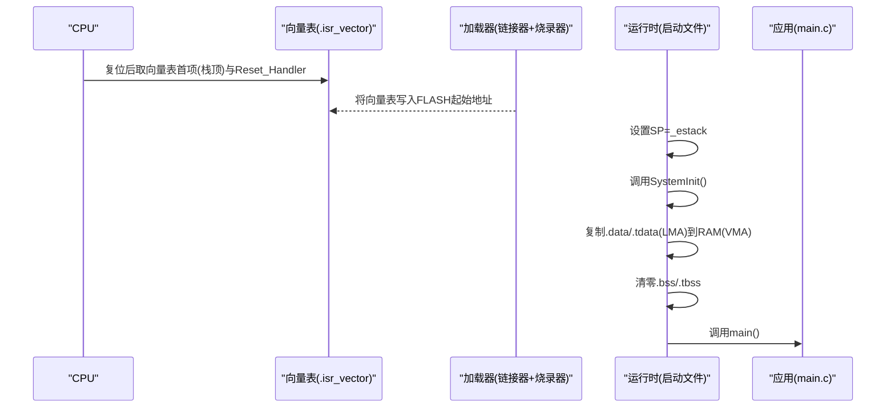
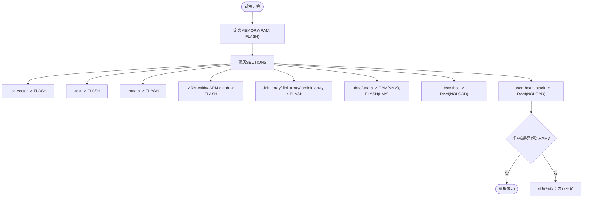
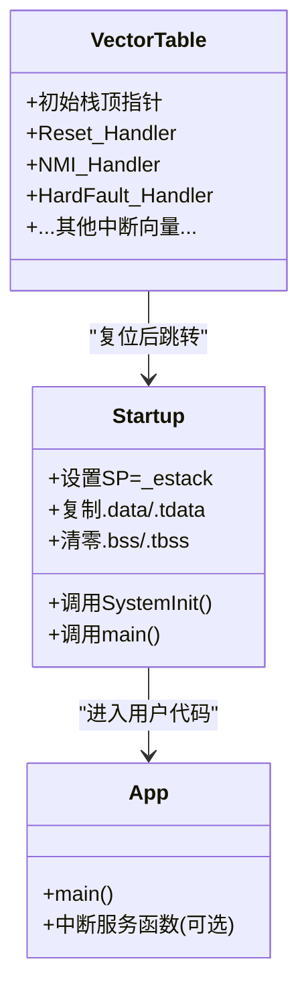
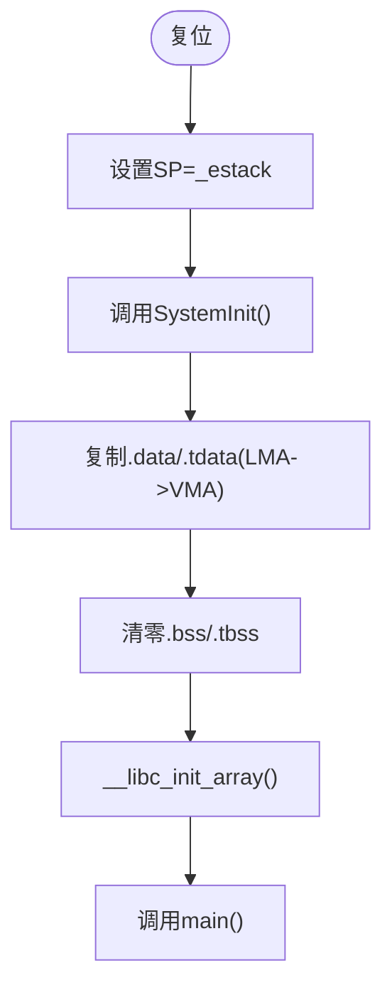
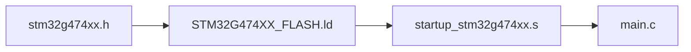

# 链接脚本配置

<cite>
**本文引用的文件**
- [STM32G474XX_FLASH.ld](file://STM32G474XX_FLASH.ld)
- [startup_stm32g474xx.s](file://startup_stm32g474xx.s)
- [stm32g474xx.h](file://Drivers/CMSIS/Device/ST/STM32G4xx/Include/stm32g474xx.h)
- [main.c](file://Core/Src/main.c)
</cite>

## 目录
1. [简介](#简介)
2. [项目结构](#项目结构)
3. [核心组件](#核心组件)
4. [架构总览](#架构总览)
5. [详细组件分析](#详细组件分析)
6. [依赖关系分析](#依赖关系分析)
7. [性能与内存优化建议](#性能与内存优化建议)
8. [故障排查指南](#故障排查指南)
9. [结论](#结论)
10. [附录：链接器基础概念](#附录链接器基础概念)

## 简介
本文件面向使用 STM32G474xx 的开发者，系统化解读并指导定制链接脚本 STM32G474XX_FLASH.ld。文档覆盖以下主题：
- 链接脚本结构与内存映射定义（Flash、RAM 区域划分、对齐与访问权限）
- MEMORY 段配置（起始地址、大小限制、存储类型）
- SECTIONS 段组织（代码段 .text、只读数据 .rodata、已初始化数据 .data、未初始化数据 .bss、TLS 相关段、堆栈布局）
- 向量表放置与中断向量映射关系
- 符号解析与重定位机制（VMA/LMA、AT>、LOADADDR、PROVIDE 等）
- 内存使用分析与优化建议（代码大小、内存碎片处理）
- 自定义内存区域添加与修改方法
- 为初学者提供链接器基本概念，为高级开发者提供定制与性能优化技巧

## 项目结构
本项目基于 STM32CubeMX 生成，关键与链接脚本相关的文件包括：
- 链接脚本：STM32G474XX_FLASH.ld
- 启动文件：startup_stm32g474xx.s（包含向量表与运行时初始化流程）
- CMSIS 设备头文件：stm32g474xx.h（芯片级地址常量与外设基址）
- 应用入口：main.c（调用系统初始化与外设驱动）

图表来源
- [STM32G474XX_FLASH.ld:56-68](file://STM32G474XX_FLASH.ld#L56-L68)
- [startup_stm32g474xx.s:33-135](file://startup_stm32g474xx.s#L33-L135)
- [stm32g474xx.h:1131-1152](file://Drivers/CMSIS/Device/ST/STM32G4xx/Include/stm32g474xx.h#L1131-L1152)

章节来源
- [STM32G474XX_FLASH.ld:56-68](file://STM32G474XX_FLASH.ld#L56-L68)
- [startup_stm32g474xx.s:33-135](file://startup_stm32g474xx.s#L33-L135)
- [stm32g474xx.h:1131-1152](file://Drivers/CMSIS/Device/ST/STM32G4xx/Include/stm32g474xx.h#L1131-L1152)

## 核心组件
- 链接脚本（STM32G474XX_FLASH.ld）
  - 定义目标芯片的内存区域（MEMORY）、最小堆栈/堆大小、输出段（SECTIONS）布局
  - 通过 AT> 指定 VMA/LMA 分离，实现 .data/.tdata 在 RAM 运行、在 FLASH 持久化
- 启动文件（startup_stm32g474xx.s）
  - 构建向量表 .isr_vector，设置初始 SP、PC，复制 .data 到 RAM，清零 .bss，调用 main()
- CMSIS 设备头（stm32g474xx.h）
  - 提供 Flash/RAM/外设基址与大小常量，供工具链与链接脚本参考
- 应用入口（main.c）
  - 调用 HAL 初始化、时钟配置、外设初始化与业务逻辑

章节来源
- [STM32G474XX_FLASH.ld:56-68](file://STM32G474XX_FLASH.ld#L56-L68)
- [startup_stm32g474xx.s:58-106](file://startup_stm32g474xx.s#L58-L106)
- [stm32g474xx.h:1131-1152](file://Drivers/CMSIS/Device/ST/STM32G4xx/Include/stm32g474xx.h#L1131-L1152)
- [main.c:219-290](file://Core/Src/main.c#L219-L290)

## 架构总览
从“编译-链接-启动”的角度看，链接脚本将各编译单元的输出段按规则放入物理内存；启动文件负责在复位后完成必要的运行时初始化，最终进入用户代码。

图表来源
- [startup_stm32g474xx.s:58-106](file://startup_stm32g474xx.s#L58-L106)
- [startup_stm32g474xx.s:129-135](file://startup_stm32g474xx.s#L129-L135)
- [STM32G474XX_FLASH.ld:73-95](file://STM32G474XX_FLASH.ld#L73-L95)
- [STM32G474XX_FLASH.ld:155-175](file://STM32G474XX_FLASH.ld#L155-L175)

## 详细组件分析

### 链接脚本：MEMORY 段与内存映射
- 内存区域定义
  - RAM：起始地址 0x20000000，长度 128K，属性 xrw（可执行/可读/可写）。注意：该脚本将全部 SRAM 合并为一个 RAM 区域，便于统一分配堆栈与全局变量。
  - FLASH：起始地址 0x08000000，长度 512K，属性 rx（可读/可执行）。
- 访问权限与对齐
  - 所有段均使用 ALIGN(4)，满足 Cortex-M 对字对齐的要求。
  - 堆栈区 ._user_heap_stack 使用 ALIGN(8)，保证栈指针 8 字节对齐，符合 ARMv7E-M 要求。
- 最小堆栈/堆大小
  - _Min_Stack_Size 与 _Min_Heap_Size 用于在链接阶段检测是否溢出 RAM。若超出，链接器会报错，有助于早期发现内存不足问题。

章节来源
- [STM32G474XX_FLASH.ld:56-68](file://STM32G474XX_FLASH.ld#L56-L68)

### 链接脚本：SECTIONS 段组织与布局
- 向量表 .isr_vector
  - 放置在 FLASH 起始位置，确保复位后 CPU 能正确读取栈顶与 Reset_Handler 地址。
- 代码段 .text
  - 存放函数与指令，位于 FLASH。导出 _etext 符号，可用于统计代码大小。
- 只读数据 .rodata
  - 字符串、常量等，位于 FLASH。
- 异常与初始化数组
  - .ARM.extab、.ARM.exidx：异常展开信息，位于 FLASH。
  - .preinit_array、.init_array、.fini_array：C/C++ 静态构造/析构数组，位于 FLASH。
- 已初始化数据 .data 与 TLS 数据 .tdata
  - VMA 在 RAM，LMA 在 FLASH（AT> FLASH），由启动代码在运行时复制到 RAM。
  - 导出 _sdata/_edata、__data_start/__data_end、__tdata_* 等符号，供启动代码拷贝与调试。
- 未初始化数据 .bss 与 TLS BSS .tbss
  - NOLOAD，仅占 RAM 空间，由启动代码清零。
  - 导出 _sbss/_ebss、__bss_start__/__bss_end__ 等符号。
- 堆栈区 ._user_heap_stack
  - NOLOAD，位于 RAM 末端，预留堆与栈空间，用于链接时检查是否越界。

图表来源
- [STM32G474XX_FLASH.ld:73-149](file://STM32G474XX_FLASH.ld#L73-L149)
- [STM32G474XX_FLASH.ld:155-238](file://STM32G474XX_FLASH.ld#L155-L238)

章节来源
- [STM32G474XX_FLASH.ld:73-238](file://STM32G474XX_FLASH.ld#L73-L238)

### 向量表与中断向量映射
- 向量表位置
  - .isr_vector 段被强制放置在 FLASH 起始处，确保复位后 CPU 从固定地址读取向量表。
- 向量表内容
  - 首项为初始栈顶指针 _estack，第二项为 Reset_Handler，后续为各中断服务例程入口。
- 弱符号与默认处理
  - 所有中断向量均以弱符号形式指向 Default_Handler，用户可在应用中实现同名函数以覆盖默认行为。

图表来源
- [startup_stm32g474xx.s:129-135](file://startup_stm32g474xx.s#L129-L135)
- [startup_stm32g474xx.s:58-106](file://startup_stm32g474xx.s#L58-L106)
- [startup_stm32g474xx.s:263-593](file://startup_stm32g474xx.s#L263-L593)

章节来源
- [startup_stm32g474xx.s:129-135](file://startup_stm32g474xx.s#L129-L135)
- [startup_stm32g474xx.s:263-593](file://startup_stm32g474xx.s#L263-L593)

### 符号解析与重定位机制
- VMA 与 LMA
  - .data/.tdata 使用 AT> FLASH，表示其运行地址（VMA）在 RAM，而镜像中的装载地址（LMA）在 FLASH。启动代码根据 LOADADDR(.data) 与 ADDR(.data) 进行拷贝。
- 关键符号
  - _sidata = LOADADDR(.data)：.data 在 FLASH 中的起始地址
  - _sdata/_edata：.data 在 RAM 中的起止地址
  - _sbss/_ebss：.bss 在 RAM 中的起止地址
  - __data_start/__data_end、__tdata_start/__tdata_end：TLS 相关符号
  - _estack/_sstack：栈顶与栈底
- 重定位与对齐
  - 使用 ALIGN(4)/ALIGN(8) 控制段边界对齐，避免跨页或总线访问异常。
  - PROVIDE/PROVIDE_HIDDEN 导出内部符号，供启动代码或库使用。

章节来源
- [STM32G474XX_FLASH.ld:152-238](file://STM32G474XX_FLASH.ld#L152-L238)
- [startup_stm32g474xx.s:36-46](file://startup_stm32g474xx.s#L36-L46)
- [startup_stm32g474xx.s:69-97](file://startup_stm32g474xx.s#L69-L97)

### 启动流程与数据初始化
- 设置栈指针
  - ldr r0, =_estack; mov sp, r0
- 调用 SystemInit
  - 配置系统时钟、PLL 等
- 复制 .data/.tdata
  - 循环从 _sidata 拷贝到 _sdata，直到 _edata
- 清零 .bss/.tbss
  - 循环从 _sbss 到 _ebss 置零
- 调用 C 库初始化与 main()
  - __libc_init_array 执行静态构造函数，然后 bl main

图表来源
- [startup_stm32g474xx.s:58-106](file://startup_stm32g474xx.s#L58-L106)

章节来源
- [startup_stm32g474xx.s:58-106](file://startup_stm32g474xx.s#L58-L106)

### 内存使用分析与优化建议
- 代码大小优化
  - 使用 -Os/-Oz 优化等级减少 .text 体积
  - 移除不必要的 .rodata（如长字符串、大表格），必要时移至外部存储或通过指针间接访问
  - 使用 __attribute__((section(".RamFunc"))) 将热点函数放入 RAM，提升执行速度（需权衡 RAM 占用）
- 内存碎片处理
  - 合理组织 .data/.bss 顺序，减少段间空隙
  - 调整 _Min_Heap_Size 与 _Min_Stack_Size，避免过大导致浪费
  - 使用堆管理器（如 heap_4）配合 FreeRTOS 时，确保堆与栈不重叠且对齐
- 运行时拷贝优化
  - 对于大量 .data/.tdata，考虑使用 DMA 或双缓冲策略加速拷贝
  - 将频繁访问的常量放入 .rodata，避免重复初始化

章节来源
- [STM32G474XX_FLASH.ld:155-238](file://STM32G474XX_FLASH.ld#L155-L238)
- [startup_stm32g474xx.s:69-97](file://startup_stm32g474xx.s#L69-L97)

### 自定义内存区域添加与修改
- 新增外部存储器区域
  - 在 MEMORY 段中添加新区域，例如：EXTMEM (rx) : ORIGIN = 0x90000000, LENGTH = 1M
  - 在 SECTIONS 中为新段指定 >EMEM 或 AT>EMEM，如 .ext_data : >EMEM AT>EMEM
- 调整现有区域
  - 修改 FLASH/RAM 的 ORIGIN/LENGTH，确保与芯片实际容量一致
  - 若启用 CCMSRAM/SRAM2，可在 MEMORY 中拆分多个 RAM 子区域，并在 SECTIONS 中分别放置不同用途的数据
- 注意事项
  - 保持段对齐与边界检查，避免越界
  - 更新启动文件中相关符号（如需要）
  - 验证链接器报告与运行时行为

章节来源
- [STM32G474XX_FLASH.ld:56-68](file://STM32G474XX_FLASH.ld#L56-L68)
- [STM32G474XX_FLASH.ld:155-238](file://STM32G474XX_FLASH.ld#L155-L238)

## 依赖关系分析
- 链接脚本依赖 CMSIS 设备头提供的地址常量，确保与硬件一致
- 启动文件依赖链接脚本导出的符号（_estack、_sdata、_edata、_sbss、_ebss、_sidata）
- 应用代码通过 HAL 与 CMSIS 寄存器访问外设，受链接脚本定义的内存布局影响

图表来源
- [stm32g474xx.h:1131-1152](file://Drivers/CMSIS/Device/ST/STM32G4xx/Include/stm32g474xx.h#L1131-L1152)
- [STM32G474XX_FLASH.ld:56-68](file://STM32G474XX_FLASH.ld#L56-L68)
- [startup_stm32g474xx.s:36-46](file://startup_stm32g474xx.s#L36-L46)
- [main.c:219-290](file://Core/Src/main.c#L219-L290)

章节来源
- [stm32g474xx.h:1131-1152](file://Drivers/CMSIS/Device/ST/STM32G4xx/Include/stm32g474xx.h#L1131-L1152)
- [STM32G474XX_FLASH.ld:56-68](file://STM32G474XX_FLASH.ld#L56-L68)
- [startup_stm32g474xx.s:36-46](file://startup_stm32g474xx.s#L36-L46)
- [main.c:219-290](file://Core/Src/main.c#L219-L290)

## 性能与内存优化建议
- 代码侧
  - 使用 -Os/-Oz 减小 .text
  - 将热点路径标记为 .RamFunc，减少 Flash 访问延迟
  - 避免在 .data 中放置大型只读表，改用 .rodata 或外部存储
- 链接侧
  - 合理设置 _Min_Heap_Size 与 _Min_Stack_Size，避免浪费
  - 使用 SORT(.init_array.*) 等排序选项，提高初始化效率
  - 利用 /DISCARD/ 丢弃无用库信息，减小镜像体积
- 启动侧
  - 使用 DMA 加速 .data/.tdata 拷贝
  - 按需初始化，减少启动时间

[本节为通用建议，无需特定文件引用]

## 故障排查指南
- 链接错误：堆栈或堆溢出
  - 现象：链接时报错提示堆栈无法放入 RAM
  - 原因：_Min_Heap_Size 与 _Min_Stack_Size 之和加上 .data/.bss 占用超过 RAM 长度
  - 解决：增大 RAM 长度或减小堆栈/数据占用
- 运行时崩溃：栈指针未正确设置
  - 现象：复位后立即 HardFault
  - 原因：向量表未正确放置或 _estack 符号未导出
  - 解决：确认 .isr_vector 在 FLASH 起始，检查 _estack 计算是否正确
- 数据未初始化：.data 未复制到 RAM
  - 现象：全局变量初始值不正确
  - 原因：启动代码未执行或 _sidata/_sdata/_edata 符号错误
  - 解决：检查启动文件拷贝逻辑与链接脚本符号一致性

章节来源
- [STM32G474XX_FLASH.ld:63-68](file://STM32G474XX_FLASH.ld#L63-L68)
- [startup_stm32g474xx.s:58-106](file://startup_stm32g474xx.s#L58-L106)
- [startup_stm32g474xx.s:129-135](file://startup_stm32g474xx.s#L129-L135)

## 结论
STM32G474XX_FLASH.ld 定义了 STM32G474xx 的内存布局与段组织，结合启动文件完成运行时初始化与中断向量映射。通过理解 VMA/LMA、AT>、PROVIDE 等机制，开发者可以灵活定制内存区域、优化性能与资源占用。建议在工程迭代中持续监控内存使用，及时调整堆栈与数据布局，确保系统稳定高效运行。

[本节为总结性内容，无需特定文件引用]

## 附录：链接器基础概念
- 链接器作用
  - 将多个目标文件与库组合成单一可执行镜像，分配地址、解析符号、生成段表
- 关键概念
  - VMA（虚拟内存地址）：程序运行时的地址
  - LMA（装载内存地址）：镜像中段的实际存储地址
  - AT>：指定 LMA，常用于 .data/.tdata 的 FLASH 持久化
  - ALIGN：段对齐，避免跨页与总线访问异常
  - PROVIDE/PROVIDE_HIDDEN：导出内部符号供其他模块使用
- 常用命令与选项
  - -Map：生成映射文件，分析符号与段分布
  - --print-memory-usage：打印内存使用情况
  - -Os/-Oz：优化代码大小
  - -Wl,--gc-sections：删除未使用的段，减小镜像

[本节为通用知识，无需特定文件引用]