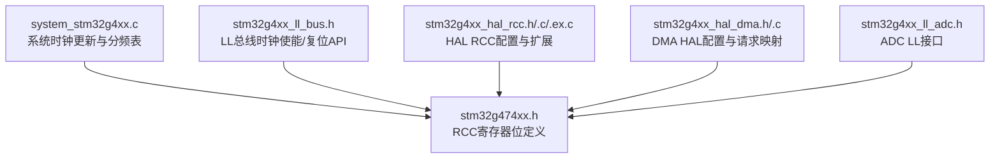
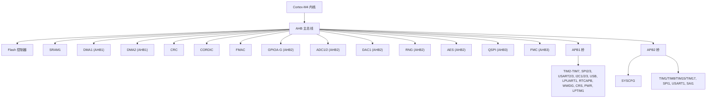
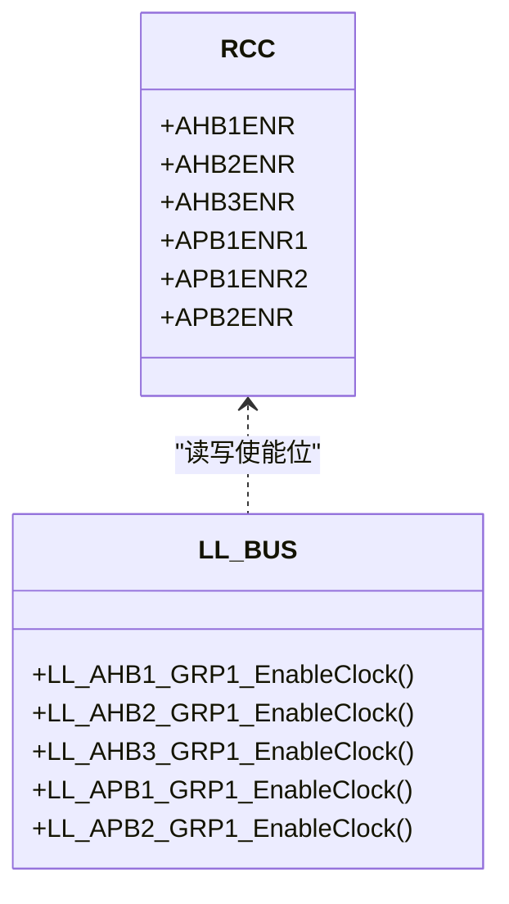
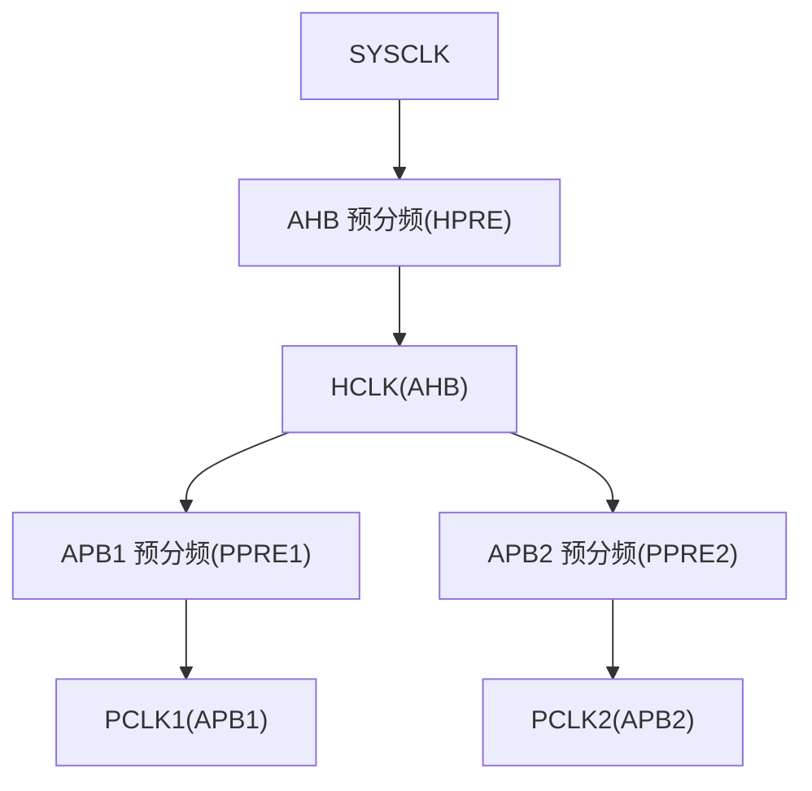
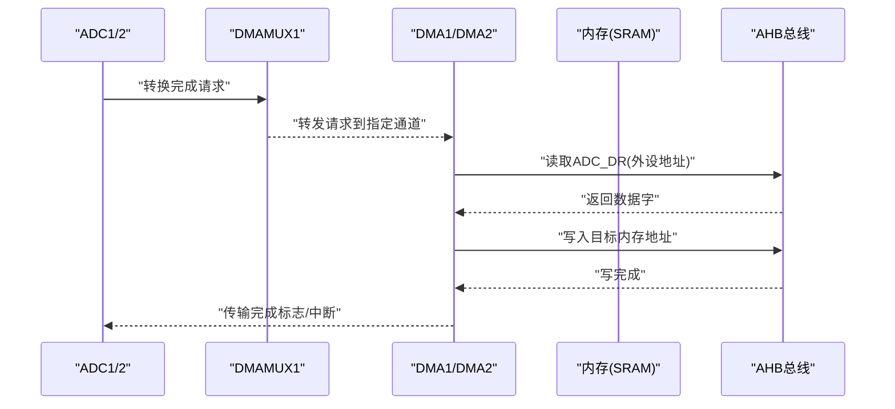
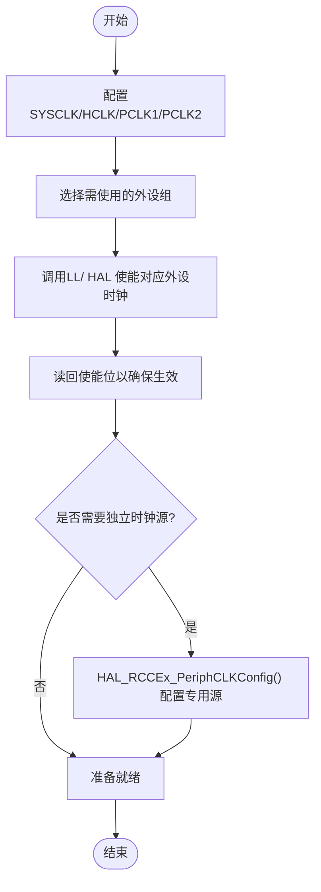
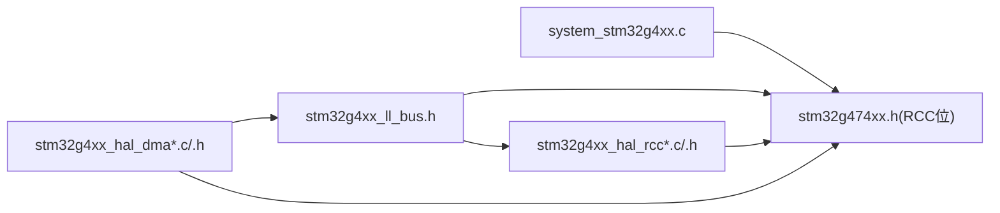
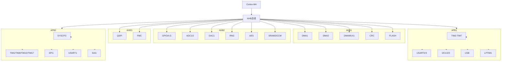
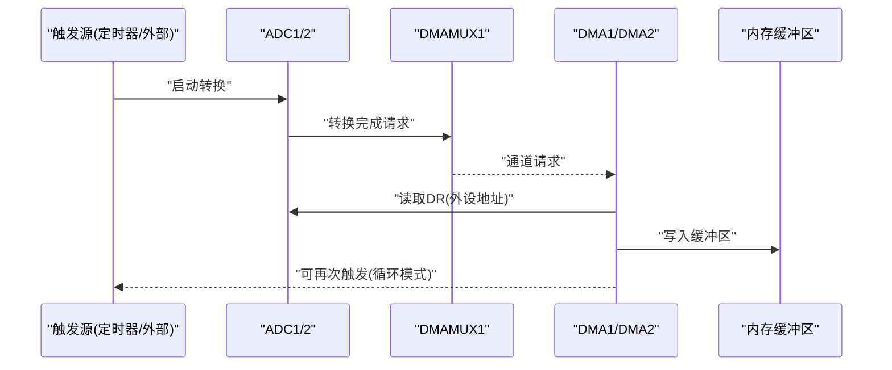

# 外设总线架构

<cite>
**本文引用的文件**
- [Core/Src/system_stm32g4xx.c](file://Core/Src/system_stm32g4xx.c)
- [Drivers/CMSIS/Device/ST/STM32G4xx/Include/stm32g474xx.h](file://Drivers/CMSIS/Device/ST/STM32G4xx/Include/stm32g474xx.h)
- [Drivers/STM32G4xx_HAL_Driver/Inc/stm32g4xx_ll_bus.h](file://Drivers/STM32G4xx_HAL_Driver/Inc/stm32g4xx_ll_bus.h)
- [Drivers/STM32G4xx_HAL_Driver/Inc/stm32g4xx_hal_rcc.h](file://Drivers/STM32G4xx_HAL_Driver/Inc/stm32g4xx_hal_rcc.h)
- [Drivers/STM32G4xx_HAL_Driver/Src/stm32g4xx_hal_rcc.c](file://Drivers/STM32G4xx_HAL_Driver/Src/stm32g4xx_hal_rcc.c)
- [Drivers/STM32G4xx_HAL_Driver/Src/stm32g4xx_hal_rcc_ex.c](file://Drivers/STM32G4xx_HAL_Driver/Src/stm32g4xx_hal_rcc_ex.c)
- [Drivers/STM32G4xx_HAL_Driver/Inc/stm32g4xx_hal_dma.h](file://Drivers/STM32G4xx_HAL_Driver/Inc/stm32g4xx_hal_dma.h)
- [Drivers/STM32G4xx_HAL_Driver/Src/stm32g4xx_hal_dma.c](file://Drivers/STM32G4xx_HAL_Driver/Src/stm32g4xx_hal_dma.c)
- [Drivers/STM32G4xx_HAL_Driver/Inc/stm32g4xx_ll_adc.h](file://Drivers/STM32G4xx_HAL_Driver/Inc/stm32g4xx_ll_adc.h)
</cite>

## 目录
1. [简介](#简介)
2. [项目结构](#项目结构)
3. [核心组件](#核心组件)
4. [架构总览](#架构总览)
5. [详细组件分析](#详细组件分析)
6. [依赖关系分析](#依赖关系分析)
7. [性能与带宽特性](#性能与带宽特性)
8. [故障排查指南](#故障排查指南)
9. [结论](#结论)
10. [附录](#附录)

## 简介
本文件围绕STM32G474的外设总线架构与通信机制，系统阐述AHB、APB1、APB2的层次结构与带宽特性，说明各外设模块在总线上的挂载位置与优先级设置，解释DMA控制器与总线系统的交互（特别是高速ADC数据采集路径），并提供时钟配置与外设使能的最佳实践。同时给出总线仲裁机制与冲突解决策略的分析，并附总线拓扑图与数据流路径图，帮助读者从代码与驱动层面理解底层行为。

## 项目结构
本项目基于STM32CubeMX生成的工程骨架，包含CMSIS设备头、HAL/LL驱动以及系统初始化代码。与总线架构相关的核心文件包括：
- 系统时钟与分频表：system_stm32g4xx.c
- 设备寄存器定义（含RCC使能位）：stm32g474xx.h
- LL总线时钟控制宏与函数：stm32g4xx_ll_bus.h
- HAL RCC接口与扩展配置：stm32g4xx_hal_rcc.h、stm32g4xx_hal_rcc.c、stm32g4xx_hal_rcc_ex.c
- DMA HAL接口与实现：stm32g4xx_hal_dma.h、stm32g4xx_hal_dma.c
- ADC LL接口（触发、序列等）：stm32g4xx_ll_adc.h

图表来源
- [Core/Src/system_stm32g4xx.c:146-272](file://Core/Src/system_stm32g4xx.c#L146-L272)
- [Drivers/CMSIS/Device/ST/STM32G4xx/Include/stm32g474xx.h:12313-12333](file://Drivers/CMSIS/Device/ST/STM32G4xx/Include/stm32g474xx.h#L12313-L12333)
- [Drivers/STM32G4xx_HAL_Driver/Inc/stm32g4xx_ll_bus.h:220-300](file://Drivers/STM32G4xx_HAL_Driver/Inc/stm32g4xx_ll_bus.h#L220-L300)
- [Drivers/STM32G4xx_HAL_Driver/Inc/stm32g4xx_hal_rcc.h:102-121](file://Drivers/STM32G4xx_HAL_Driver/Inc/stm32g4xx_hal_rcc.h#L102-L121)
- [Drivers/STM32G4xx_HAL_Driver/Src/stm32g4xx_hal_rcc.c:154-200](file://Drivers/STM32G4xx_HAL_Driver/Src/stm32g4xx_hal_rcc.c#L154-L200)
- [Drivers/STM32G4xx_HAL_Driver/Inc/stm32g4xx_hal_dma.h:46-74](file://Drivers/STM32G4xx_HAL_Driver/Inc/stm32g4xx_hal_dma.h#L46-L74)
- [Drivers/STM32G4xx_HAL_Driver/Inc/stm32g4xx_ll_adc.h:108-135](file://Drivers/STM32G4xx_HAL_Driver/Inc/stm32g4xx_ll_adc.h#L108-L135)

章节来源
- [Core/Src/system_stm32g4xx.c:146-272](file://Core/Src/system_stm32g4xx.c#L146-L272)
- [Drivers/STM32G4xx_HAL_Driver/Inc/stm32g4xx_ll_bus.h:220-300](file://Drivers/STM32G4xx_HAL_Driver/Inc/stm32g4xx_ll_bus.h#L220-L300)
- [Drivers/STM32G4xx_HAL_Driver/Inc/stm32g4xx_hal_rcc.h:102-121](file://Drivers/STM32G4xx_HAL_Driver/Inc/stm32g4xx_hal_rcc.h#L102-L121)
- [Drivers/STM32G4xx_HAL_Driver/Src/stm32g4xx_hal_rcc.c:154-200](file://Drivers/STM32G4xx_HAL_Driver/Src/stm32g4xx_hal_rcc.c#L154-L200)
- [Drivers/STM32G4xx_HAL_Driver/Inc/stm32g4xx_hal_dma.h:46-74](file://Drivers/STM32G4xx_HAL_Driver/Inc/stm32g4xx_hal_dma.h#L46-L74)
- [Drivers/STM32G4xx_HAL_Driver/Inc/stm32g4xx_ll_adc.h:108-135](file://Drivers/STM32G4xx_HAL_Driver/Inc/stm32g4xx_ll_adc.h#L108-L135)

## 核心组件
- 系统时钟与分频器
  - SystemCoreClockUpdate()根据RCC->CFGR计算SYSCLK/HCLK频率，使用AHB/APB预分频表进行分频。
  - AHBPrescTable与APBPrescTable提供分频系数映射。
- RCC寄存器与外设时钟使能
  - stm32g474xx.h中定义了RCC的AHBxENR、APB1ENRx、APB2ENR等寄存器位，用于开启外设时钟。
  - LL层提供LL_AHBx_GRPx_EnableClock等内联函数，封装写位与必要的读回延迟。
- DMA控制器与DMAMUX
  - DMA HAL结构体包含通道、方向、对齐、模式、优先级等配置项；支持多种请求源（如ADC1）。
  - DMA初始化流程涉及通道索引计算、CR寄存器配置、中断与回调管理。
- ADC接口
  - LL层提供ADC触发、序列、采样时间等配置宏与偏移量，便于直接操作寄存器。

章节来源
- [Core/Src/system_stm32g4xx.c:146-272](file://Core/Src/system_stm32g4xx.c#L146-L272)
- [Drivers/CMSIS/Device/ST/STM32G4xx/Include/stm32g474xx.h:12313-12333](file://Drivers/CMSIS/Device/ST/STM32G4xx/Include/stm32g474xx.h#L12313-L12333)
- [Drivers/STM32G4xx_HAL_Driver/Inc/stm32g4xx_ll_bus.h:220-300](file://Drivers/STM32G4xx_HAL_Driver/Inc/stm32g4xx_ll_bus.h#L220-L300)
- [Drivers/STM32G4xx_HAL_Driver/Inc/stm32g4xx_hal_dma.h:46-74](file://Drivers/STM32G4xx_HAL_Driver/Inc/stm32g4xx_hal_dma.h#L46-L74)
- [Drivers/STM32G4xx_HAL_Driver/Src/stm32g4xx_hal_dma.c:152-200](file://Drivers/STM32G4xx_HAL_Driver/Src/stm32g4xx_hal_dma.c#L152-L200)
- [Drivers/STM32G4xx_HAL_Driver/Inc/stm32g4xx_ll_adc.h:108-135](file://Drivers/STM32G4xx_HAL_Driver/Inc/stm32g4xx_ll_adc.h#L108-L135)

## 架构总览
STM32G474采用Cortex-M4内核，通过AHB主总线连接CPU、内存与高速外设；APB1与APB2为低速外设总线，由AHB经分频器派生。DMA作为AHB主设备，可在内存与外设之间搬运数据，减轻CPU负担。

图表来源
- [Drivers/CMSIS/Device/ST/STM32G4xx/Include/stm32g474xx.h:12313-12333](file://Drivers/CMSIS/Device/ST/STM32G4xx/Include/stm32g474xx.h#L12313-L12333)
- [Drivers/STM32G4xx_HAL_Driver/Inc/stm32g4xx_ll_bus.h:85-130](file://Drivers/STM32G4xx_HAL_Driver/Inc/stm32g4xx_ll_bus.h#L85-L130)
- [Drivers/STM32G4xx_HAL_Driver/Inc/stm32g4xx_ll_bus.h:132-208](file://Drivers/STM32G4xx_HAL_Driver/Inc/stm32g4xx_ll_bus.h#L132-L208)

## 详细组件分析

### AHB总线族（AHB1/AHB2/AHB3）
- AHB1：DMA1/DMA2、DMAMUX1、CORDIC、FMAC、Flash、CRC等
- AHB2：GPIOA~G、ADC1/2、DAC1、RNG、AES、CCM/SRAM2等
- AHB3：FMC、QSPI（视器件而定）

这些外设的时钟使能位在RCC的AHBxENR中定义，LL层提供Enable/Disable/Reset等原子操作。

图表来源
- [Drivers/CMSIS/Device/ST/STM32G4xx/Include/stm32g474xx.h:12313-12333](file://Drivers/CMSIS/Device/ST/STM32G4xx/Include/stm32g474xx.h#L12313-L12333)
- [Drivers/STM32G4xx_HAL_Driver/Inc/stm32g4xx_ll_bus.h:220-300](file://Drivers/STM32G4xx_HAL_Driver/Inc/stm32g4xx_ll_bus.h#L220-L300)

章节来源
- [Drivers/STM32G4xx_HAL_Driver/Inc/stm32g4xx_ll_bus.h:85-130](file://Drivers/STM32G4xx_HAL_Driver/Inc/stm32g4xx_ll_bus.h#L85-L130)
- [Drivers/STM32G4xx_HAL_Driver/Inc/stm32g4xx_ll_bus.h:132-208](file://Drivers/STM32G4xx_HAL_Driver/Inc/stm32g4xx_ll_bus.h#L132-L208)

### APB1与APB2总线
- APB1：定时器、串口、I2C、USB、低功耗外设等
- APB2：高性能定时器、SPI1、USART1、SAI1、SYSCFG等

APB时钟由AHB经分频器产生，具体分频值由RCC_CFGR中的HPRE/PPRE1/PPRE2字段决定。

图表来源
- [Core/Src/system_stm32g4xx.c:230-272](file://Core/Src/system_stm32g4xx.c#L230-L272)
- [Drivers/STM32G4xx_HAL_Driver/Inc/stm32g4xx_hal_rcc.h:102-121](file://Drivers/STM32G4xx_HAL_Driver/Inc/stm32g4xx_hal_rcc.h#L102-L121)

章节来源
- [Core/Src/system_stm32g4xx.c:230-272](file://Core/Src/system_stm32g4xx.c#L230-L272)
- [Drivers/STM32G4xx_HAL_Driver/Inc/stm32g4xx_hal_rcc.h:102-121](file://Drivers/STM32G4xx_HAL_Driver/Inc/stm32g4xx_hal_rcc.h#L102-L121)

### DMA控制器与总线交互（含ADC采集）
- DMA作为AHB主设备，可发起对AHB外设（如ADC1/2的数据寄存器）和内存的访问。
- DMA请求源通过DMAMUX映射，例如ADC1请求对应DMA通道。
- DMA优先级在通道级配置，影响多通道竞争时的仲裁顺序。

图表来源
- [Drivers/STM32G4xx_HAL_Driver/Inc/stm32g4xx_hal_dma.h:176-186](file://Drivers/STM32G4xx_HAL_Driver/Inc/stm32g4xx_hal_dma.h#L176-L186)
- [Drivers/STM32G4xx_HAL_Driver/Src/stm32g4xx_hal_dma.c:152-200](file://Drivers/STM32G4xx_HAL_Driver/Src/stm32g4xx_hal_dma.c#L152-L200)
- [Drivers/STM32G4xx_HAL_Driver/Inc/stm32g4xx_ll_bus.h:72-83](file://Drivers/STM32G4xx_HAL_Driver/Inc/stm32g4xx_ll_bus.h#L72-L83)

章节来源
- [Drivers/STM32G4xx_HAL_Driver/Inc/stm32g4xx_hal_dma.h:46-74](file://Drivers/STM32G4xx_HAL_Driver/Inc/stm32g4xx_hal_dma.h#L46-L74)
- [Drivers/STM32G4xx_HAL_Driver/Src/stm32g4xx_hal_dma.c:152-200](file://Drivers/STM32G4xx_HAL_Driver/Src/stm32g4xx_hal_dma.c#L152-L200)
- [Drivers/STM32G4xx_HAL_Driver/Inc/stm32g4xx_ll_bus.h:72-83](file://Drivers/STM32G4xx_HAL_Driver/Inc/stm32g4xx_ll_bus.h#L72-L83)

### 总线时钟配置与外设使能最佳实践
- 先配置系统时钟与分频器（SYSCLK/HCLK/PCLK1/PCLK2），确保满足外设最大频率与电压范围要求。
- 再按功能分组启用外设时钟（LL或HAL API），并在写使能后进行一次读回以消除延迟。
- 对于需要独立时钟源的外设（如ADC、USB、RNG），使用HAL RCC扩展接口配置其专用时钟源与输出。

图表来源
- [Core/Src/system_stm32g4xx.c:230-272](file://Core/Src/system_stm32g4xx.c#L230-L272)
- [Drivers/STM32G4xx_HAL_Driver/Inc/stm32g4xx_ll_bus.h:243-250](file://Drivers/STM32G4xx_HAL_Driver/Inc/stm32g4xx_ll_bus.h#L243-L250)
- [Drivers/STM32G4xx_HAL_Driver/Src/stm32g4xx_hal_rcc_ex.c:432-446](file://Drivers/STM32G4xx_HAL_Driver/Src/stm32g4xx_hal_rcc_ex.c#L432-L446)

章节来源
- [Core/Src/system_stm32g4xx.c:230-272](file://Core/Src/system_stm32g4xx.c#L230-L272)
- [Drivers/STM32G4xx_HAL_Driver/Inc/stm32g4xx_ll_bus.h:243-250](file://Drivers/STM32G4xx_HAL_Driver/Inc/stm32g4xx_ll_bus.h#L243-L250)
- [Drivers/STM32G4xx_HAL_Driver/Src/stm32g4xx_hal_rcc_ex.c:432-446](file://Drivers/STM32G4xx_HAL_Driver/Src/stm32g4xx_hal_rcc_ex.c#L432-L446)

### 总线仲裁机制与冲突解决策略
- 仲裁主体
  - Cortex-M4内核与DMA均为AHB主设备，共享AHB总线。
  - DMA内部存在多个通道，同一DMA实例内的通道间存在软件优先级（PL）与硬件轮询/固定优先级的组合。
- 冲突场景
  - CPU与DMA同时访问同一AHB外设（如ADC_DR）时，总线仲裁器会保证一致性，但可能引入等待周期。
  - 多个DMA通道并发访问不同外设时，依据通道优先级与请求时序调度。
- 缓解策略
  - 合理设置DMA通道优先级，避免高吞吐任务被低优先级阻塞。
  - 将频繁访问的数据缓冲区放置在SRAM1/SRAM2，减少外部存储器访问带来的总线拥塞。
  - 使用双缓冲或环形缓冲降低CPU干预频率，提高整体吞吐。

章节来源
- [Drivers/STM32G4xx_HAL_Driver/Inc/stm32g4xx_hal_dma.h:46-74](file://Drivers/STM32G4xx_HAL_Driver/Inc/stm32g4xx_hal_dma.h#L46-L74)
- [Drivers/STM32G4xx_HAL_Driver/Inc/stm32g4xx_ll_bus.h:72-83](file://Drivers/STM32G4xx_HAL_Driver/Inc/stm32g4xx_ll_bus.h#L72-L83)

## 依赖关系分析
- system_stm32g4xx.c依赖stm32g474xx.h中的RCC寄存器定义，用于计算SystemCoreClock。
- LL总线层依赖stm32g474xx.h的RCC位定义，封装了AHB/APB外设时钟使能/复位操作。
- HAL RCC扩展用于配置独立时钟源（如ADC、RNG、USB），依赖RCC相关宏与寄存器。
- DMA HAL依赖DMA/DMAMUX寄存器定义，并通过LL总线层间接依赖RCC位定义。

图表来源
- [Core/Src/system_stm32g4xx.c:230-272](file://Core/Src/system_stm32g4xx.c#L230-L272)
- [Drivers/STM32G4xx_HAL_Driver/Inc/stm32g4xx_ll_bus.h:220-300](file://Drivers/STM32G4xx_HAL_Driver/Inc/stm32g4xx_ll_bus.h#L220-L300)
- [Drivers/STM32G4xx_HAL_Driver/Inc/stm32g4xx_hal_rcc.h:102-121](file://Drivers/STM32G4xx_HAL_Driver/Inc/stm32g4xx_hal_rcc.h#L102-L121)
- [Drivers/STM32G4xx_HAL_Driver/Inc/stm32g4xx_hal_dma.h:46-74](file://Drivers/STM32G4xx_HAL_Driver/Inc/stm32g4xx_hal_dma.h#L46-L74)

章节来源
- [Core/Src/system_stm32g4xx.c:230-272](file://Core/Src/system_stm32g4xx.c#L230-L272)
- [Drivers/STM32G4xx_HAL_Driver/Inc/stm32g4xx_ll_bus.h:220-300](file://Drivers/STM32G4xx_HAL_Driver/Inc/stm32g4xx_ll_bus.h#L220-L300)
- [Drivers/STM32G4xx_HAL_Driver/Inc/stm32g4xx_hal_rcc.h:102-121](file://Drivers/STM32G4xx_HAL_Driver/Inc/stm32g4xx_hal_rcc.h#L102-L121)
- [Drivers/STM32G4xx_HAL_Driver/Inc/stm32g4xx_hal_dma.h:46-74](file://Drivers/STM32G4xx_HAL_Driver/Inc/stm32g4xx_hal_dma.h#L46-L74)

## 性能与带宽特性
- 带宽分配
  - AHB为高带宽主干，适合DMA与CPU并行访问；APB为低速外设总线，带宽较低。
  - DMA作为AHB主设备，可高效搬运大量数据，显著降低CPU负载。
- 时钟与延迟
  - 系统时钟与分频直接影响AHB/APB工作频率，需结合电压范围与Flash等待状态配置。
  - 外设时钟使能后需读回确认，避免因流水线导致的访问错误。
- ADC采集优化
  - 使用DMA+循环模式，配合ADC触发（定时器或外部事件），可实现连续采样与零拷贝处理。
  - 合理设置DMA通道优先级与缓冲区大小，避免溢出与丢样。

[本节为通用指导，不直接分析具体文件]

## 故障排查指南
- 外设无响应
  - 检查对应AHB/APB外设时钟是否已使能，并确保读回确认。
  - 参考LL层的Enable函数实现，确认写位与读回逻辑。
- DMA传输异常
  - 验证DMA通道优先级、方向、对齐、增量模式是否正确。
  - 检查DMAMUX请求映射是否与外设一致（如ADC1请求）。
- ADC数据不正确
  - 确认ADC时钟源与分频符合规格，必要时启用PLLADC输出。
  - 检查触发源与序列配置，确保采样时间与分辨率匹配应用需求。

章节来源
- [Drivers/STM32G4xx_HAL_Driver/Inc/stm32g4xx_ll_bus.h:243-250](file://Drivers/STM32G4xx_HAL_Driver/Inc/stm32g4xx_ll_bus.h#L243-L250)
- [Drivers/STM32G4xx_HAL_Driver/Inc/stm32g4xx_hal_dma.h:46-74](file://Drivers/STM32G4xx_HAL_Driver/Inc/stm32g4xx_hal_dma.h#L46-L74)
- [Drivers/STM32G4xx_HAL_Driver/Src/stm32g4xx_hal_rcc_ex.c:432-446](file://Drivers/STM32G4xx_HAL_Driver/Src/stm32g4xx_hal_rcc_ex.c#L432-L446)
- [Drivers/STM32G4xx_HAL_Driver/Inc/stm32g4xx_ll_adc.h:108-135](file://Drivers/STM32G4xx_HAL_Driver/Inc/stm32g4xx_ll_adc.h#L108-L135)

## 结论
STM32G474的总线架构清晰分层：AHB承载高带宽任务（CPU、DMA、高速外设），APB1/2承载低速外设。DMA作为AHB主设备，在ADC等高速数据采集场景中发挥关键作用。通过合理的时钟配置、外设使能与DMA优先级设置，可有效提升系统吞吐与稳定性。建议在实际工程中遵循“先系统时钟、再外设时钟、最后功能配置”的顺序，并结合LL/ HAL提供的原子操作与读回延迟保障可靠性。

[本节为总结性内容，不直接分析具体文件]

## 附录

### 总线拓扑图（代码映射）

图表来源
- [Drivers/CMSIS/Device/ST/STM32G4xx/Include/stm32g474xx.h:12313-12333](file://Drivers/CMSIS/Device/ST/STM32G4xx/Include/stm32g474xx.h#L12313-L12333)
- [Drivers/STM32G4xx_HAL_Driver/Inc/stm32g4xx_ll_bus.h:85-130](file://Drivers/STM32G4xx_HAL_Driver/Inc/stm32g4xx_ll_bus.h#L85-L130)
- [Drivers/STM32G4xx_HAL_Driver/Inc/stm32g4xx_ll_bus.h:132-208](file://Drivers/STM32G4xx_HAL_Driver/Inc/stm32g4xx_ll_bus.h#L132-L208)

### 数据流路径图（ADC+DMA）

图表来源
- [Drivers/STM32G4xx_HAL_Driver/Inc/stm32g4xx_ll_adc.h:108-135](file://Drivers/STM32G4xx_HAL_Driver/Inc/stm32g4xx_ll_adc.h#L108-L135)
- [Drivers/STM32G4xx_HAL_Driver/Inc/stm32g4xx_hal_dma.h:176-186](file://Drivers/STM32G4xx_HAL_Driver/Inc/stm32g4xx_hal_dma.h#L176-L186)
- [Drivers/STM32G4xx_HAL_Driver/Src/stm32g4xx_hal_dma.c:152-200](file://Drivers/STM32G4xx_HAL_Driver/Src/stm32g4xx_hal_dma.c#L152-L200)