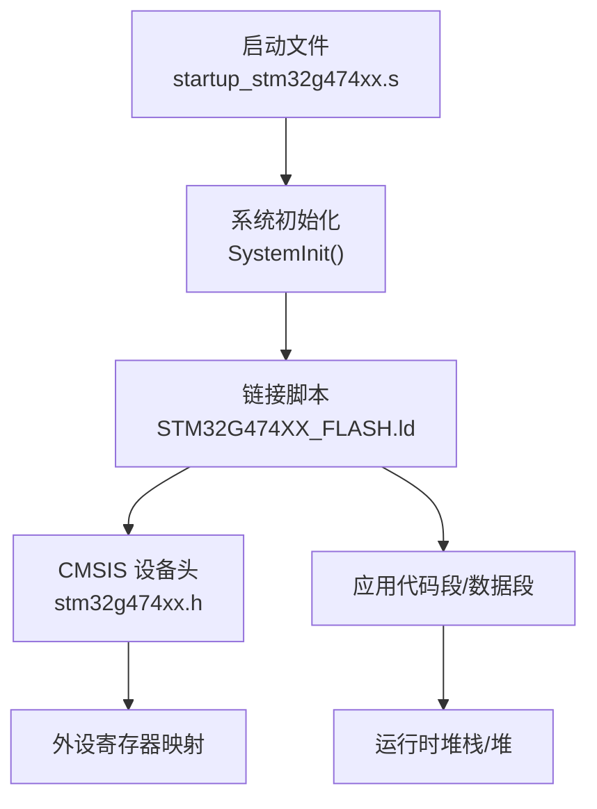
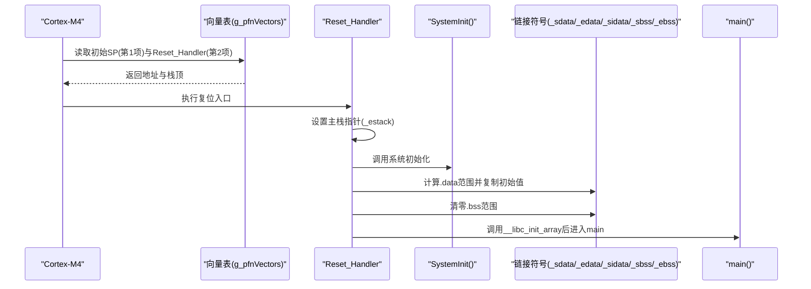
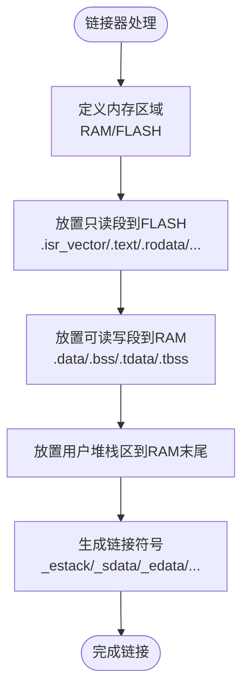
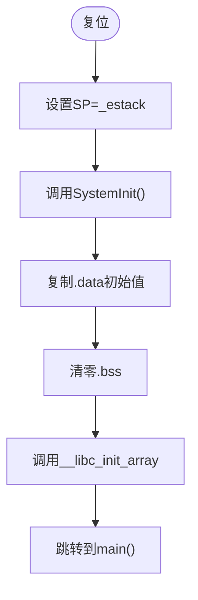
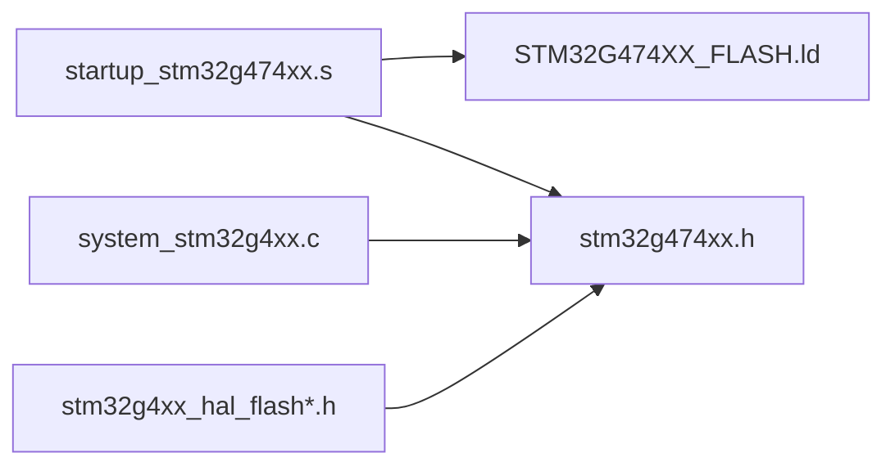
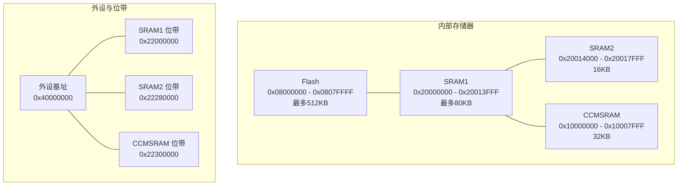
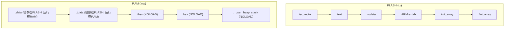

# 存储器架构

<cite>
**本文引用的文件**   
- [STM32G474XX_FLASH.ld](file://STM32G474XX_FLASH.ld)
- [startup_stm32g474xx.s](file://startup_stm32g474xx.s)
- [system_stm32g4xx.c](file://Core/Src/system_stm32g4xx.c)
- [stm32g474xx.h](file://Drivers/CMSIS/Device/ST/STM32G4xx/Include/stm32g474xx.h)
- [stm32g4xx_hal_flash.h](file://Drivers/STM32G4xx_HAL_Driver/Inc/stm32g4xx_hal_flash.h)
- [stm32g4xx_hal_flash_ex.h](file://Drivers/STM32G4xx_HAL_Driver/Inc/stm32g4xx_hal_flash_ex.h)
- [stm32g4xx_hal_flash_ramfunc.h](file://Drivers/STM32G4xx_HAL_Driver/Inc/stm32g4xx_hal_flash_ramfunc.h)
</cite>

## 目录
1. [简介](#简介)
2. [项目结构](#项目结构)
3. [核心组件](#核心组件)
4. [架构总览](#架构总览)
5. [详细组件分析](#详细组件分析)
6. [依赖关系分析](#依赖关系分析)
7. [性能与优化](#性能与优化)
8. [故障排查指南](#故障排查指南)
9. [结论](#结论)
10. [附录：存储器映射图与段布局](#附录存储器映射图与段布局)

## 简介
本文件面向使用 STM32G474 的开发者，系统化阐述该芯片的存储器架构与映射机制，重点覆盖：
- Flash 主存储器的组织、编程特性与选项字节（Option Bytes）
- SRAM 分布（主 SRAM1、SRAM2、CCM SRAM）及地址空间
- 链接脚本 STM32G474XX_FLASH.ld 中的段定义与内存布局
- 启动文件 startup_stm32g474xx.s 的向量表配置与堆栈初始化流程
- 内存使用优化策略与最佳实践
- 存储器映射图与段布局示意图

## 项目结构
本项目为基于 STM32CubeMX 生成的工程，包含 CMSIS 设备头文件、HAL 驱动、启动文件与链接脚本等关键资源。与存储器架构直接相关的核心文件包括：
- 链接脚本：定义 RAM/FLASH 区域与段布局
- 启动汇编：定义向量表、复位入口、数据段拷贝与 BSS 清零
- 系统初始化：可选向量表重定位与 FPU 设置
- CMSIS 设备头：提供物理地址常量（Flash、SRAM、外设基址等）
- HAL Flash 相关头：选项字节、延迟、RAM 函数等宏与接口

图表来源
- [startup_stm32g474xx.s:58-106](file://startup_stm32g474xx.s#L58-L106)
- [STM32G474XX_FLASH.ld:56-68](file://STM32G474XX_FLASH.ld#L56-L68)
- [stm32g474xx.h:1131-1152](file://Drivers/CMSIS/Device/ST/STM32G4xx/Include/stm32g474xx.h#L1131-L1152)

章节来源
- [STM32G474XX_FLASH.ld:56-68](file://STM32G474XX_FLASH.ld#L56-L68)
- [startup_stm32g474xx.s:58-106](file://startup_stm32g474xx.s#L58-L106)
- [stm32g474xx.h:1131-1152](file://Drivers/CMSIS/Device/ST/STM32G4xx/Include/stm32g474xx.h#L1131-L1152)

## 核心组件
- 链接脚本（STM32G474XX_FLASH.ld）
  - 定义两个物理区域：RAM 与 FLASH，并声明最小堆/栈大小
  - 将 .isr_vector、.text、.rodata、.ARM.extab、.init_array、.fini_array 等只读段放入 FLASH
  - 将 .data/.tdata 初始值存放于 FLASH，运行时复制到 RAM；.bss/.tbss 在 RAM 中零初始化
  - 用户堆栈区 ._user_heap_stack 位于 RAM 末尾，用于检查是否溢出
- 启动文件（startup_stm32g474xx.s）
  - 定义 g_pfnVectors 向量表，首项为 _estack，第二项为 Reset_Handler
  - Reset_Handler 设置主栈指针、调用 SystemInit、复制 .data、清零 .bss、调用 __libc_init_array 后进入 main
- 系统初始化（system_stm32g4xx.c）
  - 可选启用 USER_VECT_TAB_ADDRESS 以重定位向量表到 SRAM 或 Flash
  - 通过 SCB->VTOR 设置向量表基址偏移
- CMSIS 设备头（stm32g474xx.h）
  - 提供 Flash、SRAM1、SRAM2、CCMSRAM 基址与大小常量，以及位带区基址
- HAL Flash 相关头
  - 选项字节（OB）相关宏：如 SRAM 校验、CCMSRAM 复位行为、Boot1 选择等
  - 延迟配置宏、RAM 函数属性宏等

章节来源
- [STM32G474XX_FLASH.ld:56-68](file://STM32G474XX_FLASH.ld#L56-L68)
- [startup_stm32g474xx.s:129-150](file://startup_stm32g474xx.s#L129-L150)
- [system_stm32g4xx.c:180-192](file://Core/Src/system_stm32g4xx.c#L180-L192)
- [stm32g474xx.h:1131-1152](file://Drivers/CMSIS/Device/ST/STM32G4xx/Include/stm32g474xx.h#L1131-L1152)
- [stm32g4xx_hal_flash.h:278-415](file://Drivers/STM32G4xx_HAL_Driver/Inc/stm32g4xx_hal_flash.h#L278-L415)

## 架构总览
下图展示从复位到 main 的关键路径，以及与链接脚本和 CMSIS 定义的交互。

图表来源
- [startup_stm32g474xx.s:129-150](file://startup_stm32g474xx.s#L129-L150)
- [startup_stm32g474xx.s:58-106](file://startup_stm32g474xx.s#L58-L106)
- [STM32G474XX_FLASH.ld:152-189](file://STM32G474XX_FLASH.ld#L152-L189)

## 详细组件分析

### 链接脚本段定义与内存布局（STM32G474XX_FLASH.ld）
- 内存区域
  - RAM：起始地址 0x20000000，长度 128K（由链接脚本定义）
  - FLASH：起始地址 0x08000000，长度 512K（由链接脚本定义）
- 关键链接符号
  - _estack：RAM 末端，作为主栈栈顶
  - _Min_Heap_Size / _Min_Stack_Size：最小堆/栈大小
  - _sdata/_edata/_sidata：.data 段运行起始、结束与加载起始
  - _sbss/_ebss：.bss 段运行起始与结束
- 段归属
  - 只读段（.isr_vector、.text、.rodata、.ARM.extab、.init_array、.fini_array）→ FLASH
  - 已初始化数据（.data/.tdata）→ 运行在 RAM，但镜像驻留 FLASH（AT> FLASH）
  - 未初始化数据（.bss/.tbss）→ 仅存在于 RAM（NOLOAD）
  - 用户堆栈区（._user_heap_stack）→ 位于 RAM 末尾，用于检测溢出

图表来源
- [STM32G474XX_FLASH.ld:56-68](file://STM32G474XX_FLASH.ld#L56-L68)
- [STM32G474XX_FLASH.ld:70-149](file://STM32G474XX_FLASH.ld#L70-L149)
- [STM32G474XX_FLASH.ld:155-238](file://STM32G474XX_FLASH.ld#L155-L238)

章节来源
- [STM32G474XX_FLASH.ld:56-68](file://STM32G474XX_FLASH.ld#L56-L68)
- [STM32G474XX_FLASH.ld:70-149](file://STM32G474XX_FLASH.ld#L70-L149)
- [STM32G474XX_FLASH.ld:155-238](file://STM32G474XX_FLASH.ld#L155-L238)

### 启动文件向量表与堆栈初始化（startup_stm32g474xx.s）
- 向量表
  - g_pfnVectors 位于 .isr_vector 段，首项为 _estack，第二项为 Reset_Handler
  - 后续项对应各中断服务程序入口（弱别名指向 Default_Handler）
- 复位流程
  - 设置主栈指针 SP = _estack
  - 调用 SystemInit（FPU 使能、可选向量表重定位）
  - 复制 .data 初始值（从 _sidata 到 _sdata.._edata）
  - 清零 .bss（从 _sbss 到 _ebss）
  - 调用 __libc_init_array 执行静态构造，然后跳转至 main

图表来源
- [startup_stm32g474xx.s:129-150](file://startup_stm32g474xx.s#L129-L150)
- [startup_stm32g474xx.s:58-106](file://startup_stm32g474xx.s#L58-L106)

章节来源
- [startup_stm32g474xx.s:129-150](file://startup_stm32g474xx.s#L129-L150)
- [startup_stm32g474xx.s:58-106](file://startup_stm32g474xx.s#L58-L106)

### 系统初始化与向量表重定位（system_stm32g4xx.c）
- 默认情况下，向量表位于 Flash 起始处（BOOT 地址映射）
- 若启用 USER_VECT_TAB_ADDRESS，可通过 VECT_TAB_SRAM 选择将向量表重定位到 SRAM 或保持 Flash
- 通过 SCB->VTOR 写入基址+偏移实现重定位

章节来源
- [system_stm32g4xx.c:180-192](file://Core/Src/system_stm32g4xx.c#L180-L192)
- [system_stm32g4xx.c:112-129](file://Core/Src/system_stm32g4xx.c#L112-L129)

### Flash 存储器组织与编程特性
- 主存储器
  - 基址 0x08000000，最大容量 512KB（由设备头与链接脚本共同体现）
  - 支持页擦除、字/半字/字编程等扩展操作（HAL 扩展接口）
- 选项字节（Option Bytes）
  - 控制 Boot1 选择（例如选择嵌入式 SRAM 作为启动空间）
  - 控制 SRAM 奇偶校验、CCMSRAM 复位时是否擦除等
- 运行时优化
  - 延迟配置（LATENCY）需匹配系统时钟频率
  - 预取缓存、指令/数据缓存可提升性能
  - 低功耗模式下可关闭 Flash 电源以降低功耗

章节来源
- [stm32g474xx.h:1131-1132](file://Drivers/CMSIS/Device/ST/STM32G4xx/Include/stm32g474xx.h#L1131-L1132)
- [stm32g4xx_hal_flash_ex.h:43-88](file://Drivers/STM32G4xx_HAL_Driver/Inc/stm32g4xx_hal_flash_ex.h#L43-L88)
- [stm32g4xx_hal_flash.h:278-415](file://Drivers/STM32G4xx_HAL_Driver/Inc/stm32g4xx_hal_flash.h#L278-L415)
- [stm32g4xx_hal_flash.h:992-999](file://Drivers/STM32G4xx_HAL_Driver/Inc/stm32g4xx_hal_flash.h#L992-L999)

### SRAM 分布与地址空间
- SRAM1（主 SRAM）
  - 基址 0x20000000，最大 80KB（设备头定义）
- SRAM2
  - 基址 0x20014000，大小 16KB
- CCMSRAM（紧耦合 SRAM）
  - 基址 0x10000000，大小 32KB
- 位带区（Bit-band）
  - SRAM1/2/CCMSRAM 均提供位带别名区，便于原子位操作

注意：链接脚本中将 RAM 定义为 128K（0x20000000 起），这通常意味着将 SRAM1+SRAM2 合并为一个逻辑 RAM 区域供链接器使用。

章节来源
- [stm32g474xx.h:1133-1152](file://Drivers/CMSIS/Device/ST/STM32G4xx/Include/stm32g474xx.h#L1133-L1152)
- [STM32G474XX_FLASH.ld:56-60](file://STM32G474XX_FLASH.ld#L56-L60)

### 备份 SRAM（Backup SRAM）说明
- 在本仓库中未发现针对备份 SRAM（BKP）的直接定义或链接配置
- 如需使用备份域（RTC/TAMP 等），请参考 HAL PWR/RTC 相关 API 与设备参考手册
- 本节为概念性说明，不直接引用具体源码文件

[本节为通用说明，不添加“章节来源”]

## 依赖关系分析
- 启动文件依赖链接脚本提供的符号（_estack、_sdata、_edata、_sidata、_sbss、_ebss）
- 系统初始化依赖 CMSIS 设备头中的基址常量（SRAM_BASE/FLASH_BASE）
- HAL Flash 扩展接口依赖选项字节与页擦除等底层能力

图表来源
- [startup_stm32g474xx.s:129-150](file://startup_stm32g474xx.s#L129-L150)
- [STM32G474XX_FLASH.ld:56-68](file://STM32G474XX_FLASH.ld#L56-L68)
- [stm32g474xx.h:1131-1152](file://Drivers/CMSIS/Device/ST/STM32G4xx/Include/stm32g474xx.h#L1131-L1152)
- [stm32g4xx_hal_flash_ex.h:43-88](file://Drivers/STM32G4xx_HAL_Driver/Inc/stm32g4xx_hal_flash_ex.h#L43-L88)

章节来源
- [startup_stm32g474xx.s:129-150](file://startup_stm32g474xx.s#L129-L150)
- [STM32G474XX_FLASH.ld:56-68](file://STM32G474XX_FLASH.ld#L56-L68)
- [stm32g474xx.h:1131-1152](file://Drivers/CMSIS/Device/ST/STM32G4xx/Include/stm32g474xx.h#L1131-L1152)
- [stm32g4xx_hal_flash_ex.h:43-88](file://Drivers/STM32G4xx_HAL_Driver/Inc/stm32g4xx_hal_flash_ex.h#L43-L88)

## 性能与优化
- 将热点函数放入 RAM 执行
  - 使用 .RamFunc 段（链接脚本已支持）并在 HAL 中提供 RAM 函数接口
  - 适用于需要低延迟或访问 Flash 受限的场景
- 合理配置 Flash 延迟与缓存
  - 根据系统时钟调整 LATENCY，避免总线等待
  - 开启指令/数据缓存与预取以提升吞吐
- 减少 .data 体积
  - 将大只读常量放入 .rodata，避免不必要的初始化开销
- 谨慎使用全局变量与堆栈
  - 调整 _Min_Heap_Size 与 _Min_Stack_Size，避免链接期溢出
- 向量表重定位
  - 在需要快速响应时可将向量表重定位到 SRAM，降低中断延迟

章节来源
- [stm32g4xx_hal_flash_ramfunc.h:40-52](file://Drivers/STM32G4xx_HAL_Driver/Inc/stm32g4xx_hal_flash_ramfunc.h#L40-L52)
- [STM32G474XX_FLASH.ld:155-165](file://STM32G474XX_FLASH.ld#L155-L165)
- [stm32g4xx_hal_flash.h:992-999](file://Drivers/STM32G4xx_HAL_Driver/Inc/stm32g4xx_hal_flash.h#L992-L999)
- [system_stm32g4xx.c:180-192](file://Core/Src/system_stm32g4xx.c#L180-L192)

## 故障排查指南
- 链接错误：堆栈/堆溢出
  - 现象：链接阶段报告超出 RAM 限制
  - 处理：增大 _Min_Heap_Size 或 _Min_Stack_Size，或优化数据结构
- 运行时 HardFault/MemManage
  - 现象：进入默认异常处理循环
  - 处理：检查向量表是否正确、栈指针是否有效、是否越界访问
- 数据未正确初始化
  - 现象：.data 内容不正确
  - 处理：确认 _sdata/_edata/_sidata 符号一致，确保启动流程执行了复制
- 中断无法进入
  - 现象：中断未触发或进入默认处理
  - 处理：检查向量表位置与偏移（SCB->VTOR）、中断优先级与使能

章节来源
- [startup_stm32g474xx.s:117-121](file://startup_stm32g474xx.s#L117-L121)
- [startup_stm32g474xx.s:58-106](file://startup_stm32g474xx.s#L58-L106)
- [system_stm32g4xx.c:180-192](file://Core/Src/system_stm32g4xx.c#L180-L192)

## 结论
通过对链接脚本、启动文件、系统初始化与 CMSIS 设备头的综合分析，可以清晰理解 STM32G474 的存储器架构与映射机制。结合 HAL Flash 扩展能力与 RAM 函数优化手段，可在保证稳定性的同时获得更好的性能与功耗表现。建议在实际工程中依据需求调整链接脚本与选项字节，并遵循上述优化与排错建议。

[本节为总结性内容，不添加“章节来源”]

## 附录：存储器映射图与段布局

### 存储器映射图（物理地址）

图表来源
- [stm32g474xx.h:1131-1152](file://Drivers/CMSIS/Device/ST/STM32G4xx/Include/stm32g474xx.h#L1131-L1152)

### 段布局示意图（链接期）

图表来源
- [STM32G474XX_FLASH.ld:70-149](file://STM32G474XX_FLASH.ld#L70-L149)
- [STM32G474XX_FLASH.ld:155-238](file://STM32G474XX_FLASH.ld#L155-L238)