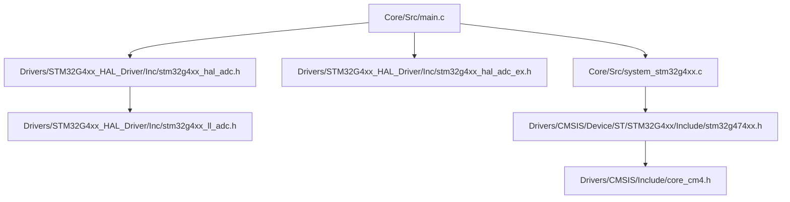
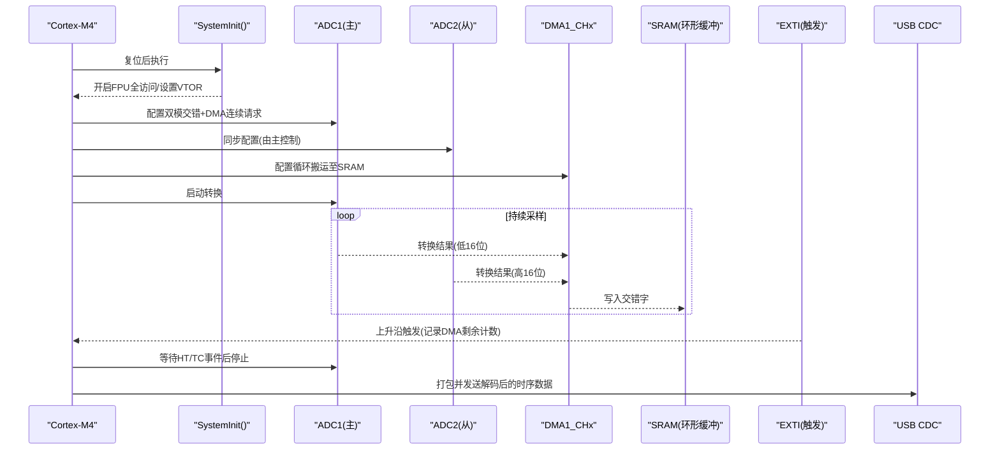
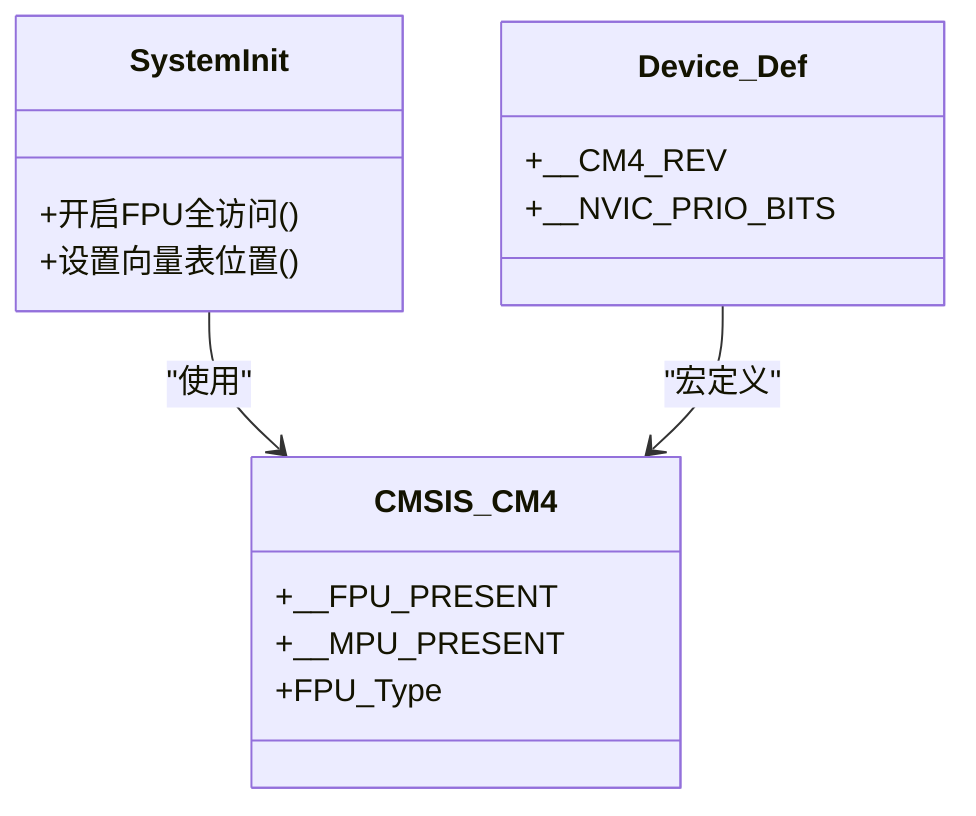
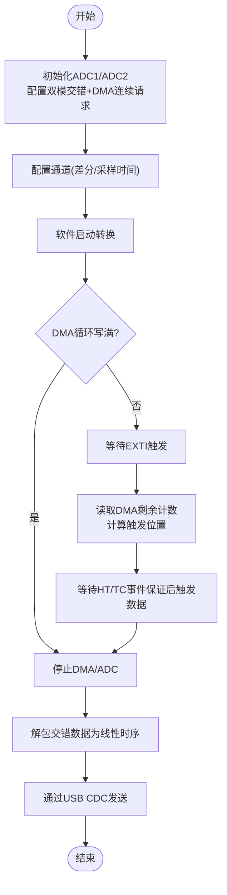
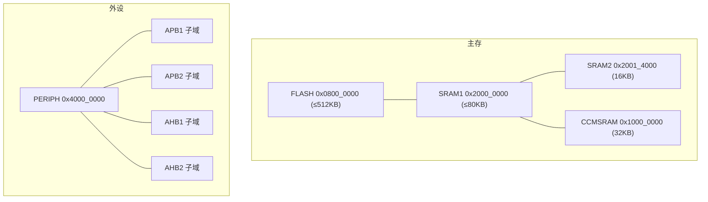
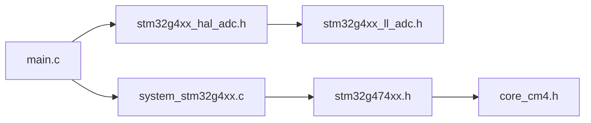

# 微控制器概述

<cite>
**本文引用的文件**
- [system_stm32g4xx.c](file://Core/Src/system_stm32g4xx.c)
- [stm32g474xx.h](file://Drivers/CMSIS/Device/ST/STM32G4xx/Include/stm32g474xx.h)
- [core_cm4.h](file://Drivers/CMSIS/Include/core_cm4.h)
- [stm32g4xx_hal_adc.h](file://Drivers/STM32G4xx_HAL_Driver/Inc/stm32g4xx_hal_adc.h)
- [stm32g4xx_hal_adc_ex.h](file://Drivers/STM32G4xx_HAL_Driver/Inc/stm32g4xx_hal_adc_ex.h)
- [stm32g4xx_ll_adc.h](file://Drivers/STM32G4xx_HAL_Driver/Inc/stm32g4xx_ll_adc.h)
- [main.c](file://Core/Src/main.c)
- [G4test.ioc](file://G4test.ioc)
</cite>

## 目录
1. [简介](#简介)
2. [项目结构](#项目结构)
3. [核心组件](#核心组件)
4. [架构总览](#架构总览)
5. [详细组件分析](#详细组件分析)
6. [依赖关系分析](#依赖关系分析)
7. [性能考量](#性能考量)
8. [故障排查指南](#故障排查指南)
9. [结论](#结论)
10. [附录](#附录)

## 简介
本文件面向使用 STM32G474 的开发者，提供从内核到外设、从存储器到时钟与 ADC 高性能特性的系统化概览。重点包括：
- Cortex-M4 内核特性（FPU、DSP、MPU）在 G474 上的启用与访问方式
- 高性能 ADC 交错模式实现 8 MSPS 的技术原理与工程实践
- 存储器架构（Flash、SRAM、CCMSRAM）分布与访问特性
- 引脚复用与关键外设资源清单
- 芯片架构图与选型要点

## 项目结构
本项目基于 STM32CubeMX 生成，采用分层组织：
- Core：系统初始化、中断向量表、主程序入口
- Drivers：CMSIS 设备头文件与 HAL/LL 驱动
- Middlewares：USB 设备库（CDC）
- 顶层构建脚本与链接脚本

**图表来源**
- [main.c:1-200](file://Core/Src/main.c#L1-L200)
- [system_stm32g4xx.c:180-192](file://Core/Src/system_stm32g4xx.c#L180-L192)
- [stm32g474xx.h:1130-1160](file://Drivers/CMSIS/Device/ST/STM32G4xx/Include/stm32g474xx.h#L1130-L1160)
- [core_cm4.h:1300-1321](file://Drivers/CMSIS/Include/core_cm4.h#L1300-L1321)

**章节来源**
- [main.c:1-200](file://Core/Src/main.c#L1-L200)
- [system_stm32g4xx.c:180-192](file://Core/Src/system_stm32g4xx.c#L180-L192)

## 核心组件
- 内核与系统初始化
  - Cortex-M4 内核，带 FPU 与 MPU；系统启动时开启 FPU 全访问权限，并支持重映射向量表位置
- ADC 子系统
  - 多 ADC 双通道交错模式（Interleaved），DMA 循环搬运，EXTI 触发捕获时间戳，实现高吞吐采样
- DMA 与中断
  - DMA 半传输/完成中断用于后触发数据收集与停止采集
- USB CDC 通信
  - 通过 USB CDC 将解码后的时序数据以文本形式输出

**章节来源**
- [system_stm32g4xx.c:180-192](file://Core/Src/system_stm32g4xx.c#L180-L192)
- [main.c:86-149](file://Core/Src/main.c#L86-L149)
- [stm32g4xx_hal_adc.h:90-200](file://Drivers/STM32G4xx_HAL_Driver/Inc/stm32g4xx_hal_adc.h#L90-L200)

## 架构总览
下图展示从内核到外设的数据与控制流，以及关键配置点。

**图表来源**
- [system_stm32g4xx.c:180-192](file://Core/Src/system_stm32g4xx.c#L180-L192)
- [main.c:371-406](file://Core/Src/main.c#L371-L406)
- [main.c:86-149](file://Core/Src/main.c#L86-L149)

## 详细组件分析

### Cortex-M4 内核特性（FPU/DSP/MPU）
- FPU 启用
  - 启动阶段通过 SCB->CPACR 开启 CP10/CP11 的全访问权限，确保浮点运算可用
- DSP 指令集
  - Cortex-M4 原生支持 DSP 扩展（SIMD 等），编译器按目标特性生成相应指令
- MPU
  - 设备定义中声明存在 MPU，可用于内存区域保护与缓存策略配置

**图表来源**
- [system_stm32g4xx.c:180-192](file://Core/Src/system_stm32g4xx.c#L180-L192)
- [core_cm4.h:1300-1321](file://Drivers/CMSIS/Include/core_cm4.h#L1300-L1321)
- [stm32g474xx.h:47-52](file://Drivers/CMSIS/Device/ST/STM32G4xx/Include/stm32g474xx.h#L47-L52)

**章节来源**
- [system_stm32g4xx.c:180-192](file://Core/Src/system_stm32g4xx.c#L180-L192)
- [core_cm4.h:1300-1321](file://Drivers/CMSIS/Include/core_cm4.h#L1300-L1321)
- [stm32g474xx.h:47-52](file://Drivers/CMSIS/Device/ST/STM32G4xx/Include/stm32g474xx.h#L47-L52)

### 高性能 ADC 与 8 MSPS 交错模式
- 技术原理
  - 双 ADC 同时工作于“交错模式”（Interleaved），每个 ADC 负责偶/奇样本，合成双倍采样率
  - 通过 DMA 循环模式将 32 位字（低16位=ADC1，高16位=ADC2）直接搬入 SRAM，避免 CPU 瓶颈
  - 外部 EXTI 边沿触发作为时间基准，读取 DMA 剩余计数确定触发时刻索引，从而重建前后触发的完整波形
- 关键配置
  - 双模模式选择为交错模式，DMA 访问宽度为 12/10 位组合
  - 两个采样延迟可调，结合最小采样周期可实现接近理论上限的吞吐
  - 通道配置为差分输入，减少共模噪声，提升动态范围
- 工程流程

**图表来源**
- [main.c:371-406](file://Core/Src/main.c#L371-L406)
- [main.c:86-149](file://Core/Src/main.c#L86-L149)
- [stm32g4xx_hal_adc_ex.h:446-457](file://Drivers/STM32G4xx_HAL_Driver/Inc/stm32g4xx_hal_adc_ex.h#L446-L457)
- [stm32g4xx_ll_adc.h:2319-2335](file://Drivers/STM32G4xx_HAL_Driver/Inc/stm32g4xx_ll_adc.h#L2319-L2335)

**章节来源**
- [main.c:371-406](file://Core/Src/main.c#L371-L406)
- [main.c:86-149](file://Core/Src/main.c#L86-L149)
- [stm32g4xx_hal_adc.h:90-200](file://Drivers/STM32G4xx_HAL_Driver/Inc/stm32g4xx_hal_adc.h#L90-L200)
- [stm32g4xx_hal_adc_ex.h:446-457](file://Drivers/STM32G4xx_HAL_Driver/Inc/stm32g4xx_hal_adc_ex.h#L446-L457)
- [stm32g4xx_ll_adc.h:2319-2335](file://Drivers/STM32G4xx_HAL_Driver/Inc/stm32g4xx_ll_adc.h#L2319-L2335)
- [G4test.ioc:1-20](file://G4test.ioc#L1-L20)

### 存储器架构与访问特性
- Flash
  - 基地址 0x0800_0000，最大容量可达 512 KB（具体取决于器件型号）
- SRAM
  - SRAM1 基地址 0x2000_0000，最大 80 KB
  - SRAM2 基地址 0x2001_4000，大小 16 KB
- CCMSRAM
  - 基地址 0x1000_0000，大小 32 KB，常用于 DMA/外设零拷贝或高速路径
- 外设寄存器空间
  - PERIPH_BASE 0x4000_0000，APB1/APB2/AHB1/AHB2 子域划分清晰
- 位带区
  - SRAM1/2 与外设均提供位带映射，便于原子操作

**图表来源**
- [stm32g474xx.h:1130-1160](file://Drivers/CMSIS/Device/ST/STM32G4xx/Include/stm32g474xx.h#L1130-L1160)
- [stm32g474xx.h:1150-1160](file://Drivers/CMSIS/Device/ST/STM32G4xx/Include/stm32g474xx.h#L1150-L1160)
- [stm32g474xx.h:1154-1160](file://Drivers/CMSIS/Device/ST/STM32G4xx/Include/stm32g474xx.h#L1154-L1160)

**章节来源**
- [stm32g474xx.h:1130-1160](file://Drivers/CMSIS/Device/ST/STM32G4xx/Include/stm32g474xx.h#L1130-L1160)
- [stm32g474xx.h:1150-1160](file://Drivers/CMSIS/Device/ST/STM32G4xx/Include/stm32g474xx.h#L1150-L1160)

### 引脚分配与关键外设资源
- GPIO 端口
  - A~G 端口位于 AHB2 外设基址之上，支持多种复用功能（AF0~AF15）
- 常用外设基址（节选）
  - TIM2/TIM3/TIM4/TIM5（APB1）
  - SPI1/SPI2/SPI3/SPI4（APB2/APB1）
  - USART1/USART2/USART3/UART4/UART5/LPUART1（APB2/APB1）
  - I2C1/I2C2/I2C3/I2C4（APB1）
  - USB、FDCAN1/2/3、SAI1、HRTIM1、DAC1~4、ADC1~5、RNG、CRC、DMA1/2、DMAMUX1、RCC、FLASH_R
- 示例：PC13 用于 LED 控制（项目中使用 BSRR/ODR 进行快速翻转）

**章节来源**
- [stm32g474xx.h:1241-1329](file://Drivers/CMSIS/Device/ST/STM32G4xx/Include/stm32g474xx.h#L1241-L1329)
- [stm32g4xx_hal_gpio_ex.h:276-293](file://Drivers/STM32G4xx_HAL_Driver/Inc/stm32g4xx_hal_gpio_ex.h#L276-L293)
- [main.c:41-45](file://Core/Src/main.c#L41-L45)

## 依赖关系分析
- 应用层 main.c 依赖 HAL ADC 接口与 LL 底层定义
- system_stm32g4xx.c 依赖设备头文件与 CMSIS 内核定义
- 设备头文件 stm32g474xx.h 包含所有外设基址、中断号与内核特性宏
- core_cm4.h 提供 FPU/MPU 类型与访问接口

**图表来源**
- [main.c:1-200](file://Core/Src/main.c#L1-L200)
- [system_stm32g4xx.c:180-192](file://Core/Src/system_stm32g4xx.c#L180-L192)
- [stm32g474xx.h:1130-1160](file://Drivers/CMSIS/Device/ST/STM32G4xx/Include/stm32g474xx.h#L1130-L1160)
- [core_cm4.h:1300-1321](file://Drivers/CMSIS/Include/core_cm4.h#L1300-L1321)

**章节来源**
- [main.c:1-200](file://Core/Src/main.c#L1-L200)
- [system_stm32g4xx.c:180-192](file://Core/Src/system_stm32g4xx.c#L180-L192)

## 性能考量
- 时钟与总线
  - 系统时钟可通过 HSE/HSI 经 PLL 倍频，AHB/APB 分频需满足外设频率限制（如 ADC 对 AHB/PCLK 的比例约束）
- ADC 吞吐
  - 交错模式下，两路 ADC 并行采样，DMA 循环搬运可最大化带宽利用；合理设置采样时间与两采样延迟可降低每通道转换时间
- 中断与实时性
  - EXTI 仅做轻量级时间戳捕获，数据处理放在主循环，避免 ISR 过长影响实时性
- 内存布局
  - 将环形缓冲置于 SRAM1/CCMSRAM，有利于 DMA 直写与后续处理的高速访问

[本节为通用指导，不直接分析具体文件]

## 故障排查指南
- 无浮点异常但运行缓慢
  - 检查是否已在启动阶段开启 FPU 全访问
- ADC 数据错乱或丢样
  - 确认 DMA 循环模式与双模交错配置一致；检查 DMA 剩余计数边界保护逻辑
- 触发时间不准
  - 确保 EXTI 回调中仅记录 DMA 剩余计数，避免复杂操作；确认 HT/TC 事件计数达到阈值后再停止
- USB CDC 无法输出
  - 检查串口忙标志与发送缓冲区长度，避免在发送期间响应 EXTI

**章节来源**
- [system_stm32g4xx.c:180-192](file://Core/Src/system_stm32g4xx.c#L180-L192)
- [main.c:86-149](file://Core/Src/main.c#L86-L149)

## 结论
STM32G474 基于 Cortex-M4，具备 FPU、DSP 与 MPU，配合双 ADC 交错模式与 DMA 循环搬运，可在应用中高效实现 8 MSPS 级别的高吞吐采样。其清晰的存储器分区与丰富的外设资源，使其在信号采集、电机控制与音频/超声等场景中具备良好性价比与可扩展性。

[本节为总结性内容，不直接分析具体文件]

## 附录
- 典型配置参考
  - 双模交错模式、DMA 访问模式、采样延迟、通道差分配置等均可在 CubeMX 工程中查看与调整
- 相关源码片段路径
  - 系统初始化与 FPU 开启：[system_stm32g4xx.c:180-192](file://Core/Src/system_stm32g4xx.c#L180-L192)
  - ADC 双模交错与通道配置：[main.c:371-406](file://Core/Src/main.c#L371-L406)
  - EXTI 触发与 DMA 回调：[main.c:86-149](file://Core/Src/main.c#L86-L149)
  - 设备基址与中断号定义：[stm32g474xx.h:1130-1329](file://Drivers/CMSIS/Device/ST/STM32G4xx/Include/stm32g474xx.h#L1130-L1329)
  - FPU 类型与寄存器：[core_cm4.h:1300-1321](file://Drivers/CMSIS/Include/core_cm4.h#L1300-L1321)