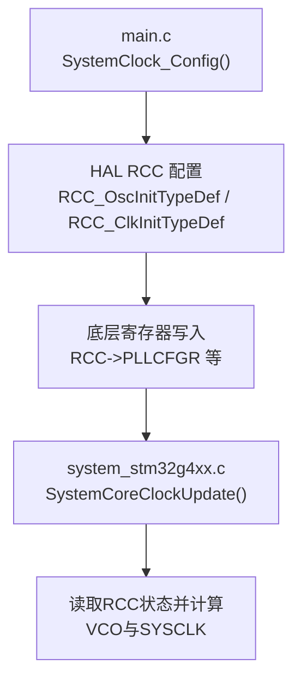
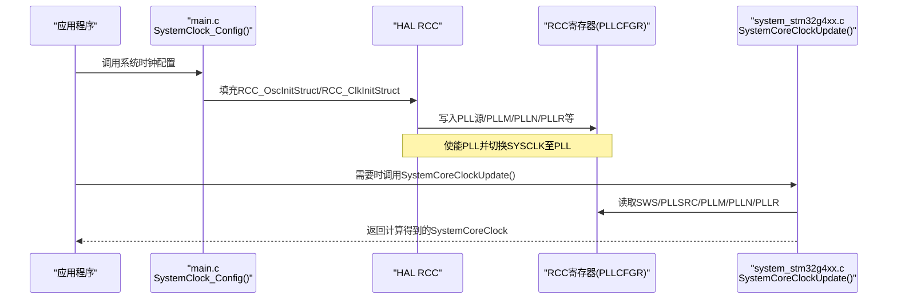
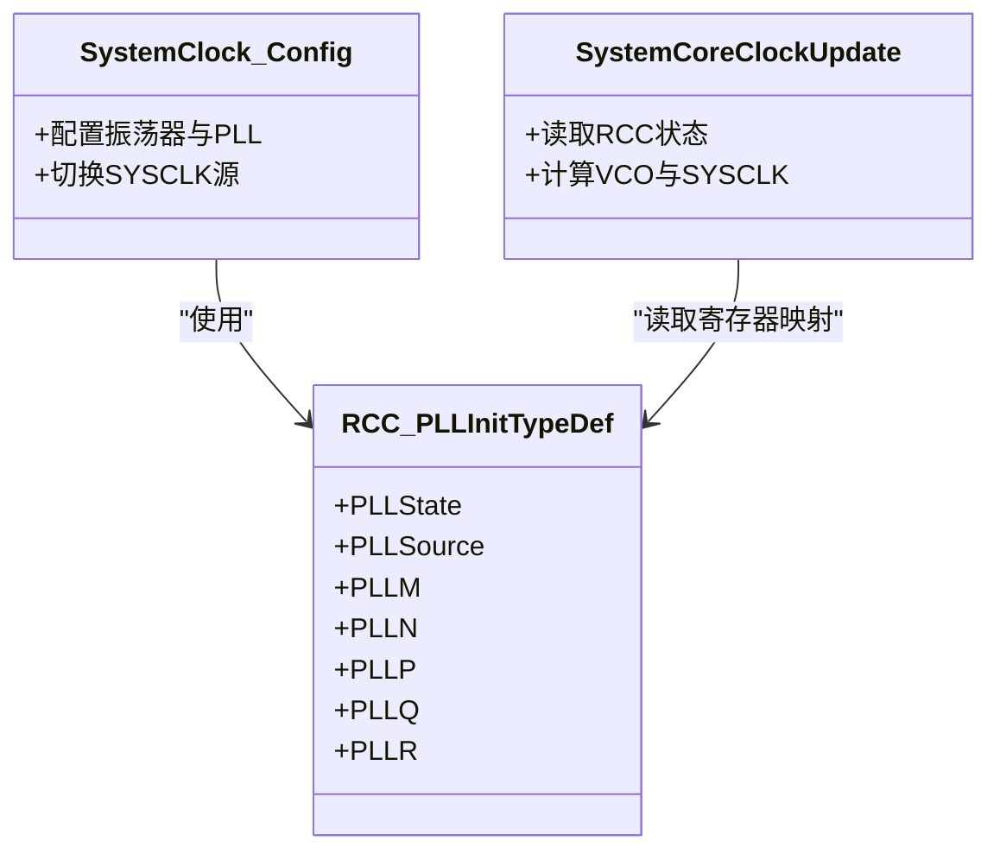
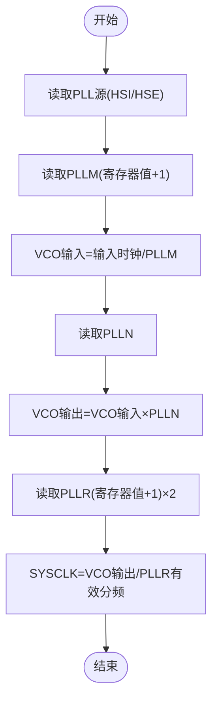

# PLL锁相环配置

<cite>
**本文引用的文件**
- [Core/Src/system_stm32g4xx.c](file://Core/Src/system_stm32g4xx.c)
- [Core/Src/main.c](file://Core/Src/main.c)
- [Drivers/STM32G4xx_HAL_Driver/Inc/stm32g4xx_hal_rcc.h](file://Drivers/STM32G4xx_HAL_Driver/Inc/stm32g4xx_hal_rcc.h)
- [Drivers/STM32G4xx_LL_Driver/Inc/stm32g4xx_ll_rcc.h](file://Drivers/STM32G4xx_LL_Driver/Inc/stm32g4xx_ll_rcc.h)
</cite>

## 目录
1. [简介](#简介)
2. [项目结构](#项目结构)
3. [核心组件](#核心组件)
4. [架构总览](#架构总览)
5. [详细组件分析](#详细组件分析)
6. [依赖关系分析](#依赖关系分析)
7. [性能与约束](#性能与约束)
8. [故障排查指南](#故障排查指南)
9. [结论](#结论)
10. [附录：PLL参数计算示例与时序](#附录pll参数计算示例与时序)

## 简介
本文面向STM32G474的PLL（锁相环）系统时钟配置，结合工程源码深入解释：
- 当前工程中PLL相关参数的来源、含义与取值范围
- VCO频率与SYSCLK的计算公式及推导过程
- 不同目标主频下的参数选择方法与示例
- 配置时序与关键注意事项

说明：本仓库中实际应用的PLL参数为PLLM=1、PLLN=15、PLLR=4（由应用层配置），并非问题描述中的“PLLM=1, PLLN=16, PLLR=2”。下文将分别给出“当前工程配置”和“假设配置PLLM=1, PLLN=16, PLLR=2”的计算结果与对比。

## 项目结构
与PLL相关的代码主要位于以下位置：
- 系统初始化与频率更新：Core/Src/system_stm32g4xx.c
- 用户侧系统时钟配置入口：Core/Src/main.c 中的 SystemClock_Config()
- HAL/LL驱动宏与常量定义：Drivers/STM32G4xx_HAL_Driver/Inc/stm32g4xx_hal_rcc.h 与 stm32g4xx_ll_rcc.h

图表来源
- [Core/Src/main.c:296-337](file://Core/Src/main.c#L296-L337)
- [Core/Src/system_stm32g4xx.c:230-272](file://Core/Src/system_stm32g4xx.c#L230-L272)
- [Drivers/STM32G4xx_HAL_Driver/Inc/stm32g4xx_hal_rcc.h:45-69](file://Drivers/STM32G4xx_HAL_Driver/Inc/stm32g4xx_hal_rcc.h#L45-L69)

章节来源
- [Core/Src/main.c:296-337](file://Core/Src/main.c#L296-L337)
- [Core/Src/system_stm32g4xx.c:230-272](file://Core/Src/system_stm32g4xx.c#L230-L272)
- [Drivers/STM32G4xx_HAL_Driver/Inc/stm32g4xx_hal_rcc.h:45-69](file://Drivers/STM32G4xx_HAL_Driver/Inc/stm32g4xx_hal_rcc.h#L45-L69)

## 核心组件
- 系统时钟配置结构体与宏定义
  - RCC_PLLInitTypeDef：包含PLLState、PLLSource、PLLM、PLLN、PLLP、PLLQ、PLLR等字段
  - RCC_PLLM/RCC_PLLP/RCC_PLLQ/RCC_PLLR 分频器枚举值
  - __LL_RCC_CALC_PLLCLK_FREQ 宏用于根据输入频率与分/乘系数计算输出频率
- 运行时频率计算
  - system_stm32g4xx.c 中的 SystemCoreClockUpdate() 依据RCC寄存器状态计算VCO与SYSCLK

章节来源
- [Drivers/STM32G4xx_HAL_Driver/Inc/stm32g4xx_hal_rcc.h:45-69](file://Drivers/STM32G4xx_HAL_Driver/Inc/stm32g4xx_hal_rcc.h#L45-L69)
- [Drivers/STM32G4xx_LL_Driver/Inc/stm32g4xx_ll_rcc.h:729-760](file://Drivers/STM32G4xx_LL_Driver/Inc/stm32g4xx_ll_rcc.h#L729-L760)
- [Core/Src/system_stm32g4xx.c:230-272](file://Core/Src/system_stm32g4xx.c#L230-L272)

## 架构总览
从应用到硬件的调用链如下：
- main.c 的 SystemClock_Config() 设置振荡器与PLL参数，并将PLL作为SYSCLK源
- HAL库函数将参数写入RCC寄存器（如RCC->PLLCFGR）
- 启动后或运行期通过 SystemCoreClockUpdate() 读取寄存器并计算实际频率

图表来源
- [Core/Src/main.c:296-337](file://Core/Src/main.c#L296-L337)
- [Core/Src/system_stm32g4xx.c:230-272](file://Core/Src/system_stm32g4xx.c#L230-L272)

## 详细组件分析

### 1) 当前工程的PLL配置与计算
- 时钟源：HSI（默认16 MHz）
- 配置项（来自 SystemClock_Config）：
  - PLLSource = HSI
  - PLLM = 1（RCC_PLLM_DIV1）
  - PLLN = 15
  - PLLR = 4（RCC_PLLR_DIV4）
- 计算公式（与系统实现一致）：
  - PLL_VCO = (HSI_VALUE / PLLM) × PLLN
  - SYSCLK = PLL_VCO / PLLR
- 代入数值：
  - HSI_VALUE = 16 MHz
  - PLL_VCO = (16 MHz / 1) × 15 = 240 MHz
  - SYSCLK = 240 MHz / 4 = 60 MHz

注意：该工程注释块中列出的“PLLM=1, PLLN=16, PLLR=2”与实际代码不一致；以代码为准，实际为PLLM=1, PLLN=15, PLLR=4，得到SYSCLK=60 MHz。

章节来源
- [Core/Src/main.c:296-337](file://Core/Src/main.c#L296-L337)
- [Core/Src/system_stm32g4xx.c:230-272](file://Core/Src/system_stm32g4xx.c#L230-L272)

### 2) 假设配置：PLLM=1, PLLN=16, PLLR=2 的计算
若按问题描述的配置进行计算（仅做理论演示）：
- HSI_VALUE = 16 MHz
- PLL_VCO = (16 MHz / 1) × 16 = 256 MHz
- SYSCLK = 256 MHz / 2 = 128 MHz

验证约束：
- VCO输出范围需满足器件手册限制（见“性能与约束”一节）
- SYSCLK不得超过最大允许的系统时钟频率

章节来源
- [Core/Src/system_stm32g4xx.c:230-272](file://Core/Src/system_stm32g4xx.c#L230-L272)

### 3) 公式推导与实现细节
- 在 SystemCoreClockUpdate() 中，当SYSCLK源为PLL时：
  - 读取PLL源（HSI/HSE）
  - 读取PLLM（寄存器位域+1）
  - 计算VCO输入频率 = 输入时钟 / PLLM
  - 乘以PLLN得到VCO输出频率
  - 读取PLLR（寄存器位域+1）×2 得到最终分频比
  - SYSCLK = VCO / (PLLR有效分频)
- 这与文档注释中的公式完全一致：
  - PLL_VCO = (HSE_VALUE或HSI_VALUE / PLLM) × PLLN
  - SYSCLK = PLL_VCO / PLLR

章节来源
- [Core/Src/system_stm32g4xx.c:230-272](file://Core/Src/system_stm32g4xx.c#L230-L272)

### 4) 参数取值范围与约束条件
- PLLM（VCO输入分频）
  - 可选值：1~16（RCC_PLLM_DIV1 ~ RCC_PLLM_DIV16）
  - 约束：确保VCO输入频率在2.66~8 MHz范围内；推荐8 MHz以降低抖动
- PLLN（VCO倍频）
  - 取值范围：8~127
  - 约束：确保VCO输出频率在64~344 MHz范围内
- PLLR（SYSCLK输出分频）
  - 可选值：2、4、6、8（RCC_PLLR_DIV2/4/6/8）
  - 约束：SYSCLK不得超过芯片最大允许频率（例如170 MHz）
- 其他输出分频（PLLP、PLLQ）用于ADC、48MHz域等，不在SYSCLK路径上

章节来源
- [Drivers/STM32G4xx_HAL_Driver/Inc/stm32g4xx_hal_rcc.h:212-231](file://Drivers/STM32G4xx_HAL_Driver/Inc/stm32g4xx_hal_rcc.h#L212-L231)
- [Drivers/STM32G4xx_HAL_Driver/Inc/stm32g4xx_hal_rcc.h:283-292](file://Drivers/STM32G4xx_HAL_Driver/Inc/stm32g4xx_hal_rcc.h#L283-L292)
- [Drivers/STM32G4xx_HAL_Driver/Inc/stm32g4xx_hal_rcc.h:2981-3004](file://Drivers/STM32G4xx_HAL_Driver/Inc/stm32g4xx_hal_rcc.h#L2981-L3004)
- [Drivers/STM32G4xx_LL_Driver/Inc/stm32g4xx_ll_rcc.h:729-760](file://Drivers/STM32G4xx_LL_Driver/Inc/stm32g4xx_ll_rcc.h#L729-L760)

## 依赖关系分析
- main.c 的 SystemClock_Config() 依赖 HAL RCC 类型与宏定义
- HAL/LL 宏提供频率计算辅助与寄存器位域操作
- system_stm32g4xx.c 的 SystemCoreClockUpdate() 直接访问RCC寄存器，是运行时频率计算的权威来源

图表来源
- [Drivers/STM32G4xx_HAL_Driver/Inc/stm32g4xx_hal_rcc.h:45-69](file://Drivers/STM32G4xx_HAL_Driver/Inc/stm32g4xx_hal_rcc.h#L45-L69)
- [Core/Src/main.c:296-337](file://Core/Src/main.c#L296-L337)
- [Core/Src/system_stm32g4xx.c:230-272](file://Core/Src/system_stm32g4xx.c#L230-L272)

## 性能与约束
- VCO输入频率范围：2.66~8 MHz（建议8 MHz以降低抖动）
- VCO输出频率范围：64~344 MHz
- SYSCLK最大值：不超过芯片规格（例如170 MHz）
- 分频器选项：
  - PLLM：1~16
  - PLLN：8~127
  - PLLR：2/4/6/8
- Flash等待周期：随SYSCLK提升需相应调整（工程中使用FLASH_LATENCY_1）

章节来源
- [Drivers/STM32G4xx_HAL_Driver/Inc/stm32g4xx_hal_rcc.h:2981-3004](file://Drivers/STM32G4xx_HAL_Driver/Inc/stm32g4xx_hal_rcc.h#L2981-L3004)
- [Core/Src/main.c:333-336](file://Core/Src/main.c#L333-L336)

## 故障排查指南
- 现象：系统无法启动或频繁复位
  - 检查是否超过最大SYSCLK或VCO范围
  - 确认Flash等待周期与目标频率匹配
- 现象：USB/ADC等外设工作异常
  - 核对PLLQ/PLLP输出是否符合外设要求
- 现象：频率计算不符预期
  - 确认HSE_VALUE/HSI_VALUE定义与实际晶振一致
  - 检查RCC->PLLCFGR寄存器位域是否正确写入

章节来源
- [Core/Src/system_stm32g4xx.c:230-272](file://Core/Src/system_stm32g4xx.c#L230-L272)
- [Core/Src/main.c:333-336](file://Core/Src/main.c#L333-L336)

## 结论
- 本工程的PLL配置采用HSI作为PLL源，PLLM=1、PLLN=15、PLLR=4，得到SYSCLK=60 MHz
- 若按问题描述的PLLM=1、PLLN=16、PLLR=2，则SYSCLK=128 MHz，但仍需校验VCO与SYSCLK是否在允许范围内
- 所有计算均以SystemCoreClockUpdate()的实现为准，遵循VCO输入/输出范围与SYSCLK上限约束

## 附录：PLL参数计算示例与时序

### 计算流程图

图表来源
- [Core/Src/system_stm32g4xx.c:230-272](file://Core/Src/system_stm32g4xx.c#L230-L272)

### 频率计算表（基于HSI=16 MHz）
- 当前工程配置（PLLM=1, PLLN=15, PLLR=4）
  - VCO = 16 MHz × 15 = 240 MHz
  - SYSCLK = 240 MHz / 4 = 60 MHz
- 假设配置（PLLM=1, PLLN=16, PLLR=2）
  - VCO = 16 MHz × 16 = 256 MHz
  - SYSCLK = 256 MHz / 2 = 128 MHz

### 不同目标频率的参数选择示例（HSI=16 MHz）
- 目标SYSCLK=80 MHz
  - 取PLLR=4 → VCO需为320 MHz（超出VCO上限344 MHz？不超，但接近上限；需评估功耗与稳定性）
  - 取PLLM=1 → PLLN=20 → VCO=320 MHz → SYSCLK=320/4=80 MHz
- 目标SYSCLK=100 MHz
  - 取PLLR=4 → VCO需为400 MHz（超出VCO上限344 MHz，不可行）
  - 改用PLLR=2 → VCO需为200 MHz → PLLM=1 → PLLN=12.5（非整数，不可行）
  - 可尝试PLLM=2 → VCO输入=8 MHz → PLLN=25 → VCO=200 MHz → PLLR=2 → SYSCLK=100 MHz（可行）
- 目标SYSCLK=120 MHz
  - 取PLLR=2 → VCO需为240 MHz → PLLM=1 → PLLN=15 → SYSCLK=240/2=120 MHz（可行）

注：以上示例仅用于演示计算方法，实际设计需同时考虑VCO输入/输出范围、SYSCLK上限、功耗与EMC要求。

章节来源
- [Core/Src/system_stm32g4xx.c:230-272](file://Core/Src/system_stm32g4xx.c#L230-L272)
- [Drivers/STM32G4xx_LL_Driver/Inc/stm32g4xx_ll_rcc.h:729-760](file://Drivers/STM32G4xx_LL_Driver/Inc/stm32g4xx_ll_rcc.h#L729-L760)