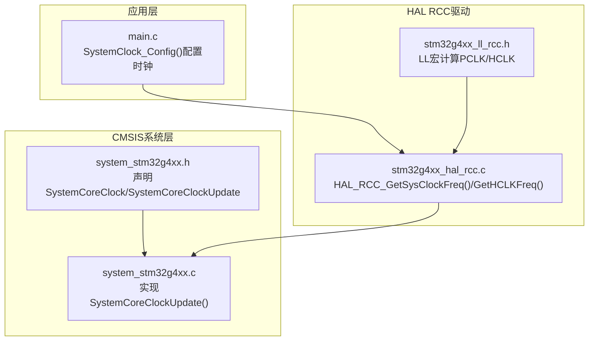
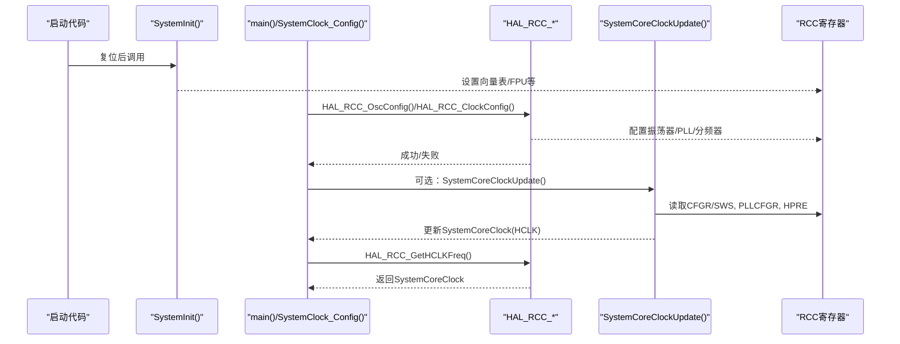
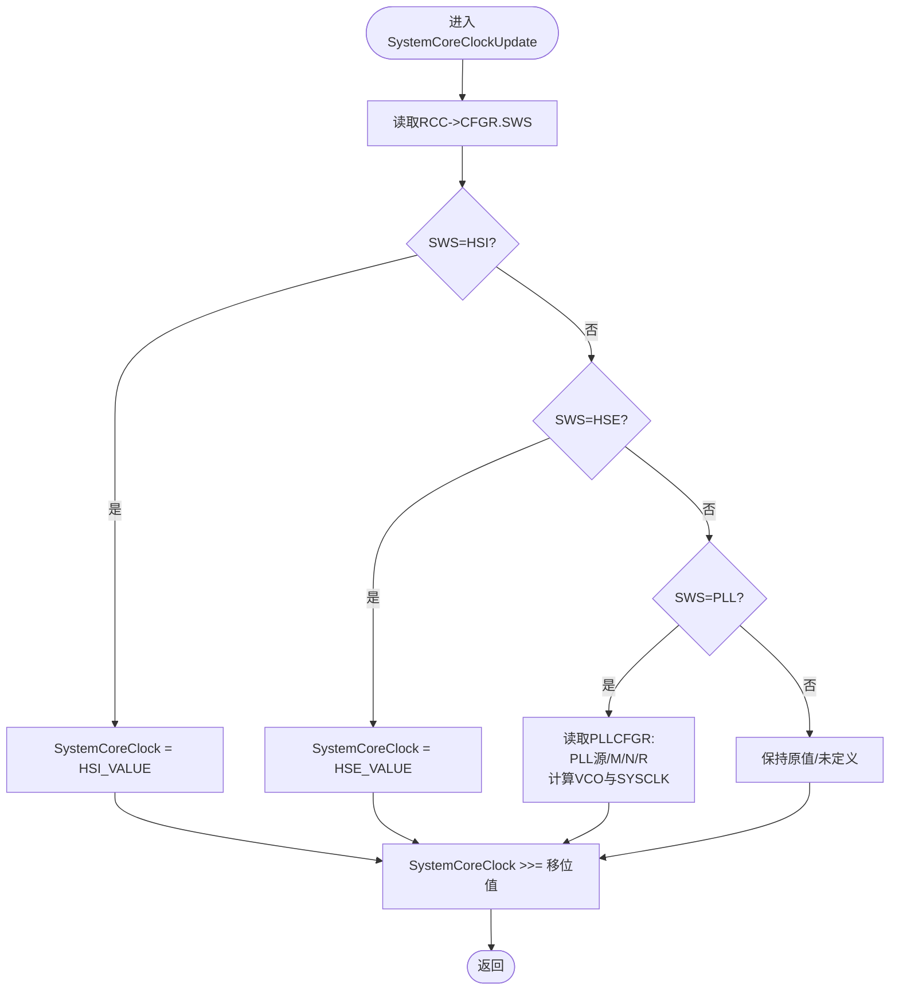
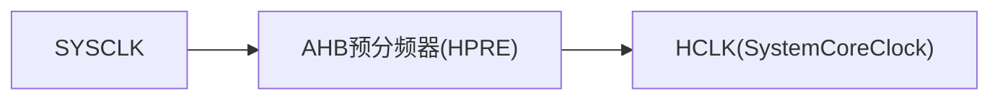
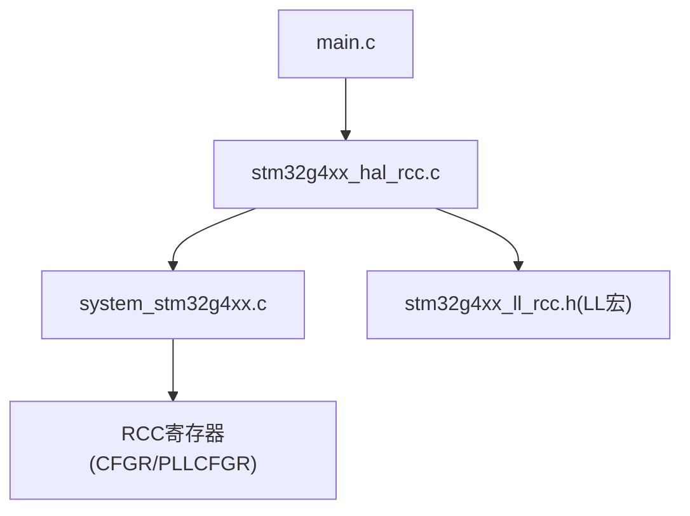

# SystemCoreClock管理

<cite>
**本文引用的文件**   
- [system_stm32g4xx.c](file://Core/Src/system_stm32g4xx.c)
- [system_stm32g4xx.h](file://Drivers/CMSIS/Device/ST/STM32G4xx/Include/system_stm32g4xx.h)
- [stm32g4xx_hal_rcc.c](file://Drivers/STM32G4xx_HAL_Driver/Src/stm32g4xx_hal_rcc.c)
- [stm32g4xx_ll_rcc.h](file://Drivers/STM32G4xx_HAL_Driver/Inc/stm32g4xx_ll_rcc.h)
- [main.c](file://Core/Src/main.c)
</cite>

## 目录
1. [简介](#简介)
2. [项目结构](#项目结构)
3. [核心组件](#核心组件)
4. [架构总览](#架构总览)
5. [详细组件分析](#详细组件分析)
6. [依赖关系分析](#依赖关系分析)
7. [性能与注意事项](#性能与注意事项)
8. [故障排查指南](#故障排查指南)
9. [结论](#结论)

## 简介
本文件聚焦于STM32G4工程中SystemCoreClock变量的作用与管理机制，重点解析SystemCoreClockUpdate()如何依据RCC寄存器状态自动更新核心时钟频率，并对比HSI、HSE、PLL三种时钟源下的计算差异；同时说明AHB预分频器对SystemCoreClock的影响，给出正确的使用方式、常见错误处理策略与时钟更新流程图。

## 项目结构
与SystemCoreClock直接相关的代码主要位于：
- CMSIS系统层：定义SystemCoreClock变量及更新函数接口
- HAL RCC驱动：提供读取系统时钟频率的API，内部复用SystemCoreClock或独立计算
- 用户工程：通过HAL配置系统时钟（如PLL），并在必要时调用更新函数

图示来源
- [system_stm32g4xx.h:46-87](file://Drivers/CMSIS/Device/ST/STM32G4xx/Include/system_stm32g4xx.h#L46-L87)
- [system_stm32g4xx.c:146-272](file://Core/Src/system_stm32g4xx.c#L146-L272)
- [stm32g4xx_hal_rcc.c:1063-1145](file://Drivers/STM32G4xx_HAL_Driver/Src/stm32g4xx_hal_rcc.c#L1063-L1145)
- [stm32g4xx_ll_rcc.h:869-895](file://Drivers/STM32G4xx_HAL_Driver/Inc/stm32g4xx_ll_rcc.h#L869-L895)
- [main.c:296-337](file://Core/Src/main.c#L296-L337)

章节来源
- [system_stm32g4xx.h:46-87](file://Drivers/CMSIS/Device/ST/STM32G4xx/Include/system_stm32g4xx.h#L46-L87)
- [system_stm32g4xx.c:146-272](file://Core/Src/system_stm32g4xx.c#L146-L272)
- [stm32g4xx_hal_rcc.c:1063-1145](file://Drivers/STM32G4xx_HAL_Driver/Src/stm32g4xx_hal_rcc.c#L1063-L1145)
- [stm32g4xx_ll_rcc.h:869-895](file://Drivers/STM32G4xx_HAL_Driver/Inc/stm32g4xx_ll_rcc.h#L869-L895)
- [main.c:296-337](file://Core/Src/main.c#L296-L337)

## 核心组件
- SystemCoreClock变量
  - 保存当前核心时钟（HCLK）频率，供SysTick等模块使用
  - 初始化默认值为HSI_VALUE
- AHB预分频表
  - 用于将SYSCLK按AHB分频得到HCLK，映射为右移位数
- SystemCoreClockUpdate()
  - 根据RCC->CFGR中的SWS位判断当前系统时钟源（HSI/HSE/PLL）
  - 若为PLL，则进一步读取PLLCFGR的PLL源、M/N/R参数计算VCO与输出
  - 最后根据AHB预分频器更新SystemCoreClock为HCLK频率
- HAL RCC相关API
  - HAL_RCC_GetSysClockFreq()：独立计算SYSCLK频率（不依赖SystemCoreClock）
  - HAL_RCC_GetHCLKFreq()：返回SystemCoreClock（即HCLK）
  - HAL_RCC_ClockConfig()：配置系统时钟后会自动更新SystemCoreClock

章节来源
- [system_stm32g4xx.c:146-157](file://Core/Src/system_stm32g4xx.c#L146-L157)
- [system_stm32g4xx.c:230-272](file://Core/Src/system_stm32g4xx.c#L230-L272)
- [stm32g4xx_hal_rcc.c:1063-1145](file://Drivers/STM32G4xx_HAL_Driver/Src/stm32g4xx_hal_rcc.c#L1063-L1145)

## 架构总览
下图展示SystemCoreClock在系统启动、运行时配置与查询时的整体交互关系。

图示来源
- [system_stm32g4xx.c:181-192](file://Core/Src/system_stm32g4xx.c#L181-L192)
- [main.c:296-337](file://Core/Src/main.c#L296-L337)
- [stm32g4xx_hal_rcc.c:1063-1145](file://Drivers/STM32G4xx_HAL_Driver/Src/stm32g4xx_hal_rcc.c#L1063-L1145)
- [system_stm32g4xx.c:230-272](file://Core/Src/system_stm32g4xx.c#L230-L272)

## 详细组件分析

### SystemCoreClock变量与更新时机
- 变量定义与默认值
  - 初始化为HSI_VALUE，表示复位后默认以HSI作为系统时钟源
- 更新时机
  - 手动调用SystemCoreClockUpdate()
  - 调用HAL_RCC_GetHCLKFreq()时返回SystemCoreClock（需确保已更新）
  - 调用HAL_RCC_ClockConfig()配置系统时钟后，内部会更新SystemCoreClock

章节来源
- [system_stm32g4xx.c:146-157](file://Core/Src/system_stm32g4xx.c#L146-L157)
- [stm32g4xx_hal_rcc.c:1118-1121](file://Drivers/STM32G4xx_HAL_Driver/Src/stm32g4xx_hal_rcc.c#L1118-L1121)

### SystemCoreClockUpdate()工作原理
该函数按以下步骤工作：
1. 读取RCC->CFGR中的SWS位，判断当前系统时钟源
   - HSI：直接使用HSI_VALUE
   - HSE：直接使用HSE_VALUE
   - PLL：进入PLL分支进行计算
2. PLL分支
   - 读取PLLCFGR的PLL源选择（HSI或HSE）
   - 计算PLLM = (PLLM字段+1)，用于分频输入时钟
   - 计算VCO = (输入时钟/PLLM)*PLLN
   - 计算PLLR = (PLLR字段+1)*2，用于SYSCLK输出分频
   - SYSCLK = VCO / PLLR
3. 应用AHB预分频器
   - 从CFGR的HPRE字段查表得到右移位数
   - SystemCoreClock = SYSCLK >> 右移位数（即HCLK）

图示来源
- [system_stm32g4xx.c:230-272](file://Core/Src/system_stm32g4xx.c#L230-L272)

章节来源
- [system_stm32g4xx.c:230-272](file://Core/Src/system_stm32g4xx.c#L230-L272)

### 不同时钟源的SystemCoreClock计算逻辑
- HSI模式
  - 直接采用HSI_VALUE作为SYSCLK，再经AHB分频得到HCLK
- HSE模式
  - 直接采用HSE_VALUE作为SYSCLK，再经AHB分频得到HCLK
- PLL模式
  - 先确定PLL输入源（HSI或HSE）
  - 计算VCO = (输入时钟/PLLM)*PLLN
  - 计算SYSCLK = VCO/PLLR
  - 再经AHB分频得到HCLK

注意：
- HSE_VALUE必须与实际外部晶振频率一致，否则计算结果不准确
- HSI_VALUE为标称值，实际可能随温度电压变化存在偏差

章节来源
- [system_stm32g4xx.c:230-272](file://Core/Src/system_stm32g4xx.c#L230-L272)

### AHB预分频器对SystemCoreClock的影响
- AHB预分频器由CFGR的HPRE字段控制
- 使用AHBPrescTable将HPRE编码映射为右移位数
- SystemCoreClock最终等于SYSCLK按AHB分频后的HCLK频率

图示来源
- [system_stm32g4xx.c:267-272](file://Core/Src/system_stm32g4xx.c#L267-L272)

章节来源
- [system_stm32g4xx.c:267-272](file://Core/Src/system_stm32g4xx.c#L267-L272)

### HAL RCC API与SystemCoreClock的关系
- HAL_RCC_GetSysClockFreq()
  - 独立读取RCC寄存器计算SYSCLK，不依赖SystemCoreClock
- HAL_RCC_GetHCLKFreq()
  - 直接返回SystemCoreClock（即HCLK）
- HAL_RCC_ClockConfig()
  - 配置系统时钟后，内部会更新SystemCoreClock，无需额外调用SystemCoreClockUpdate()

章节来源
- [stm32g4xx_hal_rcc.c:1063-1145](file://Drivers/STM32G4xx_HAL_Driver/Src/stm32g4xx_hal_rcc.c#L1063-L1145)

### 应用层时钟配置示例路径
- main.c中SystemClock_Config()通过HAL配置PLL与系统时钟源、AHB/APB分频器
- 配置成功后，SystemCoreClock会被HAL内部更新

章节来源
- [main.c:296-337](file://Core/Src/main.c#L296-L337)

## 依赖关系分析
- system_stm32g4xx.c依赖RCC外设寄存器（CFGR、PLLCFGR）
- stm32g4xx_hal_rcc.c提供高层API，部分函数复用SystemCoreClock，部分独立计算
- LL层宏提供便捷计算PCLK/HCLK频率的工具

图示来源
- [system_stm32g4xx.c:230-272](file://Core/Src/system_stm32g4xx.c#L230-L272)
- [stm32g4xx_hal_rcc.c:1063-1145](file://Drivers/STM32G4xx_HAL_Driver/Src/stm32g4xx_hal_rcc.c#L1063-L1145)
- [stm32g4xx_ll_rcc.h:869-895](file://Drivers/STM32G4xx_HAL_Driver/Inc/stm32g4xx_ll_rcc.h#L869-L895)
- [main.c:296-337](file://Core/Src/main.c#L296-L337)

章节来源
- [system_stm32g4xx.c:230-272](file://Core/Src/system_stm32g4xx.c#L230-L272)
- [stm32g4xx_hal_rcc.c:1063-1145](file://Drivers/STM32G4xx_HAL_Driver/Src/stm32g4xx_hal_rcc.c#L1063-L1145)
- [stm32g4xx_ll_rcc.h:869-895](file://Drivers/STM32G4xx_HAL_Driver/Inc/stm32g4xx_ll_rcc.h#L869-L895)
- [main.c:296-337](file://Core/Src/main.c#L296-L337)

## 性能与注意事项
- 精度问题
  - HSI_VALUE为标称值，实际频率受温度与电压影响，可能导致基于SystemCoreClock的定时误差
  - HSE_VALUE必须与实际晶振一致，否则PLL计算结果不正确
- 更新时机
  - 任何改变系统时钟源或分频器的操作后，应确保SystemCoreClock被正确更新
  - 使用HAL_RCC_ClockConfig()时无需手动调用SystemCoreClockUpdate()
- 中断与并发
  - SystemCoreClock为全局变量，在中断中修改时钟源后需在适当时机更新
- 功耗与延迟
  - 提高HCLK需调整Flash等待周期与电压范围，避免超频导致不稳定

[本节为通用指导，不直接分析具体文件]

## 故障排查指南
- 现象：定时器/串口波特率异常
  - 检查是否调用了SystemCoreClockUpdate()或在配置时钟后未等待更新完成
  - 确认HSE_VALUE与实际晶振一致
- 现象：PLL无法锁定或系统不稳定
  - 核对PLLM/N/R参数是否在允许范围内
  - 检查电压缩放与Flash等待周期是否与目标HCLK匹配
- 现象：HAL_RCC_GetHCLKFreq()返回值不符合预期
  - 确认最近一次时钟配置是否成功
  - 检查AHB预分频器设置是否正确

章节来源
- [system_stm32g4xx.c:230-272](file://Core/Src/system_stm32g4xx.c#L230-L272)
- [stm32g4xx_hal_rcc.c:1063-1145](file://Drivers/STM32G4xx_HAL_Driver/Src/stm32g4xx_hal_rcc.c#L1063-L1145)

## 结论
SystemCoreClock是STM32G4系统中用于表示核心时钟（HCLK）频率的关键变量。SystemCoreClockUpdate()通过读取RCC寄存器状态，结合HSI/HSE/PLL的不同计算路径以及AHB预分频器，准确更新SystemCoreClock。在实际工程中，建议优先使用HAL_RCC_ClockConfig()进行时钟配置，其内部会自动更新SystemCoreClock；如需动态切换时钟源，务必在切换完成后调用SystemCoreClockUpdate()，并确保HSE_VALUE与实际晶振一致，以避免系统性误差。