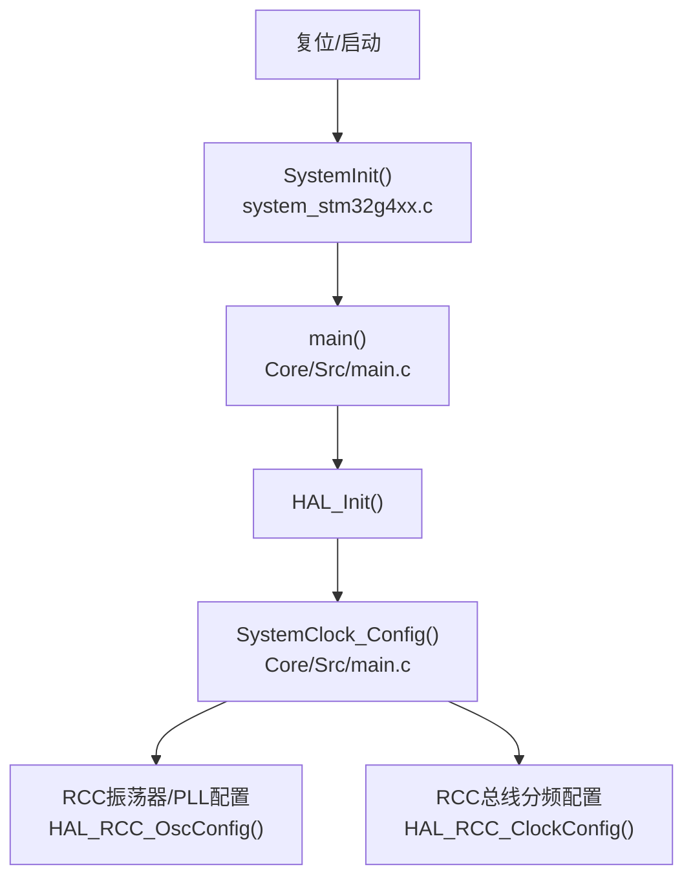
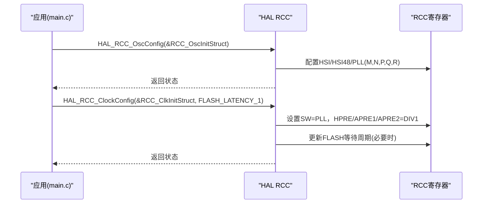
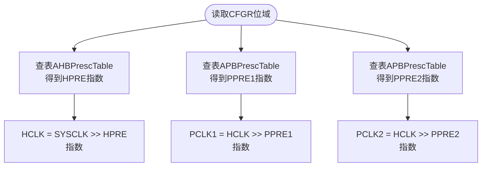
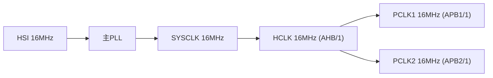
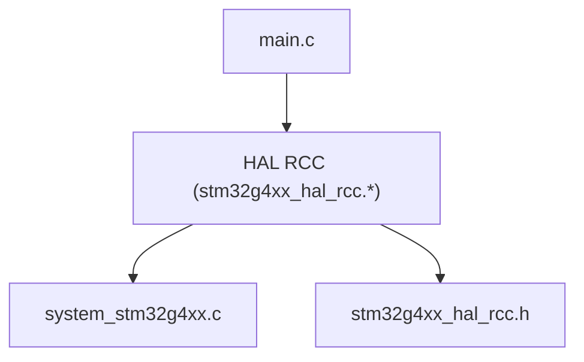

# 时钟树结构

<cite>
**本文引用的文件**   
- [Core/Src/system_stm32g4xx.c](file://Core/Src/system_stm32g4xx.c)
- [Core/Src/main.c](file://Core/Src/main.c)
- [Drivers/STM32G4xx_HAL_Driver/Inc/stm32g4xx_hal_rcc.h](file://Drivers/STM32G4xx_HAL_Driver/Inc/stm32g4xx_hal_rcc.h)
- [Drivers/STM32G4xx_HAL_Driver/Src/stm32g4xx_hal_rcc.c](file://Drivers/STM32G4xx_HAL_Driver/Src/stm32g4xx_hal_rcc.c)
</cite>

## 目录
1. [简介](#简介)
2. [项目结构与入口](#项目结构与入口)
3. [核心组件](#核心组件)
4. [架构总览](#架构总览)
5. [详细组件分析](#详细组件分析)
6. [依赖关系分析](#依赖关系分析)
7. [性能与限制](#性能与限制)
8. [故障排查指南](#故障排查指南)
9. [结论](#结论)

## 简介
本文件面向STM32G474的时钟系统，聚焦于：
- 时钟树架构与各时钟域（SYSCLK、HCLK、PCLK1、PCLK2）的关系
- AHB预分频器（AHBPrescTable）与APB预分频器（APBPrescTable）的配置方法
- 当前配置下的频率分配：SYSCLK=16MHz、HCLK=16MHz、APB1=16MHz、APB2=16MHz
- 提供时钟树结构图与频率传播路径图
- 说明不同外设对时钟频率的要求与限制

## 项目结构与入口
- 系统初始化由启动文件调用SystemInit，随后进入main()。
- main()中通过HAL_Init()完成基础初始化后，调用SystemClock_Config()进行系统时钟配置。
- SystemClock_Config()使用HAL RCC API配置振荡器、PLL及总线分频器，最终得到目标时钟频率。



图表来源
- [Core/Src/system_stm32g4xx.c:180-192](file://Core/Src/system_stm32g4xx.c#L180-L192)
- [Core/Src/main.c:228-237](file://Core/Src/main.c#L228-L237)
- [Core/Src/main.c:296-337](file://Core/Src/main.c#L296-L337)

章节来源
- [Core/Src/system_stm32g4xx.c:180-192](file://Core/Src/system_stm32g4xx.c#L180-L192)
- [Core/Src/main.c:228-237](file://Core/Src/main.c#L228-L237)
- [Core/Src/main.c:296-337](file://Core/Src/main.c#L296-L337)

## 核心组件
- 系统时钟源与PLL
  - 当前配置启用HSI与HSI48，主PLL以HSI为输入，经M/N/P/Q/R分频后输出SYSCLK。
  - 相关宏定义与参数类型在HAL头文件中给出，便于理解各分频因子的取值范围与含义。
- 总线分频器
  - AHB预分频器（HPRE）：控制HCLK = SYSCLK / (1,2,4,...,512)
  - APB1/2预分频器（PPRE1/PPRE2）：控制PCLK1/PCLK2 = HCLK / (1,2,4,8,16)
- 预分频表
  - AHBPrescTable与APBPrescTable用于将寄存器位域映射到实际分频系数，供频率计算函数使用。

章节来源
- [Core/Src/main.c:296-337](file://Core/Src/main.c#L296-L337)
- [Drivers/STM32G4xx_HAL_Driver/Inc/stm32g4xx_hal_rcc.h:45-121](file://Drivers/STM32G4xx_HAL_Driver/Inc/stm32g4xx_hal_rcc.h#L45-L121)
- [Drivers/STM32G4xx_HAL_Driver/Inc/stm32g4xx_hal_rcc.h:345-371](file://Drivers/STM32G4xx_HAL_Driver/Inc/stm32g4xx_hal_rcc.h#L345-L371)
- [Core/Src/system_stm32g4xx.c:154-157](file://Core/Src/system_stm32g4xx.c#L154-L157)

## 架构总览
下图展示从系统时钟源到各时钟域的完整路径，以及当前配置下的频率传播。

```mermaid
graph TB
subgraph "时钟源"
HSI["HSI 16MHz"]
HSI48["HSI48 48MHz"]
end
subgraph "PLL"
PLL["主PLL<br/>输入=HSI<br/>M/N/P/Q/R分频"]
end
subgraph "系统与时钟域"
SYSCLK["SYSCLK"]
HCLK["HCLK (AHB)"]
PCLK1["PCLK1 (APB1)"]
PCLK2["PCLK2 (APB2)"]
end
HSI --> PLL
HSI48 -.->|"可选给USB/随机数等"| PCLK1
HSI48 -.->|"可选给USB/随机数等"| PCLK2
PLL --> SYSCLK
SYSCLK --> |AHB预分频| HCLK
HCLK --> |APB1预分频| PCLK1
HCLK --> |APB2预分频| PCLK2
```

图表来源
- [Core/Src/main.c:296-337](file://Core/Src/main.c#L296-L337)
- [Drivers/STM32G4xx_HAL_Driver/Inc/stm32g4xx_hal_rcc.h:345-371](file://Drivers/STM32G4xx_HAL_Driver/Inc/stm32g4xx_hal_rcc.h#L345-L371)

## 详细组件分析

### 系统时钟源与PLL配置
- 当前配置要点
  - 使能HSI与HSI48；主PLL以HSI为输入。
  - 设置PLL的M/N/P/Q/R分频因子，并选择PLL作为SYSCLK源。
  - 配置AHB/APB1/APB2分频器均为1分频，从而得到各域相同频率。
- 关键API与结构体
  - RCC_OscInitTypeDef：包含OscillatorType、HSIState、HSI48State、PLL等字段。
  - RCC_ClkInitTypeDef：包含ClockType、SYSCLKSource、AHBCLKDivider、APB1CLKDivider、APB2CLKDivider。
- 配置流程
  - 先调用HAL_RCC_OscConfig()配置振荡器与PLL。
  - 再调用HAL_RCC_ClockConfig()配置SYSCLK源与总线分频器，内部会处理Flash等待周期与切换时序。



图表来源
- [Core/Src/main.c:296-337](file://Core/Src/main.c#L296-L337)
- [Drivers/STM32G4xx_HAL_Driver/Src/stm32g4xx_hal_rcc.c:800-940](file://Drivers/STM32G4xx_HAL_Driver/Src/stm32g4xx_hal_rcc.c#L800-L940)

章节来源
- [Core/Src/main.c:296-337](file://Core/Src/main.c#L296-L337)
- [Drivers/STM32G4xx_HAL_Driver/Inc/stm32g4xx_hal_rcc.h:45-121](file://Drivers/STM32G4xx_HAL_Driver/Inc/stm32g4xx_hal_rcc.h#L45-L121)
- [Drivers/STM32G4xx_HAL_Driver/Src/stm32g4xx_hal_rcc.c:800-940](file://Drivers/STM32G4xx_HAL_Driver/Src/stm32g4xx_hal_rcc.c#L800-L940)

### AHB与APB预分频器配置方法与映射表
- 配置方法
  - AHB预分频：通过RCC_ClkInitStruct.AHBCLKDivider选择RCC_SYSCLK_DIVx。
  - APB1/2预分频：通过RCC_ClkInitStruct.APB1CLKDivider/APB2CLKDivider选择RCC_HCLK_DIVx。
- 映射表
  - AHBPrescTable[16]：将CFGR.HPRE位域映射到实际右移位数（即分频指数）。
  - APBPrescTable[8]：将CFGR.PPRE1/PPRE2位域映射到实际右移位数。
- 频率计算
  - SystemCoreClockUpdate()与HAL_RCC_GetSysClockFreq()/GetHCLKFreq()/GetPCLKxFreq()均基于上述表格与寄存器位域计算实际频率。



图表来源
- [Core/Src/system_stm32g4xx.c:154-157](file://Core/Src/system_stm32g4xx.c#L154-L157)
- [Core/Src/system_stm32g4xx.c:230-272](file://Core/Src/system_stm32g4xx.c#L230-L272)
- [Drivers/STM32G4xx_HAL_Driver/Src/stm32g4xx_hal_rcc.c:1131-1143](file://Drivers/STM32G4xx_HAL_Driver/Src/stm32g4xx_hal_rcc.c#L1131-L1143)

章节来源
- [Core/Src/system_stm32g4xx.c:154-157](file://Core/Src/system_stm32g4xx.c#L154-L157)
- [Core/Src/system_stm32g4xx.c:230-272](file://Core/Src/system_stm32g4xx.c#L230-L272)
- [Drivers/STM32G4xx_HAL_Driver/Src/stm32g4xx_hal_rcc.c:1131-1143](file://Drivers/STM32G4xx_HAL_Driver/Src/stm32g4xx_hal_rcc.c#L1131-L1143)

### 当前配置的频率分配与验证
- 配置摘要
  - 系统时钟源：PLL（输入HSI）
  - AHB分频：1
  - APB1/2分频：1
- 结果
  - SYSCLK = 16MHz
  - HCLK = 16MHz
  - PCLK1 = 16MHz
  - PCLK2 = 16MHz
- 依据
  - 注释文档明确列出默认配置下各域频率为16MHz。
  - 代码中将AHB/APB1/APB2分频器设置为1分频，且SYSCLK源为PLL，结合HSI=16MHz与PLL参数，得到上述结果。

章节来源
- [Core/Src/system_stm32g4xx.c:25-52](file://Core/Src/system_stm32g4xx.c#L25-L52)
- [Core/Src/main.c:326-332](file://Core/Src/main.c#L326-L332)

### 频率传播路径图
下图直观展示当前配置下频率在各时钟域间的传播。



图表来源
- [Core/Src/main.c:296-337](file://Core/Src/main.c#L296-L337)
- [Core/Src/system_stm32g4xx.c:25-52](file://Core/Src/system_stm32g4xx.c#L25-L52)

## 依赖关系分析
- 模块耦合
  - main.c依赖HAL RCC接口进行时钟配置。
  - HAL RCC实现依赖底层RCC寄存器与预分频表。
  - system_stm32g4xx.c提供SystemCoreClockUpdate与预分频表，供HAL与用户代码查询频率。
- 外部依赖
  - CMSIS设备头文件与HAL驱动头文件定义了所有时钟相关的常量与结构体。



图表来源
- [Core/Src/main.c:296-337](file://Core/Src/main.c#L296-L337)
- [Drivers/STM32G4xx_HAL_Driver/Src/stm32g4xx_hal_rcc.c:800-940](file://Drivers/STM32G4xx_HAL_Driver/Src/stm32g4xx_hal_rcc.c#L800-L940)
- [Core/Src/system_stm32g4xx.c:154-157](file://Core/Src/system_stm32g4xx.c#L154-L157)

章节来源
- [Core/Src/main.c:296-337](file://Core/Src/main.c#L296-L337)
- [Drivers/STM32G4xx_HAL_Driver/Src/stm32g4xx_hal_rcc.c:800-940](file://Drivers/STM32G4xx_HAL_Driver/Src/stm32g4xx_hal_rcc.c#L800-L940)
- [Core/Src/system_stm32g4xx.c:154-157](file://Core/Src/system_stm32g4xx.c#L154-L157)

## 性能与限制
- Flash等待周期
  - 当提高SYSCLK时，需相应增加Flash等待周期以避免访问错误；HAL_RCC_ClockConfig内部会根据目标频率自动调整。
- 过冲/欠冲保护
  - 当目标频率超过80MHz时，HAL会在切换前临时将HCLK设为2分频，避免瞬态不稳定。
- 外设时钟上限
  - APB1/PCLK1与APB2/PCLK2的最大允许频率受器件手册限制；若需要更高频率，应降低AHB或提升PLL输出后再分频。
- USB/随机数等专用时钟
  - HSI48可用于USB FS或随机数生成；其时钟独立于主PLL路径，但需确保满足外设要求。

章节来源
- [Drivers/STM32G4xx_HAL_Driver/Src/stm32g4xx_hal_rcc.c:813-857](file://Drivers/STM32G4xx_HAL_Driver/Src/stm32g4xx_hal_rcc.c#L813-L857)
- [Core/Src/main.c:333-336](file://Core/Src/main.c#L333-L336)

## 故障排查指南
- 现象：系统运行不稳定或外设异常
  - 检查是否已正确调用HAL_RCC_ClockConfig并返回成功。
  - 确认Flash等待周期是否与当前SYSCLK匹配。
- 现象：频率不符合预期
  - 核对PLL的M/N/P/Q/R设置与输入源（HSI/HSE）。
  - 检查AHB/APB分频器是否为期望值。
  - 使用HAL_RCC_GetSysClockFreq()/GetHCLKFreq()/GetPCLKxFreq()读取实际频率。
- 现象：切换时钟超时
  - 检查时钟源就绪标志（如PLLRDY、HSIRDY、HSERDY），确认外部晶振工作正常。

章节来源
- [Drivers/STM32G4xx_HAL_Driver/Src/stm32g4xx_hal_rcc.c:800-940](file://Drivers/STM32G4xx_HAL_Driver/Src/stm32g4xx_hal_rcc.c#L800-L940)
- [Core/Src/system_stm32g4xx.c:230-272](file://Core/Src/system_stm32g4xx.c#L230-L272)

## 结论
- 本项目采用HSI+PLL方案，配合AHB与APB全1分频，得到统一的16MHz时钟域（SYSCLK/HCLK/PCLK1/PCLK2）。
- 通过AHBPrescTable与APBPrescTable可准确计算各域频率；HAL RCC封装了切换时序与等待周期管理，简化了配置复杂度。
- 在实际应用中，应根据外设需求与功耗目标合理设置PLL与分频器，并注意Flash等待周期与高频切换的保护策略。