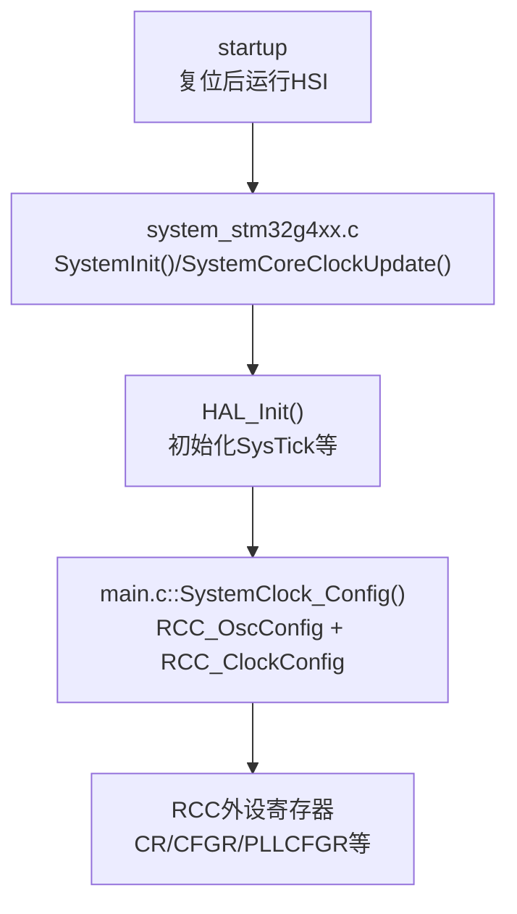
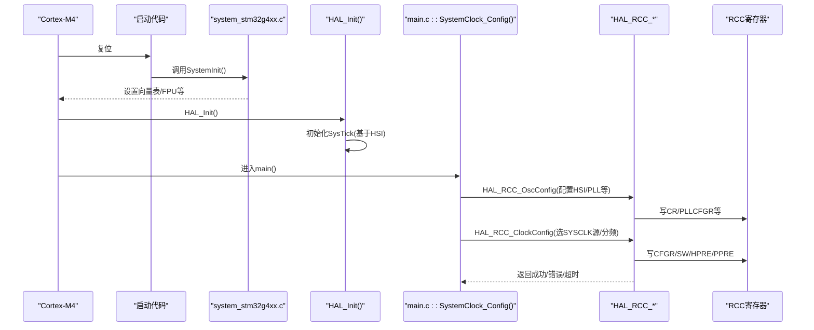
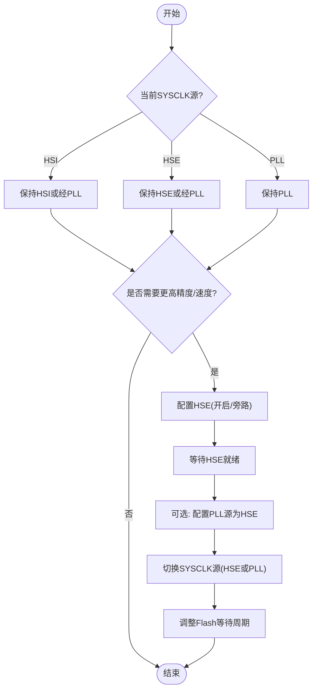
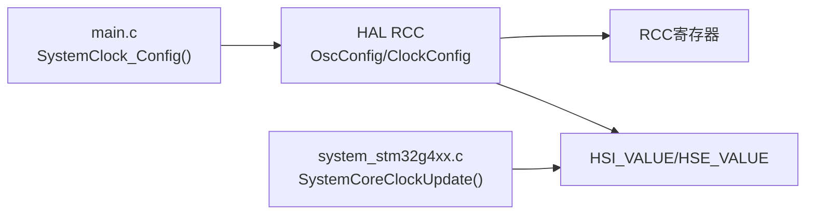

# 时钟源配置

<cite>
**本文引用的文件**
- [Core/Src/system_stm32g4xx.c](file://Core/Src/system_stm32g4xx.c)
- [Core/Src/main.c](file://Core/Src/main.c)
- [Drivers/STM32G4xx_HAL_Driver/Inc/stm32g4xx_hal_rcc.h](file://Drivers/STM32G4xx_HAL_Driver/Inc/stm32g4xx_hal_rcc.h)
- [Drivers/STM32G4xx_HAL_Driver/Src/stm32g4xx_hal_rcc.c](file://Drivers/STM32G4xx_HAL_Driver/Src/stm32g4xx_hal_rcc.c)
</cite>

## 目录
1. [简介](#简介)
2. [项目结构](#项目结构)
3. [核心组件](#核心组件)
4. [架构总览](#架构总览)
5. [详细组件分析](#详细组件分析)
6. [依赖关系分析](#依赖关系分析)
7. [性能与功耗考量](#性能与功耗考量)
8. [故障排查指南](#故障排查指南)
9. [结论](#结论)
10. [附录：切换流程与示例路径](#附录切换流程与示例路径)

## 简介
本文件面向STM32G474的时钟系统，重点说明：
- HSI内部16MHz振荡器与HSE外部晶振的工作原理与特性
- 当前系统默认使用HSI作为系统时钟源的配置与相关宏定义（HSI_VALUE=16000000U）
- 如何切换到HSE外部晶振（24MHz），包括硬件要求与软件配置步骤
- 时钟源切换的安全考虑与时序要求
- 提供时钟源选择流程图与配置示例代码路径

## 项目结构
本项目基于STM32CubeMX生成的工程，时钟相关的关键位置如下：
- 启动阶段系统时钟常量与更新逻辑：system_stm32g4xx.c
- 应用层系统时钟配置入口：main.c中的SystemClock_Config()
- HAL RCC驱动接口与实现：stm32g4xx_hal_rcc.h / stm32g4xx_hal_rcc.c

图表来源
- [Core/Src/system_stm32g4xx.c:180-272](file://Core/Src/system_stm32g4xx.c#L180-L272)
- [Core/Src/main.c:295-337](file://Core/Src/main.c#L295-L337)
- [Drivers/STM32G4xx_HAL_Driver/Src/stm32g4xx_hal_rcc.c:766-940](file://Drivers/STM32G4xx_HAL_Driver/Src/stm32g4xx_hal_rcc.c#L766-L940)

章节来源
- [Core/Src/system_stm32g4xx.c:180-272](file://Core/Src/system_stm32g4xx.c#L180-L272)
- [Core/Src/main.c:295-337](file://Core/Src/main.c#L295-L337)
- [Drivers/STM32G4xx_HAL_Driver/Src/stm32g4xx_hal_rcc.c:766-940](file://Drivers/STM32G4xx_HAL_Driver/Src/stm32g4xx_hal_rcc.c#L766-L940)

## 核心组件
- system_stm32g4xx.c
  - 定义并维护系统时钟频率常量：HSI_VALUE、HSE_VALUE
  - 提供SystemCoreClockUpdate()用于根据RCC状态计算当前系统时钟
- main.c
  - SystemClock_Config()通过HAL_RCC_OscConfig()和HAL_RCC_ClockConfig()完成振荡器与分频器配置
- HAL RCC驱动
  - HAL_RCC_OscConfig()负责使能/关闭HSE/HSI/PLL等，包含就绪等待与超时处理
  - HAL_RCC_ClockConfig()负责SYSCLK/HCLK/PCLKx的分频与时钟源切换，含Flash等待周期与时钟切换超时保护

章节来源
- [Core/Src/system_stm32g4xx.c:80-86](file://Core/Src/system_stm32g4xx.c#L80-L86)
- [Core/Src/system_stm32g4xx.c:230-272](file://Core/Src/system_stm32g4xx.c#L230-L272)
- [Core/Src/main.c:295-337](file://Core/Src/main.c#L295-L337)
- [Drivers/STM32G4xx_HAL_Driver/Inc/stm32g4xx_hal_rcc.h:45-121](file://Drivers/STM32G4xx_HAL_Driver/Inc/stm32g4xx_hal_rcc.h#L45-L121)
- [Drivers/STM32G4xx_HAL_Driver/Src/stm32g4xx_hal_rcc.c:312-451](file://Drivers/STM32G4xx_HAL_Driver/Src/stm32g4xx_hal_rcc.c#L312-L451)
- [Drivers/STM32G4xx_HAL_Driver/Src/stm32g4xx_hal_rcc.c:766-940](file://Drivers/STM32G4xx_HAL_Driver/Src/stm32g4xx_hal_rcc.c#L766-L940)

## 架构总览
下图展示了从复位到应用层时钟配置的完整时序与调用关系。

图表来源
- [Core/Src/system_stm32g4xx.c:180-192](file://Core/Src/system_stm32g4xx.c#L180-L192)
- [Core/Src/main.c:295-337](file://Core/Src/main.c#L295-L337)
- [Drivers/STM32G4xx_HAL_Driver/Src/stm32g4xx_hal_rcc.c:312-451](file://Drivers/STM32G4xx_HAL_Driver/Src/stm32g4xx_hal_rcc.c#L312-L451)
- [Drivers/STM32G4xx_HAL_Driver/Src/stm32g4xx_hal_rcc.c:766-940](file://Drivers/STM32G4xx_HAL_Driver/Src/stm32g4xx_hal_rcc.c#L766-L940)

## 详细组件分析

### HSI内部16MHz振荡器
- 特性
  - 出厂校准RC振荡器，典型值16MHz，受电压与温度影响存在漂移
  - 上电复位后直接可用，无需外部器件
- 在系统中的角色
  - 复位后默认系统时钟源为HSI
  - 可作为PLL输入源或直接作为SYSCLK
- 关键宏与变量
  - HSI_VALUE宏定义为16000000U
  - SystemCoreClock初始值为HSI_VALUE
  - SystemCoreClockUpdate()在SYSCLK源为HSI时返回HSI_VALUE

章节来源
- [Core/Src/system_stm32g4xx.c:84-86](file://Core/Src/system_stm32g4xx.c#L84-L86)
- [Core/Src/system_stm32g4xx.c:154](file://Core/Src/system_stm32g4xx.c#L154)
- [Core/Src/system_stm32g4xx.c:237-239](file://Core/Src/system_stm32g4xx.c#L237-L239)
- [Drivers/STM32G4xx_HAL_Driver/Src/stm32g4xx_hal_rcc.c:128-130](file://Drivers/STM32G4xx_HAL_Driver/Src/stm32g4xx_hal_rcc.c#L128-L130)

### HSE外部晶振
- 特性
  - 支持4~48MHz外部晶振或外部时钟信号（旁路模式）
  - 频率稳定度高，适合高精度定时与高速总线
- 在系统中的角色
  - 可直接作为SYSCLK或通过PLL倍频后作为SYSCLK
  - 也可作为USB/RNG等外设时钟源（经PLLQ）
- 关键宏与变量
  - HSE_VALUE宏默认24000000U（若未由编译器预定义覆盖）
  - 切换前需确保HSE已就绪（HSE_READY标志）

章节来源
- [Core/Src/system_stm32g4xx.c:80-82](file://Core/Src/system_stm32g4xx.c#L80-L82)
- [Drivers/STM32G4xx_HAL_Driver/Src/stm32g4xx_hal_rcc.c:134-136](file://Drivers/STM32G4xx_HAL_Driver/Src/stm32g4xx_hal_rcc.c#L134-L136)
- [Drivers/STM32G4xx_HAL_Driver/Src/stm32g4xx_hal_rcc.c:327-378](file://Drivers/STM32G4xx_HAL_Driver/Src/stm32g4xx_hal_rcc.c#L327-L378)

### 当前系统默认HSI配置
- 启动阶段
  - 复位后以HSI为系统时钟源，随后调用SystemInit()进行基础设置
- 应用层配置
  - SystemClock_Config()中启用HSI与HSI48，并将PLL源设为HSI，再配置AHB/APB分频
- 时钟常量
  - HSI_VALUE=16000000U；SystemCoreClock初始化为该值

章节来源
- [Core/Src/system_stm32g4xx.c:21-31](file://Core/Src/system_stm32g4xx.c#L21-L31)
- [Core/Src/system_stm32g4xx.c:154](file://Core/Src/system_stm32g4xx.c#L154)
- [Core/Src/main.c:307-337](file://Core/Src/main.c#L307-L337)

### 切换到HSE外部晶振（24MHz）的步骤
- 硬件要求
  - 在HSE引脚连接24MHz晶振（或外部时钟源，视是否使用旁路模式）
  - 确保电源与去耦满足参考手册要求
- 软件配置要点
  - 在RCC_OscInitStruct中：
    - OscillatorType包含RCC_OSCILLATORTYPE_HSE
    - HSEState设置为RCC_HSE_ON或RCC_HSE_BYPASS（按硬件决定）
    - PLL.PLLSource设为RCC_PLLSOURCE_HSE（如仍使用PLL）
  - 在RCC_ClkInitStruct中：
    - SYSCLKSource设为RCC_SYSCLKSOURCE_HSE（直接HSE）或RCC_SYSCLKSOURCE_PLLCLK（经PLL）
    - 合理设置AHB/APB分频与Flash等待周期
  - 调用顺序：
    - 先HAL_RCC_OscConfig()使能HSE并等待就绪
    - 再HAL_RCC_ClockConfig()切换SYSCLK源并更新分频
  - 注意：
    - 若目标频率高于80MHz，HAL内部会插入HCLK=DIV2中间步骤以避免过冲/欠冲
    - 所有操作均有超时保护，失败将返回HAL_ERROR或HAL_TIMEOUT

章节来源
- [Drivers/STM32G4xx_HAL_Driver/Inc/stm32g4xx_hal_rcc.h:144-160](file://Drivers/STM32G4xx_HAL_Driver/Inc/stm32g4xx_hal_rcc.h#L144-L160)
- [Drivers/STM32G4xx_HAL_Driver/Src/stm32g4xx_hal_rcc.c:327-378](file://Drivers/STM32G4xx_HAL_Driver/Src/stm32g4xx_hal_rcc.c#L327-L378)
- [Drivers/STM32G4xx_HAL_Driver/Src/stm32g4xx_hal_rcc.c:766-940](file://Drivers/STM32G4xx_HAL_Driver/Src/stm32g4xx_hal_rcc.c#L766-L940)

### 安全考虑与时序要求
- Flash等待周期
  - 提高频率时需先增加Flash LATENCY，降低频率后再减少，避免取指异常
- 时钟切换时序
  - 切换SYSCLK前需确认目标源就绪（HSE_READY/HSI_READY/PLL_RDY）
  - 超过80MHz切换时，HAL会自动插入HCLK=DIV2中间步骤，防止过冲/欠冲
- 超时保护
  - HSE/HSI/PLL/CLOCKSWITCH均带超时检测，避免死等
- 系统时钟常量一致性
  - 若直接使用HSE而不走PLL，需保证HSE_VALUE与实际晶振一致，否则SystemCoreClockUpdate()计算结果不准确

章节来源
- [Drivers/STM32G4xx_HAL_Driver/Src/stm32g4xx_hal_rcc.c:782-818](file://Drivers/STM32G4xx_HAL_Driver/Src/stm32g4xx_hal_rcc.c#L782-L818)
- [Drivers/STM32G4xx_HAL_Driver/Src/stm32g4xx_hal_rcc.c:831-872](file://Drivers/STM32G4xx_HAL_Driver/Src/stm32g4xx_hal_rcc.c#L831-L872)
- [Core/Src/system_stm32g4xx.c:204-226](file://Core/Src/system_stm32g4xx.c#L204-L226)

### 时钟源选择流程图

图表来源
- [Drivers/STM32G4xx_HAL_Driver/Src/stm32g4xx_hal_rcc.c:327-378](file://Drivers/STM32G4xx_HAL_Driver/Src/stm32g4xx_hal_rcc.c#L327-L378)
- [Drivers/STM32G4xx_HAL_Driver/Src/stm32g4xx_hal_rcc.c:766-940](file://Drivers/STM32G4xx_HAL_Driver/Src/stm32g4xx_hal_rcc.c#L766-L940)

## 依赖关系分析
- main.c依赖HAL RCC接口完成时钟配置
- HAL RCC驱动依赖底层RCC寄存器与系统常量（HSI_VALUE/HSE_VALUE）
- system_stm32g4xx.c提供系统级时钟常量与更新函数，被HAL与用户代码间接使用

图表来源
- [Core/Src/main.c:295-337](file://Core/Src/main.c#L295-L337)
- [Drivers/STM32G4xx_HAL_Driver/Src/stm32g4xx_hal_rcc.c:312-451](file://Drivers/STM32G4xx_HAL_Driver/Src/stm32g4xx_hal_rcc.c#L312-L451)
- [Core/Src/system_stm32g4xx.c:230-272](file://Core/Src/system_stm32g4xx.c#L230-L272)

章节来源
- [Core/Src/main.c:295-337](file://Core/Src/main.c#L295-L337)
- [Drivers/STM32G4xx_HAL_Driver/Src/stm32g4xx_hal_rcc.c:312-451](file://Drivers/STM32G4xx_HAL_Driver/Src/stm32g4xx_hal_rcc.c#L312-L451)
- [Core/Src/system_stm32g4xx.c:230-272](file://Core/Src/system_stm32g4xx.c#L230-L272)

## 性能与功耗考量
- HSI
  - 优点：无需外部器件、上电即用；缺点：温漂较大，不适合高精度场景
- HSE
  - 优点：精度高、稳定性好；缺点：需要外部晶振与布局布线注意
- 功耗
  - 降低系统频率可减少功耗；必要时可关闭不用的振荡器（如HSI/HSI48）
- 外设时钟
  - USB/RNG等对时钟有特定要求，需通过PLLQ输出满足频率限制

[本节为通用指导，不直接分析具体文件]

## 故障排查指南
- 现象：切换HSE后卡住或报错
  - 检查HSE是否真正起振（晶振、负载电容、走线）
  - 确认HSE_STATE配置正确（ON或BYPASS）
  - 查看HAL返回值是否为HAL_TIMEOUT或HAL_ERROR
- 现象：系统运行不稳定或程序跑飞
  - 检查Flash等待周期是否与当前HCLK匹配
  - 确认HSE_VALUE与实际晶振一致
- 现象：USB/RNG工作异常
  - 检查PLLQ输出是否符合48MHz要求

章节来源
- [Drivers/STM32G4xx_HAL_Driver/Src/stm32g4xx_hal_rcc.c:327-378](file://Drivers/STM32G4xx_HAL_Driver/Src/stm32g4xx_hal_rcc.c#L327-L378)
- [Drivers/STM32G4xx_HAL_Driver/Src/stm32g4xx_hal_rcc.c:782-818](file://Drivers/STM32G4xx_HAL_Driver/Src/stm32g4xx_hal_rcc.c#L782-L818)
- [Core/Src/system_stm32g4xx.c:204-226](file://Core/Src/system_stm32g4xx.c#L204-L226)

## 结论
- 当前工程默认使用HSI作为系统时钟源，并通过PLL提升主频
- 切换到HSE外部晶振需遵循“先使能HSE→等待就绪→切换SYSCLK→调整等待周期”的流程
- 高频率切换需注意过冲/欠冲保护与Flash等待周期
- 保持HSE_VALUE与实际晶振一致，以确保系统时钟常量准确

[本节为总结性内容，不直接分析具体文件]

## 附录：切换流程与示例路径
- 配置入口与调用路径
  - 应用层时钟配置入口：[Core/Src/main.c:295-337](file://Core/Src/main.c#L295-L337)
  - 振荡器配置API：[Drivers/STM32G4xx_HAL_Driver/Src/stm32g4xx_hal_rcc.c:312-451](file://Drivers/STM32G4xx_HAL_Driver/Src/stm32g4xx_hal_rcc.c#L312-L451)
  - 系统时钟配置API：[Drivers/STM32G4xx_HAL_Driver/Src/stm32g4xx_hal_rcc.c:766-940](file://Drivers/STM32G4xx_HAL_Driver/Src/stm32g4xx_hal_rcc.c#L766-L940)
- 关键宏与类型
  - HSE/HSI配置枚举与状态：[Drivers/STM32G4xx_HAL_Driver/Inc/stm32g4xx_hal_rcc.h:144-160](file://Drivers/STM32G4xx_HAL_Driver/Inc/stm32g4xx_hal_rcc.h#L144-L160)
  - 系统时钟常量定义：[Core/Src/system_stm32g4xx.c:80-86](file://Core/Src/system_stm32g4xx.c#L80-L86)
- 建议的最小切换步骤（概念性）
  - 在RCC_OscInitStruct中设置HSE为ON或BYPASS，并等待就绪
  - 如需PLL，设置PLL源为HSE并等待PLL就绪
  - 在RCC_ClkInitStruct中选择SYSCLK源为HSE或PLL，并设置合适的分频与Flash等待周期
  - 调用HAL_RCC_OscConfig()与HAL_RCC_ClockConfig()完成切换

[本节为操作指引，不直接展示代码内容]