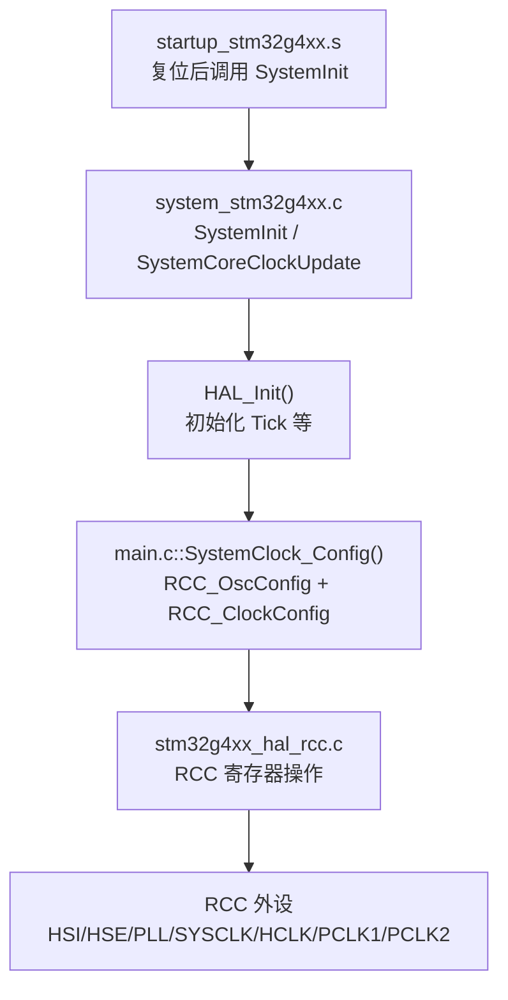
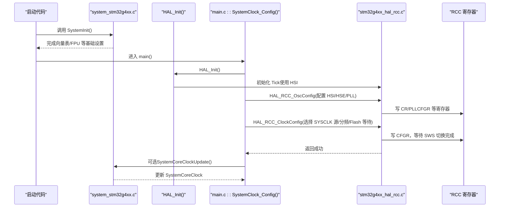
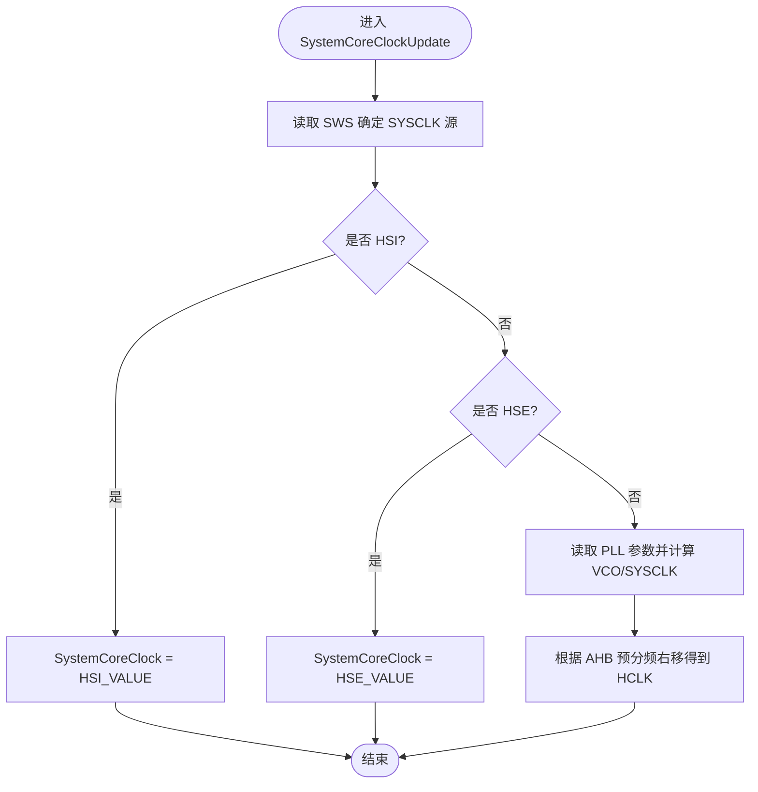
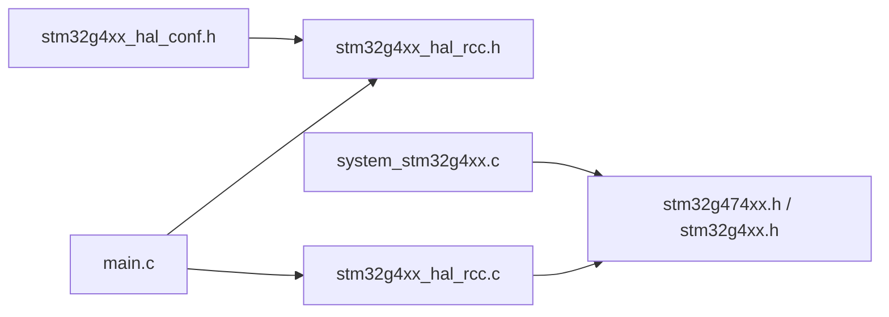
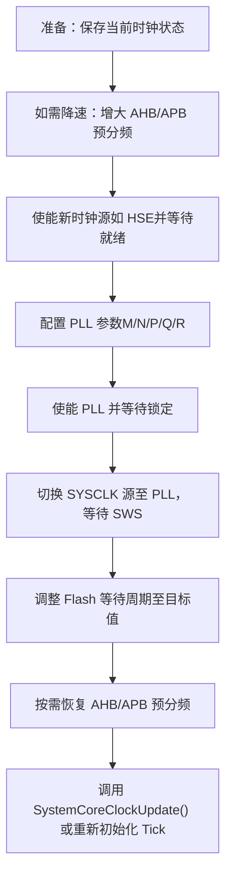

# 时钟系统配置

<cite>
**本文引用的文件**   
- [Core/Src/system_stm32g4xx.c](file://Core/Src/system_stm32g4xx.c)
- [Core/Inc/stm32g4xx_hal_conf.h](file://Core/Inc/stm32g4xx_hal_conf.h)
- [Core/Src/main.c](file://Core/Src/main.c)
- [Drivers/STM32G4xx_HAL_Driver/Inc/stm32g4xx_hal_rcc.h](file://Drivers/STM32G4xx_HAL_Driver/Inc/stm32g4xx_hal_rcc.h)
- [Drivers/STM32G4xx_HAL_Driver/Src/stm32g4xx_hal_rcc.c](file://Drivers/STM32G4xx_HAL_Driver/Src/stm32g4xx_hal_rcc.c)
</cite>

## 目录
1. [简介](#简介)
2. [项目结构](#项目结构)
3. [核心组件](#核心组件)
4. [架构总览](#架构总览)
5. [详细组件分析](#详细组件分析)
6. [依赖关系分析](#依赖关系分析)
7. [性能与功耗考量](#性能与功耗考量)
8. [故障排查指南](#故障排查指南)
9. [结论](#结论)
10. [附录：计算公式与示例](#附录计算公式与示例)

## 简介
本文件围绕 STM32G474 的时钟系统，结合工程源码，深入解释 HSI、HSE、PLL 的工作原理与时钟树分配策略（SYSCLK、HCLK、PCLK1、PCLK2），并基于当前工程的实际配置，给出频率计算、SystemCoreClock 更新机制与时钟切换安全注意事项。同时提供时序图与配置流程图，帮助读者快速理解与正确配置。

## 项目结构
本项目为 CubeMX 生成的工程，时钟相关的关键位置如下：
- 启动后默认系统时钟源与变量维护：system_stm32g4xx.c
- 应用层时钟配置入口：main.c 中的 SystemClock_Config()
- HAL RCC 驱动接口与实现：stm32g4xx_hal_rcc.h / stm32g4xx_hal_rcc.c
- 振荡器频率宏定义：stm32g4xx_hal_conf.h

图表来源
- [Core/Src/system_stm32g4xx.c:180-272](file://Core/Src/system_stm32g4xx.c#L180-L272)
- [Core/Src/main.c:296-337](file://Core/Src/main.c#L296-L337)
- [Drivers/STM32G4xx_HAL_Driver/Src/stm32g4xx_hal_rcc.c:312-940](file://Drivers/STM32G4xx_HAL_Driver/Src/stm32g4xx_hal_rcc.c#L312-L940)

章节来源
- [Core/Src/system_stm32g4xx.c:1-288](file://Core/Src/system_stm32g4xx.c#L1-L288)
- [Core/Src/main.c:296-337](file://Core/Src/main.c#L296-L337)
- [Drivers/STM32G4xx_HAL_Driver/Src/stm32g4xx_hal_rcc.c:312-940](file://Drivers/STM32G4xx_HAL_Driver/Src/stm32g4xx_hal_rcc.c#L312-L940)

## 核心组件
- 内部高速振荡器 HSI：默认 16 MHz，可直接作为 SYSCLK 或作为 PLL 输入。
- 外部高速晶振 HSE：工程中定义为 8 MHz（见 hal_conf.h），可作为 SYSCLK 或 PLL 输入。
- 主 PLL：支持多路输出（SYSCLK、USB/QSPI/FDCAN/SAI/I2S 的 PLLQ、ADC 的 PLLP 等）。
- 时钟域：
  - SYSCLK：系统时钟，可来自 HSI、HSE 或 PLL。
  - HCLK：AHB 总线时钟，由 SYSCLK 经 AHB 预分频得到。
  - PCLK1/PCLK2：APB1/APB2 总线时钟，由 HCLK 经 APB 预分频得到。
- SystemCoreClock：CMSIS 维护的全局变量，表示当前 HCLK 频率，用于 SysTick 等计算。

章节来源
- [Core/Inc/stm32g4xx_hal_conf.h:117-132](file://Core/Inc/stm32g4xx_hal_conf.h#L117-L132)
- [Drivers/STM32G4xx_HAL_Driver/Inc/stm32g4xx_hal_rcc.h:45-121](file://Drivers/STM32G4xx_HAL_Driver/Inc/stm32g4xx_hal_rcc.h#L45-L121)
- [Core/Src/system_stm32g4xx.c:145-157](file://Core/Src/system_stm32g4xx.c#L145-L157)

## 架构总览
下图展示从复位到系统时钟稳定运行的关键路径，以及各模块间的依赖关系。

图表来源
- [Core/Src/system_stm32g4xx.c:180-272](file://Core/Src/system_stm32g4xx.c#L180-L272)
- [Core/Src/main.c:296-337](file://Core/Src/main.c#L296-L337)
- [Drivers/STM32G4xx_HAL_Driver/Src/stm32g4xx_hal_rcc.c:312-940](file://Drivers/STM32G4xx_HAL_Driver/Src/stm32g4xx_hal_rcc.c#L312-L940)

## 详细组件分析

### HSI 内部振荡器
- 特性：工厂校准的 16 MHz RC，上电即就绪，适合初始运行与低功耗场景。
- 在工程中：被启用并作为 PLL 的输入源之一；也可直接作为 SYSCLK。
- 注意：精度受温度/电压影响，需通过 HSITRIM 微调或在需要高精度时改用 HSE。

章节来源
- [Core/Inc/stm32g4xx_hal_conf.h:130-132](file://Core/Inc/stm32g4xx_hal_conf.h#L130-L132)
- [Core/Src/main.c:308-318](file://Core/Src/main.c#L308-L318)

### HSE 外部晶振
- 特性：外接晶体，频率更精确，典型值 8~24 MHz。
- 在工程中：hal_conf.h 中 HSE_VALUE 定义为 8 MHz。若硬件使用不同频率，需同步修改该宏。
- 建议：当对 USB、通信波特率、定时器精度有要求时优先使用 HSE。

章节来源
- [Core/Inc/stm32g4xx_hal_conf.h:117-119](file://Core/Inc/stm32g4xx_hal_conf.h#L117-L119)

### PLL 锁相环
- 功能：将 HSI/HSE 倍频/分频产生更高频率的系统时钟，并提供多路输出（SYSCLK、PLLQ、PLLP 等）。
- 参数：
  - PLLM：VCO 输入分频（1~16）
  - PLLN：VCO 倍频（8~127）
  - PLLR：SYSCLK 输出分频（2/4/6/8）
  - PLLQ：USB/QSPI/FDCAN/SAI/I2S 输出分频（2/4/6/8）
  - PLLP：ADC 输出分频（2~31）
- 约束：
  - VCO 频率范围需满足数据手册限制（通常 64~344 MHz）。
  - SYSCLK 最大频率受电压档位与 Flash 等待周期限制。

章节来源
- [Drivers/STM32G4xx_HAL_Driver/Inc/stm32g4xx_hal_rcc.h:45-69](file://Drivers/STM32G4xx_HAL_Driver/Inc/stm32g4xx_hal_rcc.h#L45-L69)
- [Drivers/STM32G4xx_HAL_Driver/Inc/stm32g4xx_hal_rcc.h:212-292](file://Drivers/STM32G4xx_HAL_Driver/Inc/stm32g4xx_hal_rcc.h#L212-L292)

### 时钟树与域分配
- 路径：
  - SYSCLK ← HSI/HSE/PLL
  - HCLK = SYSCLK / AHB 预分频
  - PCLK1 = HCLK / APB1 预分频
  - PCLK2 = HCLK / APB2 预分频
- 工程中当前配置（见 main.c）：
  - SYSCLK 源：PLL
  - AHB 预分频：1（HCLK=SYSCLK）
  - APB1/APB2 预分频：1（PCLK1=PCLK2=HCLK）

章节来源
- [Core/Src/main.c:326-331](file://Core/Src/main.c#L326-L331)
- [Drivers/STM32G4xx_HAL_Driver/Inc/stm32g4xx_hal_rcc.h:104-121](file://Drivers/STM32G4xx_HAL_Driver/Inc/stm32g4xx_hal_rcc.h#L104-L121)

### 当前配置的 16 MHz 系统时钟说明
- 工程注释中给出了“默认”配置表（HSI 直接作为 SYSCLK，16 MHz），但实际 main.c 的 SystemClock_Config() 选择了 PLL 作为 SYSCLK 源。
- 根据 main.c 的配置：
  - PLL 源：HSI（16 MHz）
  - PLLM：DIV1
  - PLLN：15
  - PLLP：DIV4
  - PLLQ：DIV4
  - PLLR：DIV4
- 计算结果：
  - VCO = 16 MHz / 1 × 15 = 240 MHz
  - SYSCLK = 240 MHz / 4 = 60 MHz
  - HCLK = 60 MHz（AHB 不分频）
  - PCLK1/PCLK2 = 60 MHz（APB 不分频）
- 注意：这与注释中“16 MHz 系统时钟”不一致，应以 main.c 的实际配置为准。

章节来源
- [Core/Src/main.c:308-337](file://Core/Src/main.c#L308-L337)
- [Core/Src/system_stm32g4xx.c:25-52](file://Core/Src/system_stm32g4xx.c#L25-L52)

### SystemCoreClock 更新机制
- 更新时机：
  - 调用 SystemCoreClockUpdate()
  - 调用 HAL_RCC_GetHCLKFreq()
  - 每次调用 HAL_RCC_ClockConfig() 后自动更新
- 更新逻辑：
  - 读取 RCC->CFGR.SWS 判断当前 SYSCLK 源（HSI/HSE/PLL）
  - 若为 PLL，则按公式计算：VCO = (HSI/HSE)/PLLM × PLLN；SYSCLK = VCO / PLLR
  - 再根据 AHB 预分频得到 HCLK，写入 SystemCoreClock

图表来源
- [Core/Src/system_stm32g4xx.c:230-272](file://Core/Src/system_stm32g4xx.c#L230-L272)

章节来源
- [Core/Src/system_stm32g4xx.c:145-157](file://Core/Src/system_stm32g4xx.c#L145-L157)
- [Core/Src/system_stm32g4xx.c:230-272](file://Core/Src/system_stm32g4xx.c#L230-L272)

### 时钟切换的安全考虑
- Flash 等待周期：提高 SYSCLK 前必须先增加 Flash 等待周期，避免取指错误。
- 预分频顺序：先降低 AHB/APB 预分频，再切换时钟源，最后恢复目标分频。
- 等待位：切换完成后需等待 SWS 指示源已稳定。
- 超时保护：HAL 内部包含 HSE/PLL/CLOCKSWITCH 超时检查，防止死等。
- 中断与 DMA：在切换期间尽量避免长耗时中断处理，必要时临时屏蔽关键中断。

章节来源
- [Core/Src/main.c:332-336](file://Core/Src/main.c#L332-L336)
- [Drivers/STM32G4xx_HAL_Driver/Src/stm32g4xx_hal_rcc.c:769-839](file://Drivers/STM32G4xx_HAL_Driver/Src/stm32g4xx_hal_rcc.c#L769-L839)
- [Drivers/STM32G4xx_HAL_Driver/Src/stm32g4xx_hal_rcc.c:312-360](file://Drivers/STM32G4xx_HAL_Driver/Src/stm32g4xx_hal_rcc.c#L312-L360)

## 依赖关系分析
- main.c 依赖 HAL RCC 接口进行时钟配置。
- HAL RCC 驱动依赖 CMSIS 设备头与寄存器定义。
- system_stm32g4xx.c 提供 SystemCoreClock 维护与默认行为。

图表来源
- [Core/Src/main.c:296-337](file://Core/Src/main.c#L296-L337)
- [Drivers/STM32G4xx_HAL_Driver/Inc/stm32g4xx_hal_rcc.h:1-121](file://Drivers/STM32G4xx_HAL_Driver/Inc/stm32g4xx_hal_rcc.h#L1-L121)
- [Drivers/STM32G4xx_HAL_Driver/Src/stm32g4xx_hal_rcc.c:312-940](file://Drivers/STM32G4xx_HAL_Driver/Src/stm32g4xx_hal_rcc.c#L312-L940)
- [Core/Src/system_stm32g4xx.c:180-272](file://Core/Src/system_stm32g4xx.c#L180-L272)
- [Core/Inc/stm32g4xx_hal_conf.h:117-132](file://Core/Inc/stm32g4xx_hal_conf.h#L117-L132)

章节来源
- [Core/Src/main.c:296-337](file://Core/Src/main.c#L296-L337)
- [Drivers/STM32G4xx_HAL_Driver/Inc/stm32g4xx_hal_rcc.h:1-121](file://Drivers/STM32G4xx_HAL_Driver/Inc/stm32g4xx_hal_rcc.h#L1-L121)
- [Drivers/STM32G4xx_HAL_Driver/Src/stm32g4xx_hal_rcc.c:312-940](file://Drivers/STM32G4xx_HAL_Driver/Src/stm32g4xx_hal_rcc.c#L312-L940)
- [Core/Src/system_stm32g4xx.c:180-272](file://Core/Src/system_stm32g4xx.c#L180-L272)
- [Core/Inc/stm32g4xx_hal_conf.h:117-132](file://Core/Inc/stm32g4xx_hal_conf.h#L117-L132)

## 性能与功耗考量
- 电压档位与等待周期：频率越高，所需 Flash 等待周期越多，需依据数据手册表格设置。
- 功耗：HSI 功耗较低，HSE 精度高；PLL 提升性能但会增加功耗。
- 外设时钟：USB/RNG 需要 48 MHz 时钟，可通过 PLLQ 或 HSI48 提供。

章节来源
- [Drivers/STM32G4xx_HAL_Driver/Src/stm32g4xx_hal_rcc.c:178-200](file://Drivers/STM32G4xx_HAL_Driver/Src/stm32g4xx_hal_rcc.c#L178-L200)
- [Core/Inc/stm32g4xx_hal_conf.h:141-144](file://Core/Inc/stm32g4xx_hal_conf.h#L141-L144)

## 故障排查指南
- 现象：程序跑飞或异常重启
  - 检查 Flash 等待周期是否匹配当前 SYSCLK。
  - 确认切换过程中是否等待 SWS 完成。
- 现象：USB 无法识别
  - 检查 PLLQ 输出是否为 48 MHz，或是否启用 HSI48。
- 现象：SysTick 时间不准
  - 确保在时钟变更后调用 SystemCoreClockUpdate() 或重新初始化 Tick。

章节来源
- [Core/Src/system_stm32g4xx.c:230-272](file://Core/Src/system_stm32g4xx.c#L230-L272)
- [Drivers/STM32G4xx_HAL_Driver/Src/stm32g4xx_hal_rcc.c:769-839](file://Drivers/STM32G4xx_HAL_Driver/Src/stm32g4xx_hal_rcc.c#L769-L839)

## 结论
- 本工程实际通过 HSI→PLL 生成 60 MHz 的 SYSCLK，而非注释中的 16 MHz。
- 正确理解 SystemCoreClock 的更新机制与时钟切换流程，是保证系统稳定性的关键。
- 对于高精度或 USB 需求，建议使用 HSE 作为 PLL 输入，并合理配置 PLLQ/PLLP。

## 附录：计算公式与示例

### 通用公式
- VCO 频率：f_VCO = f_IN / PLLM × PLLN
- SYSCLK 频率：f_SYSCLK = f_VCO / PLLR
- HCLK 频率：f_HCLK = f_SYSCLK / AHB 预分频
- PCLK1/PCLK2 频率：f_APBx = f_HCLK / APBx 预分频

### 工程当前配置示例（以 main.c 为准）
- 输入：HSI = 16 MHz
- PLLM = 1，PLLN = 15，PLLR = 4
- 计算：
  - f_VCO = 16 MHz / 1 × 15 = 240 MHz
  - f_SYSCLK = 240 MHz / 4 = 60 MHz
  - AHB/APB 不分频 → HCLK = PCLK1 = PCLK2 = 60 MHz

章节来源
- [Core/Src/main.c:308-337](file://Core/Src/main.c#L308-L337)
- [Core/Src/system_stm32g4xx.c:245-262](file://Core/Src/system_stm32g4xx.c#L245-L262)

### 若采用 HSE 作为 PLL 输入的示例
- 假设 HSE = 8 MHz，PLLM = 1，PLLN = 16，PLLR = 2
- 计算：
  - f_VCO = 8 MHz / 1 × 16 = 128 MHz
  - f_SYSCLK = 128 MHz / 2 = 64 MHz
- 注意：请同步更新 hal_conf.h 中的 HSE_VALUE 与实际硬件一致。

章节来源
- [Core/Inc/stm32g4xx_hal_conf.h:117-119](file://Core/Inc/stm32g4xx_hal_conf.h#L117-L119)

### 配置流程图（推荐步骤）

[此图为概念性流程，不直接映射具体源码，故无图表来源]