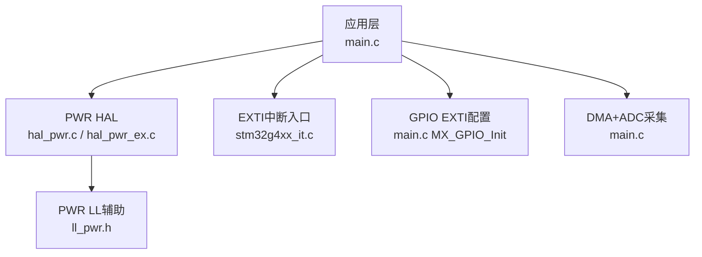
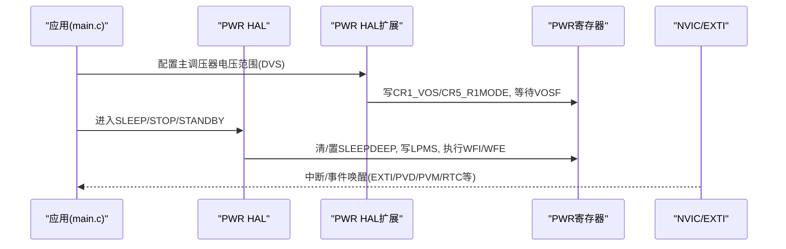
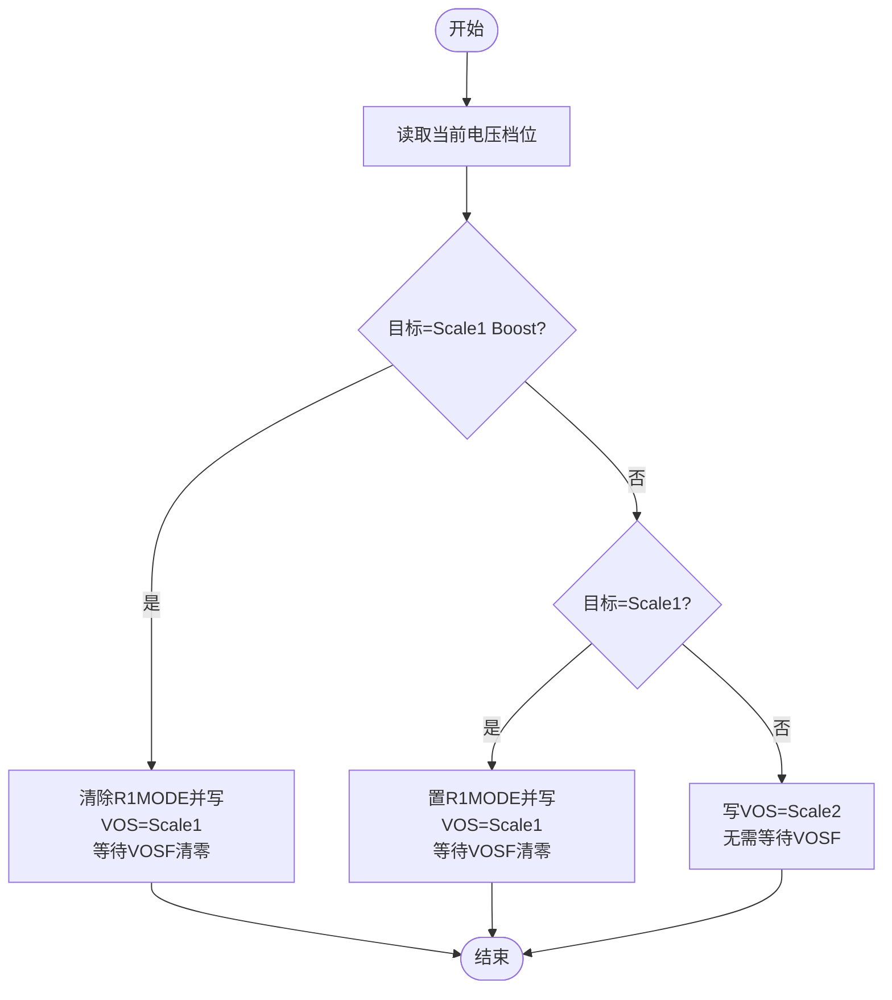
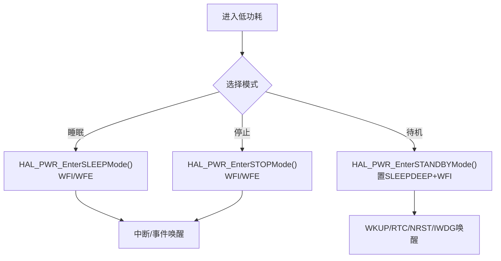
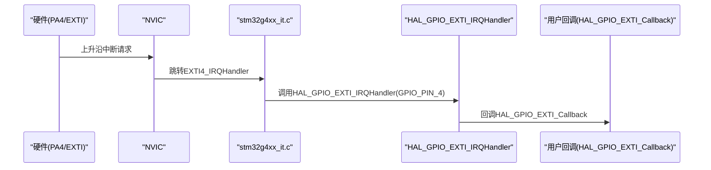
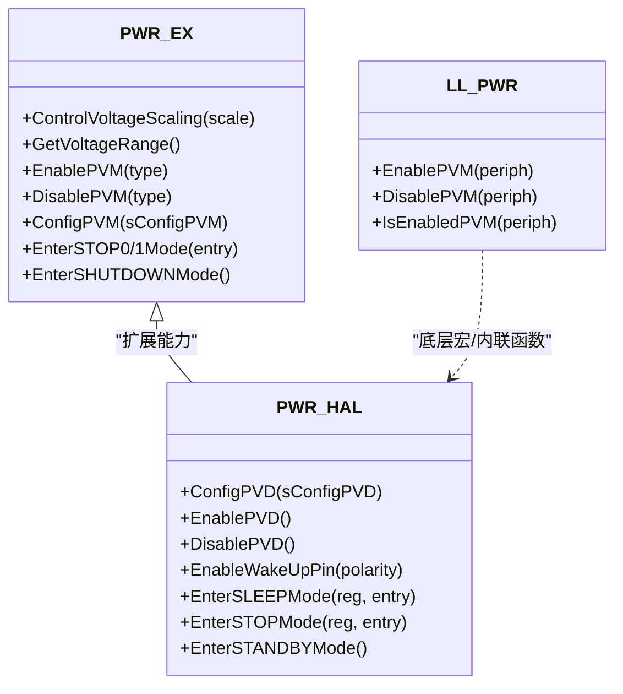
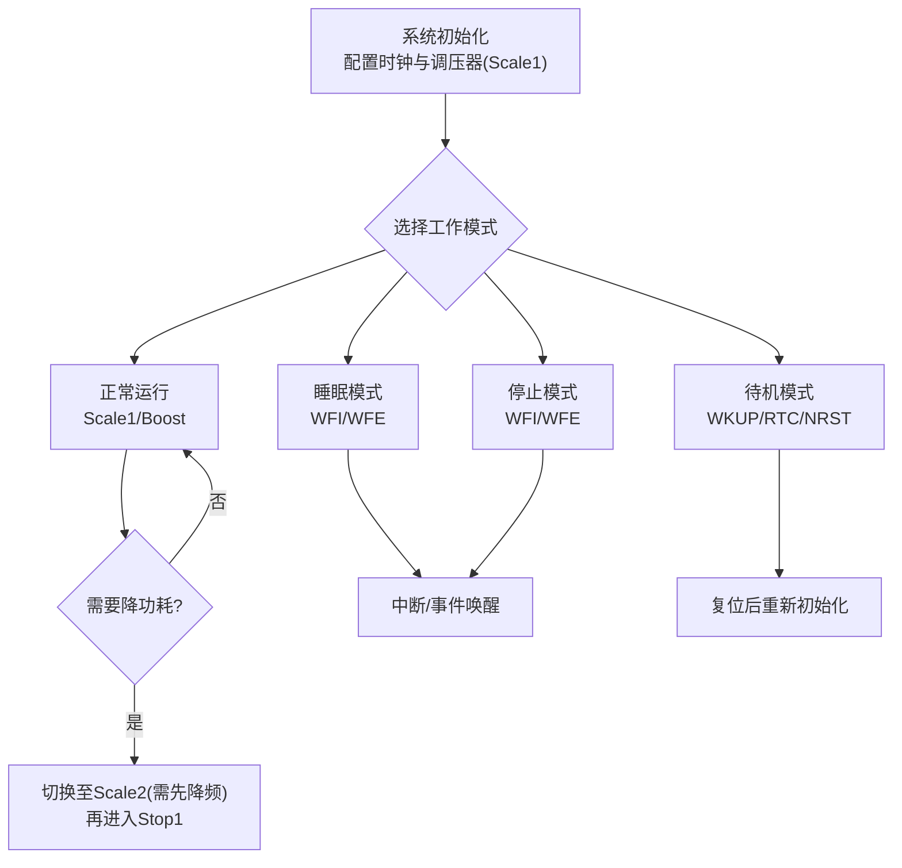
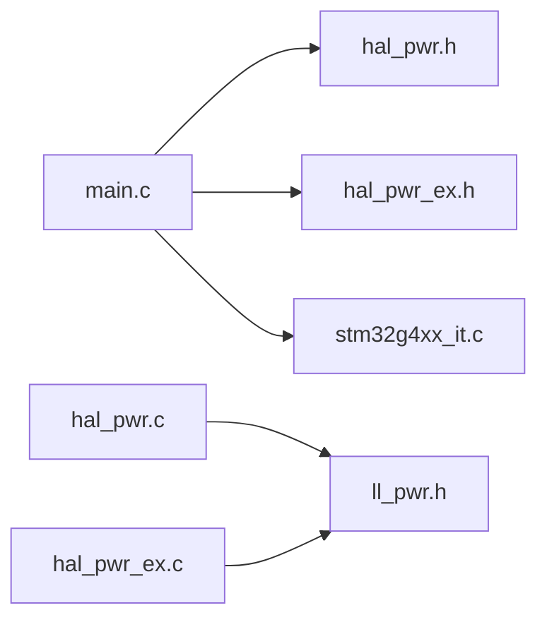

# 电源管理

<cite>
**本文引用的文件列表**
- [Core/Src/main.c](file://Core/Src/main.c)
- [Core/Inc/main.h](file://Core/Inc/main.h)
- [Core/Src/stm32g4xx_it.c](file://Core/Src/stm32g4xx_it.c)
- [Drivers/STM32G4xx_HAL_Driver/Inc/stm32g4xx_hal_pwr.h](file://Drivers/STM32G4xx_HAL_Driver/Inc/stm32g4xx_hal_pwr.h)
- [Drivers/STM32G4xx_HAL_Driver/Inc/stm32g4xx_hal_pwr_ex.h](file://Drivers/STM32G4xx_HAL_Driver/Inc/stm32g4xx_hal_pwr_ex.h)
- [Drivers/STM32G4xx_HAL_Driver/Src/stm32g4xx_hal_pwr.c](file://Drivers/STM32G4xx_HAL_Driver/Src/stm32g4xx_hal_pwr.c)
- [Drivers/STM32G4xx_HAL_Driver/Src/stm32g4xx_hal_pwr_ex.c](file://Drivers/STM32G4xx_HAL_Driver/Src/stm32g4xx_hal_pwr_ex.c)
- [Drivers/STM32G4xx_HAL_Driver/Inc/stm32g4xx_ll_pwr.h](file://Drivers/STM32G4xx_HAL_Driver/Inc/stm32g4xx_ll_pwr.h)
</cite>

## 目录
1. [简介](#简介)
2. [项目结构](#项目结构)
3. [核心组件](#核心组件)
4. [架构总览](#架构总览)
5. [详细组件分析](#详细组件分析)
6. [依赖关系分析](#依赖关系分析)
7. [性能与功耗考量](#性能与功耗考量)
8. [故障排查指南](#故障排查指南)
9. [结论](#结论)
10. [附录](#附录)

## 简介
本文件面向STM32G474的电源管理与低功耗模式，结合工程中的HAL驱动与用户代码，系统阐述：
- 低功耗模式（睡眠、停止、待机）的特性、唤醒源与中断处理流程
- 内部电压调节器配置与动态电压调节（DVS）
- 电源监控（PVD/PVM）与欠压复位机制
- 功耗优化策略与测量方法
- 电池供电应用的最佳实践
- 提供模式切换流程图与对比图表

## 项目结构
本项目基于STM32CubeMX生成的框架，包含：
- 应用层：main.c、中断服务程序stm32g4xx_it.c
- HAL驱动：PWR模块接口与实现（hal_pwr.h/.c、hal_pwr_ex.h/.c）、LL层辅助宏（ll_pwr.h）
- 外设初始化：ADC/DMA/USB/GPIO等（与本主题相关的是GPIO EXTI与DMA触发路径）



图示来源
- [Core/Src/main.c:219-290](file://Core/Src/main.c#L219-L290)
- [Core/Src/stm32g4xx_it.c:205-214](file://Core/Src/stm32g4xx_it.c#L205-L214)
- [Drivers/STM32G4xx_HAL_Driver/Src/stm32g4xx_hal_pwr.c:441-484](file://Drivers/STM32G4xx_HAL_Driver/Src/stm32g4xx_hal_pwr.c#L441-L484)
- [Drivers/STM32G4xx_HAL_Driver/Src/stm32g4xx_hal_pwr_ex.c:153-226](file://Drivers/STM32G4xx_HAL_Driver/Src/stm32g4xx_hal_pwr_ex.c#L153-L226)

章节来源
- [Core/Src/main.c:219-290](file://Core/Src/main.c#L219-L290)
- [Core/Src/stm32g4xx_it.c:205-214](file://Core/Src/stm32g4xx_it.c#L205-L214)

## 核心组件
- PWR HAL接口：提供进入睡眠/停止/待机、唤醒引脚配置、PVD/PVM控制、低功率运行模式等API
- PWR扩展接口：动态电压调节（DVS）、Stop0/Stop1/Shutdown、SRAM2保持、GPIO在Standby/Shutdown的上下拉配置
- LL辅助：直接操作PWR寄存器位域（如PVM使能/查询）
- 应用侧：通过SystemClock_Config设置主调压器电压范围；通过GPIO EXTI作为外部事件/中断源；通过DMA+ADC进行数据采集

章节来源
- [Drivers/STM32G4xx_HAL_Driver/Inc/stm32g4xx_hal_pwr.h:376-386](file://Drivers/STM32G4xx_HAL_Driver/Inc/stm32g4xx_hal_pwr.h#L376-L386)
- [Drivers/STM32G4xx_HAL_Driver/Inc/stm32g4xx_hal_pwr_ex.h:741-794](file://Drivers/STM32G4xx_HAL_Driver/Inc/stm32g4xx_hal_pwr_ex.h#L741-L794)
- [Drivers/STM32G4xx_HAL_Driver/Inc/stm32g4xx_ll_pwr.h:604-651](file://Drivers/STM32G4xx_HAL_Driver/Inc/stm32g4xx_ll_pwr.h#L604-L651)
- [Core/Src/main.c:296-337](file://Core/Src/main.c#L296-L337)

## 架构总览
下图展示从应用调用到硬件寄存器的关键路径，包括动态电压调节与低功耗模式入口。



图示来源
- [Core/Src/main.c:296-337](file://Core/Src/main.c#L296-L337)
- [Drivers/STM32G4xx_HAL_Driver/Src/stm32g4xx_hal_pwr_ex.c:153-226](file://Drivers/STM32G4xx_HAL_Driver/Src/stm32g4xx_hal_pwr_ex.c#L153-L226)
- [Drivers/STM32G4xx_HAL_Driver/Src/stm32g4xx_hal_pwr.c:441-484](file://Drivers/STM32G4xx_HAL_Driver/Src/stm32g4xx_hal_pwr.c#L441-L484)
- [Drivers/STM32G4xx_HAL_Driver/Src/stm32g4xx_hal_pwr.c:516-529](file://Drivers/STM32G4xx_HAL_Driver/Src/stm32g4xx_hal_pwr.c#L516-L529)
- [Drivers/STM32G4xx_HAL_Driver/Src/stm32g4xx_hal_pwr.c:549-563](file://Drivers/STM32G4xx_HAL_Driver/Src/stm32g4xx_hal_pwr.c#L549-L563)

## 详细组件分析

### 动态电压调节（DVS）与系统时钟
- 功能要点
  - 支持Scale1 Boost/Scale1/Scale2三档，对应不同最大频率与典型内核电压
  - Scale2→Scale1需等待VOSF标志清除；Scale1→Scale2前需先降频至低于26 MHz
  - 工程中在SystemClock_Config中调用API设置Scale1
- 关键API与宏
  - HAL_PWREx_ControlVoltageScaling()
  - __HAL_PWR_VOLTAGESCALING_CONFIG()
  - HAL_PWREx_GetVoltageRange()
- 注意事项
  - 切换顺序与时序要求严格，避免不稳定或超时返回



图示来源
- [Drivers/STM32G4xx_HAL_Driver/Src/stm32g4xx_hal_pwr_ex.c:153-226](file://Drivers/STM32G4xx_HAL_Driver/Src/stm32g4xx_hal_pwr_ex.c#L153-L226)
- [Drivers/STM32G4xx_HAL_Driver/Inc/stm32g4xx_hal_pwr_ex.h:654-660](file://Drivers/STM32G4xx_HAL_Driver/Inc/stm32g4xx_hal_pwr_ex.h#L654-L660)
- [Core/Src/main.c:296-337](file://Core/Src/main.c#L296-L337)

章节来源
- [Core/Src/main.c:296-337](file://Core/Src/main.c#L296-L337)
- [Drivers/STM32G4xx_HAL_Driver/Src/stm32g4xx_hal_pwr_ex.c:153-226](file://Drivers/STM32G4xx_HAL_Driver/Src/stm32g4xx_hal_pwr_ex.c#L153-L226)

### 低功耗模式：睡眠（Sleep）、停止（Stop）、待机（Standby）
- 睡眠模式（Sleep/Low-power Sleep）
  - 入口：HAL_PWR_EnterSLEEPMode(Regulator, Entry)
  - 退出：任意NVIC中断或事件（WFI/WFE）
  - 低功率睡眠需在低功率运行模式下且系统时钟<2 MHz
- 停止模式（Stop0/Stop1）
  - 入口：HAL_PWR_EnterSTOPMode(Regulator, Entry) 或 HAL_PWREx_EnterSTOP0/1Mode
  - 退出：EXTI中断/事件、部分外设唤醒（USART/I2C/LPUART等）
  - Stop1启动延迟略长但功耗更低
- 待机模式（Standby）
  - 入口：HAL_PWR_EnterSTANDBYMode()
  - 退出：WKUP引脚上升沿、RTC闹钟/唤醒、NRST复位、看门狗复位等
  - SRAM2可保留内容（需启用RRS），其余SRAM/寄存器丢失



图示来源
- [Drivers/STM32G4xx_HAL_Driver/Src/stm32g4xx_hal_pwr.c:441-484](file://Drivers/STM32G4xx_HAL_Driver/Src/stm32g4xx_hal_pwr.c#L441-L484)
- [Drivers/STM32G4xx_HAL_Driver/Src/stm32g4xx_hal_pwr.c:516-529](file://Drivers/STM32G4xx_HAL_Driver/Src/stm32g4xx_hal_pwr.c#L516-L529)
- [Drivers/STM32G4xx_HAL_Driver/Src/stm32g4xx_hal_pwr.c:549-563](file://Drivers/STM32G4xx_HAL_Driver/Src/stm32g4xx_hal_pwr.c#L549-L563)

章节来源
- [Drivers/STM32G4xx_HAL_Driver/Src/stm32g4xx_hal_pwr.c:441-484](file://Drivers/STM32G4xx_HAL_Driver/Src/stm32g4xx_hal_pwr.c#L441-L484)
- [Drivers/STM32G4xx_HAL_Driver/Src/stm32g4xx_hal_pwr.c:516-529](file://Drivers/STM32G4xx_HAL_Driver/Src/stm32g4xx_hal_pwr.c#L516-L529)
- [Drivers/STM32G4xx_HAL_Driver/Src/stm32g4xx_hal_pwr.c:549-563](file://Drivers/STM32G4xx_HAL_Driver/Src/stm32g4xx_hal_pwr.c#L549-L563)

### 唤醒源与中断处理流程
- 外部引脚唤醒
  - 使用HAL_PWR_EnableWakeUpPin()配置极性并启用WKUP引脚
  - 工程中PA4配置为上升沿EXTI，进入HAL_GPIO_EXTI_Callback处理
- PVD/PVM事件/中断
  - PVD：阈值可编程，支持边沿触发事件/中断
  - PVM：对VDDUSB/VDDIO2/VDDA等多路电源监测，支持事件/中断
- 中断链路
  - 硬件EXTI → NVIC → stm32g4xx_it.c中的EXTI4_IRQHandler → HAL_GPIO_EXTI_IRQHandler → 用户回调



图示来源
- [Core/Src/stm32g4xx_it.c:205-214](file://Core/Src/stm32g4xx_it.c#L205-L214)
- [Core/Src/main.c:91-113](file://Core/Src/main.c#L91-L113)
- [Drivers/STM32G4xx_HAL_Driver/Src/stm32g4xx_hal_pwr.c:388-414](file://Drivers/STM32G4xx_HAL_Driver/Src/stm32g4xx_hal_pwr.c#L388-L414)

章节来源
- [Core/Src/stm32g4xx_it.c:205-214](file://Core/Src/stm32g4xx_it.c#L205-L214)
- [Core/Src/main.c:91-113](file://Core/Src/main.c#L91-L113)
- [Drivers/STM32G4xx_HAL_Driver/Src/stm32g4xx_hal_pwr.c:388-414](file://Drivers/STM32G4xx_HAL_Driver/Src/stm32g4xx_hal_pwr.c#L388-L414)

### 电源监控与欠压复位（PVD/PVM）
- PVD（可编程电压检测）
  - 阈值级别：约2.0V~2.9V及外部比较模式
  - 模式：正常/中断/事件，支持上升/下降/双边沿
  - 状态位：PVDO标志，可通过宏查询
- PVM（外设电压监控）
  - 监控VDDUSB/VDDIO2/VDDA等，分别有独立阈值
  - 支持事件/中断，提供专用EXTI线与回调
- 工程现状
  - 未显式启用PVD/PVM，但HAL提供了完整配置与中断处理接口



图示来源
- [Drivers/STM32G4xx_HAL_Driver/Inc/stm32g4xx_hal_pwr.h:367-386](file://Drivers/STM32G4xx_HAL_Driver/Inc/stm32g4xx_hal_pwr.h#L367-L386)
- [Drivers/STM32G4xx_HAL_Driver/Inc/stm32g4xx_hal_pwr_ex.h:741-794](file://Drivers/STM32G4xx_HAL_Driver/Inc/stm32g4xx_hal_pwr_ex.h#L741-L794)
- [Drivers/STM32G4xx_HAL_Driver/Inc/stm32g4xx_ll_pwr.h:604-651](file://Drivers/STM32G4xx_HAL_Driver/Inc/stm32g4xx_ll_pwr.h#L604-L651)

章节来源
- [Drivers/STM32G4xx_HAL_Driver/Inc/stm32g4xx_hal_pwr.h:68-95](file://Drivers/STM32G4xx_HAL_Driver/Inc/stm32g4xx_hal_pwr.h#L68-95)
- [Drivers/STM32G4xx_HAL_Driver/Inc/stm32g4xx_hal_pwr_ex.h:98-125](file://Drivers/STM32G4xx_HAL_Driver/Inc/stm32g4xx_hal_pwr_ex.h#L98-125)
- [Drivers/STM32G4xx_HAL_Driver/Src/stm32g4xx_hal_pwr.c:308-347](file://Drivers/STM32G4xx_HAL_Driver/Src/stm32g4xx_hal_pwr.c#L308-L347)
- [Drivers/STM32G4xx_HAL_Driver/Src/stm32g4xx_hal_pwr_ex.c:631-680](file://Drivers/STM32G4xx_HAL_Driver/Src/stm32g4xx_hal_pwr_ex.c#L631-L680)

### 模式切换流程图（含DVS与唤醒）


图示来源
- [Core/Src/main.c:296-337](file://Core/Src/main.c#L296-L337)
- [Drivers/STM32G4xx_HAL_Driver/Src/stm32g4xx_hal_pwr_ex.c:153-226](file://Drivers/STM32G4xx_HAL_Driver/Src/stm32g4xx_hal_pwr_ex.c#L153-L226)
- [Drivers/STM32G4xx_HAL_Driver/Src/stm32g4xx_hal_pwr.c:441-484](file://Drivers/STM32G4xx_HAL_Driver/Src/stm32g4xx_hal_pwr.c#L441-L484)
- [Drivers/STM32G4xx_HAL_Driver/Src/stm32g4xx_hal_pwr.c:516-529](file://Drivers/STM32G4xx_HAL_Driver/Src/stm32g4xx_hal_pwr.c#L516-L529)
- [Drivers/STM32G4xx_HAL_Driver/Src/stm32g4xx_hal_pwr.c:549-563](file://Drivers/STM32G4xx_HAL_Driver/Src/stm32g4xx_hal_pwr.c#L549-L563)

## 依赖关系分析
- 应用层依赖HAL PWR接口完成模式切换与唤醒配置
- HAL PWR依赖底层寄存器访问与LL辅助宏
- EXTI中断链路由CMSIS向量表、stm32g4xx_it.c与HAL GPIO EXTI回调组成
- 工程中已启用PWR时钟并在MSP中禁用UCPD死电池特性



图示来源
- [Core/Src/main.c:219-290](file://Core/Src/main.c#L219-L290)
- [Core/Src/stm32g4xx_it.c:205-214](file://Core/Src/stm32g4xx_it.c#L205-L214)
- [Drivers/STM32G4xx_HAL_Driver/Inc/stm32g4xx_hal_pwr.h:376-386](file://Drivers/STM32G4xx_HAL_Driver/Inc/stm32g4xx_hal_pwr.h#L376-L386)
- [Drivers/STM32G4xx_HAL_Driver/Inc/stm32g4xx_hal_pwr_ex.h:741-794](file://Drivers/STM32G4xx_HAL_Driver/Inc/stm32g4xx_hal_pwr_ex.h#L741-L794)
- [Drivers/STM32G4xx_HAL_Driver/Inc/stm32g4xx_ll_pwr.h:604-651](file://Drivers/STM32G4xx_HAL_Driver/Inc/stm32g4xx_ll_pwr.h#L604-L651)

章节来源
- [Core/Src/main.c:219-290](file://Core/Src/main.c#L219-L290)
- [Core/Src/stm32g4xx_it.c:205-214](file://Core/Src/stm32g4xx_it.c#L205-L214)

## 性能与功耗考量
- 模式功耗对比（定性）
  - 运行模式 > 睡眠模式 ≈ 低功率睡眠模式 > 停止模式（Stop0 > Stop1）> 待机模式 > 关机模式
  - 停机时间越长，越倾向使用Stop/Standby以显著降低平均功耗
- 动态电压调节
  - Scale2可降低功耗但限制最高频率；适合间歇任务或传感器采样场景
  - Scale1/Boost用于高性能阶段，完成后尽快回退到低频/低功耗模式
- 唤醒开销
  - Stop1唤醒延迟大于Stop0；频繁短周期唤醒建议用Stop0或睡眠模式
  - 待机模式唤醒后相当于复位，需快速恢复上下文（可利用SRAM2保持）
- 中断与事件
  - 使用事件模式（WFE）可减少中断开销，适用于无CPU参与的事件流
  - 合理屏蔽无关中断，避免Tick中断导致意外唤醒
- 测量方法
  - 使用微安表/电源分析仪串联VDD测量静态电流
  - 利用示波器捕捉唤醒前后电流阶跃，评估唤醒时间与瞬态峰值
  - 软件打点记录进入/退出低功耗的时间戳，估算占空比与平均功耗

[本节为通用指导，不直接分析具体文件]

## 故障排查指南
- 无法进入低功耗
  - 检查是否处于低功率运行模式且系统时钟满足条件（低功率睡眠需<2 MHz）
  - 确认未开启会阻止进入低功耗的外设或中断
- 唤醒异常或频繁唤醒
  - 核查EXTI触发边沿与极性配置
  - 检查PVD/PVM事件是否误触发
  - 确认Tick中断未被用作唤醒源
- 动态电压调节失败
  - 确保Scale1→Scale2前先降频至<26 MHz
  - 关注VOSF标志与超时返回码
- 待机模式数据丢失
  - 如需保留SRAM2，请在进入前启用SRAM2保持功能

章节来源
- [Drivers/STM32G4xx_HAL_Driver/Src/stm32g4xx_hal_pwr.c:441-484](file://Drivers/STM32G4xx_HAL_Driver/Src/stm32g4xx_hal_pwr.c#L441-L484)
- [Drivers/STM32G4xx_HAL_Driver/Src/stm32g4xx_hal_pwr_ex.c:153-226](file://Drivers/STM32G4xx_HAL_Driver/Src/stm32g4xx_hal_pwr_ex.c#L153-L226)
- [Drivers/STM32G4xx_HAL_Driver/Src/stm32g4xx_hal_pwr.c:549-563](file://Drivers/STM32G4xx_HAL_Driver/Src/stm32g4xx_hal_pwr.c#L549-L563)

## 结论
- STM32G474提供丰富的低功耗模式与灵活的电源监控能力
- 通过DVS与合适的模式组合，可在性能与功耗间取得良好平衡
- 正确配置唤醒源与中断，是实现稳定低功耗的关键
- 建议在电池应用中采用“高频短时+深度休眠”的策略，并结合PVD/PVM保障可靠性

[本节为总结性内容，不直接分析具体文件]

## 附录

### 功耗对比图表（示意）
```mermaid
barChart
title "各模式相对功耗示意"
xaxis "模式"
yaxis "相对功耗"
bar "运行" 100
bar "睡眠" 20
bar "低功率睡眠" 15
bar "Stop0" 5
bar "Stop1" 3
bar "待机" 1
bar "关机" 0.5
```

[该图为概念示意，非实测数据]

### 电池供电最佳实践
- 默认使用Scale1，仅在必要时切换到Scale2以降低功耗
- 空闲时进入Stop1，唤醒间隔较长时使用待机并启用SRAM2保持
- 启用PVD/PVM，设置合理的阈值与事件/中断，及时响应掉电风险
- 减少唤醒次数，合并任务，批量处理数据
- 关闭不必要的外设与上拉/下拉，避免漏电流
- 使用事件模式（WFE）配合DMA，降低CPU参与带来的额外功耗

[本节为通用指导，不直接分析具体文件]