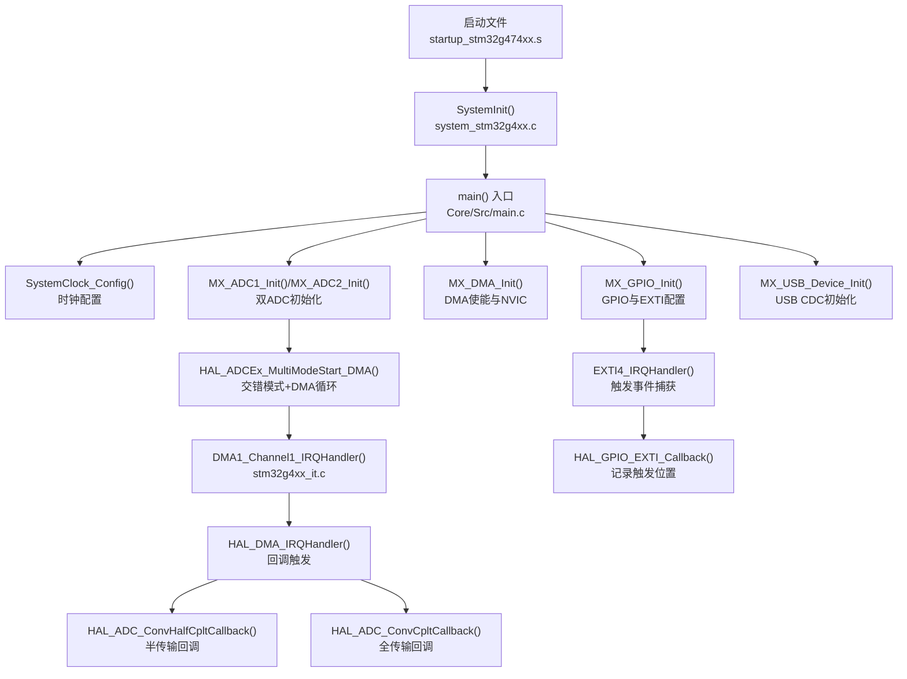
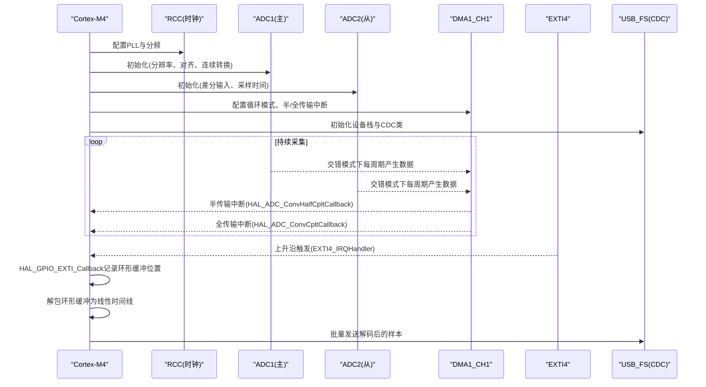
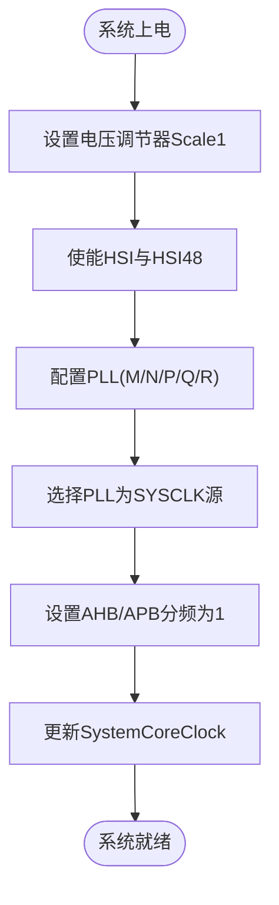
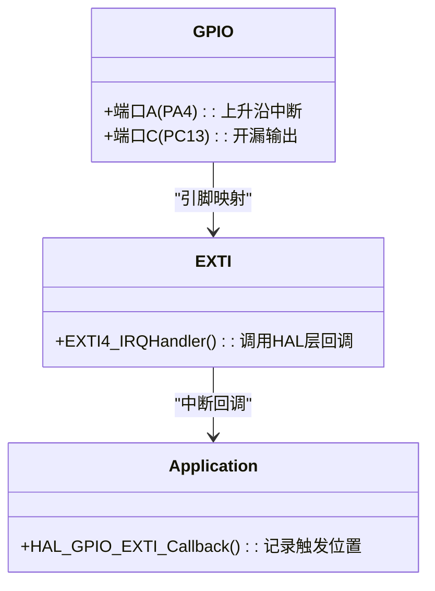
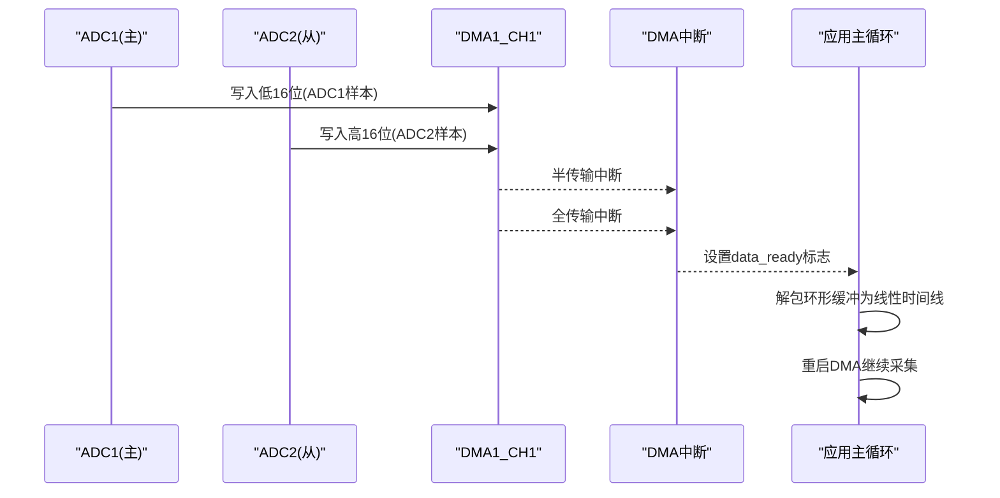
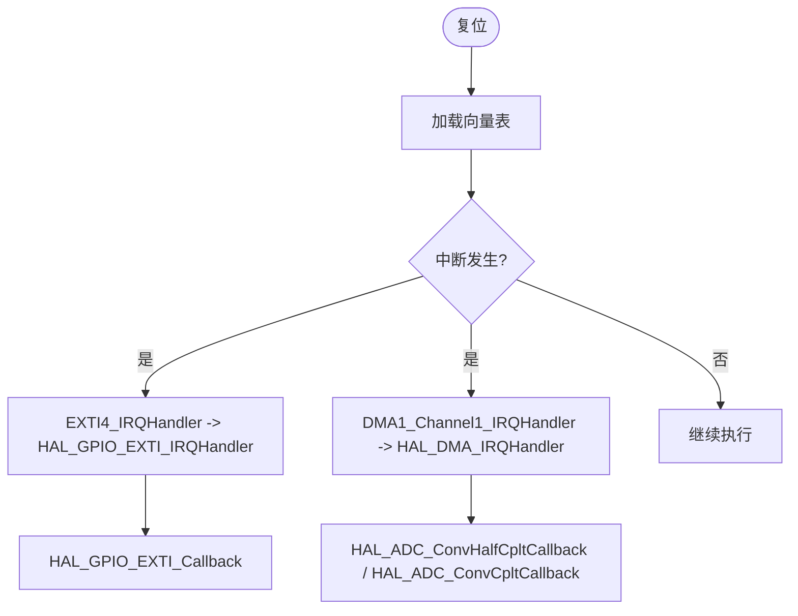
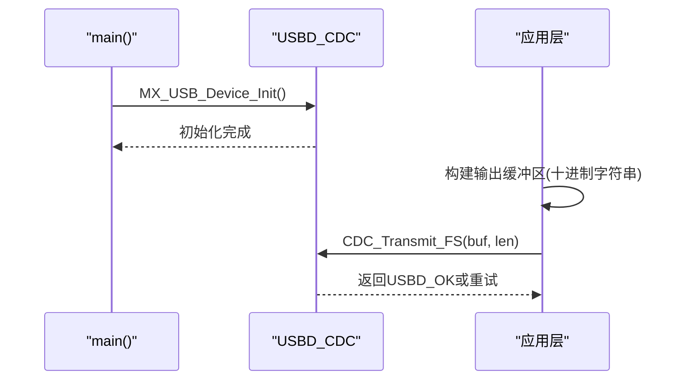
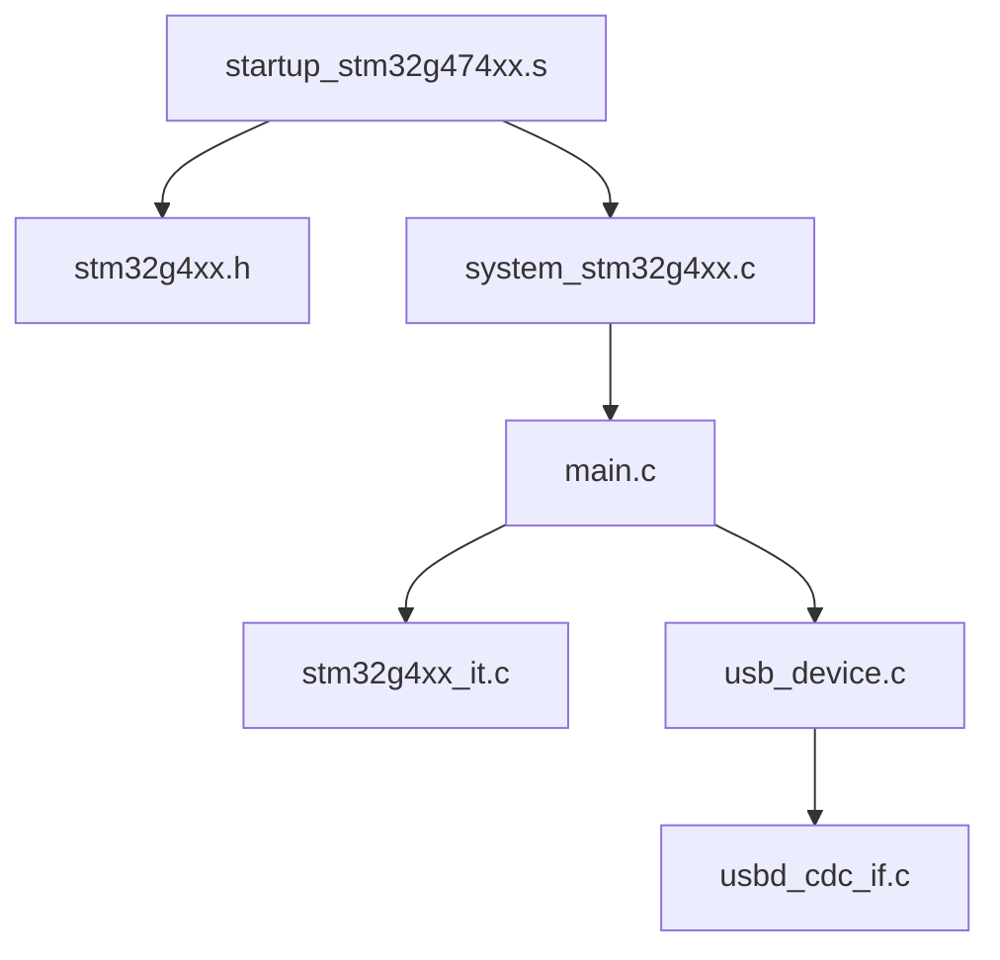

# 硬件平台和架构

<cite>
**本文引用的文件**   
- [main.c](file://Core/Src/main.c)
- [main.h](file://Core/Inc/main.h)
- [system_stm32g4xx.c](file://Core/Src/system_stm32g4xx.c)
- [stm32g4xx_hal_conf.h](file://Core/Inc/stm32g4xx_hal_conf.h)
- [startup_stm32g474xx.s](file://startup_stm32g474xx.s)
- [stm32g4xx_it.c](file://Core/Src/stm32g4xx_it.c)
- [stm32g4xx_it.h](file://Core/Inc/stm32g4xx_it.h)
- [stm32g4xx.h](file://Drivers/CMSIS/Device/ST/STM32G4xx/Include/stm32g4xx.h)
- [stm32g4xx_hal_adc.h](file://Drivers/STM32G4xx_HAL_Driver/Inc/stm32g4xx_hal_adc.h)
- [stm32g4xx_hal_adc_ex.h](file://Drivers/STM32G4xx_HAL_Driver/Inc/stm32g4xx_hal_adc_ex.h)
- [usb_device.c](file://USB_Device/App/usb_device.c)
- [usbd_cdc_if.c](file://USB_Device/App/usbd_cdc_if.c)
</cite>

## 目录
1. [简介](#简介)
2. [项目结构](#项目结构)
3. [核心组件](#核心组件)
4. [架构总览](#架构总览)
5. [详细组件分析](#详细组件分析)
6. [依赖关系分析](#依赖关系分析)
7. [性能考虑](#性能考虑)
8. [故障排查指南](#故障排查指南)
9. [结论](#结论)
10. [附录](#附录)

## 简介
本文件面向STM32G474微控制器的硬件平台与架构，围绕Cortex-M4内核特性、存储器映射、外设总线架构与时钟树配置展开，并结合工程中的实际初始化与中断处理代码，解释GPIO引脚分配、中断优先级设置与电源管理配置。文档重点剖析STM32G4系列高性能ADC的双通道交错模式（Interleaved）工作原理，给出数据流时序与DMA协作机制，并说明USB CDC作为调试与数据输出通道的集成方式。文末提供架构图与时序图，帮助初学者理解嵌入式系统基础概念，同时为高级开发者提供深入的技术细节与优化建议。

## 项目结构
该工程采用CubeMX生成的标准分层结构：
- Core/Src 与 Core/Inc：应用主循环、系统初始化、中断服务程序、HAL配置等
- Drivers/CMSIS：设备头文件与启动文件，定义向量表与系统时钟更新逻辑
- Drivers/STM32G4xx_HAL_Driver：HAL驱动接口与实现
- USB_Device：USB设备栈与CDC类实现
- 链接脚本与启动汇编：定义内存布局与复位流程

图表来源
- [startup_stm32g474xx.s:58-106](file://startup_stm32g474xx.s#L58-L106)
- [system_stm32g4xx.c:181-192](file://Core/Src/system_stm32g4xx.c#L181-L192)
- [main.c:219-290](file://Core/Src/main.c#L219-L290)
- [stm32g4xx_it.c:205-228](file://Core/Src/stm32g4xx_it.c#L205-L228)

章节来源
- [startup_stm32g474xx.s:58-106](file://startup_stm32g474xx.s#L58-L106)
- [system_stm32g4xx.c:181-192](file://Core/Src/system_stm32g4xx.c#L181-L192)
- [main.c:219-290](file://Core/Src/main.c#L219-L290)

## 核心组件
- Cortex-M4内核与FPU：启动阶段启用FPU访问权限，支持浮点运算加速；向量表位于Flash起始地址，复位后进入Thread模式、特权级、主堆栈。
- 系统时钟与电源：默认HSI 16MHz，通过PLL倍频至更高主频；电压调节器设置为Scale1以支持较高频率；AHB/APB分频均为1。
- ADC双通道交错模式：ADC1为主、ADC2为从，配置为交错模式（INTERL），共享DMA通道，将两路12位结果打包到32位字中（低16位=ADC1，高16位=ADC2）。
- DMA与中断：DMA1通道1负责ADC数据搬运，开启半传输与全传输中断；EXTI4用于外部触发事件，在ISR中快速记录环形缓冲区写入位置。
- USB CDC：USB FS设备栈初始化，注册CDC类与接口，提供虚拟串口用于上位机通信与波形导出。

章节来源
- [startup_stm32g474xx.s:133-253](file://startup_stm32g474xx.s#L133-L253)
- [system_stm32g4xx.c:181-192](file://Core/Src/system_stm32g4xx.c#L181-L192)
- [main.c:296-337](file://Core/Src/main.c#L296-L337)
- [main.c:344-464](file://Core/Src/main.c#L344-L464)
- [main.c:469-481](file://Core/Src/main.c#L469-L481)
- [usb_device.c:66-88](file://USB_Device/App/usb_device.c#L66-L88)

## 架构总览
下图展示从复位到数据采集、触发捕获与USB输出的整体交互关系，涵盖内核、RCC、ADC、DMA、EXTI与USB的协作。

图表来源
- [main.c:296-337](file://Core/Src/main.c#L296-L337)
- [main.c:344-464](file://Core/Src/main.c#L344-L464)
- [main.c:469-481](file://Core/Src/main.c#L469-L481)
- [main.c:91-149](file://Core/Src/main.c#L91-L149)
- [usb_device.c:66-88](file://USB_Device/App/usb_device.c#L66-L88)

## 详细组件分析

### 时钟树与电源管理
- 电源调节器：使用Scale1以获得更高工作频率下的稳定性。
- 振荡器：HSI与HSI48均开启，HSI48用于USB FS所需的48MHz时钟源。
- PLL配置：以HSI为源，M/N/P/Q/R分频系数按工程设定，SYSCLK选择PLL输出，AHB/APB不分频。
- 时钟更新：SystemCoreClockUpdate根据RCC寄存器计算当前HCLK，供SysTick与延时函数使用。

图表来源
- [main.c:296-337](file://Core/Src/main.c#L296-L337)
- [system_stm32g4xx.c:230-272](file://Core/Src/system_stm32g4xx.c#L230-L272)

章节来源
- [main.c:296-337](file://Core/Src/main.c#L296-L337)
- [system_stm32g4xx.c:230-272](file://Core/Src/system_stm32g4xx.c#L230-L272)

### GPIO与EXTI触发
- PA4配置为上升沿中断，用于外部触发信号捕获。
- PC13配置为开漏输出（低电平点亮LED），便于指示状态。
- EXTI4中断优先级设为最高，确保触发事件及时响应。

图表来源
- [main.c:488-520](file://Core/Src/main.c#L488-L520)
- [stm32g4xx_it.c:205-214](file://Core/Src/stm32g4xx_it.c#L205-L214)
- [main.c:91-113](file://Core/Src/main.c#L91-L113)

章节来源
- [main.c:488-520](file://Core/Src/main.c#L488-L520)
- [stm32g4xx_it.c:205-214](file://Core/Src/stm32g4xx_it.c#L205-L214)
- [main.c:91-113](file://Core/Src/main.c#L91-L113)

### DMA与ADC交错模式
- DMA1通道1配置为循环模式，接收ADC1_2多模式合并后的32位数据。
- 半传输与全传输中断用于判定采集窗口完成，保证至少包含预触发与后触发样本。
- 交错模式（INTERL）下，ADC1与ADC2交替采样，数据打包为“低16位=ADC1，高16位=ADC2”。

图表来源
- [main.c:469-481](file://Core/Src/main.c#L469-L481)
- [main.c:344-464](file://Core/Src/main.c#L344-L464)
- [main.c:119-149](file://Core/Src/main.c#L119-L149)

章节来源
- [main.c:469-481](file://Core/Src/main.c#L469-L481)
- [main.c:344-464](file://Core/Src/main.c#L344-L464)
- [main.c:119-149](file://Core/Src/main.c#L119-L149)

### 中断优先级与异常处理
- 向量表由启动文件定义，所有中断默认指向弱定义Default_Handler，用户可覆盖具体ISR。
- EXTI4与DMA1通道1中断优先级设为最高，确保实时性。
- SysTick中断用于HAL时基递增。

图表来源
- [startup_stm32g474xx.s:133-253](file://startup_stm32g474xx.s#L133-L253)
- [stm32g4xx_it.c:205-228](file://Core/Src/stm32g4xx_it.c#L205-L228)
- [main.c:91-149](file://Core/Src/main.c#L91-L149)

章节来源
- [startup_stm32g474xx.s:133-253](file://startup_stm32g474xx.s#L133-L253)
- [stm32g4xx_it.c:205-228](file://Core/Src/stm32g4xx_it.c#L205-L228)
- [main.c:91-149](file://Core/Src/main.c#L91-L149)

### USB CDC数据输出
- USB FS设备栈初始化，注册CDC类与接口，提供虚拟串口。
- 主循环在数据准备好后，将解码后的样本转换为字符串并通过CDC_Transmit_FS发送。

图表来源
- [usb_device.c:66-88](file://USB_Device/App/usb_device.c#L66-L88)
- [main.c:178-212](file://Core/Src/main.c#L178-L212)

章节来源
- [usb_device.c:66-88](file://USB_Device/App/usb_device.c#L66-L88)
- [main.c:178-212](file://Core/Src/main.c#L178-L212)

### 硬件资源分配策略
- GPIO分配：PA4用于触发输入（EXTI4），PC13用于LED指示。
- 中断优先级：EXTI4与DMA1通道1设为最高优先级，确保触发与数据搬运的实时性。
- 电源管理：Scale1供电，满足高频运行需求；HSI48为USB FS提供稳定48MHz时钟。
- ADC资源：ADC1与ADC2共用同一通道号（差分对），交错模式提升采样率；DMA循环避免CPU干预。

章节来源
- [main.c:488-520](file://Core/Src/main.c#L488-L520)
- [main.c:469-481](file://Core/Src/main.c#L469-L481)
- [main.c:296-337](file://Core/Src/main.c#L296-L337)
- [main.c:344-464](file://Core/Src/main.c#L344-L464)

### 技术决策与选型理由
- 选择STM32G474的原因：具备高性能ADC与交错模式，适合高速采样场景；内置USB FS，便于调试与数据导出；Cortex-M4+FPU提供良好数学运算能力。
- 使用HAL与LL结合：HAL简化外设初始化与回调管理，LL可用于底层优化（如ADC相关）。
- 采用DMA+环形缓冲：降低CPU负载，提高吞吐；配合EXTI触发实现精准的时间窗捕获。
- USB CDC替代传统UART：无需额外硬件，便于上位机工具链集成。

章节来源
- [stm32g4xx_hal_adc.h:90-200](file://Drivers/STM32G4xx_HAL_Driver/Inc/stm32g4xx_hal_adc.h#L90-L200)
- [stm32g4xx_hal_adc_ex.h:80-200](file://Drivers/STM32G4xx_HAL_Driver/Inc/stm32g4xx_hal_adc_ex.h#L80-L200)
- [usb_device.c:66-88](file://USB_Device/App/usb_device.c#L66-L88)

## 依赖关系分析
- 启动文件依赖CMSIS设备头文件，定义向量表与复位流程。
- system_stm32g4xx.c依赖stm32g4xx.h，提供SystemInit与SystemCoreClockUpdate。
- main.c依赖HAL配置头与USB设备栈，协调各外设初始化与运行时逻辑。
- stm32g4xx_it.c依赖main.h与中断声明头，桥接硬件中断与HAL回调。

图表来源
- [startup_stm32g474xx.s:133-253](file://startup_stm32g474xx.s#L133-L253)
- [system_stm32g4xx.c:181-192](file://Core/Src/system_stm32g4xx.c#L181-L192)
- [main.c:219-290](file://Core/Src/main.c#L219-L290)
- [stm32g4xx_it.c:205-228](file://Core/Src/stm32g4xx_it.c#L205-L228)
- [usb_device.c:66-88](file://USB_Device/App/usb_device.c#L66-L88)

章节来源
- [startup_stm32g474xx.s:133-253](file://startup_stm32g474xx.s#L133-L253)
- [system_stm32g4xx.c:181-192](file://Core/Src/system_stm32g4xx.c#L181-L192)
- [main.c:219-290](file://Core/Src/main.c#L219-L290)
- [stm32g4xx_it.c:205-228](file://Core/Src/stm32g4xx_it.c#L205-L228)
- [usb_device.c:66-88](file://USB_Device/App/usb_device.c#L66-L88)

## 性能考虑
- 时钟与延迟：确保AHB/APB分频与Flash等待周期匹配，避免总线访问错误。
- ADC采样时间：根据分辨率与采样率调整采样周期，平衡精度与速度。
- DMA缓冲大小：环形缓冲需足够容纳预触发与后触发样本，避免溢出。
- 中断开销：EXTI与DMA中断应最小化处理逻辑，复杂操作移至主循环。
- USB吞吐：批量发送减少中断次数，提升带宽利用率。

[本节为通用指导，不直接分析具体文件]

## 故障排查指南
- 硬故障与总线错误：检查指针越界、未初始化外设或错误的寄存器访问。
- 中断未触发：确认NVIC优先级与使能位，验证引脚复用与EXTI映射。
- ADC数据异常：核对交错模式配置、DMA通道与中断回调是否匹配。
- USB无响应：检查设备描述符与接口注册，确认主机端驱动安装。

章节来源
- [stm32g4xx_it.c:70-193](file://Core/Src/stm32g4xx_it.c#L70-L193)
- [main.c:530-539](file://Core/Src/main.c#L530-L539)

## 结论
本架构基于STM32G474的Cortex-M4内核与高性能ADC，通过交错模式与DMA实现高速数据采集，结合EXTI触发与USB CDC输出，形成完整的信号采集与调试链路。合理的时钟与电源配置、中断优先级设置以及DMA缓冲策略，确保了系统的实时性与稳定性。对于初学者，本文提供了从复位到外设初始化的完整路径；对于高级开发者，交错模式的数据流与时序细节可作为进一步优化与扩展的基础。

[本节为总结，不直接分析具体文件]

## 附录
- 关键类型与宏：参考HAL ADC头文件中的结构体定义与枚举值，了解分辨率、对齐、扫描模式等参数含义。
- 设备选择：在stm32g4xx.h中启用目标设备宏，确保编译期正确包含对应头文件。

章节来源
- [stm32g4xx_hal_adc.h:90-200](file://Drivers/STM32G4xx_HAL_Driver/Inc/stm32g4xx_hal_adc.h#L90-L200)
- [stm32g4xx.h:110-138](file://Drivers/CMSIS/Device/ST/STM32G4xx/Include/stm32g4xx.h#L110-L138)