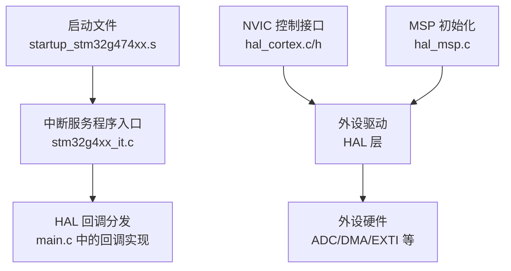
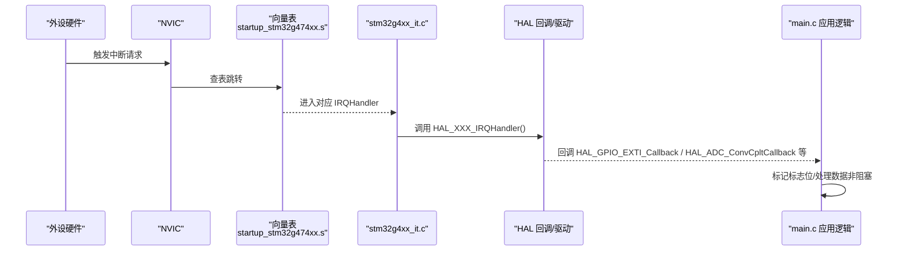
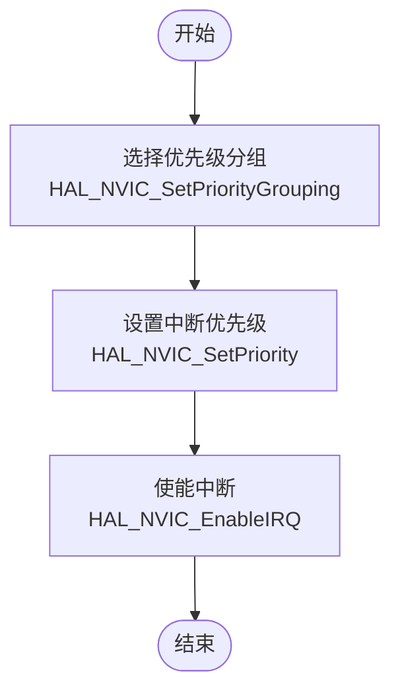
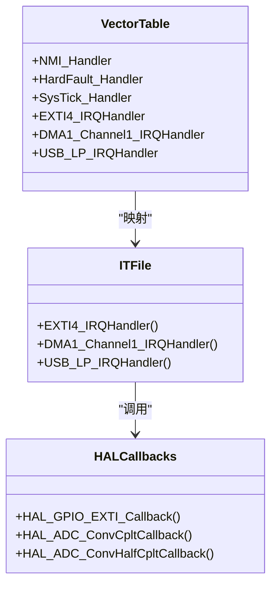
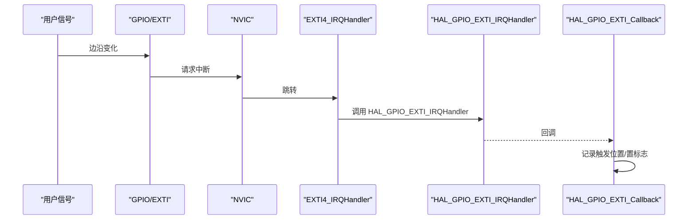
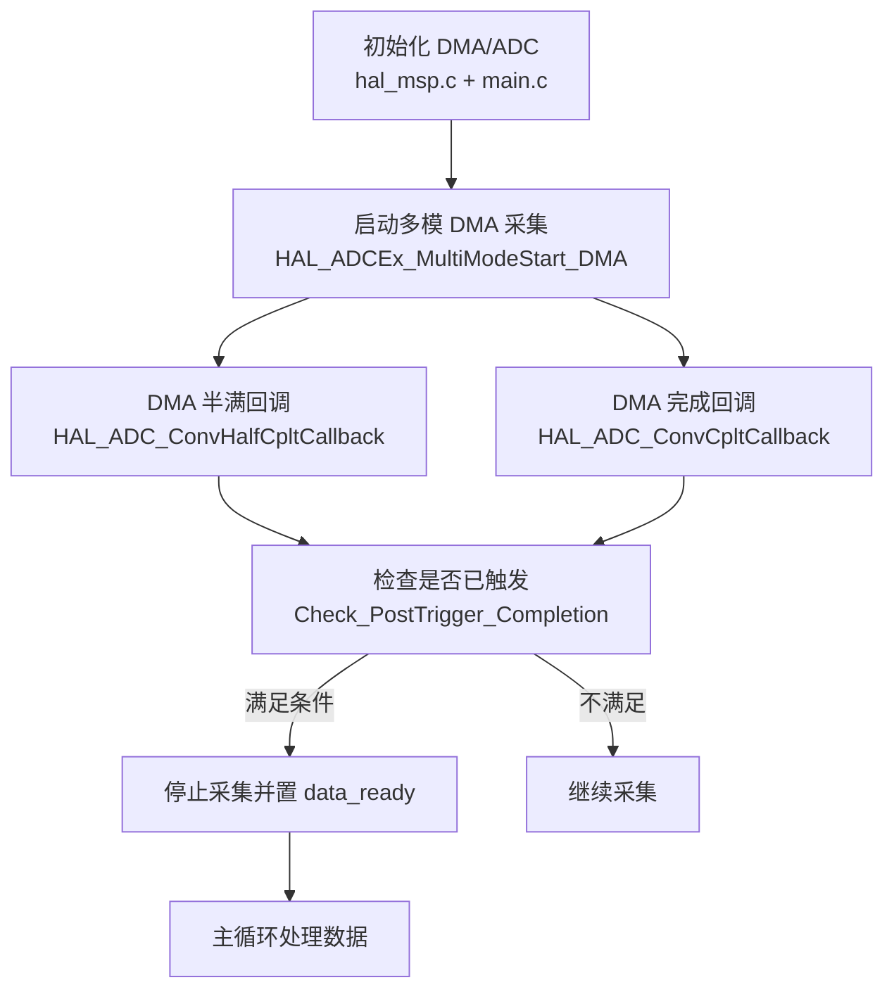
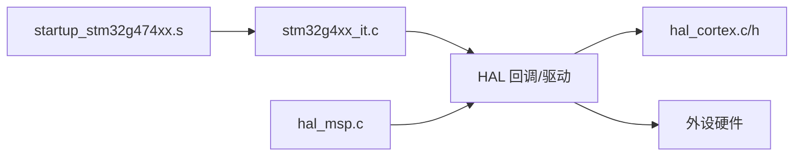

# 中断系统配置

<cite>
**本文引用的文件**
- [Core/Src/main.c](file://Core/Src/main.c)
- [Core/Inc/main.h](file://Core/Inc/main.h)
- [Core/Src/stm32g4xx_it.c](file://Core/Src/stm32g4xx_it.c)
- [Core/Inc/stm32g4xx_it.h](file://Core/Inc/stm32g4xx_it.h)
- [startup_stm32g474xx.s](file://startup_stm32g474xx.s)
- [Drivers/STM32G4xx_HAL_Driver/Src/stm32g4xx_hal_cortex.c](file://Drivers/STM32G4xx_HAL_Driver/Src/stm32g4xx_hal_cortex.c)
- [Drivers/STM32G4xx_HAL_Driver/Inc/stm32g4xx_hal_cortex.h](file://Drivers/STM32G4xx_HAL_Driver/Inc/stm32g4xx_hal_cortex.h)
- [Drivers/STM32G4xx_HAL_Driver/Src/stm32g4xx_hal_msp.c](file://Drivers/STM32G4xx_HAL_Driver/Src/stm32g4xx_hal_msp.c)
</cite>

## 目录
1. [简介](#简介)
2. [项目结构](#项目结构)
3. [核心组件](#核心组件)
4. [架构总览](#架构总览)
5. [详细组件分析](#详细组件分析)
6. [依赖关系分析](#依赖关系分析)
7. [性能与实时性考虑](#性能与实时性考虑)
8. [故障排查指南](#故障排查指南)
9. [结论](#结论)
10. [附录](#附录)

## 简介
本文件面向使用 STM32G4 系列的工程师，系统化阐述中断系统的配置与管理方法，重点覆盖：
- NVIC（嵌套向量中断控制器）优先级分组、抢占优先级与子优先级的设置与影响
- 中断向量表组织方式与中断服务程序（ISR）编写规范
- 典型外设中断的配置路径与流程：EXTI 外部中断、DMA 传输完成中断、ADC 转换中断等
- 中断处理最佳实践：ISR 最小化、避免阻塞、数据同步与原子性保护
- 常见冲突场景与调试技巧

## 项目结构
本项目采用标准 CubeMX 工程结构，关键中断相关代码分布如下：
- 启动与向量表：startup_stm32g474xx.s
- 应用入口与外设初始化：Core/Src/main.c
- 中断服务程序入口与 HAL 回调分发：Core/Src/stm32g4xx_it.c、Core/Inc/stm32g4xx_it.h
- HAL 层 NVIC 控制接口：Drivers/STM32G4xx_HAL_Driver/Src/stm32g4xx_hal_cortex.c、Inc/stm32g4xx_hal_cortex.h
- HAL MSP 初始化（时钟、GPIO、DMA 绑定等）：Drivers/STM32G4xx_HAL_Driver/Src/stm32g4xx_hal_msp.c

图表来源
- [startup_stm32g474xx.s:133-252](file://startup_stm32g474xx.s#L133-L252)
- [Core/Src/stm32g4xx_it.c:202-242](file://Core/Src/stm32g4xx_it.c#L202-L242)
- [Core/Src/main.c:469-520](file://Core/Src/main.c#L469-L520)
- [Drivers/STM32G4xx_HAL_Driver/Src/stm32g4xx_hal_cortex.c:162-214](file://Drivers/STM32G4xx_HAL_Driver/Src/stm32g4xx_hal_cortex.c#L162-L214)
- [Drivers/STM32G4xx_HAL_Driver/Src/stm32g4xx_hal_msp.c:92-185](file://Drivers/STM32G4xx_HAL_Driver/Src/stm32g4xx_hal_msp.c#L92-L185)

章节来源
- [startup_stm32g474xx.s:133-252](file://startup_stm32g474xx.s#L133-L252)
- [Core/Src/stm32g4xx_it.c:202-242](file://Core/Src/stm32g4xx_it.c#L202-L242)
- [Core/Src/main.c:469-520](file://Core/Src/main.c#L469-L520)
- [Drivers/STM32G4xx_HAL_Driver/Src/stm32g4xx_hal_cortex.c:162-214](file://Drivers/STM32G4xx_HAL_Driver/Src/stm32g4xx_hal_cortex.c#L162-L214)
- [Drivers/STM32G4xx_HAL_Driver/Src/stm32g4xx_hal_msp.c:92-185](file://Drivers/STM32G4xx_HAL_Driver/Src/stm32g4xx_hal_msp.c#L92-L185)

## 核心组件
- 启动与向量表
  - 复位后由启动文件设置栈指针、拷贝 .data、清零 .bss，并跳转到 main。
  - 向量表 g_pfnVectors 将异常与外设中断映射到具体 ISR 函数名。
- 中断服务程序入口
  - stm32g4xx_it.c 提供各外设的 IRQHandler，内部调用 HAL 层回调或用户扩展点。
- HAL 层 NVIC 控制
  - HAL_NVIC_SetPriorityGrouping、HAL_NVIC_SetPriority、HAL_NVIC_EnableIRQ 等用于配置优先级与使能中断。
- 外设初始化与 MSP
  - hal_msp.c 负责外设时钟、GPIO、DMA 绑定等底层资源初始化。
- 应用逻辑与回调
  - main.c 中实现 HAL 回调（如 EXTI、DMA、ADC），并在主循环中处理数据。

章节来源
- [startup_stm32g474xx.s:58-106](file://startup_stm32g474xx.s#L58-L106)
- [startup_stm32g474xx.s:133-252](file://startup_stm32g474xx.s#L133-L252)
- [Core/Src/stm32g4xx_it.c:202-242](file://Core/Src/stm32g4xx_it.c#L202-L242)
- [Drivers/STM32G4xx_HAL_Driver/Src/stm32g4xx_hal_cortex.c:162-214](file://Drivers/STM32G4xx_HAL_Driver/Src/stm32g4xx_hal_cortex.c#L162-L214)
- [Drivers/STM32G4xx_HAL_Driver/Src/stm32g4xx_hal_msp.c:92-185](file://Drivers/STM32G4xx_HAL_Driver/Src/stm32g4xx_hal_msp.c#L92-L185)
- [Core/Src/main.c:469-520](file://Core/Src/main.c#L469-L520)

## 架构总览
下图展示从硬件中断到应用回调的完整链路，以及 NVIC 在其中的作用。

图表来源
- [startup_stm32g474xx.s:133-252](file://startup_stm32g474xx.s#L133-L252)
- [Core/Src/stm32g4xx_it.c:202-242](file://Core/Src/stm32g4xx_it.c#L202-L242)
- [Core/Src/main.c:91-149](file://Core/Src/main.c#L91-L149)

## 详细组件分析

### NVIC 优先级分组与设置
- 优先级分组
  - HAL 默认在 HAL_Init 中设置分组为 NVIC_PRIORITYGROUP_4（仅抢占优先级，无子优先级）。
  - 可通过 HAL_NVIC_SetPriorityGrouping 修改分组，影响抢占与子优先级的位数分配。
- 设置与使能
  - HAL_NVIC_SetPriority(IRQn, PreemptPriority, SubPriority) 根据当前分组编码优先级。
  - HAL_NVIC_EnableIRQ(IRQn) 使能指定中断通道。
- 获取与查询
  - HAL_NVIC_GetPriorityGrouping、HAL_NVIC_GetPriority、HAL_NVIC_GetPendingIRQ、HAL_NVIC_ClearPendingIRQ 等辅助函数。

图表来源
- [Drivers/STM32G4xx_HAL_Driver/Src/stm32g4xx_hal.c:168](file://Drivers/STM32G4xx_HAL_Driver/Src/stm32g4xx_hal.c#L168)
- [Drivers/STM32G4xx_HAL_Driver/Src/stm32g4xx_hal_cortex.c:162-214](file://Drivers/STM32G4xx_HAL_Driver/Src/stm32g4xx_hal_cortex.c#L162-L214)
- [Drivers/STM32G4xx_HAL_Driver/Inc/stm32g4xx_hal_cortex.h:90-99](file://Drivers/STM32G4xx_HAL_Driver/Inc/stm32g4xx_hal_cortex.h#L90-L99)

章节来源
- [Drivers/STM32G4xx_HAL_Driver/Src/stm32g4xx_hal.c:168](file://Drivers/STM32G4xx_HAL_Driver/Src/stm32g4xx_hal.c#L168)
- [Drivers/STM32G4xx_HAL_Driver/Src/stm32g4xx_hal_cortex.c:162-214](file://Drivers/STM32G4xx_HAL_Driver/Src/stm32g4xx_hal_cortex.c#L162-L214)
- [Drivers/STM32G4xx_HAL_Driver/Inc/stm32g4xx_hal_cortex.h:90-99](file://Drivers/STM32G4xx_HAL_Driver/Inc/stm32g4xx_hal_cortex.h#L90-L99)

### 中断向量表组织与 ISR 编写规范
- 向量表
  - startup_stm32g474xx.s 定义 g_pfnVectors，包含 NMI、HardFault、SysTick 及各外设 IRQHandler 地址。
  - 所有未实现的 IRQHandler 通过弱符号指向 Default_Handler，便于调试定位。
- ISR 编写要点
  - 保持短小快速：只做必要操作（清标志、置标志位、调用 HAL 回调）。
  - 避免阻塞与耗时 I/O：例如串口发送应放在主循环。
  - 使用 volatile 修饰跨 ISR 与主循环共享的标志变量。
  - 注意临界区保护：必要时关闭全局中断或使用原子操作。

图表来源
- [startup_stm32g474xx.s:133-252](file://startup_stm32g474xx.s#L133-L252)
- [Core/Src/stm32g4xx_it.c:202-242](file://Core/Src/stm32g4xx_it.c#L202-L242)
- [Core/Src/main.c:91-149](file://Core/Src/main.c#L91-L149)

章节来源
- [startup_stm32g474xx.s:133-252](file://startup_stm32g474xx.s#L133-L252)
- [Core/Src/stm32g4xx_it.c:202-242](file://Core/Src/stm32g4xx_it.c#L202-L242)
- [Core/Src/main.c:91-149](file://Core/Src/main.c#L91-L149)

### EXTI 外部中断配置与处理
- GPIO 配置为中断模式（上升沿/下降沿/双边沿），并启用对应 EXTI 线。
- 在 MX_GPIO_Init 中设置优先级并使能 EXTI 中断。
- 中断入口 EXTI4_IRQHandler 调用 HAL_GPIO_EXTI_IRQHandler，最终触发 HAL_GPIO_EXTI_Callback。
- 应用回调中读取 DMA 剩余计数以定位触发时刻，设置标志位供主循环处理。

图表来源
- [Core/Src/main.c:488-520](file://Core/Src/main.c#L488-L520)
- [Core/Src/stm32g4xx_it.c:202-214](file://Core/Src/stm32g4xx_it.c#L202-L214)
- [Core/Src/main.c:91-113](file://Core/Src/main.c#L91-L113)

章节来源
- [Core/Src/main.c:488-520](file://Core/Src/main.c#L488-L520)
- [Core/Src/stm32g4xx_it.c:202-214](file://Core/Src/stm32g4xx_it.c#L202-L214)
- [Core/Src/main.c:91-113](file://Core/Src/main.c#L91-L113)

### DMA 传输完成中断与 ADC 多模采集
- DMA 配置
  - 在 hal_msp.c 中初始化 DMA1 Channel1，设置为循环模式，方向外设到内存，字对齐。
  - 在 main.c 中为 DMA1_Channel1_IRQn 设置优先级并开启中断。
- ADC 多模采集
  - ADC1 与 ADC2 配置为交错模式，DMA 连续请求，数据打包写入环形缓冲区。
  - 当 DMA 半满/满时触发回调，累计事件数达到阈值后停止采集并置标志。
- 数据处理
  - 主循环检测标志，快照触发位置，解包环形缓冲为线性时间轴，并通过 USB CDC 发送。

图表来源
- [Drivers/STM32G4xx_HAL_Driver/Src/stm32g4xx_hal_msp.c:127-148](file://Drivers/STM32G4xx_HAL_Driver/Src/stm32g4xx_hal_msp.c#L127-L148)
- [Core/Src/main.c:469-481](file://Core/Src/main.c#L469-L481)
- [Core/Src/main.c:136-149](file://Core/Src/main.c#L136-L149)
- [Core/Src/main.c:119-131](file://Core/Src/main.c#L119-L131)
- [Core/Src/main.c:249-255](file://Core/Src/main.c#L249-L255)

章节来源
- [Drivers/STM32G4xx_HAL_Driver/Src/stm32g4xx_hal_msp.c:127-148](file://Drivers/STM32G4xx_HAL_Driver/Src/stm32g4xx_hal_msp.c#L127-L148)
- [Core/Src/main.c:469-481](file://Core/Src/main.c#L469-L481)
- [Core/Src/main.c:136-149](file://Core/Src/main.c#L136-L149)
- [Core/Src/main.c:119-131](file://Core/Src/main.c#L119-L131)
- [Core/Src/main.c:249-255](file://Core/Src/main.c#L249-L255)

### USB 低优先级中断
- USB_LP_IRQHandler 入口调用 HAL_PCD_IRQHandler，交由 USB 设备库处理。
- 该中断通常用于 USB 事务的中断式处理，避免在主循环中轮询。

章节来源
- [Core/Src/stm32g4xx_it.c:233-242](file://Core/Src/stm32g4xx_it.c#L233-L242)

## 依赖关系分析
- 启动文件与 ISR
  - 向量表将外设中断映射到 stm32g4xx_it.c 中的 IRQHandler。
- ISR 与 HAL
  - IRQHandler 调用 HAL 层函数，进一步触发应用回调。
- HAL 与 NVIC
  - HAL 封装 NVIC 寄存器操作，提供统一 API。
- 外设与 MSP
  - hal_msp.c 负责外设时钟、GPIO、DMA 绑定，main.c 负责业务逻辑与优先级配置。

图表来源
- [startup_stm32g474xx.s:133-252](file://startup_stm32g474xx.s#L133-L252)
- [Core/Src/stm32g4xx_it.c:202-242](file://Core/Src/stm32g4xx_it.c#L202-L242)
- [Drivers/STM32G4xx_HAL_Driver/Src/stm32g4xx_hal_cortex.c:162-214](file://Drivers/STM32G4xx_HAL_Driver/Src/stm32g4xx_hal_cortex.c#L162-L214)
- [Drivers/STM32G4xx_HAL_Driver/Src/stm32g4xx_hal_msp.c:92-185](file://Drivers/STM32G4xx_HAL_Driver/Src/stm32g4xx_hal_msp.c#L92-L185)

章节来源
- [startup_stm32g474xx.s:133-252](file://startup_stm32g474xx.s#L133-L252)
- [Core/Src/stm32g4xx_it.c:202-242](file://Core/Src/stm32g4xx_it.c#L202-L242)
- [Drivers/STM32G4xx_HAL_Driver/Src/stm32g4xx_hal_cortex.c:162-214](file://Drivers/STM32G4xx_HAL_Driver/Src/stm32g4xx_hal_cortex.c#L162-L214)
- [Drivers/STM32G4xx_HAL_Driver/Src/stm32g4xx_hal_msp.c:92-185](file://Drivers/STM32G4xx_HAL_Driver/Src/stm32g4xx_hal_msp.c#L92-L185)

## 性能与实时性考虑
- ISR 最小化
  - 仅做必要的状态更新与标志置位，避免复杂计算与阻塞 I/O。
- 数据同步与原子性
  - 使用 volatile 修饰共享变量；必要时在 ISR 中禁用中断或使用原子操作保护临界区。
- 优先级规划
  - 高实时性任务（如 DMA/ADC 回调）应赋予较高抢占优先级；通信类任务（如 USB）可较低。
- 避免长时间阻塞
  - 将耗时操作（如字符串格式化、大量数据发送）移至主循环或任务队列。
- 环形缓冲与快照
  - 使用环形缓冲减少复制开销；在主循环中快照触发位置，确保一致性。

[本节为通用指导，无需特定文件引用]

## 故障排查指南
- 中断未触发
  - 检查 NVIC 优先级分组与中断使能是否正确。
  - 确认外设中断源已正确配置（如 EXTI 引脚模式、DMA 中断使能）。
- 中断重复进入或丢失
  - 检查中断标志清除逻辑；确保 ISR 中及时清除挂起位。
  - 验证回调中是否误用阻塞函数导致重入。
- 数据不一致
  - 检查共享变量是否声明为 volatile；主循环与 ISR 之间是否存在竞态条件。
- 调试技巧
  - 使用调试器查看向量表与中断挂起寄存器。
  - 在 ISR 入口与回调处设置断点，观察执行路径。
  - 利用 LED 翻转或最小输出进行快速定位。

章节来源
- [Core/Src/stm32g4xx_it.c:202-242](file://Core/Src/stm32g4xx_it.c#L202-L242)
- [Core/Src/main.c:91-149](file://Core/Src/main.c#L91-L149)
- [Drivers/STM32G4xx_HAL_Driver/Src/stm32g4xx_hal_cortex.c:162-214](file://Drivers/STM32G4xx_HAL_Driver/Src/stm32g4xx_hal_cortex.c#L162-L214)

## 结论
通过对启动文件、ISR、HAL 与外设初始化的系统性梳理，可以清晰掌握 STM32G4 中断体系的工作机制与配置方法。合理设置 NVIC 优先级分组与中断优先级、遵循 ISR 最小化原则、采用环形缓冲与快照策略，是构建稳定高效实时系统的关键。结合调试工具与排障清单，可有效降低开发风险并提升系统可靠性。

[本节为总结性内容，无需特定文件引用]

## 附录
- 常用 HAL 中断 API
  - HAL_NVIC_SetPriorityGrouping
  - HAL_NVIC_SetPriority
  - HAL_NVIC_EnableIRQ
  - HAL_NVIC_DisableIRQ
  - HAL_NVIC_GetPendingIRQ
  - HAL_NVIC_ClearPendingIRQ
- 参考文件
  - [Drivers/STM32G4xx_HAL_Driver/Inc/stm32g4xx_hal_cortex.h](file://Drivers/STM32G4xx_HAL_Driver/Inc/stm32g4xx_hal_cortex.h)
  - [Drivers/STM32G4xx_HAL_Driver/Src/stm32g4xx_hal_cortex.c](file://Drivers/STM32G4xx_HAL_Driver/Src/stm32g4xx_hal_cortex.c)

[本节为补充信息，无需特定文件引用]