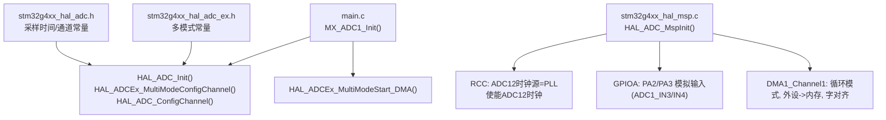
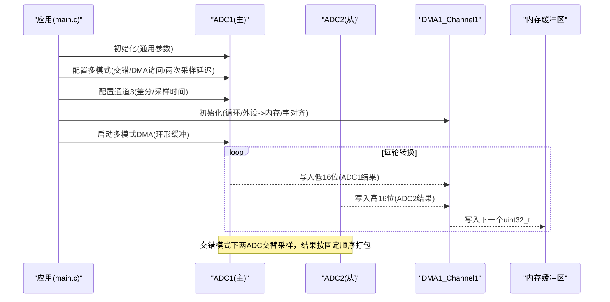
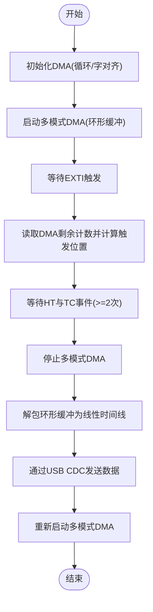
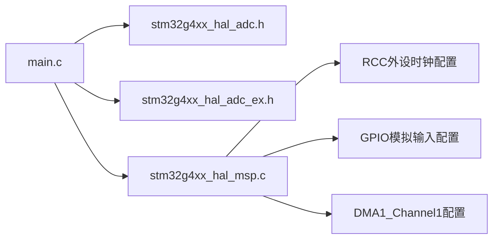

# ADC1主控制器配置

<cite>
**本文引用的文件**   
- [main.c](file://Core/Src/main.c)
- [stm32g4xx_hal_msp.c](file://Core/Src/stm32g4xx_hal_msp.c)
- [stm32g4xx_hal_adc.h](file://Drivers/STM32G4xx_HAL_Driver/Inc/stm32g4xx_hal_adc.h)
- [stm32g4xx_hal_adc_ex.h](file://Drivers/STM32G4xx_HAL_Driver/Inc/stm32g4xx_hal_adc_ex.h)
</cite>

## 目录
1. [简介](#简介)
2. [项目结构](#项目结构)
3. [核心组件](#核心组件)
4. [架构总览](#架构总览)
5. [详细组件分析](#详细组件分析)
6. [依赖关系分析](#依赖关系分析)
7. [性能考虑](#性能考虑)
8. [故障排查指南](#故障排查指南)
9. [结论](#结论)

## 简介
本文件面向在STM32G4系列上使用ADC1作为主控制器的应用，聚焦于以下目标：
- 说明ADC1基本配置参数：时钟预分频器设置为PCLK同步分频、12位分辨率、右对齐数据格式、连续转换模式启用。
- 解释多模式配置：交错模式（ADC_DUALMODE_INTERL）、DMA访问模式（ADC_DMAACCESSMODE_12_10_BITS）、两次采样延迟（ADC_TWOSAMPLINGDELAY_4CYCLES）。
- 说明通道3的配置：差分输入模式（ADC_DIFFERENTIAL_ENDED）、采样时间（ADC_SAMPLETIME_2CYCLES_5）。
- 给出ADC初始化失败的处理方法与调试技巧，并强调作为主控制器时的特殊配置要求。

## 项目结构
与ADC1主控制器初始化直接相关的代码位于应用层与MSP层：
- 应用层初始化：在main.c中完成ADC1的通用配置、多模式配置、通道配置以及启动DMA采集。
- MSP层初始化：在stm32g4xx_hal_msp.c中完成ADC12时钟源选择、外设时钟使能、GPIO模拟引脚配置、DMA通道与中断优先级设置。
- HAL头文件：提供ADC相关宏定义与API原型，如多模式常量、采样时间常量、差分端配置等。

图表来源 
- [main.c:344-407](file://Core/Src/main.c#L344-L407)
- [stm32g4xx_hal_msp.c:92-148](file://Core/Src/stm32g4xx_hal_msp.c#L92-L148)
- [stm32g4xx_hal_adc_ex.h:440-502](file://Drivers/STM32G4xx_HAL_Driver/Inc/stm32g4xx_hal_adc_ex.h#L440-L502)
- [stm32g4xx_hal_adc.h:800-820](file://Drivers/STM32G4xx_HAL_Driver/Inc/stm32g4xx_hal_adc.h#L800-L820)

章节来源
- [main.c:344-407](file://Core/Src/main.c#L344-L407)
- [stm32g4xx_hal_msp.c:92-148](file://Core/Src/stm32g4xx_hal_msp.c#L92-L148)
- [stm32g4xx_hal_adc_ex.h:440-502](file://Drivers/STM32G4xx_HAL_Driver/Inc/stm32g4xx_hal_adc_ex.h#L440-L502)
- [stm32g4xx_hal_adc.h:800-820](file://Drivers/STM32G4xx_HAL_Driver/Inc/stm32g4xx_hal_adc.h#L800-L820)

## 核心组件
- ADC1句柄与全局变量：hadc1/hadc2、DMA句柄hdma_adc1、环形缓冲区与解码缓冲。
- 系统时钟：通过SystemClock_Config配置PLL与APB总线，为ADC提供稳定时钟源。
- ADC1初始化流程：
  - 通用参数：时钟预分频、分辨率、数据对齐、扫描模式、EOC选择、低功耗自动等待、连续转换、转换数量、外部触发、DMA连续请求、溢出处理、过采样关闭。
  - 多模式参数：双ADC交错模式、DMA访问模式、两次采样延迟。
  - 通道3参数：通道号、等级、采样时间、差分端、偏移关闭。
- DMA与中断：DMA1通道1循环传输，ADC1/ADC2交错结果打包到uint32_t缓冲区；EXTI上升沿触发用于标记触发点。

章节来源
- [main.c:47-70](file://Core/Src/main.c#L47-L70)
- [main.c:296-337](file://Core/Src/main.c#L296-L337)
- [main.c:344-407](file://Core/Src/main.c#L344-L407)
- [main.c:469-481](file://Core/Src/main.c#L469-L481)

## 架构总览
下图展示了ADC1主控制器在多模式下的数据流与控制流：

图表来源 
- [main.c:344-407](file://Core/Src/main.c#L344-L407)
- [main.c:469-481](file://Core/Src/main.c#L469-L481)
- [stm32g4xx_hal_msp.c:127-143](file://Core/Src/stm32g4xx_hal_msp.c#L127-L143)

## 详细组件分析

### ADC1基本配置参数
- 时钟预分频器：设置为PCLK同步分频，确保ADC时钟由APB时钟同步派生。
- 分辨率：12位，满足高精度需求。
- 数据对齐：右对齐，便于直接使用低16位数据。
- 连续转换模式：启用，保证在触发后持续进行转换。
- 其他关键项：扫描禁用（单通道）、EOC单次转换标志、外部软件触发、DMA连续请求开启、溢出保护保留数据、过采样关闭。

章节来源
- [main.c:360-376](file://Core/Src/main.c#L360-L376)
- [stm32g4xx_hal_adc.h:90-110](file://Drivers/STM32G4xx_HAL_Driver/Inc/stm32g4xx_hal_adc.h#L90-L110)

### 多模式配置（主控制器）
- 交错模式：ADC_DUALMODE_INTERL，使ADC1与ADC2以交错方式工作，提升吞吐率。
- DMA访问模式：ADC_DMAACCESSMODE_12_10_BITS，使用一个DMA通道同时服务两个ADC，适用于12/10位分辨率。
- 两次采样延迟：ADC_TWOSAMPLINGDELAY_4CYCLES，在两阶段采样之间插入4个ADC时钟周期，保障信号稳定。

章节来源
- [main.c:383-389](file://Core/Src/main.c#L383-L389)
- [stm32g4xx_hal_adc_ex.h:445-491](file://Drivers/STM32G4xx_HAL_Driver/Inc/stm32g4xx_hal_adc_ex.h#L445-L491)

### 通道3配置（差分输入）
- 通道号：ADC_CHANNEL_3。
- 等级：ADC_REGULAR_RANK_1。
- 采样时间：ADC_SAMPLETIME_2CYCLES_5，较短采样时间适合高速场景。
- 差分端：ADC_DIFFERENTIAL_ENDED，采用差分输入模式，提高抗干扰能力。
- 偏移：关闭偏移补偿。

章节来源
- [main.c:393-402](file://Core/Src/main.c#L393-L402)
- [stm32g4xx_hal_adc.h:806-817](file://Drivers/STM32G4xx_HAL_Driver/Inc/stm32g4xx_hal_adc.h#L806-L817)
- [stm32g4xx_hal_adc_ex.h:391-391](file://Drivers/STM32G4xx_HAL_Driver/Inc/stm32g4xx_hal_adc_ex.h#L391-L391)

### 作为主控制器的特殊配置要求
- 必须调用多模式配置函数，且仅在主控制器（ADC1）上设置多模式参数。
- DMA访问模式需与分辨率匹配：12/10位时使用ADC_DMAACCESSMODE_12_10_BITS。
- 两次采样延迟需根据信号带宽与噪声环境合理设置，避免采样不稳定。
- 主控制器负责DMA连续请求与溢出策略，从控制器通常关闭DMA连续请求以避免冲突。

章节来源
- [main.c:383-389](file://Core/Src/main.c#L383-L389)
- [main.c:430-446](file://Core/Src/main.c#L430-L446)

### 初始化失败处理与回调
- 初始化失败：当HAL_ADC_Init、HAL_ADCEx_MultiModeConfigChannel或HAL_ADC_ConfigChannel返回错误时，进入Error_Handler。
- 启动失败：HAL_ADCEx_MultiModeStart_DMA返回错误时同样进入Error_Handler。
- Error_Handler实现：关闭全局中断并进入死循环，便于定位问题。

章节来源
- [main.c:376-379](file://Core/Src/main.c#L376-L379)
- [main.c:386-389](file://Core/Src/main.c#L386-L389)
- [main.c:399-402](file://Core/Src/main.c#L399-L402)
- [main.c:250-255](file://Core/Src/main.c#L250-L255)
- [main.c:530-539](file://Core/Src/main.c#L530-L539)

### DMA与触发处理流程
- DMA初始化：DMA1_Channel1，循环模式，外设到内存，字对齐，优先级低。
- 触发机制：EXTI上升沿捕获当前DMA剩余计数，计算触发位置，随后等待至少两个DMA事件（半传输+全传输）以确保足够的数据量。
- 数据处理：将环形缓冲区解包为线性时间线，并通过USB CDC发送。

图表来源 
- [main.c:469-481](file://Core/Src/main.c#L469-L481)
- [main.c:91-131](file://Core/Src/main.c#L91-L131)
- [main.c:156-171](file://Core/Src/main.c#L156-L171)
- [main.c:250-255](file://Core/Src/main.c#L250-L255)

## 依赖关系分析
- main.c依赖HAL ADC API与多模式扩展API，依赖DMA与GPIO初始化。
- stm32g4xx_hal_msp.c依赖RCC与GPIO驱动，配置ADC12时钟源与引脚复用。
- HAL头文件提供常量与验证宏，确保配置值合法。

图表来源 
- [main.c:344-407](file://Core/Src/main.c#L344-L407)
- [stm32g4xx_hal_msp.c:92-148](file://Core/Src/stm32g4xx_hal_msp.c#L92-L148)
- [stm32g4xx_hal_adc.h:800-820](file://Drivers/STM32G4xx_HAL_Driver/Inc/stm32g4xx_hal_adc.h#L800-L820)
- [stm32g4xx_hal_adc_ex.h:440-502](file://Drivers/STM32G4xx_HAL_Driver/Inc/stm32g4xx_hal_adc_ex.h#L440-L502)

章节来源
- [main.c:344-407](file://Core/Src/main.c#L344-L407)
- [stm32g4xx_hal_msp.c:92-148](file://Core/Src/stm32g4xx_hal_msp.c#L92-L148)

## 性能考虑
- 采样时间与ADC时钟：2.5个ADC时钟周期的采样时间适合较高频率场景，但需确保前端信号源阻抗较低以保证采样精度。
- 交错模式吞吐：交错模式可近似翻倍吞吐率，但需注意两次采样延迟对时序的影响。
- DMA循环缓冲：循环模式减少CPU干预，降低处理开销；注意缓冲区大小与触发窗口匹配。
- 溢出保护：保留数据避免覆盖最新样本，但在高负载下仍需监控DMA事件完整性。

[本节为通用指导，不直接分析具体文件]

## 故障排查指南
- 初始化失败定位：
  - 检查HAL_ADC_Init返回值，确认ADC状态与参数合法性。
  - 检查多模式配置返回值，确认主控制器模式与DMA访问模式匹配。
  - 检查通道配置返回值，确认差分端与采样时间有效。
- 运行期问题：
  - 若DMA未触发或数据异常，检查DMA优先级、中断使能与循环模式设置。
  - 若触发位置计算异常，检查EXTI中断优先级与uart_busy互斥逻辑。
  - 若数据不完整，检查HT/TC事件计数是否达到阈值再停止DMA。
- 硬件相关：
  - 确认PA2/PA3已配置为模拟输入，无内部上拉。
  - 确认ADC12时钟源为PLL且已使能。

章节来源
- [main.c:376-379](file://Core/Src/main.c#L376-L379)
- [main.c:386-389](file://Core/Src/main.c#L386-L389)
- [main.c:399-402](file://Core/Src/main.c#L399-L402)
- [main.c:91-131](file://Core/Src/main.c#L91-L131)
- [stm32g4xx_hal_msp.c:117-125](file://Core/Src/stm32g4xx_hal_msp.c#L117-L125)
- [stm32g4xx_hal_msp.c:127-143](file://Core/Src/stm32g4xx_hal_msp.c#L127-L143)

## 结论
通过在main.c中正确配置ADC1的基本参数、多模式与通道3，并在MSP层完成时钟、GPIO与DMA初始化，可实现稳定的ADC1主控制器交错采集。配合EXTI触发与DMA循环缓冲，能够高效捕获触发前后数据并上传至上位机。遵循主控制器特殊配置要求与错误处理流程，可有效提升系统可靠性与调试效率。