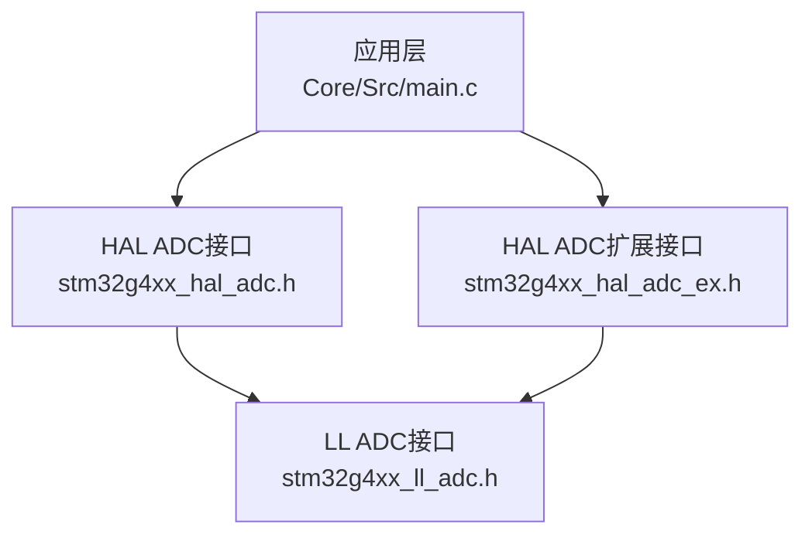
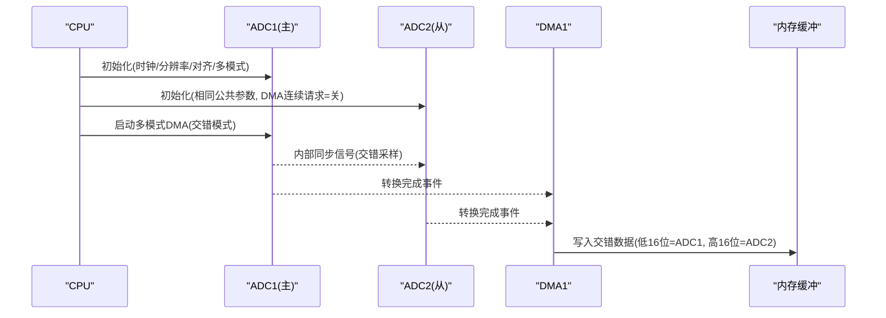
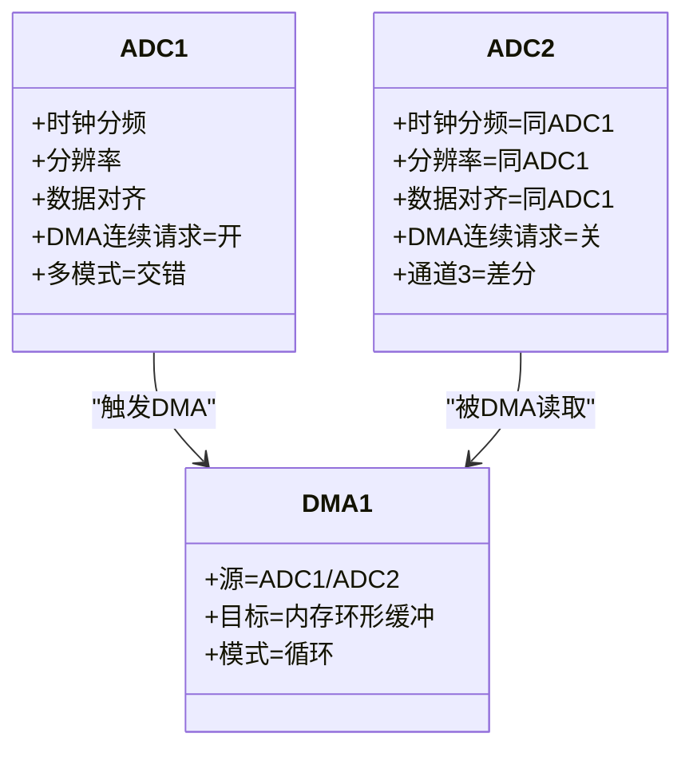
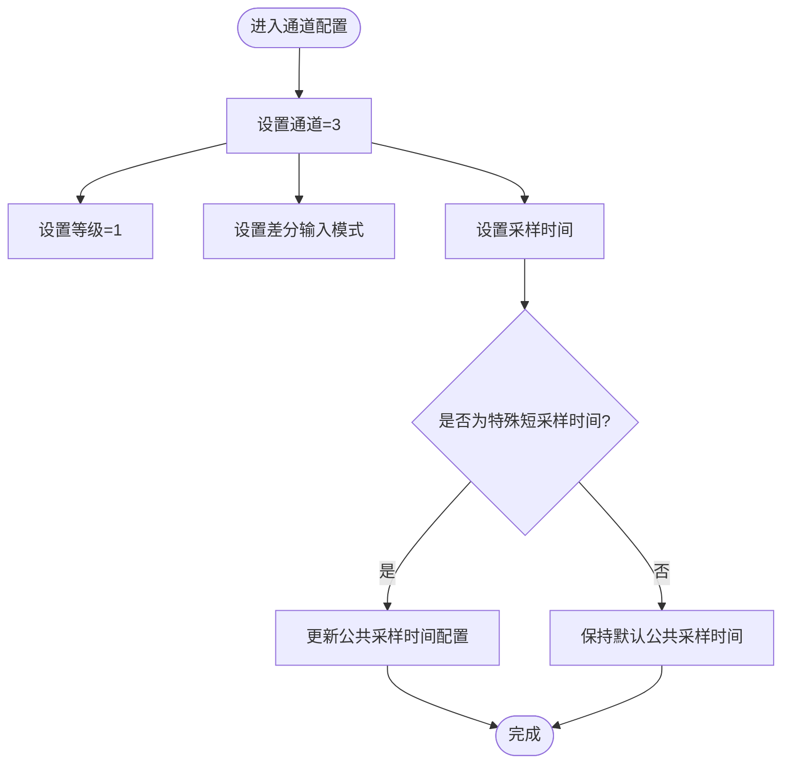
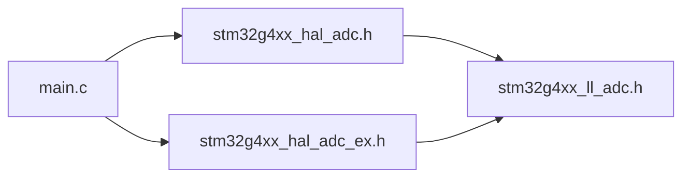

# ADC2从控制器配置

<cite>
**本文引用的文件**   
- [main.c](file://Core/Src/main.c)
- [stm32g4xx_hal_adc.h](file://Drivers/STM32G4xx_HAL_Driver/Inc/stm32g4xx_hal_adc.h)
- [stm32g4xx_hal_adc_ex.h](file://Drivers/STM32G4xx_HAL_Driver/Inc/stm32g4xx_hal_adc_ex.h)
- [stm32g4xx_ll_adc.h](file://Drivers/STM32G4xx_HAL_Driver/Inc/stm32g4xx_ll_adc.h)
</cite>

## 目录
1. [简介](#简介)
2. [项目结构](#项目结构)
3. [核心组件](#核心组件)
4. [架构总览](#架构总览)
5. [详细组件分析](#详细组件分析)
6. [依赖关系分析](#依赖关系分析)
7. [性能考虑](#性能考虑)
8. [故障排除指南](#故障排除指南)
9. [结论](#结论)

## 简介
本文件面向在STM32G4上使用ADC1作为主、ADC2作为从的“交错双ADC”模式，聚焦于ADC2从控制器的初始化与关键注意事项。文档将说明：
- ADC2与ADC1共享的时钟、分辨率、数据对齐等公共参数
- 从控制器工作模式要点（DMA连续请求关闭、与其他ADC的同步关系）
- 通道3的配置（差分输入、采样时间同步）
- ADC2作为从控制器时的特殊要求与协调机制
- 初始化验证与常见问题排查方法

## 项目结构
本项目采用CubeMX生成的标准工程结构，应用层入口位于Core/Src/main.c，其中包含ADC1/ADC2初始化函数以及多模式启动流程；底层驱动定义与宏位于Drivers/STM32G4xx_HAL_Driver/Inc下的HAL与LL头文件中。

图表来源
- [main.c:344-407](file://Core/Src/main.c#L344-L407)
- [main.c:414-464](file://Core/Src/main.c#L414-L464)
- [stm32g4xx_hal_adc.h:90-200](file://Drivers/STM32G4xx_HAL_Driver/Inc/stm32g4xx_hal_adc.h#L90-L200)
- [stm32g4xx_hal_adc_ex.h:438-507](file://Drivers/STM32G4xx_HAL_Driver/Inc/stm32g4xx_hal_adc_ex.h#L438-L507)
- [stm32g4xx_ll_adc.h:6407-6420](file://Drivers/STM32G4xx_HAL_Driver/Inc/stm32g4xx_ll_adc.h#L6407-L6420)

章节来源
- [main.c:344-407](file://Core/Src/main.c#L344-L407)
- [main.c:414-464](file://Core/Src/main.c#L414-L464)

## 核心组件
- ADC1（主控制器）：负责多模式配置与DMA主控，开启连续转换并启用DMA连续请求，选择交错双ADC模式。
- ADC2（从控制器）：复用与ADC1相同的公共参数（时钟、分辨率、对齐），但DMA连续请求需关闭，由主控制器统一调度。
- DMA：仅由ADC1触发，使用一个DMA通道以交错方式搬运ADC1/ADC2结果到内存。
- 通道3：在ADC1与ADC2上均配置为差分输入，采样时间一致，确保两路采样相位对齐。

章节来源
- [main.c:344-407](file://Core/Src/main.c#L344-L407)
- [main.c:414-464](file://Core/Src/main.c#L414-L464)

## 架构总览
下图展示了主从ADC协作与DMA数据流：ADC1为主，ADC2为从，两者按交错时序采样，DMA由ADC1驱动，将ADC1与ADC2的结果打包写入环形缓冲区。

图表来源
- [main.c:382-389](file://Core/Src/main.c#L382-L389)
- [main.c:414-464](file://Core/Src/main.c#L414-L464)
- [stm32g4xx_hal_adc_ex.h:445-447](file://Drivers/STM32G4xx_HAL_Driver/Inc/stm32g4xx_hal_adc_ex.h#L445-L447)

## 详细组件分析

### ADC2从控制器初始化要点
- 公共参数与ADC1保持一致：
  - 时钟分频：与ADC1相同（同步PCLK分频）
  - 分辨率：12位
  - 数据对齐：右对齐
  - 扫描模式：禁用（单通道）
  - 溢出处理：保留数据
  - 过采样：禁用
- 从控制器专属设置：
  - DMAContinuousRequests = DISABLE（由主控制器统一发起DMA请求）
- 通道3配置：
  - 通道号：3
  - 序列等级：1
  - 采样时间：与ADC1一致（保证同步）
  - 输入模式：差分结束端（差分输入）
  - 偏移：无

章节来源
- [main.c:414-464](file://Core/Src/main.c#L414-L464)
- [stm32g4xx_hal_adc.h:90-200](file://Drivers/STM32G4xx_HAL_Driver/Inc/stm32g4xx_hal_adc.h#L90-L200)

### 主从协同与多模式配置
- 多模式模式：交错双ADC（Interleaved）
- DMA访问模式：根据分辨率选择12/10位或8/6位模式（本项目为12位）
- 两次采样间隔延迟：设置为固定周期数，用于满足模拟前端建立时间
- 主从映射：当主为ADC1时，从自动映射为ADC2

图表来源
- [main.c:382-389](file://Core/Src/main.c#L382-L389)
- [main.c:414-464](file://Core/Src/main.c#L414-L464)
- [stm32g4xx_hal_adc_ex.h:465-468](file://Drivers/STM32G4xx_HAL_Driver/Inc/stm32g4xx_hal_adc_ex.h#L465-L468)
- [stm32g4xx_hal_adc_ex.h:775-792](file://Drivers/STM32G4xx_HAL_Driver/Inc/stm32g4xx_hal_adc_ex.h#L775-L792)

### 通道3差分输入与采样时间同步
- 差分输入：通道i在差分模式下占用i与i+1引脚对，仅配置i即可，i+1自动关联
- 采样时间：通过通道级采样时间与公共采样时间配置共同决定；若选择特定短采样时间，可能触发公共采样时间替换策略以保证时序正确性
- 同步要求：主从通道采样时间必须一致，避免相位偏差

图表来源
- [main.c:393-402](file://Core/Src/main.c#L393-L402)
- [main.c:450-459](file://Core/Src/main.c#L450-L459)
- [stm32g4xx_hal_adc.c:2800-2823](file://Drivers/STM32G4xx_HAL_Driver/Src/stm32g4xx_hal_adc.c#L2800-L2823)
- [stm32g4xx_ll_adc.h:6407-6420](file://Drivers/STM32G4xx_HAL_Driver/Inc/stm32g4xx_ll_adc.h#L6407-L6420)

### 从控制器特殊要求与注意事项
- DMA连续请求：从控制器必须关闭，否则会与主控制器产生冲突
- 公共参数一致性：时钟、分辨率、对齐、扫描模式、溢出处理等必须与主控制器一致
- 多模式仅在主机侧配置：通过主机句柄调用多模式配置函数，从机无需重复配置
- 通道可用性：确认所选通道支持差分模式，且对应引脚可用
- 采样时间同步：主从采样时间一致，必要时注意公共采样时间替换逻辑

章节来源
- [main.c:414-464](file://Core/Src/main.c#L414-L464)
- [stm32g4xx_hal_adc_ex.h:438-507](file://Drivers/STM32G4xx_HAL_Driver/Inc/stm32g4xx_hal_adc_ex.h#L438-L507)
- [stm32g4xx_ll_adc.h:6488-6511](file://Drivers/STM32G4xx_HAL_Driver/Inc/stm32g4xx_ll_adc.h#L6488-L6511)

## 依赖关系分析
- main.c依赖HAL ADC接口进行初始化与多模式启动
- HAL ADC接口进一步调用LL ADC进行寄存器级操作
- 多模式相关宏与校验定义在HAL扩展头文件中
- LL层提供通道采样时间、差分模式、标志位等底层能力

图表来源
- [main.c:344-407](file://Core/Src/main.c#L344-L407)
- [main.c:414-464](file://Core/Src/main.c#L414-L464)
- [stm32g4xx_hal_adc.h:90-200](file://Drivers/STM32G4xx_HAL_Driver/Inc/stm32g4xx_hal_adc.h#L90-L200)
- [stm32g4xx_hal_adc_ex.h:438-507](file://Drivers/STM32G4xx_HAL_Driver/Inc/stm32g4xx_hal_adc_ex.h#L438-L507)
- [stm32g4xx_ll_adc.h:6407-6420](file://Drivers/STM32G4xx_HAL_Driver/Inc/stm32g4xx_ll_adc.h#L6407-L6420)

## 性能考虑
- 交错模式可将有效采样率提升一倍，适合高速采集场景
- 合理设置两次采样间隔延迟以满足模拟前端稳定时间
- 使用DMA循环模式减少CPU干预，提高吞吐效率
- 注意ADC时钟频率与分辨率匹配，避免超出最大转换速率限制

## 故障排除指南
- 现象：ADC2无数据或数据错乱
  - 检查ADC2的DMAContinuousRequests是否设为关闭
  - 确认多模式已在ADC1侧配置为交错模式
  - 核对ADC1与ADC2的公共参数一致（时钟、分辨率、对齐）
- 现象：采样相位不一致
  - 检查ADC1与ADC2通道3的采样时间是否一致
  - 关注特殊短采样时间触发的公共采样时间替换逻辑
- 现象：DMA未触发或数据错位
  - 确认DMA通道已使能且优先级设置正确
  - 确认DMA目标缓冲大小与多模式DMA访问模式匹配
- 现象：差分输入无效
  - 确认通道3配置为差分模式，且对应引脚可用
  - 参考LL层关于差分模式的注释，避免使用不支持差分的内部通道

章节来源
- [main.c:414-464](file://Core/Src/main.c#L414-L464)
- [stm32g4xx_ll_adc.h:6488-6511](file://Drivers/STM32G4xx_HAL_Driver/Inc/stm32g4xx_ll_adc.h#L6488-L6511)

## 结论
ADC2作为从控制器时，关键在于与ADC1的公共参数一致、DMA连续请求关闭、多模式在主侧配置、通道3差分输入与采样时间同步。遵循上述要点可确保主从ADC稳定协作，实现高效的双通道交错采样。