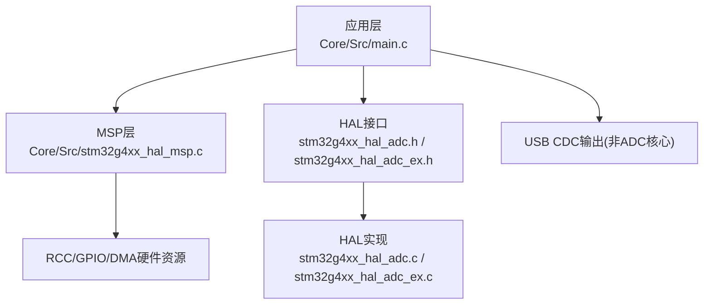
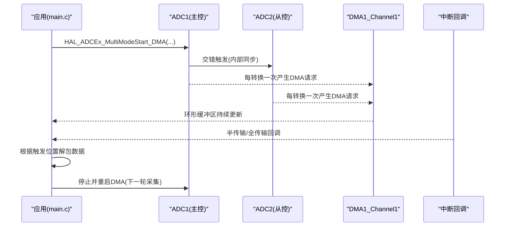
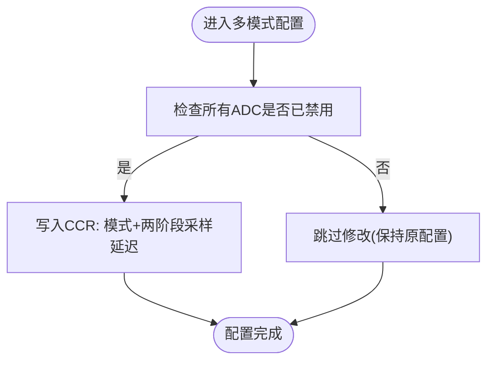
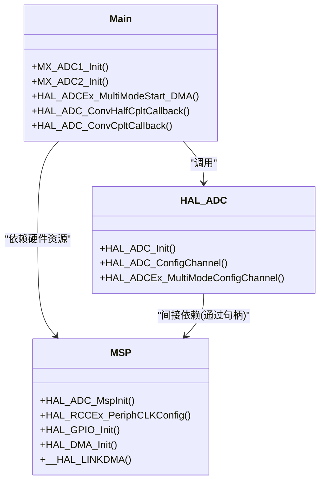

# ADC初始化配置

<cite>
**本文引用的文件**
- [Core/Src/main.c](file://Core/Src/main.c)
- [Core/Inc/main.h](file://Core/Inc/main.h)
- [Core/Src/stm32g4xx_hal_msp.c](file://Core/Src/stm32g4xx_hal_msp.c)
- [Drivers/STM32G4xx_HAL_Driver/Inc/stm32g4xx_hal_adc.h](file://Drivers/STM32G4xx_HAL_Driver/Inc/stm32g4xx_hal_adc.h)
- [Drivers/STM32G4xx_HAL_Driver/Inc/stm32g4xx_hal_adc_ex.h](file://Drivers/STM32G4xx_HAL_Driver/Inc/stm32g4xx_hal_adc_ex.h)
- [Drivers/STM32G4xx_HAL_Driver/Src/stm32g4xx_hal_adc.c](file://Drivers/STM32G4xx_HAL_Driver/Src/stm32g4xx_hal_adc.c)
- [Drivers/STM32G4xx_HAL_Driver/Src/stm32g4xx_hal_adc_ex.c](file://Drivers/STM32G4xx_HAL_Driver/Src/stm32g4xx_hal_adc_ex.c)
</cite>

## 目录
1. [简介](#简介)
2. [项目结构](#项目结构)
3. [核心组件](#核心组件)
4. [架构总览](#架构总览)
5. [详细组件分析](#详细组件分析)
6. [依赖关系分析](#依赖关系分析)
7. [性能与精度优化](#性能与精度优化)
8. [故障排查指南](#故障排查指南)
9. [结论](#结论)

## 简介
本文件面向在STM32G4系列上实现ADC双通道交错模式（ADC_DUALMODE_INTERL）的工程师，基于仓库中的实际代码，系统阐述ADC1与ADC2的独立配置、多模式参数、采样时间、差分输入、连续转换、DMA请求与溢出处理等关键特性，并提供精度优化与噪声抑制建议。文档以“从整体到细节”的方式组织，既适合快速上手，也便于深入查阅。

## 项目结构
本项目采用CubeMX生成的标准工程结构：应用逻辑集中在Core目录，HAL驱动位于Drivers目录。与ADC初始化相关的关键文件包括main.c（应用与初始化）、stm32g4xx_hal_msp.c（外设时钟/GPIO/DMA硬件资源绑定）、以及HAL头/源文件（接口定义与实现）。

图表来源
- [Core/Src/main.c:344-407](file://Core/Src/main.c#L344-L407)
- [Core/Src/stm32g4xx_hal_msp.c:92-185](file://Core/Src/stm32g4xx_hal_msp.c#L92-L185)
- [Drivers/STM32G4xx_HAL_Driver/Inc/stm32g4xx_hal_adc.h:90-252](file://Drivers/STM32G4xx_HAL_Driver/Inc/stm32g4xx_hal_adc.h#L90-L252)
- [Drivers/STM32G4xx_HAL_Driver/Inc/stm32g4xx_hal_adc_ex.h:252-275](file://Drivers/STM32G4xx_HAL_Driver/Inc/stm32g4xx_hal_adc_ex.h#L252-L275)

章节来源
- [Core/Src/main.c:344-407](file://Core/Src/main.c#L344-L407)
- [Core/Src/stm32g4xx_hal_msp.c:92-185](file://Core/Src/stm32g4xx_hal_msp.c#L92-L185)

## 核心组件
- ADC1与ADC2实例：分别通过ADC_HandleTypeDef管理，完成各自的基础参数与通道配置。
- 多模式配置：在主控ADC（ADC1）侧设置ADC_DUALMODE_INTERL，并配置DMA访问模式与两阶段采样延迟。
- DMA链路：仅ADC1启用DMA连续请求，使用环形缓冲；ADC2作为从控不单独开启DMA。
- 触发与回调：EXTI上升沿捕获触发时刻，DMA半传输/全传输回调用于判定采集窗口结束。
- 数据重组：将交错写入的环形缓冲区按时间顺序解包为线性序列，供后续处理或串口发送。

章节来源
- [Core/Src/main.c:48-70](file://Core/Src/main.c#L48-L70)
- [Core/Src/main.c:344-407](file://Core/Src/main.c#L344-L407)
- [Core/Src/main.c:414-464](file://Core/Src/main.c#L414-L464)
- [Core/Src/main.c:469-481](file://Core/Src/main.c#L469-L481)
- [Core/Src/main.c:136-149](file://Core/Src/main.c#L136-L149)
- [Core/Src/main.c:156-171](file://Core/Src/main.c#L156-L171)

## 架构总览
下图展示了ADC双通道交错模式的启动流程、DMA数据流与主循环处理时序。

图表来源
- [Core/Src/main.c:249-255](file://Core/Src/main.c#L249-L255)
- [Core/Src/main.c:136-149](file://Core/Src/main.c#L136-L149)
- [Core/Src/main.c:156-171](file://Core/Src/main.c#L156-L171)

## 详细组件分析

### ADC1与ADC2独立配置
- 时钟分频
  - ADC1/ADC2均使用同步时钟，分频系数为PCLK不分频（即ADC时钟=APB时钟），由Init.ClockPrescaler = ADC_CLOCK_SYNC_PCLK_DIV1设定。
  - 注意：若选择同步时钟且来自HCLK/1，需保证系统时钟占空比为50%（参考手册要求）。
- 分辨率与对齐
  - 分辨率设置为12位（ADC_RESOLUTION_12B）。
  - 数据右对齐（ADC_DATAALIGN_RIGHT）。
- 扫描与EOC
  - 关闭扫描模式（单通道），EOC选择单次转换结束标志。
- 连续转换
  - 开启连续转换模式（ContinuousConvMode = ENABLE），配合DMA实现不间断采集。
- 外部触发
  - 软件触发（ADC_SOFTWARE_START），边沿不使用。
- DMA连续请求
  - ADC1：开启DMA连续请求（ENABLE），以便环形缓冲持续接收数据。
  - ADC2：关闭DMA连续请求（DISABLE），因为多模式下由主控ADC1统一走DMA。
- 溢出行为
  - Overrun设为数据保留（ADC_OVR_DATA_PRESERVED），避免覆盖最新数据。
- 过采样
  - 关闭过采样（OversamplingMode = DISABLE）。

章节来源
- [Core/Src/main.c:360-379](file://Core/Src/main.c#L360-L379)
- [Core/Src/main.c:429-446](file://Core/Src/main.c#L429-L446)
- [Drivers/STM32G4xx_HAL_Driver/Inc/stm32g4xx_hal_adc.h:90-252](file://Drivers/STM32G4xx_HAL_Driver/Inc/stm32g4xx_hal_adc.h#L90-L252)

### 双通道交错模式（ADC_DUALMODE_INTERL）配置
- 多模式模式选择
  - 在主控ADC1中设置multimode.Mode = ADC_DUALMODE_INTERL，启用常规组交错模式。
- DMA访问模式
  - multimode.DMAAccessMode = ADC_DMAACCESSMODE_12_10_BITS，表示12/10位分辨率下使用一个DMA通道（主控ADC1的DMA）合并两个ADC的数据。
- 两阶段采样延迟
  - multimode.TwoSamplingDelay = ADC_TWOSAMPLINGDELAY_4CYCLES，控制两次采样阶段的间隔周期数，确保在所选分辨率下满足时序要求。
- 生效条件
  - 多模式与时序延迟仅在ADC全部禁用时可修改；函数内部会检查公共ADC实例状态并写CCR寄存器。

图表来源
- [Core/Src/main.c:381-389](file://Core/Src/main.c#L381-L389)
- [Drivers/STM32G4xx_HAL_Driver/Src/stm32g4xx_hal_adc_ex.c:2182-2204](file://Drivers/STM32G4xx_HAL_Driver/Src/stm32g4xx_hal_adc_ex.c#L2182-L2204)
- [Drivers/STM32G4xx_HAL_Driver/Inc/stm32g4xx_hal_adc_ex.h:252-275](file://Drivers/STM32G4xx_HAL_Driver/Inc/stm32g4xx_hal_adc_ex.h#L252-L275)

章节来源
- [Core/Src/main.c:381-389](file://Core/Src/main.c#L381-L389)
- [Drivers/STM32G4xx_HAL_Driver/Inc/stm32g4xx_hal_adc_ex.h:438-507](file://Drivers/STM32G4xx_HAL_Driver/Inc/stm32g4xx_hal_adc_ex.h#L438-L507)
- [Drivers/STM32G4xx_HAL_Driver/Src/stm32g4xx_hal_adc_ex.c:2182-2204](file://Drivers/STM32G4xx_HAL_Driver/Src/stm32g4xx_hal_adc_ex.c#L2182-L2204)

### 通道选择与差分输入
- 通道号
  - ADC1与ADC2均配置为通道3（ADC_CHANNEL_3）。
- 差分模式
  - SingleDiff = ADC_DIFFERENTIAL_ENDED，启用差分输入。差分测量在选定通道i与其后一通道i+1之间进行，只需配置通道i，i+1自动关联。
- 采样时间
  - SamplingTime = ADC_SAMPLETIME_2CYCLES_5，适用于高速采集场景。
- 偏移与补偿
  - 未使用偏移（OffsetNumber = ADC_OFFSET_NONE），增益补偿关闭（GainCompensation = 0）。

章节来源
- [Core/Src/main.c:391-402](file://Core/Src/main.c#L391-L402)
- [Core/Src/main.c:448-459](file://Core/Src/main.c#L448-L459)
- [Drivers/STM32G4xx_HAL_Driver/Inc/stm32g4xx_hal_adc.h:267-338](file://Drivers/STM32G4xx_HAL_Driver/Inc/stm32g4xx_hal_adc.h#L267-L338)

### DMA请求与环形缓冲
- DMA控制器
  - 使能DMA1与DMAMUX1时钟，配置NVIC优先级并开启中断。
- DMA通道
  - 使用DMA1_Channel1，方向为外设到内存，外设地址不增，内存地址递增，字宽对齐，环形模式，低优先级。
- 链接关系
  - 通过__HAL_LINKDMA将ADC1的DMA句柄与hdma_adc1绑定。
- 环形缓冲
  - 应用层定义uint32_t adc_raw_buffer[CIRCULAR_BUFFER_SIZE]，每个32位字包含ADC1与ADC2各16位数据（低位为ADC1，高位为ADC2）。
- 主循环
  - 调用HAL_ADCEx_MultiModeStart_DMA启动交错采集；在回调中判断采集窗口结束，停止DMA并重启。

章节来源
- [Core/Src/main.c:469-481](file://Core/Src/main.c#L469-L481)
- [Core/Src/stm32g4xx_hal_msp.c:127-143](file://Core/Src/stm32g4xx_hal_msp.c#L127-L143)
- [Core/Src/main.c:53-62](file://Core/Src/main.c#L53-L62)
- [Core/Src/main.c:249-255](file://Core/Src/main.c#L249-L255)

### 溢出处理与数据保护
- 溢出策略
  - Overrun = ADC_OVR_DATA_PRESERVED，发生溢出时保留最新数据，避免被覆盖。
- 错误状态
  - HAL提供HAL_ADC_STATE_REG_OVR状态位与HAL_ADC_ERROR_OVR错误码，可用于上层检测。
- 注意事项
  - 使用DMA时，无论Overrun如何设置都会报告错误；应确保DMA及时消费数据以避免溢出。

章节来源
- [Core/Src/main.c:374-375](file://Core/Src/main.c#L374-L375)
- [Drivers/STM32G4xx_HAL_Driver/Inc/stm32g4xx_hal_adc.h:226-241](file://Drivers/STM32G4xx_HAL_Driver/Inc/stm32g4xx_hal_adc.h#L226-L241)
- [Drivers/STM32G4xx_HAL_Driver/Inc/stm32g4xx_hal_adc.h:457-458](file://Drivers/STM32G4xx_HAL_Driver/Inc/stm32g4xx_hal_adc.h#L457-L458)
- [Drivers/STM32G4xx_HAL_Driver/Inc/stm32g4xx_hal_adc.h:561](file://Drivers/STM32G4xx_HAL_Driver/Inc/stm32g4xx_hal_adc.h#L561)

### 触发与数据采集窗口
- EXTI触发
  - PA4配置为上升沿中断，在中断回调中读取DMA剩余计数以确定触发时刻的环形缓冲索引。
- 窗口判定
  - 通过DMA半传输与全传输回调累计事件次数，达到阈值后停止DMA并标记数据就绪。
- 数据解包
  - 根据触发位置计算起始索引，按时间顺序将交错数据解包为线性序列。

章节来源
- [Core/Src/main.c:91-113](file://Core/Src/main.c#L91-L113)
- [Core/Src/main.c:119-131](file://Core/Src/main.c#L119-L131)
- [Core/Src/main.c:156-171](file://Core/Src/main.c#L156-L171)

## 依赖关系分析
- main.c依赖HAL ADC接口与扩展接口，完成ADC初始化、多模式配置与DMA启动。
- MSP层负责ADC12时钟源选择（PLL）、GPIO模拟模式配置、DMA初始化与链接。
- HAL实现层在多模式配置时校验ADC状态并写公共CCR寄存器，确保时序与模式正确。

图表来源
- [Core/Src/main.c:344-407](file://Core/Src/main.c#L344-L407)
- [Core/Src/stm32g4xx_hal_msp.c:92-185](file://Core/Src/stm32g4xx_hal_msp.c#L92-L185)
- [Drivers/STM32G4xx_HAL_Driver/Inc/stm32g4xx_hal_adc.h:90-252](file://Drivers/STM32G4xx_HAL_Driver/Inc/stm32g4xx_hal_adc.h#L90-L252)
- [Drivers/STM32G4xx_HAL_Driver/Inc/stm32g4xx_hal_adc_ex.h:252-275](file://Drivers/STM32G4xx_HAL_Driver/Inc/stm32g4xx_hal_adc_ex.h#L252-L275)

章节来源
- [Core/Src/main.c:344-407](file://Core/Src/main.c#L344-L407)
- [Core/Src/stm32g4xx_hal_msp.c:92-185](file://Core/Src/stm32g4xx_hal_msp.c#L92-L185)

## 性能与精度优化
- 时钟与采样时间
  - 使用同步时钟且PCLK不分频可获得较高转换速率；采样时间尽量短（如2.5周期）以提升吞吐，但需确保信号源阻抗与带宽匹配。
- 交错模式延迟
  - TwoSamplingDelay需根据分辨率调整，确保两次采样阶段有足够隔离；默认4周期在12位下通常可满足需求。
- 数据对齐与格式
  - 右对齐便于直接取低16位；DMA使用WORD对齐，将两个16位结果打包为一个32位字，减少总线开销。
- 溢出与丢数据
  - 优先使用数据保留策略，并确保DMA环形缓冲足够大，避免频繁溢出；必要时提高DMA优先级或降低CPU负载。
- 噪声抑制技巧
  - 合理设置采样时间，增加RC滤波或屏蔽干扰；避免与高频数字信号共用走线；必要时启用过采样（当前示例关闭）。
- 校准与增益补偿
  - 可在应用启动时执行ADC校准（参考HAL文档）；增益补偿可修正系统级偏差，但需谨慎设置范围。

[本节为通用指导，不直接分析具体文件]

## 故障排查指南
- 无法启动DMA或多模式配置失败
  - 检查ADC是否处于禁用状态；确认多模式与时序延迟仅在ADC全部禁用时修改。
- 数据错乱或错位
  - 确认DMA环形缓冲大小与数据打包方式一致；核对触发位置快照与解包算法。
- 溢出频繁
  - 增大环形缓冲或提升DMA优先级；检查主循环处理耗时，避免阻塞。
- GPIO与引脚映射
  - 确认PA2/PA3（ADC1_IN3/IN4）与PA6/PA7（ADC2_IN3/IN4）配置为模拟模式且无下拉/上拉。
- 时钟源问题
  - 确认ADC12时钟源选择为PLL，且系统时钟占空比满足同步时钟要求。

章节来源
- [Core/Src/stm32g4xx_hal_msp.c:117-125](file://Core/Src/stm32g4xx_hal_msp.c#L117-L125)
- [Core/Src/stm32g4xx_hal_msp.c:170-178](file://Core/Src/stm32g4xx_hal_msp.c#L170-L178)
- [Core/Src/main.c:156-171](file://Core/Src/main.c#L156-L171)
- [Drivers/STM32G4xx_HAL_Driver/Src/stm32g4xx_hal_adc_ex.c:2182-2204](file://Drivers/STM32G4xx_HAL_Driver/Src/stm32g4xx_hal_adc_ex.c#L2182-L2204)

## 结论
本方案通过ADC1与ADC2的双通道交错模式，结合DMA环形缓冲与EXTI触发，实现了高吞吐、低延迟的信号采集与回放。关键在于：
- 正确设置多模式（ADC_DUALMODE_INTERL）、DMA访问模式与两阶段采样延迟；
- 合理配置差分输入与采样时间，兼顾速度与精度；
- 使用数据保留策略与合适的缓冲大小，避免溢出；
- 在ISR中快速记录触发位置，在主循环中安全解包数据。

[本节为总结性内容，不直接分析具体文件]