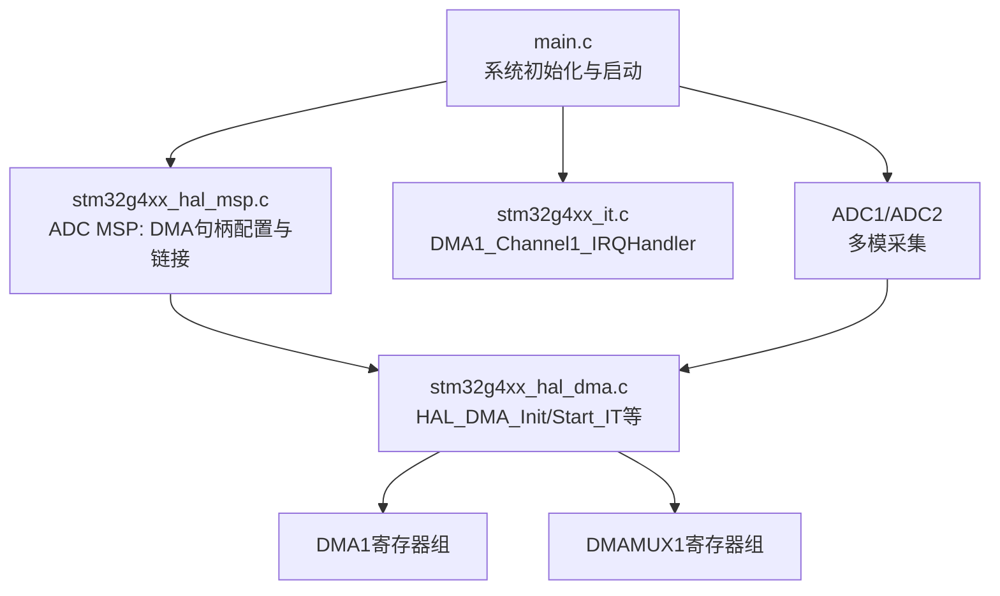
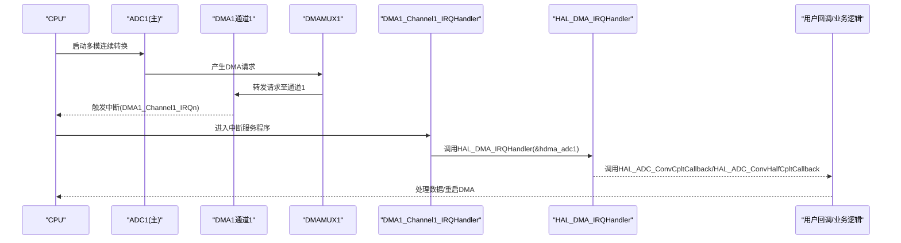
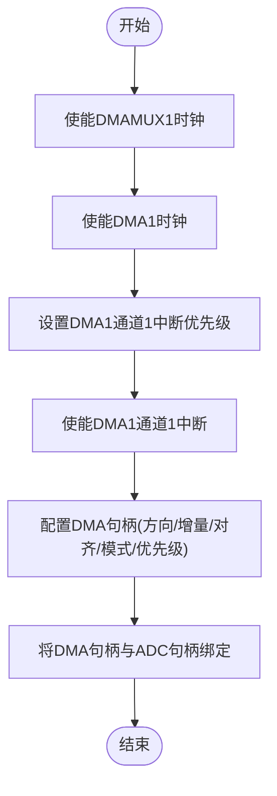
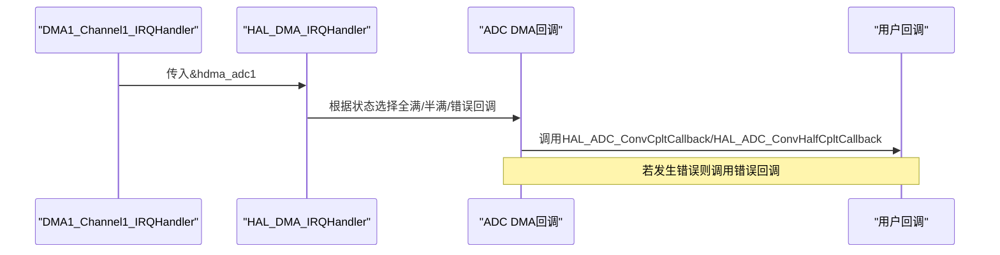
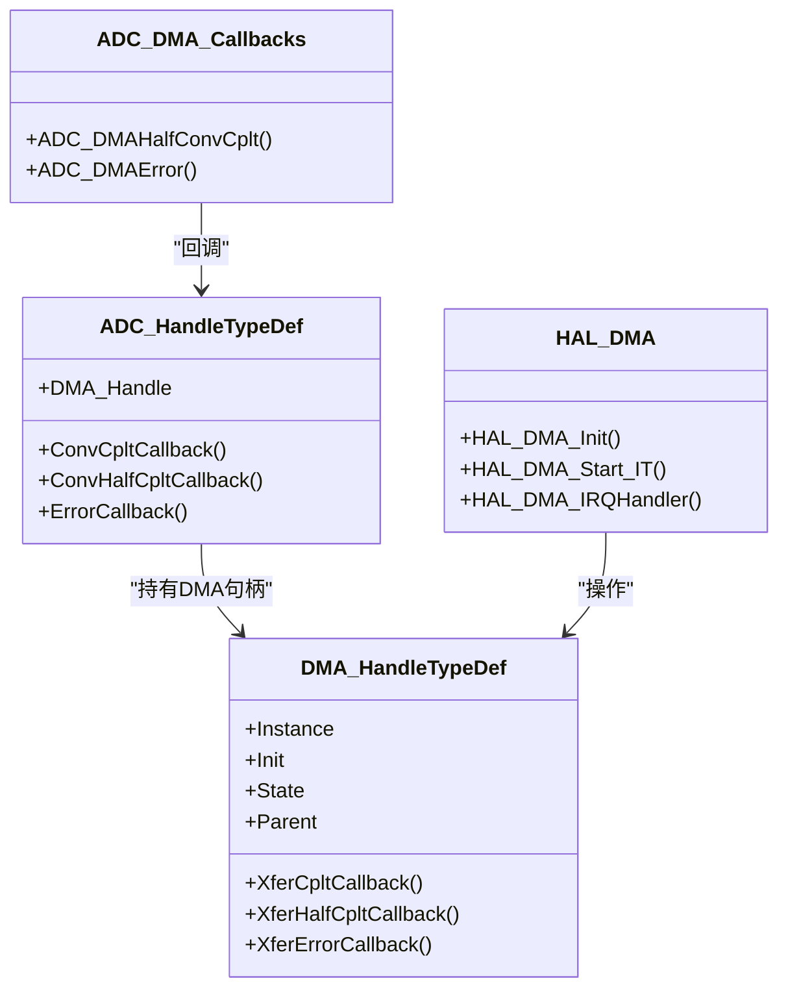
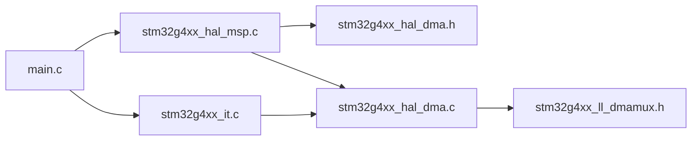

# DMA初始化配置

<cite>
**本文引用的文件列表**
- [Core/Src/main.c](file://Core/Src/main.c)
- [Core/Inc/main.h](file://Core/Inc/main.h)
- [Core/Src/stm32g4xx_it.c](file://Core/Src/stm32g4xx_it.c)
- [Core/Src/stm32g4xx_hal_msp.c](file://Core/Src/stm32g4xx_hal_msp.c)
- [Drivers/STM32G4xx_HAL_Driver/Inc/stm32g4xx_hal_dma.h](file://Drivers/STM32G4xx_HAL_Driver/Inc/stm32g4xx_hal_dma.h)
- [Drivers/STM32G4xx_HAL_Driver/Src/stm32g4xx_hal_dma.c](file://Drivers/STM32G4xx_HAL_Driver/Src/stm32g4xx_hal_dma.c)
- [Drivers/STM32G4xx_HAL_Driver/Inc/stm32g4xx_ll_dmamux.h](file://Drivers/STM32G4xx_HAL_Driver/Inc/stm32g4xx_ll_dmamux.h)
</cite>

## 目录
1. [简介](#简介)
2. [项目结构](#项目结构)
3. [核心组件](#核心组件)
4. [架构总览](#架构总览)
5. [详细组件分析](#详细组件分析)
6. [依赖关系分析](#依赖关系分析)
7. [性能考虑](#性能考虑)
8. [故障排查指南](#故障排查指南)
9. [结论](#结论)

## 简介
本文件面向在STM32G4上使用DMA1通道1进行ADC数据采集的工程师，系统化说明DMA初始化与配置流程，重点覆盖：
- DMAMUX时钟使能、DMA时钟使能
- DMA中断优先级设置
- DMA在ADC数据采集中的作用与循环模式原理
- DMA与ADC的集成方式与数据传输方向配置
- DMA中断处理机制与错误处理方法
- 性能优化技巧与调试方法

## 项目结构
本项目采用CubeMX生成的标准工程结构。与DMA初始化相关的关键代码位于应用层与HAL驱动层：
- 应用入口与外设初始化：main.c
- ADC MSP（包含DMA句柄配置与链接）：stm32g4xx_hal_msp.c
- 中断向量与回调分发：stm32g4xx_it.c
- DMA HAL接口定义与实现：stm32g4xx_hal_dma.h / stm32g4xx_hal_dma.c
- DMAMUX LL常量定义（用于理解请求映射）：stm32g4xx_ll_dmamux.h

图表来源
- [Core/Src/main.c:469-481](file://Core/Src/main.c#L469-L481)
- [Core/Src/stm32g4xx_hal_msp.c:127-148](file://Core/Src/stm32g4xx_hal_msp.c#L127-L148)
- [Core/Src/stm32g4xx_it.c:218-228](file://Core/Src/stm32g4xx_it.c#L218-L228)
- [Drivers/STM32G4xx_HAL_Driver/Src/stm32g4xx_hal_dma.c:152-200](file://Drivers/STM32G4xx_HAL_Driver/Src/stm32g4xx_hal_dma.c#L152-L200)

章节来源
- [Core/Src/main.c:469-481](file://Core/Src/main.c#L469-L481)
- [Core/Src/stm32g4xx_hal_msp.c:127-148](file://Core/Src/stm32g4xx_hal_msp.c#L127-L148)
- [Core/Src/stm32g4xx_it.c:218-228](file://Core/Src/stm32g4xx_it.c#L218-L228)
- [Drivers/STM32G4xx_HAL_Driver/Src/stm32g4xx_hal_dma.c:152-200](file://Drivers/STM32G4xx_HAL_Driver/Src/stm32g4xx_hal_dma.c#L152-L200)

## 核心组件
- DMA句柄与配置结构体：DMA_HandleTypeDef、DMA_InitTypeDef
- ADC与DMA集成：ADC_HandleTypeDef.DMA_Handle指针绑定到DMA句柄
- 中断与回调：DMA1_Channel1_IRQHandler -> HAL_DMA_IRQHandler -> ADC DMA回调 -> 用户回调

关键要点
- 数据方向：外设到内存（ADC -> 内存）
- 地址增量：外设地址不增，内存地址递增
- 传输模式：循环模式（Circular），适合连续采样
- 数据对齐：外设与内存均为字宽（Word）
- 优先级：DMA通道优先级低，NVIC中断优先级可设

章节来源
- [Drivers/STM32G4xx_HAL_Driver/Inc/stm32g4xx_hal_dma.h:46-74](file://Drivers/STM32G4xx_HAL_Driver/Inc/stm32g4xx_hal_dma.h#L46-L74)
- [Core/Src/stm32g4xx_hal_msp.c:127-148](file://Core/Src/stm32g4xx_hal_msp.c#L127-L148)
- [Core/Src/main.c:469-481](file://Core/Src/main.c#L469-L481)

## 架构总览
下图展示从ADC转换到DMA写入内存，再到中断回调与用户处理的完整路径。

图表来源
- [Core/Src/stm32g4xx_it.c:218-228](file://Core/Src/stm32g4xx_it.c#L218-L228)
- [Core/Src/main.c:136-149](file://Core/Src/main.c#L136-L149)
- [Drivers/STM32G4xx_HAL_Driver/Src/stm32g4xx_hal_dma.c:152-200](file://Drivers/STM32G4xx_HAL_Driver/Src/stm32g4xx_hal_dma.c#L152-L200)

## 详细组件分析

### DMA1通道1初始化流程
- 时钟使能
  - 使能DMAMUX1时钟
  - 使能DMA1时钟
- NVIC中断配置
  - 设置DMA1通道1中断优先级
  - 使能DMA1通道1中断
- DMA句柄配置（在ADC MSP中完成）
  - 实例：DMA1_Channel1
  - 请求源：DMA_REQUEST_ADC1
  - 方向：外设到内存
  - 外设地址增量：禁止
  - 内存地址增量：允许
  - 外设数据宽度：字（Word）
  - 内存数据宽度：字（Word）
  - 模式：循环（Circular）
  - 优先级：低（LOW）
- 将DMA句柄与ADC句柄绑定（__LINKDMA）

图表来源
- [Core/Src/main.c:469-481](file://Core/Src/main.c#L469-L481)
- [Core/Src/stm32g4xx_hal_msp.c:127-148](file://Core/Src/stm32g4xx_hal_msp.c#L127-L148)

章节来源
- [Core/Src/main.c:469-481](file://Core/Src/main.c#L469-L481)
- [Core/Src/stm32g4xx_hal_msp.c:127-148](file://Core/Src/stm32g4xx_hal_msp.c#L127-L148)

### DMA在ADC数据采集中的作用与循环模式原理
- 作用
  - 自动搬运ADC转换结果到内存，释放CPU负担
  - 支持半满/全满中断，便于实时处理或双缓冲
- 循环模式
  - 当NDTR计数归零后自动回绕，无需软件重配
  - 配合环形缓冲区可实现无间断采集
- 数据组织
  - 本例使用字宽打包：低16位为ADC1，高16位为ADC2（由ADC多模配置决定）

章节来源
- [Core/Src/main.c:53-70](file://Core/Src/main.c#L53-L70)
- [Core/Src/main.c:156-171](file://Core/Src/main.c#L156-L171)
- [Core/Src/stm32g4xx_hal_msp.c:127-148](file://Core/Src/stm32g4xx_hal_msp.c#L127-L148)

### DMA与ADC的集成方式与数据传输方向配置
- 集成方式
  - ADC句柄中的DMA_Handle指向DMA句柄
  - 通过__LINKDMA宏建立关联
- 传输方向
  - 外设到内存（ADC寄存器 -> 内存缓冲区）
- 地址增量策略
  - 外设地址固定（ADC数据寄存器）
  - 内存地址递增（环形缓冲区）
- 数据对齐
  - 外设与内存均按字对齐，提升吞吐

章节来源
- [Core/Src/stm32g4xx_hal_msp.c:127-148](file://Core/Src/stm32g4xx_hal_msp.c#L127-L148)

### DMA中断处理机制与错误处理
- 中断路径
  - DMA1_Channel1_IRQHandler -> HAL_DMA_IRQHandler -> ADC DMA回调 -> 用户回调
- 用户回调
  - HAL_ADC_ConvCpltCallback（全满）
  - HAL_ADC_ConvHalfCpltCallback（半满）
- 错误处理
  - HAL层提供错误码与错误回调
  - 应用层可在错误回调中复位DMA/ADC并恢复

图表来源
- [Core/Src/stm32g4xx_it.c:218-228](file://Core/Src/stm32g4xx_it.c#L218-L228)
- [Core/Src/main.c:136-149](file://Core/Src/main.c#L136-L149)
- [Drivers/STM32G4xx_HAL_Driver/Src/stm32g4xx_hal_dma.c:152-200](file://Drivers/STM32G4xx_HAL_Driver/Src/stm32g4xx_hal_dma.c#L152-L200)

章节来源
- [Core/Src/stm32g4xx_it.c:218-228](file://Core/Src/stm32g4xx_it.c#L218-L228)
- [Core/Src/main.c:136-149](file://Core/Src/main.c#L136-L149)
- [Drivers/STM32G4xx_HAL_Driver/Src/stm32g4xx_hal_dma.c:152-200](file://Drivers/STM32G4xx_HAL_Driver/Src/stm32g4xx_hal_dma.c#L152-L200)

### 类图：DMA/ADC句柄与回调关系

图表来源
- [Drivers/STM32G4xx_HAL_Driver/Inc/stm32g4xx_hal_dma.h:113-151](file://Drivers/STM32G4xx_HAL_Driver/Inc/stm32g4xx_hal_dma.h#L113-L151)
- [Drivers/STM32G4xx_HAL_Driver/Inc/stm32g4xx_hal_adc.h:483-504](file://Drivers/STM32G4xx_HAL_Driver/Inc/stm32g4xx_hal_adc.h#L483-L504)
- [Drivers/STM32G4xx_HAL_Driver/Src/stm32g4xx_hal_adc.c:3633-3685](file://Drivers/STM32G4xx_HAL_Driver/Src/stm32g4xx_hal_adc.c#L3633-L3685)

## 依赖关系分析
- main.c负责：
  - 使能DMAMUX1与DMA1时钟
  - 设置DMA1通道1中断优先级并启用中断
  - 启动ADC多模DMA采集
- stm32g4xx_hal_msp.c负责：
  - 配置DMA句柄（请求源、方向、增量、对齐、模式、优先级）
  - 将DMA句柄与ADC句柄绑定
- stm32g4xx_it.c负责：
  - DMA1通道1中断入口，调用HAL_DMA_IRQHandler
- HAL层负责：
  - DMA初始化、启动、中断处理与回调分发

图表来源
- [Core/Src/main.c:469-481](file://Core/Src/main.c#L469-L481)
- [Core/Src/stm32g4xx_hal_msp.c:127-148](file://Core/Src/stm32g4xx_hal_msp.c#L127-L148)
- [Core/Src/stm32g4xx_it.c:218-228](file://Core/Src/stm32g4xx_it.c#L218-L228)
- [Drivers/STM32G4xx_HAL_Driver/Inc/stm32g4xx_ll_dmamux.h:135-179](file://Drivers/STM32G4xx_HAL_Driver/Inc/stm32g4xx_ll_dmamux.h#L135-L179)

章节来源
- [Core/Src/main.c:469-481](file://Core/Src/main.c#L469-L481)
- [Core/Src/stm32g4xx_hal_msp.c:127-148](file://Core/Src/stm32g4xx_hal_msp.c#L127-L148)
- [Core/Src/stm32g4xx_it.c:218-228](file://Core/Src/stm32g4xx_it.c#L218-L228)
- [Drivers/STM32G4xx_HAL_Driver/Inc/stm32g4xx_ll_dmamux.h:135-179](file://Drivers/STM32G4xx_HAL_Driver/Inc/stm32g4xx_ll_dmamux.h#L135-L179)

## 性能考虑
- 数据对齐与宽度
  - 外设与内存均采用字对齐，减少总线访问次数，提高吞吐
- 循环模式
  - 避免每次传输完成后重新配置，降低CPU开销
- 中断粒度
  - 利用半满/全满中断，合理拆分数据处理任务，避免单次中断过长
- 内存布局
  - 使用环形缓冲区时，注意边界取模运算的成本；必要时可采用掩码优化（缓冲区大小为2的幂）
- 时钟与总线
  - 确保DMA与DMAMUX时钟已正确使能，避免等待挂起
- 优先级
  - 合理设置DMA通道优先级与NVIC中断优先级，避免被更高优先级中断抢占导致延迟

[本节为通用指导，不直接分析具体文件]

## 故障排查指南
- 现象：DMA未触发中断
  - 检查是否使能了DMAMUX1与DMA1时钟
  - 检查DMA1通道1中断是否启用且优先级设置正确
  - 确认ADC已启动且DMA请求已使能
- 现象：数据错位或越界
  - 核对DMA内存地址增量与缓冲区大小
  - 核对数据对齐（外设/内存）是否与ADC输出一致
- 现象：数据丢失或覆盖
  - 检查循环模式下缓冲区长度与处理速度匹配
  - 使用半满/全满中断标志协调读写位置
- 现象：错误回调触发
  - 读取HAL错误码定位问题（如超时、同步错误等）
  - 在错误回调中复位DMA/ADC并尝试恢复

章节来源
- [Core/Src/main.c:469-481](file://Core/Src/main.c#L469-L481)
- [Core/Src/stm32g4xx_hal_msp.c:127-148](file://Core/Src/stm32g4xx_hal_msp.c#L127-L148)
- [Drivers/STM32G4xx_HAL_Driver/Inc/stm32g4xx_hal_dma.h:165-172](file://Drivers/STM32G4xx_HAL_Driver/Inc/stm32g4xx_hal_dma.h#L165-L172)

## 结论
通过对DMAMUX与DMA时钟的正确使能、DMA句柄的合理配置以及中断与回调的规范处理，可以在STM32G4上稳定高效地完成ADC数据的DMA采集。结合循环模式与半满/全满中断，既能保证实时性，又能降低CPU负载。实际应用中应关注数据对齐、缓冲区管理与中断优先级，以获得最佳性能与稳定性。