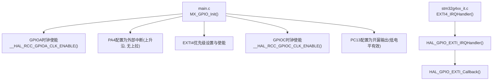
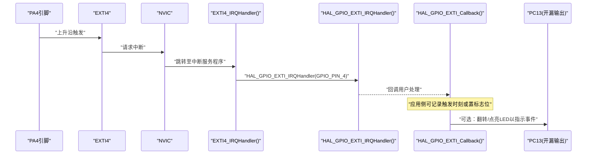
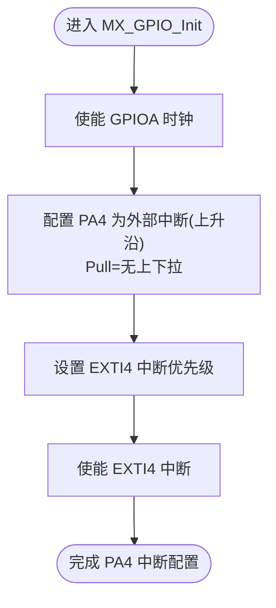
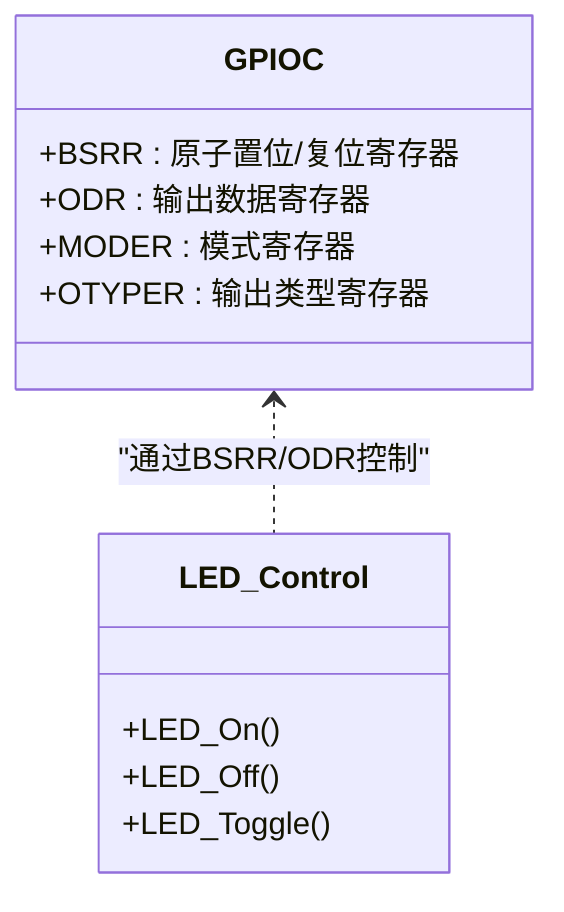
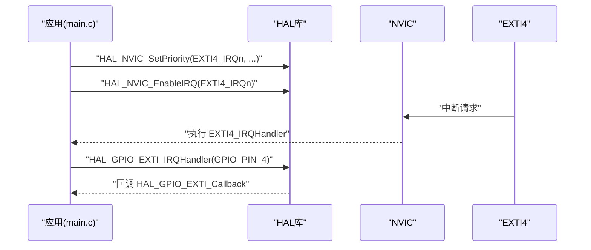
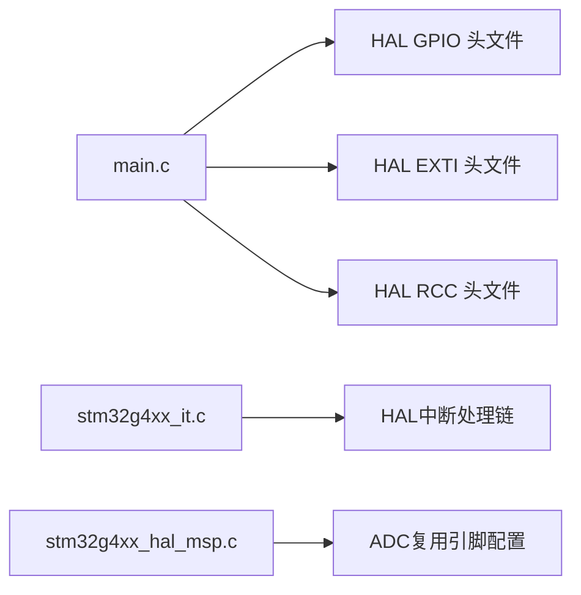

# GPIO初始化配置

<cite>
**本文引用的文件**   
- [Core/Src/main.c](file://Core/Src/main.c)
- [Core/Inc/main.h](file://Core/Inc/main.h)
- [Core/Src/stm32g4xx_it.c](file://Core/Src/stm32g4xx_it.c)
- [Core/Inc/stm32g4xx_it.h](file://Core/Inc/stm32g4xx_it.h)
- [Drivers/STM32G4xx_HAL_Driver/Inc/stm32g4xx_hal_gpio.h](file://Drivers/STM32G4xx_HAL_Driver/Inc/stm32g4xx_hal_gpio.h)
- [Drivers/STM32G4xx_HAL_Driver/Inc/stm32g4xx_ll_gpio.h](file://Drivers/STM32G4xx_HAL_Driver/Inc/stm32g4xx_ll_gpio.h)
- [Drivers/STM32G4xx_HAL_Driver/Inc/stm32g4xx_hal_exti.h](file://Drivers/STM32G4xx_HAL_Driver/Inc/stm32g4xx_hal_exti.h)
- [Drivers/STM32G4xx_HAL_Driver/Inc/stm32g4xx_hal_rcc.h](file://Drivers/STM32G4xx_HAL_Driver/Inc/stm32g4xx_hal_rcc.h)
- [Core/Src/stm32g4xx_hal_msp.c](file://Core/Src/stm32g4xx_hal_msp.c)
</cite>

## 目录
1. [简介](#简介)
2. [项目结构](#项目结构)
3. [核心组件](#核心组件)
4. [架构总览](#架构总览)
5. [详细组件分析](#详细组件分析)
6. [依赖关系分析](#依赖关系分析)
7. [性能与功耗考量](#性能与功耗考量)
8. [故障排查指南](#故障排查指南)
9. [结论](#结论)
10. [附录：GPIO模式与电气特性速查](#附录gpio模式与电气特性速查)

## 简介
本文件面向STM32G4系列，围绕GPIO外设初始化展开，重点说明：
- PA4引脚的外部中断配置（上升沿触发、无上拉）
- PC13引脚的LED控制配置（开漏输出、低电平有效）
- GPIO模式设置、时钟使能、EXTI外部中断配置与NVIC中断管理的完整流程
- 结合工程实际代码路径，给出最佳实践与常见问题解决方案（含引脚复用、电气特性等）

## 项目结构
本项目为CubeMX生成的工程骨架，应用逻辑集中在Core目录，HAL驱动位于Drivers目录。与GPIO初始化直接相关的源文件包括main.c（用户初始化与回调）、stm32g4xx_it.c（中断向量入口），以及HAL头文件中的GPIO/EXTI/RCC宏定义。

图表来源
- [Core/Src/main.c:488-520](file://Core/Src/main.c#L488-L520)
- [Core/Src/stm32g4xx_it.c:205-214](file://Core/Src/stm32g4xx_it.c#L205-L214)
- [Drivers/STM32G4xx_HAL_Driver/Inc/stm32g4xx_hal_rcc.h:614-620](file://Drivers/STM32G4xx_HAL_Driver/Inc/stm32g4xx_hal_rcc.h#L614-L620)

章节来源
- [Core/Src/main.c:488-520](file://Core/Src/main.c#L488-L520)
- [Core/Src/stm32g4xx_it.c:205-214](file://Core/Src/stm32g4xx_it.c#L205-L214)
- [Drivers/STM32G4xx_HAL_Driver/Inc/stm32g4xx_hal_rcc.h:614-620](file://Drivers/STM32G4xx_HAL_Driver/Inc/stm32g4xx_hal_rcc.h#L614-L620)

## 核心组件
- GPIO初始化函数：在main.c中完成端口时钟使能、引脚模式配置、中断优先级设置与LED输出配置。
- EXTI中断处理：stm32g4xx_it.c提供EXTI4_IRQHandler，调用HAL层统一处理并回调到HAL_GPIO_EXTI_Callback。
- HAL GPIO/EXTI/RCC接口：通过HAL库宏和结构体完成寄存器级配置封装。

章节来源
- [Core/Src/main.c:488-520](file://Core/Src/main.c#L488-L520)
- [Core/Src/stm32g4xx_it.c:205-214](file://Core/Src/stm32g4xx_it.c#L205-L214)
- [Drivers/STM32G4xx_HAL_Driver/Inc/stm32g4xx_hal_gpio.h:47-63](file://Drivers/STM32G4xx_HAL_Driver/Inc/stm32g4xx_hal_gpio.h#L47-L63)
- [Drivers/STM32G4xx_HAL_Driver/Inc/stm32g4xx_hal_exti.h:62-73](file://Drivers/STM32G4xx_HAL_Driver/Inc/stm32g4xx_hal_exti.h#L62-L73)

## 架构总览
下图展示了从硬件信号到软件回调的完整链路：PA4引脚边沿变化→EXTI4中断→NVIC调度→HAL中断处理→用户回调；同时PC13作为开漏输出由BSRR寄存器原子操作控制LED亮灭。

图表来源
- [Core/Src/stm32g4xx_it.c:205-214](file://Core/Src/stm32g4xx_it.c#L205-L214)
- [Core/Src/main.c:91-113](file://Core/Src/main.c#L91-L113)
- [Core/Src/main.c:42-44](file://Core/Src/main.c#L42-L44)

## 详细组件分析

### PA4外部中断配置（上升沿触发、无上拉）
- 时钟使能：启用GPIOA时钟，确保对PA4的访问有效。
- 引脚模式：将PA4配置为外部中断模式，选择上升沿触发，内部上拉关闭。
- EXTI映射：PA4对应EXTI4线，需设置NVIC优先级并开启中断。
- 中断处理：在stm32g4xx_it.c中实现EXTI4_IRQHandler，调用HAL统一处理，最终进入HAL_GPIO_EXTI_Callback进行业务逻辑。

图表来源
- [Core/Src/main.c:496-506](file://Core/Src/main.c#L496-L506)
- [Core/Src/stm32g4xx_it.c:205-214](file://Core/Src/stm32g4xx_it.c#L205-L214)

章节来源
- [Core/Src/main.c:496-506](file://Core/Src/main.c#L496-L506)
- [Core/Src/stm32g4xx_it.c:205-214](file://Core/Src/stm32g4xx_it.c#L205-L214)
- [Drivers/STM32G4xx_HAL_Driver/Inc/stm32g4xx_hal_gpio.h:124-126](file://Drivers/STM32G4xx_HAL_Driver/Inc/stm32g4xx_hal_gpio.h#L124-L126)
- [Drivers/STM32G4xx_HAL_Driver/Inc/stm32g4xx_hal_rcc.h:606-612](file://Drivers/STM32G4xx_HAL_Driver/Inc/stm32g4xx_hal_rcc.h#L606-L612)

### PC13 LED控制配置（开漏输出、低电平有效）
- 时钟使能：启用GPIOC时钟。
- 引脚模式：将PC13配置为开漏输出，无上拉，速度设为低速即可满足LED驱动需求。
- 初始状态：启动时关闭LED（开漏输出下，写高电平即释放总线，LED熄灭）。
- 控制方式：使用BSRR寄存器进行原子置位/复位操作，避免读-改-写竞争。

图表来源
- [Core/Src/main.c:42-44](file://Core/Src/main.c#L42-L44)
- [Drivers/STM32G4xx_HAL_Driver/Inc/stm32g4xx_ll_gpio.h:894-897](file://Drivers/STM32G4xx_HAL_Driver/Inc/stm32g4xx_ll_gpio.h#L894-L897)

章节来源
- [Core/Src/main.c:509-519](file://Core/Src/main.c#L509-L519)
- [Drivers/STM32G4xx_HAL_Driver/Inc/stm32g4xx_hal_gpio.h:117-118](file://Drivers/STM32G4xx_HAL_Driver/Inc/stm32g4xx_hal_gpio.h#L117-L118)
- [Drivers/STM32G4xx_HAL_Driver/Inc/stm32g4xx_ll_gpio.h:894-897](file://Drivers/STM32G4xx_HAL_Driver/Inc/stm32g4xx_ll_gpio.h#L894-L897)

### EXTI外部中断配置方法与NVIC中断管理
- EXTI配置：通过GPIO_MODE_IT_RISING将引脚配置为中断模式并选择上升沿触发；该模式会同步配置EXTI线路的触发边沿。
- NVIC管理：使用HAL_NVIC_SetPriority设置中断优先级，HAL_NVIC_EnableIRQ开启中断。
- 中断入口：EXTI4_IRQHandler调用HAL_GPIO_EXTI_IRQHandler，后者负责清除挂起标志并回调用户函数。

图表来源
- [Core/Src/main.c:505-506](file://Core/Src/main.c#L505-L506)
- [Core/Src/stm32g4xx_it.c:205-214](file://Core/Src/stm32g4xx_it.c#L205-L214)
- [Drivers/STM32G4xx_HAL_Driver/Inc/stm32g4xx_hal_gpio.h:124-126](file://Drivers/STM32G4xx_HAL_Driver/Inc/stm32g4xx_hal_gpio.h#L124-L126)

章节来源
- [Core/Src/main.c:505-506](file://Core/Src/main.c#L505-L506)
- [Core/Src/stm32g4xx_it.c:205-214](file://Core/Src/stm32g4xx_it.c#L205-L214)
- [Drivers/STM32G4xx_HAL_Driver/Inc/stm32g4xx_hal_gpio.h:124-126](file://Drivers/STM32G4xx_HAL_Driver/Inc/stm32g4xx_hal_gpio.h#L124-L126)

### GPIO初始化最佳实践
- 先使能时钟再配置引脚：确保目标端口的AHB时钟已打开，否则写入无效。
- 明确输入/输出模式：
  - 输入用于检测外部信号，必要时配置上拉/下拉或保持浮空。
  - 输出根据负载选择推挽或开漏；开漏适合线与总线场景。
- 中断配置要点：
  - 选择正确的触发边沿（上升沿/下降沿/双边沿）。
  - 合理设置NVIC优先级，避免关键任务被低优先级中断抢占。
  - 在中断中仅做最小化处理，复杂逻辑放入主循环或任务队列。
- 原子操作控制输出：使用BSRR进行置位/复位，避免并发修改导致的竞态。
- 注意引脚复用冲突：若同一引脚被其他外设占用（如ADC模拟输入），需确保复用正确且不与GPIO功能冲突。

章节来源
- [Core/Src/main.c:496-506](file://Core/Src/main.c#L496-L506)
- [Core/Src/main.c:509-519](file://Core/Src/main.c#L509-L519)
- [Core/Src/main.c:42-44](file://Core/Src/main.c#L42-L44)
- [Core/Src/stm32g4xx_it.c:205-214](file://Core/Src/stm32g4xx_it.c#L205-L214)

### 常见问题与解决方案
- 现象：PA4中断不触发
  - 检查是否使能了GPIOA时钟。
  - 确认PA4模式为外部中断且触发边沿正确。
  - 确认EXTI4已在NVIC中设置优先级并开启。
  - 验证外部信号确实产生上升沿。
- 现象：PC13无法点亮或亮度异常
  - 确认PC13为开漏输出，低电平有效；需要外部上拉电阻或连接至VCC的上拉网络。
  - 检查LED极性接线是否正确。
  - 使用BSRR原子操作控制，避免读-改-写导致的状态不一致。
- 现象：引脚功能冲突
  - 若同一引脚被ADC或其他外设复用，需检查复用配置与GPIO模式是否一致。
  - 参考MSP文件中ADC相关GPIO配置，避免与当前GPIO用途冲突。

章节来源
- [Core/Src/main.c:496-506](file://Core/Src/main.c#L496-L506)
- [Core/Src/main.c:509-519](file://Core/Src/main.c#L509-L519)
- [Core/Src/stm32g4xx_it.c:205-214](file://Core/Src/stm32g4xx_it.c#L205-L214)
- [Core/Src/stm32g4xx_hal_msp.c:117-125](file://Core/Src/stm32g4xx_hal_msp.c#L117-L125)

## 依赖关系分析
- main.c依赖HAL GPIO/EXTI/RCC宏与函数完成初始化与中断管理。
- stm32g4xx_it.c依赖HAL中断处理链路与用户回调。
- MSP文件展示ADC复用引脚的配置，提醒开发者注意引脚复用冲突。

图表来源
- [Core/Src/main.c:488-520](file://Core/Src/main.c#L488-L520)
- [Core/Src/stm32g4xx_it.c:205-214](file://Core/Src/stm32g4xx_it.c#L205-L214)
- [Core/Src/stm32g4xx_hal_msp.c:117-125](file://Core/Src/stm32g4xx_hal_msp.c#L117-L125)

章节来源
- [Core/Src/main.c:488-520](file://Core/Src/main.c#L488-L520)
- [Core/Src/stm32g4xx_it.c:205-214](file://Core/Src/stm32g4xx_it.c#L205-L214)
- [Core/Src/stm32g4xx_hal_msp.c:117-125](file://Core/Src/stm32g4xx_hal_msp.c#L117-L125)

## 性能与功耗考量
- 中断延迟：EXTI4优先级设置为较高值可减少响应时间，但应避免过高导致系统抖动。
- 输出速度：LED控制使用低速即可，降低EMI与功耗。
- 功耗优化：未使用的引脚建议配置为模拟输入或低功耗模式，减少泄漏电流。

[本节为通用指导，无需特定文件引用]

## 故障排查指南
- 使用调试器观察EXTI挂起标志与NVIC中断状态，确认中断是否到达。
- 在HAL_GPIO_EXTI_Callback中加入最小化日志或LED翻转，快速定位问题。
- 检查BSRR操作是否正确，避免误用ODR导致非原子更新。

章节来源
- [Core/Src/stm32g4xx_it.c:205-214](file://Core/Src/stm32g4xx_it.c#L205-L214)
- [Core/Src/main.c:42-44](file://Core/Src/main.c#L42-L44)

## 结论
通过对PA4外部中断与PC13开漏输出的配置分析，明确了GPIO初始化、时钟使能、EXTI与NVIC管理的标准流程。遵循最佳实践可有效避免引脚复用冲突与中断处理不当等问题，提升系统稳定性与可维护性。

[本节为总结，无需特定文件引用]

## 附录：GPIO模式与电气特性速查
- 常用GPIO模式：
  - 输入：浮空、上拉、下拉
  - 输出：推挽、开漏
  - 复用：推挽、开漏
  - 模拟：用于ADC/DAC等
- 触发边沿：上升沿、下降沿、双边沿
- 电气特性：
  - 开漏输出需外部上拉以实现高电平
  - 推挽输出可直接驱动高低电平
  - 速度档位影响EMI与功耗

章节来源
- [Drivers/STM32G4xx_HAL_Driver/Inc/stm32g4xx_hal_gpio.h:116-156](file://Drivers/STM32G4xx_HAL_Driver/Inc/stm32g4xx_hal_gpio.h#L116-L156)
- [Drivers/STM32G4xx_HAL_Driver/Inc/stm32g4xx_ll_gpio.h:325-356](file://Drivers/STM32G4xx_HAL_Driver/Inc/stm32g4xx_ll_gpio.h#L325-L356)