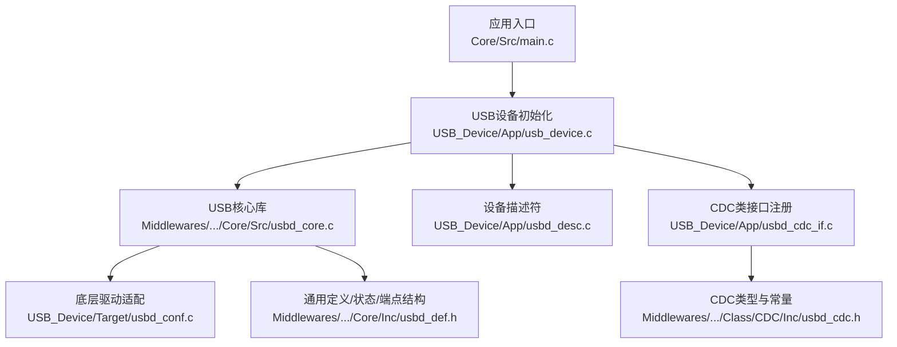
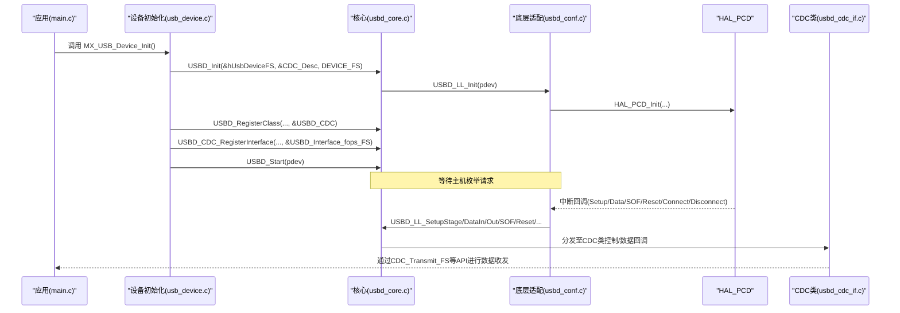
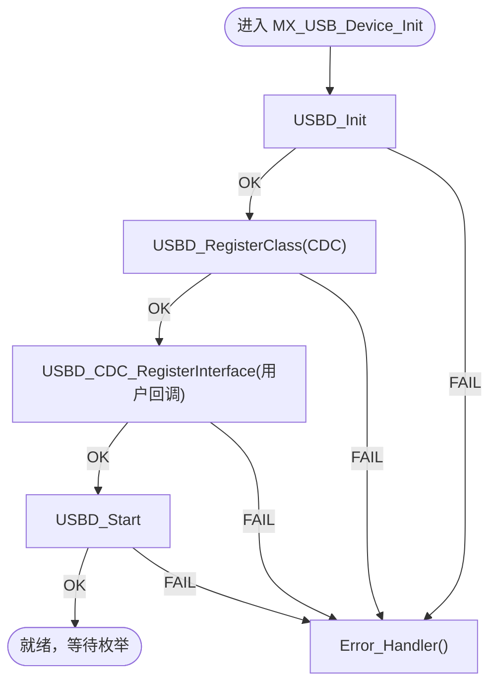
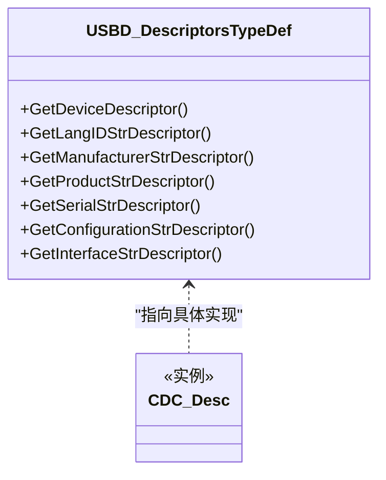
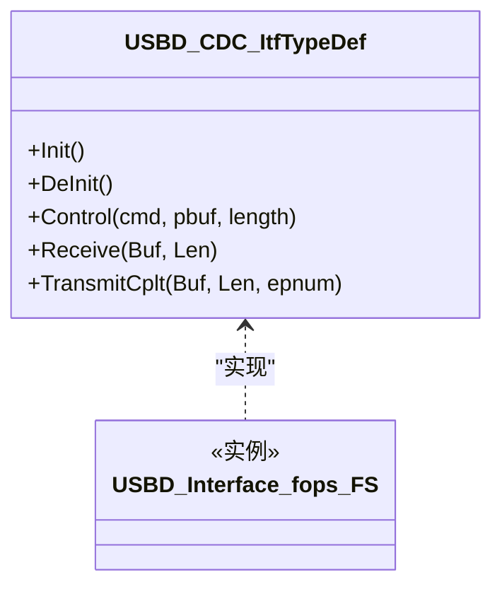
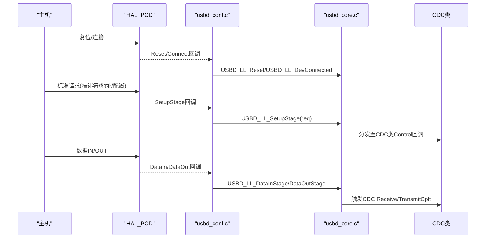
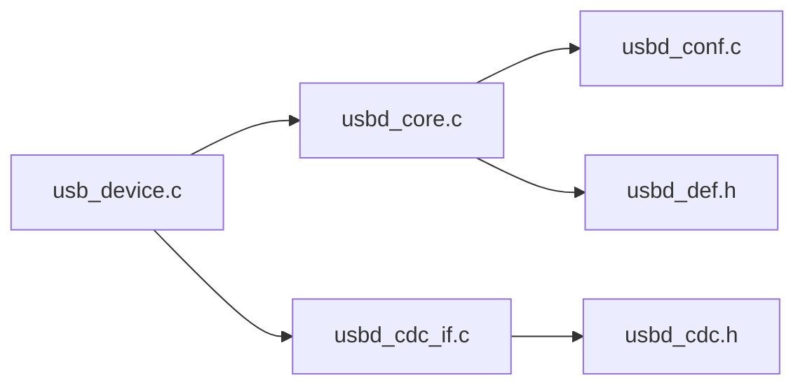

# USB设备初始化配置

<cite>
**本文引用的文件**   
- [main.c](file://Core/Src/main.c)
- [usb_device.c](file://USB_Device/App/usb_device.c)
- [usbd_desc.c](file://USB_Device/App/usbd_desc.c)
- [usbd_cdc_if.c](file://USB_Device/App/usbd_cdc_if.c)
- [usbd_conf.c](file://USB_Device/Target/usbd_conf.c)
- [usbd_def.h](file://Middlewares/ST/STM32_USB_Device_Library/Core/Inc/usbd_def.h)
- [usbd_core.c](file://Middlewares/ST/STM32_USB_Device_Library/Core/Src/usbd_core.c)
- [usbd_cdc.h](file://Middlewares/ST/STM32_USB_Device_Library/Class/CDC/Inc/usbd_cdc.h)
</cite>

## 目录
1. [简介](#简介)
2. [项目结构](#项目结构)
3. [核心组件](#核心组件)
4. [架构总览](#架构总览)
5. [详细组件分析](#详细组件分析)
6. [依赖关系分析](#依赖关系分析)
7. [性能与优化](#性能与优化)
8. [故障排查指南](#故障排查指南)
9. [结论](#结论)

## 简介
本文件面向在STM32G4上基于CubeMX生成的USB CDC虚拟串口工程，聚焦于MX_USB_Device_Init()的完整初始化流程：包括USB核心库初始化、设备描述符配置、CDC类接口设置；解释USB枚举过程、端点配置、通信协议栈初始化；说明USB CDC虚拟串口的Line Coding参数（波特率、数据位、停止位、校验位）；并给出设备状态管理、错误处理机制以及连接调试与性能优化方法。

## 项目结构
该工程采用分层组织：应用层(main.c)、USB设备抽象层(USB_Device/App/*)、底层HAL/LL适配(USB_Device/Target/usbd_conf.c)、USB设备库核心与CDC类(Middlewares/ST/STM32_USB_Device_Library/*)。

图表来源
- [usb_device.c:66-88](file://USB_Device/App/usb_device.c#L66-L88)
- [usbd_core.c:89-122](file://Middlewares/ST/STM32_USB_Device_Library/Core/Src/usbd_core.c#L89-L122)
- [usbd_desc.c:132-141](file://USB_Device/App/usbd_desc.c#L132-L141)
- [usbd_cdc_if.c:138-145](file://USB_Device/App/usbd_cdc_if.c#L138-L145)
- [usbd_conf.c:394-452](file://USB_Device/Target/usbd_conf.c#L394-L452)
- [usbd_cdc.h:44-67](file://Middlewares/ST/STM32_USB_Device_Library/Class/CDC/Inc/usbd_cdc.h#L44-L67)
- [usbd_def.h:285-312](file://Middlewares/ST/STM32_USB_Device_Library/Core/Inc/usbd_def.h#L285-L312)

章节来源
- [main.c:219-290](file://Core/Src/main.c#L219-L290)
- [usb_device.c:66-88](file://USB_Device/App/usb_device.c#L66-L88)

## 核心组件
- MX_USB_Device_Init(): 应用侧统一入口，完成USBD_Init、类注册、CDC接口注册、启动USB。
- USBD_Init/USBD_RegisterClass/USBD_Start: 核心库初始化、加载类、开始运行。
- usbd_conf.c: 将HAL PCD回调桥接到USBD_LL_*，配置PMA端点缓冲区，提供USBD_LL_*实现。
- usbd_desc.c: 提供标准设备描述符与字符串描述符，声明CDC_Desc供核心库使用。
- usbd_cdc_if.c: 实现CDC类用户回调(Init/Control/Receive/TransmitCplt)，暴露CDC_Transmit_FS等API。
- usbd_def.h/usbd_cdc.h: 定义设备状态、端点类型、CDC端点与包大小、LineCoding结构等。

章节来源
- [usb_device.c:66-88](file://USB_Device/App/usb_device.c#L66-L88)
- [usbd_core.c:89-122](file://Middlewares/ST/STM32_USB_Device_Library/Core/Src/usbd_core.c#L89-L122)
- [usbd_conf.c:394-452](file://USB_Device/Target/usbd_conf.c#L394-L452)
- [usbd_desc.c:132-141](file://USB_Device/App/usbd_desc.c#L132-L141)
- [usbd_cdc_if.c:138-145](file://USB_Device/App/usbd_cdc_if.c#L138-L145)
- [usbd_def.h:285-312](file://Middlewares/ST/STM32_USB_Device_Library/Core/Inc/usbd_def.h#L285-L312)
- [usbd_cdc.h:94-100](file://Middlewares/ST/STM32_USB_Device_Library/Class/CDC/Inc/usbd_cdc.h#L94-L100)

## 架构总览
下图展示从应用调用到USB硬件中断的完整链路，以及关键数据结构与回调关系。

图表来源
- [usb_device.c:66-88](file://USB_Device/App/usb_device.c#L66-L88)
- [usbd_core.c:89-122](file://Middlewares/ST/STM32_USB_Device_Library/Core/Src/usbd_core.c#L89-L122)
- [usbd_conf.c:394-452](file://USB_Device/Target/usbd_conf.c#L394-L452)
- [usbd_cdc_if.c:138-145](file://USB_Device/App/usbd_cdc_if.c#L138-L145)

## 详细组件分析

### MX_USB_Device_Init() 初始化流程
- 步骤概览
  - 调用USBD_Init：绑定描述符表、设置初始状态、初始化底层驱动。
  - 调用USBD_RegisterClass：注册CDC类，核心库据此获取配置描述符。
  - 调用USBD_CDC_RegisterInterface：注册CDC用户回调表(Init/DeInit/Control/Receive/TransmitCplt)。
  - 调用USBD_Start：启动USB设备核心，进入枚举等待。
- 错误处理
  - 任一阶段返回非USBD_OK即调用全局Error_Handler挂起。

图表来源
- [usb_device.c:66-88](file://USB_Device/App/usb_device.c#L66-L88)
- [usbd_core.c:89-122](file://Middlewares/ST/STM32_USB_Device_Library/Core/Src/usbd_core.c#L89-L122)

章节来源
- [usb_device.c:66-88](file://USB_Device/App/usb_device.c#L66-L88)
- [usbd_core.c:89-122](file://Middlewares/ST/STM32_USB_Device_Library/Core/Src/usbd_core.c#L89-L122)

### 设备描述符配置
- 描述符表
  - CDC_Desc包含设备、语言ID、厂商、产品、序列号、配置、接口字符串获取函数指针。
- 设备描述符
  - 指定USB版本、设备类/子类/协议、最大包长、VID/PID、字符串索引、配置数量等。
- 字符串描述符
  - 厂商、产品、配置、接口字符串由Get_SerialNum生成序列号，其他字符串直接返回。

图表来源
- [usbd_desc.c:132-141](file://USB_Device/App/usbd_desc.c#L132-L141)
- [usbd_def.h:256-271](file://Middlewares/ST/STM32_USB_Device_Library/Core/Inc/usbd_def.h#L256-L271)

章节来源
- [usbd_desc.c:132-141](file://USB_Device/App/usbd_desc.c#L132-L141)
- [usbd_desc.c:147-167](file://USB_Device/App/usbd_desc.c#L147-L167)
- [usbd_desc.c:222-227](file://USB_Device/App/usbd_desc.c#L222-L227)
- [usbd_desc.c:280-294](file://USB_Device/App/usbd_desc.c#L280-L294)

### CDC类接口设置与端点配置
- CDC端点定义
  - IN数据端点、OUT数据端点、命令端点及对应包大小常量。
- 用户回调表
  - USBD_Interface_fops_FS包含Init/DeInit/Control/Receive/TransmitCplt。
- 底层端点与PMA配置
  - USBD_LL_OpenEP/CloseEP/FlushEP/Stall/ClearStall等由usbd_conf.c映射到HAL_PCD_EP_*。
  - PMA缓冲区分配用于端点0、IN/OUT数据端点与控制端点。

图表来源
- [usbd_cdc.h:102-109](file://Middlewares/ST/STM32_USB_Device_Library/Class/CDC/Inc/usbd_cdc.h#L102-L109)
- [usbd_cdc_if.c:138-145](file://USB_Device/App/usbd_cdc_if.c#L138-L145)
- [usbd_conf.c:513-541](file://USB_Device/Target/usbd_conf.c#L513-L541)
- [usbd_conf.c:443-450](file://USB_Device/Target/usbd_conf.c#L443-L450)

章节来源
- [usbd_cdc.h:44-67](file://Middlewares/ST/STM32_USB_Device_Library/Class/CDC/Inc/usbd_cdc.h#L44-L67)
- [usbd_cdc_if.c:138-145](file://USB_Device/App/usbd_cdc_if.c#L138-L145)
- [usbd_conf.c:513-541](file://USB_Device/Target/usbd_conf.c#L513-L541)
- [usbd_conf.c:443-450](file://USB_Device/Target/usbd_conf.c#L443-L450)

### USB枚举过程与协议栈初始化
- 枚举关键阶段
  - Reset回调：设置速度、复位设备状态。
  - Setup阶段：解析标准/类请求，分发到CDC类处理。
  - Data In/Out：端点数据传输。
  - Connect/Disconnect：连接状态变化通知。
  - SOF：周期性事件（可选）。
- 协议栈初始化
  - USBD_LL_Init中完成HAL_PCD_Init与回调注册，随后USBD_RegisterClass使核心库持有配置描述符，USBD_Start后进入枚举等待。

图表来源
- [usbd_conf.c:214-236](file://USB_Device/Target/usbd_conf.c#L214-L236)
- [usbd_conf.c:132-144](file://USB_Device/Target/usbd_conf.c#L132-L144)
- [usbd_conf.c:152-165](file://USB_Device/Target/usbd_conf.c#L152-L165)
- [usbd_conf.c:173-186](file://USB_Device/Target/usbd_conf.c#L173-L186)
- [usbd_conf.c:346-379](file://USB_Device/Target/usbd_conf.c#L346-L379)
- [usbd_core.c:89-122](file://Middlewares/ST/STM32_USB_Device_Library/Core/Src/usbd_core.c#L89-L122)

章节来源
- [usbd_conf.c:214-236](file://USB_Device/Target/usbd_conf.c#L214-L236)
- [usbd_conf.c:132-144](file://USB_Device/Target/usbd_conf.c#L132-L144)
- [usbd_conf.c:152-165](file://USB_Device/Target/usbd_conf.c#L152-L165)
- [usbd_conf.c:173-186](file://USB_Device/Target/usbd_conf.c#L173-L186)
- [usbd_conf.c:346-379](file://USB_Device/Target/usbd_conf.c#L346-L379)

### USB CDC虚拟串口配置参数(Line Coding)
- Line Coding结构字段
  - bitrate：波特率
  - format：停止位(0=1, 1=1.5, 2=2)
  - paritytype：校验位(0=无, 1=奇, 2=偶, 3=标记, 4=空格)
  - datatype：数据位(5/6/7/8/16)
- 相关请求
  - CDC_SET_LINE_CODING / CDC_GET_LINE_CODING
- 当前实现
  - CDC_Control_FS中对SET_LINE_CODING/GET_LINE_CODING分支为空占位，未实际更新内部状态或应用层配置。

章节来源
- [usbd_cdc.h:94-100](file://Middlewares/ST/STM32_USB_Device_Library/Class/CDC/Inc/usbd_cdc.h#L94-L100)
- [usbd_cdc.h:77-80](file://Middlewares/ST/STM32_USB_Device_Library/Class/CDC/Inc/usbd_cdc.h#L77-L80)
- [usbd_cdc_if.c:180-244](file://USB_Device/App/usbd_cdc_if.c#L180-L244)

### 端点配置与PMA缓冲
- 端点定义
  - CDC_IN_EP/CDC_OUT_EP/CDC_CMD_EP及FS/HS包大小常量。
- PMA分配
  - 为端点0、IN/OUT数据端点、控制端点分配单缓冲PMA区域。
- 端点操作
  - Open/Close/Flush/Stall/ClearStall均映射至HAL_PCD_EP_*。

章节来源
- [usbd_cdc.h:44-67](file://Middlewares/ST/STM32_USB_Device_Library/Class/CDC/Inc/usbd_cdc.h#L44-L67)
- [usbd_conf.c:443-450](file://USB_Device/Target/usbd_conf.c#L443-L450)
- [usbd_conf.c:513-541](file://USB_Device/Target/usbd_conf.c#L513-L541)

### 设备状态管理与错误处理
- 设备状态
  - DEFAULT/ADDRESSED/CONFIGURED/SUSPENDED等状态机变量位于设备句柄中。
- 错误处理
  - 初始化失败路径统一调用Error_Handler；USB状态转换通过USBD_LL_*封装HAL状态。

章节来源
- [usbd_def.h:142-146](file://Middlewares/ST/STM32_USB_Device_Library/Core/Inc/usbd_def.h#L142-L146)
- [usbd_def.h:285-312](file://Middlewares/ST/STM32_USB_Device_Library/Core/Inc/usbd_def.h#L285-L312)
- [usbd_conf.c:774-797](file://USB_Device/Target/usbd_conf.c#L774-L797)
- [usb_device.c:73-84](file://USB_Device/App/usb_device.c#L73-L84)

## 依赖关系分析
- 模块耦合
  - usb_device.c依赖usbd_core.c与usbd_cdc_if.c；usbd_core.c依赖usbd_conf.c提供的USBD_LL_*；usbd_cdc_if.c依赖usbd_cdc.h中的类型与常量。
- 外部依赖
  - HAL_PCD作为底层驱动，负责USB外设寄存器访问与中断处理。
- 潜在循环依赖
  - 未见循环引用；回调通过函数指针解耦。

图表来源
- [usb_device.c:66-88](file://USB_Device/App/usb_device.c#L66-L88)
- [usbd_core.c:89-122](file://Middlewares/ST/STM32_USB_Device_Library/Core/Src/usbd_core.c#L89-L122)
- [usbd_cdc_if.c:138-145](file://USB_Device/App/usbd_cdc_if.c#L138-L145)
- [usbd_conf.c:394-452](file://USB_Device/Target/usbd_conf.c#L394-L452)
- [usbd_cdc.h:44-67](file://Middlewares/ST/STM32_USB_Device_Library/Class/CDC/Inc/usbd_cdc.h#L44-L67)
- [usbd_def.h:285-312](file://Middlewares/ST/STM32_USB_Device_Library/Core/Inc/usbd_def.h#L285-L312)

章节来源
- [usb_device.c:66-88](file://USB_Device/App/usb_device.c#L66-L88)
- [usbd_core.c:89-122](file://Middlewares/ST/STM32_USB_Device_Library/Core/Src/usbd_core.c#L89-L122)
- [usbd_cdc_if.c:138-145](file://USB_Device/App/usbd_cdc_if.c#L138-L145)
- [usbd_conf.c:394-452](file://USB_Device/Target/usbd_conf.c#L394-L452)

## 性能与优化
- 端点包大小与吞吐
  - FS模式下数据端点最大包长为64字节；合理批量发送可减少事务开销。
- 传输模式
  - 当前CDC_Transmit_FS为非阻塞队列式，若频繁发送需确保TxState空闲后再提交，避免USBD_BUSY。
- DMA与PMA
  - 已为端点配置单缓冲PMA；如需更高吞吐可评估双缓冲与DMA配合（需修改usbd_conf.c与CDC类实现）。
- 系统时钟
  - USB时钟源选择HSI48，确保频率稳定；避免在枚举期间执行耗时任务。

[本节为通用指导，不直接分析具体文件]

## 故障排查指南
- 常见问题定位
  - 枚举失败：检查USBD_LL_Init返回值与PMA端点配置是否覆盖所有端点。
  - 无法接收/发送：确认CDC_Receive_FS中重新准备接收包；检查CDC_Transmit_FS返回USBD_BUSY时的重试策略。
  - Line Coding无效：需在CDC_Control_FS中实现SET_LINE_CODING逻辑，保存并应用新参数。
- 调试建议
  - 在usbd_conf.c各回调中增加断点或LED指示，观察Reset/Setup/DataIn/DataOut/Connect/Disconnect触发顺序。
  - 使用上位机串口工具查看端口属性与Line Coding是否被正确下发。
  - 关注Error_Handler触发位置，结合返回码定位失败阶段。

章节来源
- [usbd_conf.c:394-452](file://USB_Device/Target/usbd_conf.c#L394-L452)
- [usbd_cdc_if.c:261-268](file://USB_Device/App/usbd_cdc_if.c#L261-L268)
- [usbd_cdc_if.c:281-293](file://USB_Device/App/usbd_cdc_if.c#L281-L293)
- [usbd_cdc_if.c:180-244](file://USB_Device/App/usbd_cdc_if.c#L180-L244)

## 结论
MX_USB_Device_Init()通过串联USBD_Init、类注册、CDC接口注册与启动，完成了从核心库到CDC类的完整装配；usbd_conf.c将HAL PCD中断与回调桥接到底层，usbd_desc.c提供描述符，usbd_cdc_if.c提供用户数据通道。当前工程中Line Coding尚未落地应用，建议在CDC_Control_FS中完善参数处理；同时可根据吞吐需求优化端点缓冲与传输策略。