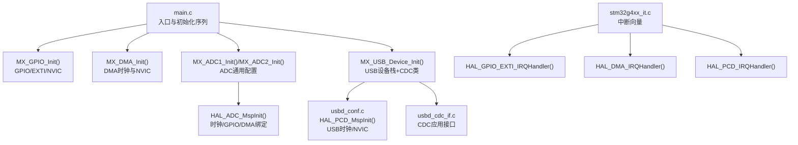
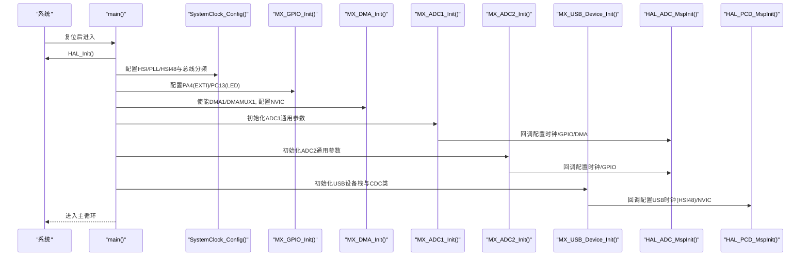
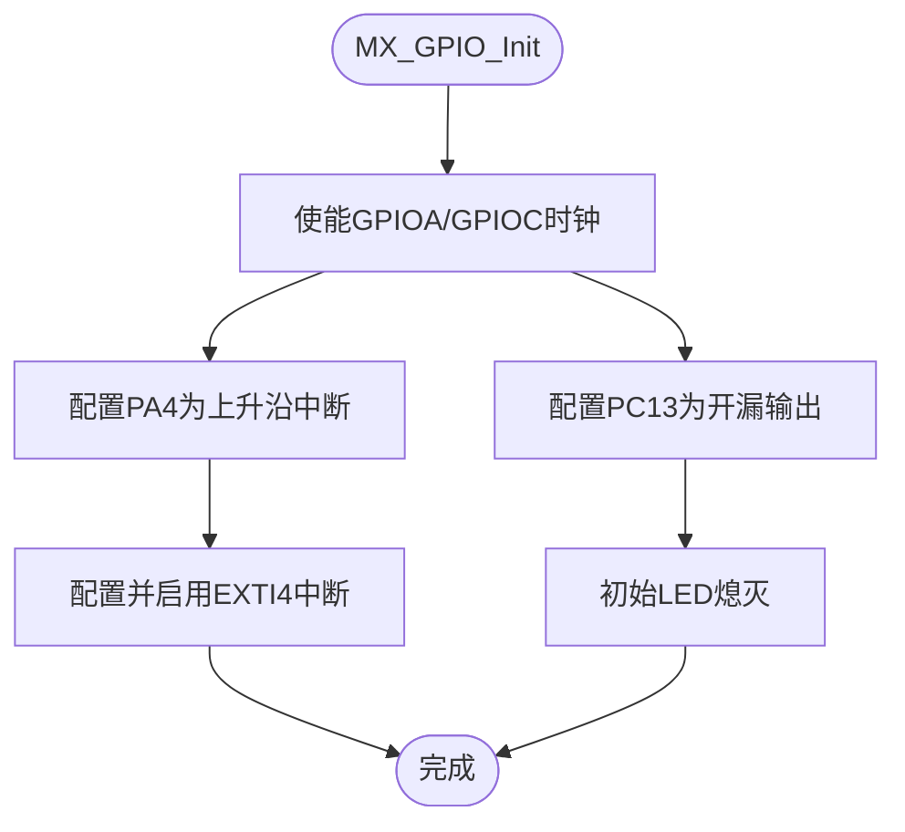
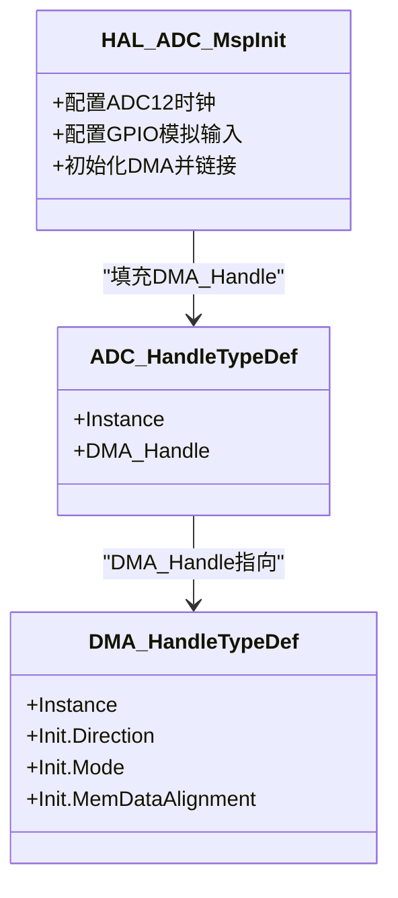
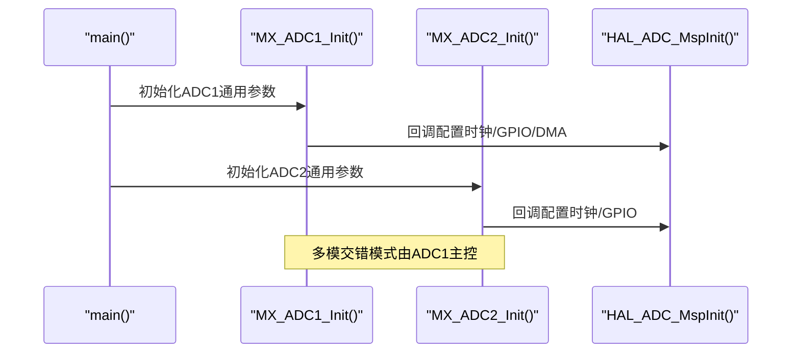
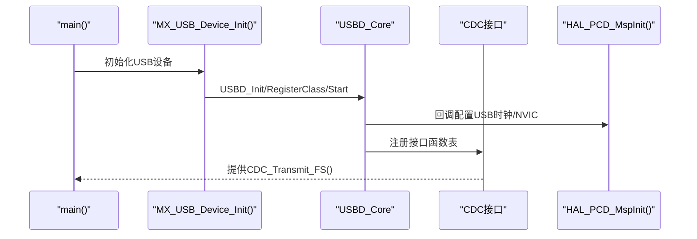
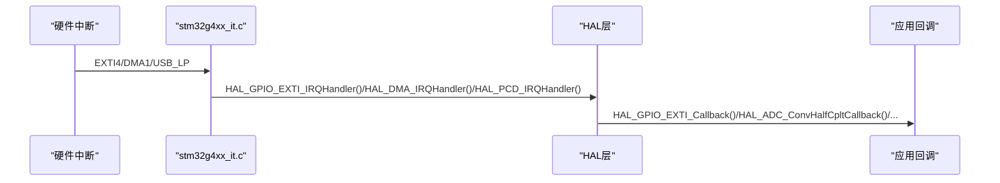
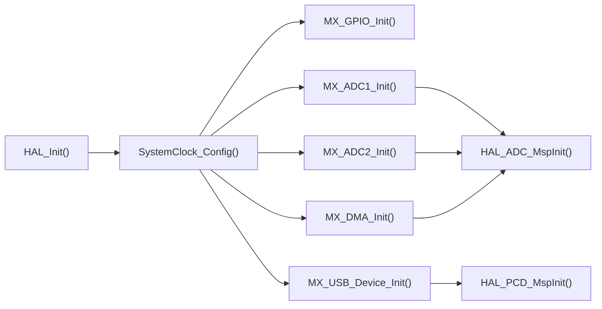

# 外设初始化配置

<cite>
**本文引用的文件**   
- [Core/Src/main.c](file://Core/Src/main.c)
- [Core/Inc/main.h](file://Core/Inc/main.h)
- [Core/Src/stm32g4xx_hal_msp.c](file://Core/Src/stm32g4xx_hal_msp.c)
- [Core/Inc/stm32g4xx_hal_conf.h](file://Core/Inc/stm32g4xx_hal_conf.h)
- [USB_Device/App/usb_device.c](file://USB_Device/App/usb_device.c)
- [USB_Device/App/usbd_cdc_if.c](file://USB_Device/App/usbd_cdc_if.c)
- [USB_Device/Target/usbd_conf.c](file://USB_Device/Target/usbd_conf.c)
- [Core/Src/stm32g4xx_it.c](file://Core/Src/stm32g4xx_it.c)
</cite>

## 目录
1. [简介](#简介)
2. [项目结构](#项目结构)
3. [核心组件](#核心组件)
4. [架构总览](#架构总览)
5. [详细组件分析](#详细组件分析)
6. [依赖关系分析](#依赖关系分析)
7. [性能与功耗考量](#性能与功耗考量)
8. [故障排查指南](#故障排查指南)
9. [结论](#结论)
10. [附录：初始化顺序与参数清单](#附录初始化顺序与参数清单)

## 简介
本文件面向STM32G4系列工程，系统化梳理外设初始化流程与MSP（MCU Specific Package）机制。重点解释各MX_*_Init()函数的调用顺序、依赖关系与关键参数配置，覆盖GPIO、DMA、ADC、USB等外设；并提供最佳实践、常见问题定位方法与调试技巧。

## 项目结构
本项目采用CubeMX生成的标准分层结构：
- Core层：系统初始化、中断处理、HAL MSP实现与应用主循环
- USB_Device层：USB设备栈、CDC类应用接口与底层目标适配
- Drivers/CMSIS与HAL驱动：由工具链提供，工程中通过宏开关启用所需模块

图表来源
- [Core/Src/main.c:226-255](file://Core/Src/main.c#L226-L255)
- [Core/Src/stm32g4xx_hal_msp.c:92-185](file://Core/Src/stm32g4xx_hal_msp.c#L92-L185)
- [USB_Device/App/usb_device.c:66-88](file://USB_Device/App/usb_device.c#L66-L88)
- [USB_Device/Target/usbd_conf.c:72-101](file://USB_Device/Target/usbd_conf.c#L72-L101)
- [Core/Src/stm32g4xx_it.c:205-242](file://Core/Src/stm32g4xx_it.c#L205-L242)

章节来源
- [Core/Src/main.c:226-255](file://Core/Src/main.c#L226-L255)
- [Core/Inc/stm32g4xx_hal_conf.h:37-76](file://Core/Inc/stm32g4xx_hal_conf.h#L37-L76)

## 核心组件
- 系统与时钟
  - HAL_Init()完成基础外设复位、SysTick与NVIC分组设置
  - SystemClock_Config()配置HSI/PLL/HSI48及总线分频，为ADC与USB提供稳定时钟源
- GPIO与外部中断
  - MX_GPIO_Init()使能端口时钟、配置PA4为上升沿触发EXTI并开启中断
  - 同时配置PC13为开漏输出用于LED指示
- DMA
  - MX_DMA_Init()使能DMA1与DMAMUX1时钟，配置DMA1通道1中断优先级并启用
- ADC（双通道交错模式）
  - MX_ADC1_Init()/MX_ADC2_Init()分别完成ADC1/ADC2的通用参数与通道配置
  - HAL_ADC_MspInit()负责ADC12时钟源选择、GPIO模拟输入复用、DMA绑定与中断链路
- USB设备（CDC虚拟串口）
  - MX_USB_Device_Init()初始化USB设备栈、注册CDC类与接口回调
  - usbd_conf.c中HAL_PCD_MspInit()配置USB时钟（HSI48）、使能USB时钟与中断

章节来源
- [Core/Src/main.c:296-337](file://Core/Src/main.c#L296-L337)
- [Core/Src/main.c:488-520](file://Core/Src/main.c#L488-L520)
- [Core/Src/main.c:469-481](file://Core/Src/main.c#L469-L481)
- [Core/Src/main.c:344-464](file://Core/Src/main.c#L344-L464)
- [Core/Src/stm32g4xx_hal_msp.c:92-185](file://Core/Src/stm32g4xx_hal_msp.c#L92-L185)
- [USB_Device/App/usb_device.c:66-88](file://USB_Device/App/usb_device.c#L66-L88)
- [USB_Device/Target/usbd_conf.c:72-101](file://USB_Device/Target/usbd_conf.c#L72-L101)

## 架构总览
下图展示从系统启动到外设就绪的关键路径与数据流：

图表来源
- [Core/Src/main.c:226-255](file://Core/Src/main.c#L226-L255)
- [Core/Src/main.c:296-337](file://Core/Src/main.c#L296-L337)
- [Core/Src/stm32g4xx_hal_msp.c:92-185](file://Core/Src/stm32g4xx_hal_msp.c#L92-L185)
- [USB_Device/Target/usbd_conf.c:72-101](file://USB_Device/Target/usbd_conf.c#L72-L101)

## 详细组件分析

### GPIO与EXTI初始化
- 端口与时钟
  - 使能GPIOA与GPIOC时钟
- 引脚配置
  - PA4：上升沿中断模式，无上拉
  - PC13：开漏输出，低电平点亮LED
- 中断
  - EXTI4_IRQn优先级设为最高，并启用中断
- 回调
  - HAL_GPIO_EXTI_Callback()在ISR上下文中记录触发时刻的DMA剩余计数，作为“触发位置”快照

图表来源
- [Core/Src/main.c:488-520](file://Core/Src/main.c#L488-L520)
- [Core/Src/main.c:91-113](file://Core/Src/main.c#L91-L113)

章节来源
- [Core/Src/main.c:488-520](file://Core/Src/main.c#L488-L520)
- [Core/Src/main.c:91-113](file://Core/Src/main.c#L91-L113)

### DMA初始化与ADC DMA链路
- 时钟与中断
  - 使能DMA1与DMAMUX1时钟
  - 配置DMA1_Channel1_IRQn优先级并启用
- ADC1 DMA绑定
  - 在HAL_ADC_MspInit()中为ADC1配置DMA1通道1，方向外设到内存，循环模式，字对齐
  - 使用__HAL_LINKDMA将DMA句柄与ADC句柄关联
- 传输模式
  - 主循环中使用多模交错DMA启动，半传输与全传输回调用于判定采集完成

图表来源
- [Core/Src/stm32g4xx_hal_msp.c:127-143](file://Core/Src/stm32g4xx_hal_msp.c#L127-L143)
- [Core/Src/main.c:469-481](file://Core/Src/main.c#L469-L481)

章节来源
- [Core/Src/main.c:469-481](file://Core/Src/main.c#L469-L481)
- [Core/Src/stm32g4xx_hal_msp.c:92-185](file://Core/Src/stm32g4xx_hal_msp.c#L92-L185)

### ADC初始化（ADC1/ADC2）
- 通用参数（ADC1）
  - 分辨率12位，右对齐，连续转换，软件触发，DMA连续请求使能，溢出保护保留数据
  - 多模模式：ADC_DUALMODE_INTERL（交错），DMA访问模式12/10位
  - 通道：ADC_CHANNEL_3，差分端接，采样时间2.5周期
- 通用参数（ADC2）
  - 与ADC1类似，但DMA连续请求关闭（由ADC1主控DMA）
  - 通道：ADC_CHANNEL_3，差分端接，采样时间2.5周期
- MSP细节
  - ADC12时钟源选择PLL
  - ADC1：PA2/PA3模拟输入；ADC2：PA6/PA7模拟输入
  - ADC1绑定DMA1通道1

图表来源
- [Core/Src/main.c:344-464](file://Core/Src/main.c#L344-L464)
- [Core/Src/stm32g4xx_hal_msp.c:92-185](file://Core/Src/stm32g4xx_hal_msp.c#L92-L185)

章节来源
- [Core/Src/main.c:344-464](file://Core/Src/main.c#L344-L464)
- [Core/Src/stm32g4xx_hal_msp.c:92-185](file://Core/Src/stm32g4xx_hal_msp.c#L92-L185)

### USB设备与CDC类初始化
- 设备栈初始化
  - USBD_Init()初始化设备描述符与速度
  - USBD_RegisterClass()注册CDC类
  - USBD_CDC_RegisterInterface()注册CDC接口函数表
  - USBD_Start()启动USB设备
- 底层适配
  - HAL_PCD_MspInit()配置USB时钟源为HSI48，使能USB时钟，配置并启用USB_LP中断
- CDC应用接口
  - CDC_Transmit_FS()封装发送，内部检查TxState避免重复发送
  - CDC_Receive_FS()接收完成后重新挂起接收

图表来源
- [USB_Device/App/usb_device.c:66-88](file://USB_Device/App/usb_device.c#L66-L88)
- [USB_Device/Target/usbd_conf.c:72-101](file://USB_Device/Target/usbd_conf.c#L72-L101)
- [USB_Device/App/usbd_cdc_if.c:281-293](file://USB_Device/App/usbd_cdc_if.c#L281-L293)

章节来源
- [USB_Device/App/usb_device.c:66-88](file://USB_Device/App/usb_device.c#L66-L88)
- [USB_Device/Target/usbd_conf.c:72-101](file://USB_Device/Target/usbd_conf.c#L72-L101)
- [USB_Device/App/usbd_cdc_if.c:281-293](file://USB_Device/App/usbd_cdc_if.c#L281-L293)

### 中断与回调链路
- EXTI4_IRQHandler()调用HAL_GPIO_EXTI_IRQHandler()，最终进入用户回调HAL_GPIO_EXTI_Callback()
- DMA1_Channel1_IRQHandler()调用HAL_DMA_IRQHandler()，触发ADC半传输/全传输回调
- USB_LP_IRQHandler()调用HAL_PCD_IRQHandler()，驱动USB设备栈事件

图表来源
- [Core/Src/stm32g4xx_it.c:205-242](file://Core/Src/stm32g4xx_it.c#L205-L242)
- [Core/Src/main.c:91-149](file://Core/Src/main.c#L91-L149)

章节来源
- [Core/Src/stm32g4xx_it.c:205-242](file://Core/Src/stm32g4xx_it.c#L205-L242)
- [Core/Src/main.c:91-149](file://Core/Src/main.c#L91-L149)

## 依赖关系分析
- 初始化顺序依赖
  - HAL_Init()必须先于所有外设初始化
  - SystemClock_Config()需在ADC/USB之前完成，确保PLL与HSI48可用
  - GPIO/EXTI可在任意外设前或后，但建议在ADC/USB前完成，以便触发时序正确
  - DMA需在ADC启动前完成，且DMA中断需先于ADC DMA回调
  - USB设备栈初始化应在ADC开始采集之后或并行，避免竞争
- 资源耦合
  - ADC1与ADC2共享ADC12时钟域，MSP中以引用计数方式控制时钟使能
  - ADC1独占DMA1通道1，ADC2不直接绑定DMA
  - USB使用HSI48作为时钟源，独立于ADC时钟域

图表来源
- [Core/Src/main.c:226-255](file://Core/Src/main.c#L226-L255)
- [Core/Src/stm32g4xx_hal_msp.c:92-185](file://Core/Src/stm32g4xx_hal_msp.c#L92-L185)
- [USB_Device/Target/usbd_conf.c:72-101](file://USB_Device/Target/usbd_conf.c#L72-L101)

章节来源
- [Core/Src/main.c:226-255](file://Core/Src/main.c#L226-L255)
- [Core/Src/stm32g4xx_hal_msp.c:92-185](file://Core/Src/stm32g4xx_hal_msp.c#L92-L185)
- [USB_Device/Target/usbd_conf.c:72-101](file://USB_Device/Target/usbd_conf.c#L72-L101)

## 性能与功耗考量
- 时钟策略
  - ADC时钟来自PLL，保证高速采样稳定性；USB使用HSI48，满足FS速率要求
- DMA效率
  - 使用循环模式与交错模式减少CPU干预；注意NDTR瞬态导致的remaining=0边界情况
- 中断优先级
  - EXTI4与DMA1通道1均设为高优先级，确保触发与数据搬运及时
- 功耗建议
  - 空闲时关闭不必要外设时钟；USB低功耗模式需谨慎切换时钟

[本节为通用指导，无需特定文件来源]

## 故障排查指南
- 初始化失败
  - 检查各MX_*_Init()返回值，统一进入Error_Handler()断点定位
  - 确认相关外设时钟已在MSP中使能（如ADC12、USB）
- 无数据或数据错乱
  - 核对ADC通道与引脚映射是否正确（PA2/PA3/PA6/PA7）
  - 确认DMA方向、对齐与循环模式配置一致
  - 检查多模交错模式参数是否匹配
- 触发丢失或误触发
  - 在HAL_GPIO_EXTI_Callback()中增加去抖与重入保护
  - 读取DMA剩余计数时进行边界保护，避免NDTR重载瞬间
- USB无法枚举或发送阻塞
  - 确认HSI48已使能且频率稳定
  - 检查CDC_Transmit_FS()返回状态，必要时轮询重试
- 中断未进入
  - 确认NVIC优先级与使能位
  - 在中断向量表中确认对应Handler存在并调用HAL层处理函数

章节来源
- [Core/Src/main.c:530-539](file://Core/Src/main.c#L530-L539)
- [Core/Src/stm32g4xx_it.c:205-242](file://Core/Src/stm32g4xx_it.c#L205-L242)
- [USB_Device/App/usbd_cdc_if.c:281-293](file://USB_Device/App/usbd_cdc_if.c#L281-L293)

## 结论
本工程遵循CubeMX标准初始化流程：先系统与时钟，再GPIO/EXTI、DMA、ADC、USB。MSP机制将平台相关资源（时钟、GPIO、DMA、NVIC）与HAL抽象解耦，便于移植与维护。通过合理的初始化顺序、严格的错误处理与中断优先级设计，可实现稳定的ADC交错采集与USB CDC数据传输。

[本节为总结性内容，无需特定文件来源]

## 附录：初始化顺序与参数清单
- 初始化顺序
  - HAL_Init()
  - SystemClock_Config()
  - MX_GPIO_Init()
  - MX_DMA_Init()
  - MX_ADC1_Init()
  - MX_ADC2_Init()
  - MX_USB_Device_Init()
- 关键参数要点
  - ADC1：12位、右对齐、连续、DMA连续、溢出保留、多模交错、通道3差分、采样2.5周期
  - ADC2：与ADC1一致，DMA连续关闭
  - DMA1通道1：外设到内存、循环、字对齐、低优先级
  - USB：HSI48时钟源、FS速度、CDC类、IN/OUT端点PMA配置
  - 中断：EXTI4、DMA1通道1、USB_LP均为高优先级并启用

章节来源
- [Core/Src/main.c:226-255](file://Core/Src/main.c#L226-L255)
- [Core/Src/main.c:344-464](file://Core/Src/main.c#L344-L464)
- [Core/Src/main.c:469-481](file://Core/Src/main.c#L469-L481)
- [Core/Src/stm32g4xx_hal_msp.c:92-185](file://Core/Src/stm32g4xx_hal_msp.c#L92-L185)
- [USB_Device/App/usb_device.c:66-88](file://USB_Device/App/usb_device.c#L66-L88)
- [USB_Device/Target/usbd_conf.c:72-101](file://USB_Device/Target/usbd_conf.c#L72-L101)