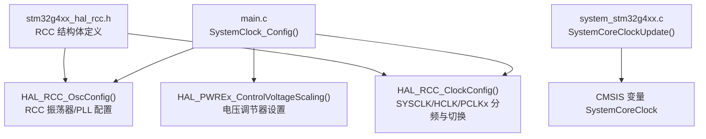
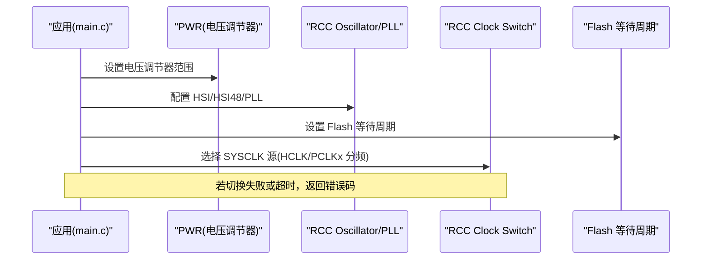
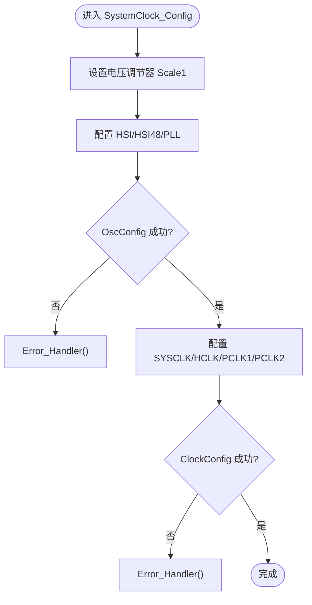
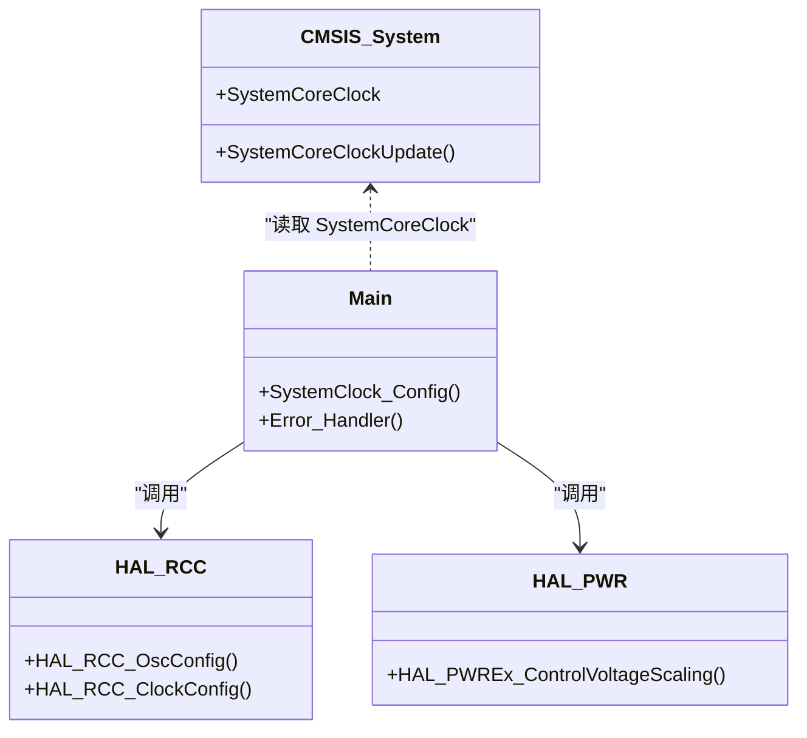

# 系统时钟初始化配置

<cite>
**本文引用的文件列表**
- [Core/Src/main.c](file://Core/Src/main.c)
- [Core/Inc/main.h](file://Core/Inc/main.h)
- [Core/Src/system_stm32g4xx.c](file://Core/Src/system_stm32g4xx.c)
- [Drivers/STM32G4xx_HAL_Driver/Inc/stm32g4xx_hal_rcc.h](file://Drivers/STM32G4xx_HAL_Driver/Inc/stm32g4xx_hal_rcc.h)
- [Drivers/STM32G4xx_HAL_Driver/Src/stm32g4xx_hal_rcc.c](file://Drivers/STM32G4xx_HAL_Driver/Src/stm32g4xx_hal_rcc.c)
</cite>

## 目录
1. [简介](#简介)
2. [项目结构](#项目结构)
3. [核心组件](#核心组件)
4. [架构总览](#架构总览)
5. [详细组件分析](#详细组件分析)
6. [依赖关系分析](#依赖关系分析)
7. [性能与功耗考虑](#性能与功耗考虑)
8. [故障排查指南](#故障排查指南)
9. [结论](#结论)

## 简介
本文件面向在 STM32G4 系列上基于 HAL 的系统时钟初始化，重点解析 main.c 中的 SystemClock_Config() 函数。内容涵盖：
- HSI 内部高速振荡器启用、HSI48 内部高速时钟启用
- PLL 锁相环参数配置（输入源、分频/倍频因子）
- 电压调节器设置与时钟切换流程
- AHB/APB1/APB2 总线分频与时钟频率推导
- 时钟配置失败的错误处理与回退机制
- 时钟功耗优化与稳定性保证方法

## 项目结构
本项目为典型的 CubeMX 生成工程，系统时钟相关代码位于应用层 main.c，底层 RCC HAL 驱动位于 Drivers/STM32G4xx_HAL_Driver。启动阶段由 CMSIS system_stm32g4xx.c 提供默认系统时钟变量更新逻辑。

图示来源
- [Core/Src/main.c:296-337](file://Core/Src/main.c#L296-L337)
- [Drivers/STM32G4xx_HAL_Driver/Src/stm32g4xx_hal_rcc.c:766-899](file://Drivers/STM32G4xx_HAL_Driver/Src/stm32g4xx_hal_rcc.c#L766-L899)
- [Core/Src/system_stm32g4xx.c:230-272](file://Core/Src/system_stm32g4xx.c#L230-L272)
- [Drivers/STM32G4xx_HAL_Driver/Inc/stm32g4xx_hal_rcc.h:45-121](file://Drivers/STM32G4xx_HAL_Driver/Inc/stm32g4xx_hal_rcc.h#L45-L121)

章节来源
- [Core/Src/main.c:296-337](file://Core/Src/main.c#L296-L337)
- [Core/Src/system_stm32g4xx.c:230-272](file://Core/Src/system_stm32g4xx.c#L230-L272)
- [Drivers/STM32G4xx_HAL_Driver/Inc/stm32g4xx_hal_rcc.h:45-121](file://Drivers/STM32G4xx_HAL_Driver/Inc/stm32g4xx_hal_rcc.h#L45-L121)
- [Drivers/STM32G4xx_HAL_Driver/Src/stm32g4xx_hal_rcc.c:766-899](file://Drivers/STM32G4xx_HAL_Driver/Src/stm32g4xx_hal_rcc.c#L766-L899)

## 核心组件
- SystemClock_Config()：完成电源调节器设置、HSI/HSI48 启用、PLL 配置、系统时钟源切换与总线分频。
- HAL_RCC_OscConfig()：根据 RCC_OscInitTypeDef 配置振荡器与 PLL。
- HAL_RCC_ClockConfig()：根据 RCC_ClkInitTypeDef 配置 SYSCLK/HCLK/PCLK1/PCLK2 并执行时钟源切换。
- HAL_PWREx_ControlVoltageScaling()：设置 PWR 电压调节器范围，确保高主频下 Flash 访问时序正确。
- Error_Handler()：统一错误处理入口，当前实现为关闭中断后进入死循环。

章节来源
- [Core/Src/main.c:296-337](file://Core/Src/main.c#L296-L337)
- [Core/Src/main.c:530-539](file://Core/Src/main.c#L530-L539)
- [Drivers/STM32G4xx_HAL_Driver/Inc/stm32g4xx_hal_rcc.h:45-121](file://Drivers/STM32G4xx_HAL_Driver/Inc/stm32g4xx_hal_rcc.h#L45-L121)
- [Drivers/STM32G4xx_HAL_Driver/Src/stm32g4xx_hal_rcc.c:766-899](file://Drivers/STM32G4xx_HAL_Driver/Src/stm32g4xx_hal_rcc.c#L766-L899)

## 架构总览
下图展示了 SystemClock_Config() 的调用链与时钟树关键节点。

图示来源
- [Core/Src/main.c:296-337](file://Core/Src/main.c#L296-L337)
- [Drivers/STM32G4xx_HAL_Driver/Src/stm32g4xx_hal_rcc.c:766-899](file://Drivers/STM32G4xx_HAL_Driver/Src/stm32g4xx_hal_rcc.c#L766-L899)

## 详细组件分析

### SystemClock_Config() 时钟树配置详解
- 电压调节器设置
  - 调用 HAL_PWREx_ControlVoltageScaling(PWR_REGULATOR_VOLTAGE_SCALE1)，将内核供电范围设置为 Scale1，以支持更高主频并确保 Flash 读取时序满足要求。
- 振荡器与 PLL 配置（RCC_OscInitStruct）
  - OscillatorType = HSI | HSI48：同时启用 HSI 与 HSI48。
  - HSIState = ON，使用默认校准值。
  - HSI48State = ON：为 USB/随机数等模块提供 48 MHz 时钟源。
  - PLL.PLLState = ON，PLLSource = HSI，PLLM=1，PLLN=15，PLLP=4，PLLQ=4，PLLR=4。
  - 通过 HAL_RCC_OscConfig() 完成配置；若失败则调用 Error_Handler()。
- 系统时钟与总线分频（RCC_ClkInitStruct）
  - ClockType = HCLK | SYSCLK | PCLK1 | PCLK2。
  - SYSCLKSource = PLLCLK：系统时钟来自 PLL。
  - AHBCLKDivider = DIV1，APB1CLKDivider = DIV1，APB2CLKDivider = DIV1。
  - 通过 HAL_RCC_ClockConfig() 完成切换与分频；若失败则调用 Error_Handler()。

图示来源
- [Core/Src/main.c:296-337](file://Core/Src/main.c#L296-L337)

章节来源
- [Core/Src/main.c:296-337](file://Core/Src/main.c#L296-L337)

### 时钟源与分频推导（CPU、AHB、APB1、APB2）
- 输入时钟
  - HSI 标称 16 MHz（由系统头文件常量定义）。
- PLL 输出
  - VCO 输入 = HSI / PLLM = 16 MHz / 1 = 16 MHz
  - VCO 输出 = 16 MHz × PLLN = 16 MHz × 15 = 240 MHz
  - SYSCLK = VCO / PLLR = 240 MHz / 4 = 60 MHz
- 总线分频
  - HCLK = SYSCLK / AHB_DIV1 = 60 MHz
  - PCLK1 = HCLK / APB1_DIV1 = 60 MHz
  - PCLK2 = HCLK / APB2_DIV1 = 60 MHz
- 注意
  - 实际运行中，HAL_RCC_ClockConfig() 会在切换到高于 80 MHz 的目标时插入中间步骤（先 HCLK/2），再恢复至目标分频，以避免过冲/欠冲问题。当前目标 60 MHz 未触发该保护路径，但仍受其通用流程约束。

章节来源
- [Core/Src/main.c:296-337](file://Core/Src/main.c#L296-L337)
- [Drivers/STM32G4xx_HAL_Driver/Src/stm32g4xx_hal_rcc.c:806-859](file://Drivers/STM32G4xx_HAL_Driver/Src/stm32g4xx_hal_rcc.c#L806-L859)

### 时钟切换与稳定性保障
- 切换前检查
  - 若选择 PLL 作为 SYSCLK，需确认 PLLRDY 标志置位；否则返回错误。
  - 若选择 HSE/HSI，需确认对应 READY 标志。
- 切换过程
  - 修改 SW 位选择新时钟源，轮询 SWS 位直到切换完成，带超时保护。
- 过冲/欠冲管理
  - 当目标频率 > 80 MHz 时，先设置 HCLK/2 作为中间状态，再切换到最终分频，避免瞬态不稳定。

章节来源
- [Drivers/STM32G4xx_HAL_Driver/Src/stm32g4xx_hal_rcc.c:806-873](file://Drivers/STM32G4xx_HAL_Driver/Src/stm32g4xx_hal_rcc.c#L806-L873)

### 错误处理与回退机制
- 当前实现
  - 所有配置失败分支均调用 Error_Handler()，该函数关闭全局中断并进入死循环，无自动回退到 HSI 的逻辑。
- 建议的回退策略
  - 在调用 HAL_RCC_OscConfig()/HAL_RCC_ClockConfig() 之前保存当前时钟源与分频。
  - 若失败，可尝试降级配置（如降低 PLLN/PLLR 或改用 HSI 直接作为 SYSCLK），并在成功后重新初始化外设。
  - 增加日志/调试引脚指示失败点，便于定位。

章节来源
- [Core/Src/main.c:296-337](file://Core/Src/main.c#L296-L337)
- [Core/Src/main.c:530-539](file://Core/Src/main.c#L530-L539)

### HSI48 的作用与注意事项
- HSI48 独立于主 PLL，常用于 USB、随机数发生器、某些外设的 48 MHz 需求。
- 在本工程中 HSI48 被启用，但不参与 SYSCLK 生成；如需 USB 功能，应确保 HSI48 稳定可用。

章节来源
- [Core/Src/main.c:308-311](file://Core/Src/main.c#L308-L311)

## 依赖关系分析
- main.c 依赖 HAL RCC 接口进行时钟配置，依赖 PWR 扩展接口设置电压范围。
- HAL RCC 内部对寄存器操作、超时控制、Flash 等待周期设置进行封装。
- system_stm32g4xx.c 提供 SystemCoreClock 更新逻辑，用于运行时获取当前 HCLK 频率。

图示来源
- [Core/Src/main.c:296-337](file://Core/Src/main.c#L296-L337)
- [Core/Src/system_stm32g4xx.c:230-272](file://Core/Src/system_stm32g4xx.c#L230-L272)
- [Drivers/STM32G4xx_HAL_Driver/Src/stm32g4xx_hal_rcc.c:766-899](file://Drivers/STM32G4xx_HAL_Driver/Src/stm32g4xx_hal_rcc.c#L766-L899)

章节来源
- [Core/Src/main.c:296-337](file://Core/Src/main.c#L296-L337)
- [Core/Src/system_stm32g4xx.c:230-272](file://Core/Src/system_stm32g4xx.c#L230-L272)
- [Drivers/STM32G4xx_HAL_Driver/Src/stm32g4xx_hal_rcc.c:766-899](file://Drivers/STM32G4xx_HAL_Driver/Src/stm32g4xx_hal_rcc.c#L766-L899)

## 性能与功耗考虑
- 电压调节器与 Flash 等待周期
  - 提高主频时需提升电压范围并相应增加 Flash 等待周期，避免读错误。当前已设置 Scale1 与合适的 LATENCY。
- 时钟源选择
  - HSI 无需外部晶振，启动快但精度较低；HSE 精度高但启动慢。若对时间精度敏感，建议评估 HSE+PLL 方案。
- 总线分频
  - 在不影响外设时序的前提下，适当降低 APB 分频可降低功耗。
- HSI48 使用
  - 仅在需要 48 MHz 的外设开启 HSI48，避免不必要的功耗。
- 动态调频
  - 可在运行时依据负载调整 PLL 参数与电压范围，平衡性能与功耗。

[本节为通用指导，不直接分析具体文件]

## 故障排查指南
- 常见问题
  - 时钟切换超时：检查目标时钟源是否就绪（PLL/HSE/HSI READY 标志），确认外部晶振工作正常。
  - 频率异常：核对 PLLM/N/P/Q/R 与分频系数，确认目标频率不超过器件限制。
  - 系统复位或不稳定：检查电压范围与 Flash 等待周期是否匹配当前主频。
- 定位手段
  - 在 HAL_RCC_OscConfig()/HAL_RCC_ClockConfig() 返回处添加断点或调试输出。
  - 使用 HAL_RCC_GetSysClockFreq()/HAL_RCC_GetHCLKFreq() 验证实际频率。
  - 观察 Error_Handler() 是否被触发，必要时替换为可恢复的错误处理逻辑。

章节来源
- [Core/Src/main.c:296-337](file://Core/Src/main.c#L296-L337)
- [Core/Src/main.c:530-539](file://Core/Src/main.c#L530-L539)
- [Drivers/STM32G4xx_HAL_Driver/Src/stm32g4xx_hal_rcc.c:766-899](file://Drivers/STM32G4xx_HAL_Driver/Src/stm32g4xx_hal_rcc.c#L766-L899)

## 结论
本工程通过 SystemClock_Config() 完成了基于 HSI 的 PLL 时钟树配置，启用了 HSI 与 HSI48，并将 SYSCLK 设为 60 MHz，AHB/APB 均为 1 分频。当前错误处理采用停机方式，建议在关键路径加入回退与诊断能力，以提升鲁棒性。结合电压调节器与 Flash 等待周期的合理设置，可兼顾性能与稳定性。