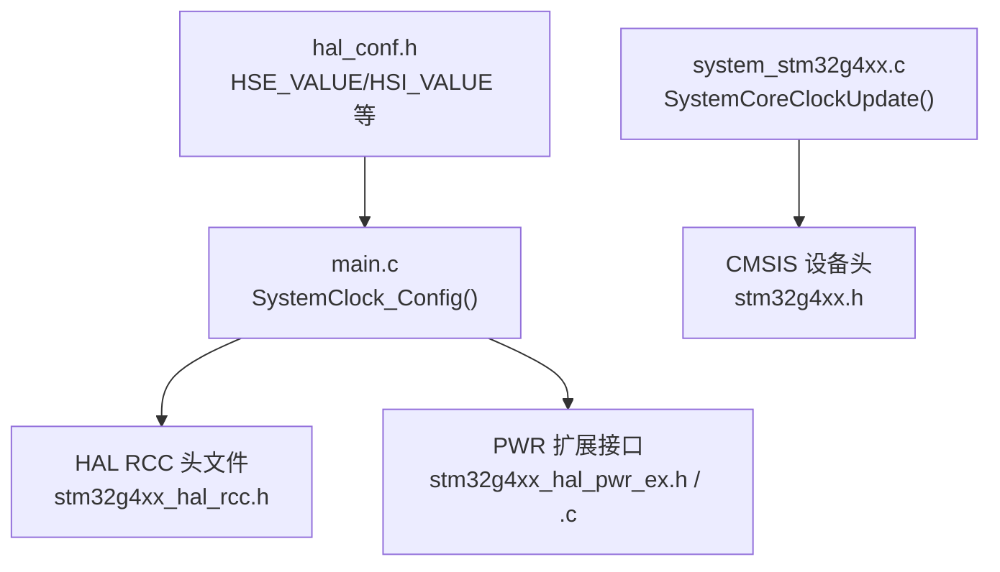
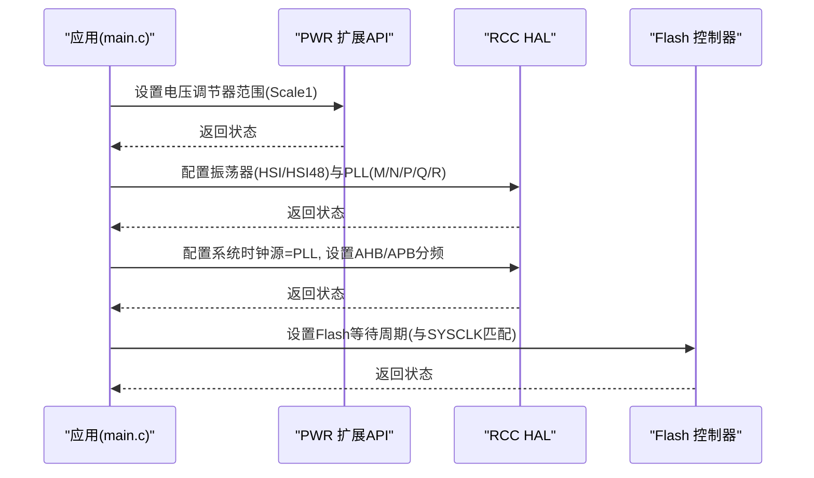
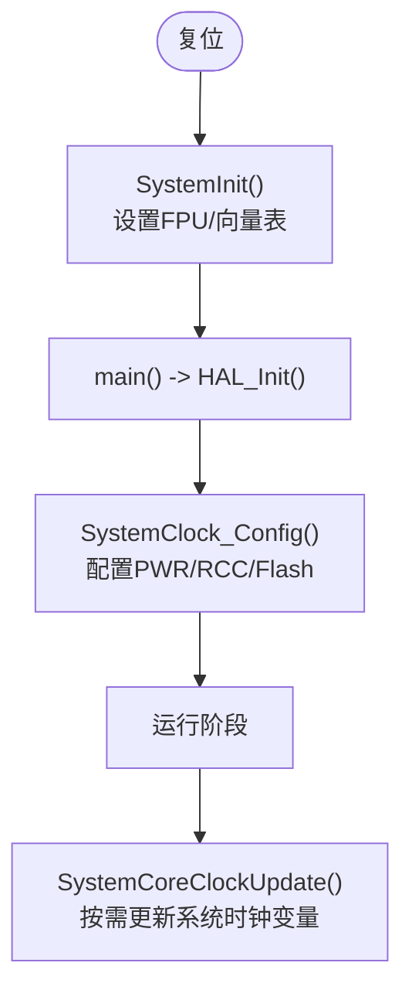
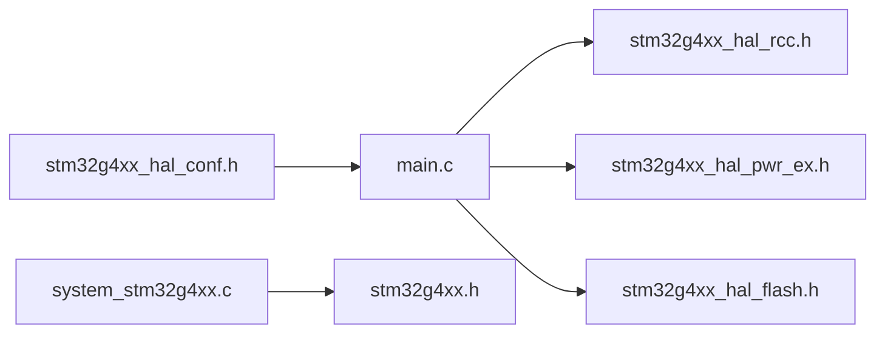

# 时钟系统配置

<cite>
**本文引用的文件**   
- [Core/Src/main.c](file://Core/Src/main.c)
- [Core/Inc/main.h](file://Core/Inc/main.h)
- [Core/Src/system_stm32g4xx.c](file://Core/Src/system_stm32g4xx.c)
- [Drivers/CMSIS/Device/ST/STM32G4xx/Include/stm32g4xx.h](file://Drivers/CMSIS/Device/ST/STM32G4xx/Include/stm32g4xx.h)
- [Drivers/STM32G4xx_HAL_Driver/Inc/stm32g4xx_hal_rcc.h](file://Drivers/STM32G4xx_HAL_Driver/Inc/stm32g4xx_hal_rcc.h)
- [Core/Inc/stm32g4xx_hal_conf.h](file://Core/Inc/stm32g4xx_hal_conf.h)
- [Drivers/STM32G4xx_HAL_Driver/Inc/stm32g4xx_hal_pwr_ex.h](file://Drivers/STM32G4xx_HAL_Driver/Inc/stm32g4xx_hal_pwr_ex.h)
- [Drivers/STM32G4xx_HAL_Driver/Src/stm32g4xx_hal_pwr_ex.c](file://Drivers/STM32G4xx_HAL_Driver/Src/stm32g4xx_hal_pwr_ex.c)
</cite>

## 目录
1. [简介](#简介)
2. [项目结构](#项目结构)
3. [核心组件](#核心组件)
4. [架构总览](#架构总览)
5. [详细组件分析](#详细组件分析)
6. [依赖关系分析](#依赖关系分析)
7. [性能与功耗权衡](#性能与功耗权衡)
8. [故障诊断与调试](#故障诊断与调试)
9. [结论](#结论)
10. [附录：计算公式与验证方法](#附录计算公式与验证方法)

## 简介
本文件面向使用 STM32G474 的开发者，系统化阐述时钟树架构、各时钟源特性与选择策略，并深入解析 SystemClock_Config() 中的关键配置项（电压调节器、振荡器、PLL 倍频系数、总线分频比）。文档同时提供频率计算与验证方法、常见错误诊断与调试技巧，帮助读者在精度、功耗与性能之间做出合理取舍。

## 项目结构
本项目基于 STM32CubeMX 生成的工程结构，时钟相关的关键代码位于应用层 main.c 的系统初始化流程中；底层 CMSIS 与 HAL 驱动提供了寄存器定义、常量宏与 API 实现。



图表来源
- [Core/Src/main.c:296-337](file://Core/Src/main.c#L296-L337)
- [Drivers/STM32G4xx_HAL_Driver/Inc/stm32g4xx_hal_rcc.h:45-121](file://Drivers/STM32G4xx_HAL_Driver/Inc/stm32g4xx_hal_rcc.h#L45-L121)
- [Core/Src/system_stm32g4xx.c:230-272](file://Core/Src/system_stm32g4xx.c#L230-L272)
- [Core/Inc/stm32g4xx_hal_conf.h:117-160](file://Core/Inc/stm32g4xx_hal_conf.h#L117-L160)

章节来源
- [Core/Src/main.c:296-337](file://Core/Src/main.c#L296-L337)
- [Core/Inc/stm32g4xx_hal_conf.h:117-160](file://Core/Inc/stm32g4xx_hal_conf.h#L117-L160)
- [Drivers/STM32G4xx_HAL_Driver/Inc/stm32g4xx_hal_rcc.h:45-121](file://Drivers/STM32G4xx_HAL_Driver/Inc/stm32g4xx_hal_rcc.h#L45-L121)
- [Core/Src/system_stm32g4xx.c:230-272](file://Core/Src/system_stm32g4xx.c#L230-L272)

## 核心组件
- 时钟源
  - HSI：内部高速 RC 振荡器，典型值由 hal_conf 或 system 文件定义，用于快速启动与无需外部晶振场景。
  - HSE：外部高速晶振/时钟，精度更高，适合对时序要求严格的场景。
  - LSI/LSE：低速内部/外部振荡器，常用于 RTC、低功耗定时等。
  - HSI48：内部约 48 MHz RC，USB FS/RNG 常用，具备 CRS 校准能力。
- PLL：主锁相环，支持多路输出（SYSCLK、ADC、USB/SAI/I2S/FDCAN/QUADSPI 等），通过 M/N/P/Q/R 参数灵活生成目标频率。
- 电压调节器：Scale1/Scale2（及可选 Boost）决定最大可运行频率与功耗。
- 总线分频：AHB(HCLK)、APB1(PCLK1)、APB2(PCLK2) 分频影响外设工作频率与时序。

章节来源
- [Core/Inc/stm32g4xx_hal_conf.h:117-160](file://Core/Inc/stm32g4xx_hal_conf.h#L117-L160)
- [Drivers/STM32G4xx_HAL_Driver/Inc/stm32g4xx_hal_rcc.h:212-302](file://Drivers/STM32G4xx_HAL_Driver/Inc/stm32g4xx_hal_rcc.h#L212-L302)
- [Drivers/STM32G4xx_HAL_Driver/Inc/stm32g4xx_hal_pwr_ex.h:129-137](file://Drivers/STM32G4xx_HAL_Driver/Inc/stm32g4xx_hal_pwr_ex.h#L129-L137)

## 架构总览
下图展示从电源调节器到系统时钟及各总线的外设时钟路径，以及当前工程中 SystemClock_Config() 的配置要点。

```mermaid
graph TB
subgraph "电源与调节器"
VREG["电压调节器<br/>Scale1/Scale2(Boost)"]
end
subgraph "时钟源"
HSI["HSI(内部RC)"]
HSE["HSE(外部晶振)"]
LSI["LSI(内部低速)"]
LSE["LSE(外部低速)"]
HSI48["HSI48(~48MHz)"]
end
subgraph "PLL"
PLL["主PLL(M/N/P/Q/R)"]
end
subgraph "系统与时钟分配"
SYSCLK["SYSCLK"]
HCLK["AHB(HCLK)"]
PCLK1["APB1(PCLK1)"]
PCLK2["APB2(PCLK2)"]
ADCCLK["ADC 同步时钟"]
USBCLK["USB/FS 时钟(可选)"]
end
VREG --> SYSCLK
HSI --> PLL
HSE --> PLL
HSI48 --> USBCLK
PLL --> SYSCLK
SYSCLK --> HCLK
HCLK --> PCLK1
HCLK --> PCLK2
PLL --> ADCCLK
```

图表来源
- [Core/Src/main.c:296-337](file://Core/Src/main.c#L296-L337)
- [Drivers/STM32G4xx_HAL_Driver/Inc/stm32g4xx_hal_rcc.h:212-302](file://Drivers/STM32G4xx_HAL_Driver/Inc/stm32g4xx_hal_rcc.h#L212-L302)
- [Core/Inc/stm32g4xx_hal_conf.h:117-160](file://Core/Inc/stm32g4xx_hal_conf.h#L117-L160)

## 详细组件分析

### SystemClock_Config() 配置详解
该函数完成以下关键步骤：
- 设置电压调节器范围，确保目标频率下的稳定运行与功耗平衡。
- 配置振荡器（HSI、HSI48）与 PLL 输入源、分频/倍频参数。
- 配置系统时钟源为 PLL，并设置 AHB/APB 总线分频。
- 设置 Flash 等待周期以匹配系统频率。



图表来源
- [Core/Src/main.c:296-337](file://Core/Src/main.c#L296-L337)
- [Drivers/STM32G4xx_HAL_Driver/Inc/stm32g4xx_hal_pwr_ex.h:129-137](file://Drivers/STM32G4xx_HAL_Driver/Inc/stm32g4xx_hal_pwr_ex.h#L129-L137)
- [Drivers/STM32G4xx_HAL_Driver/Inc/stm32g4xx_hal_rcc.h:104-121](file://Drivers/STM32G4xx_HAL_Driver/Inc/stm32g4xx_hal_rcc.h#L104-L121)

章节来源
- [Core/Src/main.c:296-337](file://Core/Src/main.c#L296-L337)
- [Drivers/STM32G4xx_HAL_Driver/Inc/stm32g4xx_hal_rcc.h:104-121](file://Drivers/STM32G4xx_HAL_Driver/Inc/stm32g4xx_hal_rcc.h#L104-L121)
- [Drivers/STM32G4xx_HAL_Driver/Inc/stm32g4xx_hal_pwr_ex.h:129-137](file://Drivers/STM32G4xx_HAL_Driver/Inc/stm32g4xx_hal_pwr_ex.h#L129-L137)

#### 电压调节器设置
- Scale1：典型输出约 1.2V，最高系统频率可达 150 MHz（部分器件支持 Boost 模式至 170 MHz）。
- Scale2：典型输出约 1.0V，最高系统频率可达 26 MHz，适用于低功耗场景。
- 切换顺序约束：从 Scale2 切换到 Scale1 前需先降频；从 Scale1 切回 Scale2 需先降频再调压。

章节来源
- [Drivers/STM32G4xx_HAL_Driver/Inc/stm32g4xx_hal_pwr_ex.h:129-137](file://Drivers/STM32G4xx_HAL_Driver/Inc/stm32g4xx_hal_pwr_ex.h#L129-L137)
- [Drivers/STM32G4xx_HAL_Driver/Src/stm32g4xx_hal_pwr_ex.c:128-197](file://Drivers/STM32G4xx_HAL_Driver/Src/stm32g4xx_hal_pwr_ex.c#L128-L197)

#### 振荡器配置
- HSI：默认开启，作为初始系统时钟与 PLL 输入源之一。
- HSI48：若需要 USB FS 或 RNG，建议开启并通过 CRS 校准提升精度。
- HSE/LSE/LSI：根据需求启用，HSE 常用作高精度系统时钟源。

章节来源
- [Core/Inc/stm32g4xx_hal_conf.h:117-160](file://Core/Inc/stm32g4xx_hal_conf.h#L117-L160)
- [Drivers/STM32G4xx_HAL_Driver/Inc/stm32g4xx_hal_rcc.h:141-200](file://Drivers/STM32G4xx_HAL_Driver/Inc/stm32g4xx_hal_rcc.h#L141-L200)

#### PLL 倍频系数与输出
- 输入源：HSI 或 HSE。
- 分频/倍频：M 分频、N 倍频、P/Q/R 输出分频。
- 输出用途：
  - PLLR：SYSCLK（主系统时钟）。
  - PLLQ：USB/FS、SAI、I2S、FDCAN、QUADSPI 等。
  - PLLP：ADC 同步时钟（具体取决于外设与分频表）。
- 注意：PLLP 在 G4 系列支持较宽范围（含 2~31），需参考数据手册与 HAL 宏定义。

章节来源
- [Drivers/STM32G4xx_HAL_Driver/Inc/stm32g4xx_hal_rcc.h:212-302](file://Drivers/STM32G4xx_HAL_Driver/Inc/stm32g4xx_hal_rcc.h#L212-L302)
- [Drivers/CMSIS/Device/ST/STM32G4xx/Include/stm32g474xx.h:12043-12050](file://Drivers/CMSIS/Device/ST/STM32G4xx/Include/stm32g474xx.h#L12043-L12050)

#### 总线分频比设置
- AHB(HCLK)：SYSCLK 经 HPRE 分频得到。
- APB1(PCLK1)/APB2(PCLK2)：HCLK 经 PPRE1/PPRE2 分频得到。
- 外设时钟上限需满足对应外设的数据手册限制（如 ADC、USB、UART 等）。

章节来源
- [Drivers/STM32G4xx_HAL_Driver/Inc/stm32g4xx_hal_rcc.h:345-371](file://Drivers/STM32G4xx_HAL_Driver/Inc/stm32g4xx_hal_rcc.h#L345-L371)

#### Flash 等待周期
- 随 SYSCLK 提高需增加 Flash 等待周期，避免取指错误。
- 工程中采用 FLASH_LATENCY_1，需结合目标频率与器件规格确认是否足够。

章节来源
- [Core/Src/main.c:333-336](file://Core/Src/main.c#L333-L336)
- [Drivers/STM32G4xx_HAL_Driver/Inc/stm32g4xx_hal_flash.h:471-480](file://Drivers/STM32G4xx_HAL_Driver/Inc/stm32g4xx_hal_flash.h#L471-L480)

### 时钟树架构与数据流
- 复位后默认使用 HSI 作为系统时钟。
- SystemInit() 仅做向量表与 FPU 基础设置，不改变系统时钟源。
- 进入 main() 后调用 HAL_Init()，随后 SystemClock_Config() 完成完整时钟树配置。
- SystemCoreClockUpdate() 依据当前 RCC 寄存器状态更新 SystemCoreClock，供 SysTick 等模块使用。



图表来源
- [Core/Src/system_stm32g4xx.c:181-192](file://Core/Src/system_stm32g4xx.c#L181-L192)
- [Core/Src/system_stm32g4xx.c:230-272](file://Core/Src/system_stm32g4xx.c#L230-L272)
- [Core/Src/main.c:229-236](file://Core/Src/main.c#L229-L236)

章节来源
- [Core/Src/system_stm32g4xx.c:181-192](file://Core/Src/system_stm32g4xx.c#L181-L192)
- [Core/Src/system_stm32g4xx.c:230-272](file://Core/Src/system_stm32g4xx.c#L230-L272)
- [Core/Src/main.c:229-236](file://Core/Src/main.c#L229-L236)

## 依赖关系分析
- main.c 依赖 HAL RCC/PWR/Flash 接口进行时钟与电源配置。
- HAL RCC 头文件提供所有时钟相关的类型与宏定义。
- system_stm32g4xx.c 提供 SystemCoreClock 更新逻辑，依赖 RCC 寄存器位域。
- hal_conf.h 提供 HSE_VALUE/HSI_VALUE 等全局常量，影响频率计算。



图表来源
- [Core/Src/main.c:296-337](file://Core/Src/main.c#L296-L337)
- [Core/Src/system_stm32g4xx.c:230-272](file://Core/Src/system_stm32g4xx.c#L230-L272)
- [Core/Inc/stm32g4xx_hal_conf.h:117-160](file://Core/Inc/stm32g4xx_hal_conf.h#L117-L160)

章节来源
- [Core/Src/main.c:296-337](file://Core/Src/main.c#L296-L337)
- [Core/Src/system_stm32g4xx.c:230-272](file://Core/Src/system_stm32g4xx.c#L230-L272)
- [Core/Inc/stm32g4xx_hal_conf.h:117-160](file://Core/Inc/stm32g4xx_hal_conf.h#L117-L160)

## 性能与功耗权衡
- 高频高性能：Scale1（或 Boost）+ HSE + 高 N 倍频 + 较小 R 分频，配合适当 Flash 等待周期。
- 低功耗：Scale2 + HSI/LSI 或关闭不必要振荡器，降低总线分频与外设时钟。
- 精度优先：HSE 作为 PLL 输入，必要时启用 CRS 校准 HSI48（USB FS）。
- 外设约束：USB FS 通常需要 48 MHz 精确时钟；ADC 同步时钟需满足采样率与时序要求。

[本节为通用指导，不直接分析具体文件]

## 故障诊断与调试
- 现象：系统无法启动或频繁复位
  - 检查电压调节器范围与目标频率是否匹配（Scale1/Scale2 与最大频率）。
  - 确认 Flash 等待周期是否与 SYSCLK 匹配。
- 现象：USB 枚举失败或不稳定
  - 检查 HSI48 是否开启且经 CRS 校准；或确认 PLLQ 输出是否为 48 MHz。
- 现象：外设时序异常
  - 核对 APB1/APB2 分频与外设最大时钟限制。
- 调试手段
  - 使用 MCO 输出观察实际时钟频率（SYSCLK/HSE/HSI/PLL/LSI/LSE/HSI48）。
  - 读取 RCC 标志位（HSIRDY、HSERDY、PLLRDY、LSIRDY、LSECSSD、HSI48RDY）判断就绪状态。
  - 调用 SystemCoreClockUpdate() 后读取 SystemCoreClock 验证计算结果。

章节来源
- [Drivers/STM32G4xx_HAL_Driver/Inc/stm32g4xx_hal_rcc.h:437-485](file://Drivers/STM32G4xx_HAL_Driver/Inc/stm32g4xx_hal_rcc.h#L437-L485)
- [Core/Src/system_stm32g4xx.c:230-272](file://Core/Src/system_stm32g4xx.c#L230-L272)

## 结论
通过对 SystemClock_Config() 的逐项解析与依赖关系梳理，可以明确 STM32G474 时钟系统的配置要点：合理选择电压调节器范围、振荡器与 PLL 参数、总线分频比与 Flash 等待周期，并结合外设需求与功耗目标进行权衡。借助 MCO 与 RCC 标志位，可有效定位与验证时钟配置的正确性。

[本节为总结性内容，不直接分析具体文件]

## 附录：计算公式与验证方法

### 频率计算公式
- PLL VCO 频率：
  - f_VCO = (f_PLLSRC / PLLM) × PLLN
- 系统时钟 SYSCLK：
  - f_SYSCLK = f_VCO / PLLR
- 其他输出：
  - f_USB/SAI/I2S/FDCAN/QUADSPI = f_VCO / PLLQ
  - f_ADC = f_VCO / PLLP（具体受外设与分频表限制）

其中：
- f_PLLSRC 为 PLL 输入时钟（HSI 或 HSE）。
- PLLM、PLLN、PLLP、PLLQ、PLLR 为对应分频/倍频因子。

章节来源
- [Core/Src/system_stm32g4xx.c:245-262](file://Core/Src/system_stm32g4xx.c#L245-L262)
- [Drivers/STM32G4xx_HAL_Driver/Inc/stm32g4xx_hal_rcc.h:212-302](file://Drivers/STM32G4xx_HAL_Driver/Inc/stm32g4xx_hal_rcc.h#L212-L302)

### 验证方法
- 软件验证
  - 调用 SystemCoreClockUpdate() 后读取 SystemCoreClock，对比期望值。
  - 读取 RCC 状态标志（HSIRDY、HSERDY、PLLRDY、HSI48RDY）确认时钟就绪。
- 硬件验证
  - 配置 MCO 输出目标时钟（SYSCLK/HSE/HSI/PLL/LSI/LSE/HSI48），用示波器测量实际频率。
- 外设校验
  - 针对 USB FS，确认 48 MHz 时钟精度；针对 ADC，确认同步时钟满足采样率与时序要求。

章节来源
- [Core/Src/system_stm32g4xx.c:230-272](file://Core/Src/system_stm32g4xx.c#L230-L272)
- [Drivers/STM32G4xx_HAL_Driver/Inc/stm32g4xx_hal_rcc.h:437-485](file://Drivers/STM32G4xx_HAL_Driver/Inc/stm32g4xx_hal_rcc.h#L437-L485)