# 系统初始化配置

<cite>
**本文引用的文件**   
- [startup_stm32g474xx.s](file://startup_stm32g474xx.s)
- [system_stm32g4xx.c](file://Core\Src\system_stm32g4xx.c)
- [main.c](file://Core\Src\main.c)
- [stm32g4xx_it.c](file://Core\Src\stm32g4xx_it.c)
- [stm32g4xx_hal_msp.c](file://Core\Src\stm32g4xx_hal_msp.c)
- [stm32g4xx_hal_conf.h](file://Core\Inc\stm32g4xx_hal_conf.h)
- [stm32g4xx_it.h](file://Core\Inc\stm32g4xx_it.h)
- [stm32g4xx_hal.c](file://Drivers\STM32G4xx_HAL_Driver\Src\stm32g4xx_hal.c)
</cite>

## 目录
1. [简介](#简介)
2. [项目结构](#项目结构)
3. [核心组件](#核心组件)
4. [架构总览](#架构总览)
5. [详细组件分析](#详细组件分析)
6. [依赖关系分析](#依赖关系分析)
7. [性能考虑](#性能考虑)
8. [故障排查指南](#故障排查指南)
9. [结论](#结论)
10. [附录](#附录)

## 简介
本文件面向使用 STM32G4 系列（以 G474 为例）的开发者，系统化梳理从复位向量到 main() 执行的完整启动流程，重点解释 HAL_Init()、SystemClock_Config()、MX_*_Init() 等关键初始化函数的调用顺序与依赖关系；深入说明中断系统配置与管理（NVIC 优先级、中断向量表组织）、错误处理机制与调试支持；并提供可操作的自定义方法与最佳实践。文档包含流程图与状态转换图，帮助快速理解系统启动过程。

## 项目结构
本项目采用 CubeMX 生成的标准工程结构：
- Core/Src: 应用入口 main.c、中断服务程序 stm32g4xx_it.c、MSP 初始化 stm32g4xx_hal_msp.c、系统时钟与向量表重定位 system_stm32g4xx.c
- Core/Inc: 头文件与 HAL 配置 stm32g4xx_hal_conf.h、中断函数声明 stm32g4xx_it.h
- startup_stm32g474xx.s: 汇编启动文件，定义向量表、堆栈指针、数据段拷贝与 bss 清零，并跳转至 main()
- Drivers/STM32G4xx_HAL_Driver: HAL 驱动实现，HAL_Init() 位于 stm32g4xx_hal.c

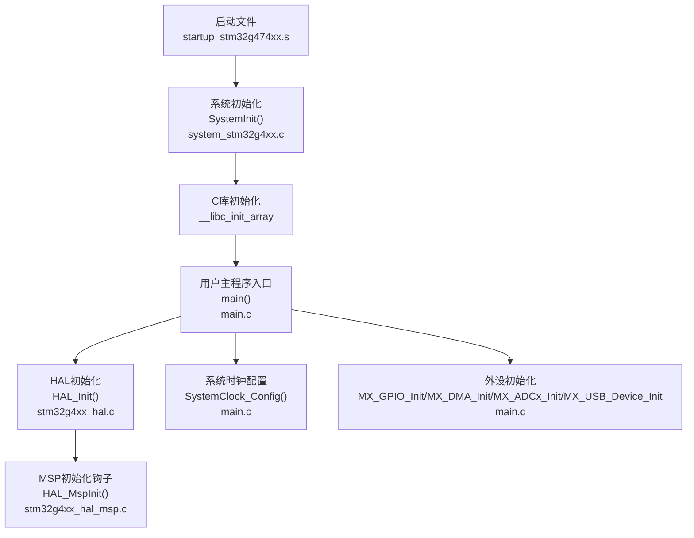

图表来源
- [startup_stm32g474xx.s:58-106](file://startup_stm32g474xx.s#L58-L106)
- [system_stm32g4xx.c:181-192](file://Core\Src\system_stm32g4xx.c#L181-L192)
- [main.c:219-290](file://Core\Src\main.c#L219-L290)
- [stm32g4xx_hal.c:148-185](file://Drivers\STM32G4xx_HAL_Driver\Src\stm32g4xx_hal.c#L148-L185)
- [stm32g4xx_hal_msp.c:63-82](file://Core\Src\stm32g4xx_hal_msp.c#L63-L82)

章节来源
- [startup_stm32g474xx.s:58-106](file://startup_stm32g474xx.s#L58-L106)
- [system_stm32g4xx.c:181-192](file://Core\Src\system_stm32g4xx.c#L181-L192)
- [main.c:219-290](file://Core\Src\main.c#L219-L290)
- [stm32g4xx_hal.c:148-185](file://Drivers\STM32G4xx_HAL_Driver\Src\stm32g4xx_hal.c#L148-L185)
- [stm32g4xx_hal_msp.c:63-82](file://Core\Src\stm32g4xx_hal_msp.c#L63-L82)

## 核心组件
- 启动与链接期阶段
  - 向量表与复位入口：startup_stm32g474xx.s 定义 g_pfnVectors，Reset_Handler 设置 SP、调用 SystemInit、拷贝 .data、清零 .bss、调用 __libc_init_array，最后跳转到 main()
  - 系统初始化：SystemInit() 在 system_stm32g4xx.c 中完成 FPU 使能、可选的向量表重定位
- HAL 层
  - HAL_Init() 在 stm32g4xx_hal.c 中完成 Flash 预取/缓存配置、NVIC 分组优先级设置、SysTick 时基初始化，并回调 HAL_MspInit()
  - MSP 钩子 HAL_MspInit() 在 stm32g4xx_hal_msp.c 中启用 SYSCFG/PWR 等基础时钟，提供平台级初始化扩展点
- 应用层
  - main() 中依次调用 HAL_Init()、SystemClock_Config()、MX_*_Init()，随后进入业务循环
  - SystemClock_Config() 配置电压调节、HSI/HSI48/PLL 及总线分频
  - MX_*_Init() 负责 GPIO、DMA、ADC、USB 等外设初始化
- 中断与异常
  - stm32g4xx_it.c 提供 Cortex-M 异常与外设中断的默认处理，并将 EXTI/DMA/USB 等转发到 HAL 层回调
  - NVIC 优先级在 HAL_Init() 中统一设置为抢占优先组 4，具体外设中断优先级在各 MX_*_Init() 中配置

章节来源
- [startup_stm32g474xx.s:58-106](file://startup_stm32g474xx.s#L58-L106)
- [system_stm32g4xx.c:181-192](file://Core\Src\system_stm32g4xx.c#L181-L192)
- [stm32g4xx_hal.c:148-185](file://Drivers\STM32G4xx_HAL_Driver\Src\stm32g4xx_hal.c#L148-L185)
- [stm32g4xx_hal_msp.c:63-82](file://Core\Src\stm32g4xx_hal_msp.c#L63-L82)
- [main.c:219-290](file://Core\Src\main.c#L219-L290)
- [stm32g4xx_it.c:184-242](file://Core\Src\stm32g4xx_it.c#L184-L242)

## 架构总览
下图展示从复位到 main() 执行的关键路径，以及 HAL 与应用层的交互。

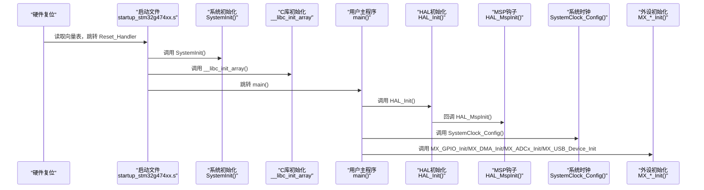

图表来源
- [startup_stm32g474xx.s:58-106](file://startup_stm32g474xx.s#L58-L106)
- [system_stm32g4xx.c:181-192](file://Core\Src\system_stm32g4xx.c#L181-L192)
- [main.c:219-290](file://Core\Src\main.c#L219-L290)
- [stm32g4xx_hal.c:148-185](file://Drivers\STM32G4xx_HAL_Driver\Src\stm32g4xx_hal.c#L148-L185)
- [stm32g4xx_hal_msp.c:63-82](file://Core\Src\stm32g4xx_hal_msp.c#L63-L82)

## 详细组件分析

### 启动与链接期阶段（复位向量到 main）
- 复位后处理器处于线程模式、特权级，使用主堆栈
- Reset_Handler 完成：
  - 设置主堆栈指针
  - 调用 SystemInit() 进行早期系统配置（FPU、向量表重定位）
  - 拷贝 .data 段、清零 .bss 段
  - 调用静态构造函数 __libc_init_array()
  - 跳转至 main()
- 向量表组织：
  - startup_stm32g474xx.s 中的 g_pfnVectors 定义了所有异常与中断入口地址
  - 未实现的 ISR 通过弱符号指向 Default_Handler，便于覆盖

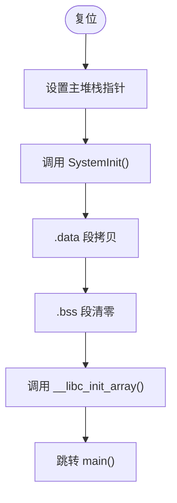

图表来源
- [startup_stm32g474xx.s:58-106](file://startup_stm32g474xx.s#L58-L106)
- [system_stm32g4xx.c:181-192](file://Core\Src\system_stm32g4xx.c#L181-L192)

章节来源
- [startup_stm32g474xx.s:58-106](file://startup_stm32g474xx.s#L58-L106)
- [system_stm32g4xx.c:181-192](file://Core\Src\system_stm32g4xx.c#L181-L192)

### HAL_Init() 与 MSP 钩子
- HAL_Init() 职责：
  - 根据编译宏配置 Flash 预取与指令/数据缓存
  - 设置 NVIC 抢占优先组为 4（最高细粒度）
  - 初始化 SysTick 作为 1ms 时基（优先级由配置宏决定）
  - 回调 HAL_MspInit() 完成平台级初始化
- HAL_MspInit() 职责：
  - 启用 SYSCFG、PWR 等基础时钟
  - 提供后续外设 MSP 钩子的扩展点（如 ADC MSP）

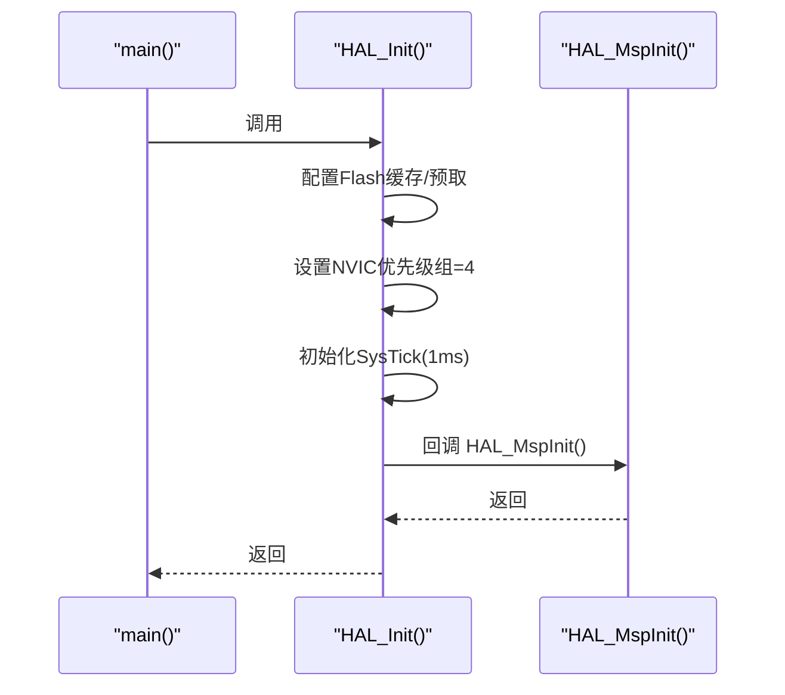

图表来源
- [stm32g4xx_hal.c:148-185](file://Drivers\STM32G4xx_HAL_Driver\Src\stm32g4xx_hal.c#L148-L185)
- [stm32g4xx_hal_msp.c:63-82](file://Core\Src\stm32g4xx_hal_msp.c#L63-L82)

章节来源
- [stm32g4xx_hal.c:148-185](file://Drivers\STM32G4xx_HAL_Driver\Src\stm32g4xx_hal.c#L148-L185)
- [stm32g4xx_hal_msp.c:63-82](file://Core\Src\stm32g4xx_hal_msp.c#L63-L82)

### 系统时钟配置 SystemClock_Config()
- 主要步骤：
  - 设置内核电压调节等级
  - 开启 HSI 与 HSI48，配置 PLL 源为 HSI，设置分频系数
  - 切换系统时钟源至 PLL，配置 AHB/APB 分频
  - 更新 Flash 等待周期
- 注意：
  - 若需更高精度或更低功耗，可改为 HSE 作为 PLL 源，并在 HAL 配置宏中修正 HSE_VALUE
  - 修改时钟后，SystemCoreClock 会由 HAL_RCC_ClockConfig() 自动更新

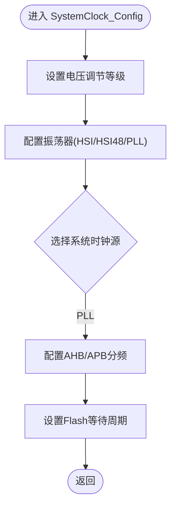

图表来源
- [main.c:296-337](file://Core\Src\main.c#L296-L337)

章节来源
- [main.c:296-337](file://Core\Src\main.c#L296-L337)

### 外设初始化 MX_*_Init() 与依赖
- 初始化顺序与依赖：
  - MX_GPIO_Init(): 配置 PA4 为上升沿中断，启用 EXTI4_IRQn 并设置 NVIC 优先级；同时配置 PC13 LED 输出
  - MX_DMA_Init(): 启用 DMA1/DMAMUX 时钟，配置 DMA1_Channel1 中断优先级
  - MX_ADC1_Init()/MX_ADC2_Init(): 配置双 ADC 多模交错采样、通道参数、DMA 连续请求等
  - MX_USB_Device_Init(): 初始化 USB FS 设备栈
- MSP 钩子：
  - HAL_ADC_MspInit() 中配置 ADC12 时钟源为 PLL，使能 ADC12 时钟，复用 PA2/PA3/PA6/PA7 为模拟输入，初始化 DMA1_Channel1 并绑定到 ADC1

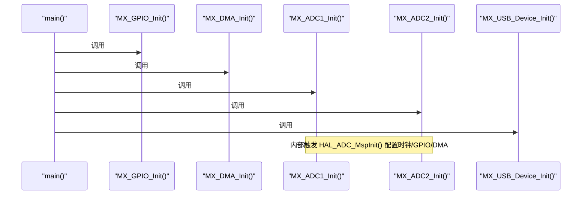

图表来源
- [main.c:243-247](file://Core\Src\main.c#L243-L247)
- [stm32g4xx_hal_msp.c:92-185](file://Core\Src\stm32g4xx_hal_msp.c#L92-L185)

章节来源
- [main.c:243-247](file://Core\Src\main.c#L243-L247)
- [stm32g4xx_hal_msp.c:92-185](file://Core\Src\stm32g4xx_hal_msp.c#L92-L185)

### 中断系统与 NVIC 管理
- 向量表与默认处理：
  - startup_stm32g474xx.s 定义所有中断入口，未实现的中断默认进入 Default_Handler
- 中断服务程序转发：
  - stm32g4xx_it.c 将 EXTI4、DMA1_Channel1、USB_LP 等转发到 HAL 层处理函数
- 优先级策略：
  - HAL_Init() 设置抢占优先组为 4（即 4 位抢占 + 0 位子优先级），各外设中断在具体 MX_*_Init() 中设置具体优先级
  - SysTick 优先级由配置宏 TICK_INT_PRIORITY 控制

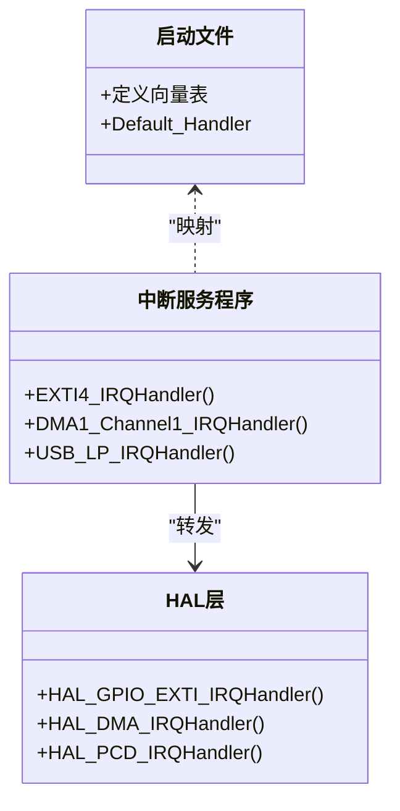

图表来源
- [startup_stm32g474xx.s:133-253](file://startup_stm32g474xx.s#L133-L253)
- [stm32g4xx_it.c:205-242](file://Core\Src\stm32g4xx_it.c#L205-L242)

章节来源
- [startup_stm32g474xx.s:133-253](file://startup_stm32g474xx.s#L133-L253)
- [stm32g4xx_it.c:205-242](file://Core\Src\stm32g4xx_it.c#L205-L242)

### 错误处理与调试支持
- 错误处理：
  - Error_Handler() 用于捕获 HAL 初始化失败等错误，默认关闭全局中断并进入死循环，便于调试
  - assert_failed() 在启用 USE_FULL_ASSERT 时报告文件名与行号
- 调试支持：
  - HardFault/NMI/MemManage/BusFault/UsageFault 等异常默认进入死循环，便于定位问题
  - SysTick_Handler() 调用 HAL_IncTick() 维护 1ms 时基，配合 HAL_Delay() 使用

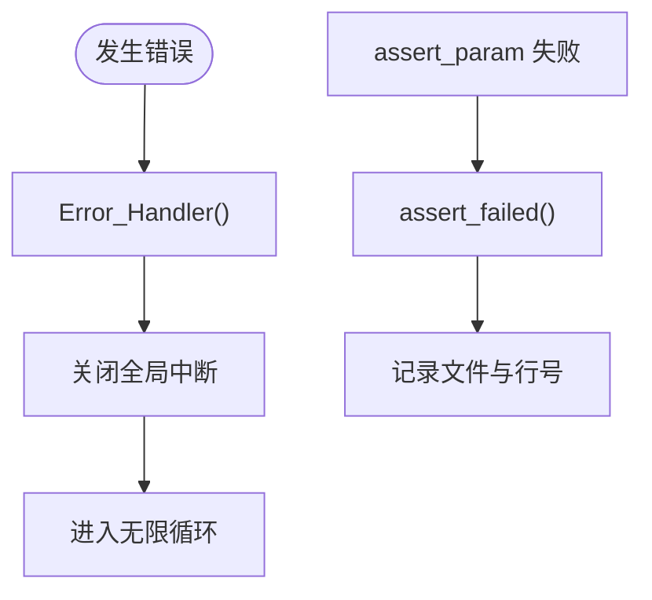

图表来源
- [main.c:530-555](file://Core\Src\main.c#L530-L555)
- [stm32g4xx_it.c:70-193](file://Core\Src\stm32g4xx_it.c#L70-L193)

章节来源
- [main.c:530-555](file://Core\Src\main.c#L530-L555)
- [stm32g4xx_it.c:70-193](file://Core\Src\stm32g4xx_it.c#L70-L193)

### 初始化流程图与状态转换图
- 初始化流程图（从复位到运行）
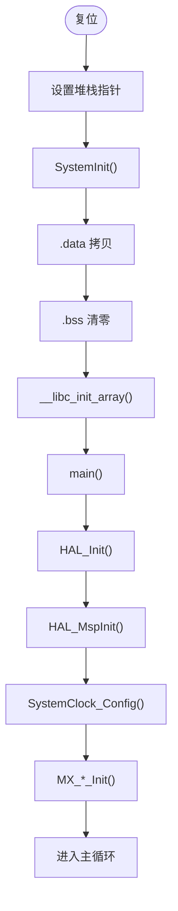

图表来源
- [startup_stm32g474xx.s:58-106](file://startup_stm32g474xx.s#L58-L106)
- [system_stm32g4xx.c:181-192](file://Core\Src\system_stm32g4xx.c#L181-L192)
- [main.c:219-290](file://Core\Src\main.c#L219-L290)
- [stm32g4xx_hal.c:148-185](file://Drivers\STM32G4xx_HAL_Driver\Src\stm32g4xx_hal.c#L148-L185)
- [stm32g4xx_hal_msp.c:63-82](file://Core\Src\stm32g4xx_hal_msp.c#L63-L82)

- 状态转换图（系统启动状态）
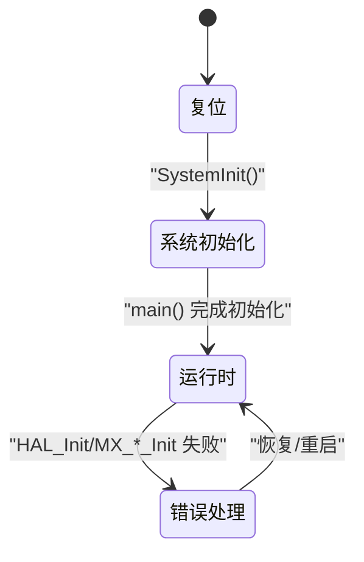

图表来源
- [main.c:219-290](file://Core\Src\main.c#L219-L290)
- [stm32g4xx_hal.c:148-185](file://Drivers\STM32G4xx_HAL_Driver\Src\stm32g4xx_hal.c#L148-L185)

## 依赖关系分析
- 模块耦合
  - HAL_Init() 强依赖 HAL 配置宏（缓存/预取、TICK_INT_PRIORITY）
  - HAL_MspInit() 是平台级扩展点，被 HAL_Init() 回调
  - SystemClock_Config() 依赖 RCC HAL API 与 Flash 延迟配置
  - MX_*_Init() 依赖对应 HAL 模块与 MSP 钩子
- 外部依赖
  - CMSIS 与 HAL 驱动库
  - USB 设备库（CDC）
- 潜在环路与风险
  - 避免在 HAL_MspInit() 中调用未完成初始化的外设
  - 修改时钟前确保 Flash 等待周期正确，避免总线访问异常

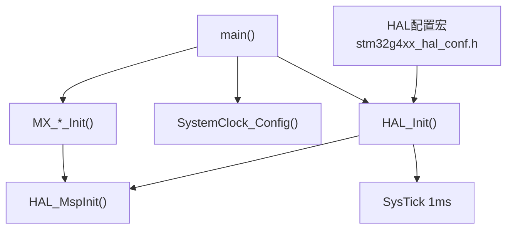

图表来源
- [stm32g4xx_hal_conf.h:178-189](file://Core\Inc\stm32g4xx_hal_conf.h#L178-L189)
- [stm32g4xx_hal.c:148-185](file://Drivers\STM32G4xx_HAL_Driver\Src\stm32g4xx_hal.c#L148-L185)
- [main.c:219-290](file://Core\Src\main.c#L219-L290)

章节来源
- [stm32g4xx_hal_conf.h:178-189](file://Core\Inc\stm32g4xx_hal_conf.h#L178-L189)
- [stm32g4xx_hal.c:148-185](file://Drivers\STM32G4xx_HAL_Driver\Src\stm32g4xx_hal.c#L148-L185)
- [main.c:219-290](file://Core\Src\main.c#L219-L290)

## 性能考虑
- 缓存与预取：
  - 建议保持指令/数据缓存与预取开启以提升代码与数据访问效率
- 时钟与功耗：
  - 合理选择时钟源与分频，平衡性能与功耗；如需高精度 USB/RNG，可使用 HSI48
- 中断与实时性：
  - 使用 NVIC 抢占优先组 4，细化中断优先级；在中断中仅做最小化处理，将耗时逻辑下沉到主循环或任务队列
- DMA 与内存对齐：
  - DMA 传输目标缓冲区应满足对齐要求，避免总线错误

[本节为通用指导，不直接分析具体文件]

## 故障排查指南
- 常见问题定位
  - 启动卡死：检查向量表位置与大小、堆栈是否越界、.data/.bss 是否正确初始化
  - 时钟异常：确认 SystemClock_Config() 中 PLL 参数与 Flash 等待周期匹配
  - 中断不响应：核对 NVIC 优先级设置与中断使能，确认 ISR 已正确注册
  - 外设无输出：检查对应时钟与 GPIO 复用配置，确认 DMA 绑定与中断回调
- 调试技巧
  - 在 Error_Handler() 与 HardFault_Handler() 中增加断点或日志输出
  - 使用 SysTick 与 HAL_Delay() 辅助时序验证
  - 启用 USE_FULL_ASSERT 以捕获参数校验错误

章节来源
- [main.c:530-555](file://Core\Src\main.c#L530-L555)
- [stm32g4xx_it.c:70-193](file://Core\Src\stm32g4xx_it.c#L70-L193)

## 结论
本文件系统梳理了 STM32G4 工程的启动与初始化流程，明确了 HAL_Init()、SystemClock_Config()、MX_*_Init() 的职责与依赖关系，阐述了中断与异常处理机制，并提供了错误处理与调试支持的最佳实践。遵循本文的流程与规范，可有效提升系统稳定性与可维护性。

[本节为总结性内容，不直接分析具体文件]

## 附录
- 自定义方法
  - 修改时钟源：在 SystemClock_Config() 中调整振荡器与 PLL 参数，并确保 HAL 配置宏中的晶振值与实际一致
  - 新增外设：在 MX_*_Init() 中添加初始化代码，必要时在 HAL_MspInit() 中完成平台级资源准备
  - 调整中断优先级：在各 MX_*_Init() 中使用 HAL_NVIC_SetPriority() 设置具体优先级
- 最佳实践
  - 初始化顺序：先 HAL_Init()，再 SystemClock_Config()，最后 MX_*_Init()
  - 中断设计：ISR 中只做最小操作，标志位与数据处理放在主循环
  - 错误处理：对关键初始化返回值进行检查，失败时进入 Error_Handler()

[本节为通用指导，不直接分析具体文件]