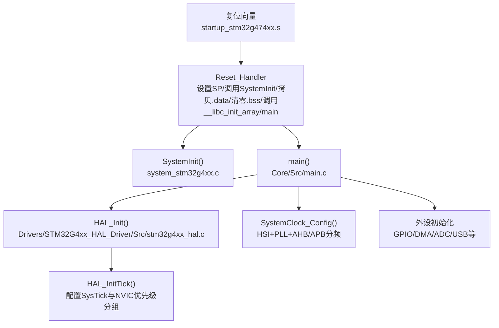
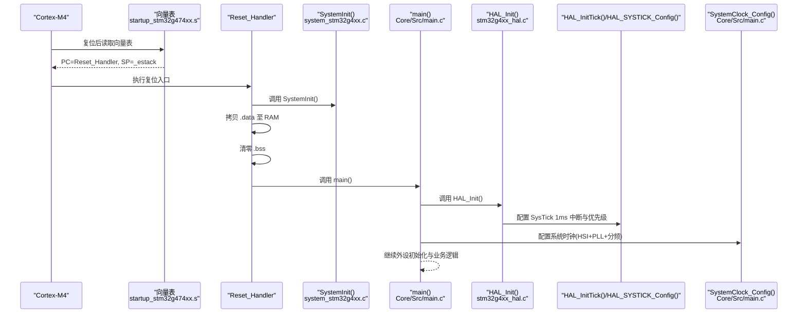
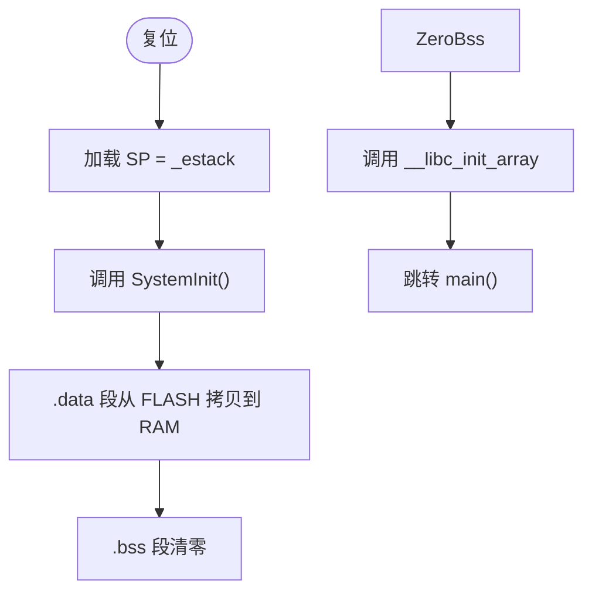
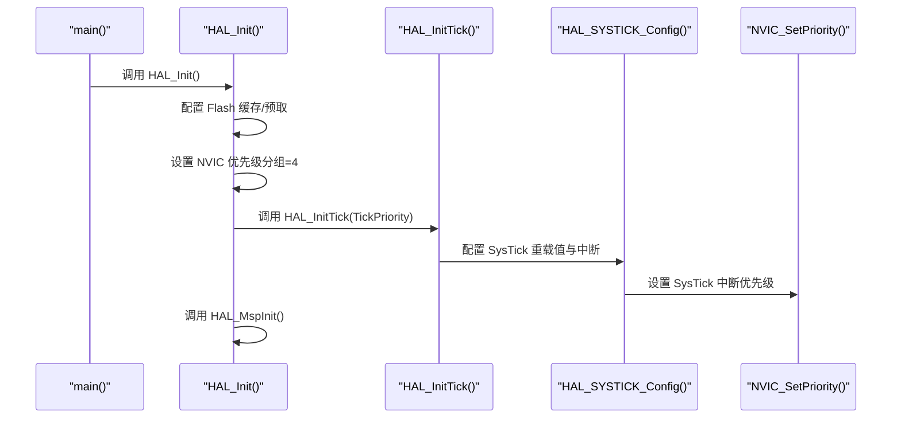
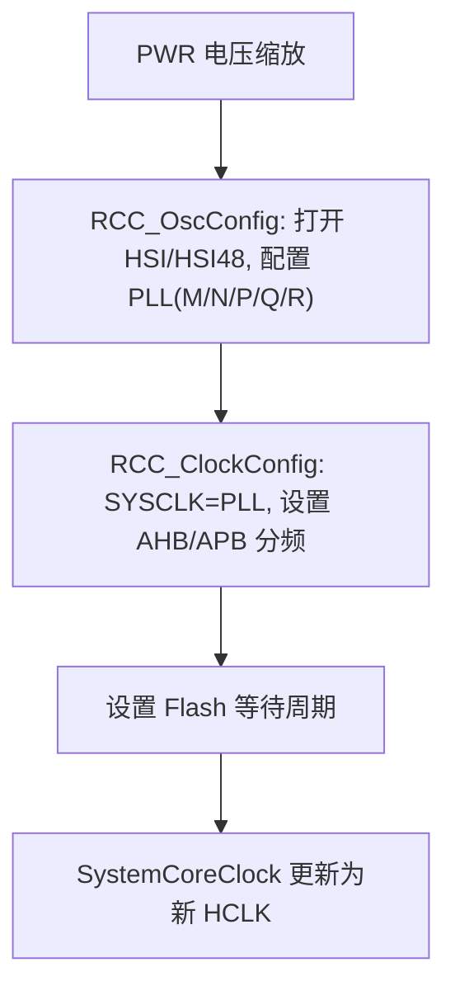
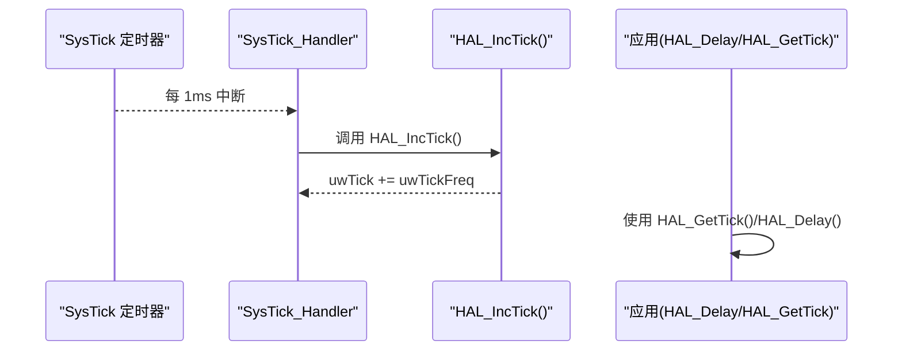
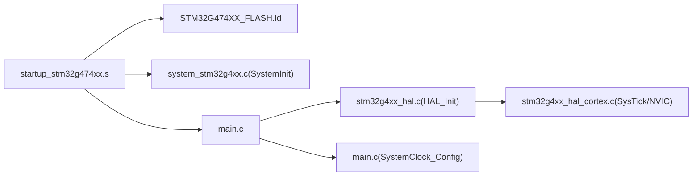

# 系统启动流程

<cite>
**本文引用的文件**   
- [startup_stm32g474xx.s](file://startup_stm32g474xx.s)
- [system_stm32g4xx.c](file://Core\Src\system_stm32g4xx.c)
- [main.c](file://Core\Src\main.c)
- [stm32g4xx_hal.c](file://Drivers\STM32G4xx_HAL_Driver\Src\stm32g4xx_hal.c)
- [stm32g4xx_hal_cortex.c](file://Drivers\STM32G4xx_HAL_Driver\Src\stm32g4xx_hal_cortex.c)
- [core_cm4.h](file://Drivers\CMSIS\Include\core_cm4.h)
- [STM32G474XX_FLASH.ld](file://STM32G474XX_FLASH.ld)
</cite>

## 目录
1. [简介](#简介)
2. [项目结构](#项目结构)
3. [核心组件](#核心组件)
4. [架构总览](#架构总览)
5. [详细组件分析](#详细组件分析)
6. [依赖关系分析](#依赖关系分析)
7. [性能考虑](#性能考虑)
8. [故障排查指南](#故障排查指南)
9. [结论](#结论)

## 简介
本文面向使用 STM32G4 系列（本仓库为 G474）的开发者，系统化梳理从复位向量到 main() 执行的完整启动流程，覆盖：
- 启动文件的执行顺序、堆栈初始化、内存段拷贝与清零
- HAL_Init() 的作用与步骤（Systick 配置、中断优先级分组等）
- SystemClock_Config() 的时钟树配置过程（HSI、PLL、总线分频）
- 启动流程图与时序图
- 常见启动失败原因与调试方法

## 项目结构
本项目采用 CubeMX 生成的标准工程结构。与“系统启动”直接相关的核心文件包括：
- 启动汇编与链接脚本：定义入口、向量表、数据段布局与初始值
- CMSIS/设备系统初始化：SystemInit() 与系统时钟变量维护
- HAL 驱动：HAL_Init()、HAL_InitTick()、SysTick 相关 API
- 用户应用：main()、SystemClock_Config() 及外设初始化

图表来源 
- [startup_stm32g474xx.s:58-106](file://startup_stm32g474xx.s#L58-L106)
- [system_stm32g4xx.c:181-192](file://Core\Src\system_stm32g4xx.c#L181-L192)
- [main.c:219-290](file://Core\Src\main.c#L219-L290)
- [stm32g4xx_hal.c:148-185](file://Drivers\STM32G4xx_HAL_Driver\Src\stm32g4xx_hal.c#L148-L185)

章节来源
- [startup_stm32g474xx.s:58-106](file://startup_stm32g474xx.s#L58-L106)
- [STM32G474XX_FLASH.ld:52-67](file://STM32G474XX_FLASH.ld#L52-L67)
- [system_stm32g4xx.c:181-192](file://Core\Src\system_stm32g4xx.c#L181-L192)
- [main.c:219-290](file://Core\Src\main.c#L219-L290)

## 核心组件
- 启动文件 startup_stm32g474xx.s：提供复位入口 Reset_Handler、向量表 g_pfnVectors、默认异常处理 Default_Handler，完成堆栈指针设置、调用 SystemInit、拷贝 .data、清零 .bss、调用 __libc_init_array 后进入 main()。
- 链接器脚本 STM32G474XX_FLASH.ld：定义 FLASH/RAM 区域、_estack/_sdata/_edata/_sbss/_ebss 等符号，以及 .data/.bss 段的加载与运行地址。
- CMSIS 系统初始化 system_stm32g4xx.c：实现 SystemInit()（FPU/向量表重定位）、SystemCoreClockUpdate()（根据寄存器计算当前 HCLK）。
- HAL 初始化 stm32g4xx_hal.c：HAL_Init() 配置 Flash 缓存/预取、设置 NVIC 优先级分组、初始化 SysTick 时间基准并调用 HAL_MspInit()；HAL_InitTick() 通过 HAL_SYSTICK_Config() 配置 SysTick 中断周期与优先级。
- 用户应用 Core/Src/main.c：在 main() 中依次调用 HAL_Init()、SystemClock_Config()、外设初始化函数，然后进入主循环。

章节来源
- [startup_stm32g474xx.s:58-106](file://startup_stm32g474xx.s#L58-L106)
- [STM32G474XX_FLASH.ld:52-67](file://STM32G474XX_FLASH.ld#L52-L67)
- [system_stm32g4xx.c:181-192](file://Core\Src\system_stm32g4xx.c#L181-L192)
- [stm32g4xx_hal.c:148-185](file://Drivers\STM32G4xx_HAL_Driver\Src\stm32g4xx_hal.c#L148-L185)
- [main.c:219-290](file://Core\Src\main.c#L219-L290)

## 架构总览
下图展示从复位到 main() 的关键调用链与子系统交互。

图表来源 
- [startup_stm32g474xx.s:58-106](file://startup_stm32g474xx.s#L58-L106)
- [system_stm32g4xx.c:181-192](file://Core\Src\system_stm32g4xx.c#L181-L192)
- [stm32g4xx_hal.c:148-185](file://Drivers\STM32G4xx_HAL_Driver\Src\stm32g4xx_hal.c#L148-L185)
- [main.c:219-290](file://Core\Src\main.c#L219-L290)

## 详细组件分析

### 启动文件与链接器：复位向量、堆栈与内存段
- 复位入口与向量表
  - 向量表位于 .isr_vector 段，首项为 _estack，第二项为 Reset_Handler。
  - Reset_Handler 将 SP 设置为 _estack，随后调用 SystemInit()，再执行 .data 拷贝与 .bss 清零，最后调用 __libc_init_array 和 main()。
- 链接器符号与段布局
  - _estack 指向 RAM 顶端，用于初始化 MSP。
  - _sidata 指向 .data 在 FLASH 中的起始地址，_sdata/_edata 为 .data 在 RAM 的起止，_sbss/_ebss 为 .bss 在 RAM 的起止。
  - .data 段在 FLASH 中保存初始值，运行时由启动代码复制到 RAM；.bss 段在 RAM 中且需清零。

图表来源 
- [startup_stm32g474xx.s:58-106](file://startup_stm32g474xx.s#L58-L106)
- [STM32G474XX_FLASH.ld:52-67](file://STM32G474XX_FLASH.ld#L52-L67)
- [STM32G474XX_FLASH.ld:151-165](file://STM32G474XX_FLASH.ld#L151-L165)
- [STM32G474XX_FLASH.ld:190-223](file://STM32G474XX_FLASH.ld#L190-L223)

章节来源
- [startup_stm32g474xx.s:58-106](file://startup_stm32g474xx.s#L58-L106)
- [STM32G474XX_FLASH.ld:52-67](file://STM32G474XX_FLASH.ld#L52-L67)
- [STM32G474XX_FLASH.ld:151-165](file://STM32G474XX_FLASH.ld#L151-L165)
- [STM32G474XX_FLASH.ld:190-223](file://STM32G474XX_FLASH.ld#L190-L223)

### SystemInit()：FPU 与向量表重定位
- 功能要点
  - 若启用 FPU，则开启 CP10/CP11 访问权限。
  - 可选地将向量表重定位到 SRAM 或自定义偏移（由宏控制）。
- 注意
  - 此函数在复位后、进入 main() 之前被调用，仅做最必要的系统级初始化。

章节来源
- [system_stm32g4xx.c:181-192](file://Core\Src\system_stm32g4xx.c#L181-L192)

### HAL_Init()：Flash 缓存、NVIC 优先级分组与 SysTick
- 主要步骤
  - 配置 Flash 指令缓存、数据缓存与预取缓冲（依据编译期宏）。
  - 设置 NVIC 优先级分组为 4（全抢占优先级，无子优先级）。
  - 调用 HAL_InitTick() 配置 SysTick 为 1ms 时基，并设置其中断优先级。
  - 调用 HAL_MspInit()（弱函数，可在用户文件中实现）。
- 关键时序
  - HAL_InitTick() 内部调用 HAL_SYSTICK_Config()，后者设置 SysTick 重载值、使能中断与计数器，并通过 NVIC_SetPriority() 设置优先级。

图表来源 
- [stm32g4xx_hal.c:148-185](file://Drivers\STM32G4xx_HAL_Driver\Src\stm32g4xx_hal.c#L148-L185)
- [stm32g4xx_hal.c:255-287](file://Drivers\STM32G4xx_HAL_Driver\Src\stm32g4xx_hal.c#L255-L287)
- [core_cm4.h:2686-2710](file://Drivers\CMSIS\Include\core_cm4.h#L2686-L2710)

章节来源
- [stm32g4xx_hal.c:148-185](file://Drivers\STM32G4xx_HAL_Driver\Src\stm32g4xx_hal.c#L148-L185)
- [stm32g4xx_hal.c:255-287](file://Drivers\STM32G4xx_HAL_Driver\Src\stm32g4xx_hal.c#L255-L287)
- [core_cm4.h:2686-2710](file://Drivers\CMSIS\Include\core_cm4.h#L2686-L2710)

### SystemClock_Config()：HSI + PLL 与时钟树
- 电源电压缩放：先设置 PWR 调节器电压等级以满足目标频率。
- 振荡器配置：
  - 打开 HSI 与 HSI48（如需 RNG/USB 等 48MHz 源）。
  - 配置 PLL：选择 HSI 为源，设置分频/倍频参数（M/N/P/Q/R），使能 PLL。
- 时钟切换与总线分频：
  - 将 SYSCLK 切换到 PLL 输出。
  - 设置 AHB、APB1、APB2 分频系数。
  - 配置 Flash 等待周期以匹配新时钟。
- 结果：SystemCoreClock 更新为新的 HCLK 频率，后续 SysTick 与外设时钟均基于该频率。

图表来源 
- [main.c:296-337](file://Core\Src\main.c#L296-L337)

章节来源
- [main.c:296-337](file://Core\Src\main.c#L296-L337)

### 关键时序图：SysTick 中断与 uwTick 递增
- HAL_InitTick() 配置 SysTick 每 1ms 触发一次中断。
- SysTick 中断服务程序调用 HAL_IncTick() 累加全局 tick 变量，供 HAL_Delay() 等使用。

图表来源 
- [stm32g4xx_hal.c:255-287](file://Drivers\STM32G4xx_HAL_Driver\Src\stm32g4xx_hal.c#L255-L287)
- [stm32g4xx_hal.c:322-325](file://Drivers\STM32G4xx_HAL_Driver\Src\stm32g4xx_hal.c#L322-L325)

## 依赖关系分析
- 启动阶段依赖
  - startup_stm32g474xx.s 依赖链接器提供的符号（_estack/_sdata/_edata/_sbss/_ebss/_sidata）。
  - Reset_Handler 依赖 system_stm32g4xx.c 的 SystemInit()。
- 应用阶段依赖
  - main() 依赖 HAL_Init() 与 SystemClock_Config()。
  - HAL_Init() 依赖 HAL_InitTick() 与 HAL_SYSTICK_Config()，间接依赖 CMSIS 的 SysTick_Config() 与 NVIC_SetPriority()。
  - SystemClock_Config() 依赖 RCC 与 PWR 寄存器操作（通过 HAL 宏/函数）。

图表来源 
- [startup_stm32g474xx.s:58-106](file://startup_stm32g474xx.s#L58-L106)
- [STM32G474XX_FLASH.ld:52-67](file://STM32G474XX_FLASH.ld#L52-L67)
- [system_stm32g4xx.c:181-192](file://Core\Src\system_stm32g4xx.c#L181-L192)
- [stm32g4xx_hal.c:148-185](file://Drivers\STM32G4xx_HAL_Driver\Src\stm32g4xx_hal.c#L148-L185)
- [stm32g4xx_hal_cortex.c:376-396](file://Drivers\STM32G4xx_HAL_Driver\Src\stm32g4xx_hal_cortex.c#L376-L396)
- [main.c:219-290](file://Core\Src\main.c#L219-L290)

章节来源
- [startup_stm32g474xx.s:58-106](file://startup_stm32g474xx.s#L58-L106)
- [STM32G474XX_FLASH.ld:52-67](file://STM32G474XX_FLASH.ld#L52-L67)
- [system_stm32g4xx.c:181-192](file://Core\Src\system_stm32g4xx.c#L181-L192)
- [stm32g4xx_hal.c:148-185](file://Drivers\STM32G4xx_HAL_Driver\Src\stm32g4xx_hal.c#L148-L185)
- [stm32g4xx_hal_cortex.c:376-396](file://Drivers\STM32G4xx_HAL_Driver\Src\stm32g4xx_hal_cortex.c#L376-L396)
- [main.c:219-290](file://Core\Src\main.c#L219-L290)

## 性能考虑
- Flash 缓存与预取：HAL_Init() 会根据编译宏启用指令/数据缓存与预取，有助于提升取指效率。
- 时钟与等待周期：提高 SYSCLK 时需同步调整 Flash 等待周期，避免总线访问错误。
- SysTick 优先级：确保 SysTick 中断优先级高于可能阻塞延时的外设中断，避免 HAL_Delay() 在 ISR 中被长时间阻塞。
- 内存段拷贝：.data 拷贝与 .bss 清零发生在 main() 之前，属于一次性开销；对大型 .data 可评估是否合理。

[本节为通用指导，不直接分析具体文件]

## 故障排查指南
- 无法进入 main()
  - 检查向量表位置与大小是否正确（链接器脚本与启动文件一致）。
  - 确认 _estack 指向有效 RAM 区域，且未与其他段重叠。
  - 观察 HardFault/NMI 等异常入口是否命中默认死循环。
- 进入 main() 后立即卡住
  - 检查 HAL_Init() 返回状态；确认 SysTick 配置成功。
  - 核对 SystemCoreClock 是否与 SystemClock_Config() 后的实际 HCLK 一致。
- SysTick 不工作
  - 确认 HAL_InitTick() 成功，且 SysTick 中断已使能。
  - 检查 NVIC 优先级分组与 SysTick 优先级设置是否合法。
- 时钟配置失败
  - 检查 PLL 参数是否在器件允许范围内。
  - 确认 Flash 等待周期与新时钟匹配。
- 数据不正确
  - 确认 .data 段拷贝范围正确（_sdata 到 _edata）。
  - 确认 .bss 清零范围正确（_sbss 到 _ebss）。

章节来源
- [startup_stm32g474xx.s:58-106](file://startup_stm32g474xx.s#L58-L106)
- [STM32G474XX_FLASH.ld:52-67](file://STM32G474XX_FLASH.ld#L52-L67)
- [stm32g4xx_hal.c:148-185](file://Drivers\STM32G4xx_HAL_Driver\Src\stm32g4xx_hal.c#L148-L185)
- [stm32g4xx_hal.c:255-287](file://Drivers\STM32G4xx_HAL_Driver\Src\stm32g4xx_hal.c#L255-L287)
- [main.c:219-290](file://Core\Src\main.c#L219-L290)

## 结论
- 启动路径清晰：复位向量 → Reset_Handler → SystemInit → .data 拷贝 → .bss 清零 → __libc_init_array → main()。
- HAL_Init() 负责基础系统能力：Flash 缓存/预取、NVIC 优先级分组、SysTick 1ms 时基与低层硬件回调。
- SystemClock_Config() 负责时钟树：HSI/PLL 配置与各总线分频，最终确定 SystemCoreClock。
- 通过合理的链接器脚本与启动文件配合，可确保内存段正确初始化与运行。
- 遇到启动问题，优先检查向量表、堆栈、SysTick 与系统时钟配置。