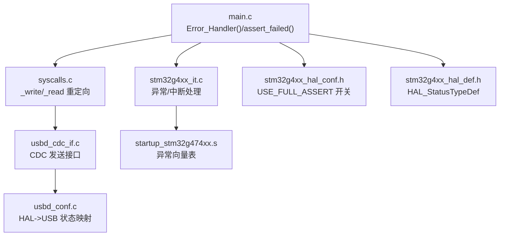
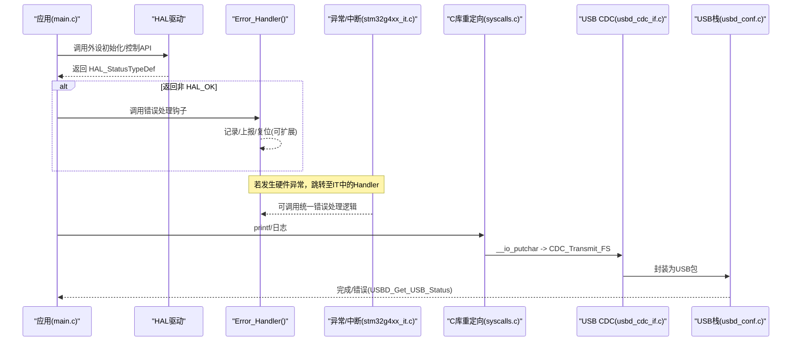
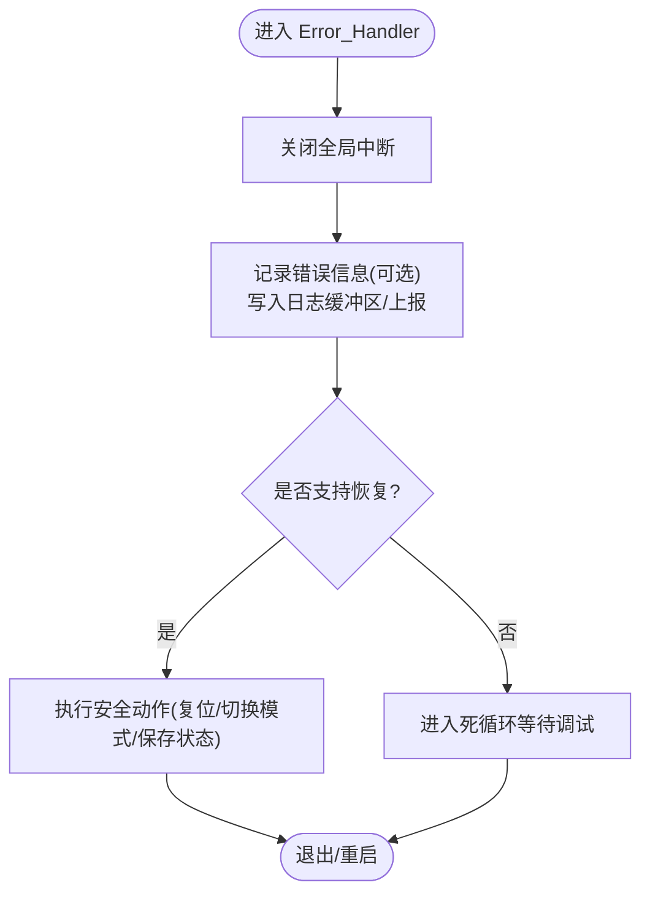
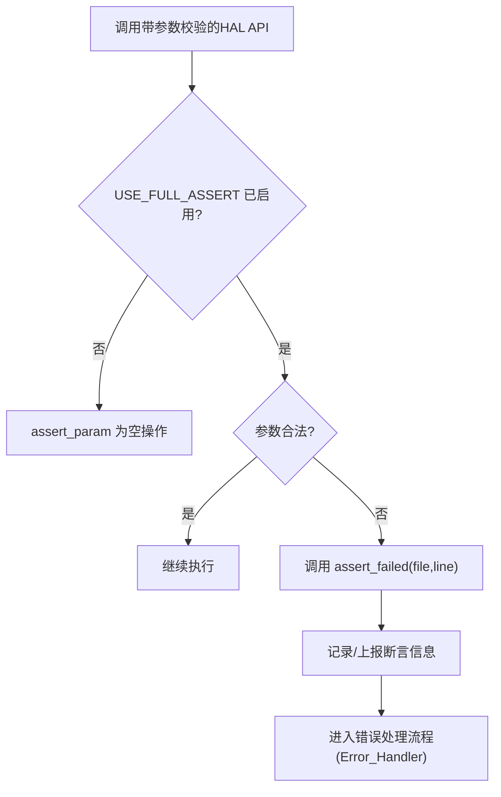
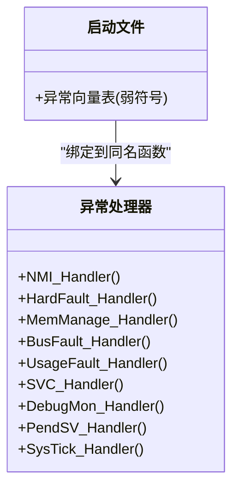
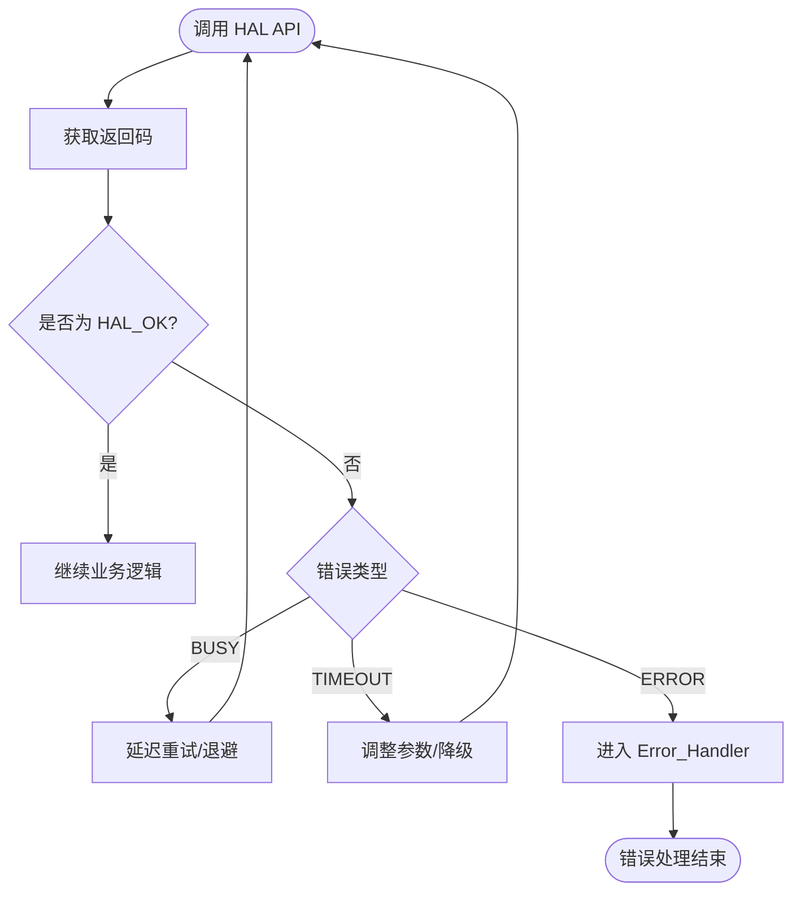
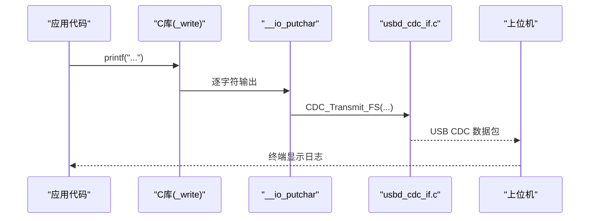
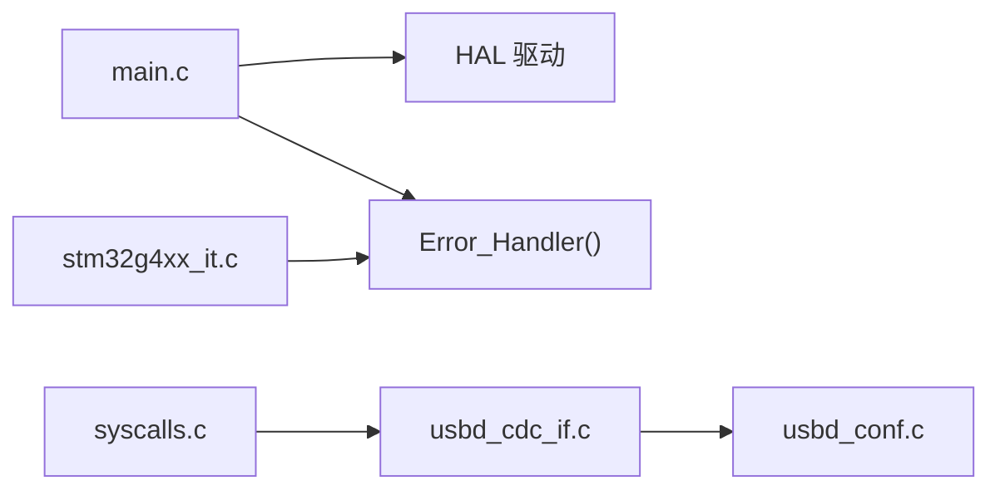

# 错误处理和调试

<cite>
**本文引用的文件**   
- [main.c](file://Core/Src/main.c)
- [main.h](file://Core/Inc/main.h)
- [stm32g4xx_it.c](file://Core/Src/stm32g4xx_it.c)
- [stm32g4xx_it.h](file://Core/Inc/stm32g4xx_it.h)
- [stm32g4xx_hal_conf.h](file://Core/Inc/stm32g4xx_hal_conf.h)
- [stm32g4xx_hal_def.h](file://Drivers/STM32G4xx_HAL_Driver/Inc/stm32g4xx_hal_def.h)
- [syscalls.c](file://Core/Src/syscalls.c)
- [usbd_cdc_if.c](file://USB_Device/App/usbd_cdc_if.c)
- [usbd_conf.c](file://USB_Device/Target/usbd_conf.c)
- [startup_stm32g474xx.s](file://startup_stm32g474xx.s)
</cite>

## 目录
1. [简介](#简介)
2. [项目结构](#项目结构)
3. [核心组件](#核心组件)
4. [架构总览](#架构总览)
5. [详细组件分析](#详细组件分析)
6. [依赖关系分析](#依赖关系分析)
7. [性能考虑](#性能考虑)
8. [故障排查指南](#故障排查指南)
9. [结论](#结论)
10. [附录](#附录)

## 简介
本文件面向在 STM32G4 系列上开发的应用，系统化阐述错误处理与调试机制。重点覆盖：
- Error_Handler() 的作用、扩展方法与恢复策略
- 断言机制（assert_param）的启用与 assert_failed 实现
- HAL 返回码含义与统一处理范式
- 系统级错误处理架构：异常向量、看门狗、故障恢复
- 常用调试技术：SWD 调试、串口/USB CDC 日志输出

## 项目结构
本项目采用 CubeMX 生成的标准工程结构，错误处理相关的关键位置如下：
- 应用入口与错误钩子：main.c
- 中断与异常处理：stm32g4xx_it.c / stm32g4xx_it.h
- HAL 配置与断言开关：stm32g4xx_hal_conf.h
- HAL 通用类型与状态码：stm32g4xx_hal_def.h
- C 库重定向（printf 等）：syscalls.c
- USB CDC 接口（用于日志输出）：usbd_cdc_if.c
- USB 底层配置与状态映射：usbd_conf.c
- 启动文件（异常向量表）：startup_stm32g474xx.s

图表来源
- [main.c:530-555](file://Core/Src/main.c#L530-L555)
- [stm32g4xx_it.c:70-193](file://Core/Src/stm32g4xx_it.c#L70-L193)
- [syscalls.c:80-90](file://Core/Src/syscalls.c#L80-L90)
- [usbd_cdc_if.c](file://USB_Device/App/usbd_cdc_if.c)
- [usbd_conf.c:774-797](file://USB_Device/Target/usbd_conf.c#L774-L797)
- [stm32g4xx_hal_conf.h:359-374](file://Core/Inc/stm32g4xx_hal_conf.h#L359-L374)
- [stm32g4xx_hal_def.h:38-44](file://Drivers/STM32G4xx_HAL_Driver/Inc/stm32g4xx_hal_def.h#L38-L44)
- [startup_stm32g474xx.s:263-288](file://startup_stm32g474xx.s#L263-L288)

章节来源
- [main.c:530-555](file://Core/Src/main.c#L530-L555)
- [stm32g4xx_it.c:70-193](file://Core/Src/stm32g4xx_it.c#L70-L193)
- [stm32g4xx_hal_conf.h:359-374](file://Core/Inc/stm32g4xx_hal_conf.h#L359-L374)
- [stm32g4xx_hal_def.h:38-44](file://Drivers/STM32G4xx_HAL_Driver/Inc/stm32g4xx_hal_def.h#L38-L44)
- [syscalls.c:80-90](file://Core/Src/syscalls.c#L80-L90)
- [usbd_conf.c:774-797](file://USB_Device/Target/usbd_conf.c#L774-L797)
- [startup_stm32g474xx.s:263-288](file://startup_stm32g474xx.s#L263-L288)

## 核心组件
- Error_Handler(): HAL 层统一的错误处理钩子，默认关闭全局中断并进入死循环，便于定位问题。可在 main.c 中扩展为记录日志、复位或安全降级。
- assert_failed(): 当启用 USE_FULL_ASSERT 时，参数校验失败将调用该函数，可输出文件名与行号以便快速定位。
- 异常处理器（HardFault/MemManage/BusFault/UsageFault/NMI 等）：位于 stm32g4xx_it.c，默认空转，建议在此处采集上下文并上报。
- HAL 状态码：HAL_OK/HAL_ERROR/HAL_BUSY/HAL_TIMEOUT，所有 HAL API 均通过此枚举返回结果，需统一检查与处理。
- 日志通道：通过 syscalls.c 的 _write 重定向到 __io_putchar，结合 usbd_cdc_if.c 的 CDC 发送接口，可将 printf 输出经 USB CDC 传输至上位机。

章节来源
- [main.c:530-555](file://Core/Src/main.c#L530-L555)
- [stm32g4xx_it.c:85-140](file://Core/Src/stm32g4xx_it.c#L85-L140)
- [stm32g4xx_hal_def.h:38-44](file://Drivers/STM32G4xx_HAL_Driver/Inc/stm32g4xx_hal_def.h#L38-L44)
- [syscalls.c:80-90](file://Core/Src/syscalls.c#L80-L90)
- [usbd_cdc_if.c](file://USB_Device/App/usbd_cdc_if.c)

## 架构总览
下图展示从 HAL 错误到用户可见输出的整体路径，以及异常处理的汇聚点。

图表来源
- [main.c:530-555](file://Core/Src/main.c#L530-L555)
- [stm32g4xx_it.c:85-140](file://Core/Src/stm32g4xx_it.c#L85-L140)
- [syscalls.c:80-90](file://Core/Src/syscalls.c#L80-L90)
- [usbd_cdc_if.c](file://USB_Device/App/usbd_cdc_if.c)
- [usbd_conf.c:774-797](file://USB_Device/Target/usbd_conf.c#L774-L797)

## 详细组件分析

### Error_Handler() 设计与扩展
- 作用：集中处理 HAL 层返回的错误状态，避免错误扩散；默认关闭中断并停驻，便于调试。
- 扩展建议：
  - 记录错误上下文（时间戳、模块ID、错误码）
  - 通过 USB CDC 或 UART 输出日志
  - 触发软复位或进入安全模式
  - 点亮 LED 指示故障状态

图表来源
- [main.c:530-538](file://Core/Src/main.c#L530-L538)

章节来源
- [main.c:530-538](file://Core/Src/main.c#L530-L538)
- [main.h:53](file://Core/Inc/main.h#L53-L53)

### 断言机制（assert_param 与 assert_failed）
- 启用方式：在 stm32g4xx_hal_conf.h 中取消注释 USE_FULL_ASSERT，使 assert_param 宏生效。
- 行为：当参数校验失败时，调用 assert_failed(file, line)，可输出源文件名与行号。
- 建议实现：
  - 将断言信息写入环形缓冲区并通过 CDC 周期性上报
  - 在断言命中时停止关键任务或进入安全状态
  - 生产版本可选择禁用断言以减小体积与开销

图表来源
- [stm32g4xx_hal_conf.h:359-374](file://Core/Inc/stm32g4xx_hal_conf.h#L359-L374)
- [main.c:540-555](file://Core/Src/main.c#L540-L555)

章节来源
- [stm32g4xx_hal_conf.h:359-374](file://Core/Inc/stm32g4xx_hal_conf.h#L359-L374)
- [main.c:540-555](file://Core/Src/main.c#L540-L555)

### 异常处理与故障恢复
- 异常向量：NMI、HardFault、MemManage、BusFault、UsageFault 等由 startup_stm32g474xx.s 提供弱定义，stm32g4xx_it.c 中可实现具体处理。
- 建议策略：
  - 在 HardFault 等致命异常中读取堆栈指针、LR、PC 等寄存器，打印上下文
  - 尝试安全复位或切换到最小功能模式
  - 将故障码持久化到 Flash/EEPROM 供后续分析

图表来源
- [startup_stm32g474xx.s:263-288](file://startup_stm32g474xx.s#L263-L288)
- [stm32g4xx_it.c:70-193](file://Core/Src/stm32g4xx_it.c#L70-L193)

章节来源
- [stm32g4xx_it.c:70-193](file://Core/Src/stm32g4xx_it.c#L70-L193)
- [startup_stm32g474xx.s:263-288](file://startup_stm32g474xx.s#L263-L288)

### 错误返回码与统一处理
- HAL_StatusTypeDef 包含四种状态：成功、错误、忙、超时。
- 推荐做法：
  - 每个 HAL 调用后检查返回值，非 HAL_OK 则进入 Error_Handler 或局部恢复逻辑
  - 对 BUSY 进行重试或退避；对 TIMEOUT 增加超时阈值或降级策略
  - 在 USB 层，将 HAL 状态映射为 USBD 状态，便于上层统一处理

图表来源
- [stm32g4xx_hal_def.h:38-44](file://Drivers/STM32G4xx_HAL_Driver/Inc/stm32g4xx_hal_def.h#L38-L44)
- [usbd_conf.c:774-797](file://USB_Device/Target/usbd_conf.c#L774-L797)

章节来源
- [stm32g4xx_hal_def.h:38-44](file://Drivers/STM32G4xx_HAL_Driver/Inc/stm32g4xx_hal_def.h#L38-L44)
- [usbd_conf.c:774-797](file://USB_Device/Target/usbd_conf.c#L774-L797)

### 日志输出链路（printf -> USB CDC）
- syscalls.c 将 _write 重定向到 __io_putchar，从而让 printf 输出走自定义通道。
- usbd_cdc_if.c 提供 CDC_Transmit_FS 等接口，将数据打包发送至主机。
- 建议在 Error_Handler 与异常处理器中插入日志输出，便于现场复现。

图表来源
- [syscalls.c:80-90](file://Core/Src/syscalls.c#L80-L90)
- [usbd_cdc_if.c](file://USB_Device/App/usbd_cdc_if.c)

章节来源
- [syscalls.c:80-90](file://Core/Src/syscalls.c#L80-L90)
- [usbd_cdc_if.c](file://USB_Device/App/usbd_cdc_if.c)

### 看门狗与故障恢复（建议）
- 当前工程未显式启用独立看门狗（IWDG）或窗口看门狗（WWDG）。如需增强鲁棒性，建议：
  - 启用 IWDG 作为软件“心跳”监控，定期喂狗
  - 使用 WWDG 捕获长时间阻塞或调度异常
  - 在异常处理器中记录故障码并触发复位
- 注意：在调试阶段可通过调试器冻结看门狗，避免频繁复位影响调试效率。

[本节为概念性建议，不直接分析具体文件]

## 依赖关系分析
- main.c 依赖 HAL 初始化与外设驱动，并在错误路径调用 Error_Handler。
- stm32g4xx_it.c 依赖 CMSIS 与 HAL 的中断服务框架，负责异常与外设中断分发。
- syscalls.c 依赖 __io_putchar/__io_getchar 实现，向上层提供标准 I/O。
- usbd_conf.c 提供 HAL 状态到 USB 状态的映射，确保上层能感知 USB 错误。

图表来源
- [main.c:530-555](file://Core/Src/main.c#L530-L555)
- [stm32g4xx_it.c:70-193](file://Core/Src/stm32g4xx_it.c#L70-L193)
- [syscalls.c:80-90](file://Core/Src/syscalls.c#L80-L90)
- [usbd_conf.c:774-797](file://USB_Device/Target/usbd_conf.c#L774-L797)

章节来源
- [main.c:530-555](file://Core/Src/main.c#L530-L555)
- [stm32g4xx_it.c:70-193](file://Core/Src/stm32g4xx_it.c#L70-L193)
- [syscalls.c:80-90](file://Core/Src/syscalls.c#L80-L90)
- [usbd_conf.c:774-797](file://USB_Device/Target/usbd_conf.c#L774-L797)

## 性能考虑
- Error_Handler 与异常处理器应避免耗时操作，必要时仅做最小化记录与复位。
- 断言在生产环境建议关闭以减少开销。
- 日志输出应批量缓冲、异步发送，避免阻塞主循环。
- 对 BUSY/超时错误采用指数退避与上限重试，防止抖动。

[本节提供一般性指导，不直接分析具体文件]

## 故障排查指南
- 现象：程序卡死在 Error_Handler
  - 检查最近一次 HAL 调用的返回值与上下文
  - 通过 USB CDC 或 UART 输出错误码与时间戳
  - 使用 SWD 连接，查看调用栈与寄存器
- 现象：断言命中
  - 确认 USE_FULL_ASSERT 已启用
  - 根据 assert_failed 输出的文件名与行号定位参数校验失败点
- 现象：USB CDC 无法输出
  - 检查 CDC_Transmit_FS 返回值与 USBD_Get_USB_Status 映射
  - 确认设备描述符与端点配置正确
- 现象：HardFault/MemManage/BusFault
  - 在对应 Handler 中读取堆栈帧，定位非法访问或对齐错误
  - 检查指针有效性、数组越界、栈溢出

章节来源
- [main.c:530-555](file://Core/Src/main.c#L530-L555)
- [stm32g4xx_it.c:85-140](file://Core/Src/stm32g4xx_it.c#L85-L140)
- [usbd_conf.c:774-797](file://USB_Device/Target/usbd_conf.c#L774-L797)

## 结论
通过统一错误钩子、断言机制、异常处理器与日志通道，可在 STM32G4 应用中构建健壮的错误处理体系。建议在生产环境中谨慎启用断言，结合 USB CDC 日志与 SWD 调试，快速定位与恢复故障。对于高可靠性场景，引入看门狗与故障码持久化，进一步提升系统鲁棒性。

[本节为总结性内容，不直接分析具体文件]

## 附录
- 常用调试工具
  - SWD 调试：使用 ST-Link/J-Link 连接，设置断点、单步、查看寄存器与内存
  - 串口/USB CDC 日志：通过上位机终端观察实时输出
  - 逻辑分析仪：抓取 GPIO 与通信信号，辅助时序分析
- 最佳实践
  - 所有 HAL 调用均需检查返回值
  - 在关键路径加入断言，尽早暴露参数错误
  - 异常处理器中尽量轻量，避免二次崩溃
  - 日志分级与缓冲，减少运行时开销

[本节为通用建议，不直接分析具体文件]