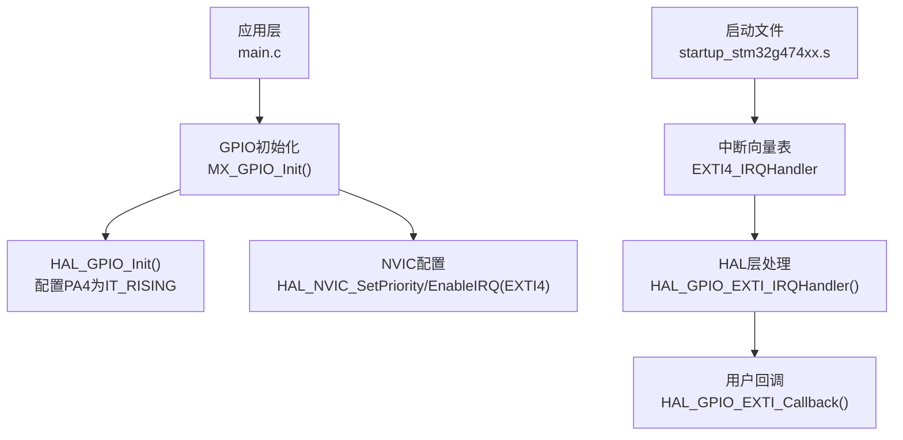
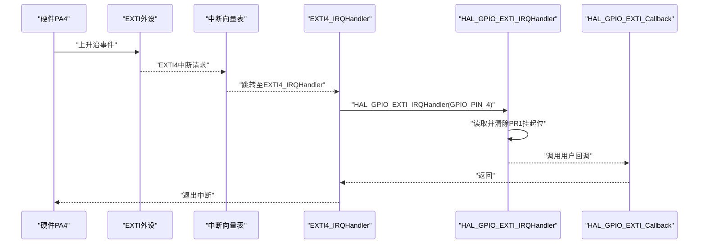
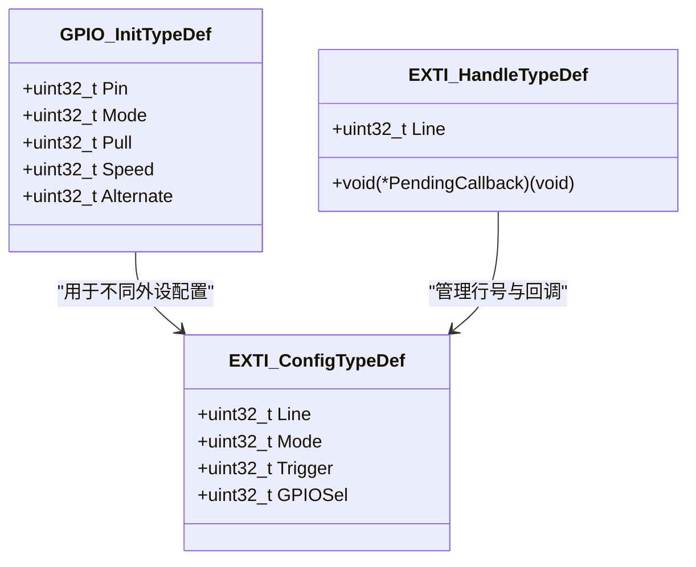
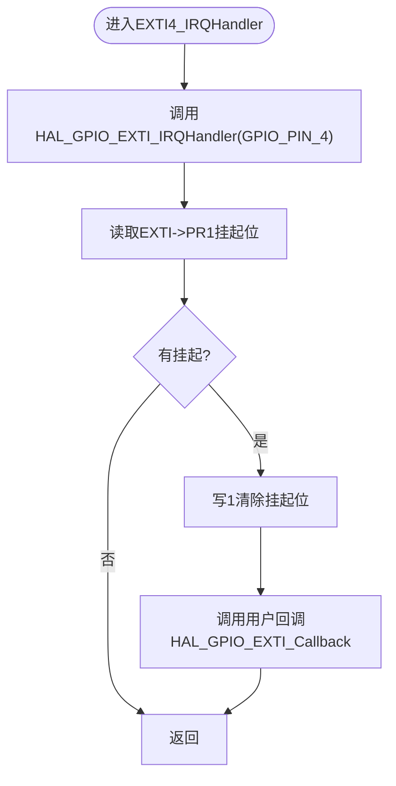
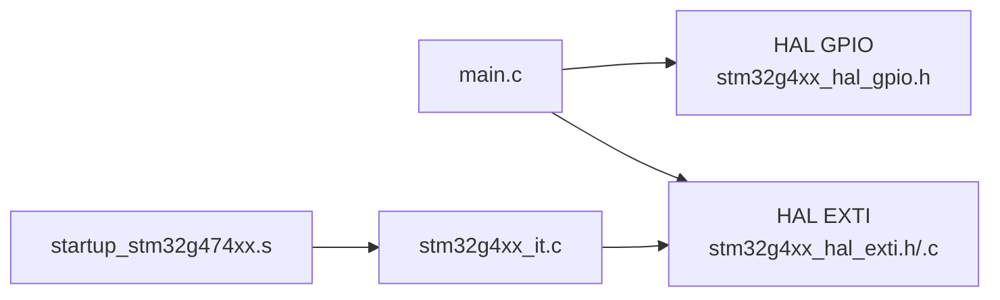

# EXTI外部中断配置

<cite>
**本文引用的文件**   
- [main.c](file://Core/Src/main.c)
- [stm32g4xx_it.c](file://Core/Src/stm32g4xx_it.c)
- [startup_stm32g474xx.s](file://startup_stm32g474xx.s)
- [stm32g4xx_hal_exti.h](file://Drivers/STM32G4xx_HAL_Driver/Inc/stm32g4xx_hal_exti.h)
- [stm32g4xx_hal_exti.c](file://Drivers/STM32G4xx_HAL_Driver/Src/stm32g4xx_hal_exti.c)
- [stm32g4xx_hal_gpio.h](file://Drivers/STM32G4xx_HAL_Driver/Inc/stm32g4xx_hal_gpio.h)
</cite>

## 目录
1. [简介](#简介)
2. [项目结构](#项目结构)
3. [核心组件](#核心组件)
4. [架构总览](#架构总览)
5. [详细组件分析](#详细组件分析)
6. [依赖关系分析](#依赖关系分析)
7. [性能与实时性考虑](#性能与实时性考虑)
8. [故障排查指南](#故障排查指南)
9. [结论](#结论)
10. [附录：寄存器级配置与最佳实践](#附录寄存器级配置与最佳实践)

## 简介
本技术文档围绕PA4引脚的外部中断（EXTI）配置展开，重点说明以下内容：
- GPIO_MODE_IT_RISING模式的设置与上升沿触发机制
- HAL_NVIC_SetPriority(EXTI4_IRQn, 0, 0)的中断优先级配置及选择优先级0的原因
- HAL_GPIO_EXTI_Callback回调函数的实现原理与中断服务程序执行流程
- 中断向量表配置、中断使能设置与中断清除机制
- EXTI寄存器级别的配置示例与最佳实践建议

## 项目结构
本项目基于STM32G4系列，使用HAL库进行外设驱动。与EXTI相关的关键位置如下：
- 应用层初始化与回调：Core/Src/main.c
- 中断服务程序入口：Core/Src/stm32g4xx_it.c
- 启动文件中的中断向量表：startup_stm32g474xx.s
- HAL层EXTI接口定义与实现：Drivers/STM32G4xx_HAL_Driver/Inc/stm32g4xx_hal_exti.h 与 Src/stm32g4xx_hal_exti.c
- HAL层GPIO模式常量：Drivers/STM32G4xx_HAL_Driver/Inc/stm32g4xx_hal_gpio.h

图表来源 
- [main.c:488-520](file://Core/Src/main.c#L488-L520)
- [stm32g4xx_it.c:205-214](file://Core/Src/stm32g4xx_it.c#L205-L214)
- [startup_stm32g474xx.s:156-160](file://startup_stm32g474xx.s#L156-L160)
- [stm32g4xx_hal_exti.c:504-531](file://Drivers/STM32G4xx_HAL_Driver/Src/stm32g4xx_hal_exti.c#L504-L531)

章节来源
- [main.c:488-520](file://Core/Src/main.c#L488-L520)
- [stm32g4xx_it.c:205-214](file://Core/Src/stm32g4xx_it.c#L205-L214)
- [startup_stm32g474xx.s:156-160](file://startup_stm32g474xx.s#L156-L160)

## 核心组件
- PA4引脚的GPIO模式设置为外部中断上升沿触发：通过GPIO_InitStruct.Mode = GPIO_MODE_IT_RISING完成，该模式组合了输入模式、EXTI中断模式与上升沿触发位。
- NVIC中断优先级与使能：在GPIO初始化中调用HAL_NVIC_SetPriority(EXTI4_IRQn, 0, 0)和HAL_NVIC_EnableIRQ(EXTI4_IRQn)，将EXTI4中断优先级设为最高（抢占优先级0，子优先级0），并启用中断。
- 中断服务程序与回调：EXTI4_IRQHandler作为硬件中断入口，调用HAL_GPIO_EXTI_IRQHandler(GPIO_PIN_4)，后者检查挂起标志并调用用户实现的HAL_GPIO_EXTI_Callback(GPIO_PIN_4)。

章节来源
- [main.c:498-506](file://Core/Src/main.c#L498-L506)
- [stm32g4xx_it.c:205-214](file://Core/Src/stm32g4xx_it.c#L205-L214)
- [stm32g4xx_hal_gpio.h:124-126](file://Drivers/STM32G4xx_HAL_Driver/Inc/stm32g4xx_hal_gpio.h#L124-L126)

## 架构总览
从硬件到软件的整体中断路径如下：
- 硬件：PA4引脚检测到上升沿，EXTI逻辑产生中断请求
- 向量表：startup_stm32g474xx.s将EXTI4_IRQHandler映射到向量表
- 内核：Cortex-M4根据NVIC优先级调度，进入EXTI4_IRQHandler
- HAL层：EXTI4_IRQHandler调用HAL_GPIO_EXTI_IRQHandler，读取并清除挂起标志，然后调用用户回调
- 用户层：HAL_GPIO_EXTI_Callback中实现业务逻辑（例如记录触发位置、状态标志等）

图表来源 
- [startup_stm32g474xx.s:156-160](file://startup_stm32g474xx.s#L156-L160)
- [stm32g4xx_it.c:205-214](file://Core/Src/stm32g4xx_it.c#L205-L214)
- [stm32g4xx_hal_exti.c:504-531](file://Drivers/STM32G4xx_HAL_Driver/Src/stm32g4xx_hal_exti.c#L504-L531)

## 详细组件分析

### PA4引脚外部中断配置（GPIO_MODE_IT_RISING）
- 在MX_GPIO_Init中，PA4被配置为GPIO_MODE_IT_RISING，表示“外部中断模式+上升沿触发”。该模式由HAL宏组合而成，包含输入模式、EXTI中断模式以及上升沿触发位。
- 同时，PA4对应的SYSCFG_EXTICR寄存器会被自动配置以将PA4映射到EXTI4线（由HAL底层完成）。
- 随后，NVIC对EXTI4中断进行优先级设置与使能。

章节来源
- [main.c:498-506](file://Core/Src/main.c#L498-L506)
- [stm32g4xx_hal_gpio.h:124-126](file://Drivers/STM32G4xx_HAL_Driver/Inc/stm32g4xx_hal_gpio.h#L124-L126)

#### 类图：GPIO与EXTI相关类型与常量

图表来源 
- [stm32g4xx_hal_gpio.h:47-63](file://Drivers/STM32G4xx_HAL_Driver/Inc/stm32g4xx_hal_gpio.h#L47-L63)
- [stm32g4xx_hal_exti.h:53-73](file://Drivers/STM32G4xx_HAL_Driver/Inc/stm32g4xx_hal_exti.h#L53-L73)

### 中断优先级配置（HAL_NVIC_SetPriority(EXTI4_IRQn, 0, 0)）
- 抢占优先级0与子优先级0意味着EXTI4具有最高优先级，确保在系统存在其他中断时仍能最快响应。
- 对于需要严格时间约束的应用（如超声信号触发捕获），选择优先级0可最小化抖动与延迟。

章节来源
- [main.c:505-506](file://Core/Src/main.c#L505-L506)

### 中断服务程序与回调执行流程
- EXTI4_IRQHandler是硬件中断入口，负责调用HAL层处理函数HAL_GPIO_EXTI_IRQHandler(GPIO_PIN_4)。
- HAL层函数会：
  - 计算对应行的掩码
  - 读取EXTI->PR1挂起位
  - 若置位则写1清零挂起位
  - 调用已注册的回调函数（在本项目中为用户自定义的HAL_GPIO_EXTI_Callback）
- 用户回调中应仅做快速操作（如记录触发位置、置位标志），避免阻塞。

图表来源 
- [stm32g4xx_it.c:205-214](file://Core/Src/stm32g4xx_it.c#L205-L214)
- [stm32g4xx_hal_exti.c:504-531](file://Drivers/STM32G4xx_HAL_Driver/Src/stm32g4xx_hal_exti.c#L504-L531)
- [main.c:91-113](file://Core/Src/main.c#L91-L113)

章节来源
- [stm32g4xx_it.c:205-214](file://Core/Src/stm32g4xx_it.c#L205-L214)
- [stm32g4xx_hal_exti.c:504-531](file://Drivers/STM32G4xx_HAL_Driver/Src/stm32g4xx_hal_exti.c#L504-L531)
- [main.c:91-113](file://Core/Src/main.c#L91-L113)

### 中断向量表配置
- 启动文件startup_stm32g474xx.s定义了中断向量表，其中EXTI4_IRQHandler条目指向实际的中断服务程序。
- 链接器将向量表放置在Flash起始地址，复位后CPU据此跳转到相应ISR。

章节来源
- [startup_stm32g474xx.s:156-160](file://startup_stm32g474xx.s#L156-L160)

### 中断使能与清除机制
- 使能：在GPIO初始化中调用HAL_NVIC_EnableIRQ(EXTI4_IRQn)开启EXTI4中断。
- 清除：HAL层在HAL_GPIO_EXTI_IRQHandler中自动清除EXTI->PR1挂起位；也可通过HAL_EXTI_ClearPending或__HAL_GPIO_EXTI_CLEAR_FLAG宏手动清除。

章节来源
- [main.c:505-506](file://Core/Src/main.c#L505-L506)
- [stm32g4xx_hal_exti.c:504-531](file://Drivers/STM32G4xx_HAL_Driver/Src/stm32g4xx_hal_exti.c#L504-L531)
- [stm32g4xx_hal_gpio.h:173-181](file://Drivers/STM32G4xx_HAL_Driver/Inc/stm32g4xx_hal_gpio.h#L173-L181)

## 依赖关系分析
- main.c依赖HAL库的GPIO与NVIC接口进行外设与中断配置
- stm32g4xx_it.c提供具体外设中断入口，并委托给HAL层处理
- HAL层EXTI模块封装了对EXTI寄存器的访问与挂起位管理
- 启动文件提供中断向量表，建立硬件中断到软件ISR的映射

图表来源 
- [main.c:488-520](file://Core/Src/main.c#L488-L520)
- [stm32g4xx_it.c:205-214](file://Core/Src/stm32g4xx_it.c#L205-L214)
- [stm32g4xx_hal_exti.h:275-292](file://Drivers/STM32G4xx_HAL_Driver/Inc/stm32g4xx_hal_exti.h#L275-L292)
- [stm32g4xx_hal_exti.c:504-531](file://Drivers/STM32G4xx_HAL_Driver/Src/stm32g4xx_hal_exti.c#L504-L531)
- [startup_stm32g474xx.s:156-160](file://startup_stm32g474xx.s#L156-L160)

章节来源
- [main.c:488-520](file://Core/Src/main.c#L488-L520)
- [stm32g4xx_it.c:205-214](file://Core/Src/stm32g4xx_it.c#L205-L214)
- [stm32g4xx_hal_exti.h:275-292](file://Drivers/STM32G4xx_HAL_Driver/Inc/stm32g4xx_hal_exti.h#L275-L292)
- [stm32g4xx_hal_exti.c:504-531](file://Drivers/STM32G4xx_HAL_Driver/Src/stm32g4xx_hal_exti.c#L504-L531)
- [startup_stm32g474xx.s:156-160](file://startup_stm32g474xx.s#L156-L160)

## 性能与实时性考虑
- 中断优先级：选择抢占优先级0可保证EXTI4在多数场景下优先响应，降低触发抖动与数据丢失风险。
- 回调函数设计：HAL_GPIO_EXTI_Callback应尽量短小，仅更新volatile标志或记录关键信息，复杂处理移至主循环。
- 去抖与防重入：在回调中加入必要的判断（如忽略重复触发、屏蔽传输期间的干扰），避免误触发与竞争条件。
- DMA协同：结合DMA半传输/传输完成回调，可在中断触发后可靠采集前后样本窗口。

[本节为通用指导，不直接分析具体文件]

## 故障排查指南
- 无中断响应：
  - 确认PA4已配置为GPIO_MODE_IT_RISING且未与其他功能冲突
  - 确认NVIC已使能EXTI4中断
  - 检查EXTI->PR1是否被正确清除
- 多次触发或漏触发：
  - 在回调中添加防重入与去抖逻辑
  - 检查外部信号质量与上拉/下拉配置
- 优先级问题：
  - 对比其他高优先级中断（如DMA、USB）的配置，确保EXTI4满足实时需求

章节来源
- [main.c:91-113](file://Core/Src/main.c#L91-L113)
- [stm32g4xx_hal_exti.c:504-531](file://Drivers/STM32G4xx_HAL_Driver/Src/stm32g4xx_hal_exti.c#L504-L531)

## 结论
通过对PA4引脚的EXTI外部中断配置分析，明确了以下关键点：
- GPIO_MODE_IT_RISING模式实现了上升沿触发的外部中断
- 将EXTI4中断优先级设为0确保了实时性与低延迟
- 中断服务程序与HAL层协作，自动清除挂起位并调用用户回调
- 启动文件的中断向量表建立了硬件到软件的映射
- 合理设计回调与主循环交互，结合DMA可实现可靠的触发采样

[本节为总结，不直接分析具体文件]

## 附录：寄存器级配置与最佳实践

### 寄存器级配置要点（概念性说明）
- SYSCFG_EXTICRx：将PA4映射到EXTI4线
- EXTI->RTSR1：使能上升沿触发
- EXTI->IMR1：使能EXTI4中断
- EXTI->PR1：读取并写1清除挂起位

注意：上述寄存器操作由HAL层封装，推荐优先使用HAL API以保证可移植性与安全性。

章节来源
- [stm32g4xx_hal_exti.c:172-222](file://Drivers/STM32G4xx_HAL_Driver/Src/stm32g4xx_hal_exti.c#L172-L222)
- [stm32g4xx_hal_exti.c:504-531](file://Drivers/STM32G4xx_HAL_Driver/Src/stm32g4xx_hal_exti.c#L504-L531)

### 最佳实践建议
- 在回调中只做轻量操作，避免阻塞
- 使用volatile变量在ISR与主循环间传递状态
- 对外部信号增加硬件去抖或软件滤波
- 明确中断优先级策略，避免高优先级中断长时间占用
- 利用DMA与双缓冲减少数据丢失风险

[本节为通用指导，不直接分析具体文件]