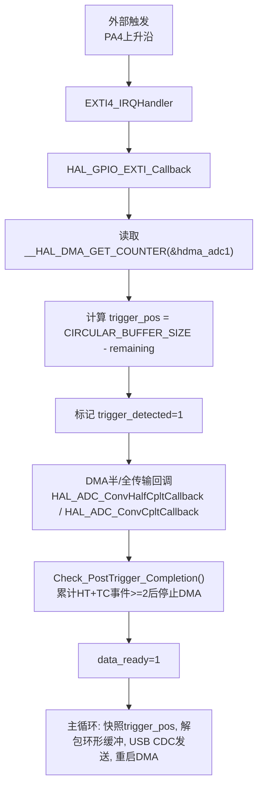
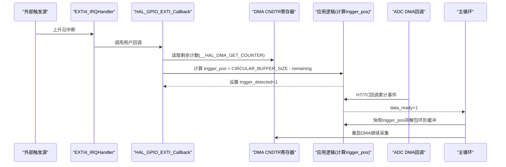
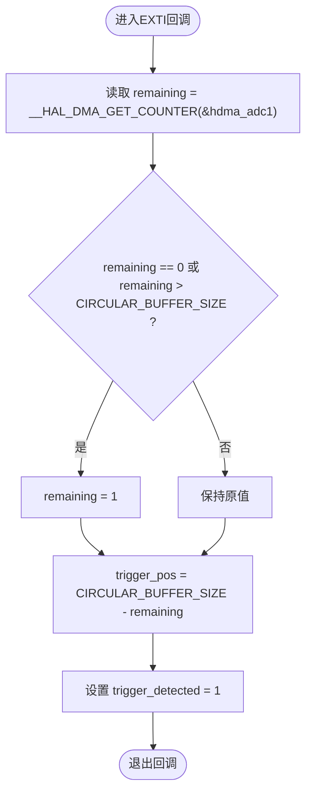
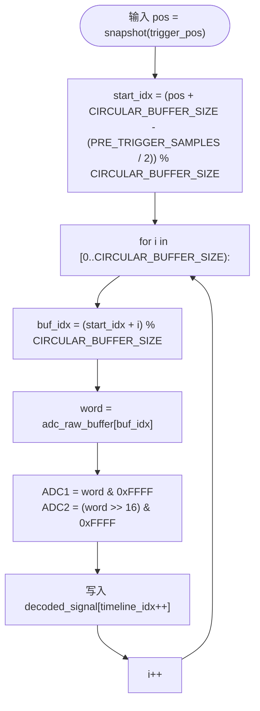
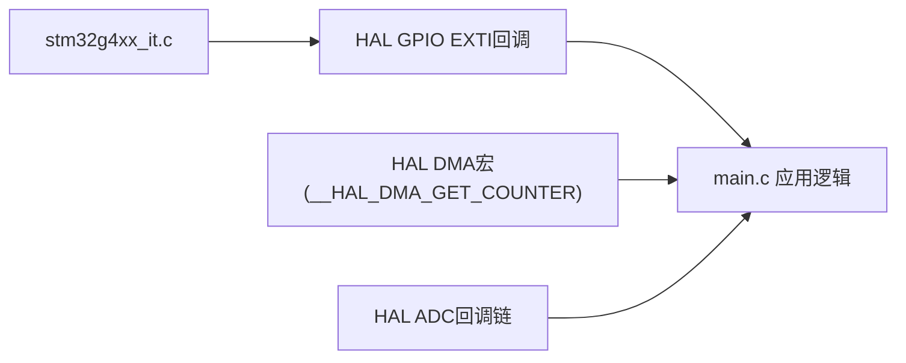

# 触发位置精确定位

<cite>
**本文引用的文件**   
- [Core/Src/main.c](file://Core/Src/main.c)
- [Core/Inc/main.h](file://Core/Inc/main.h)
- [Drivers/STM32G4xx_HAL_Driver/Inc/stm32g4xx_hal_dma.h](file://Drivers/STM32G4xx_HAL_Driver/Inc/stm32g4xx_hal_dma.h)
- [Drivers/STM32G4xx_HAL_Driver/Inc/stm32g4xx_ll_dma.h](file://Drivers/STM32G4xx_HAL_Driver/Inc/stm32g4xx_ll_dma.h)
- [Drivers/STM32G4xx_HAL_Driver/Src/stm32g4xx_hal_adc.c](file://Drivers/STM32G4xx_HAL_Driver/Src/stm32g4xx_hal_adc.c)
- [Drivers/STM32G4xx_HAL_Driver/Src/stm32g4xx_hal_adc_ex.c](file://Drivers/STM32G4xx_HAL_Driver/Src/stm32g4xx_hal_adc_ex.c)
- [Core/Src/stm32g4xx_it.c](file://Core/Src/stm32g4xx_it.c)
</cite>

## 目录
1. [简介](#简介)
2. [项目结构](#项目结构)
3. [核心组件](#核心组件)
4. [架构总览](#架构总览)
5. [详细组件分析](#详细组件分析)
6. [依赖关系分析](#依赖关系分析)
7. [性能与精度考量](#性能与精度考量)
8. [故障排查指南](#故障排查指南)
9. [结论](#结论)
10. [附录](#附录)

## 简介
本技术文档聚焦于“触发位置精确定位算法”，围绕以下关键点展开：
- __HAL_DMA_GET_COUNTER(&hdma_adc1) 读取DMA剩余传输计数（CNDTR）的原理与时序特性
- 环形缓冲区中精确触发位置的推导：trigger_pos = CIRCULAR_BUFFER_SIZE - remaining
- 边界条件保护：remaining == 0 或 remaining > CIRCULAR_BUFFER_SIZE 的处理策略
- 亚微秒级触发精度的实现方法与时序分析，包括DMA计数器更新时机与中断延迟补偿
- 提供触发位置计算的流程图与时序图，帮助读者建立从硬件到软件的完整认知

## 项目结构
本项目基于STM32G4系列，采用双ADC交错模式+DMA循环写入环形缓冲区的方案。关键路径如下：
- EXTI上升沿触发捕获：在EXTI回调中读取DMA剩余计数，计算触发位置
- DMA半传输/全传输回调：用于判定采集完成并停止DMA
- 主循环：快照触发位置、解包环形缓冲为线性时间线、通过USB CDC发送数据、重启DMA等待下一次触发

图表来源
- [Core/Src/main.c:91-113](file://Core/Src/main.c#L91-L113)
- [Core/Src/main.c:136-149](file://Core/Src/main.c#L136-L149)
- [Core/Src/main.c:119-131](file://Core/Src/main.c#L119-L131)
- [Core/Src/main.c:259-289](file://Core/Src/main.c#L259-L289)
- [Core/Src/stm32g4xx_it.c:205-214](file://Core/Src/stm32g4xx_it.c#L205-L214)
- [Core/Src/stm32g4xx_it.c:219-228](file://Core/Src/stm32g4xx_it.c#L219-L228)

章节来源
- [Core/Src/main.c:52-70](file://Core/Src/main.c#L52-L70)
- [Core/Src/main.c:259-289](file://Core/Src/main.c#L259-L289)
- [Core/Src/stm32g4xx_it.c:205-228](file://Core/Src/stm32g4xx_it.c#L205-L228)

## 核心组件
- 环形缓冲区与参数定义
  - CIRCULAR_BUFFER_SIZE：环形缓冲区长度（单位：uint32_t字），每个字包含ADC1低16位与ADC2高16位，形成交错采样
  - TOTAL_SAMPLES：线性重建后的样本总数（2×CIRCULAR_BUFFER_SIZE）
  - PRE_TRIGGER_SAMPLES/POST_TRIGGER_SAMPLES：预触发与后触发样本数配置
- 全局状态变量
  - data_ready：主循环处理标志
  - trigger_detected：触发已发生标志
  - trigger_pos：触发位置索引（环形缓冲中的偏移）
  - post_trigger_dma_events：用于统计HT/TC事件数量
  - uart_busy：防止UART传输期间误触发的互斥锁
- 关键函数
  - HAL_GPIO_EXTI_Callback：EXTI回调，读取DMA剩余计数并计算trigger_pos
  - Check_PostTrigger_Completion：统计HT/TC事件，达到阈值后停止DMA并置data_ready
  - Unpack_Ultrasound_Timeline：根据snapshot的trigger_pos将环形缓冲解包为线性时间线
  - Send_Signal_Over_UART：将解码后的信号通过USB CDC批量发送

章节来源
- [Core/Src/main.c:52-70](file://Core/Src/main.c#L52-L70)
- [Core/Src/main.c:91-113](file://Core/Src/main.c#L91-L113)
- [Core/Src/main.c:119-131](file://Core/Src/main.c#L119-L131)
- [Core/Src/main.c:156-171](file://Core/Src/main.c#L156-L171)
- [Core/Src/main.c:178-212](file://Core/Src/main.c#L178-L212)

## 架构总览
系统以“外部触发→EXTI→DMA剩余计数→触发位置计算→环形缓冲解包→USB输出”为主线。DMA工作在循环模式，持续将ADC1/ADC2交错结果写入环形缓冲；当EXTI检测到上升沿时，立即读取DMA剩余计数，从而反推出当前写入指针相对于环形缓冲起始位置的偏移，即触发位置。

图表来源
- [Core/Src/stm32g4xx_it.c:205-214](file://Core/Src/stm32g4xx_it.c#L205-L214)
- [Core/Src/main.c:91-113](file://Core/Src/main.c#L91-L113)
- [Core/Src/main.c:136-149](file://Core/Src/main.c#L136-L149)
- [Core/Src/main.c:259-289](file://Core/Src/main.c#L259-L289)

## 详细组件分析

### 触发位置精确定位算法
- 原理概述
  - DMA在循环模式下维护一个剩余传输计数寄存器CNDTR，表示“还需传输的数据单元数”。每次成功搬运一个数据单元，CNDTR递减；当到达缓冲区末尾时，在循环模式下会重新装载初始长度值。
  - 在EXTI回调中读取CNDTR得到remaining，则已写入的数据单元数为“总长度 - remaining”。由于环形缓冲长度为CIRCULAR_BUFFER_SIZE，因此触发位置（即写入指针相对起始位置的偏移）为：
    - trigger_pos = CIRCULAR_BUFFER_SIZE - remaining
- 数学推导与边界条件
  - 正常情况：1 ≤ remaining ≤ CIRCULAR_BUFFER_SIZE，则0 ≤ trigger_pos < CIRCULAR_BUFFER_SIZE，符合环形索引范围
  - 边界保护：
    - remaining == 0：可能发生在CNDTR重载瞬间或临界竞争窗口，此时将remaining强制设为1，避免trigger_pos等于CIRCULAR_BUFFER_SIZE导致越界
    - remaining > CIRCULAR_BUFFER_SIZE：异常值（如未正确初始化或并发修改），同样强制修正为1，保证安全
  - 上述保护确保trigger_pos始终落在[0, CIRCULAR_BUFFER_SIZE-1]区间内
- 代码片段路径
  - 读取与保护：见 [Core/Src/main.c:100-105](file://Core/Src/main.c#L100-L105)
  - 宏定义与缓冲区大小：见 [Core/Src/main.c:52-59](file://Core/Src/main.c#L52-L59)

图表来源
- [Core/Src/main.c:100-113](file://Core/Src/main.c#L100-L113)

章节来源
- [Core/Src/main.c:100-113](file://Core/Src/main.c#L100-L113)
- [Core/Src/main.c:52-59](file://Core/Src/main.c#L52-L59)

### DMA剩余计数读取机制
- 底层实现
  - __HAL_DMA_GET_COUNTER宏直接访问DMA通道实例的CNDTR寄存器，返回剩余数据单元数
  - LL层也提供了LL_DMA_GetDataLength接口，语义一致
- 行为特性
  - 在DMA运行期间，CNDTR随每次数据传输递减
  - 在循环模式下，当CNDTR减至0时会重新装载初始长度值，存在极短的重载窗口
- 代码片段路径
  - HAL宏定义：见 [Drivers/STM32G4xx_HAL_Driver/Inc/stm32g4xx_hal_dma.h:739-740](file://Drivers/STM32G4xx_HAL_Driver/Inc/stm32g4xx_hal_dma.h#L739-L740)
  - LL接口：见 [Drivers/STM32G4xx_HAL_Driver/Inc/stm32g4xx_ll_dma.h:1022-1027](file://Drivers/STM32G4xx_HAL_Driver/Inc/stm32g4xx_ll_dma.h#L1022-L1027)

章节来源
- [Drivers/STM32G4xx_HAL_Driver/Inc/stm32g4xx_hal_dma.h:739-740](file://Drivers/STM32G4xx_HAL_Driver/Inc/stm32g4xx_hal_dma.h#L739-L740)
- [Drivers/STM32G4xx_HAL_Driver/Inc/stm32g4xx_ll_dma.h:1022-1027](file://Drivers/STM32G4xx_HAL_Driver/Inc/stm32g4xx_ll_dma.h#L1022-L1027)

### 触发位置到线性时间线的映射
- 目标
  - 使用snapshot的trigger_pos，结合预触发样本数，计算环形缓冲的起始索引start_idx，然后按顺序解包交错数据为线性时间线
- 关键步骤
  - start_idx = (pos + CIRCULAR_BUFFER_SIZE - (PRE_TRIGGER_SAMPLES / 2)) % CIRCULAR_BUFFER_SIZE
  - 遍历环形缓冲，依次取出ADC1低16位与ADC2高16位，填充decoded_signal
- 代码片段路径
  - 解包逻辑：见 [Core/Src/main.c:156-171](file://Core/Src/main.c#L156-L171)

图表来源
- [Core/Src/main.c:156-171](file://Core/Src/main.c#L156-L171)

章节来源
- [Core/Src/main.c:156-171](file://Core/Src/main.c#L156-L171)

### 采集完成判定与DMA控制
- 设计思路
  - 需要至少两个DMA事件（半传输HT与全传输TC）来保证足够数量的后触发样本被写入
  - 每收到一次HT或TC回调，post_trigger_dma_events自增；当≥2时停止DMA并置data_ready
- 回调链路
  - ADC内部DMA回调函数将调用HAL层回调，最终落到用户实现的HAL_ADC_ConvHalfCpltCallback与HAL_ADC_ConvCpltCallback
- 代码片段路径
  - 用户回调：见 [Core/Src/main.c:136-149](file://Core/Src/main.c#L136-L149)
  - 完成判断：见 [Core/Src/main.c:119-131](file://Core/Src/main.c#L119-L131)
  - HAL回调注册与调用：见 [Drivers/STM32G4xx_HAL_Driver/Src/stm32g4xx_hal_adc.c:3633-3675](file://Drivers/STM32G4xx_HAL_Driver/Src/stm32g4xx_hal_adc.c#L3633-L3675)

章节来源
- [Core/Src/main.c:119-149](file://Core/Src/main.c#L119-L149)
- [Drivers/STM32G4xx_HAL_Driver/Src/stm32g4xx_hal_adc.c:3633-3675](file://Drivers/STM32G4xx_HAL_Driver/Src/stm32g4xx_hal_adc.c#L3633-L3675)

## 依赖关系分析
- 模块耦合
  - main.c依赖HAL DMA/ADC驱动提供的回调与宏
  - stm32g4xx_it.c负责外设中断向量分发，将硬件中断路由到HAL层
- 外部依赖
  - HAL DMA宏与LL接口对CNDTR的直接访问
  - HAL ADC回调链路的注册与调用
- 潜在环路与风险
  - 无直接循环依赖；但需注意EXTI回调与DMA回调共享全局状态（trigger_detected、post_trigger_dma_events等），需保证原子性与最小化临界区

图表来源
- [Core/Src/stm32g4xx_it.c:205-228](file://Core/Src/stm32g4xx_it.c#L205-L228)
- [Core/Src/main.c:91-149](file://Core/Src/main.c#L91-L149)
- [Drivers/STM32G4xx_HAL_Driver/Inc/stm32g4xx_hal_dma.h:739-740](file://Drivers/STM32G4xx_HAL_Driver/Inc/stm32g4xx_hal_dma.h#L739-L740)

章节来源
- [Core/Src/stm32g4xx_it.c:205-228](file://Core/Src/stm32g4xx_it.c#L205-L228)
- [Core/Src/main.c:91-149](file://Core/Src/main.c#L91-L149)
- [Drivers/STM32G4xx_HAL_Driver/Inc/stm32g4xx_hal_dma.h:739-740](file://Drivers/STM32G4xx_HAL_Driver/Inc/stm32g4xx_hal_dma.h#L739-L740)

## 性能与精度考量
- 触发定位精度
  - 理论分辨率：由ADC采样率决定。若采样率为8 MSPS，则单样本间隔为125 ns；trigger_pos变化步长为1个样本，对应约125 ns的时间分辨率
  - 实际误差来源：
    - EXTI中断延迟：从引脚边沿到EXTI回调执行的固定开销（取决于NVIC优先级与中断嵌套）
    - DMA CNDTR更新时机：在循环模式下，CNDTR在最后一个单元写完后归零并重新装载，存在极短的重载窗口
    - 主循环快照与解包的额外延迟（非实时路径，不影响触发定位本身）
- 亚微秒级精度实现方法
  - 提高EXTI优先级：确保EXTI回调尽快执行，减少抖动
  - 最小化EXTI回调工作：仅读取CNDTR并设置标志，避免复杂操作
  - 利用HT/TC事件保障后触发样本充足：避免因过早停止导致后触发数据不足
  - 合理选择CIRCULAR_BUFFER_SIZE与采样率：平衡内存占用与时间窗口需求
- 时序分析要点
  - EXTI边沿 → NVIC调度 → HAL_GPIO_EXTI_Callback → 读取CNDTR → 计算trigger_pos
  - DMA CNDTR递减与重载窗口：在remaining==0的保护分支中规避了临界竞争
  - 主循环快照trigger_pos后立即清零相关标志，关闭与EXTI/DMA回调的竞争窗口

章节来源
- [Core/Src/main.c:91-113](file://Core/Src/main.c#L91-L113)
- [Core/Src/main.c:119-149](file://Core/Src/main.c#L119-L149)
- [Core/Src/main.c:259-289](file://Core/Src/main.c#L259-L289)

## 故障排查指南
- 常见问题
  - 触发位置跳变或不稳定：检查EXTI优先级与中断嵌套，确认回调中是否执行了耗时操作
  - remaining==0频繁出现：可能是CNDTR重载窗口导致的竞争，确认保护分支生效且CIRCULAR_BUFFER_SIZE设置合理
  - 后触发样本不足：确认HT/TC回调均能触发，post_trigger_dma_events计数逻辑正确
  - 数据错位或乱序：检查Unpack_Ultrasound_Timeline的start_idx计算与模运算是否正确
- 调试建议
  - 在EXTI回调与DMA回调中添加LED翻转或调试输出，观察时序
  - 打印remaining与trigger_pos，验证边界保护逻辑
  - 调整CIRCULAR_BUFFER_SIZE与采样率，评估不同配置下的稳定性

章节来源
- [Core/Src/main.c:100-113](file://Core/Src/main.c#L100-L113)
- [Core/Src/main.c:119-149](file://Core/Src/main.c#L119-L149)
- [Core/Src/main.c:156-171](file://Core/Src/main.c#L156-L171)

## 结论
通过将EXTI触发与DMA剩余计数相结合，系统在亚微秒级实现了高精度的触发位置定位。核心在于：
- 直接读取CNDTR获得剩余计数，并用CIRCULAR_BUFFER_SIZE - remaining计算触发位置
- 对remaining==0与remaining > CIRCULAR_BUFFER_SIZE进行保护，避免临界竞争导致的越界
- 利用HT/TC事件确保足够的后触发样本，配合主循环快照与解包，实现稳定可靠的采集流程

## 附录
- 关键宏与接口路径
  - __HAL_DMA_GET_COUNTER宏：见 [Drivers/STM32G4xx_HAL_Driver/Inc/stm32g4xx_hal_dma.h:739-740](file://Drivers/STM32G4xx_HAL_Driver/Inc/stm32g4xx_hal_dma.h#L739-L740)
  - LL_DMA_GetDataLength接口：见 [Drivers/STM32G4xx_HAL_Driver/Inc/stm32g4xx_ll_dma.h:1022-1027](file://Drivers/STM32G4xx_HAL_Driver/Inc/stm32g4xx_ll_dma.h#L1022-L1027)
  - HAL ADC回调注册与调用：见 [Drivers/STM32G4xx_HAL_Driver/Src/stm32g4xx_hal_adc.c:3633-3675](file://Drivers/STM32G4xx_HAL_Driver/Src/stm32g4xx_hal_adc.c#L3633-L3675)
- 中断向量与分发
  - EXTI4_IRQHandler与DMA1_Channel1_IRQHandler：见 [Core/Src/stm32g4xx_it.c:205-228](file://Core/Src/stm32g4xx_it.c#L205-L228)