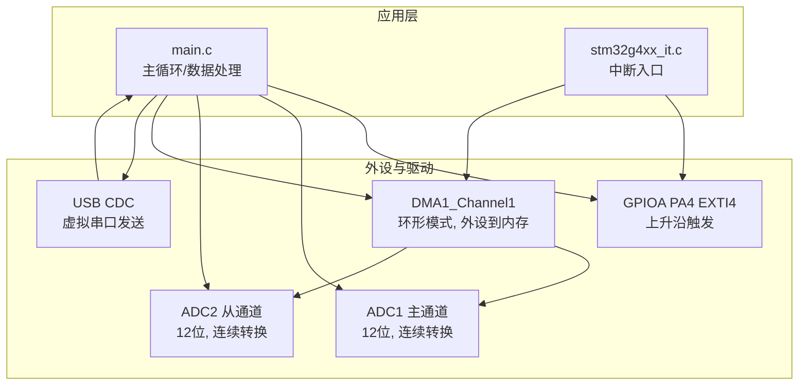
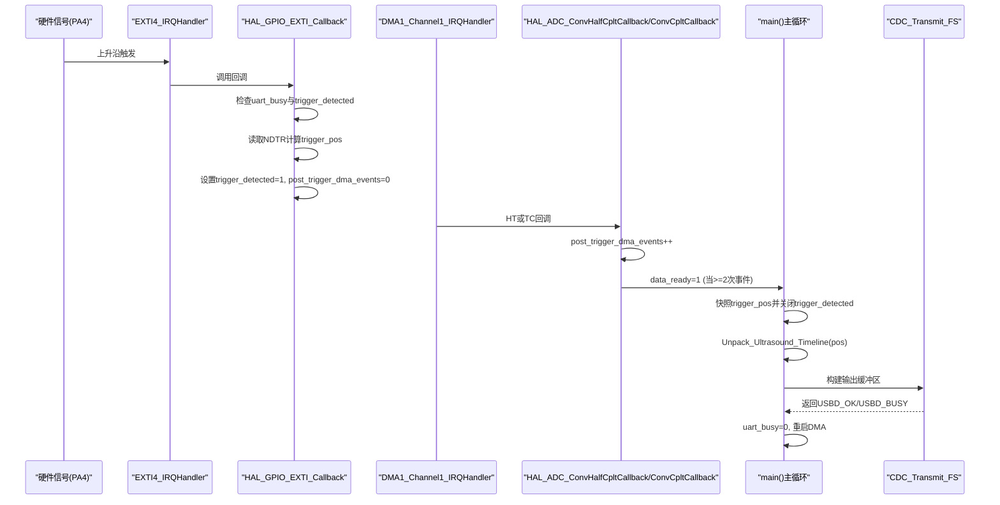
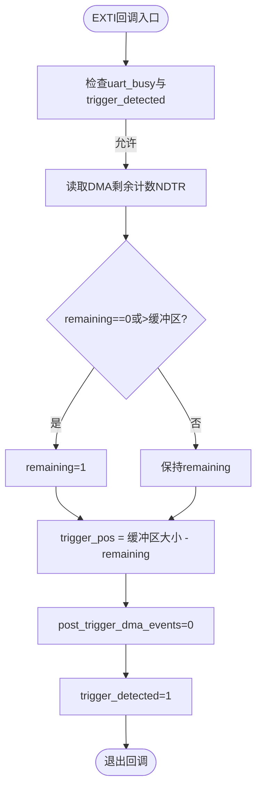
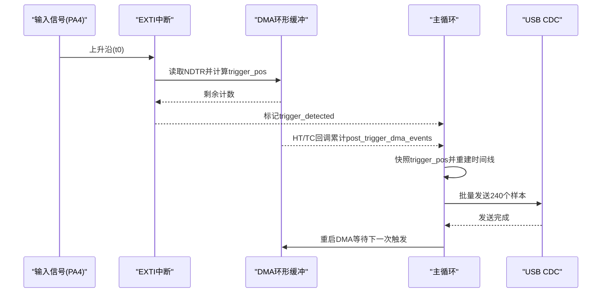
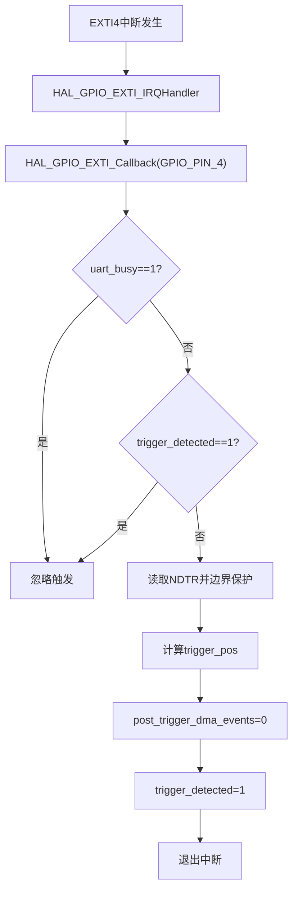
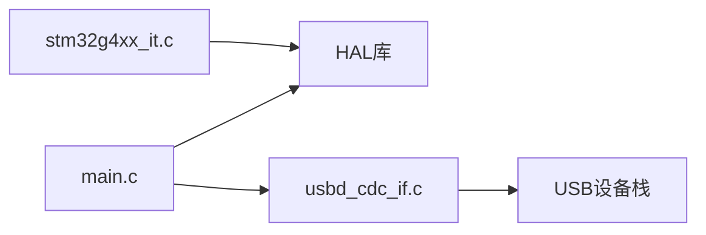

# 触发检测系统

<cite>
**本文引用的文件**   
- [Core/Src/main.c](file://Core/Src/main.c)
- [Core/Inc/main.h](file://Core/Inc/main.h)
- [Core/Src/stm32g4xx_it.c](file://Core/Src/stm32g4xx_it.c)
- [Core/Inc/stm32g4xx_it.h](file://Core/Inc/stm32g4xx_it.h)
- [USB_Device/App/usbd_cdc_if.c](file://USB_Device/App/usbd_cdc_if.c)
- [USB_Device/App/usbd_cdc_if.h](file://USB_Device/App/usbd_cdc_if.h)
</cite>

## 目录
1. [简介](#简介)
2. [项目结构](#项目结构)
3. [核心组件](#核心组件)
4. [架构总览](#架构总览)
5. [详细组件分析](#详细组件分析)
6. [依赖关系分析](#依赖关系分析)
7. [性能与精度分析](#性能与精度分析)
8. [故障排查指南](#故障排查指南)
9. [结论](#结论)
10. [附录](#附录)

## 简介
本技术文档围绕基于STM32G4的EXTI外部中断触发检测系统，系统性阐述PA4引脚的外部中断配置（上升沿触发、中断优先级）、DMA环形缓冲与ADC双通道交错采集的数据流、触发位置精确定位算法（DMA计数器读取与环形索引计算）、防抖与去重机制（uart_busy标志位与重复触发保护）、亚微秒级触发精度的实现与时序分析，以及预触发与后触发数据的记录策略（80个预触发样本与160个后触发样本）。文档同时提供触发时序图与中断处理流程图，帮助读者快速理解并掌握该系统的整体设计与关键细节。

## 项目结构
本项目采用分层组织方式：
- Core层：应用主循环、外设初始化、中断服务程序与回调、数据打包与传输逻辑
- USB设备层：CDC虚拟串口接口，用于将采样数据以文本形式发送到上位机
- Drivers/CMSIS与HAL库：由CubeMX生成，提供底层驱动与寄存器访问封装

图表来源
- [Core/Src/main.c:488-520](file://Core/Src/main.c#L488-L520)
- [Core/Src/main.c:344-464](file://Core/Src/main.c#L344-L464)
- [Core/Src/main.c:469-481](file://Core/Src/main.c#L469-L481)
- [USB_Device/App/usbd_cdc_if.c:281-293](file://USB_Device/App/usbd_cdc_if.c#L281-L293)

章节来源
- [Core/Src/main.c:488-520](file://Core/Src/main.c#L488-L520)
- [Core/Src/main.c:344-464](file://Core/Src/main.c#L344-L464)
- [Core/Src/main.c:469-481](file://Core/Src/main.c#L469-L481)
- [USB_Device/App/usbd_cdc_if.c:281-293](file://USB_Device/App/usbd_cdc_if.c#L281-L293)

## 核心组件
- EXTI外部中断（PA4）：配置为上升沿触发，中断优先级设置为最高，确保在UART传输期间也能及时响应触发事件。
- DMA环形缓冲：DMA1_Channel1工作在环形模式，将ADC1/ADC2交错结果写入uint32_t数组，低16位为ADC1，高16位为ADC2。
- ADC双通道交错模式：ADC1为主，ADC2为从，使用INTERL模式，单次转换，连续模式，DMA持续请求，保证高速稳定采集。
- 触发定位与去抖：EXTI回调中通过DMA剩余计数NDTR计算触发点索引；使用trigger_detected与uart_busy双重保护防止重复触发与回显干扰。
- 后触发完成判定：通过HT/TC两次DMA回调累计post_trigger_dma_events，达到阈值后停止DMA并置data_ready通知主循环处理。
- 数据解包与传输：主循环快照trigger_pos，按环形起始索引重建线性时间线，并通过USB CDC批量发送。

章节来源
- [Core/Src/main.c:488-520](file://Core/Src/main.c#L488-L520)
- [Core/Src/main.c:469-481](file://Core/Src/main.c#L469-L481)
- [Core/Src/main.c:344-464](file://Core/Src/main.c#L344-L464)
- [Core/Src/main.c:91-131](file://Core/Src/main.c#L91-L131)
- [Core/Src/main.c:156-171](file://Core/Src/main.c#L156-L171)
- [Core/Src/main.c:178-212](file://Core/Src/main.c#L178-L212)

## 架构总览
下图展示了从硬件触发到数据输出的完整流程，包括EXTI中断、DMA回调、主循环处理与USB CDC传输。

图表来源
- [Core/Src/stm32g4xx_it.c:205-214](file://Core/Src/stm32g4xx_it.c#L205-L214)
- [Core/Src/main.c:91-131](file://Core/Src/main.c#L91-L131)
- [Core/Src/main.c:136-149](file://Core/Src/main.c#L136-L149)
- [Core/Src/main.c:156-171](file://Core/Src/main.c#L156-L171)
- [Core/Src/main.c:178-212](file://Core/Src/main.c#L178-L212)
- [USB_Device/App/usbd_cdc_if.c:281-293](file://USB_Device/App/usbd_cdc_if.c#L281-L293)

## 详细组件分析

### EXTI外部中断配置（PA4，上升沿触发，优先级）
- 引脚与模式：PA4配置为GPIO_MODE_IT_RISING，无上下拉，作为外部中断源。
- NVIC优先级：EXTI4_IRQn优先级设为0（最高），确保在UART传输等耗时操作时仍能抢占执行。
- 中断入口：EXTI4_IRQHandler调用HAL_GPIO_EXTI_IRQHandler，最终进入用户回调。

章节来源
- [Core/Src/main.c:488-520](file://Core/Src/main.c#L488-L520)
- [Core/Src/stm32g4xx_it.c:205-214](file://Core/Src/stm32g4xx_it.c#L205-L214)

### 触发位置精确定位算法（DMA计数器与环形索引）
- DMA环形缓冲大小：CIRCULAR_BUFFER_SIZE=120（uint32_t），每个元素包含一次ADC1+ADC2交错结果。
- 触发时刻定位：在EXTI回调中读取__HAL_DMA_GET_COUNTER(&hdma_adc1)得到剩余待写项数remaining，边界保护后计算trigger_pos = CIRCULAR_BUFFER_SIZE - remaining。
- 环形起始索引：Unpack_Ultrasound_Timeline根据trigger_pos与PRE_TRIGGER_SAMPLES计算start_idx，按环形顺序遍历adc_raw_buffer，依次提取低16位（ADC1）与高16位（ADC2）填充decoded_signal。

图表来源
- [Core/Src/main.c:91-113](file://Core/Src/main.c#L91-L113)
- [Core/Src/main.c:156-171](file://Core/Src/main.c#L156-L171)

章节来源
- [Core/Src/main.c:91-113](file://Core/Src/main.c#L91-L113)
- [Core/Src/main.c:156-171](file://Core/Src/main.c#L156-L171)

### 防抖与去重机制（uart_busy与重复触发保护）
- 回显抑制：uart_busy在发送数据期间置位，EXTI回调检测到该标志直接返回，避免USB回显导致的误触发。
- 重复触发保护：trigger_detected在首次触发后置位，后续EXTI边沿将被忽略，直到主循环处理完成后复位。
- 后触发完成判定：post_trigger_dma_events在HT/TC回调中累加，达到2次（半传输+全传输）后停止DMA并置data_ready，确保至少采集到足够的后触发样本。

章节来源
- [Core/Src/main.c:91-131](file://Core/Src/main.c#L91-L131)
- [Core/Src/main.c:136-149](file://Core/Src/main.c#L136-L149)
- [Core/Src/main.c:178-212](file://Core/Src/main.c#L178-L212)

### 预触发与后触发数据记录策略（80预触发，160后触发）
- 采样率与窗口：代码注释表明8 MSPS下，80个预触发样本对应约10 us，160个后触发样本对应约20 us。
- 缓冲区与解码：CIRCULAR_BUFFER_SIZE=120（uint32_t），解码后TOTAL_SAMPLES=240（uint16_t），每字包含一次ADC1与一次ADC2交错结果。
- 起始索引计算：start_idx基于trigger_pos与PRE_TRIGGER_SAMPLES/2进行环形偏移，确保以触发点为中心前后覆盖所需样本数量。

章节来源
- [Core/Src/main.c:52-70](file://Core/Src/main.c#L52-L70)
- [Core/Src/main.c:156-171](file://Core/Src/main.c#L156-L171)

### 亚微秒级触发精度与时序分析
- 中断路径延迟：PA4上升沿→EXTI4 IRQ→HAL_GPIO_EXTI_Callback→读取NDTR→计算trigger_pos，路径短且仅做必要操作，满足亚微秒级定位需求。
- DMA计数准确性：NDTR反映DMA控制器当前剩余待写项数，结合环形缓冲大小可精确反推触发点在缓冲中的索引。
- 时钟与采样：ADC1/ADC2使用PCLK分频与最小采样时间，配合DMA环形模式，降低CPU干预，提高实时性。
- 注意：实际触发抖动受前端信号整形、PCB走线与噪声影响，建议在前端加入比较器或施密特触发器以提升稳定性。

章节来源
- [Core/Src/main.c:488-520](file://Core/Src/main.c#L488-L520)
- [Core/Src/main.c:344-464](file://Core/Src/main.c#L344-L464)
- [Core/Src/main.c:91-113](file://Core/Src/main.c#L91-L113)

### 触发时序图（概念示意）

图表来源
- [Core/Src/main.c:91-131](file://Core/Src/main.c#L91-L131)
- [Core/Src/main.c:136-149](file://Core/Src/main.c#L136-L149)
- [Core/Src/main.c:156-171](file://Core/Src/main.c#L156-L171)
- [Core/Src/main.c:178-212](file://Core/Src/main.c#L178-L212)

### 中断处理流程图（概念示意）

图表来源
- [Core/Src/main.c:91-113](file://Core/Src/main.c#L91-L113)

## 依赖关系分析
- main.c依赖：
  - HAL库：GPIO、ADC、DMA、NVIC、延时等
  - USB CDC：CDC_Transmit_FS用于数据发送
- stm32g4xx_it.c依赖：
  - HAL中断框架：HAL_GPIO_EXTI_IRQHandler、HAL_DMA_IRQHandler
- USB CDC层：
  - 提供CDC_Transmit_FS接口，内部维护TxState避免并发冲突

图表来源
- [Core/Src/main.c:488-520](file://Core/Src/main.c#L488-L520)
- [Core/Src/main.c:344-464](file://Core/Src/main.c#L344-L464)
- [Core/Src/main.c:469-481](file://Core/Src/main.c#L469-L481)
- [USB_Device/App/usbd_cdc_if.c:281-293](file://USB_Device/App/usbd_cdc_if.c#L281-L293)

章节来源
- [Core/Src/main.c:488-520](file://Core/Src/main.c#L488-L520)
- [Core/Src/main.c:344-464](file://Core/Src/main.c#L344-L464)
- [Core/Src/main.c:469-481](file://Core/Src/main.c#L469-L481)
- [USB_Device/App/usbd_cdc_if.c:281-293](file://USB_Device/App/usbd_cdc_if.c#L281-L293)

## 性能与精度分析
- 中断响应时间：EXTI4优先级最高，回调内仅做NDTR读取与索引计算，路径极短，有利于亚微秒级触发定位。
- DMA吞吐：环形模式+双通道交错，减少CPU参与，提升采样稳定性与实时性。
- 数据完整性：通过HT/TC两次事件判定后触发完成，避免过早停止导致样本不足。
- 传输瓶颈：CDC_Transmit_FS可能返回USBD_BUSY，主循环采用轮询重试，需关注上位机接收能力与USB带宽。
- 优化建议：
  - 前端信号整形（比较器/施密特）降低抖动
  - 调整采样时间与PCLK分频平衡速度与噪声
  - 若需要更高精度，可在EXTI回调中记录更细粒度的时间戳（如SysTick或定时器捕获）

[本节为通用性能讨论，不直接分析具体文件]

## 故障排查指南
- 现象：触发无效或重复触发
  - 检查uart_busy是否长时间置位导致屏蔽触发
  - 确认trigger_detected未在异常路径未复位
- 现象：后触发样本不足
  - 检查HT/TC回调是否被正确调用
  - 确认post_trigger_dma_events计数逻辑未被其他中断打断
- 现象：数据错位或乱码
  - 核对环形起始索引计算与缓冲区大小一致性
  - 确认解码时低16位与高16位分别对应ADC1与ADC2
- 现象：USB发送阻塞
  - 检查CDC_Transmit_FS返回值，必要时增加超时与错误处理
  - 控制发送频率，避免上位机缓冲区溢出

章节来源
- [Core/Src/main.c:91-131](file://Core/Src/main.c#L91-L131)
- [Core/Src/main.c:136-149](file://Core/Src/main.c#L136-L149)
- [Core/Src/main.c:178-212](file://Core/Src/main.c#L178-L212)
- [USB_Device/App/usbd_cdc_if.c:281-293](file://USB_Device/App/usbd_cdc_if.c#L281-L293)

## 结论
该系统通过PA4的EXTI上升沿触发与DMA环形缓冲相结合，实现了高精度的触发检测与数据采集。利用NDTR与环形索引计算，系统在亚微秒级范围内准确定位触发点；通过uart_busy与trigger_detected的双重保护，有效抑制了回显与重复触发问题；HT/TC事件累计确保了后触发样本的完整性。整体设计简洁高效，适合超声或其他高速瞬态信号的捕捉与分析。

[本节为总结性内容，不直接分析具体文件]

## 附录
- 关键常量与变量说明：
  - CIRCULAR_BUFFER_SIZE：DMA环形缓冲大小（uint32_t）
  - TOTAL_SAMPLES：解码后的总样本数（uint16_t）
  - PRE_TRIGGER_SAMPLES/POST_TRIGGER_SAMPLES：预触发与后触发样本数量
  - adc_raw_buffer：DMA目标缓冲（交错存储）
  - decoded_signal：线性时间线缓冲（逐样本存储）
  - trigger_pos：触发点在环形缓冲中的索引
  - post_trigger_dma_events：后触发DMA事件计数
  - uart_busy：UART发送期间屏蔽触发标志
  - data_ready：主循环处理就绪标志

章节来源
- [Core/Src/main.c:52-70](file://Core/Src/main.c#L52-L70)
- [Core/Src/main.c:156-171](file://Core/Src/main.c#L156-L171)
- [Core/Src/main.c:178-212](file://Core/Src/main.c#L178-L212)