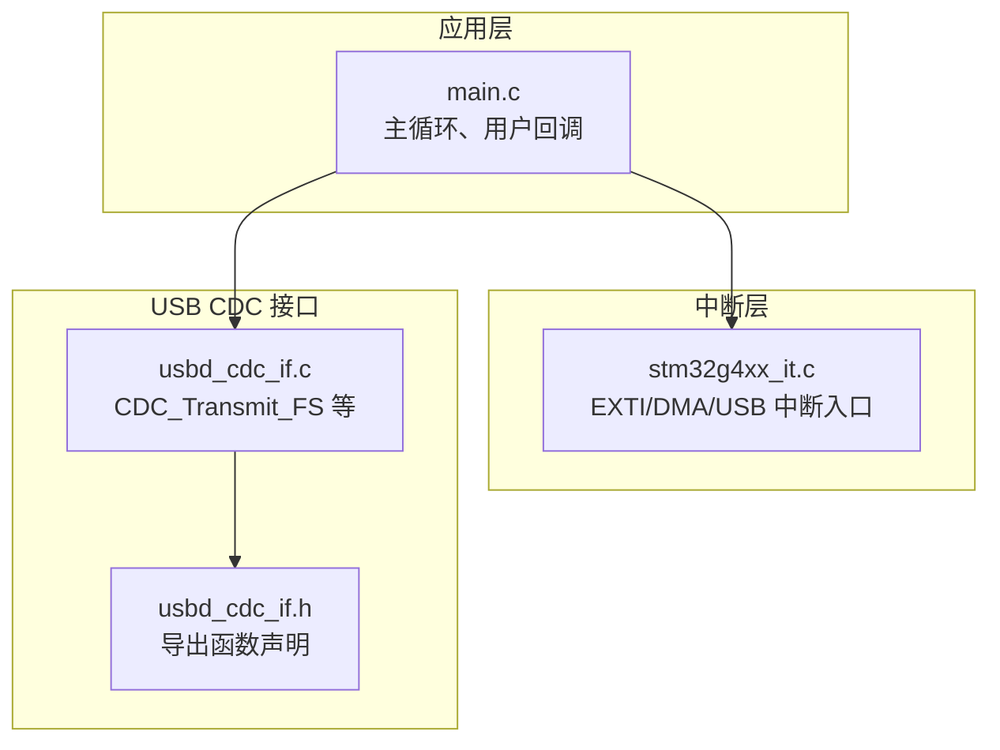
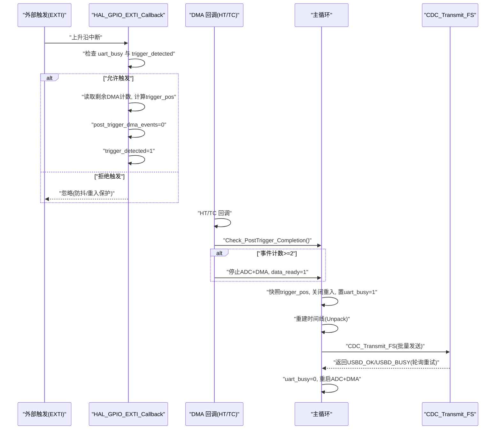
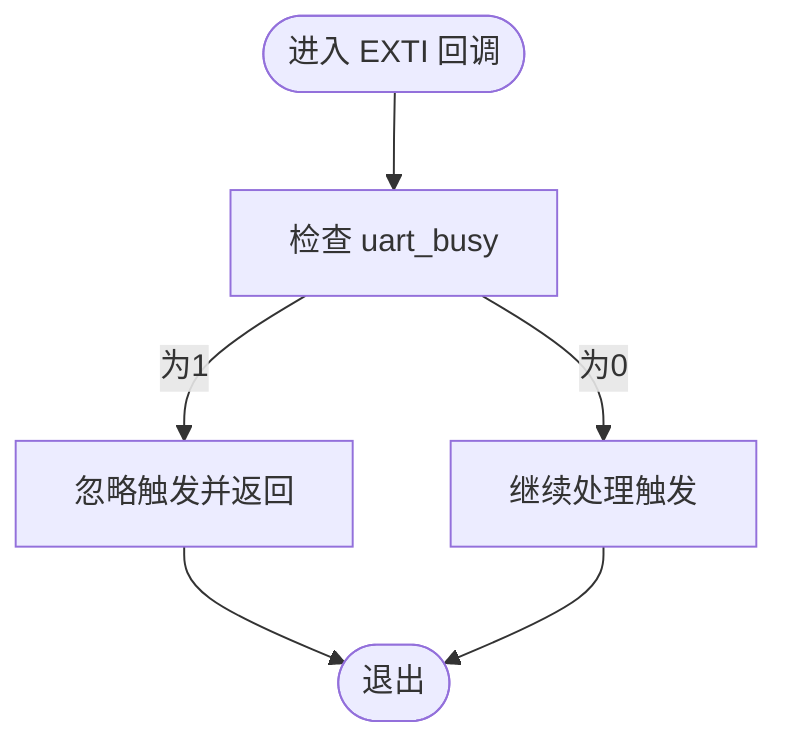
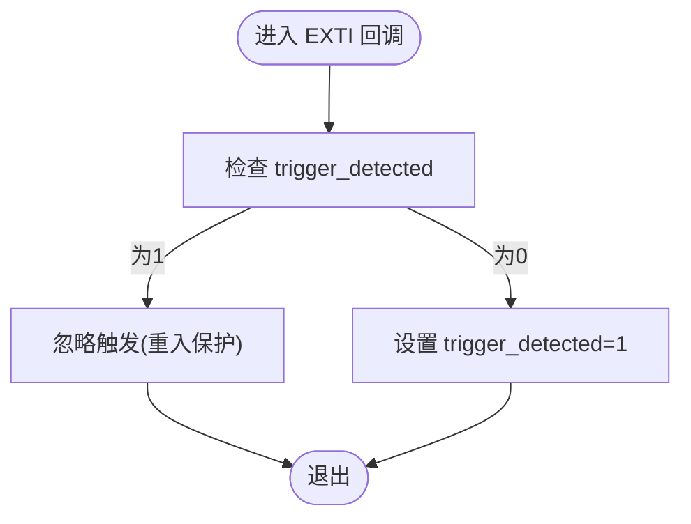
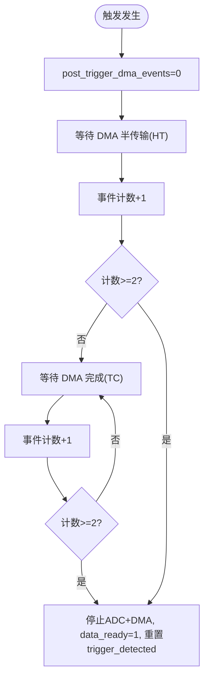
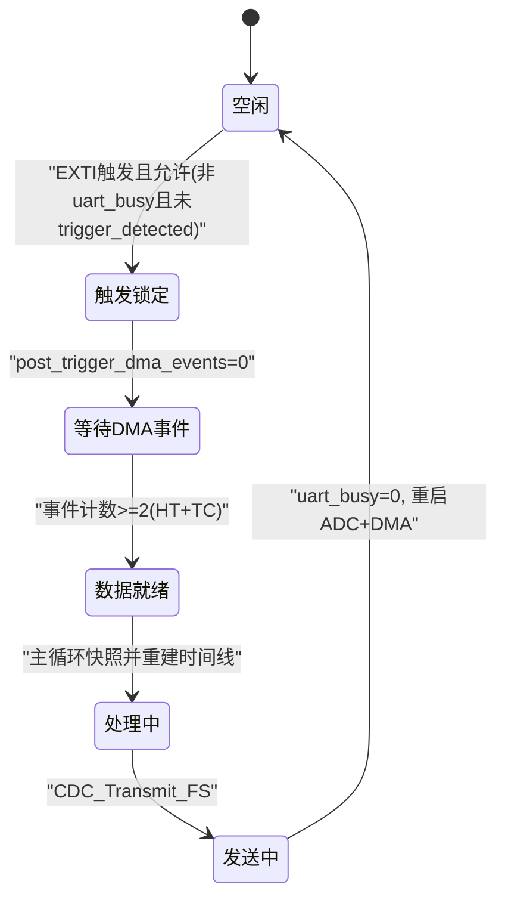
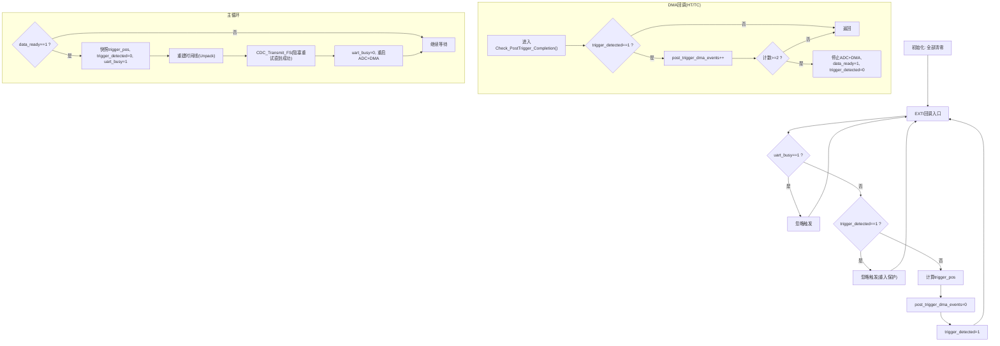
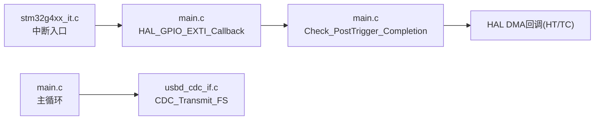

# 防抖和重入保护机制

<cite>
**本文引用的文件**   
- [Core/Src/main.c](file://Core/Src/main.c)
- [Core/Inc/main.h](file://Core/Inc/main.h)
- [Core/Src/stm32g4xx_it.c](file://Core/Src/stm32g4xx_it.c)
- [USB_Device/App/usbd_cdc_if.c](file://USB_Device/App/usbd_cdc_if.c)
- [USB_Device/App/usbd_cdc_if.h](file://USB_Device/App/usbd_cdc_if.h)
</cite>

## 目录
1. [简介](#简介)
2. [项目结构](#项目结构)
3. [核心组件](#核心组件)
4. [架构总览](#架构总览)
5. [详细组件分析](#详细组件分析)
6. [依赖关系分析](#依赖关系分析)
7. [性能考虑](#性能考虑)
8. [故障排查指南](#故障排查指南)
9. [结论](#结论)

## 简介
本技术文档聚焦于触发检测系统的“防抖与重入保护”机制，围绕以下关键点展开：
- uart_busy 标志位的防抖（回声抑制）机制：在 USB CDC 数据传输期间忽略新的触发信号，避免回显干扰。
- trigger_detected 标志位的重入保护：防止同一触发事件被重复处理。
- post_trigger_dma_events 事件计数器：等待至少两个 DMA 事件（半传输 HT + 传输完成 TC），确保采集到足够的后触发数据。
- 提供状态转换图与标志位管理流程图，并给出常见问题诊断方法与调试技巧。

## 项目结构
该工程基于 STM32G4 系列，采用 HAL 库与 USB Device CDC 类实现数据采集与上位机通信。关键路径如下：
- 外设驱动与中断入口：stm32g4xx_it.c
- 应用主循环与用户回调：main.c
- USB CDC 接口层：usbd_cdc_if.c / usbd_cdc_if.h

图表来源
- [Core/Src/main.c:219-290](file://Core/Src/main.c#L219-L290)
- [Core/Src/stm32g4xx_it.c:205-242](file://Core/Src/stm32g4xx_it.c#L205-L242)
- [USB_Device/App/usbd_cdc_if.c:281-293](file://USB_Device/App/usbd_cdc_if.c#L281-L293)
- [USB_Device/App/usbd_cdc_if.h:109](file://USB_Device/App/usbd_cdc_if.h#L109)

章节来源
- [Core/Src/main.c:219-290](file://Core/Src/main.c#L219-L290)
- [Core/Src/stm32g4xx_it.c:205-242](file://Core/Src/stm32g4xx_it.c#L205-L242)
- [USB_Device/App/usbd_cdc_if.c:281-293](file://USB_Device/App/usbd_cdc_if.c#L281-L293)
- [USB_Device/App/usbd_cdc_if.h:109](file://USB_Device/App/usbd_cdc_if.h#L109)

## 核心组件
- 全局 volatile 标志位与计数
  - uart_busy：用于屏蔽 EXTI 触发，避免在 USB CDC 发送期间产生回声干扰。
  - trigger_detected：用于重入保护，确保一次触发只处理一次。
  - post_trigger_dma_events：记录触发后的 DMA 事件数，用于判定是否已收集足够后触发数据。
- 关键回调与流程
  - EXTI 上升沿回调：捕获触发时刻的 DMA 位置，设置重入保护与事件计数。
  - DMA 半传输/完成回调：累计事件，达到阈值后停止 ADC+DMA 并置数据就绪。
  - 主循环：快照触发位置、重建时间线、通过 USB CDC 发送数据、解锁并重启采集。

章节来源
- [Core/Src/main.c:65-70](file://Core/Src/main.c#L65-L70)
- [Core/Src/main.c:91-113](file://Core/Src/main.c#L91-L113)
- [Core/Src/main.c:119-131](file://Core/Src/main.c#L119-L131)
- [Core/Src/main.c:136-149](file://Core/Src/main.c#L136-L149)
- [Core/Src/main.c:264-289](file://Core/Src/main.c#L264-L289)

## 架构总览
下图展示了从外部触发到数据输出的完整时序，以及防抖与重入保护的介入点。

图表来源
- [Core/Src/main.c:91-113](file://Core/Src/main.c#L91-L113)
- [Core/Src/main.c:119-131](file://Core/Src/main.c#L119-L131)
- [Core/Src/main.c:136-149](file://Core/Src/main.c#L136-L149)
- [Core/Src/main.c:264-289](file://Core/Src/main.c#L264-L289)
- [USB_Device/App/usbd_cdc_if.c:281-293](file://USB_Device/App/usbd_cdc_if.c#L281-L293)

## 详细组件分析

### 防抖机制：uart_busy 标志位
- 目的
  - 在 USB CDC 发送期间屏蔽新的触发，避免将自身发出的数据作为“触发源”造成回声干扰。
- 实现要点
  - EXTI 回调中首先判断 uart_busy，若为真则直接返回，忽略本次触发。
  - 主循环在准备发送前置位 uart_busy，发送完成后清零。
- 效果
  - 有效隔离“自发自收”的回声路径，提升系统稳定性。

图表来源
- [Core/Src/main.c:91-113](file://Core/Src/main.c#L91-L113)
- [Core/Src/main.c:264-289](file://Core/Src/main.c#L264-L289)

章节来源
- [Core/Src/main.c:91-113](file://Core/Src/main.c#L91-L113)
- [Core/Src/main.c:264-289](file://Core/Src/main.c#L264-L289)

### 重入保护：trigger_detected 标志位
- 目的
  - 防止同一触发事件被多次处理，避免重复采集与重复输出。
- 实现要点
  - EXTI 回调中在设置 trigger_detected 之前再次检查该标志，若已置位则忽略后续边沿。
  - 主循环在处理完一次数据后，会复位相关标志，允许下一次触发。
- 效果
  - 保证每个触发周期仅进行一次完整的采集与输出流程。

图表来源
- [Core/Src/main.c:91-113](file://Core/Src/main.c#L91-L113)
- [Core/Src/main.c:264-289](file://Core/Src/main.c#L264-L289)

章节来源
- [Core/Src/main.c:91-113](file://Core/Src/main.c#L91-L113)
- [Core/Src/main.c:264-289](file://Core/Src/main.c#L264-L289)

### 后触发数据保障：post_trigger_dma_events 计数器
- 目的
  - 确保在触发后能采集到足够的后触发数据。由于环形缓冲区的特性，需要等待至少两次 DMA 事件（半传输 HT + 传输完成 TC）来覆盖目标窗口。
- 实现要点
  - EXTI 回调中将计数器清零。
  - DMA 半传输与完成回调均调用统一逻辑，每次递增计数器。
  - 当计数达到 2 时，停止 ADC+DMA，置 data_ready，并复位 trigger_detected，交由主循环处理。
- 为什么是 2
  - 半传输事件表明已写入一半缓冲区，传输完成事件表明已写满一轮；两者合计可确保包含触发点之后的完整数据段。

图表来源
- [Core/Src/main.c:119-131](file://Core/Src/main.c#L119-L131)
- [Core/Src/main.c:136-149](file://Core/Src/main.c#L136-L149)

章节来源
- [Core/Src/main.c:119-131](file://Core/Src/main.c#L119-L131)
- [Core/Src/main.c:136-149](file://Core/Src/main.c#L136-L149)

### 状态转换图：触发与数据处理

图表来源
- [Core/Src/main.c:91-113](file://Core/Src/main.c#L91-L113)
- [Core/Src/main.c:119-131](file://Core/Src/main.c#L119-L131)
- [Core/Src/main.c:264-289](file://Core/Src/main.c#L264-L289)
- [USB_Device/App/usbd_cdc_if.c:281-293](file://USB_Device/App/usbd_cdc_if.c#L281-L293)

### 标志位管理流程图：uart_busy、trigger_detected、post_trigger_dma_events

图表来源
- [Core/Src/main.c:91-113](file://Core/Src/main.c#L91-L113)
- [Core/Src/main.c:119-131](file://Core/Src/main.c#L119-L131)
- [Core/Src/main.c:136-149](file://Core/Src/main.c#L136-L149)
- [Core/Src/main.c:264-289](file://Core/Src/main.c#L264-L289)
- [USB_Device/App/usbd_cdc_if.c:281-293](file://USB_Device/App/usbd_cdc_if.c#L281-L293)

## 依赖关系分析
- main.c 依赖 stm32g4xx_it.c 的中断入口，后者转发至 HAL 回调。
- main.c 通过 CDC_Transmit_FS 调用 USB CDC 接口进行数据发送。
- usb_device 层负责端点缓冲与传输状态，主循环通过轮询返回值处理忙状态。

图表来源
- [Core/Src/stm32g4xx_it.c:205-242](file://Core/Src/stm32g4xx_it.c#L205-L242)
- [Core/Src/main.c:91-113](file://Core/Src/main.c#L91-L113)
- [Core/Src/main.c:119-131](file://Core/Src/main.c#L119-L131)
- [USB_Device/App/usbd_cdc_if.c:281-293](file://USB_Device/App/usbd_cdc_if.c#L281-L293)

章节来源
- [Core/Src/stm32g4xx_it.c:205-242](file://Core/Src/stm32g4xx_it.c#L205-L242)
- [Core/Src/main.c:91-113](file://Core/Src/main.c#L91-L113)
- [Core/Src/main.c:119-131](file://Core/Src/main.c#L119-L131)
- [USB_Device/App/usbd_cdc_if.c:281-293](file://USB_Device/App/usbd_cdc_if.c#L281-L293)

## 性能考虑
- 中断上下文最小化：EXTI 回调仅做快速标记与位置捕获，避免复杂运算。
- DMA 双事件保障：利用 HT+TC 两事件确保后触发数据完整性，减少主循环判断复杂度。
- 发送策略：主循环构建完整输出缓冲后一次性发送，降低频繁小包开销；对 USBD_BUSY 进行轮询重试，保证可靠性。
- 临界区控制：使用 uart_busy 与 trigger_detected 组合，避免并发竞争导致的重复或遗漏处理。

[本节为通用性能建议，不直接分析具体文件]

## 故障排查指南
- 现象：触发无响应
  - 检查 EXTI 引脚配置与 NVIC 优先级是否正确。
  - 确认 uart_busy 未被意外置位导致屏蔽触发。
  - 验证 trigger_detected 是否在上一周期正确复位。
- 现象：数据不完整或错位
  - 检查 post_trigger_dma_events 是否稳定达到 2；若未达到，可能 DMA 回调未触发或中断被抢占。
  - 核对环形缓冲区大小与采样率匹配，确保前后触发窗口足够。
- 现象：USB 发送卡顿或丢包
  - 观察 CDC_Transmit_FS 返回值是否为 USBD_BUSY；必要时增加重试间隔或优化主机端接收。
  - 确认 USB 设备枚举与 CDC 端口正常打开。
- 调试技巧
  - 在 EXTI 回调与 DMA 回调处添加 LED 翻转或断点，验证触发与事件到达顺序。
  - 在主循环处理前后打印关键标志位值，辅助定位状态异常。
  - 使用逻辑分析仪抓取触发线与 PC13 LED 波形，对比软件状态。

章节来源
- [Core/Src/main.c:91-113](file://Core/Src/main.c#L91-L113)
- [Core/Src/main.c:119-131](file://Core/Src/main.c#L119-L131)
- [Core/Src/main.c:264-289](file://Core/Src/main.c#L264-L289)
- [USB_Device/App/usbd_cdc_if.c:281-293](file://USB_Device/App/usbd_cdc_if.c#L281-L293)

## 结论
本系统通过 uart_busy 与 trigger_detected 的组合实现了可靠的防抖与重入保护，结合 post_trigger_dma_events 的双事件计数策略，确保了触发后数据的完整性与一致性。整体设计在中断上下文中保持轻量，在主循环中完成数据重建与发送，兼顾实时性与可靠性。建议在扩展功能时继续保持上述标志位语义与状态流转约定，以避免引入竞态条件与数据不一致问题。