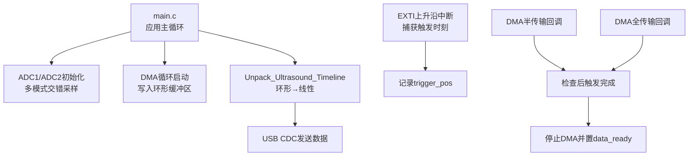
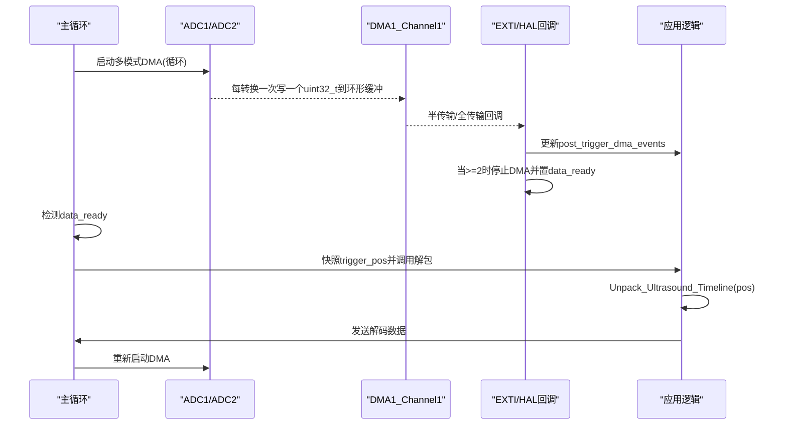
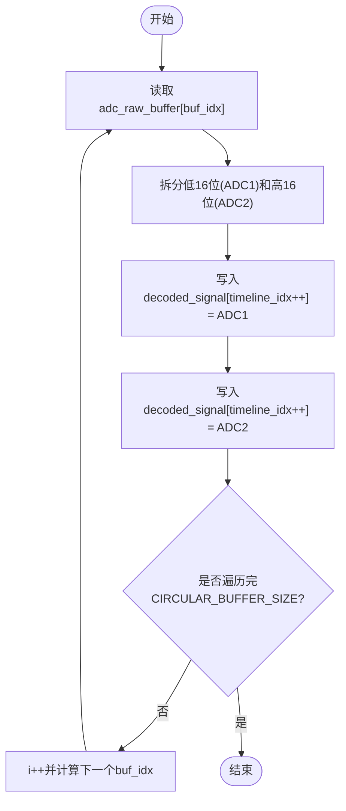
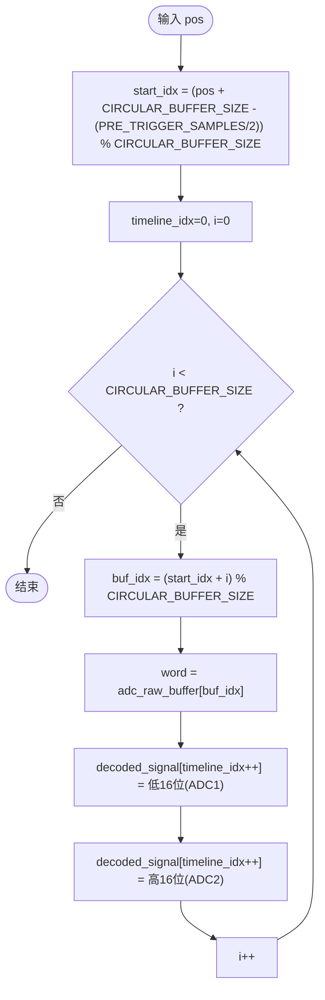
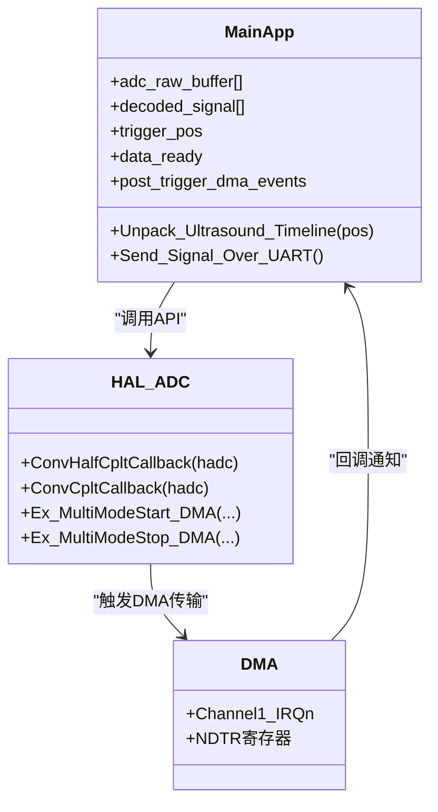

# 预触发和后触发缓冲策略

<cite>
**本文引用的文件**
- [Core/Src/main.c](file://Core/Src/main.c)
- [Drivers/STM32G4xx_HAL_Driver/Inc/stm32g4xx_hal_adc.h](file://Drivers/STM32G4xx_HAL_Driver/Inc/stm32g4xx_hal_adc.h)
- [Drivers/STM32G4xx_HAL_Driver/Src/stm32g4xx_hal_adc.c](file://Drivers/STM32G4xx_HAL_Driver/Src/stm32g4xx_hal_adc.c)
</cite>

## 目录
1. [简介](#简介)
2. [项目结构](#项目结构)
3. [核心组件](#核心组件)
4. [架构总览](#架构总览)
5. [详细组件分析](#详细组件分析)
6. [依赖关系分析](#依赖关系分析)
7. [性能与优化建议](#性能与优化建议)
8. [故障排查指南](#故障排查指南)
9. [结论](#结论)

## 简介
本技术文档围绕基于STM32G4的ADC双通道交错采样与环形缓冲区管理，系统阐述“预触发+后触发”缓冲策略的设计原理与实现细节。重点包括：
- 80个预触发样本与160个后触发样本的配置依据
- 在8MSPS采样率下对应的时间窗口（10μs预触发、20μs后触发）
- 环形缓冲区的内存布局与数据组织方式
- adc_raw_buffer数组的双通道交错存储格式
- Unpack_Ultrasound_Timeline函数将环形缓冲区转换为线性时间序列的算法，含start_idx计算公式与索引映射关系
- 缓冲区管理的数据流图与内存布局示意图
- 缓冲区大小优化建议与性能调优方法

## 项目结构
本项目为基于STM32CubeMX生成的工程，应用逻辑集中在Core/Src/main.c中，包含：
- ADC1/ADC2双通道配置与DMA循环采集
- EXTI外部中断作为触发源
- DMA半传输/全传输回调用于后触发完成判定
- 环形缓冲区到线性时间序列的解包函数
- USB CDC串口输出解码后的信号

图表来源
- [Core/Src/main.c:249-287](file://Core/Src/main.c#L249-L287)
- [Core/Src/main.c:91-131](file://Core/Src/main.c#L91-L131)
- [Core/Src/main.c:156-171](file://Core/Src/main.c#L156-L171)

章节来源
- [Core/Src/main.c:249-287](file://Core/Src/main.c#L249-L287)
- [Core/Src/main.c:91-131](file://Core/Src/main.c#L91-L131)
- [Core/Src/main.c:156-171](file://Core/Src/main.c#L156-L171)

## 核心组件
- 环形缓冲区与常量定义
  - CIRCULAR_BUFFER_SIZE=120（uint32_t），TOTAL_SAMPLES=240（uint16_t）
  - PRE_TRIGGER_SAMPLES=80，POST_TRIGGER_SAMPLES=160
  - adc_raw_buffer[CIRCULAR_BUFFER_SIZE]：DMA目标，双通道交错打包
  - decoded_signal[TOTAL_SAMPLES]：解包后的线性时间序列
- 触发与状态标志
  - trigger_detected、trigger_pos、post_trigger_dma_events、data_ready、uart_busy
- 关键函数
  - HAL_GPIO_EXTI_Callback：捕获触发时刻，计算trigger_pos
  - Check_PostTrigger_Completion：统计HT/TC事件，达到阈值后停止DMA并置data_ready
  - Unpack_Ultrasound_Timeline：按start_idx从环形缓冲区读取，展开为线性时序
  - Send_Signal_Over_UART：将解码结果通过USB CDC发送

章节来源
- [Core/Src/main.c:52-69](file://Core/Src/main.c#L52-L69)
- [Core/Src/main.c:91-131](file://Core/Src/main.c#L91-L131)
- [Core/Src/main.c:156-171](file://Core/Src/main.c#L156-L171)
- [Core/Src/main.c:178-212](file://Core/Src/main.c#L178-L212)

## 架构总览
下图展示了从触发到数据输出的完整流程，以及各模块之间的交互关系。

图表来源
- [Core/Src/main.c:249-287](file://Core/Src/main.c#L249-L287)
- [Core/Src/main.c:91-131](file://Core/Src/main.c#L91-L131)
- [Core/Src/main.c:156-171](file://Core/Src/main.c#L156-L171)

## 详细组件分析

### 预触发与后触发样本数及时间窗口
- 采样率与时间窗口
  - 采样率为8MSPS，即每个采样间隔为125ns
  - 预触发样本数80 → 80×125ns = 10μs
  - 后触发样本数160 → 160×125ns = 20μs
- 环形缓冲区容量设计
  - CIRCULAR_BUFFER_SIZE=120（uint32_t），每个uint32_t包含两个16位样本（ADC1低16位、ADC2高16位）
  - 因此环形缓冲区可容纳240个单通道样本（交错排列）
  - 该容量足以覆盖80个预触发+160个后触发共240个样本的需求

章节来源
- [Core/Src/main.c:52-56](file://Core/Src/main.c#L52-L56)
- [Core/Src/main.c:58-62](file://Core/Src/main.c#L58-L62)

### 环形缓冲区内存布局与双通道交错格式
- 存储格式
  - adc_raw_buffer[i]为uint32_t
  - 低16位：ADC1样本；高16位：ADC2样本
  - 交错顺序：[ADC1[0], ADC2[0]], [ADC1[1], ADC2[1]], ...
- 线性化目标
  - decoded_signal[timeline_idx++]依次写入ADC1样本，随后写入ADC2样本
  - 最终decoded_signal长度为240，前120为ADC1，后120为ADC2（或按交错展开顺序）

图表来源
- [Core/Src/main.c:156-171](file://Core/Src/main.c#L156-L171)

章节来源
- [Core/Src/main.c:58-62](file://Core/Src/main.c#L58-L62)
- [Core/Src/main.c:156-171](file://Core/Src/main.c#L156-L171)

### 触发时刻捕获与trigger_pos计算
- 触发源
  - PA4引脚上升沿触发（EXTI4）
- 触发处理
  - 读取DMA剩余计数NDTR，计算当前写入位置
  - trigger_pos = (CIRCULAR_BUFFER_SIZE - remaining) % CIRCULAR_BUFFER_SIZE
  - 使用volatile标志确保与主循环安全通信
- 边界保护
  - 对remaining==0或越界进行保护，避免瞬态导致的误判

章节来源
- [Core/Src/main.c:91-113](file://Core/Src/main.c#L91-L113)

### 后触发完成判定与DMA停止
- 判定策略
  - 需要至少两次DMA事件（半传输HT + 全传输TC）以确保收集到足够的后触发样本
  - post_trigger_dma_events自增，达到≥2时停止DMA并置data_ready
- 回调入口
  - HAL_ADC_ConvHalfCpltCallback与HAL_ADC_ConvCpltCallback均调用Check_PostTrigger_Completion

章节来源
- [Core/Src/main.c:115-131](file://Core/Src/main.c#L115-L131)
- [Core/Src/main.c:136-149](file://Core/Src/main.c#L136-L149)

### 解包函数Unpack_Ultrasound_Timeline与start_idx计算
- start_idx计算公式
  - start_idx = (pos + CIRCULAR_BUFFER_SIZE - (PRE_TRIGGER_SAMPLES / 2)) % CIRCULAR_BUFFER_SIZE
  - 其中pos为trigger_pos，PRE_TRIGGER_SAMPLES=80，故偏移量为40
- 索引映射关系
  - 对于i从0到CIRCULAR_BUFFER_SIZE-1：
    - buf_idx = (start_idx + i) % CIRCULAR_BUFFER_SIZE
    - word = adc_raw_buffer[buf_idx]
    - decoded_signal[timeline_idx++] = (word & 0xFFFF)   // ADC1
    - decoded_signal[timeline_idx++] = ((word >> 16) & 0xFFFF) // ADC2
- 语义说明
  - 以trigger_pos为中心，向前取约一半预触发样本，向后取剩余样本，形成完整的时序片段
  - 由于双通道交错，实际线性序列会先写入ADC1再写入ADC2，保持交错顺序

图表来源
- [Core/Src/main.c:156-171](file://Core/Src/main.c#L156-L171)

章节来源
- [Core/Src/main.c:156-171](file://Core/Src/main.c#L156-L171)

### 主循环与数据发送流程
- 主循环检测data_ready
  - 快照trigger_pos并关闭重入保护
  - 调用解包函数生成线性时序
  - 通过USB CDC发送解码数据
  - 重启DMA等待下一次触发
- 发送实现
  - 将240个uint16_t样本转为十进制字符串并以换行分隔
  - 一次性发送以减少中断开销

章节来源
- [Core/Src/main.c:259-287](file://Core/Src/main.c#L259-L287)
- [Core/Src/main.c:178-212](file://Core/Src/main.c#L178-L212)

## 依赖关系分析
- 硬件与驱动层
  - ADC多模式交错采样（ADC_DUALMODE_INTERL）
  - DMA连续请求（DMAContinuousRequests=ENABLE）
  - HAL回调接口（ConvHalfCpltCallback、ConvCpltCallback）
- 应用层依赖
  - main.c中的常量与变量定义
  - 回调函数与主循环协作完成数据采集与处理

图表来源
- [Core/Src/main.c:249-287](file://Core/Src/main.c#L249-L287)
- [Drivers/STM32G4xx_HAL_Driver/Inc/stm32g4xx_hal_adc.h:483-504](file://Drivers/STM32G4xx_HAL_Driver/Inc/stm32g4xx_hal_adc.h#L483-L504)
- [Drivers/STM32G4xx_HAL_Driver/Src/stm32g4xx_hal_adc.c:3633-3685](file://Drivers/STM32G4xx_HAL_Driver/Src/stm32g4xx_hal_adc.c#L3633-L3685)

章节来源
- [Core/Src/main.c:249-287](file://Core/Src/main.c#L249-L287)
- [Drivers/STM32G4xx_HAL_Driver/Inc/stm32g4xx_hal_adc.h:483-504](file://Drivers/STM32G4xx_HAL_Driver/Inc/stm32g4xx_hal_adc.h#L483-L504)
- [Drivers/STM32G4xx_HAL_Driver/Src/stm32g4xx_hal_adc.c:3633-3685](file://Drivers/STM32G4xx_HAL_Driver/Src/stm32g4xx_hal_adc.c#L3633-L3685)

## 性能与优化建议
- 缓冲区大小优化
  - 当前CIRCULAR_BUFFER_SIZE=120（uint32_t）正好覆盖240个单通道样本，满足80预触发+160后触发需求
  - 若需更长的后触发窗口，可增加CIRCULAR_BUFFER_SIZE，但需权衡RAM占用与DMA带宽
- 解包效率
  - 解包过程为O(N)，N=CIRCULAR_BUFFER_SIZE，已是最小复杂度
  - 可通过SIMD或内联汇编加速位操作（如批量拆分高低16位）
- DMA与中断
  - 使用DMA半传输/全传输回调减少主循环轮询开销
  - 确保回调函数尽量短小，避免阻塞
- USB CDC发送
  - 采用一次性发送减少多次中断
  - 若带宽受限，可考虑压缩或二进制格式传输
- 时钟与采样率
  - 确认ADC时钟分频与PCLK配置，保证稳定8MSPS
  - 注意过采样与转换延迟对时序的影响

[本节为通用指导，不直接分析具体文件]

## 故障排查指南
- 触发丢失或重复触发
  - 检查EXTI优先级与去抖逻辑
  - 确认uart_busy标志防止UART期间误触发
- 后触发样本不足
  - 验证post_trigger_dma_events计数是否正确达到≥2
  - 检查DMA半传输/全传输回调是否被正确注册与调用
- 数据错位或乱序
  - 核对trigger_pos计算与start_idx公式
  - 确认adc_raw_buffer交错格式与解包顺序一致
- DMA异常
  - 查看HAL错误回调与错误码
  - 检查DMA通道优先级与NVIC配置

章节来源
- [Core/Src/main.c:91-131](file://Core/Src/main.c#L91-L131)
- [Drivers/STM32G4xx_HAL_Driver/Src/stm32g4xx_hal_adc.c:3633-3685](file://Drivers/STM32G4xx_HAL_Driver/Src/stm32g4xx_hal_adc.c#L3633-L3685)

## 结论
本方案通过双通道交错采样与环形缓冲区管理，实现了稳定的预触发与后触发数据采集。在8MSPS采样率下，80个预触发样本对应10μs，160个后触发样本对应20μs，满足超声信号捕捉需求。Unpack_Ultrasound_Timeline函数利用start_idx偏移与交错展开，将环形缓冲区高效转换为线性时间序列。结合DMA回调与主循环协作，整体流程简洁可靠。后续可根据应用场景调整缓冲区大小与传输格式，进一步优化性能与资源占用。