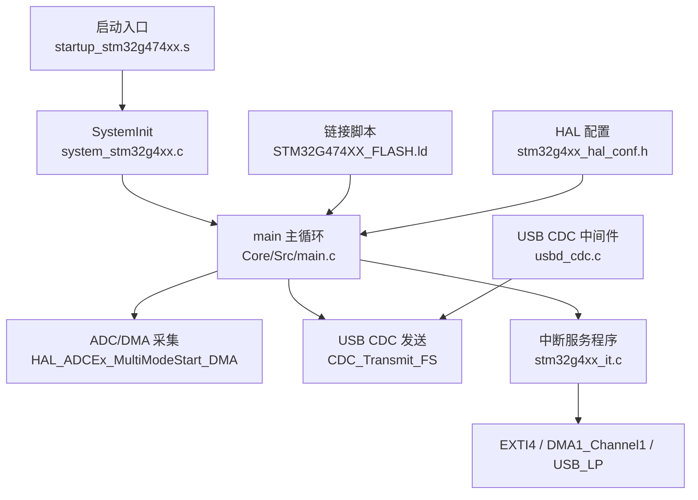
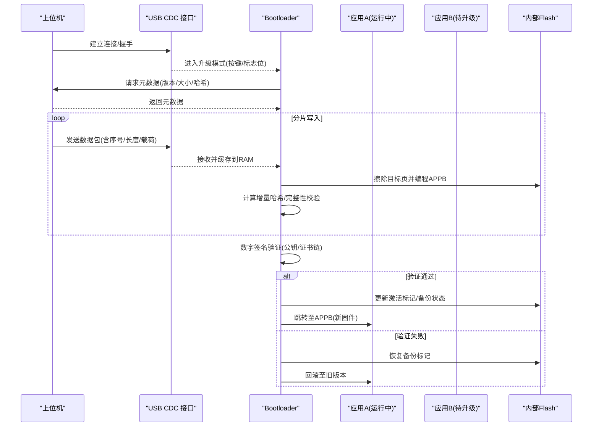
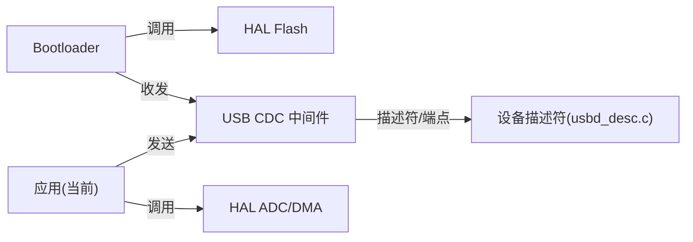

# 升级策略

<cite>
**本文引用的文件**   
- [Core/Src/main.c](file://Core/Src/main.c)
- [Core/Inc/main.h](file://Core/Inc/main.h)
- [Core/Src/stm32g4xx_it.c](file://Core/Src/stm32g4xx_it.c)
- [Core/Src/system_stm32g4xx.c](file://Core/Src/system_stm32g4xx.c)
- [startup_stm32g474xx.s](file://startup_stm32g474xx.s)
- [STM32G474XX_FLASH.ld](file://STM32G474XX_FLASH.ld)
- [Core/Inc/stm32g4xx_hal_conf.h](file://Core/Inc/stm32g4xx_hal_conf.h)
- [USB_Device/App/usbd_cdc_if.c](file://USB_Device/App/usbd_cdc_if.c)
- [USB_Device/App/usbd_desc.c](file://USB_Device/App/usbd_desc.c)
- [Middlewares/ST/STM32_USB_Device_Library/Class/CDC/Src/usbd_cdc.c](file://Middlewares/ST/STM32_USB_Device_Library/Class/CDC/Src/usbd_cdc.c)
- [Drivers/STM32G4xx_HAL_Driver/Inc/stm32g4xx_hal_flash.h](file://Drivers/STM32G4xx_HAL_Driver/Inc/stm32g4xx_hal_flash.h)
- [Drivers/STM32G4xx_HAL_Driver/Src/stm32g4xx_hal_flash_ex.c](file://Drivers/STM32G4xx_HAL_Driver/Src/stm32g4xx_hal_flash_ex.c)
</cite>

## 目录
1. [简介](#简介)
2. [项目结构](#项目结构)
3. [核心组件](#核心组件)
4. [架构总览](#架构总览)
5. [详细组件分析](#详细组件分析)
6. [依赖关系分析](#依赖关系分析)
7. [性能考虑](#性能考虑)
8. [故障排查指南](#故障排查指南)
9. [结论](#结论)
10. [附录：API与集成示例](#附录api与集成示例)

## 简介
本文件面向在 STM32G474 平台上实现固件在线升级（OTA）的完整策略与机制设计。当前仓库提供了 ADC+DMA+USB CDC 的数据采集与传输应用，尚未包含 Bootloader、分区管理、签名校验与回滚逻辑。本文基于现有代码基础，给出可落地的 OTA 总体方案、安全与可靠性设计、增量/全量策略、用户交互与进度反馈、测试验证流程以及生产批量升级工具建议，并明确需要新增的代码位置与接口约定。

## 项目结构
- 应用层：Core/Src/main.c 实现了双通道 ADC 采样、触发捕获、USB CDC 数据上报等；中断处理位于 Core/Src/stm32g4xx_it.c。
- 系统初始化：Core/Src/system_stm32g4xx.c 提供 SystemInit 与向量表重定位宏定义；启动入口由 startup_stm32g474xx.s 完成复位流程。
- 链接脚本：STM32G474XX_FLASH.ld 定义了 RAM/FLASH 布局与段分布，未划分 Bootloader 与应用分区。
- HAL 配置：Core/Inc/stm32g4xx_hal_conf.h 启用了 ADC、PCD(USB)、GPIO、DMA、RCC、FLASH 等模块。
- USB CDC：USB_Device/App 下为设备描述符与 CDC 接口封装；中间件 Middlewares/.../usbd_cdc.c 提供 CDC 类协议实现。

图表来源
- [startup_stm32g474xx.s:58-106](file://startup_stm32g474xx.s#L58-L106)
- [Core/Src/system_stm32g4xx.c:181-192](file://Core/Src/system_stm32g4xx.c#L181-L192)
- [Core/Src/main.c:219-290](file://Core/Src/main.c#L219-L290)
- [Core/Src/stm32g4xx_it.c:205-242](file://Core/Src/stm32g4xx_it.c#L205-L242)
- [STM32G474XX_FLASH.ld:56-60](file://STM32G474XX_FLASH.ld#L56-L60)
- [Core/Inc/stm32g4xx_hal_conf.h:37-76](file://Core/Inc/stm32g4xx_hal_conf.h#L37-L76)
- [Middlewares/ST/STM32_USB_Device_Library/Class/CDC/Src/usbd_cdc.c:325-433](file://Middlewares/ST/STM32_USB_Device_Library/Class/CDC/Src/usbd_cdc.c#L325-L433)

章节来源
- [Core/Src/main.c:219-290](file://Core/Src/main.c#L219-L290)
- [Core/Src/stm32g4xx_it.c:205-242](file://Core/Src/stm32g4xx_it.c#L205-L242)
- [Core/Src/system_stm32g4xx.c:181-192](file://Core/Src/system_stm32g4xx.c#L181-L192)
- [startup_stm32g474xx.s:58-106](file://startup_stm32g474xx.s#L58-L106)
- [STM32G474XX_FLASH.ld:56-60](file://STM32G474XX_FLASH.ld#L56-L60)
- [Core/Inc/stm32g4xx_hal_conf.h:37-76](file://Core/Inc/stm32g4xx_hal_conf.h#L37-L76)
- [Middlewares/ST/STM32_USB_Device_Library/Class/CDC/Src/usbd_cdc.c:325-433](file://Middlewares/ST/STM32_USB_Device_Library/Class/CDC/Src/usbd_cdc.c#L325-L433)

## 核心组件
- 启动与系统初始化
  - 复位后由启动文件设置栈指针、调用 SystemInit，随后进入 main。
  - SystemInit 支持可选的向量表重定位宏，便于后续 Bootloader 将应用向量表偏移。
- 应用主循环
  - 初始化时钟、外设、USB CDC，启动 ADC 多模式 DMA 环形缓冲。
  - 等待触发事件，重建时间线并通过 USB CDC 以文本形式发送。
- 中断与回调
  - EXTI4 作为触发源；DMA1 Channel1 用于 ADC 传输完成；USB_LP 处理 USB 低优先级中断。
- 链接与内存布局
  - 当前链接脚本仅定义单一 FLASH 区域，未划分 Bootloader 与应用区。

章节来源
- [startup_stm32g474xx.s:58-106](file://startup_stm32g474xx.s#L58-L106)
- [Core/Src/system_stm32g4xx.c:181-192](file://Core/Src/system_stm32g4xx.c#L181-L192)
- [Core/Src/main.c:219-290](file://Core/Src/main.c#L219-L290)
- [Core/Src/stm32g4xx_it.c:205-242](file://Core/Src/stm32g4xx_it.c#L205-L242)
- [STM32G474XX_FLASH.ld:56-60](file://STM32G474XX_FLASH.ld#L56-L60)

## 架构总览
为实现可靠的 OTA，建议在现有应用之上引入“Bootloader + 双应用分区”的架构，并通过 USB CDC 承载升级包下发。整体流程如下：

图表来源
- [Core/Src/main.c:219-290](file://Core/Src/main.c#L219-L290)
- [Core/Src/stm32g4xx_it.c:205-242](file://Core/Src/stm32g4xx_it.c#L205-L242)
- [Middlewares/ST/STM32_USB_Device_Library/Class/CDC/Src/usbd_cdc.c:325-433](file://Middlewares/ST/STM32_USB_Device_Library/Class/CDC/Src/usbd_cdc.c#L325-L433)
- [Drivers/STM32G4xx_HAL_Driver/Src/stm32g4xx_hal_flash_ex.c:872-950](file://Drivers/STM32G4xx_HAL_Driver/Src/stm32g4xx_hal_flash_ex.c#L872-L950)

## 详细组件分析

### Bootloader 设计与分区管理
- 分区规划
  - 建议将 512KB FLASH 划分为：Bootloader 区、应用A区、应用B区、参数/备份区。具体地址与大小需结合应用体积与堆栈需求调整。
  - 使用链接脚本为 Bootloader 和应用分别生成独立的 .ld，并在 Bootloader 中根据激活标记选择跳转地址。
- 激活与切换
  - 在参数区维护“激活槽位”和“健康计数”。升级成功后切换槽位并重置健康计数；若连续两次启动失败则回滚。
- 向量表重定位
  - 应用侧需在 SystemInit 或 main 早期设置 SCB->VTOR 指向当前激活应用的向量表基址。

章节来源
- [Core/Src/system_stm32g4xx.c:181-192](file://Core/Src/system_stm32g4xx.c#L181-L192)
- [startup_stm32g474xx.s:58-106](file://startup_stm32g474xx.s#L58-L106)
- [STM32G474XX_FLASH.ld:56-60](file://STM32G474XX_FLASH.ld#L56-L60)

### 升级包格式与传输协议
- 包结构建议
  - 头部：魔数、协议版本、固件类型、目标槽位、固件版本、镜像大小、哈希算法标识、签名算法标识、签名长度、元数据校验值。
  - 载荷：按固定大小的块序列（如 256/512 字节），每块带序号与长度字段。
  - 尾部：数字签名（如 ECDSA P-256）、可选的证书链摘要。
- 传输协议（基于 USB CDC）
  - 握手阶段：主机查询设备能力（支持的算法、最大包长、可用槽位）。
  - 下载阶段：主机逐块发送，设备累计 CRC/SHA 并写 Flash。
  - 确认阶段：设备返回最终校验结果与签名验证状态。
- 与现有 CDC 的对接
  - 复用现有 USB CDC 端点，在 usbd_cdc_if.c 中增加自定义命令解析与流控。

章节来源
- [Core/Src/main.c:219-290](file://Core/Src/main.c#L219-L290)
- [Middlewares/ST/STM32_USB_Device_Library/Class/CDC/Src/usbd_cdc.c:325-433](file://Middlewares/ST/STM32_USB_Device_Library/Class/CDC/Src/usbd_cdc.c#L325-L433)
- [USB_Device/App/usbd_cdc_if.c](file://USB_Device/App/usbd_cdc_if.c)
- [USB_Device/App/usbd_desc.c](file://USB_Device/App/usbd_desc.c)

### 升级包验证机制
- 完整性检查
  - 在接收过程中对每个块进行 CRC 校验，完成后对整包执行 SHA-256 并与头部声明比对。
- 数字签名验证
  - 使用硬件加速的 ECC/SHA 模块（若可用）或软件库验证签名；验证通过后才允许切换槽位。
- 版本兼容性检测
  - 比较目标硬件平台、最小驱动版本、关键特性位；不兼容则拒绝升级。

章节来源
- [Drivers/STM32G4xx_HAL_Driver/Inc/stm32g4xx_hal_flash.h:979-990](file://Drivers/STM32G4xx_HAL_Driver/Inc/stm32g4xx_hal_flash.h#L979-L990)
- [Drivers/STM32G4xx_HAL_Driver/Src/stm32g4xx_hal_flash_ex.c:872-950](file://Drivers/STM32G4xx_HAL_Driver/Src/stm32g4xx_hal_flash_ex.c#L872-L950)

### 错误处理与回滚策略
- 升级失败场景
  - 通信中断、CRC/SHA 不一致、签名失败、Flash 编程失败、电源掉电。
- 回滚机制
  - 双槽位互备：任一槽位损坏时自动回退至另一槽位。
  - 健康计数：连续两次启动失败即强制回滚。
  - 原子切换：仅在签名验证通过后更新激活标记，避免半更新状态。
- 异常保护
  - 关键操作前关闭中断，必要时启用看门狗；升级期间禁止业务功能。

章节来源
- [Core/Src/main.c:530-539](file://Core/Src/main.c#L530-L539)
- [Core/Src/stm32g4xx_it.c:85-140](file://Core/Src/stm32g4xx_it.c#L85-L140)

### 增量升级与全量升级策略
- 选择策略
  - 小版本差异采用增量（差分）以降低带宽与存储占用；大版本或跨架构变更采用全量。
- 实现要点
  - 增量包携带补丁指令集与校验信息；Bootloader 先合并再签名验证。
  - 预留足够空间容纳临时合并缓冲区与备份镜像。

[本节为概念性说明，无需源码引用]

### 用户交互与进度反馈
- 指示灯与串口日志
  - 利用 PC13 LED 指示升级阶段（闪烁=下载中，常亮=成功，快闪=失败）。
  - 通过 USB CDC 输出进度百分比、剩余时间估计、错误码。
- 超时与重试
  - 单包超时、整包超时、断线重传策略；失败次数阈值后中止并回滚。

章节来源
- [Core/Src/main.c:42-44](file://Core/Src/main.c#L42-L44)
- [Core/Src/main.c:178-212](file://Core/Src/main.c#L178-L212)

### 升级测试方案与验证流程
- 单元测试
  - 包解析器、CRC/SHA 计算、签名验证、Flash 读写、状态机。
- 集成测试
  - 端到端：主机生成包→设备接收→校验→切换→重启→功能回归。
  - 压力测试：长时间下载、随机丢包、断电恢复。
- 现场测试
  - 多批次样机、不同供电条件、温度循环、EMC 环境下的稳定性验证。

[本节为通用方法论，无需源码引用]

### 生产批量升级与自动化部署
- 批量工具
  - 基于 Python/CLI 的上位机工具，支持并发、重试、日志汇总、签名打包。
- 自动化脚本
  - CI/CD 流水线自动生成签名包、发布制品、生成升级清单与指纹数据库。
- 产线烧录
  - 工厂预烧录 Bootloader 与初始应用，设备出厂后仅支持 OTA。

[本节为通用方法论，无需源码引用]

### 安全考虑
- 防恶意注入
  - 严格签名验证，私钥离线保管；公钥固化于 Bootloader 只读区。
- 防中间人攻击
  - 升级通道建议使用 TLS（若走网络）或受保护的 USB 会话（设备认证、会话密钥协商）。
- 安全启动
  - 首次引导校验应用签名，防止加载未授权镜像。

[本节为通用方法论，无需源码引用]

## 依赖关系分析
- 模块耦合
  - Bootloader 依赖 HAL Flash 与 USB CDC；应用依赖 HAL ADC/DMA/USB CDC。
- 外部依赖
  - HAL 驱动、USB 设备库、加密/哈希库（可选硬件加速）。
- 潜在循环依赖
  - 应避免 Bootloader 与应用互相包含头文件，通过共享的公共头（协议定义、常量）解耦。

图表来源
- [Core/Src/main.c:219-290](file://Core/Src/main.c#L219-L290)
- [Middlewares/ST/STM32_USB_Device_Library/Class/CDC/Src/usbd_cdc.c:325-433](file://Middlewares/ST/STM32_USB_Device_Library/Class/CDC/Src/usbd_cdc.c#L325-L433)
- [USB_Device/App/usbd_desc.c](file://USB_Device/App/usbd_desc.c)

章节来源
- [Core/Src/main.c:219-290](file://Core/Src/main.c#L219-L290)
- [Middlewares/ST/STM32_USB_Device_Library/Class/CDC/Src/usbd_cdc.c:325-433](file://Middlewares/ST/STM32_USB_Device_Library/Class/CDC/Src/usbd_cdc.c#L325-L433)
- [USB_Device/App/usbd_desc.c](file://USB_Device/App/usbd_desc.c)

## 性能考虑
- 传输优化
  - 增大 CDC 包长（设备与主机一致），减少握手开销；使用零拷贝路径。
- 写放大控制
  - 对齐 Flash 页边界，尽量顺序写入；合并小块为页粒度。
- 并行与中断
  - 升级期间禁用非关键中断；使用 DMA 搬运降低 CPU 占用。
- 功耗
  - 升级期间适当降频，避免不必要的总线活动。

[本节为通用方法论，无需源码引用]

## 故障排查指南
- 常见问题
  - 无法进入升级模式：检查触发引脚/标志位与 Bootloader 入口判断。
  - 升级卡住：查看 CDC 接收中断与 DMA 回调是否被正确调用。
  - 签名失败：核对公钥、算法、证书链与包头部字段。
  - 回滚频繁：检查健康计数与槽位标记一致性。
- 调试手段
  - 通过 USB CDC 输出详细日志；LED 指示状态；必要时保留崩溃现场到特定扇区。

章节来源
- [Core/Src/stm32g4xx_it.c:205-242](file://Core/Src/stm32g4xx_it.c#L205-L242)
- [Core/Src/main.c:530-539](file://Core/Src/main.c#L530-L539)

## 结论
当前工程已具备 ADC 数据采集与 USB CDC 通信的基础能力。为实现稳健的 OTA，应优先构建 Bootloader 与双应用分区，完善升级包格式、传输协议、完整性与签名验证、回滚与健康度管理，并结合 LED 与 CDC 日志提供清晰的进度反馈。在此基础上，逐步引入增量升级、安全启动与批量工具，以满足生产与运维需求。

[本节为总结性内容，无需源码引用]

## 附录：API与集成示例

### 升级相关 API 建议（供开发者参考）
- 升级控制
  - enter_upgrade_mode()：进入升级模式（可由按键/标志位触发）。
  - exit_upgrade_mode()：退出升级模式，正常启动应用。
- 包处理
  - upgrade_begin(meta)：开始升级，分配缓冲区，初始化校验上下文。
  - upgrade_chunk(seq, data, len)：写入一个数据块，更新校验。
  - upgrade_end()：结束升级，执行签名验证与持久化。
- 状态查询
  - get_upgrade_status()：返回当前阶段、进度、错误码。
- 回滚
  - rollback_to_previous_slot()：强制回滚到上一槽位。

[本节为接口规范建议，无需源码引用]

### 集成步骤（从现有工程扩展）
- 修改链接脚本
  - 在 STM32G474XX_FLASH.ld 中划分 Bootloader、应用A、应用B、参数区。
- 新增 Bootloader 工程
  - 独立编译 Bootloader，入口位于 Flash 起始地址；负责 USB CDC 接收、Flash 编程、签名验证与槽位切换。
- 修改应用工程
  - 在 main 早期设置 VTOR 指向应用向量表；在升级模式下跳转到 Bootloader。
- 扩展 USB CDC
  - 在 usbd_cdc_if.c 中实现自定义命令与数据帧解析，配合 Bootloader 的升级协议。
- 添加安全库
  - 集成 SHA-256 与 ECC 验证库（优先使用硬件加速）。

章节来源
- [STM32G474XX_FLASH.ld:56-60](file://STM32G474XX_FLASH.ld#L56-L60)
- [Core/Src/system_stm32g4xx.c:181-192](file://Core/Src/system_stm32g4xx.c#L181-L192)
- [Core/Src/main.c:219-290](file://Core/Src/main.c#L219-L290)
- [USB_Device/App/usbd_cdc_if.c](file://USB_Device/App/usbd_cdc_if.c)
- [Middlewares/ST/STM32_USB_Device_Library/Class/CDC/Src/usbd_cdc.c:325-433](file://Middlewares/ST/STM32_USB_Device_Library/Class/CDC/Src/usbd_cdc.c#L325-L433)