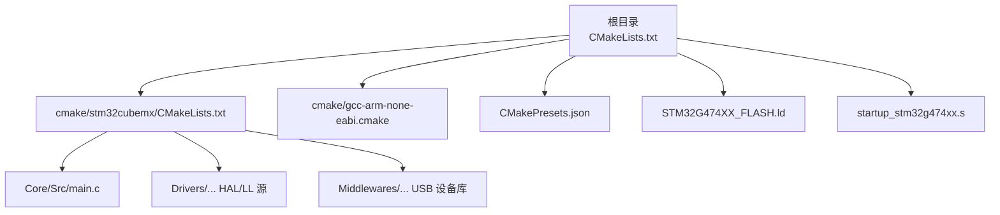
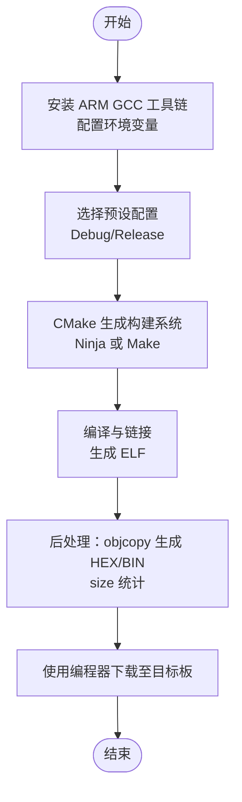
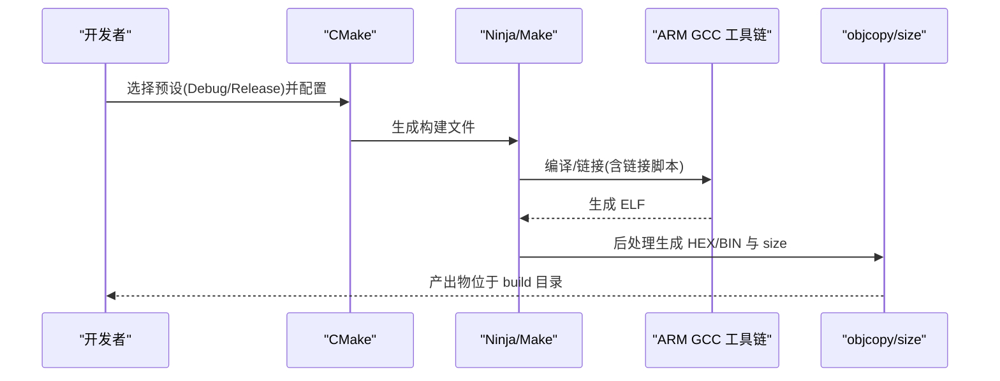
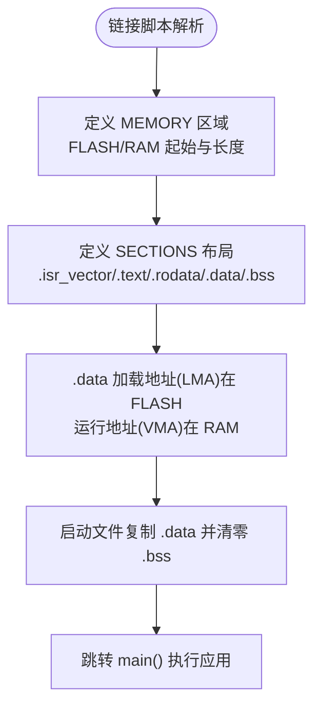
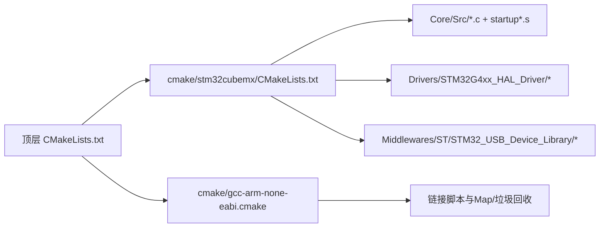

# 固件烧录流程

<cite>
**本文引用的文件**   
- [CMakeLists.txt](file://CMakeLists.txt)
- [CMakePresets.json](file://CMakePresets.json)
- [gcc-arm-none-eabi.cmake](file://cmake/gcc-arm-none-eabi.cmake)
- [stm32cubemx/CMakeLists.txt](file://cmake/stm32cubemx/CMakeLists.txt)
- [STM32G474XX_FLASH.ld](file://STM32G474XX_FLASH.ld)
- [startup_stm32g474xx.s](file://startup_stm32g474xx.s)
- [main.c](file://Core/Src/main.c)
</cite>

## 目录
1. [简介](#简介)
2. [项目结构](#项目结构)
3. [核心组件](#核心组件)
4. [架构总览](#架构总览)
5. [详细组件分析](#详细组件分析)
6. [依赖关系分析](#依赖关系分析)
7. [性能与产物说明](#性能与产物说明)
8. [工具链与环境准备](#工具链与环境准备)
9. [编译构建流程](#编译构建流程)
10. [下载与烧录步骤](#下载与烧录步骤)
11. [内存映射与链接脚本](#内存映射与链接脚本)
12. [常见问题排查](#常见问题排查)
13. [结论](#结论)
14. [附录：自动化脚本示例](#附录自动化脚本示例)

## 简介
本指南面向使用 STM32G474 的开发者，提供从环境搭建、编译生成到通过 ST-Link 将固件下载到目标板的完整操作说明。文档覆盖以下要点：
- ST-Link 调试器的连接与驱动配置
- CMake 构建系统的使用（Debug/Release 差异）
- HEX/BIN 产物生成原理与路径
- 使用 STM32CubeProgrammer 和 OpenOCD 进行下载与校验
- 链接脚本与内存映射的作用及配置方法
- 常见问题的定位与解决思路
- 为初学者提供图文式步骤，为高级用户提供命令行自动化脚本示例

## 项目结构
本项目基于 STM32CubeMX 生成工程骨架，并使用 CMake 作为跨平台构建系统。关键目录与职责如下：
- Core/Src 与 Core/Inc：应用主程序与头文件
- Drivers：HAL/LL 驱动与 CMSIS 支持
- Middlewares：USB 设备库等中间件
- cmake：工具链与子模块 CMake 配置
- 根目录：顶层 CMakeLists、CMakePresets、链接脚本、启动文件

图表来源
- [CMakeLists.txt:1-77](file://CMakeLists.txt#L1-L77)
- [cmake/stm32cubemx/CMakeLists.txt:1-114](file://cmake/stm32cubemx/CMakeLists.txt#L1-L114)
- [CMakePresets.json:1-38](file://CMakePresets.json#L1-L38)
- [gcc-arm-none-eabi.cmake:1-48](file://cmake/gcc-arm-none-eabi.cmake#L1-L48)
- [STM32G474XX_FLASH.ld:52-60](file://STM32G474XX_FLASH.ld#L52-L60)
- [startup_stm32g474xx.s:1-200](file://startup_stm32g474xx.s#L1-L200)

章节来源
- [CMakeLists.txt:1-77](file://CMakeLists.txt#L1-L77)
- [cmake/stm32cubemx/CMakeLists.txt:1-114](file://cmake/stm32cubemx/CMakeLists.txt#L1-L114)
- [CMakePresets.json:1-38](file://CMakePresets.json#L1-L38)
- [gcc-arm-none-eabi.cmake:1-48](file://cmake/gcc-arm-none-eabi.cmake#L1-L48)
- [STM32G474XX_FLASH.ld:52-60](file://STM32G474XX_FLASH.ld#L52-L60)
- [startup_stm32g474xx.s:1-200](file://startup_stm32g474xx.s#L1-L200)

## 核心组件
- 构建入口与规则：顶层 CMakeLists.txt 定义可执行目标、包含 stm32cubemx 子模块、设置语言标准、启用编译命令导出、并在后处理阶段调用 objcopy 生成 HEX 与 BIN，同时输出 size 统计。
- 工具链与交叉编译：cmake/gcc-arm-none-eabi.cmake 指定 ARM GCC 工具链前缀、编译器/链接器/objcopy/size、MCU 相关编译选项、Debug/Release 优化等级、链接脚本路径、Map 文件与垃圾回收等。
- 预置配置：CMakePresets.json 提供 Debug/Release 两种预设，统一 generator、二进制目录与工具链文件。
- 链接脚本：STM32G474XX_FLASH.ld 定义 FLASH/RAM 起始地址与长度、段布局、堆栈大小、TLS 与数据拷贝初始化等。
- 启动流程：startup_stm32g474xx.s 完成向量表、SP 设置、时钟初始化、.data/.bss 初始化并跳转 main。

章节来源
- [CMakeLists.txt:1-77](file://CMakeLists.txt#L1-L77)
- [gcc-arm-none-eabi.cmake:1-48](file://cmake/gcc-arm-none-eabi.cmake#L1-L48)
- [CMakePresets.json:1-38](file://CMakePresets.json#L1-L38)
- [STM32G474XX_FLASH.ld:52-60](file://STM32G474XX_FLASH.ld#L52-L60)
- [startup_stm32g474xx.s:1-200](file://startup_stm32g474xx.s#L1-L200)

## 架构总览
下图展示了从源码到可烧录产物的整体流程，以及各配置文件的作用。

[此图为概念性流程图，不直接映射具体代码文件]

## 详细组件分析

### 构建系统与产物生成
- 顶层 CMakeLists.txt 中定义了可执行目标名称、包含 stm32cubemx 子模块、在 POST_BUILD 阶段调用 objcopy 生成 .hex 与 .bin，并打印 size 信息。
- 工具链文件 gcc-arm-none-eabi.cmake 指定了 MCU 目标参数、优化等级、链接脚本路径、Map 文件输出与垃圾回收等。
- CMakePresets.json 提供 Debug/Release 预设，分别设置 CMAKE_BUILD_TYPE，便于一键切换。

图表来源
- [CMakeLists.txt:70-76](file://CMakeLists.txt#L70-L76)
- [gcc-arm-none-eabi.cmake:24-48](file://cmake/gcc-arm-none-eabi.cmake#L24-L48)
- [CMakePresets.json:1-38](file://CMakePresets.json#L1-L38)

章节来源
- [CMakeLists.txt:1-77](file://CMakeLists.txt#L1-L77)
- [gcc-arm-none-eabi.cmake:1-48](file://cmake/gcc-arm-none-eabi.cmake#L1-L48)
- [CMakePresets.json:1-38](file://CMakePresets.json#L1-L38)

### 链接脚本与内存映射
- 链接脚本定义了两个主要区域：FLASH 起始于 0x08000000，长度 512K；RAM 起始于 0x20000000，长度 128K。
- 段布局包括 .isr_vector、.text、.rodata、.data（AT>FLASH）、.bss 等，确保运行时正确初始化。
- 启动文件负责复制 .data、清零 .bss，然后跳转到 main。

图表来源
- [STM32G474XX_FLASH.ld:52-60](file://STM32G474XX_FLASH.ld#L52-L60)
- [STM32G474XX_FLASH.ld:152-165](file://STM32G474XX_FLASH.ld#L152-L165)
- [startup_stm32g474xx.s:61-102](file://startup_stm32g474xx.s#L61-L102)

章节来源
- [STM32G474XX_FLASH.ld:52-60](file://STM32G474XX_FLASH.ld#L52-L60)
- [startup_stm32g474xx.s:1-200](file://startup_stm32g474xx.s#L1-L200)

### 应用程序入口与外设初始化
- main.c 中完成 HAL 初始化、系统时钟配置、GPIO/DMA/ADC/USB 初始化，并启动 ADC 多模式 DMA 循环采集。
- 该部分与烧录无直接耦合，但需确保链接脚本与启动流程正确，否则可能导致运行异常。

章节来源
- [main.c:219-290](file://Core/Src/main.c#L219-L290)

## 依赖关系分析
- 顶层 CMakeLists.txt 依赖 stm32cubemx 子模块与工具链配置。
- stm32cubemx/CMakeLists.txt 聚合应用源、HAL/LL 驱动、USB 设备库，并创建对象库供最终链接。
- 工具链文件提供编译器、链接器、objcopy、size 的路径与参数，并注入链接脚本与 Map 文件生成。

图表来源
- [CMakeLists.txt:35-68](file://CMakeLists.txt#L35-L68)
- [cmake/stm32cubemx/CMakeLists.txt:83-105](file://cmake/stm32cubemx/CMakeLists.txt#L83-L105)
- [gcc-arm-none-eabi.cmake:42-48](file://cmake/gcc-arm-none-eabi.cmake#L42-L48)

章节来源
- [CMakeLists.txt:1-77](file://CMakeLists.txt#L1-L77)
- [cmake/stm32cubemx/CMakeLists.txt:1-114](file://cmake/stm32cubemx/CMakeLists.txt#L1-L114)
- [gcc-arm-none-eabi.cmake:1-48](file://cmake/gcc-arm-none-eabi.cmake#L1-L48)

## 性能与产物说明
- Debug 模式：开启 -O0 -g3，便于调试，体积较大。
- Release 模式：开启 -Os -g0，优化体积与速度，适合量产。
- 产物：ELF 用于调试，HEX 与 BIN 用于下载。HEX 为 Intel HEX 文本格式，BIN 为纯二进制镜像。
- 链接脚本中的 --gc-sections 会移除未使用的段以减小体积；Map 文件可用于分析占用。

章节来源
- [gcc-arm-none-eabi.cmake:35-48](file://cmake/gcc-arm-none-eabi.cmake#L35-L48)
- [CMakeLists.txt:70-76](file://CMakeLists.txt#L70-L76)

## 工具链与环境准备
- 安装 ARM GCC 工具链（arm-none-eabi-gcc），并确保 arm-none-eabi- 系列命令在 PATH 中可用。
- 安装 CMake 与 Ninja（或 Make）。
- 安装 ST-Link 驱动（Windows 下建议使用 ST-Link Utility 或官方驱动包）。
- 可选：安装 STM32CubeProgrammer 与 OpenOCD。

[本节为通用环境说明，不直接分析具体文件]

## 编译构建流程
- 使用预设配置进行构建：
  - 选择 Debug 或 Release 预设
  - 生成构建系统并编译
  - 查看 build 目录下生成的 HEX 与 BIN 产物
- 若需要自定义构建类型，可通过 CMAKE_BUILD_TYPE 变量传递。

章节来源
- [CMakePresets.json:1-38](file://CMakePresets.json#L1-L38)
- [CMakeLists.txt:16-29](file://CMakeLists.txt#L16-L29)
- [CMakeLists.txt:70-76](file://CMakeLists.txt#L70-L76)

## 下载与烧录步骤

### 硬件连接
- 使用 ST-Link V2/V3 或集成 ST-Link 的开发板，连接目标板的 SWD 接口：
  - SWDIO -> SWDIO
  - SWCLK -> SWCLK
  - GND -> GND
  - 如需复位控制，连接 NRST（可选）
- 确认供电方式：优先由开发板或外部电源供电，避免仅靠 ST-Link 供电导致不稳定。

[本节为通用硬件说明，不直接分析具体文件]

### 驱动安装
- Windows：安装 ST-Link 驱动或使用 ST-Link Utility 自动安装。
- Linux：安装 stlink 工具链与 udev 规则，使普通用户可访问设备。
- macOS：安装 stlink 工具链。

[本节为通用驱动说明，不直接分析具体文件]

### 使用 STM32CubeProgrammer 下载
- 打开 STM32CubeProgrammer，选择 ST-Link 接口并连接目标板。
- 在 Memory and File Editor 中选择 HEX 或 BIN 文件，写入目标地址：
  - 对于本项目的链接脚本，FLASH 起始地址为 0x08000000
- 点击 Write 执行下载，完成后 Reset 运行。

章节来源
- [STM32G474XX_FLASH.ld:52-60](file://STM32G474XX_FLASH.ld#L52-L60)

### 使用 OpenOCD 下载
- 使用 openocd 配合 stlink.cfg 或对应接口配置文件，执行 flash write 命令。
- 建议先擦除目标 FLASH 再写入，以避免残留数据影响。
- 可使用 verify 功能进行校验。

[本节为通用工具说明，不直接分析具体文件]

### 使用 J-Flash / Keil / IAR 等其他工具
- 选择正确的芯片型号与接口（SWD）。
- 载入 HEX 或 BIN，设置起始地址为 0x08000000。
- 执行 Erase、Program、Verify、Reset 流程。

[本节为通用工具说明，不直接分析具体文件]

## 内存映射与链接脚本
- 链接脚本中定义的 FLASH 起始地址为 0x08000000，长度 512K；RAM 起始地址为 0x20000000，长度 128K。
- 所有下载工具必须将固件写入 FLASH 起始地址，否则无法正确启动。
- 若修改了链接脚本（例如更改起始地址或长度），需同步更新下载工具的地址配置。

章节来源
- [STM32G474XX_FLASH.ld:52-60](file://STM32G474XX_FLASH.ld#L52-L60)

## 常见问题排查

- 连接失败
  - 检查 SWD 接线是否正确，GND 是否共地
  - 确认 ST-Link 驱动已安装且设备管理器中可见
  - 尝试降低 SWD 时钟频率（OpenOCD 中可配置）
  - 使用 STM32CubeProgrammer 的“Connect”测试连通性

- 校验错误
  - 确认写入地址与链接脚本一致（0x08000000）
  - 使用 Verify 功能比对 HEX/BIN 与目标 FLASH
  - 先执行全片擦除再写入

- 下载成功但不运行
  - 检查复位引脚 NRST 是否连接良好
  - 确认外部晶振或内部时钟配置正常
  - 使用调试器单步进入 Reset_Handler 与 main，观察异常中断

- 产物缺失或路径不对
  - 确认构建类型为 Debug/Release 且构建成功
  - 检查 build 目录结构与 CMake 输出位置
  - 查看 objcopy 与 size 命令是否可用

章节来源
- [CMakeLists.txt:70-76](file://CMakeLists.txt#L70-L76)
- [gcc-arm-none-eabi.cmake:1-48](file://cmake/gcc-arm-none-eabi.cmake#L1-L48)
- [STM32G474XX_FLASH.ld:52-60](file://STM32G474XX_FLASH.ld#L52-L60)

## 结论
通过本指南，您可以完成 STM32G474 固件的环境搭建、编译构建与下载烧录全流程。关键在于：
- 正确安装与配置 ARM GCC 工具链与 ST-Link 驱动
- 使用 CMake 预设快速切换 Debug/Release
- 理解链接脚本的内存映射，确保下载工具写入正确地址
- 遇到问题时按连接、地址、校验、运行顺序逐步排查

[本节为总结性内容，不直接分析具体文件]

## 附录：自动化脚本示例

以下为常用命令行示例（请根据实际路径与工具版本调整）：

- 使用 CMake 预设构建（Windows PowerShell）
  - 配置并构建 Debug：
    - cmake --preset=Debug
    - cmake --build --preset=Debug
  - 配置并构建 Release：
    - cmake --preset=Release
    - cmake --build --preset=Release

- 使用 STM32CubeProgrammer 批量下载（命令行）
  - 连接并写入 HEX：
    - STM32_Programmer_CLI -c port=swd -w build/Debug/G4test.hex 0x08000000
  - 验证与复位：
    - STM32_Programmer_CLI -c port=swd -v build/Debug/G4test.hex 0x08000000
    - STM32_Programmer_CLI -c port=swd -rst

- 使用 OpenOCD 批量下载（命令行）
  - 启动 OpenOCD 并执行脚本：
    - openocd -f interface/stlink.cfg -f target/stm32g4x.cfg -c "program build/Release/G4test.bin 0x08000000 verify reset exit"

- 使用 J-Flash 批处理（JLinkCommander）
  - 写入 BIN 并复位：
    - JLinkExe -device STM32G474RETx -if SWD -speed 4000 -autoconnect 1 -CommandFile jflash.cmd
    - jflash.cmd 内容示例：
      - loadfile build/Release/G4test.bin 0x08000000
      - r
      - g
      - exit

注意：
- 上述命令中的路径与文件名需与实际构建输出一致。
- 不同操作系统下的路径分隔符与命令语法可能略有差异。

[本节为通用脚本示例，不直接分析具体文件]