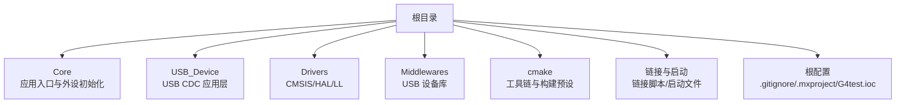
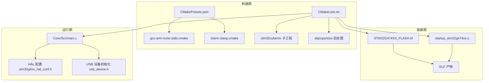
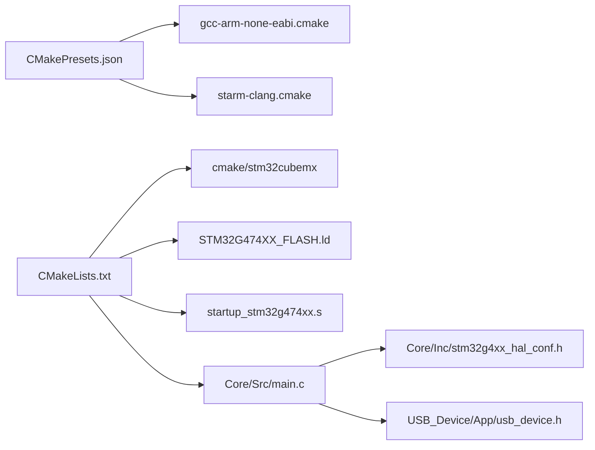
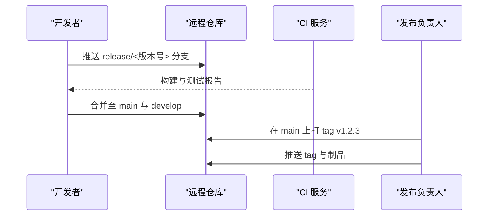

# 版本管理策略

<cite>
**本文引用的文件**   
- [CMakeLists.txt](file://CMakeLists.txt)
- [CMakePresets.json](file://CMakePresets.json)
- [cmake/gcc-arm-none-eabi.cmake](file://cmake/gcc-arm-none-eabi.cmake)
- [cmake/starm-clang.cmake](file://cmake/starm-clang.cmake)
- [STM32G474XX_FLASH.ld](file://STM32G474XX_FLASH.ld)
- [startup_stm32g474xx.s](file://startup_stm32g474xx.s)
- [Core/Src/main.c](file://Core/Src/main.c)
- [Core/Inc/main.h](file://Core/Inc/main.h)
- [Core/Inc/stm32g4xx_hal_conf.h](file://Core/Inc/stm32g4xx_hal_conf.h)
- [USB_Device/App/usb_device.h](file://USB_Device/App/usb_device.h)
- [.gitignore](file://.gitignore)
</cite>

## 目录
1. [引言](#引言)
2. [项目结构](#项目结构)
3. [核心组件](#核心组件)
4. [架构总览](#架构总览)
5. [详细组件分析](#详细组件分析)
6. [依赖分析](#依赖分析)
7. [性能考虑](#性能考虑)
8. [故障排查指南](#故障排查指南)
9. [结论](#结论)
10. [附录](#附录)

## 引言
本文件为 STM32 G4 测试项目建立完善的版本管理与 Git 工作流规范，覆盖分支模型、提交信息规范、代码审查流程、标签与发布流程、配置文件版本控制最佳实践、忽略文件策略、合并冲突解决与协作规范。目标是提升团队协作效率与代码质量，确保构建可重复、发布可追溯、回滚可执行。

## 项目结构
本项目基于 CMake + STM32CubeMX 生成的工程结构，包含：
- 应用层：Core（主程序与外设初始化）、USB_Device（USB CDC 设备）
- 驱动与中间件：Drivers（HAL/LL/CMSIS）、Middlewares（USB 设备库）
- 构建配置：CMakeLists.txt、CMakePresets.json、cmake/*（工具链脚本）
- 链接与启动：STM32G474XX_FLASH.ld、startup_stm32g474xx.s
- 根级配置：.gitignore、.mxproject、G4test.ioc 等

**图表来源** 
- [CMakeLists.txt:1-77](file://CMakeLists.txt#L1-L77)
- [CMakePresets.json:1-38](file://CMakePresets.json#L1-L38)
- [cmake/gcc-arm-none-eabi.cmake:1-48](file://cmake/gcc-arm-none-eabi.cmake#L1-L48)
- [cmake/starm-clang.cmake:1-66](file://cmake/starm-clang.cmake#L1-L66)
- [STM32G474XX_FLASH.ld:1-251](file://STM32G474XX_FLASH.ld#L1-L251)
- [startup_stm32g474xx.s:1-593](file://startup_stm32g474xx.s#L1-L593)

**章节来源**
- [CMakeLists.txt:1-77](file://CMakeLists.txt#L1-L77)
- [CMakePresets.json:1-38](file://CMakePresets.json#L1-L38)

## 核心组件
- 构建系统
  - CMakeLists.txt：定义语言标准、目标、子目录、包含路径、编译宏、链接库与后处理命令（生成 HEX/BIN）。
  - CMakePresets.json：提供默认、Debug、Release 的 configure/build preset，统一工具链与输出目录。
  - cmake/*.cmake：分别定义 GCC ARM 与 STARM Clang 两套交叉工具链参数、优化等级与链接选项。
- 链接与启动
  - STM32G474XX_FLASH.ld：定义 RAM/FLASH 布局、段映射、堆栈大小与内存使用统计。
  - startup_stm32g474xx.s：向量表、复位流程、数据段拷贝与 BSS 清零，最终跳转 main。
- 应用与 HAL 配置
  - Core/Src/main.c：系统初始化、ADC/DMA/USB 初始化、触发采集与 USB CDC 传输逻辑。
  - Core/Inc/stm32g4xx_hal_conf.h：启用模块开关、中断优先级、缓存与断言等系统配置。
  - USB_Device/App/usb_device.h：USB 设备初始化接口声明。

**章节来源**
- [CMakeLists.txt:1-77](file://CMakeLists.txt#L1-L77)
- [CMakePresets.json:1-38](file://CMakePresets.json#L1-L38)
- [cmake/gcc-arm-none-eabi.cmake:1-48](file://cmake/gcc-arm-none-eabi.cmake#L1-L48)
- [cmake/starm-clang.cmake:1-66](file://cmake/starm-clang.cmake#L1-L66)
- [STM32G474XX_FLASH.ld:1-251](file://STM32G474XX_FLASH.ld#L1-L251)
- [startup_stm32g474xx.s:1-593](file://startup_stm32g474xx.s#L1-L593)
- [Core/Src/main.c:1-556](file://Core/Src/main.c#L1-L556)
- [Core/Inc/stm32g4xx_hal_conf.h:1-381](file://Core/Inc/stm32g4xx_hal_conf.h#L1-L381)
- [USB_Device/App/usb_device.h:1-104](file://USB_Device/App/usb_device.h#L1-L104)

## 架构总览
下图展示从构建到运行的关键关系：CMake 通过 Preset 选择工具链脚本，链接器使用链接脚本，启动文件完成硬件初始化后进入 main，main 中调用 HAL 与 USB 设备初始化并运行业务逻辑。

**图表来源** 
- [CMakePresets.json:1-38](file://CMakePresets.json#L1-L38)
- [cmake/gcc-arm-none-eabi.cmake:1-48](file://cmake/gcc-arm-none-eabi.cmake#L1-L48)
- [cmake/starm-clang.cmake:1-66](file://cmake/starm-clang.cmake#L1-L66)
- [CMakeLists.txt:1-77](file://CMakeLists.txt#L1-L77)
- [STM32G474XX_FLASH.ld:1-251](file://STM32G474XX_FLASH.ld#L1-L251)
- [startup_stm32g474xx.s:1-593](file://startup_stm32g474xx.s#L1-L593)
- [Core/Src/main.c:1-556](file://Core/Src/main.c#L1-L556)
- [Core/Inc/stm32g4xx_hal_conf.h:1-381](file://Core/Inc/stm32g4xx_hal_conf.h#L1-L381)
- [USB_Device/App/usb_device.h:1-104](file://USB_Device/App/usb_device.h#L1-L104)

## 详细组件分析

### 分支管理模型（Git Flow 适配嵌入式）
- 主分支
  - main：稳定基线，仅接受来自 release 或 hotfix 的合并；打 tag 作为正式发行版。
- 开发分支
  - develop：集成最新特性，保持可构建状态；所有功能分支合并至此。
- 功能分支
  - feature/<描述>：从 develop 切出，完成后合并回 develop；命名遵循小写短横线分隔。
- 发布分支
  - release/<版本号>：从 develop 切出，用于冻结特性、回归测试与文档完善；修复仅在此分支进行，完成后合并至 main 与 develop。
- 热修复分支
  - hotfix/<问题描述>：从 main 切出，修复紧急问题；完成后合并至 main 与 develop，并打 tag。

建议规则
- 分支生命周期短小精悍，避免长期大分支。
- 禁止直接推送至 main；必须通过 Pull Request/Merge Request 合并。
- 合并前需通过 CI 构建与基础检查（见“持续集成”小节）。

### 提交信息规范（Conventional Commits 简化版）
格式：type(scope): subject
- type 可选：feat, fix, docs, style, refactor, perf, test, build, ci, chore, revert
- scope 可选：Core, USB_Device, Drivers, Middlewares, cmake, Config
- subject 简明扼要，动词开头，不超过 72 字符
示例
- feat(Core): 增加 ADC 双通道交错采样与 DMA 环形缓冲
- fix(USB_Device): 修正 CDC 发送阻塞重试逻辑
- refactor(cmake): 统一 Debug/Release 优化等级
- chore(Config): 更新 HAL 模块开关以匹配当前外设

提交纪律
- 一次提交只做一件事，便于回滚与审计。
- 提交前本地构建通过，必要时附带最小复现说明。

### 代码审查流程
- 强制 MR/PR 审查：至少 1 名 reviewer 批准后方可合并。
- 审查清单
  - 功能正确性与边界条件
  - 资源占用（RAM/Flash）是否可控
  - 中断与 DMA 并发安全（volatile、临界区）
  - 构建与链接无新增警告
  - 变更影响范围评估（HAL 配置、链接脚本、工具链）
- 自动化门禁
  - 构建成功（Debug/Release）
  - 链接脚本与内存使用报告未退化
  - 基础静态检查（如编译器警告级别）

### 标签与发布流程
- 版本语义化：主版本.次版本.修订号（例如 v1.2.3）
  - 主版本：不兼容 API/硬件平台变更
  - 次版本：向后兼容的功能增强
  - 修订号：向后兼容的问题修复
- 发布候选（RC）：v1.2.3-rc.1、v1.2.3-rc.2...
- 发布步骤
  1) 在 release/<版本号> 分支完成回归测试与文档更新
  2) 合并至 main 与 develop
  3) 在 main 上打 tag（含 RC 标记），推送远程仓库
  4) 生成制品（HEX/BIN/Map/Size 报告）并归档
- 回滚策略
  - 快速回滚：将 main 指针恢复到上一个稳定 tag
  - 带注释回滚：创建 revert 提交，记录原因与影响
  - 对已发布 tag 不做二次修改，如需修复则发新的修订版本

### 配置文件版本控制最佳实践
- CMakeLists.txt
  - 集中管理目标、源文件、包含路径、编译宏与链接库；用户扩展区域清晰标注，避免被工具重新生成覆盖。
  - 将构建类型、输出目录、工具链文件通过 CMakePresets.json 管理，减少硬编码。
- 工具链脚本（cmake/*.cmake）
  - 固化 MCU 相关编译/链接标志，区分 Debug/Release 优化等级。
  - 明确链接脚本路径与 map 文件输出，便于内存分析。
- 链接脚本（STM32G474XX_FLASH.ld）
  - 严格维护 RAM/FLASH 布局与段映射；调整堆栈时需同步评估内存使用。
  - 保留 /DISCARD/ 与内存使用打印选项，便于定位膨胀。
- 启动文件（startup_stm32g474xx.s）
  - 一般不修改；若需自定义向量表或异常处理，应在独立文件中实现并通过弱符号覆盖。
- HAL 配置（stm32g4xx_hal_conf.h）
  - 按模块开关启用所需外设；关闭未用模块以减少体积。
  - 合理设置中断优先级与缓存策略，避免运行时不稳定。
- USB 设备头文件（usb_device.h）
  - 仅暴露必要接口；内部实现细节封装在 .c 中。

**章节来源**
- [CMakeLists.txt:1-77](file://CMakeLists.txt#L1-L77)
- [CMakePresets.json:1-38](file://CMakePresets.json#L1-L38)
- [cmake/gcc-arm-none-eabi.cmake:1-48](file://cmake/gcc-arm-none-eabi.cmake#L1-L48)
- [cmake/starm-clang.cmake:1-66](file://cmake/starm-clang.cmake#L1-L66)
- [STM32G474XX_FLASH.ld:1-251](file://STM32G474XX_FLASH.ld#L1-L251)
- [startup_stm32g474xx.s:1-593](file://startup_stm32g474xx.s#L1-L593)
- [Core/Inc/stm32g4xx_hal_conf.h:1-381](file://Core/Inc/stm32g4xx_hal_conf.h#L1-L381)
- [USB_Device/App/usb_device.h:1-104](file://USB_Device/App/usb_device.h#L1-L104)

### 忽略文件配置原则
- 构建产物：build 目录、IDE 临时文件、大型二进制文件
- 敏感信息：密钥、证书、个人环境配置
- IDE 本地设置：除共享的 .settings 外，其他 IDE 私有目录应忽略
- 现有 .gitignore 已忽略 build 与 mx.scratch，并显式允许 .settings；建议补充常见忽略项（如 *.map、*.hex、*.bin、*.elf、*.o、*.d、*.swp、*.log、*.tmp、*.pyc、*.class、*.jar、*.zip、*.tar.gz、*.pdf、*.docx、*.xlsx、*.key、*.pem、*.env、local.conf、secrets.* 等）

**章节来源**
- [.gitignore:1-3](file://.gitignore#L1-L3)

### 合并冲突解决指南
- 预防优先
  - 频繁拉取 develop 并本地 rebase/squash，保持提交历史整洁。
  - 小步提交，降低冲突概率。
- 冲突定位
  - 使用 diff 工具对比冲突文件，逐块审阅。
  - 重点关注：HAL 配置宏、链接脚本段定义、CMake 变量与路径。
- 解决策略
  - 保留双方有效变更，删除冗余或过时片段。
  - 冲突后务必本地完整构建与链接，确认无新增错误/警告。
  - 提交前运行最小用例验证关键路径（如 ADC+DMA+USB CDC）。
- 合并后动作
  - 更新本地分支，清理无用分支，推送远端并通知 reviewer。

### 协作开发规范
- 角色与职责
  - 开发者：负责功能实现、自测与提交信息规范。
  - 审查者：关注质量、风险与可维护性。
  - 发布负责人：负责版本计划、标签与制品归档。
- 沟通与追踪
  - 每个 MR/PR 关联需求或问题单号。
  - 重要决策在 Issue/讨论区留痕。
- 持续集成（CI）建议
  - 每次 push 触发构建（Debug/Release），产出 Map/Size 报告。
  - 失败时阻断合并，修复后再试。
  - 定期扫描依赖与许可证合规。

## 依赖分析
- 构建依赖
  - CMakePresets.json 指定 Ninja 生成器与工具链文件，统一构建环境。
  - CMakeLists.txt 引入 stm32cubemx 子工程，组织生成源码与用户源码。
- 工具链依赖
  - gcc-arm-none-eabi.cmake 与 starm-clang.cmake 分别定义编译器、汇编器、链接器与 objcopy/size 工具前缀及标志。
- 链接与运行依赖
  - 链接脚本定义内存布局与段映射，启动文件完成初始化后进入 main。
  - main 依赖 HAL 配置与 USB 设备初始化。

**图表来源** 
- [CMakePresets.json:1-38](file://CMakePresets.json#L1-L38)
- [cmake/gcc-arm-none-eabi.cmake:1-48](file://cmake/gcc-arm-none-eabi.cmake#L1-L48)
- [cmake/starm-clang.cmake:1-66](file://cmake/starm-clang.cmake#L1-L66)
- [CMakeLists.txt:1-77](file://CMakeLists.txt#L1-L77)
- [STM32G474XX_FLASH.ld:1-251](file://STM32G474XX_FLASH.ld#L1-L251)
- [startup_stm32g474xx.s:1-593](file://startup_stm32g474xx.s#L1-L593)
- [Core/Src/main.c:1-556](file://Core/Src/main.c#L1-L556)
- [Core/Inc/stm32g4xx_hal_conf.h:1-381](file://Core/Inc/stm32g4xx_hal_conf.h#L1-L381)
- [USB_Device/App/usb_device.h:1-104](file://USB_Device/App/usb_device.h#L1-L104)

**章节来源**
- [CMakeLists.txt:1-77](file://CMakeLists.txt#L1-L77)
- [CMakePresets.json:1-38](file://CMakePresets.json#L1-L38)
- [cmake/gcc-arm-none-eabi.cmake:1-48](file://cmake/gcc-arm-none-eabi.cmake#L1-L48)
- [cmake/starm-clang.cmake:1-66](file://cmake/starm-clang.cmake#L1-L66)
- [STM32G474XX_FLASH.ld:1-251](file://STM32G474XX_FLASH.ld#L1-L251)
- [startup_stm32g474xx.s:1-593](file://startup_stm32g474xx.s#L1-L593)
- [Core/Src/main.c:1-556](file://Core/Src/main.c#L1-L556)
- [Core/Inc/stm32g4xx_hal_conf.h:1-381](file://Core/Inc/stm32g4xx_hal_conf.h#L1-L381)
- [USB_Device/App/usb_device.h:1-104](file://USB_Device/App/usb_device.h#L1-L104)

## 性能考虑
- 构建与链接
  - 使用 --gc-sections 与 map 文件分析，剔除未使用段，减小固件体积。
  - Release 优化等级与调试信息分离，便于生产与调试切换。
- 运行时
  - 中断与 DMA 共用缓冲区需保证原子访问与可见性（volatile、临界区保护）。
  - 避免在 ISR 中进行耗时操作，尽量将数据处理下沉至主循环。
- 内存与栈
  - 根据链接脚本中的堆栈大小与实际使用报告调优，防止溢出。

[本节为通用指导，无需特定文件引用]

## 故障排查指南
- 构建失败
  - 检查 CMakePresets 与工具链路径是否正确；确认 Ninja 可用。
  - 查看编译器/链接器日志，定位缺失头文件或未定义符号。
- 链接失败或体积异常
  - 核对链接脚本段定义与堆栈大小；检查是否误删必需段。
  - 使用 map 文件定位大对象与未使用库。
- 运行异常
  - 检查 HAL 配置是否与硬件一致（时钟、中断优先级、外设使能）。
  - 确认启动文件未被意外修改；异常向量表与 Reset_Handler 正常。
- USB CDC 通信问题
  - 确认 USB 设备初始化顺序与端点配置；检查主机端驱动与波特率无关（CDC 为批量传输）。

**章节来源**
- [CMakePresets.json:1-38](file://CMakePresets.json#L1-L38)
- [CMakeLists.txt:1-77](file://CMakeLists.txt#L1-L77)
- [STM32G474XX_FLASH.ld:1-251](file://STM32G474XX_FLASH.ld#L1-L251)
- [startup_stm32g474xx.s:1-593](file://startup_stm32g474xx.s#L1-L593)
- [Core/Inc/stm32g4xx_hal_conf.h:1-381](file://Core/Inc/stm32g4xx_hal_conf.h#L1-L381)
- [USB_Device/App/usb_device.h:1-104](file://USB_Device/App/usb_device.h#L1-L104)

## 结论
通过统一的分支模型、严格的提交与审查规范、标准化的标签与发布流程，以及针对嵌入式项目的构建与链接配置最佳实践，团队可在保证质量的前提下高效协作。配合 CI 与忽略文件策略，可有效降低风险、提升可追溯性与可维护性。

## 附录

### 常用 Git 命令参考
- 分支
  - git checkout -b feature/<描述> develop
  - git merge --no-ff feature/<描述>
  - git branch -d feature/<描述>
- 提交
  - git add .
  - git commit -m "feat(scope): subject"
- 标签
  - git tag -a v1.2.3 -m "Release v1.2.3"
  - git push origin v1.2.3

### 持续集成（CI）建议
- 触发条件：push 与 MR/PR
- 任务
  - 安装工具链（GCC ARM 或 STARM Clang）
  - 使用 CMakePresets 配置与构建（Debug/Release）
  - 收集 Map/Size 报告并上传工件
  - 失败时阻断合并

### 典型流程图示

#### 发布序列图（概念）

[此图为概念流程，不直接映射具体源码文件]