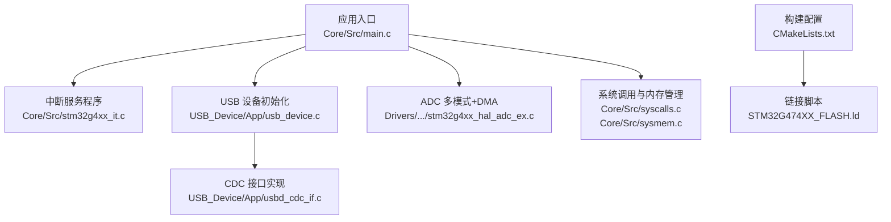
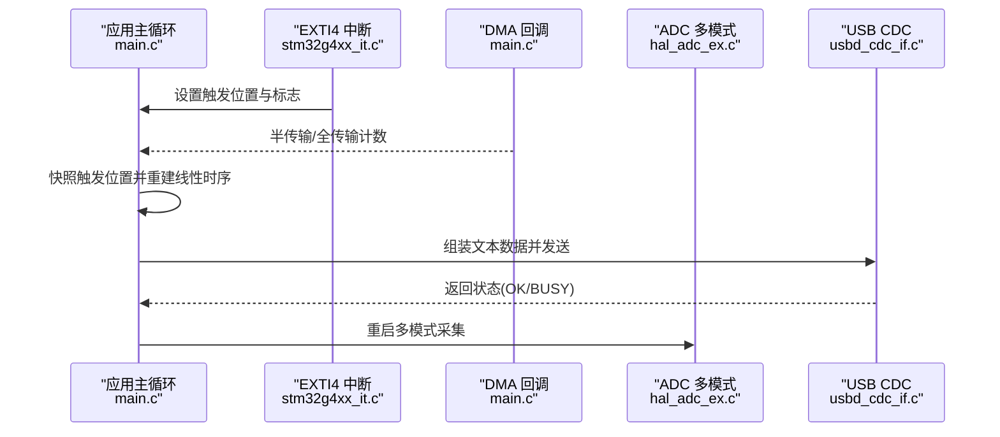
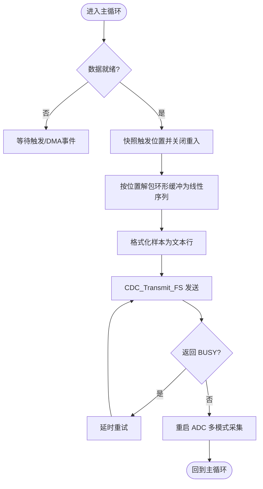
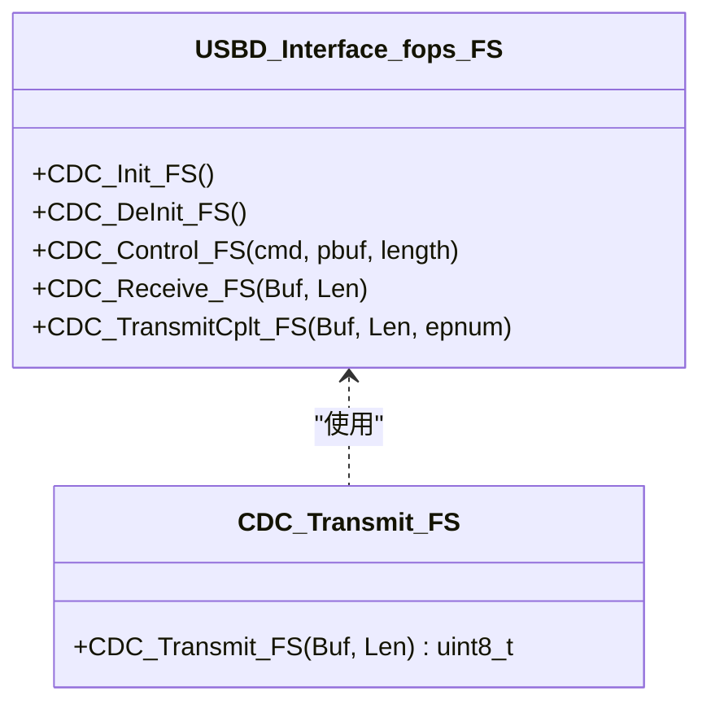
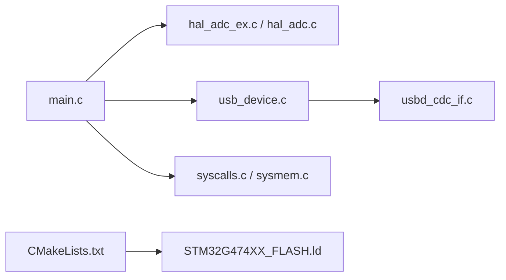

# 维护和支持

<cite>
**本文引用的文件**   
- [Core/Src/main.c](file://Core/Src/main.c)
- [Core/Inc/main.h](file://Core/Inc/main.h)
- [Core/Src/stm32g4xx_it.c](file://Core/Src/stm32g4xx_it.c)
- [Core/Inc/stm32g4xx_it.h](file://Core/Inc/stm32g4xx_it.h)
- [Core/Src/syscalls.c](file://Core/Src/syscalls.c)
- [Core/Src/sysmem.c](file://Core/Src/sysmem.c)
- [CMakeLists.txt](file://CMakeLists.txt)
- [STM32G474XX_FLASH.ld](file://STM32G474XX_FLASH.ld)
- [USB_Device/App/usbd_cdc_if.c](file://USB_Device/App/usbd_cdc_if.c)
- [USB_Device/App/usb_device.c](file://USB_Device/App/usb_device.c)
- [Drivers/STM32G4xx_HAL_Driver/Src/stm32g4xx_hal_adc_ex.c](file://Drivers/STM32G4xx_HAL_Driver/Src/stm32g4xx_hal_adc_ex.c)
- [Drivers/STM32G4xx_HAL_Driver/Src/stm32g4xx_hal_adc.c](file://Drivers/STM32G4xx_HAL_Driver/Src/stm32g4xx_hal_adc.c)
</cite>

## 目录
1. [简介](#简介)
2. [项目结构](#项目结构)
3. [核心组件](#核心组件)
4. [架构总览](#架构总览)
5. [详细组件分析](#详细组件分析)
6. [依赖关系分析](#依赖关系分析)
7. [性能考虑](#性能考虑)
8. [故障排查指南](#故障排查指南)
9. [结论](#结论)
10. [附录](#附录)

## 简介
本文件为 STM32G4 项目的“维护与支持”手册，面向运维与技术支持人员。内容覆盖：
- 常见问题解答（FAQ）：编译、链接、运行时异常、性能问题的诊断与解决
- 更新日志模板与维护记录规范
- 兼容性说明文档编写要求（硬件、软件依赖、平台支持矩阵）
- 技术支持流程（问题报告模板、优先级分类、响应时间标准）
- 性能监控与日志分析方法
- 系统健康检查清单与预防性维护计划
- 备份恢复策略与数据持久化方案
- 专业维护技能培训要点与故障处理手册

## 项目结构
本项目基于 STM32CubeMX 生成，采用 CMake 构建，包含应用层、HAL/LL 驱动、USB CDC 类库与启动/链接脚本等关键模块。

图表来源
- [Core/Src/main.c](file://Core/Src/main.c)
- [Core/Src/stm32g4xx_it.c](file://Core/Src/stm32g4xx_it.c)
- [USB_Device/App/usb_device.c](file://USB_Device/App/usb_device.c)
- [USB_Device/App/usbd_cdc_if.c](file://USB_Device/App/usbd_cdc_if.c)
- [Drivers/STM32G4xx_HAL_Driver/Src/stm32g4xx_hal_adc_ex.c](file://Drivers/STM32G4xx_HAL_Driver/Src/stm32g4xx_hal_adc_ex.c)
- [Core/Src/syscalls.c](file://Core/Src/syscalls.c)
- [Core/Src/sysmem.c](file://Core/Src/sysmem.c)
- [CMakeLists.txt](file://CMakeLists.txt)
- [STM32G474XX_FLASH.ld](file://STM32G474XX_FLASH.ld)

章节来源
- [CMakeLists.txt:1-77](file://CMakeLists.txt#L1-L77)
- [STM32G474XX_FLASH.ld:52-70](file://STM32G474XX_FLASH.ld#L52-L70)

## 核心组件
- 主循环与外设初始化：系统时钟、GPIO、DMA、ADC1/ADC2 双通道交错采样、USB CDC 设备初始化；在触发事件后重建时序并发送数据。
- 中断与回调：EXTI4 触发、DMA 半传输/全传输回调、USB 低优先级中断。
- USB CDC 通信：虚拟串口收发缓冲、发送阻塞重试逻辑。
- 系统调用与内存：Newlib/Picolibc 的 _write/_read/_sbrk 等底层实现，堆栈边界保护。
- 构建与链接：CMake 生成 HEX/BIN，链接脚本定义 RAM/FLASH 布局与最小堆栈/堆大小。

章节来源
- [Core/Src/main.c:219-290](file://Core/Src/main.c#L219-L290)
- [Core/Src/main.c:296-337](file://Core/Src/main.c#L296-L337)
- [Core/Src/main.c:344-464](file://Core/Src/main.c#L344-L464)
- [Core/Src/main.c:469-520](file://Core/Src/main.c#L469-L520)
- [Core/Src/stm32g4xx_it.c:205-228](file://Core/Src/stm32g4xx_it.c#L205-L228)
- [USB_Device/App/usb_device.c:66-88](file://USB_Device/App/usb_device.c#L66-L88)
- [USB_Device/App/usbd_cdc_if.c:281-293](file://USB_Device/App/usbd_cdc_if.c#L281-L293)
- [Core/Src/syscalls.c:80-90](file://Core/Src/syscalls.c#L80-L90)
- [Core/Src/sysmem.c:54-80](file://Core/Src/sysmem.c#L54-L80)
- [CMakeLists.txt:70-77](file://CMakeLists.txt#L70-L77)
- [STM32G474XX_FLASH.ld:56-68](file://STM32G474XX_FLASH.ld#L56-L68)

## 架构总览
下图展示从触发到数据输出的端到端流程，包括 DMA 环形缓冲、触发位置快照、解码重组与 USB CDC 发送。

图表来源
- [Core/Src/main.c:91-131](file://Core/Src/main.c#L91-L131)
- [Core/Src/main.c:156-212](file://Core/Src/main.c#L156-L212)
- [Core/Src/stm32g4xx_it.c:205-228](file://Core/Src/stm32g4xx_it.c#L205-L228)
- [Drivers/STM32G4xx_HAL_Driver/Src/stm32g4xx_hal_adc_ex.c:900-966](file://Drivers/STM32G4xx_HAL_Driver/Src/stm32g4xx_hal_adc_ex.c#L900-L966)
- [USB_Device/App/usbd_cdc_if.c:281-293](file://USB_Device/App/usbd_cdc_if.c#L281-L293)

## 详细组件分析

### 数据采集与触发处理
- 触发捕获：EXTI4 上升沿进入 HAL_GPIO_EXTI_Callback，读取 DMA 剩余计数计算触发位置，设置标志位。
- 完成判定：DMA 半传输/全传输回调累计两次事件后停止多模式采集并置数据就绪。
- 数据重组：根据触发位置快照，将环形缓冲中的交错样本解包为线性时序。
- 传输：将样本转为十进制字符串，通过 USB CDC 批量发送，若忙则轮询重试。

图表来源
- [Core/Src/main.c:259-290](file://Core/Src/main.c#L259-L290)
- [Core/Src/main.c:156-212](file://Core/Src/main.c#L156-L212)
- [USB_Device/App/usbd_cdc_if.c:281-293](file://USB_Device/App/usbd_cdc_if.c#L281-L293)

章节来源
- [Core/Src/main.c:91-131](file://Core/Src/main.c#L91-L131)
- [Core/Src/main.c:156-212](file://Core/Src/main.c#L156-L212)
- [Core/Src/main.c:259-290](file://Core/Src/main.c#L259-L290)
- [Drivers/STM32G4xx_HAL_Driver/Src/stm32g4xx_hal_adc_ex.c:900-966](file://Drivers/STM32G4xx_HAL_Driver/Src/stm32g4xx_hal_adc_ex.c#L900-L966)

### USB CDC 通信层
- 初始化：注册 CDC 类与接口回调，启动 USB 设备。
- 发送：封装 USBD_CDC_TransmitPacket，若 TxState 非空闲则返回 BUSY，上层需重试。
- 接收：回调中重新挂接 Rx 缓冲以继续接收。

图表来源
- [USB_Device/App/usbd_cdc_if.c:138-145](file://USB_Device/App/usbd_cdc_if.c#L138-L145)
- [USB_Device/App/usbd_cdc_if.c:281-293](file://USB_Device/App/usbd_cdc_if.c#L281-L293)
- [USB_Device/App/usb_device.c:66-88](file://USB_Device/App/usb_device.c#L66-L88)

章节来源
- [USB_Device/App/usb_device.c:66-88](file://USB_Device/App/usb_device.c#L66-L88)
- [USB_Device/App/usbd_cdc_if.c:138-145](file://USB_Device/App/usbd_cdc_if.c#L138-L145)
- [USB_Device/App/usbd_cdc_if.c:281-293](file://USB_Device/App/usbd_cdc_if.c#L281-L293)

### 系统调用与内存管理
- Newlib/Picolibc 系统调用：_write/_read 映射到底层 __io_putchar/__io_getchar，用于 printf 等输出。
- 堆分配：_sbrk 从链接符号 _end 开始增长，上限受 _estack 与最小栈大小限制，防止堆栈冲突。

章节来源
- [Core/Src/syscalls.c:80-90](file://Core/Src/syscalls.c#L80-L90)
- [Core/Src/sysmem.c:54-80](file://Core/Src/sysmem.c#L54-L80)
- [STM32G474XX_FLASH.ld:56-68](file://STM32G474XX_FLASH.ld#L56-L68)

### 构建与链接
- CMake：设置 C 标准、启用 ASM、添加子工程 stm32cubemx、生成 HEX/BIN 并打印尺寸。
- 链接脚本：定义 RAM/FLASH 起始地址与长度，声明最小堆/栈大小，组织 .text/.data/.bss 等段。

章节来源
- [CMakeLists.txt:1-77](file://CMakeLists.txt#L1-L77)
- [STM32G474XX_FLASH.ld:56-70](file://STM32G474XX_FLASH.ld#L56-L70)

## 依赖关系分析
- 应用层 main.c 依赖 HAL/LL（ADC、DMA、GPIO）、USB CDC 接口与系统调用。
- USB 设备初始化依赖 CDC 描述符与接口回调。
- 中断向量表由启动文件提供，stm32g4xx_it.c 中分发至 HAL 或用户回调。
- 构建产物依赖 objcopy 与 size 工具链。

图表来源
- [Core/Src/main.c](file://Core/Src/main.c)
- [Drivers/STM32G4xx_HAL_Driver/Src/stm32g4xx_hal_adc_ex.c](file://Drivers/STM32G4xx_HAL_Driver/Src/stm32g4xx_hal_adc_ex.c)
- [Drivers/STM32G4xx_HAL_Driver/Src/stm32g4xx_hal_adc.c](file://Drivers/STM32G4xx_HAL_Driver/Src/stm32g4xx_hal_adc.c)
- [USB_Device/App/usb_device.c](file://USB_Device/App/usb_device.c)
- [USB_Device/App/usbd_cdc_if.c](file://USB_Device/App/usbd_cdc_if.c)
- [Core/Src/syscalls.c](file://Core/Src/syscalls.c)
- [Core/Src/sysmem.c](file://Core/Src/sysmem.c)
- [CMakeLists.txt](file://CMakeLists.txt)
- [STM32G474XX_FLASH.ld](file://STM32G474XX_FLASH.ld)

章节来源
- [Core/Src/stm32g4xx_it.c:205-228](file://Core/Src/stm32g4xx_it.c#L205-L228)
- [Core/Inc/stm32g4xx_it.h:49-60](file://Core/Inc/stm32g4xx_it.h#L49-L60)

## 性能考虑
- DMA 环形缓冲与交错采样：降低 CPU 负载，提高吞吐；注意缓冲区大小与触发窗口匹配。
- USB CDC 发送：批量打包减少中断次数；遇到 BUSY 时短延时重试避免忙等过长。
- 时钟与功耗：当前使用 HSI/HSI48 与 PLL，确保 ADC 时钟满足采样率需求；必要时调整电压缩放与延迟。
- 堆栈与内存：合理设置最小堆栈/堆大小，避免 _sbrk 越界导致 ENOMEM。

[本节为通用指导，不直接分析具体文件]

## 故障排查指南

### 常见问题解答（FAQ）
- 编译错误
  - 未找到头文件或符号：确认 include 路径与源文件已加入 CMake target_sources/target_include_directories。
  - 链接失败（多重定义/未解析）：检查是否重复定义全局变量或遗漏外部符号声明。
  - 工具链版本不兼容：CMake 最低版本与编译器需满足要求。
- 链接与镜像
  - 超出 FLASH/RAM：查看 size 输出与链接脚本，减小代码或优化常量放置。
  - 堆栈溢出：增大 _Min_Stack_Size 并检查递归/大数组。
- 运行时异常
  - HardFault/MemManage/BusFault：检查指针访问、DMA 目标地址对齐、中断嵌套与临界区。
  - assert 失败：启用 USE_FULL_ASSERT，定位断言点并修正参数。
- USB CDC 无输出
  - 设备枚举失败：检查描述符与接口注册顺序。
  - 发送卡住：检查 CDC_Transmit_FS 返回值是否为 BUSY，适当重试或降低发送频率。
- ADC 数据异常
  - 数据错位：确认触发位置快照与解包起点计算正确。
  - 溢出丢失：检查 Overrun 配置与 DMA 循环模式。

章节来源
- [Core/Src/main.c:530-539](file://Core/Src/main.c#L530-L539)
- [Core/Inc/stm32g4xx_hal_conf.h:365-380](file://Core/Inc/stm32g4xx_hal_conf.h#L365-L380)
- [Core/Src/stm32g4xx_it.c:85-140](file://Core/Src/stm32g4xx_it.c#L85-L140)
- [USB_Device/App/usbd_cdc_if.c:281-293](file://USB_Device/App/usbd_cdc_if.c#L281-L293)
- [Drivers/STM32G4xx_HAL_Driver/Src/stm32g4xx_hal_adc_ex.c:900-966](file://Drivers/STM32G4xx_HAL_Driver/Src/stm32g4xx_hal_adc_ex.c#L900-L966)

### 调试与日志
- 使用 ITM/UART 输出：通过 _write 重定向到 __io_putchar，结合 CDC 输出调试信息。
- 断点与单步：在触发回调与 DMA 回调处设置断点，观察 trigger_pos 与 post_trigger_dma_events。
- 内存与堆栈：利用 map 文件与 size 输出分析占用，必要时调整链接脚本。

章节来源
- [Core/Src/syscalls.c:80-90](file://Core/Src/syscalls.c#L80-L90)
- [Core/Src/main.c:178-212](file://Core/Src/main.c#L178-L212)

### 健康检查清单
- 上电自检
  - 系统时钟配置成功（RCC 初始化返回 OK）
  - GPIO/EXTI 配置生效（PA4 上升沿可触发）
  - DMA 通道使能且中断优先级正确
  - ADC 多模式配置与通道采样时间符合预期
  - USB CDC 枚举成功，端口可用
- 运行期巡检
  - data_ready 标志周期性翻转
  - CDC_Transmit_FS 返回 OK 比例高
  - 无 HardFault/MemManage/BusFault 发生
  - 堆使用未接近 _estack 边界

[本节为通用检查项，不直接分析具体文件]

### 预防性维护计划
- 版本基线：每次发布前固化 CMake 与工具链版本，记录构建产物哈希。
- 回归测试：覆盖触发-采集-发送全流程，验证不同负载下的稳定性。
- 资源审计：定期审查内存占用、中断延迟与 USB 吞吐瓶颈。
- 文档同步：变更影响范围评估与兼容性矩阵更新。

[本节为通用建议，不直接分析具体文件]

## 结论
本维护与支持手册围绕数据采集、USB 通信、系统调用与构建链接四大方面，提供了故障定位方法、健康检查清单与预防性维护建议。配合更新日志与兼容性矩阵，可有效提升系统的可靠性与可维护性。

[本节为总结，不直接分析具体文件]

## 附录

### 更新日志模板
- 版本：vX.Y.Z
- 发布日期：YYYY-MM-DD
- 变更摘要：
  - 新增功能：
  - 缺陷修复：
  - 性能优化：
  - 已知问题：
- 影响范围：
  - 硬件：
  - 软件依赖：
  - 平台支持：
- 升级步骤：
- 回滚方案：

[本节为模板，不直接分析具体文件]

### 维护记录规范
- 条目字段：日期、作者、变更类型、涉及模块、原因、影响评估、验证结果、审批人
- 归档位置：仓库 docs/maintenance 目录
- 版本关联：与更新日志版本号一致

[本节为规范，不直接分析具体文件]

### 兼容性说明文档编写要求
- 硬件兼容性：MCU 型号、外围电路差异、引脚复用约束
- 软件依赖：CMSIS/HAL/USB 库版本、编译器与工具链版本
- 平台支持矩阵：操作系统（上位机）、IDE、烧录器、仿真器
- 变更影响：对已有固件/上位机的兼容性风险与迁移建议

[本节为要求，不直接分析具体文件]

### 技术支持流程
- 问题报告模板
  - 标题、环境信息（MCU、工具链、IDE）、复现步骤、期望行为、实际行为、日志与截图、附件（map/size 输出）
- 优先级分类
  - P0 致命（系统崩溃/无法运行）
  - P1 严重（主要功能不可用）
  - P2 一般（部分功能受限）
  - P3 轻微（体验问题）
- 响应时间标准
  - P0：2 小时内响应，24 小时内给出临时方案
  - P1：4 小时内响应，48 小时内修复或替代方案
  - P2：1 个工作日内响应，一周内修复
  - P3：纳入迭代计划

[本节为流程，不直接分析具体文件]

### 性能监控与日志分析工具
- 构建期：CMake 输出 HEX/BIN，size 统计占用
- 运行期：CDC 输出指标（触发间隔、发送耗时、错误码）
- 调试器：ITM/UART 实时日志，断点与波形观测

[本节为工具使用，不直接分析具体文件]

### 备份恢复策略与数据持久化
- 固件备份：保存 HEX/BIN 与 map 文件，记录构建环境与哈希
- 配置备份：导出 CubeMX 工程与 CMake 配置，便于快速重建
- 数据持久化：如需持久化，可在后续版本引入 EEPROM/Flash 扇区写入，注意磨损均衡与掉电保护

[本节为策略，不直接分析具体文件]