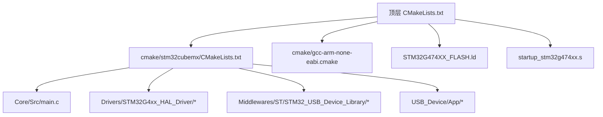
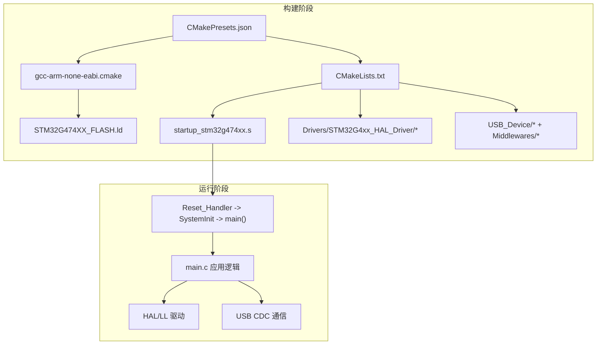
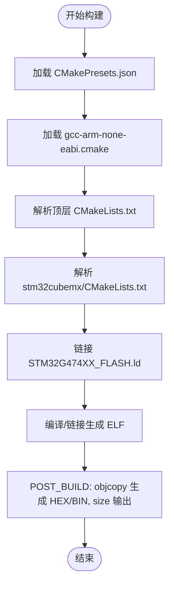
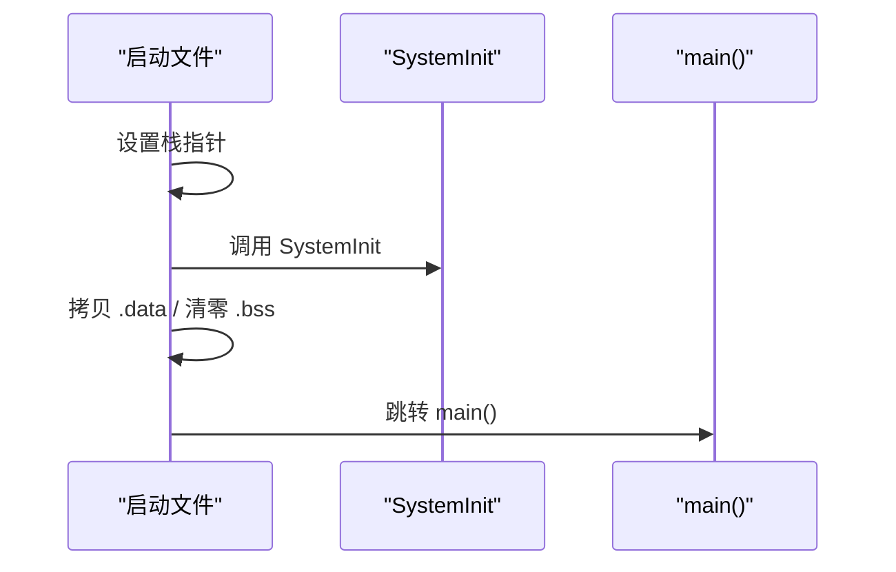
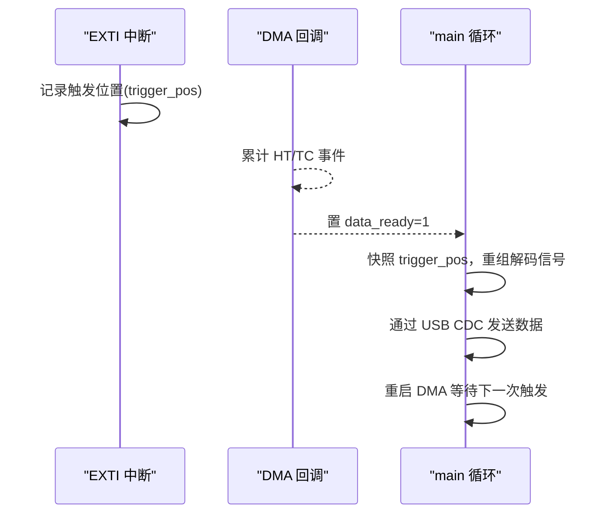
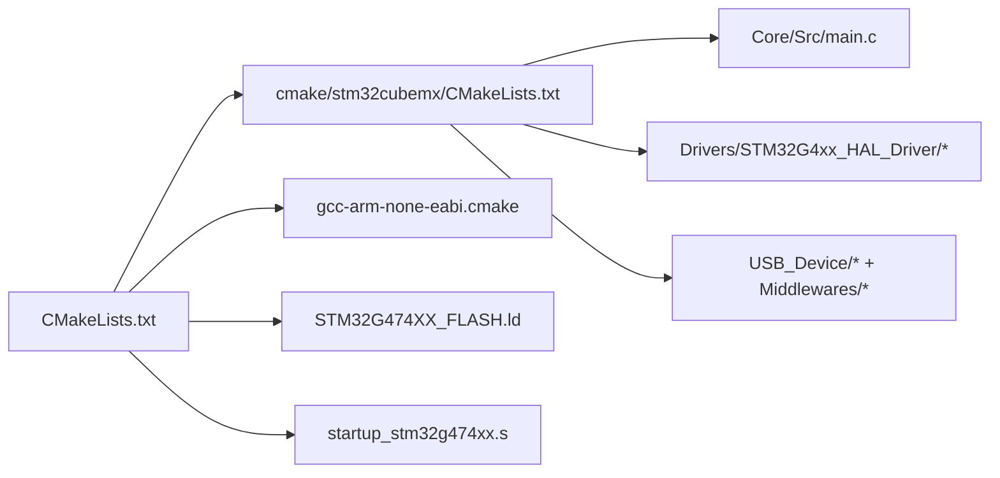

# 部署和维护

<cite>
**本文引用的文件**   
- [CMakeLists.txt](file://CMakeLists.txt)
- [CMakePresets.json](file://CMakePresets.json)
- [gcc-arm-none-eabi.cmake](file://cmake/gcc-arm-none-eabi.cmake)
- [stm32cubemx/CMakeLists.txt](file://cmake/stm32cubemx/CMakeLists.txt)
- [main.c](file://Core/Src/main.c)
- [main.h](file://Core/Inc/main.h)
- [STM32G474XX_FLASH.ld](file://STM32G474XX_FLASH.ld)
- [startup_stm32g474xx.s](file://startup_stm32g474xx.s)
- [.gitignore](file://.gitignore)
</cite>

## 目录
1. [简介](#简介)
2. [项目结构](#项目结构)
3. [核心组件](#核心组件)
4. [架构总览](#架构总览)
5. [详细组件分析](#详细组件分析)
6. [依赖分析](#依赖分析)
7. [性能考虑](#性能考虑)
8. [故障排查指南](#故障排查指南)
9. [结论](#结论)
10. [附录](#附录)

## 简介
本指南面向固件的部署与维护，覆盖从编译构建、产物生成到下载烧录的全流程；同时提供版本管理策略（Git工作流与分支模型）、发布流程、升级机制（含回滚）、生产环境部署要求、备份与恢复方案、检查清单与维护时间表。文档既适合初学者入门，也便于运维人员开展专业维护。

## 项目结构
本项目基于 STM32CubeMX 生成的工程，使用 CMake 进行跨平台构建，目标芯片为 STM32G474xx，工具链为 arm-none-eabi-gcc。关键目录与职责：
- Core/Src 与 Core/Inc：应用主程序与公共头文件
- Drivers：HAL/LL 驱动与 CMSIS 设备支持
- Middlewares：USB 设备库（CDC 类）
- USB_Device：USB 设备应用层与配置
- cmake：工具链与子模块构建脚本
- 根级 CMakeLists.txt：顶层构建入口与后处理（生成 HEX/BIN）
- STM32G474XX_FLASH.ld：链接脚本，定义内存布局
- startup_stm32g474xx.s：启动文件，初始化栈、拷贝 .data、清零 .bss，跳转 main

图表来源
- [CMakeLists.txt:1-77](file://CMakeLists.txt#L1-L77)
- [cmake/stm32cubemx/CMakeLists.txt:1-114](file://cmake/stm32cubemx/CMakeLists.txt#L1-L114)
- [gcc-arm-none-eabi.cmake:1-48](file://cmake/gcc-arm-none-eabi.cmake#L1-L48)
- [STM32G474XX_FLASH.ld:52-68](file://STM32G474XX_FLASH.ld#L52-L68)
- [startup_stm32g474xx.s:58-106](file://startup_stm32g474xx.s#L58-L106)

章节来源
- [CMakeLists.txt:1-77](file://CMakeLists.txt#L1-L77)
- [cmake/stm32cubemx/CMakeLists.txt:1-114](file://cmake/stm32cubemx/CMakeLists.txt#L1-L114)
- [gcc-arm-none-eabi.cmake:1-48](file://cmake/gcc-arm-none-eabi.cmake#L1-L48)
- [STM32G474XX_FLASH.ld:52-68](file://STM32G474XX_FLASH.ld#L52-L68)
- [startup_stm32g474xx.s:58-106](file://startup_stm32g474xx.s#L58-L106)

## 核心组件
- 构建系统
  - 顶层 CMakeLists.txt 定义语言标准、可执行目标、包含路径、宏定义、链接库以及后处理命令（生成 HEX/BIN 并打印 size）。
  - CMakePresets.json 提供 Debug/Release 预设，统一 generator、toolchain 与构建类型。
  - gcc-arm-none-eabi.cmake 指定交叉编译器、目标 CPU/FPU/ABI、优化等级、链接器脚本与裁剪选项。
  - stm32cubemx/CMakeLists.txt 汇总 HAL/LL、USB 设备库与应用源文件，创建对象库并链接至最终可执行体。
- 运行时与外设
  - main.c 实现 ADC1/ADC2 双通道交错采样、DMA 环形缓冲、EXTI 触发捕获、USB CDC 数据上报等逻辑。
  - 启动文件完成复位流程，调用 SystemInit、拷贝 .data、清零 .bss，最后进入 main。
- 链接与内存
  - 链接脚本定义 RAM/FLASH 起始地址与长度，设置堆栈大小，组织各段映射。

章节来源
- [CMakeLists.txt:1-77](file://CMakeLists.txt#L1-L77)
- [CMakePresets.json:1-38](file://CMakePresets.json#L1-L38)
- [gcc-arm-none-eabi.cmake:1-48](file://cmake/gcc-arm-none-eabi.cmake#L1-L48)
- [cmake/stm32cubemx/CMakeLists.txt:1-114](file://cmake/stm32cubemx/CMakeLists.txt#L1-L114)
- [main.c:219-290](file://Core/Src/main.c#L219-L290)
- [startup_stm32g474xx.s:58-106](file://startup_stm32g474xx.s#L58-L106)
- [STM32G474XX_FLASH.ld:52-68](file://STM32G474XX_FLASH.ld#L52-L68)

## 架构总览
下图展示从构建到运行时的整体关系：CMake 通过工具链脚本选择 arm-none-eabi 工具集，链接脚本决定内存布局，启动文件引导至 main，应用层通过 HAL/LL 驱动外设，并通过 USB CDC 输出数据。

图表来源
- [CMakePresets.json:1-38](file://CMakePresets.json#L1-L38)
- [gcc-arm-none-eabi.cmake:1-48](file://cmake/gcc-arm-none-eabi.cmake#L1-L48)
- [CMakeLists.txt:1-77](file://CMakeLists.txt#L1-L77)
- [startup_stm32g474xx.s:58-106](file://startup_stm32g474xx.s#L58-L106)
- [main.c:219-290](file://Core/Src/main.c#L219-L290)

## 详细组件分析

### 构建与产物生成
- 构建入口与目标
  - 顶层 CMakeLists.txt 启用 C/ASM，创建可执行目标，引入 stm32cubemx 子工程，并在 POST_BUILD 阶段使用 objcopy 生成 HEX 与 BIN，同时用 size 打印占用。
- 工具链与链接
  - gcc-arm-none-eabi.cmake 指定编译器族、CPU/FPU/ABI、调试/发布优化等级，并将链接器脚本指向 STM32G474XX_FLASH.ld，启用裁剪与内存使用统计。
- 预设与多配置
  - CMakePresets.json 定义 default/Debug/Release 三种配置，统一 generator 与 toolchain，简化 IDE 或命令行集成。
- 源码组织
  - stm32cubemx/CMakeLists.txt 聚合应用、驱动与中间件源文件，创建对象库并链接至最终可执行体。

图表来源
- [CMakePresets.json:1-38](file://CMakePresets.json#L1-L38)
- [gcc-arm-none-eabi.cmake:1-48](file://cmake/gcc-arm-none-eabi.cmake#L1-L48)
- [CMakeLists.txt:1-77](file://CMakeLists.txt#L1-L77)
- [cmake/stm32cubemx/CMakeLists.txt:1-114](file://cmake/stm32cubemx/CMakeLists.txt#L1-L114)
- [STM32G474XX_FLASH.ld:52-68](file://STM32G474XX_FLASH.ld#L52-L68)

章节来源
- [CMakeLists.txt:1-77](file://CMakeLists.txt#L1-L77)
- [CMakePresets.json:1-38](file://CMakePresets.json#L1-L38)
- [gcc-arm-none-eabi.cmake:1-48](file://cmake/gcc-arm-none-eabi.cmake#L1-L48)
- [cmake/stm32cubemx/CMakeLists.txt:1-114](file://cmake/stm32cubemx/CMakeLists.txt#L1-L114)

### 启动与内存布局
- 启动流程
  - 启动文件在复位后设置栈指针，调用 SystemInit，拷贝 .data 初始值，清零 .bss，初始化静态构造，最后跳转到 main。
- 内存布局
  - 链接脚本定义 FLASH 起始地址与长度、RAM 起始地址与长度，并声明最小堆栈大小。

图表来源
- [startup_stm32g474xx.s:58-106](file://startup_stm32g474xx.s#L58-L106)
- [STM32G474XX_FLASH.ld:52-68](file://STM32G474XX_FLASH.ld#L52-L68)

章节来源
- [startup_stm32g474xx.s:58-106](file://startup_stm32g474xx.s#L58-L106)
- [STM32G474XX_FLASH.ld:52-68](file://STM32G474XX_FLASH.ld#L52-L68)

### 应用主循环与中断/DMA 协作
- 主循环
  - 初始化 HAL、时钟、GPIO、DMA、ADC1/ADC2、USB 设备；启动 ADC 双通道交错 DMA 采集；等待数据就绪标志，重组时间线并通过 USB CDC 发送。
- 中断与回调
  - EXTI 上升沿捕获触发时刻，记录 DMA 剩余计数以定位环形缓冲区位置；DMA 半传输/全传输回调用于判定“触发后”数据是否足够，满足条件则置数据就绪并停止 DMA。
- 数据打包与传输
  - 将环形缓冲中的交错样本解包为线性时序，按行输出十进制字符串，通过 USB CDC 批量发送。

图表来源
- [main.c:85-213](file://Core/Src/main.c#L85-L213)
- [main.c:219-290](file://Core/Src/main.c#L219-L290)

章节来源
- [main.c:85-213](file://Core/Src/main.c#L85-L213)
- [main.c:219-290](file://Core/Src/main.c#L219-L290)

### 错误处理与断言
- 错误处理
  - Error_Handler 关闭全局中断并进入死循环，便于调试定位。
- 断言
  - 若启用 USE_FULL_ASSERT，assert_failed 可用于报告出错文件与行号。

章节来源
- [main.c:530-555](file://Core/Src/main.c#L530-L555)
- [main.h:53-53](file://Core/Inc/main.h#L53-L53)

## 依赖分析
- 构建期依赖
  - 顶层 CMakeLists.txt 依赖 stm32cubemx 子工程与工具链脚本；后者聚合 HAL/LL、USB 设备库与应用源。
- 运行期依赖
  - main.c 依赖 HAL/LL 驱动与 USB CDC 接口；启动文件与链接脚本共同决定运行时入口与内存布局。

图表来源
- [CMakeLists.txt:1-77](file://CMakeLists.txt#L1-L77)
- [cmake/stm32cubemx/CMakeLists.txt:1-114](file://cmake/stm32cubemx/CMakeLists.txt#L1-L114)
- [gcc-arm-none-eabi.cmake:1-48](file://cmake/gcc-arm-none-eabi.cmake#L1-L48)
- [STM32G474XX_FLASH.ld:52-68](file://STM32G474XX_FLASH.ld#L52-L68)
- [startup_stm32g474xx.s:58-106](file://startup_stm32g474xx.s#L58-L106)

章节来源
- [CMakeLists.txt:1-77](file://CMakeLists.txt#L1-L77)
- [cmake/stm32cubemx/CMakeLists.txt:1-114](file://cmake/stm32cubemx/CMakeLists.txt#L1-L114)
- [gcc-arm-none-eabi.cmake:1-48](file://cmake/gcc-arm-none-eabi.cmake#L1-L48)
- [STM32G474XX_FLASH.ld:52-68](file://STM32G474XX_FLASH.ld#L52-L68)
- [startup_stm32g474xx.s:58-106](file://startup_stm32g474xx.s#L58-L106)

## 性能考虑
- 构建优化
  - Release 模式采用 -Os 优化，配合 --gc-sections 裁剪未使用代码，减小体积。
- 运行时效率
  - DMA 环形缓冲降低 CPU 参与，EXTI 仅做轻量标记与位置记录，数据处理在主循环中批量化完成，减少中断上下文开销。
- 内存使用
  - 链接脚本提供最小堆栈与堆大小，建议结合 size/map 输出评估实际占用，必要时调整堆栈或裁剪功能。

[本节为通用指导，不直接分析具体文件]

## 故障排查指南
- 常见问题
  - 无法连接 ST-Link：检查 SWD 接线、供电与目标芯片锁定状态；确认工具链已安装且 PATH 中包含 arm-none-eabi-*。
  - 构建失败：确认 CMake 版本满足要求，清理 build 目录后重试；核对 CMakePresets 与工具链路径。
  - 运行异常：Error_Handler 会停住，可通过调试器查看调用栈；启用断言辅助定位参数错误。
- 日志与诊断
  - 利用 USB CDC 输出采样数据，验证采集链路；结合 map 文件与 size 输出分析资源占用。
- 回退策略
  - 保留上一稳定版本的 HEX/BIN 与构建日志，出现问题时快速回刷旧版本。

章节来源
- [main.c:530-555](file://Core/Src/main.c#L530-L555)
- [CMakeLists.txt:70-76](file://CMakeLists.txt#L70-L76)
- [gcc-arm-none-eabi.cmake:24-48](file://cmake/gcc-arm-none-eabi.cmake#L24-L48)

## 结论
本项目采用 CMake + arm-none-eabi 工具链构建，具备清晰的构建与链接配置，应用层通过 DMA+中断高效采集并通过 USB CDC 输出。遵循本文档的构建、部署、版本管理与维护流程，可有效提升交付质量与运维稳定性。

[本节为总结性内容，不直接分析具体文件]

## 附录

### 一、固件烧录与下载操作指南
- 环境准备
  - 安装 ARM GCC 工具链（arm-none-eabi-*），确保可在命令行访问。
  - 安装 CMake（>= 3.22）与 Ninja 生成器。
  - 安装 ST-Link 驱动与编程工具（如 OpenOCD 或厂商 IDE）。
- 构建步骤
  - 使用预设配置构建：
    - 配置：cmake --preset Debug 或 cmake --preset Release
    - 构建：cmake --build --preset Debug 或 cmake --build --preset Release
  - 产物位置：在对应 build 目录下生成可执行文件与 HEX/BIN。
- 下载与验证
  - 使用 ST-Link 将 HEX/BIN 下载到目标板，复位后观察 LED 与 USB CDC 输出。
  - 通过串口终端读取每行一个十进制采样值，验证采集链路。

章节来源
- [CMakePresets.json:1-38](file://CMakePresets.json#L1-L38)
- [CMakeLists.txt:70-76](file://CMakeLists.txt#L70-L76)
- [main.c:219-290](file://Core/Src/main.c#L219-L290)

### 二、版本管理与发布流程
- Git 工作流
  - 主干分支（main/master）保持可发布状态；特性分支（feature/*）开发新功能；修复分支（fix/*）处理缺陷。
  - 提交信息规范：类型(范围): 描述（例如 feat(usb): 增加 CDC 日志开关）。
- 分支管理
  - 发布分支（release/*）用于冻结与回归测试；热修复分支（hotfix/*）针对线上问题快速修复。
- 标签与发布
  - 使用语义化版本标签（vX.Y.Z）标记发布点；附带构建产物与校验和。
- 变更追踪
  - 维护 CHANGELOG.md，记录新增、修复与破坏性变更。

[本节为通用实践，不直接分析具体文件]

### 三、固件升级机制与回滚策略
- 升级载体
  - 当前工程通过 USB CDC 输出数据，可作为升级通道的基础；建议在应用层增加升级协议与校验。
- 升级流程
  - 主机端发送固件镜像分片，设备端接收并写入备用分区或临时区，完成后切换入口。
- 回滚策略
  - 双区设计（A/B 分区）：新固件写入 B 区，校验通过后切换；失败则回滚至 A 区。
  - 安全校验：对镜像进行签名或 CRC 校验，防止损坏或恶意镜像。
- 兼容性说明
  - 升级前检查硬件版本与配置宏，避免不兼容导致变砖。

[本节为通用设计建议，不直接分析具体文件]

### 四、生产环境部署要求
- 测试验证
  - 单元测试：外设初始化与回调逻辑。
  - 集成测试：端到端采集与 USB CDC 传输。
  - 压力测试：长时间连续采集与传输，监控内存与功耗。
- 质量控制
  - 构建产物签名与哈希校验；自动化流水线生成 HEX/BIN 与 map 文件归档。
- 批量生产
  - 使用批量烧录工具与夹具，统一配置与校准参数；记录每台设备的序列号与固件版本。

[本节为通用实践，不直接分析具体文件]

### 五、备份与恢复方案
- 配置备份
  - 将用户配置与校准参数存储于独立扇区或外部存储，定期导出备份。
- 数据持久化
  - 使用 Flash 非易失区域保存关键状态，注意擦写寿命与磨损均衡。
- 系统恢复
  - 提供恢复模式：上电检测特定引脚或按键进入恢复流程，重新烧录或重置配置。

[本节为通用实践，不直接分析具体文件]

### 六、部署检查清单
- 环境与工具
  - 工具链与 CMake 版本正确；PATH 配置无误。
- 构建与产物
  - 成功生成 HEX/BIN；size 输出符合预期；map 文件归档。
- 下载与验证
  - ST-Link 连接正常；LED 指示与 USB CDC 输出正常。
- 版本与追溯
  - 提交信息与标签一致；CHANGELOG 更新；构建日志留存。
- 质量与安全
  - 校验和/签名验证通过；回滚策略可用。

[本节为通用实践，不直接分析具体文件]

### 七、维护时间表
- 日常
  - 监控构建与 CI 状态；巡检日志与告警。
- 每周
  - 审查变更与缺陷；更新依赖与工具链。
- 每月
  - 回归测试与性能基准；备份与恢复演练。
- 每季度
  - 安全审计与漏洞扫描；发布计划评审。

[本节为通用实践，不直接分析具体文件]

### 八、初学者入门指引
- 快速上手
  - 安装工具链与 CMake；克隆仓库；使用预设构建；连接 ST-Link 下载。
- 常见误区
  - 忽略环境变量；未清理 build 目录；混淆 Debug/Release 产物。
- 学习路径
  - 阅读启动文件与链接脚本理解运行流程；逐步熟悉 HAL/LL 与 USB CDC 用法。

[本节为通用实践，不直接分析具体文件]

### 九、运维专业技能
- 构建系统
  - 自定义 CMake 预设与变量；集成静态分析与覆盖率。
- 调试与定位
  - 使用调试器查看中断与 DMA 状态；结合 map 文件分析符号与占用。
- 可靠性工程
  - 设计看门狗与异常恢复；完善日志与遥测；制定应急预案。

[本节为通用实践，不直接分析具体文件]