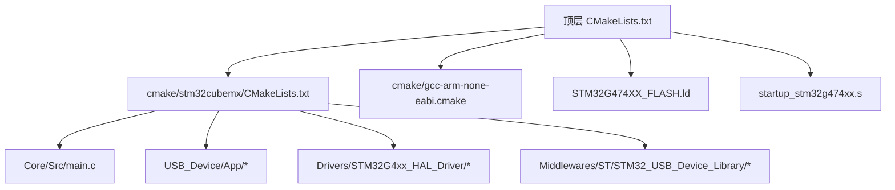
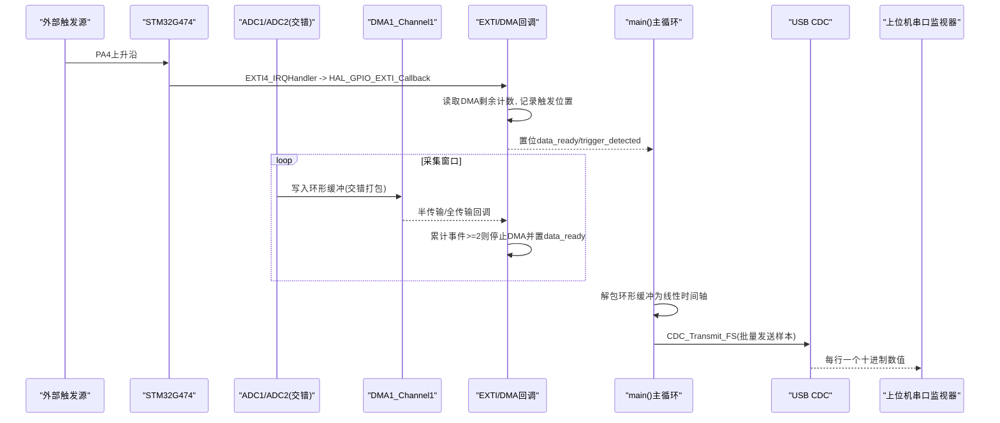
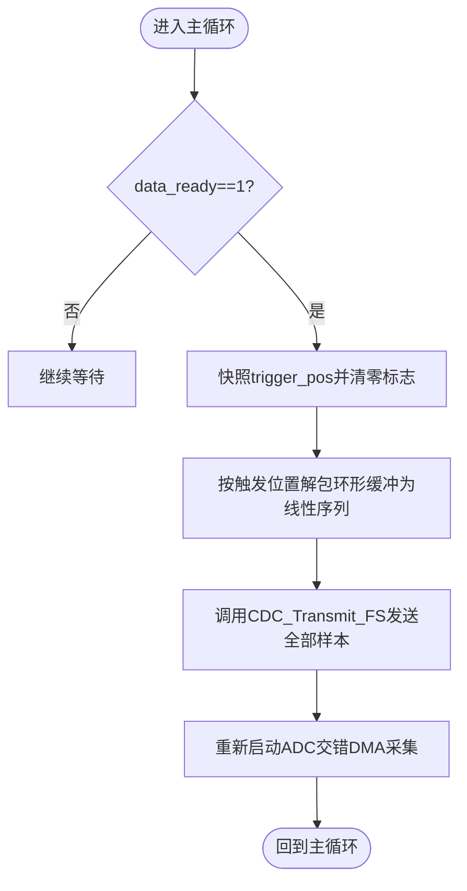
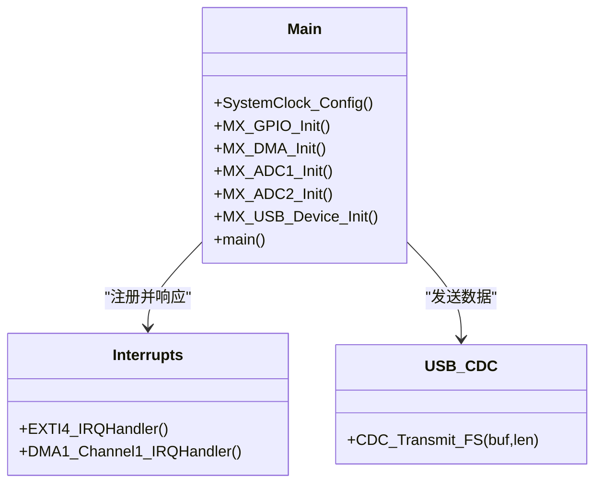
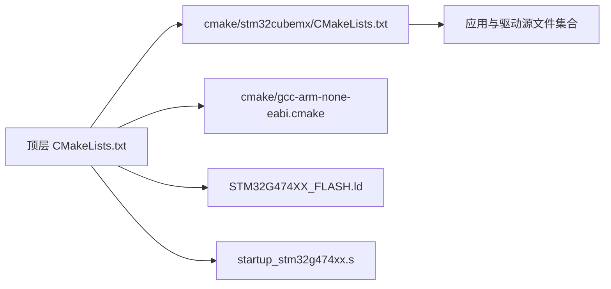

# 快速开始指南

<cite>
**本文引用的文件列表**
- [CMakeLists.txt](file://CMakeLists.txt)
- [CMakePresets.json](file://CMakePresets.json)
- [cmake/gcc-arm-none-eabi.cmake](file://cmake/gcc-arm-none-eabi.cmake)
- [cmake/stm32cubemx/CMakeLists.txt](file://cmake/stm32cubemx/CMakeLists.txt)
- [Core/Src/main.c](file://Core/Src/main.c)
- [Core/Inc/main.h](file://Core/Inc/main.h)
- [Core/Src/stm32g4xx_it.c](file://Core/Src/stm32g4xx_it.c)
- [startup_stm32g474xx.s](file://startup_stm32g474xx.s)
- [STM32G474XX_FLASH.ld](file://STM32G474XX_FLASH.ld)
- [USB_Device/App/usb_device.c](file://USB_Device/App/usb_device.c)
- [USB_Device/App/usbd_cdc_if.c](file://USB_Device/App/usbd_cdc_if.c)
- [USB_Device/App/usbd_desc.c](file://USB_Device/App/usbd_desc.c)
- [Middlewares/ST/STM32_USB_Device_Library/Class/CDC/Inc/usbd_cdc.h](file://Middlewares/ST/STM32_USB_Device_Library/Class/CDC/Inc/usbd_cdc.h)
</cite>

## 目录
1. [简介](#简介)
2. [项目结构](#项目结构)
3. [核心组件](#核心组件)
4. [架构总览](#架构总览)
5. [详细组件分析](#详细组件分析)
6. [依赖关系分析](#依赖关系分析)
7. [性能与资源特性](#性能与资源特性)
8. [常见问题与故障排除](#常见问题与故障排除)
9. [结论](#结论)
10. [附录：构建、烧录与上位机验证步骤](#附录构建烧录与上位机验证步骤)

## 简介
本指南面向首次接触该项目的开发者，目标是帮助你在最短时间内完成开发环境搭建、编译生成固件、烧录到STM32G474芯片，并通过USB CDC虚拟串口将采集到的超声波信号数据发送到上位机进行观察。系统基于STM32CubeMX生成的工程，使用ARM GCC工具链与CMake/Ninja构建，采用ADC双通道交错采样+DMA环形缓冲+EXTI外部触发+USB CDC上报的完整数据采集链路。

## 项目结构
仓库采用STM32CubeMX标准分层组织方式：
- Core：应用主循环、外设初始化、中断处理等用户代码
- Drivers：HAL/LL驱动与CMSIS内核支持
- Middlewares：USB设备库（CDC类）
- USB_Device：USB设备描述符、CDC接口实现
- cmake：交叉编译工具链配置与CMake子模块
- 链接脚本与启动文件：定义内存布局与复位流程

图表来源
- [CMakeLists.txt:1-77](file://CMakeLists.txt#L1-L77)
- [cmake/stm32cubemx/CMakeLists.txt:1-114](file://cmake/stm32cubemx/CMakeLists.txt#L1-L114)
- [cmake/gcc-arm-none-eabi.cmake:1-48](file://cmake/gcc-arm-none-eabi.cmake#L1-L48)
- [STM32G474XX_FLASH.ld:52-68](file://STM32G474XX_FLASH.ld#L52-L68)
- [startup_stm32g474xx.s:58-102](file://startup_stm32g474xx.s#L58-L102)

章节来源
- [CMakeLists.txt:1-77](file://CMakeLists.txt#L1-L77)
- [cmake/stm32cubemx/CMakeLists.txt:1-114](file://cmake/stm32cubemx/CMakeLists.txt#L1-L114)

## 核心组件
- 应用主程序与外设初始化：负责系统时钟、GPIO、DMA、ADC1/ADC2、USB设备初始化，并启动ADC交错模式DMA采集。
- 触发与数据处理：通过PA4上升沿EXTI捕获触发时刻，结合DMA剩余计数计算触发位置；在DMA半传输/全传输回调中累计事件以判定采集窗口结束；将环形缓冲解包为线性时间轴后通过USB CDC发送。
- USB CDC通信：作为虚拟串口向主机输出每行一个十进制样本的数据流。
- 构建与工具链：CMake+Ninja + ARM GCC交叉编译，生成ELF/HEX/BIN，并打印尺寸统计。

章节来源
- [Core/Src/main.c:219-290](file://Core/Src/main.c#L219-L290)
- [Core/Src/main.c:488-520](file://Core/Src/main.c#L488-L520)
- [Core/Src/main.c:469-481](file://Core/Src/main.c#L469-L481)
- [Core/Src/main.c:344-464](file://Core/Src/main.c#L344-L464)
- [USB_Device/App/usb_device.c:66-88](file://USB_Device/App/usb_device.c#L66-L88)
- [USB_Device/App/usbd_cdc_if.c:281-293](file://USB_Device/App/usbd_cdc_if.c#L281-L293)
- [CMakeLists.txt:70-76](file://CMakeLists.txt#L70-L76)

## 架构总览
下图展示了从硬件触发到上位机接收的端到端数据流。

图表来源
- [Core/Src/main.c:91-131](file://Core/Src/main.c#L91-L131)
- [Core/Src/main.c:156-171](file://Core/Src/main.c#L156-L171)
- [Core/Src/main.c:178-212](file://Core/Src/main.c#L178-L212)
- [Core/Src/stm32g4xx_it.c:205-228](file://Core/Src/stm32g4xx_it.c#L205-L228)
- [USB_Device/App/usbd_cdc_if.c:281-293](file://USB_Device/App/usbd_cdc_if.c#L281-L293)

## 详细组件分析

### 应用主循环与采集控制
- 入口流程：HAL初始化 -> 系统时钟配置 -> GPIO/DMA/ADC1/ADC2/USB初始化 -> 启动ADC交错DMA环形采集 -> 主循环等待data_ready标志。
- 触发逻辑：EXTI4上升沿回调中读取DMA剩余计数，计算触发点在环形缓冲中的位置，并设置触发标志。
- 采集窗口判定：DMA半传输/全传输回调各计一次，累计达到2次即认为已收集到足够的“预触发+后触发”数据，停止DMA并置data_ready。
- 数据处理：根据触发位置快照，将环形缓冲按偶/奇索引分别映射为ADC1/ADC2数据，重组为线性时间轴。
- 数据上报：将线性时间轴的每个样本格式化为十进制字符串并以换行分隔，一次性通过USB CDC发送。

图表来源
- [Core/Src/main.c:259-290](file://Core/Src/main.c#L259-L290)
- [Core/Src/main.c:156-171](file://Core/Src/main.c#L156-L171)
- [Core/Src/main.c:178-212](file://Core/Src/main.c#L178-L212)

章节来源
- [Core/Src/main.c:219-290](file://Core/Src/main.c#L219-L290)
- [Core/Src/main.c:91-131](file://Core/Src/main.c#L91-L131)
- [Core/Src/main.c:156-212](file://Core/Src/main.c#L156-L212)

### 外设与中断
- GPIO：PA4配置为上升沿外部中断，PC13为LED指示（开漏低电平点亮）。
- DMA：DMA1通道1用于ADC1数据搬运，优先级最高，开启半传输/全传输中断。
- ADC：ADC1/ADC2配置为12位分辨率、连续转换、交错模式，单通道差分输入，采样时间极短，配合DMA环形缓冲实现高速采集。
- 中断向量：EXTI4与DMA1_Channel1中断服务函数转发至HAL层回调。

图表来源
- [Core/Src/main.c:488-520](file://Core/Src/main.c#L488-L520)
- [Core/Src/main.c:469-481](file://Core/Src/main.c#L469-L481)
- [Core/Src/main.c:344-464](file://Core/Src/main.c#L344-L464)
- [Core/Src/stm32g4xx_it.c:205-228](file://Core/Src/stm32g4xx_it.c#L205-L228)
- [USB_Device/App/usbd_cdc_if.c:281-293](file://USB_Device/App/usbd_cdc_if.c#L281-L293)

章节来源
- [Core/Src/main.c:488-520](file://Core/Src/main.c#L488-L520)
- [Core/Src/main.c:469-481](file://Core/Src/main.c#L469-L481)
- [Core/Src/main.c:344-464](file://Core/Src/main.c#L344-L464)
- [Core/Src/stm32g4xx_it.c:205-228](file://Core/Src/stm32g4xx_it.c#L205-L228)

### USB CDC与设备描述符
- 设备枚举：VID/PID、产品名、接口描述符由usbd_desc.c提供。
- CDC类：使用USBD_CDC类，配置FS端点大小（64字节），提供CDC_Transmit_FS供应用调用。
- 数据格式：每行一个十进制数值，末尾换行，便于上位机逐行解析。

章节来源
- [USB_Device/App/usbd_desc.c:65-71](file://USB_Device/App/usbd_desc.c#L65-L71)
- [USB_Device/App/usb_device.c:66-88](file://USB_Device/App/usb_device.c#L66-L88)
- [USB_Device/App/usbd_cdc_if.c:281-293](file://USB_Device/App/usbd_cdc_if.c#L281-L293)
- [Middlewares/ST/STM32_USB_Device_Library/Class/CDC/Inc/usbd_cdc.h:44-68](file://Middlewares/ST/STM32_USB_Device_Library/Class/CDC/Inc/usbd_cdc.h#L44-L68)

## 依赖关系分析
- 构建系统：顶层CMakeLists启用C/ASM，包含stm32cubemx子模块，后者汇总所有源文件、头文件路径与宏定义，并创建静态对象库供最终可执行目标链接。
- 工具链：gcc-arm-none-eabi.cmake指定arm-none-eabi前缀、CPU/FPU/ABI参数、调试/发布优化等级、链接脚本与裁剪选项。
- 链接脚本：定义RAM/FLASH起始地址与大小、堆栈最小值、段布局。
- 启动文件：Reset_Handler设置栈指针、拷贝.data、清零.bss、调用main。

图表来源
- [CMakeLists.txt:1-77](file://CMakeLists.txt#L1-L77)
- [cmake/stm32cubemx/CMakeLists.txt:1-114](file://cmake/stm32cubemx/CMakeLists.txt#L1-L114)
- [cmake/gcc-arm-none-eabi.cmake:1-48](file://cmake/gcc-arm-none-eabi.cmake#L1-L48)
- [STM32G474XX_FLASH.ld:52-68](file://STM32G474XX_FLASH.ld#L52-L68)
- [startup_stm32g474xx.s:58-102](file://startup_stm32g474xx.s#L58-L102)

章节来源
- [CMakeLists.txt:1-77](file://CMakeLists.txt#L1-L77)
- [cmake/stm32cubemx/CMakeLists.txt:1-114](file://cmake/stm32cubemx/CMakeLists.txt#L1-L114)
- [cmake/gcc-arm-none-eabi.cmake:1-48](file://cmake/gcc-arm-none-eabi.cmake#L1-L48)
- [STM32G474XX_FLASH.ld:52-68](file://STM32G474XX_FLASH.ld#L52-L68)
- [startup_stm32g474xx.s:58-102](file://startup_stm32g474xx.s#L58-L102)

## 性能与资源特性
- 采样率与时序：ADC配置为高时钟分频与极短采样时间，DMA环形缓冲保证零拷贝搬运；触发前后样本数量由缓冲区大小与阈值决定。
- 内存占用：环形缓冲与解码缓冲区位于RAM；链接脚本定义了最小堆栈与堆大小，避免溢出。
- 传输吞吐：USB FS Bulk端点最大包长64字节，应用侧累积整批数据再发送，减少频繁小包开销。

章节来源
- [Core/Src/main.c:344-464](file://Core/Src/main.c#L344-L464)
- [Core/Src/main.c:53-70](file://Core/Src/main.c#L53-L70)
- [STM32G474XX_FLASH.ld:56-68](file://STM32G474XX_FLASH.ld#L56-L68)
- [Middlewares/ST/STM32_USB_Device_Library/Class/CDC/Inc/usbd_cdc.h:56-68](file://Middlewares/ST/STM32_USB_Device_Library/Class/CDC/Inc/usbd_cdc.h#L56-L68)

## 常见问题与故障排除
- 无法识别USB CDC设备
  - 检查设备描述符是否生效（产品名、VID/PID），确认USB初始化成功。
  - 参考：[USB_Device/App/usbd_desc.c:65-71](file://USB_Device/App/usbd_desc.c#L65-L71)、[USB_Device/App/usb_device.c:66-88](file://USB_Device/App/usb_device.c#L66-L88)
- 上位机无数据或乱码
  - 确认端口打开后能收到每行一个十进制数值的文本流；若为空，检查data_ready标志与CDC发送是否被阻塞。
  - 参考：[Core/Src/main.c:178-212](file://Core/Src/main.c#L178-L212)、[USB_Device/App/usbd_cdc_if.c:281-293](file://USB_Device/App/usbd_cdc_if.c#L281-L293)
- 触发无效或波形错位
  - 检查PA4引脚连接与上升沿极性；确认EXTI中断优先级与DMA回调事件计数逻辑。
  - 参考：[Core/Src/main.c:91-131](file://Core/Src/main.c#L91-L131)、[Core/Src/stm32g4xx_it.c:205-228](file://Core/Src/stm32g4xx_it.c#L205-L228)
- 编译失败或找不到工具链
  - 确保arm-none-eabi-gcc在PATH中，CMake预设指向正确工具链文件。
  - 参考：[cmake/gcc-arm-none-eabi.cmake:1-48](file://cmake/gcc-arm-none-eabi.cmake#L1-L48)、[CMakePresets.json:1-38](file://CMakePresets.json#L1-L38)
- 运行崩溃或卡死
  - 检查Error_Handler是否被调用；核对堆栈/堆大小与RAM布局。
  - 参考：[Core/Src/main.c:530-539](file://Core/Src/main.c#L530-L539)、[STM32G474XX_FLASH.ld:56-68](file://STM32G474XX_FLASH.ld#L56-L68)

章节来源
- [USB_Device/App/usbd_desc.c:65-71](file://USB_Device/App/usbd_desc.c#L65-L71)
- [USB_Device/App/usb_device.c:66-88](file://USB_Device/App/usb_device.c#L66-L88)
- [Core/Src/main.c:178-212](file://Core/Src/main.c#L178-L212)
- [USB_Device/App/usbd_cdc_if.c:281-293](file://USB_Device/App/usbd_cdc_if.c#L281-L293)
- [Core/Src/main.c:91-131](file://Core/Src/main.c#L91-L131)
- [Core/Src/stm32g4xx_it.c:205-228](file://Core/Src/stm32g4xx_it.c#L205-L228)
- [cmake/gcc-arm-none-eabi.cmake:1-48](file://cmake/gcc-arm-none-eabi.cmake#L1-L48)
- [CMakePresets.json:1-38](file://CMakePresets.json#L1-L38)
- [Core/Src/main.c:530-539](file://Core/Src/main.c#L530-L539)
- [STM32G474XX_FLASH.ld:56-68](file://STM32G474XX_FLASH.ld#L56-L68)

## 结论
本项目提供了完整的STM32G474超声波信号采集方案：以EXTI触发为门控，ADC交错+DMA环形缓冲实现高速采集，主循环解包并经由USB CDC上报至上位机。借助CMake与ARM GCC工具链，构建流程清晰、产物齐全，适合快速上手与二次开发。

## 附录：构建、烧录与上位机验证步骤

### 一、开发环境搭建
- 安装ARM GCC工具链
  - 下载并安装arm-none-eabi-gcc，确保命令行可用（arm-none-eabi-gcc --version）。
  - 参考：[cmake/gcc-arm-none-eabi.cmake:1-16](file://cmake/gcc-arm-none-eabi.cmake#L1-L16)
- 安装CMake与Ninja
  - 安装CMake（版本≥3.22）与Ninja生成器。
  - 参考：[CMakeLists.txt:1](file://CMakeLists.txt#L1)、[CMakePresets.json:7](file://CMakePresets.json#L7)
- IDE可选
  - VS Code + CMake Tools / STM32CubeIDE均可。若使用VS Code，建议启用clangd（工程已导出compile_commands.json）。
  - 参考：[CMakeLists.txt:25](file://CMakeLists.txt#L25)

### 二、源码获取与构建
- 进入工程根目录
  - Windows示例：cd 
- 配置与构建（使用CMake预设）
  - 配置Debug：cmake --preset Debug
  - 构建：cmake --build build/Debug
  - 或使用Release预设：cmake --preset Release && cmake --build build/Release
  - 参考：[CMakePresets.json:1-38](file://CMakePresets.json#L1-L38)
- 构建产物
  - 自动生成ELF、HEX、BIN，并在控制台输出尺寸统计。
  - 参考：[CMakeLists.txt:70-76](file://CMakeLists.txt#L70-L76)

### 三、固件烧录
- 准备调试器
  - ST-Link V2/V3或兼容调试器，连接SWD（SWCLK/SWDIO/GND/3.3V）。
- 使用OpenOCD烧录（示例）
  - 生成hex后，使用openocd命令将HEX下载到Flash。
  - 参考链接脚本与启动流程：
    - [STM32G474XX_FLASH.ld:52-68](file://STM32G474XX_FLASH.ld#L52-L68)
    - [startup_stm32g474xx.s:58-102](file://startup_stm32g474xx.s#L58-L102)
- 使用IDE内置烧录
  - 在IDE中选择对应调试器与目标芯片，直接点击“Download/Run”。

### 四、上位机软件准备
- 打开串口监视器
  - 选择设备管理器中出现的“STM32 Virtual ComPort”对应的COM口。
  - 波特率：任意（CDC不依赖固定波特率）。
  - 数据格式：8N1。
- 观察数据
  - 每行一个十进制数值，表示一次采集窗口的样本序列。
  - 参考：[Core/Src/main.c:178-212](file://Core/Src/main.c#L178-L212)、[USB_Device/App/usbd_desc.c:65-71](file://USB_Device/App/usbd_desc.c#L65-L71)

### 五、基本测试验证
- 硬件连接
  - 外部触发信号接PA4（上升沿触发）。
  - LED指示灯PC13（低电平点亮）可用于观察运行状态。
- 上电运行
  - 连接USB线到电脑，设备应枚举为虚拟串口。
  - 打开串口监视器，应看到持续输出的数字行。
- 触发验证
  - 给PA4施加一个上升沿脉冲，应在下一次采集窗口结束后收到一批新数据。
  - 参考：
    - [Core/Src/main.c:488-520](file://Core/Src/main.c#L488-L520)
    - [Core/Src/main.c:91-131](file://Core/Src/main.c#L91-L131)
    - [Core/Src/stm32g4xx_it.c:205-228](file://Core/Src/stm32g4xx_it.c#L205-L228)