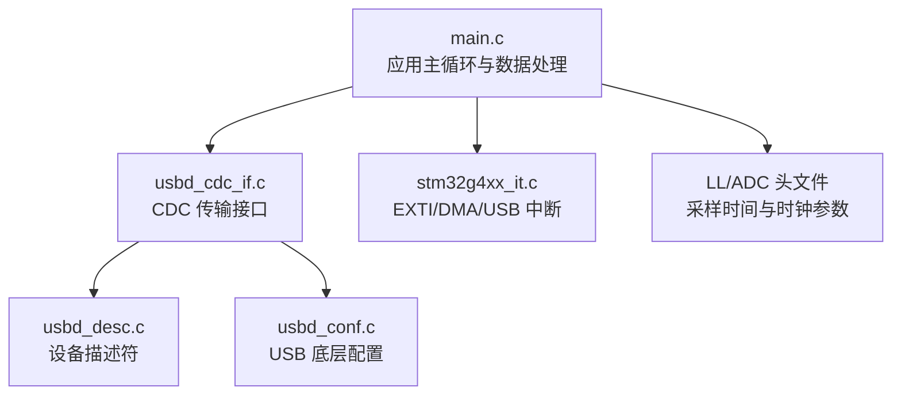
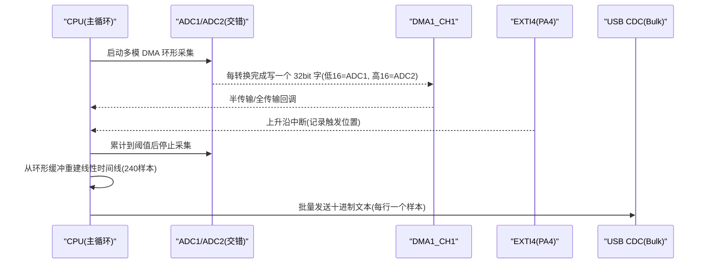
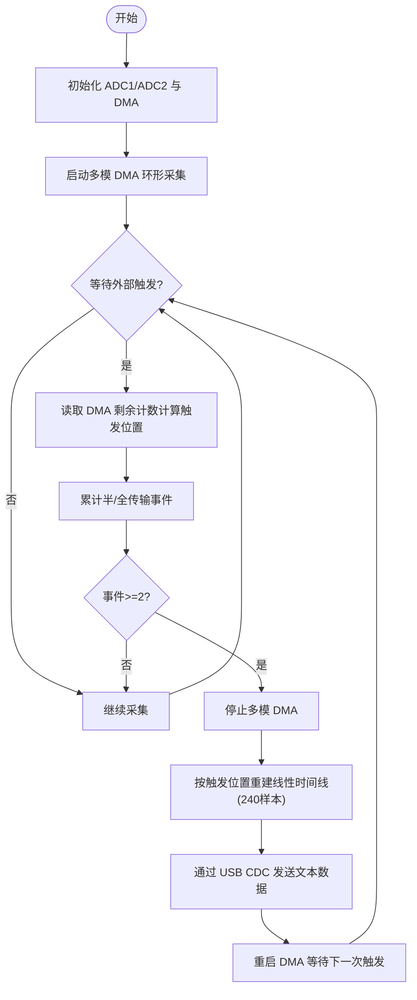
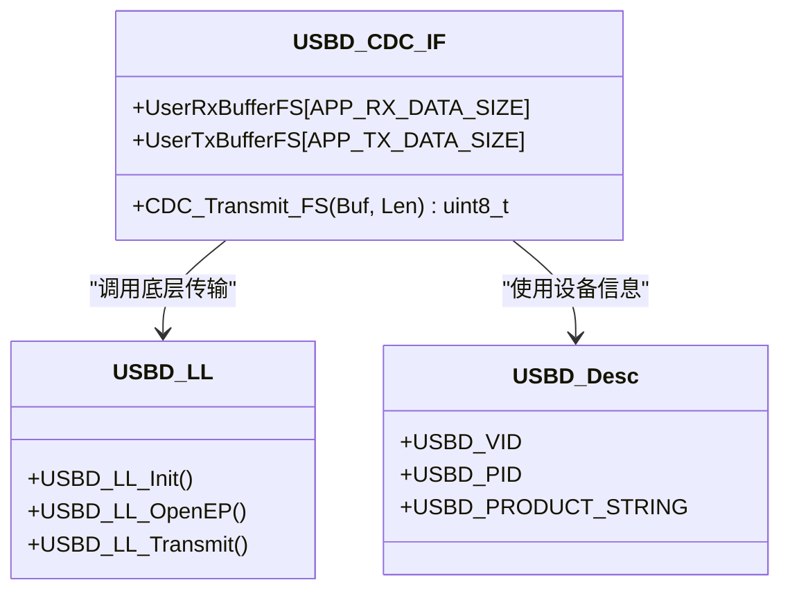
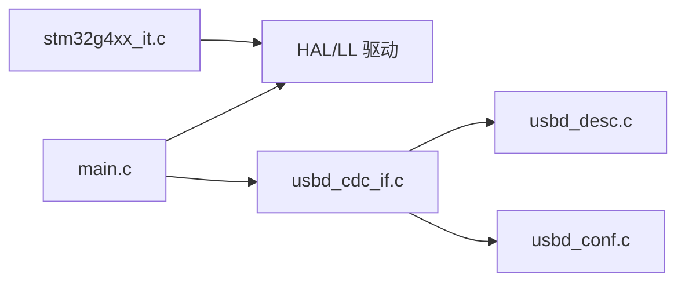

# 技术规格和性能指标

<cite>
**本文引用的文件列表**
- [Core/Src/main.c](file://Core/Src/main.c)
- [Core/Inc/main.h](file://Core/Inc/main.h)
- [Core/Src/stm32g4xx_it.c](file://Core/Src/stm32g4xx_it.c)
- [USB_Device/App/usbd_cdc_if.c](file://USB_Device/App/usbd_cdc_if.c)
- [USB_Device/App/usbd_cdc_if.h](file://USB_Device/App/usbd_cdc_if.h)
- [USB_Device/App/usbd_desc.c](file://USB_Device/App/usbd_desc.c)
- [USB_Device/Target/usbd_conf.c](file://USB_Device/Target/usbd_conf.c)
- [CMakeLists.txt](file://CMakeLists.txt)
- [Drivers/STM32G4xx_HAL_Driver/Inc/stm32g4xx_ll_adc.h](file://Drivers/STM32G4xx_HAL_Driver/Inc/stm32g4xx_ll_adc.h)
</cite>

## 目录
1. [简介](#简介)
2. [项目结构](#项目结构)
3. [核心组件](#核心组件)
4. [架构总览](#架构总览)
5. [详细组件分析](#详细组件分析)
6. [依赖关系分析](#依赖关系分析)
7. [性能考虑](#性能考虑)
8. [故障排查指南](#故障排查指南)
9. [结论](#结论)
10. [附录](#附录)

## 简介
本文件为基于 STM32G474 的超声波信号采集系统技术规格与性能指标文档。系统采用双通道 ADC 交错模式实现高采样率数据采集，通过 DMA 将数据搬运至环形缓冲区，外部触发中断捕获触发时刻，随后在主循环中重建时间线并通过 USB CDC 以文本格式传输至上位机。构建系统使用 CMake，工具链为 ARM GCC。

## 项目结构
- 应用主程序位于 Core/Src/main.c，负责外设初始化、DMA/ADC 配置、触发处理、数据重组与 USB 发送。
- USB CDC 接口实现位于 USB_Device/App/usbd_cdc_if.c/.h，提供 CDC_Transmit_FS 等 API。
- USB 描述符与底层驱动位于 USB_Device/App/usbd_desc.c 与 USB_Device/Target/usbd_conf.c。
- 中断服务程序位于 Core/Src/stm32g4xx_it.c，包含 EXTI、DMA、USB 中断入口。
- 构建脚本位于 CMakeLists.txt，定义工程名、语言标准、链接库及后处理命令（生成 HEX/BIN）。

图表来源
- [Core/Src/main.c:219-290](file://Core/Src/main.c#L219-L290)
- [USB_Device/App/usbd_cdc_if.c:281-293](file://USB_Device/App/usbd_cdc_if.c#L281-L293)
- [Core/Src/stm32g4xx_it.c:205-242](file://Core/Src/stm32g4xx_it.c#L205-L242)
- [USB_Device/App/usbd_desc.c:147-167](file://USB_Device/App/usbd_desc.c#L147-L167)
- [USB_Device/Target/usbd_conf.c:394-452](file://USB_Device/Target/usbd_conf.c#L394-L452)
- [Drivers/STM32G4xx_HAL_Driver/Inc/stm32g4xx_ll_adc.h:3654-3669](file://Drivers/STM32G4xx_HAL_Driver/Inc/stm32g4xx_ll_adc.h#L3654-L3669)

章节来源
- [Core/Src/main.c:219-290](file://Core/Src/main.c#L219-L290)
- [CMakeLists.txt:1-77](file://CMakeLists.txt#L1-L77)

## 核心组件
- 微控制器：STM32G474（Cortex-M4F）
- ADC：双通道交错模式（ADC1/ADC2），12 位分辨率，连续转换，DMA 环形缓冲
- DMA：DMA1 Channel1，半传输/全传输回调用于触发后样本计数与停止
- 外部触发：PA4 上升沿 EXTI4，记录触发时刻在环形缓冲中的位置
- USB CDC：全速（FS）虚拟串口，Bulk IN/OUT 端点，最大包长 64 字节
- 构建系统：CMake + ARM GCC，输出 HEX/BIN 并打印尺寸

关键运行参数（来自源码常量与注释）
- 环形缓冲区大小：120 个 uint32_t 字（每个字低 16 位为 ADC1，高 16 位为 ADC2）
- 总样本数：240（交错合并后的线性时间线）
- 预触发样本：80（约 10 μs @ 8 MSPS）
- 后触发样本：160（约 20 μs @ 8 MSPS）
- 采样率目标：8 MSPS（双通道交错）
- 分辨率：12 位

章节来源
- [Core/Src/main.c:53-70](file://Core/Src/main.c#L53-L70)
- [Core/Src/main.c:156-171](file://Core/Src/main.c#L156-L171)
- [Core/Src/main.c:344-407](file://Core/Src/main.c#L344-L407)
- [Core/Src/main.c:414-464](file://Core/Src/main.c#L414-L464)
- [Core/Src/main.c:469-481](file://Core/Src/main.c#L469-L481)
- [Core/Src/main.c:488-520](file://Core/Src/main.c#L488-L520)

## 架构总览
系统启动后初始化系统时钟、GPIO、DMA、ADC1/ADC2、USB CDC，并以 DMA 环形模式启动双通道交错采集。当 PA4 出现上升沿时，EXTI 中断记录当前 DMA 写入位置作为触发点；随后根据 DMA 半传输/全传输事件累计达到阈值后停止采集，主循环从环形缓冲按触发位置重建线性时间线，并将 240 个样本转换为十进制字符串经 USB CDC 发送。

图表来源
- [Core/Src/main.c:249-255](file://Core/Src/main.c#L249-L255)
- [Core/Src/main.c:91-113](file://Core/Src/main.c#L91-L113)
- [Core/Src/main.c:119-131](file://Core/Src/main.c#L119-L131)
- [Core/Src/main.c:156-171](file://Core/Src/main.c#L156-L171)
- [Core/Src/main.c:178-212](file://Core/Src/main.c#L178-L212)
- [USB_Device/App/usbd_cdc_if.c:281-293](file://USB_Device/App/usbd_cdc_if.c#L281-L293)

## 详细组件分析

### ADC 与 DMA 子系统
- 双通道交错模式：ADC1 为主，ADC2 为从，模式设置为交错（INTERL），DMA 访问宽度支持 12/10 位打包。
- 采样时间：两通道均配置为 2.5 周期，有利于在高时钟下缩短转换时间。
- DMA 环形缓冲：120 个 32bit 字，每次 DMA 半传输/全传输回调用于统计“触发后”的事件次数，达到 2 次即停止采集。
- 数据布局：每个 32bit 字的低 16 位为 ADC1 样本，高 16 位为 ADC2 样本，解码后得到交错序列。

图表来源
- [Core/Src/main.c:344-407](file://Core/Src/main.c#L344-L407)
- [Core/Src/main.c:414-464](file://Core/Src/main.c#L414-L464)
- [Core/Src/main.c:469-481](file://Core/Src/main.c#L469-L481)
- [Core/Src/main.c:119-131](file://Core/Src/main.c#L119-L131)
- [Core/Src/main.c:156-171](file://Core/Src/main.c#L156-L171)

章节来源
- [Core/Src/main.c:344-407](file://Core/Src/main.c#L344-L407)
- [Core/Src/main.c:414-464](file://Core/Src/main.c#L414-L464)
- [Core/Src/main.c:469-481](file://Core/Src/main.c#L469-L481)
- [Core/Src/main.c:119-131](file://Core/Src/main.c#L119-L131)
- [Core/Src/main.c:156-171](file://Core/Src/main.c#L156-L171)

### 外部触发与中断
- 触发引脚：PA4，上升沿中断，优先级设为最高。
- 中断处理：HAL_GPIO_EXTI_Callback 中读取 DMA 剩余计数，计算环形缓冲中的触发位置，并复位“触发后事件计数”。
- 防抖与互斥：在 UART/USB 传输期间忽略新的触发，避免回显干扰；仅响应首次触发边沿。

章节来源
- [Core/Src/main.c:488-520](file://Core/Src/main.c#L488-L520)
- [Core/Src/main.c:91-113](file://Core/Src/main.c#L91-L113)
- [Core/Src/stm32g4xx_it.c:205-214](file://Core/Src/stm32g4xx_it.c#L205-L214)

### USB CDC 通信
- 设备类：CDC（虚拟串口），全速（FS）模式，VID/PID 由描述符定义。
- 端点：中断端点用于控制，两个 Bulk 端点用于数据传输，最大包长 64 字节（FS）。
- 传输接口：CDC_Transmit_FS 非阻塞发送，内部检查 TxState，忙则返回 BUSY。
- 接收缓冲与发送缓冲大小：各 2048 字节。
- 波特率：CDC 不强制固定波特率，上层可协商；本实现未处理 SET_LINE_CODING，默认保持主机侧设置。

图表来源
- [USB_Device/App/usbd_cdc_if.h:51-53](file://USB_Device/App/usbd_cdc_if.h#L51-L53)
- [USB_Device/App/usbd_cdc_if.c:281-293](file://USB_Device/App/usbd_cdc_if.c#L281-L293)
- [USB_Device/App/usbd_desc.c:65-72](file://USB_Device/App/usbd_desc.c#L65-L72)
- [USB_Device/Target/usbd_conf.c:394-452](file://USB_Device/Target/usbd_conf.c#L394-L452)

章节来源
- [USB_Device/App/usbd_cdc_if.c:281-293](file://USB_Device/App/usbd_cdc_if.c#L281-L293)
- [USB_Device/App/usbd_cdc_if.h:51-53](file://USB_Device/App/usbd_cdc_if.h#L51-L53)
- [USB_Device/App/usbd_desc.c:147-167](file://USB_Device/App/usbd_desc.c#L147-L167)
- [USB_Device/Target/usbd_conf.c:394-452](file://USB_Device/Target/usbd_conf.c#L394-L452)

### 构建系统与软件环境
- 构建系统：CMake 3.22+，启用 C/C++ 与 ASM 语言支持。
- 编译器：ARM GCC（通过工具链配置文件引入）。
- 工程名：G4test，输出 HEX/BIN 并在后处理阶段打印尺寸。
- 标准：C11，开启扩展。

章节来源
- [CMakeLists.txt:1-77](file://CMakeLists.txt#L1-L77)

## 依赖关系分析
- main.c 依赖 HAL/LL 外设驱动（ADC、DMA、GPIO、USB）、USB CDC 接口函数。
- usbd_cdc_if.c 依赖 USB 设备库与底层 PCD 抽象。
- stm32g4xx_it.c 暴露全局中断入口，转发到 HAL 层回调。
- usbd_desc.c 提供设备/配置/接口描述符，供 CDC 类使用。
- usbd_conf.c 配置 USB 时钟源（HSI48）、端点与 PMA 内存映射。

图表来源
- [Core/Src/main.c:219-290](file://Core/Src/main.c#L219-L290)
- [USB_Device/App/usbd_cdc_if.c:281-293](file://USB_Device/App/usbd_cdc_if.c#L281-L293)
- [USB_Device/App/usbd_desc.c:147-167](file://USB_Device/App/usbd_desc.c#L147-L167)
- [USB_Device/Target/usbd_conf.c:394-452](file://USB_Device/Target/usbd_conf.c#L394-L452)
- [Core/Src/stm32g4xx_it.c:205-242](file://Core/Src/stm32g4xx_it.c#L205-L242)

章节来源
- [Core/Src/main.c:219-290](file://Core/Src/main.c#L219-L290)
- [USB_Device/App/usbd_cdc_if.c:281-293](file://USB_Device/App/usbd_cdc_if.c#L281-L293)
- [USB_Device/App/usbd_desc.c:147-167](file://USB_Device/App/usbd_desc.c#L147-L167)
- [USB_Device/Target/usbd_conf.c:394-452](file://USB_Device/Target/usbd_conf.c#L394-L452)
- [Core/Src/stm32g4xx_it.c:205-242](file://Core/Src/stm32g4xx_it.c#L205-L242)

## 性能考虑
- 采样率与分辨率
  - 目标采样率：8 MSPS（双通道交错）
  - 分辨率：12 位
  - 采样时间：2.5 周期（有助于在高时钟下满足时序）
- 数据路径与时延
  - DMA 环形缓冲减少 CPU 参与，降低抖动
  - 触发位置快照与事件计数确保稳定的前后触发窗口
- 传输带宽
  - USB FS Bulk 最大包长 64 字节，单次发送 240 个样本需多次分包
  - 文本格式（十进制字符串）开销较大，但便于上位机解析
- 内存占用
  - 环形缓冲：120 × 4 = 480 字节
  - 线性时间线：240 × 2 = 480 字节
  - USB 收发缓冲：各 2048 字节
- CPU 占用
  - 主循环仅在 data_ready 置位时执行重建与发送，其余时间空闲轮询
  - 中断处理尽量精简，避免阻塞
- 功耗
  - USB 低功耗模式未启用（low_power_enable=DISABLE）
  - 可在空闲期进入 STOP 模式以降低功耗（需配合唤醒策略）

章节来源
- [Core/Src/main.c:53-70](file://Core/Src/main.c#L53-L70)
- [Core/Src/main.c:156-171](file://Core/Src/main.c#L156-L171)
- [Core/Src/main.c:178-212](file://Core/Src/main.c#L178-L212)
- [USB_Device/App/usbd_cdc_if.h:51-53](file://USB_Device/App/usbd_cdc_if.h#L51-L53)
- [USB_Device/Target/usbd_conf.c:402-408](file://USB_Device/Target/usbd_conf.c#L402-L408)

## 故障排查指南
- 无数据或数据不完整
  - 检查 USB 连接与端口是否识别为虚拟串口
  - 确认 CDC_Transmit_FS 返回值是否为 OK，若 BUSY 需重试
- 触发无效或重复触发
  - 检查 PA4 上拉/下拉配置与噪声抑制
  - 确认 uart_busy 标志与 trigger_detected 互斥逻辑
- DMA 溢出或数据错乱
  - 验证环形缓冲大小与 DMA 配置一致
  - 检查半/全传输回调是否正确累计事件
- USB 枚举失败
  - 核对 VID/PID 与描述符长度
  - 检查 PMA 内存映射与端点配置

章节来源
- [Core/Src/main.c:91-113](file://Core/Src/main.c#L91-L113)
- [Core/Src/main.c:119-131](file://Core/Src/main.c#L119-L131)
- [USB_Device/App/usbd_cdc_if.c:281-293](file://USB_Device/App/usbd_cdc_if.c#L281-L293)
- [USB_Device/App/usbd_desc.c:147-167](file://USB_Device/App/usbd_desc.c#L147-L167)
- [USB_Device/Target/usbd_conf.c:442-450](file://USB_Device/Target/usbd_conf.c#L442-L450)

## 结论
该系统利用 STM32G474 的双通道交错 ADC 与 DMA 实现了接近 8 MSPS 的高采样率采集，结合外部触发与环形缓冲，稳定获取前/后触发窗口内的波形片段。USB CDC 提供便捷的数据导出方式，适合快速原型验证与调试。后续优化方向包括：二进制传输以提升吞吐、动态调整采样率与缓冲大小、以及引入低功耗模式以降低待机功耗。

## 附录

### 硬件要求
- 微控制器：STM32G474（Cortex-M4F）
- 外部触发：PA4 上升沿（EXTI4）
- USB：全速（FS）虚拟串口（CDC）

章节来源
- [Core/Src/main.c:488-520](file://Core/Src/main.c#L488-L520)
- [USB_Device/Target/usbd_conf.c:402-408](file://USB_Device/Target/usbd_conf.c#L402-L408)

### 软件环境
- 工具链：ARM GCC（通过 CMake 工具链文件引入）
- 构建系统：CMake 3.22+
- 语言标准：C11

章节来源
- [CMakeLists.txt:1-77](file://CMakeLists.txt#L1-L77)

### 关键性能参数
- 采样率：8 MSPS（双通道交错）
- 分辨率：12 位
- 缓冲区：环形缓冲 120 字（240 样本），线性时间线 240 样本
- 触发窗口：80 预触发 / 160 后触发
- USB CDC：FS Bulk，最大包长 64 字节，收发缓冲各 2048 字节

章节来源
- [Core/Src/main.c:53-70](file://Core/Src/main.c#L53-L70)
- [Core/Src/main.c:156-171](file://Core/Src/main.c#L156-L171)
- [USB_Device/App/usbd_cdc_if.h:51-53](file://USB_Device/App/usbd_cdc_if.h#L51-L53)
- [USB_Device/Target/usbd_conf.c:437-450](file://USB_Device/Target/usbd_conf.c#L437-L450)

### 与其他系统的对比（说明性）
- 与传统单通道 ADC 方案相比，交错模式可将有效采样率翻倍，适用于高频瞬态信号捕捉。
- 与高速并行采集卡相比，本方案成本更低、体积更小，但受限于 USB FS 带宽与文本传输格式，吞吐较低。
- 与纯 DMA 直传二进制协议相比，文本格式更易解析但效率较低，可通过改进协议提升吞吐。

[本节为概念性内容，无需代码来源]