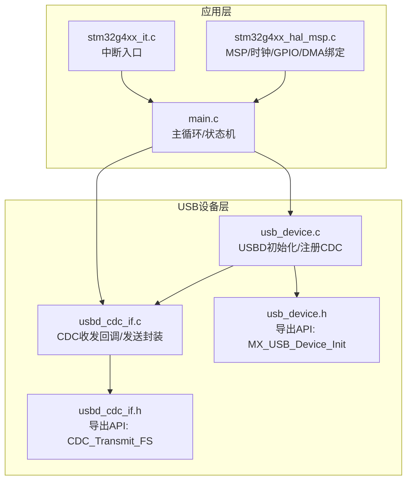
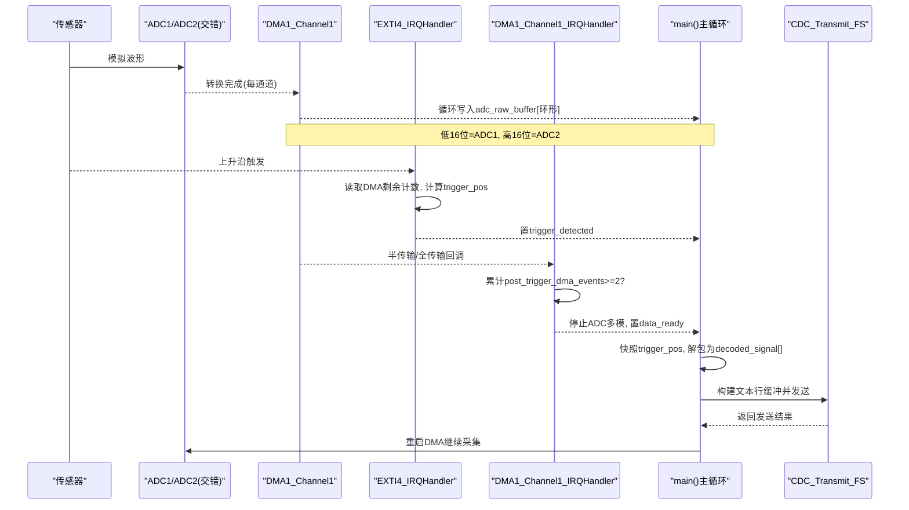
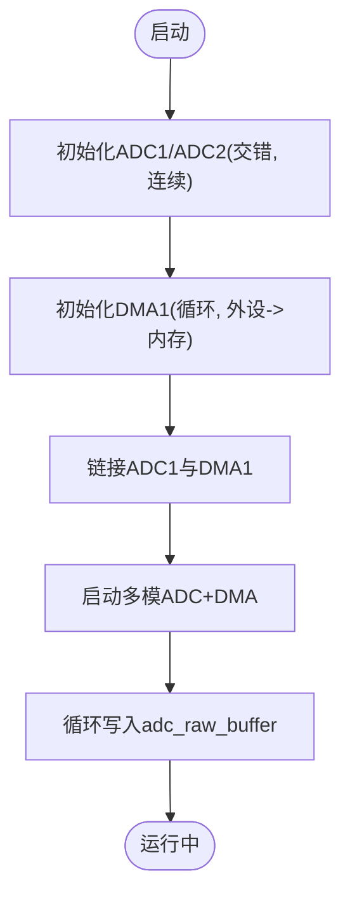
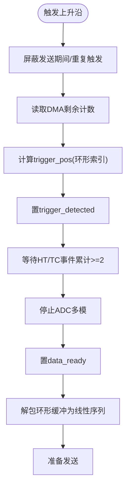
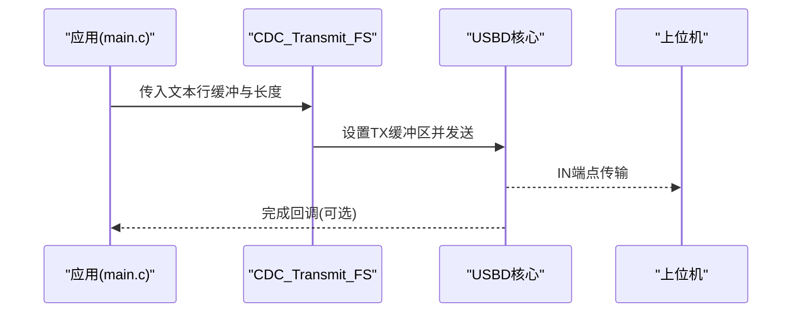
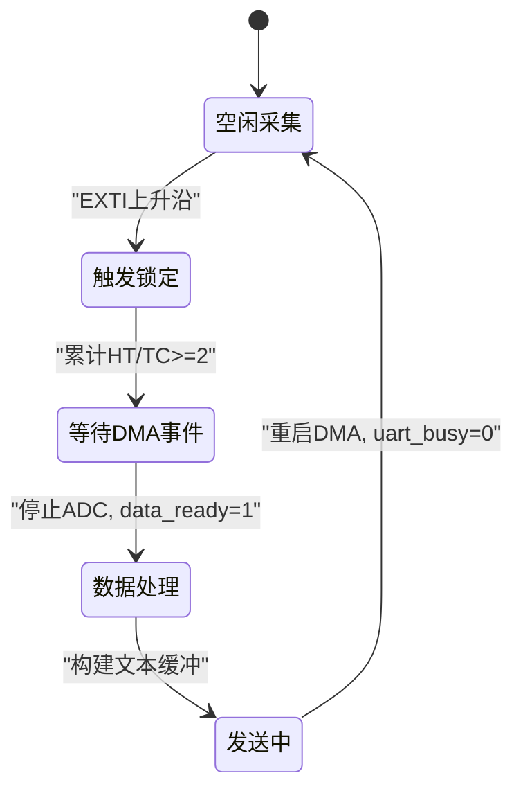
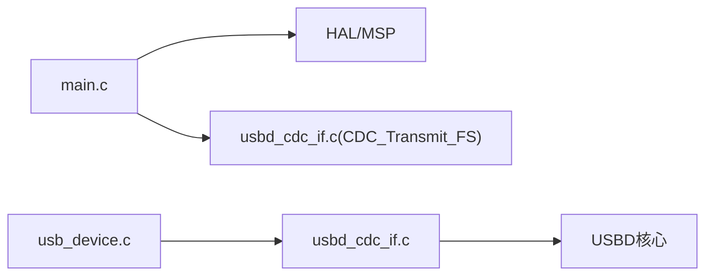

# 系统架构概览

<cite>
**本文引用的文件**   
- [Core/Src/main.c](file://Core/Src/main.c)
- [Core/Inc/main.h](file://Core/Inc/main.h)
- [Core/Src/stm32g4xx_it.c](file://Core/Src/stm32g4xx_it.c)
- [Core/Src/stm32g4xx_hal_msp.c](file://Core/Src/stm32g4xx_hal_msp.c)
- [USB_Device/App/usb_device.c](file://USB_Device/App/usb_device.c)
- [USB_Device/App/usbd_cdc_if.c](file://USB_Device/App/usbd_cdc_if.c)
- [USB_Device/App/usbd_cdc_if.h](file://USB_Device/App/usbd_cdc_if.h)
- [USB_Device/App/usb_device.h](file://USB_Device/App/usb_device.h)
</cite>

## 目录
1. [简介](#简介)
2. [项目结构](#项目结构)
3. [核心组件](#核心组件)
4. [架构总览](#架构总览)
5. [详细组件分析](#详细组件分析)
6. [依赖关系分析](#依赖关系分析)
7. [性能与实时性考虑](#性能与实时性考虑)
8. [故障排查指南](#故障排查指南)
9. [结论](#结论)

## 简介
本文件面向STM32G474超声波信号采集系统的系统架构文档，围绕“数据采集层（ADC+DMA）—处理层（触发检测+数据重组）—通信层（USB CDC）”的分层设计进行说明。重点描述从传感器输入到ADC转换、DMA缓冲管理、触发检测定位、数据解包重组，最终通过USB传输的完整数据流路径；解释中断驱动的事件处理与状态机控制；并通过时序图和数据流图阐明关键操作过程；同时给出错误处理与异常恢复机制建议。

## 项目结构
本项目采用分层组织：
- Core：应用主循环、外设初始化、中断服务程序与MSP配置
- USB_Device：USB设备栈与CDC类接口实现
- Drivers/CMSIS与HAL：芯片抽象与外设驱动库（由工程自动包含）

图表来源
- [Core/Src/main.c:219-290](file://Core/Src/main.c#L219-L290)
- [Core/Src/stm32g4xx_it.c:205-228](file://Core/Src/stm32g4xx_it.c#L205-L228)
- [Core/Src/stm32g4xx_hal_msp.c:92-185](file://Core/Src/stm32g4xx_hal_msp.c#L92-L185)
- [USB_Device/App/usb_device.c:66-88](file://USB_Device/App/usb_device.c#L66-L88)
- [USB_Device/App/usbd_cdc_if.c:281-293](file://USB_Device/App/usbd_cdc_if.c#L281-L293)
- [USB_Device/App/usbd_cdc_if.h:109](file://USB_Device/App/usbd_cdc_if.h#L109)
- [USB_Device/App/usb_device.h:78](file://USB_Device/App/usb_device.h#L78)

章节来源
- [Core/Src/main.c:219-290](file://Core/Src/main.c#L219-L290)
- [USB_Device/App/usb_device.c:66-88](file://USB_Device/App/usb_device.c#L66-L88)

## 核心组件
- 数据采集层
  - ADC1/ADC2双通道交错模式，12位分辨率，连续转换，DMA循环写入uint32_t打包缓冲区（低16位=ADC1，高16位=ADC2）。
  - DMA1通道1，优先级较低，循环模式，外设到内存，内存地址递增。
- 处理层
  - EXTI上升沿触发捕获当前DMA剩余计数，计算环形缓冲触发位置。
  - 等待至少两次DMA事件（半传输+全传输）确保触发后采样数充足，停止多模ADC并置数据就绪标志。
  - 将环形缓冲按时间顺序解包为线性序列，便于后续处理或上传。
- 通信层
  - USB FS CDC虚拟串口，提供CDC_Transmit_FS非阻塞发送接口，上层构建文本行缓冲后一次性发送。

章节来源
- [Core/Src/main.c:47-70](file://Core/Src/main.c#L47-L70)
- [Core/Src/main.c:91-149](file://Core/Src/main.c#L91-L149)
- [Core/Src/main.c:156-212](file://Core/Src/main.c#L156-L212)
- [Core/Src/stm32g4xx_hal_msp.c:127-148](file://Core/Src/stm32g4xx_hal_msp.c#L127-L148)
- [USB_Device/App/usbd_cdc_if.c:281-293](file://USB_Device/App/usbd_cdc_if.c#L281-L293)

## 架构总览
系统采用“中断驱动 + 主循环状态机”的协作式架构：
- 硬件侧：传感器模拟信号经ADC1/ADC2以交错模式高速采样，DMA循环搬运至RAM。
- 触发侧：外部引脚上升沿触发EXTI，在ISR中快速记录触发时刻对应的DMA写指针。
- 处理侧：主循环轮询数据就绪标志，快照触发位置，解包环形缓冲为线性时间线。
- 通信侧：将解码后的样本序列转换为文本行，调用CDC_Transmit_FS发送至主机。

图表来源
- [Core/Src/main.c:91-149](file://Core/Src/main.c#L91-L149)
- [Core/Src/main.c:156-212](file://Core/Src/main.c#L156-L212)
- [Core/Src/stm32g4xx_it.c:205-228](file://Core/Src/stm32g4xx_it.c#L205-L228)
- [USB_Device/App/usbd_cdc_if.c:281-293](file://USB_Device/App/usbd_cdc_if.c#L281-L293)

## 详细组件分析

### 数据采集层（ADC+DMA）
- 工作模式
  - ADC1/ADC2配置为交错模式，单通道，连续转换，DMA请求使能。
  - DMA1通道1配置为循环模式，外设到内存，内存地址自增，字对齐。
- 数据布局
  - adc_raw_buffer为uint32_t环形缓冲，每个元素打包一次ADC1和一次ADC2的12位结果。
- 时钟与GPIO
  - ADC12时钟来自PLL，PA2/PA3用于ADC1_IN3/IN4，PA6/PA7用于ADC2_IN3/IN4。

图表来源
- [Core/Src/main.c:344-464](file://Core/Src/main.c#L344-L464)
- [Core/Src/stm32g4xx_hal_msp.c:92-185](file://Core/Src/stm32g4xx_hal_msp.c#L92-L185)

章节来源
- [Core/Src/main.c:344-464](file://Core/Src/main.c#L344-L464)
- [Core/Src/stm32g4xx_hal_msp.c:92-185](file://Core/Src/stm32g4xx_hal_msp.c#L92-L185)

### 处理层（触发检测+数据重组）
- 触发检测
  - EXTI4上升沿触发，屏蔽UART发送期间的回显干扰，避免重复触发。
  - 通过读取DMA剩余计数推算环形缓冲中的触发索引trigger_pos。
- 数据就绪判定
  - 使用半传输/全传输回调累计事件，达到阈值后停止ADC多模并置data_ready。
- 数据重组
  - 基于snapshot的trigger_pos，从环形缓冲起始点开始顺序解包为线性decoded_signal数组。

图表来源
- [Core/Src/main.c:91-149](file://Core/Src/main.c#L91-L149)
- [Core/Src/main.c:156-171](file://Core/Src/main.c#L156-L171)

章节来源
- [Core/Src/main.c:91-149](file://Core/Src/main.c#L91-L149)
- [Core/Src/main.c:156-171](file://Core/Src/main.c#L156-L171)

### 通信层（USB CDC）
- 设备初始化
  - 初始化USBD，注册CDC类与接口函数表，启动设备。
- 发送流程
  - 上层构造文本行缓冲，调用CDC_Transmit_FS；若端点忙则重试。
  - 底层设置TX缓冲区并发起数据包发送，完成后回调通知。

图表来源
- [USB_Device/App/usb_device.c:66-88](file://USB_Device/App/usb_device.c#L66-L88)
- [USB_Device/App/usbd_cdc_if.c:281-293](file://USB_Device/App/usbd_cdc_if.c#L281-L293)

章节来源
- [USB_Device/App/usb_device.c:66-88](file://USB_Device/App/usb_device.c#L66-L88)
- [USB_Device/App/usbd_cdc_if.c:281-293](file://USB_Device/App/usbd_cdc_if.c#L281-L293)

### 中断与状态机
- 中断入口
  - EXTI4_IRQHandler转发至HAL回调；DMA1_Channel1_IRQHandler转发至HAL DMA处理。
- 状态机要点
  - 主循环轮询data_ready，进入“快照触发位置→解包→发送→重启DMA”的状态转移。
  - 使用uart_busy作为互斥锁，防止发送期间误触发。

图表来源
- [Core/Src/stm32g4xx_it.c:205-228](file://Core/Src/stm32g4xx_it.c#L205-L228)
- [Core/Src/main.c:259-290](file://Core/Src/main.c#L259-L290)

章节来源
- [Core/Src/stm32g4xx_it.c:205-228](file://Core/Src/stm32g4xx_it.c#L205-L228)
- [Core/Src/main.c:259-290](file://Core/Src/main.c#L259-L290)

## 依赖关系分析
- main.c依赖
  - HAL外设初始化与回调（ADC、DMA、GPIO、USB）
  - USB CDC接口函数CDC_Transmit_FS
- usb_device.c依赖
  - USBD核心与CDC类接口
- usbd_cdc_if.c依赖
  - USBD句柄与CDC内部状态，提供CDC_Transmit_FS对外API

图表来源
- [Core/Src/main.c:219-290](file://Core/Src/main.c#L219-L290)
- [USB_Device/App/usb_device.c:66-88](file://USB_Device/App/usb_device.c#L66-L88)
- [USB_Device/App/usbd_cdc_if.c:281-293](file://USB_Device/App/usbd_cdc_if.c#L281-L293)

章节来源
- [Core/Src/main.c:219-290](file://Core/Src/main.c#L219-L290)
- [USB_Device/App/usb_device.c:66-88](file://USB_Device/App/usb_device.c#L66-L88)
- [USB_Device/App/usbd_cdc_if.c:281-293](file://USB_Device/App/usbd_cdc_if.c#L281-L293)

## 性能与实时性考虑
- 采样率与时序
  - 交错模式提升有效采样率；DMA循环降低CPU参与，保证稳定吞吐。
- 触发精度
  - 在EXTI中仅做最小化操作（读NDTR、计算索引），避免长耗时逻辑影响抖动。
- 数据重组
  - 使用snapshot的trigger_pos避免并发竞争，减少重入风险。
- 发送策略
  - 批量构建文本缓冲再单次发送，减少多次USB事务开销；必要时可改为二进制帧格式进一步压缩体积。
- 功耗与频率
  - 系统时钟与ADC时钟配置需兼顾速度与功耗；必要时可在空闲阶段降频。

[本节为通用指导，不直接分析具体文件]

## 故障排查指南
- 常见问题
  - 无触发：检查EXTI引脚配置与中断优先级；确认uart_busy未长期置位导致屏蔽。
  - 数据错乱：确认DMA循环模式与环形缓冲大小匹配；检查解包起始索引计算是否越界。
  - 发送失败：检查CDC_Transmit_FS返回值是否为忙；确认USB枚举成功且端口可用。
- 错误处理
  - 初始化失败统一进入Error_Handler；建议在调试时加入LED闪烁或USB日志输出以便定位。
- 恢复机制
  - 每次发送完成后重启ADC+DMA，确保下一次采集可用；若发生异常，可在主循环增加看门狗复位或软复位。

章节来源
- [Core/Src/main.c:530-539](file://Core/Src/main.c#L530-L539)
- [Core/Src/main.c:259-290](file://Core/Src/main.c#L259-L290)

## 结论
本系统以“中断驱动+主循环状态机”的方式实现了稳定的超声波信号采集与传输：ADC+DMA负责高效采集，EXTI+DMA事件组合保障触发定位与数据完整性，USB CDC提供便捷的数据上送通道。整体架构清晰、模块职责明确，具备较好的可扩展性与可维护性。后续可进一步优化数据格式（二进制帧）、引入FIFO与双缓冲、增强错误统计与诊断能力，以满足更高吞吐与更严苛的实时性需求。